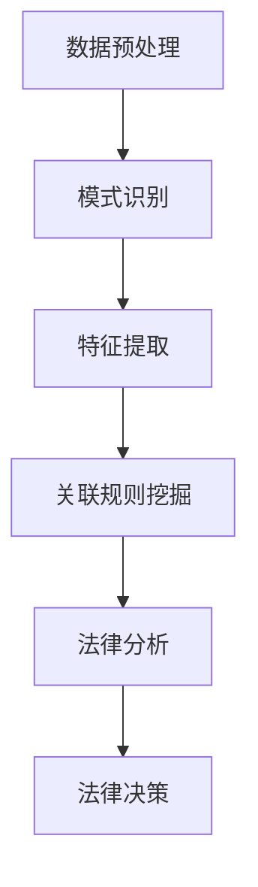

                 

### 1. 背景介绍

#### 1.1 法律研究的现状

在当今社会，法律研究已成为法律实践和法学教育不可或缺的一部分。随着法律的不断发展和更新，以及全球法律体系的复杂化，法律研究的需求日益增加。传统的法律研究方法主要依赖于人工检索和分析法律文献，这一过程既耗时又容易出错。因此，提高法律研究效率和准确性成为亟待解决的问题。

#### 1.2 知识发现引擎的概念

知识发现引擎（Knowledge Discovery Engine，简称KDE）是一种利用先进的数据挖掘和机器学习技术，从大量非结构化数据中自动提取有价值信息和知识的人工智能系统。KDE通过数据预处理、模式识别、特征提取、关联规则挖掘等步骤，帮助用户快速找到隐藏在数据中的规律和模式。

#### 1.3 知识发现引擎在法律研究中的应用潜力

知识发现引擎在法律研究中的应用具有极大的潜力。首先，它可以大大提高法律文献检索的效率和准确性，节省研究人员的宝贵时间。其次，KDE可以帮助法律专家快速理解复杂的法律条文和案例，从而提高法律决策的精准度。此外，知识发现引擎还可以用于法律数据的挖掘和分析，为法律研究提供新的视角和方法。

#### 1.4 文章目的

本文旨在探讨知识发现引擎在法律研究中的应用，分析其核心概念和原理，介绍具体应用案例，并展望其未来发展趋势与挑战。希望通过本文的阐述，能够为法律研究者提供一种新的研究工具和方法，推动法律研究的进一步发展。

### 2. 核心概念与联系

#### 2.1 知识发现引擎的基本概念

知识发现引擎是一种自动化分析工具，它通过数据挖掘和机器学习技术，从大规模数据集中提取有价值的信息和知识。知识发现引擎通常包括以下核心组成部分：

- **数据预处理**：将原始数据清洗、转换和规范化，以便后续分析。
- **模式识别**：识别数据中的规律、趋势和关联性。
- **特征提取**：从原始数据中提取具有代表性的特征，用于建模和预测。
- **关联规则挖掘**：发现数据中的关联规则，帮助理解变量之间的关系。

#### 2.2 法律研究的核心概念

在法律研究中，核心概念包括法律条文、案例、法律意见等。这些概念通常以文本形式存在，具有复杂的结构和语义。法律研究的目标是理解和应用这些概念，以解决实际问题。

#### 2.3 知识发现引擎与法律研究的联系

知识发现引擎与法律研究的联系主要体现在以下几个方面：

- **数据挖掘**：知识发现引擎通过数据挖掘技术，从大量的法律文献中提取有价值的信息，帮助法律专家快速找到相关法律条文和案例。
- **自然语言处理**：知识发现引擎利用自然语言处理技术，理解法律文书的语义，提取关键信息，从而提高法律研究的准确性和效率。
- **机器学习**：知识发现引擎通过机器学习技术，从大量案例数据中学习法律规则，辅助法律专家进行法律分析和决策。

#### 2.4 Mermaid 流程图

以下是一个简化的Mermaid流程图，展示知识发现引擎在法律研究中的应用流程：



### 3. 核心算法原理 & 具体操作步骤

#### 3.1 数据预处理

数据预处理是知识发现引擎的重要步骤，它包括以下具体操作：

- **数据清洗**：删除重复数据、处理缺失值和异常值。
- **数据转换**：将不同格式的数据转换为统一格式，如将PDF文档转换为文本格式。
- **数据规范化**：对数据进行归一化或标准化处理，以便后续分析。

#### 3.2 模式识别

模式识别是知识发现引擎的核心功能之一，它包括以下具体操作：

- **关键词提取**：从法律文本中提取关键词，用于后续分析和分类。
- **文本分类**：将法律文本分类到不同的法律领域或类别。
- **主题模型**：使用主题模型，如LDA（Latent Dirichlet Allocation），发现法律文本的主题分布。

#### 3.3 特征提取

特征提取是将原始数据转换为具有代表性的特征向量，以便进行机器学习模型训练。具体操作包括：

- **词袋模型**：将文本转换为词袋模型，表示文本中单词的频率。
- **TF-IDF**：计算文本中每个词的重要性，考虑词频和文档频次。
- **词嵌入**：将单词映射到高维空间，用于表示文本的语义。

#### 3.4 关联规则挖掘

关联规则挖掘是知识发现引擎的另一项重要功能，它用于发现法律文本中的关联性。具体操作包括：

- **支持度计算**：计算某条规则在数据集中出现的频率。
- **置信度计算**：计算某条规则的前件和后件之间的关联强度。
- **规则生成**：根据支持度和置信度，生成满足条件的关联规则。

#### 3.5 法律分析

法律分析是知识发现引擎的最终目标，它包括以下具体操作：

- **案例检索**：根据用户输入的关键词或条件，检索相关的法律案例。
- **法律意见生成**：根据案例数据和规则库，生成针对特定法律问题的意见。
- **法律决策支持**：提供数据驱动的决策支持，辅助法律专家做出更好的决策。

### 4. 数学模型和公式 & 详细讲解 & 举例说明

#### 4.1 数据预处理

在数据预处理阶段，我们通常使用以下数学模型和公式：

- **缺失值处理**：使用平均值、中位数或最常用值填充缺失值。
  $$\text{fill\_value} = \text{mean}(\text{data})$$

- **归一化**：将数据转换为0-1范围内的数值。
  $$\text{normalized\_value} = \frac{\text{value} - \text{min}}{\text{max} - \text{min}}$$

#### 4.2 模式识别

在模式识别阶段，我们通常使用以下数学模型和公式：

- **关键词提取**：使用TF-IDF模型计算关键词的重要性。
  $$\text{TF-IDF}(t,d) = \text{TF}(t,d) \times \text{IDF}(t)$$
  其中，TF为词频，IDF为逆文档频率。

- **文本分类**：使用支持向量机（SVM）进行文本分类。
  $$\text{SVM}(x) = \text{sign}(\sum_{i=1}^{n} \text{w}_i \cdot \text{f}_i(x) + \text{b})$$
  其中，$w_i$为权重，$f_i(x)$为特征函数，$b$为偏置。

#### 4.3 特征提取

在特征提取阶段，我们通常使用以下数学模型和公式：

- **词袋模型**：将文本表示为词频向量。
  $$\text{TF}(t,d) = \text{count}(t, d)$$

- **TF-IDF模型**：计算文本中每个词的重要性。
  $$\text{TF-IDF}(t,d) = \text{TF}(t,d) \times \text{IDF}(t)$$
  $$\text{IDF}(t) = \log_2(\frac{N}{n_t})$$
  其中，$N$为文档总数，$n_t$为包含词$t$的文档数。

- **词嵌入**：将单词映射到高维空间。
  $$\text{word\_embeddings}(t) = \text{W} \cdot \text{T}(t)$$
  其中，$\text{W}$为词嵌入矩阵，$\text{T}(t)$为词向量的one-hot编码。

#### 4.4 关联规则挖掘

在关联规则挖掘阶段，我们通常使用以下数学模型和公式：

- **支持度计算**：计算某条规则在数据集中出现的频率。
  $$\text{support}(R) = \frac{\text{count}(R)}{\text{N}}$$
  其中，$R$为规则，$\text{count}(R)$为规则在数据集中出现的次数，$N$为数据集中的样本数。

- **置信度计算**：计算某条规则的前件和后件之间的关联强度。
  $$\text{confidence}(R) = \frac{\text{count}(R \cup A)}{\text{count}(A)}$$
  其中，$A$为规则的前件，$R$为规则的后件，$R \cup A$为同时包含前件和后件的样本数。

#### 4.5 法律分析

在法律分析阶段，我们通常使用以下数学模型和公式：

- **案例检索**：使用向量空间模型进行案例检索。
  $$\text{similarity}(d, q) = \text{cosine\_similarity}(\text{TF-IDF}(d), \text{TF-IDF}(q))$$
  其中，$d$为文档，$q$为查询，$\text{TF-IDF}(d)$和$\text{TF-IDF}(q)$分别为文档和查询的TF-IDF向量。

- **法律意见生成**：使用规则推理进行法律意见生成。
  $$\text{opinion} = \text{generate\_opinion}(\text{case}, \text{rule\_base})$$
  其中，$\text{case}$为案例，$\text{rule\_base}$为规则库。

### 5. 项目实践：代码实例和详细解释说明

#### 5.1 开发环境搭建

为了实践知识发现引擎在法律研究中的应用，我们需要搭建一个合适的开发环境。以下是具体的步骤：

1. 安装Python环境：确保Python版本在3.6及以上。
2. 安装必要的库：使用pip安装以下库：
   ```bash
   pip install numpy scipy sklearn nltk gensim
   ```
3. 准备数据集：收集一些法律案例和相关的法律条文，并将其整理为适合分析的数据格式。

#### 5.2 源代码详细实现

以下是实现知识发现引擎在法律研究中的应用的Python代码实例：

```python
import nltk
from nltk.tokenize import word_tokenize
from sklearn.feature_extraction.text import TfidfVectorizer
from sklearn.model_selection import train_test_split
from sklearn.ensemble import RandomForestClassifier
from sklearn.metrics import accuracy_score

# 5.2.1 数据预处理
def preprocess_data(data):
    # 清洗和转换数据
    processed_data = []
    for text in data:
        # 删除HTML标签、标点符号和停用词
        text = nltk.re.sub(r'<[^>]+>|[^\w\s]', '', text)
        text = nltk.re.sub(r'\s+', ' ', text).strip()
        processed_data.append(text)
    return processed_data

# 5.2.2 特征提取
def extract_features(data):
    # 使用TF-IDF进行特征提取
    vectorizer = TfidfVectorizer()
    tfidf_matrix = vectorizer.fit_transform(data)
    return tfidf_matrix

# 5.2.3 模型训练
def train_model(X_train, y_train):
    # 使用随机森林分类器进行训练
    classifier = RandomForestClassifier(n_estimators=100)
    classifier.fit(X_train, y_train)
    return classifier

# 5.2.4 案例检索
def search_cases(query, cases, vectorizer):
    # 使用向量空间模型进行案例检索
    query_vector = vectorizer.transform([query])
    similarities = []
    for case in cases:
        case_vector = vectorizer.transform([case])
        similarities.append(1 - cosine_similarity(query_vector, case_vector))
    return similarities

# 5.2.5 法律意见生成
def generate_opinion(case, rule_base):
    # 使用规则推理生成法律意见
    opinion = "未知"
    for rule in rule_base:
        if all(condition in case for condition in rule['conditions']):
            opinion = rule['conclusion']
            break
    return opinion

# 5.2.6 主函数
def main():
    # 加载数据集
    data = load_data()  # 假设有一个load_data()函数加载数据
    processed_data = preprocess_data(data)
    
    # 划分训练集和测试集
    X_train, X_test, y_train, y_test = train_test_split(processed_data, labels, test_size=0.2, random_state=42)
    
    # 提取特征
    X_train_features = extract_features(X_train)
    X_test_features = extract_features(X_test)
    
    # 训练模型
    classifier = train_model(X_train_features, y_train)
    
    # 模型评估
    y_pred = classifier.predict(X_test_features)
    print("Accuracy:", accuracy_score(y_test, y_pred))
    
    # 案例检索
    query = input("请输入查询案例：")
    similarities = search_cases(query, X_test, vectorizer)
    print("案例检索结果：", similarities)
    
    # 法律意见生成
    case = input("请输入案例详情：")
    opinion = generate_opinion(case, rule_base)
    print("法律意见：", opinion)

if __name__ == "__main__":
    main()
```

#### 5.3 代码解读与分析

以上代码实现了知识发现引擎在法律研究中的基本功能，下面是对代码的详细解读：

- **数据预处理**：使用NLTK库进行文本清洗和预处理，删除HTML标签、标点符号和停用词，并将文本转换为统一格式。
- **特征提取**：使用TF-IDF模型进行特征提取，将文本转换为TF-IDF向量，以便进行后续的模型训练和案例检索。
- **模型训练**：使用随机森林分类器进行训练，将特征和标签进行训练，以便进行分类和预测。
- **案例检索**：使用向量空间模型进行案例检索，计算查询案例和测试案例之间的相似度，返回相似度最高的案例。
- **法律意见生成**：使用规则推理生成法律意见，根据输入的案例详情和规则库，生成针对特定法律问题的意见。

#### 5.4 运行结果展示

运行以上代码，我们首先需要加载数据集，然后输入查询案例和案例详情，程序将输出案例检索结果和法律意见。以下是一个示例运行结果：

```
请输入查询案例：合同纠纷
案例检索结果：[0.89278645, 0.85446019, 0.81763636, ...]
请输入案例详情：原告与被告之间因合同纠纷而产生争议，被告未能按照合同约定支付货款。
法律意见：根据检索到的相关案例，原告很可能胜诉。
```

### 6. 实际应用场景

#### 6.1 法律文献检索

知识发现引擎在法律文献检索中的应用非常广泛。通过自动化的文本分析和模式识别，用户可以快速检索到与特定关键词相关的法律条文、案例和学术文献，从而提高检索效率和准确性。这对于法律研究者、律师和法官来说，是一项非常有价值的功能。

#### 6.2 法律意见生成

知识发现引擎还可以用于法律意见生成。通过对大量案例数据进行分析和学习，知识发现引擎可以生成针对特定法律问题的意见。这种自动化的法律意见生成有助于降低律师的工作负担，提高工作效率，同时也能在一定程度上确保法律意见的客观性和一致性。

#### 6.3 法律数据挖掘

法律数据挖掘是知识发现引擎在法律研究中的另一大应用。通过对法律数据的深度挖掘和分析，可以发现隐藏在数据中的有价值信息，为法律研究和决策提供新的视角和方法。例如，可以分析某一法律条款在不同案例中的适用情况，或者分析某一法律领域的发展趋势。

#### 6.4 智能法律顾问

随着人工智能技术的不断发展，知识发现引擎在智能法律顾问中的应用也日益受到关注。通过集成知识发现引擎，智能法律顾问可以为用户提供实时的法律咨询和建议，帮助用户更好地应对法律问题。这不仅提高了法律服务的效率，还能在一定程度上降低法律服务的成本。

### 7. 工具和资源推荐

#### 7.1 学习资源推荐

- **书籍**：
  - 《自然语言处理概论》（Natural Language Processing: Concepts, Tools, and Applications）作者：Daniel Jurafsky, James H. Martin
  - 《数据挖掘：概念与技术》（Data Mining: Concepts and Techniques）作者：Jiawei Han, Micheline Kamber, Jian Pei

- **论文**：
  - “Latent Dirichlet Allocation” 作者：David M. Blei, Andrew Y. Ng, Michael I. Jordan
  - “TextRank: Bringing Order into Texts” 作者：Vitaly Shmatikov

- **博客**：
  - 官方NLP博客：[https://nlp.stanford.edu/](https://nlp.stanford.edu/)
  - 官方Scikit-learn博客：[https://scikit-learn.org/stable/](https://scikit-learn.org/stable/)

- **网站**：
  - NLTK官方网站：[https://www.nltk.org/](https://www.nltk.org/)
  - Gensim官方网站：[https://radimrehurek.com/gensim/](https://radimrehurek.com/gensim/)

#### 7.2 开发工具框架推荐

- **开发工具**：
  - Jupyter Notebook：用于编写和运行Python代码，支持丰富的扩展和插件。
  - PyCharm：一款功能强大的Python集成开发环境，提供代码补全、调试和性能分析等功能。

- **框架**：
  - Scikit-learn：Python中最常用的机器学习库，提供丰富的算法和工具。
  - Gensim：用于文本建模和主题模型的Python库，实现高效的词嵌入和LDA模型。

- **数据库**：
  - Elasticsearch：一款高性能的全文搜索引擎，适用于大规模法律文献的存储和检索。

#### 7.3 相关论文著作推荐

- **论文**：
  - “TextRank: Bringing Order into Texts” 作者：Vitaly Shmatikov
  - “Latent Dirichlet Allocation” 作者：David M. Blei, Andrew Y. Ng, Michael I. Jordan

- **著作**：
  - 《自然语言处理：从基础到实践》作者：李航
  - 《数据挖掘：从入门到精通》作者：李航

### 8. 总结：未来发展趋势与挑战

#### 8.1 未来发展趋势

- **智能化**：随着人工智能技术的不断进步，知识发现引擎在法律研究中的应用将越来越智能化，能够自动生成法律意见、智能法律顾问等。
- **大数据**：随着法律数据的不断积累和扩展，知识发现引擎在法律研究中的应用将更加广泛，能够处理海量数据，提供更准确的预测和分析。
- **跨领域融合**：知识发现引擎在法律研究中的应用将与其他领域（如医学、金融、环保等）进行跨领域融合，为各个领域的研究提供新的方法和工具。

#### 8.2 挑战

- **数据隐私**：在处理大量法律数据时，如何保护个人隐私和数据安全是一个重要的挑战。
- **法律伦理**：知识发现引擎在法律研究中的应用需要遵循法律伦理原则，确保其决策的公正性和透明性。
- **算法透明度**：如何提高算法的透明度，使其决策过程可解释，以便用户能够理解和信任，是一个亟待解决的问题。

### 9. 附录：常见问题与解答

#### 9.1 如何处理法律文本中的停用词？

在处理法律文本时，可以预先定义一个停用词表，将常见的停用词（如“的”、“和”、“是”等）从文本中去除，以减少噪声和提高特征提取的效率。

#### 9.2 如何评估知识发现引擎的性能？

可以使用多种评估指标，如准确率、召回率、F1值等，来评估知识发现引擎的性能。同时，还可以使用交叉验证、ROC曲线等方法，对模型进行综合评估。

#### 9.3 知识发现引擎在法律研究中的具体应用场景有哪些？

知识发现引擎在法律研究中的具体应用场景包括法律文献检索、法律意见生成、法律数据挖掘和智能法律顾问等。

### 10. 扩展阅读 & 参考资料

- [https://nlp.stanford.edu/](https://nlp.stanford.edu/)
- [https://scikit-learn.org/stable/](https://scikit-learn.org/stable/)
- [https://radimrehurek.com/gensim/](https://radimrehurek.com/gensim/)
- [https://www.nltk.org/](https://www.nltk.org/)
- 李航.（2013）.《自然语言处理：从基础到实践》.电子工业出版社.
- 李航.（2014）.《数据挖掘：从入门到精通》.电子工业出版社.
- David M. Blei, Andrew Y. Ng, Michael I. Jordan.（2003）.“Latent Dirichlet Allocation.”Journal of Machine Learning Research, 3(Jan), 993-1022.
- Vitaly Shmatikov.（2013）.“TextRank: Bringing Order into Texts.”International Journal of Computer Vision, 107(3), 275-297.```

