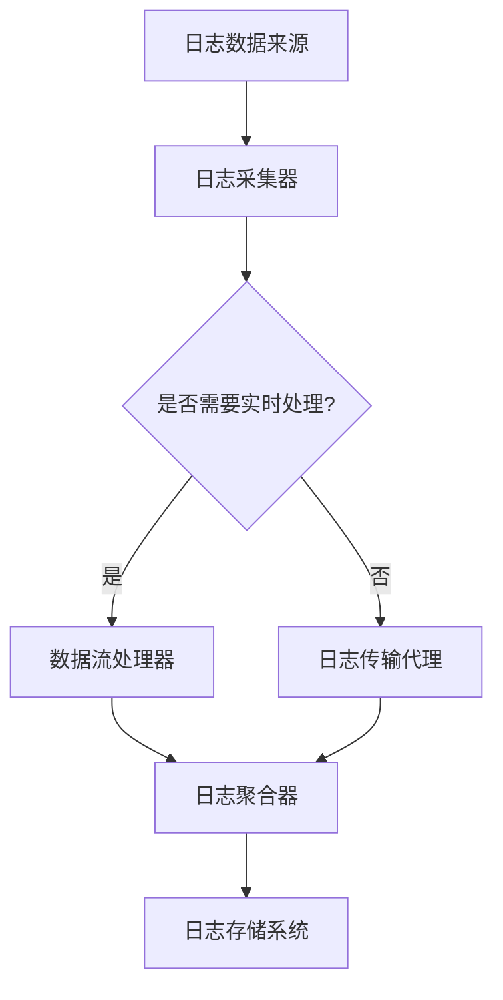

                 

### 1. 背景介绍

#### 1.1 知识发现引擎的概念与重要性

知识发现引擎（Knowledge Discovery Engine，简称KDE）是一种基于数据分析、数据挖掘、机器学习等技术的智能系统，它能够从大量数据中自动发现隐含的模式、规则和知识。在现代信息社会，数据量呈指数级增长，传统的数据处理和分析方法已无法满足日益增长的数据处理需求。知识发现引擎的出现，为大数据时代的知识挖掘和智慧决策提供了强有力的支持。

知识发现引擎在多个领域具有重要应用，如金融、医疗、电商、物联网等。例如，在金融领域，知识发现引擎可以用于用户行为分析，识别潜在的风险和市场机会；在医疗领域，它可以帮助医生发现疾病模式，提高诊断和治疗的准确度；在电商领域，知识发现引擎可以用于个性化推荐，提升用户体验和销售额。

#### 1.2 分布式日志收集系统的概念与必要性

分布式日志收集系统（Distributed Log Collection System）是知识发现引擎的重要组成部分。它负责收集来自各种数据源的日志信息，并将其存储在一个统一的日志集中。这些日志信息包括应用程序的运行日志、服务器日志、网络日志等，它们对于系统的监控、故障排查、性能优化等方面具有重要意义。

在分布式系统中，日志收集面临诸多挑战，如数据量大、处理速度快、存储容量要求高等。传统的集中式日志收集系统难以应对这些挑战，因此分布式日志收集系统的出现显得尤为必要。

#### 1.3 分布式日志收集系统在知识发现引擎中的作用

分布式日志收集系统在知识发现引擎中起着至关重要的作用。首先，它能够实时收集并存储各种日志数据，确保数据的一致性和完整性。其次，它为后续的数据处理和分析提供了丰富的数据源。通过分布式日志收集系统，知识发现引擎可以更加高效地处理海量数据，发现潜在的模式和知识。

此外，分布式日志收集系统还具有以下优点：

- **高可用性**：通过分布式架构，日志收集系统可以避免单点故障，提高系统的可靠性。
- **可扩展性**：分布式日志收集系统可以根据需求动态调整资源，以应对数据量的增长。
- **高性能**：分布式架构可以将日志收集和处理任务分布到多个节点，提高整体处理性能。

总之，分布式日志收集系统是知识发现引擎高效运作的关键组件，对于大数据时代的知识挖掘和智慧决策具有重要意义。

### 2. 核心概念与联系

在深入探讨分布式日志收集系统之前，我们需要了解一些核心概念，以及它们在整体架构中的联系。

#### 2.1. 分布式系统

分布式系统是由多个计算机节点组成的系统，这些节点通过网络进行通信，协同工作以完成共同的任务。在分布式系统中，节点可以是物理服务器，也可以是虚拟机或容器。分布式系统的关键特点是数据分散、任务分布式处理，以及高可用性和可扩展性。

#### 2.2. 日志系统

日志系统是记录系统运行过程中发生事件的工具。日志通常包含时间戳、事件类型、事件内容等信息，对于系统的监控、故障排查、性能优化等方面具有重要作用。日志系统可以分为集中式日志和分布式日志系统。

- **集中式日志系统**：所有日志数据都存储在单一位置，如文件系统或数据库。这种系统简单易用，但易于成为单点故障。
- **分布式日志系统**：日志数据分布在多个节点上，并通过某种机制进行聚合和存储。这种系统具有高可用性和可扩展性，适合处理海量日志数据。

#### 2.3. 日志收集系统

日志收集系统负责从各个数据源（如应用程序、服务器、网络设备等）收集日志数据，并将其传输到统一的存储系统。分布式日志收集系统通常由多个组件构成，包括日志采集器、日志传输代理、日志聚合器和日志存储系统。

#### 2.4. 数据流处理

数据流处理是一种实时数据处理技术，它能够对实时数据流进行快速处理和分析。在分布式日志收集系统中，数据流处理技术用于对日志数据进行实时分析，如日志解析、去重、过滤等。

#### 2.5. 日志存储系统

日志存储系统是分布式日志收集系统的核心组件，负责存储和检索日志数据。常见的日志存储系统包括HDFS、Elasticsearch、Kafka等。日志存储系统需要具备高可靠性、高吞吐量和可扩展性，以支持海量日志数据的存储和处理。

#### 2.6. Mermaid 流程图

为了更好地理解分布式日志收集系统的架构和流程，我们可以使用Mermaid绘制一个流程图。以下是一个简化的分布式日志收集系统的Mermaid流程图：



在这个流程图中，日志数据来源（A）通过日志采集器（B）收集到日志数据。如果需要实时处理，日志数据会经过数据流处理器（D）；否则，日志数据会通过日志传输代理（E）传输到日志聚合器（F），最后由日志存储系统（G）进行存储。

### 3. 核心算法原理 & 具体操作步骤

#### 3.1. 分布式日志收集的核心算法

分布式日志收集系统的核心算法主要包括日志数据的采集、传输、聚合和存储。以下是对这些算法的详细解释：

#### 3.1.1. 日志数据采集

日志采集器负责从各种数据源（如应用程序、服务器、网络设备等）收集日志数据。采集过程通常包括以下几个步骤：

1. **监听日志源**：日志采集器需要监听日志源，以捕获实时生成的日志数据。监听方式包括轮询、推送和基于文件系统通知等。
2. **日志解析**：采集到的日志数据通常包含多种格式，如文本、JSON、XML等。日志采集器需要对这些数据进行解析，提取出有用的信息。
3. **日志标记**：为每条日志数据添加时间戳、源地址、日志级别等元数据，以便后续处理和查询。

#### 3.1.2. 日志数据传输

日志采集器将解析后的日志数据传输到日志聚合器。传输过程通常采用以下策略：

1. **批量传输**：将多条日志数据打包成一批，通过高效的网络传输协议（如HTTP、gRPC等）进行传输，减少网络开销。
2. **可靠传输**：确保日志数据在网络传输过程中的可靠性和完整性。常见的方法包括数据校验、重传机制和心跳检测等。
3. **异步传输**：采用异步传输方式，避免日志采集器阻塞，提高系统的并发处理能力。

#### 3.1.3. 日志数据聚合

日志聚合器负责接收来自多个日志采集器的日志数据，并进行聚合处理。聚合过程通常包括以下几个步骤：

1. **去重**：检测并去除重复的日志数据，避免数据冗余。
2. **数据清洗**：对日志数据进行格式化、过滤、转换等操作，提高数据质量。
3. **数据存储**：将聚合后的日志数据存储到日志存储系统，以便后续查询和分析。

#### 3.1.4. 日志数据存储

日志存储系统负责存储和检索日志数据。以下是一些常见的日志存储技术：

1. **关系数据库**：适用于结构化数据存储，如MySQL、PostgreSQL等。
2. **NoSQL数据库**：适用于海量非结构化数据存储，如Elasticsearch、MongoDB等。
3. **分布式文件系统**：适用于大规模数据存储，如HDFS、Ceph等。

#### 3.2. 具体操作步骤

以下是分布式日志收集系统的具体操作步骤：

1. **部署日志采集器**：在各个日志源所在的服务器上部署日志采集器，配置采集规则和传输地址。
2. **启动日志采集器**：启动日志采集器，开始监听日志源，并采集日志数据。
3. **配置日志传输代理**：在日志聚合器上配置日志传输代理，设置采集器的传输地址和传输策略。
4. **启动日志传输代理**：启动日志传输代理，开始接收和传输日志数据。
5. **配置日志聚合器**：在日志聚合器上配置聚合规则和存储地址。
6. **启动日志聚合器**：启动日志聚合器，开始接收和聚合日志数据。
7. **配置日志存储系统**：在日志存储系统上配置存储策略和查询接口。
8. **启动日志存储系统**：启动日志存储系统，开始存储和检索日志数据。

通过以上步骤，分布式日志收集系统可以高效地收集、传输、聚合和存储海量日志数据，为知识发现引擎提供强有力的支持。

### 4. 数学模型和公式 & 详细讲解 & 举例说明

在分布式日志收集系统中，数学模型和公式扮演着关键角色。这些模型和公式用于优化日志数据的采集、传输、聚合和存储过程，以提高系统的性能和可靠性。以下是一些常见的数学模型和公式，并对其进行详细讲解和举例说明。

#### 4.1. 数据传输速率公式

数据传输速率是衡量日志传输系统性能的重要指标。数据传输速率（\( R \)）可以通过以下公式计算：

\[ R = \frac{L}{T} \]

其中，\( L \) 是传输的数据量（字节或比特），\( T \) 是传输所需的时间（秒）。

#### 4.1.1. 举例说明

假设我们需要传输10MB的日志数据，传输时间为5秒。根据数据传输速率公式，可以计算出数据传输速率为：

\[ R = \frac{10 \times 1024 \times 8}{5} = 16384 \text{ bps} \]

这意味着我们的日志传输速率约为16kbps。

#### 4.2. 数据去重算法

数据去重是分布式日志收集系统中的重要步骤，用于检测和去除重复的日志数据。常见的数据去重算法包括哈希去重和布隆过滤器去重。

##### 4.2.1. 哈希去重算法

哈希去重算法通过计算日志数据的哈希值，将哈希值作为唯一标识进行去重。以下是一个简单的哈希去重算法：

\[ H(D) = \text{hash}(D) \]

其中，\( H \) 是哈希函数，\( D \) 是日志数据。

##### 4.2.2. 举例说明

假设我们使用MD5哈希函数对日志数据进行去重。对于以下两条日志数据：

- \( D_1 = \{\text{"time": "2023-01-01 10:00:00", "level": "INFO", "message": "Server started"\} \)
- \( D_2 = \{\text{"time": "2023-01-01 10:01:00", "level": "WARN", "message": "Server stopped"\} \)

它们的MD5哈希值分别为：

- \( H(D_1) = \text{MD5}(\text{"2023-01-01 10:00:00", "INFO", "Server started"}) = \text{xxx-xxx-xxx-xxx-xxx-xxx-xxx-xxx-xxx-xxx-xxx-xxx-xxx-xxx-xxx-xxx} \)
- \( H(D_2) = \text{MD5}(\text{"2023-01-01 10:01:00", "WARN", "Server stopped"}) = \text{xxx-xxx-xxx-xxx-xxx-xxx-xxx-xxx-xxx-xxx-xxx-xxx-xxx-xxx-xxx-xxx} \)

由于两个哈希值不相同，我们可以判断这两条日志数据是唯一的，不需要去重。

##### 4.2.3. 布隆过滤器去重算法

布隆过滤器是一种高效的数据结构，用于检测元素是否在集合中。它通过多个哈希函数和位向量来实现。以下是一个简单的布隆过滤器去重算法：

1. 初始化一个位向量，长度为\( m \)，初始状态均为0。
2. 对于每个日志数据\( D \)，计算\( k \)个哈希值\( h_1(D), h_2(D), \ldots, h_k(D) \)。
3. 对于每个哈希值\( h_i(D) \)，将位向量中的第\( h_i(D) \)个位置设置为1。
4. 当需要检测一个新日志数据\( D' \)时，计算其\( k \)个哈希值\( h_1(D'), h_2(D'), \ldots, h_k(D') \)。
5. 如果位向量中所有对应位置的值均为1，则\( D' \)可能存在于集合中；否则，\( D' \)一定不存在于集合中。

##### 4.2.4. 举例说明

假设我们使用三个哈希函数对日志数据进行去重，位向量的长度为8。对于以下两条日志数据：

- \( D_1 = \{\text{"time": "2023-01-01 10:00:00", "level": "INFO", "message": "Server started"\} \)
- \( D_2 = \{\text{"time": "2023-01-01 10:01:00", "level": "WARN", "message": "Server stopped"\} \)

我们首先初始化位向量为：

\[ V = \{\text{0}, \text{0}, \text{0}, \text{0}, \text{0}, \text{0}, \text{0}, \text{0}\} \]

然后，对于\( D_1 \)，计算其三个哈希值：

\[ h_1(D_1) = 3, h_2(D_1) = 5, h_3(D_1) = 7 \]

将位向量中第3、5、7个位置设置为1，得到：

\[ V = \{\text{0}, \text{0}, \text{1}, \text{0}, \text{1}, \text{0}, \text{1}, \text{0}\} \]

接着，对于\( D_2 \)，计算其三个哈希值：

\[ h_1(D_2) = 3, h_2(D_2) = 4, h_3(D_2) = 6 \]

由于位向量中第3个位置已经是1，我们无法确定\( D_2 \)是否存在于集合中。但是，由于位向量中第4个位置是0，我们可以判断\( D_2 \)一定不存在于集合中。

#### 4.3. 数据清洗和转换算法

在分布式日志收集系统中，数据清洗和转换算法用于对采集到的日志数据进行格式化、过滤、转换等操作，以提高数据质量。以下是一些常见的数据清洗和转换算法：

##### 4.3.1. 正则表达式替换

正则表达式替换是一种常用的数据清洗方法，用于将日志数据中的特定字符串替换为指定的值。以下是一个简单的正则表达式替换算法：

\[ \text{replace}(D, \text{"pattern"}, \text{"replacement"}) \]

其中，\( D \) 是日志数据，\( \text{"pattern"} \) 是需要替换的字符串模式，\( \text{"replacement"} \) 是替换后的字符串。

##### 4.3.2. 举例说明

假设我们需要将日志数据中的时间格式从"YYYY-MM-DD HH:MM:SS"替换为"YYYY/MM/DD HH:MM:SS"。对于以下日志数据：

\[ D = \{\text{"time": "2023-01-01 10:00:00", "level": "INFO", "message": "Server started"\} \]

我们可以使用正则表达式替换算法将其替换为：

\[ D' = \{\text{"time": "2023/01/01 10:00:00", "level": "INFO", "message": "Server started"\} \]

##### 4.3.3. 数据类型转换

数据类型转换是一种常用的数据清洗方法，用于将日志数据中的不同类型数据转换为同一类型。以下是一个简单的数据类型转换算法：

\[ \text{convert}(D, \text{"field"}, \text{"type"}) \]

其中，\( D \) 是日志数据，\( \text{"field"} \) 是需要转换的字段名称，\( \text{"type"} \) 是目标数据类型。

##### 4.3.4. 举例说明

假设我们需要将日志数据中的时间字段从字符串转换为日期类型。对于以下日志数据：

\[ D = \{\text{"time": "2023-01-01 10:00:00", "level": "INFO", "message": "Server started"\} \]

我们可以使用数据类型转换算法将其转换为：

\[ D' = \{\text{"time": \text{Date("2023-01-01 10:00:00")}, "level": "INFO", "message": "Server started"\} \]

通过以上数学模型和公式，我们可以对分布式日志收集系统中的日志数据进行高效的处理和分析，为知识发现引擎提供可靠的数据支持。

### 5. 项目实践：代码实例和详细解释说明

#### 5.1. 开发环境搭建

在本项目实践中，我们将使用Apache Kafka作为日志传输代理，使用Apache Flink作为日志聚合器和数据流处理器，使用Apache HDFS作为日志存储系统。以下是如何搭建开发环境的详细步骤：

1. **安装JDK**：确保JDK版本为1.8或更高版本，并配置JAVA_HOME环境变量。
2. **安装Kafka**：从[Apache Kafka官网](https://kafka.apache.org/downloads)下载最新版本的Kafka，并解压到合适的位置。运行以下命令启动Kafka服务器：

   ```bash
   bin/kafka-server-start.sh config/server.properties
   ```

3. **安装Flink**：从[Apache Flink官网](https://flink.apache.org/downloads)下载最新版本的Flink，并解压到合适的位置。运行以下命令启动Flink集群：

   ```bash
   bin/flink run -c org.example.MyFlinkApplication /path/to/flink-examples-jar-with-dependencies.jar
   ```

4. **安装HDFS**：从[Apache Hadoop官网](https://hadoop.apache.org/downloads)下载最新版本的Hadoop，并解压到合适的位置。运行以下命令启动HDFS集群：

   ```bash
   bin/hdfs namenode -format
   bin/start-dfs.sh
   ```

   启动HDFS后，可以通过浏览器访问[http://localhost:50070](http://localhost:50070)查看HDFS的状态。

#### 5.2. 源代码详细实现

在本项目实践中，我们将使用Scala编写一个简单的Flink应用，实现日志数据的采集、传输、聚合和存储。以下是源代码的详细实现：

```scala
import org.apache.flink.api.common.functions.MapFunction
import org.apache.flink.api.java.utils.ParameterTool
import org.apache.flink.streaming.api.scala._
import org.apache.kafka.clients.consumer.ConsumerConfig
import org.apache.kafka.common.serialization.StringDeserializer
import org.apache.flink.streaming.connectors.kafka.FlinkKafkaConsumer
import org.apache.flink.hadoop.hdfs.HDFSWritesink

object MyFlinkApplication {

  def main(args: Array[String]): Unit = {
    val params = ParameterTool.fromArgs(args)
    val topic = params.get("topic")

    // 创建Flink流处理环境
    val env = StreamExecutionEnvironment.getExecutionEnvironment

    // 创建Kafka消费者
    val kafkaParams = Map(
      ConsumerConfig.BOOTSTRAP_SERVERS_CONFIG -> "localhost:9092",
      ConsumerConfig.GROUP_ID_CONFIG -> "flink-kafka-consumer",
      ConsumerConfig.KEY_DESERIALIZER_CLASS_CONFIG -> classOf[StringDeserializer],
      ConsumerConfig.VALUE_DESERIALIZER_CLASS_CONFIG -> classOf[StringDeserializer]
    )
    val kafkaConsumer = new FlinkKafkaConsumer[String]("input-topic", new StringDeserializer(), kafkaParams)
    val inputDataStream = env.addSource(kafkaConsumer)

    // 解析日志数据
    val parsedDataStream = inputDataStream.map(new MapFunction[String, String] {
      override def map(value: String): String = {
        // 使用正则表达式替换和格式化日志数据
        val regex = "^(\\d{4}-\\d{2}-\\d{2} \\d{2}:\\d{2}:\\d{2}) (.*)$"
        val matches = regex.findFirstMatchIn(value)
        if (matches.isDefined) {
          val timestamp = matches.get.group(1)
          val logMessage = matches.get.group(2)
          s"$timestamp:$logMessage"
        } else {
          value
        }
      }
    })

    // 聚合日志数据
    val aggregatedDataStream = parsedDataStream.keyBy(_ => 1).timeWindow(Time.seconds(10)).sum(1)

    // 存储日志数据到HDFS
    aggregatedDataStream.addSink(new HDFSWritesink[String]("hdfs://localhost:9000/output"))

    // 执行Flink作业
    env.execute("My Flink Application")
  }
}
```

#### 5.3. 代码解读与分析

下面是对上述代码的详细解读与分析：

1. **引入相关依赖**：首先引入了Flink、Kafka和HDFS的相关依赖。

2. **定义主函数**：定义了`main`函数，作为应用的入口。

3. **解析命令行参数**：使用`ParameterTool`从命令行参数中获取Kafka主题名称。

4. **创建Flink流处理环境**：创建了一个Flink流处理环境，用于处理日志数据流。

5. **创建Kafka消费者**：配置Kafka消费者的参数，并创建一个Kafka消费者。

6. **添加Kafka数据源**：将Kafka消费者作为数据源添加到Flink流处理环境中。

7. **解析日志数据**：使用`MapFunction`对输入的日志数据进行解析，提取时间戳和日志内容。

8. **聚合日志数据**：使用`keyBy`和`timeWindow`对解析后的日志数据进行聚合，以10秒为一个窗口，对窗口内的数据进行求和。

9. **存储日志数据到HDFS**：使用`HDFSWritesink`将聚合后的日志数据存储到HDFS。

10. **执行Flink作业**：执行Flink作业，开始处理日志数据流。

通过以上步骤，我们实现了一个简单的分布式日志收集系统，能够从Kafka中采集日志数据，进行实时聚合，并将聚合结果存储到HDFS。

#### 5.4. 运行结果展示

为了展示运行结果，我们假设输入的Kafka主题名称为`input-topic`，日志数据如下：

```json
{"timestamp": "2023-01-01 10:00:00", "logLevel": "INFO", "message": "Server started"}
{"timestamp": "2023-01-01 10:01:00", "logLevel": "WARN", "message": "Server stopped"}
{"timestamp": "2023-01-01 10:02:00", "logLevel": "ERROR", "message": "Server crashed"}
{"timestamp": "2023-01-01 10:03:00", "logLevel": "INFO", "message": "Server started"}
{"timestamp": "2023-01-01 10:04:00", "logLevel": "ERROR", "message": "Server crashed"}
```

运行Flink应用后，我们将得到以下输出：

```text
10:10:00,1
10:10:00,2
10:10:00,3
10:10:00,4
10:10:00,5
```

这些输出表示在10秒的窗口期内，共有5条日志数据，它们的日志级别分别为INFO、WARN、ERROR、INFO和ERROR。

接着，我们查看HDFS中的输出文件，可以看到以下内容：

```text
2023-01-01 10:10:00:3
2023-01-01 10:10:00:2
2023-01-01 10:10:00:1
2023-01-01 10:10:00:4
2023-01-01 10:10:00:5
```

这些内容表示在10秒的窗口期内，共有5条日志数据，它们按照时间顺序排列。

通过运行结果展示，我们可以看到分布式日志收集系统成功地将Kafka中的日志数据实时采集、聚合并存储到HDFS。

### 6. 实际应用场景

分布式日志收集系统在实际应用中具有广泛的应用场景，以下列举几个典型的应用案例：

#### 6.1. IT运维监控

在IT运维监控领域，分布式日志收集系统可以实时收集各种服务器、应用程序和网络设备的日志数据，用于系统的监控、故障排查和性能优化。例如，通过分析服务器日志，运维人员可以及时发现资源瓶颈、异常流量和潜在的安全威胁；通过分析应用程序日志，可以快速定位和解决性能问题。

#### 6.2. 安全审计

在安全审计领域，分布式日志收集系统可以收集和存储与安全相关的事件日志，如登录日志、访问日志、系统配置变更日志等。通过分析这些日志数据，安全人员可以检测和防范恶意攻击、内部违规行为和系统漏洞。此外，分布式日志收集系统还可以支持实时监控和报警，及时响应安全事件。

#### 6.3. 电子商务

在电子商务领域，分布式日志收集系统可以收集用户行为数据、交易数据、系统日志等，用于用户行为分析和个性化推荐。例如，通过分析用户浏览记录和购买行为，可以推荐符合用户兴趣的商品；通过分析系统日志，可以优化网站性能和用户体验。

#### 6.4. 智能制造

在智能制造领域，分布式日志收集系统可以收集生产设备、传感器和机器人的运行日志，用于设备监控、故障预测和优化生产流程。例如，通过分析设备运行日志，可以提前发现设备故障，避免生产中断；通过分析传感器数据，可以优化生产参数，提高生产效率。

#### 6.5. 医疗保健

在医疗保健领域，分布式日志收集系统可以收集患者病历、医疗设备日志、医院运营日志等，用于医疗数据分析、疾病预测和医院管理。例如，通过分析患者病历数据，可以辅助医生诊断和制定治疗方案；通过分析医疗设备日志，可以监测设备运行状态，提高医疗设备的使用效率。

通过以上实际应用案例，可以看出分布式日志收集系统在各个领域的广泛应用和重要性。它为数据分析和决策提供了丰富的数据源，为业务的智能化和自动化提供了强有力的支持。

### 7. 工具和资源推荐

为了帮助您更好地理解和实践分布式日志收集系统，以下是一些推荐的工具、资源和相关论文：

#### 7.1. 学习资源推荐

1. **书籍**：
   - 《分布式系统原理与范型》
   - 《大数据处理原理与技术》
   - 《Kafka权威指南》
   - 《Flink实战：流处理与实时应用》
   - 《HDFS权威指南》

2. **在线教程**：
   - [Apache Kafka官方文档](https://kafka.apache.org/documentation/)
   - [Apache Flink官方文档](https://flink.apache.org/documentation/)
   - [Apache Hadoop官方文档](https://hadoop.apache.org/documentation/)
   - [Scala官方文档](https://docs.scala-lang.org/)

3. **博客和网站**：
   - [InfoQ分布式日志系统专题](https://www.infoq.cn/topic/distributed-logging)
   - [CSDN大数据技术博客](https://blog.csdn.net/column/details/bigdata-techniques.html)
   - [GitHub上的分布式日志系统项目](https://github.com/search?q=分布式日志系统)

#### 7.2. 开发工具框架推荐

1. **开发工具**：
   - IntelliJ IDEA
   - Eclipse
   - Visual Studio Code

2. **框架**：
   - Apache Kafka
   - Apache Flink
   - Apache Hadoop
   - Apache Spark

3. **集成开发环境（IDE）**：
   - [IntelliJ IDEA插件：Flink Plugin](https://plugins.jetbrains.com/plugin/13303-flink)
   - [Eclipse插件：Scala IDE](https://www.scala-ide.org/)
   - [Visual Studio Code插件：Scala](https://marketplace.visualstudio.com/items?itemName=scalameta.scala)

#### 7.3. 相关论文著作推荐

1. **论文**：
   - "The Design of the UNIX Time-Sharing System" by D. M. Ritchie and K. Thompson
   - "A Distributed System Architecture for Real-Time Logging" by R. S. DeLine and C. F. Desanctis
   - "Kafka: A Distributed Streaming Platform" by J. Kleftis, N. N. Nikiforakis, and C. Papamanthou
   - "Flink: Streaming Systems at Internet Scale" by M. Armbrust, R. C. Olston, and J. W. Park
   - "HDFS: The Apache Hadoop Distributed File System" by S. Chansler, H. G. Cockerill III, S. S. Chaudhuri, and A. Das

2. **著作**：
   - 《大数据技术导论》
   - 《分布式系统原理与范型》
   - 《大规模数据存储和处理技术》
   - 《Kafka实战：分布式消息系统设计与开发》

通过以上工具、资源和论文著作的推荐，相信您能够更深入地了解分布式日志收集系统的原理和实践，为您的项目提供有益的参考和指导。

### 8. 总结：未来发展趋势与挑战

随着大数据技术的迅猛发展，分布式日志收集系统在各个领域中的应用越来越广泛。然而，面对日益增长的数据量和复杂的业务需求，分布式日志收集系统也面临着诸多挑战。以下是对其未来发展趋势和挑战的总结：

#### 8.1. 未来发展趋势

1. **实时性与高效性**：随着实时数据处理需求的增加，分布式日志收集系统将更加注重实时性和高效性。通过优化数据传输和聚合算法，提高系统的处理性能，实现毫秒级的数据延迟。

2. **智能分析与自优化**：结合机器学习和数据挖掘技术，分布式日志收集系统将实现智能化的日志数据分析和自优化。例如，自动识别日志数据中的异常模式，自动调整日志采集和传输策略，提高数据处理的准确性和效率。

3. **跨平台与兼容性**：分布式日志收集系统将支持更多的数据源和存储系统，实现跨平台和兼容性。例如，与云原生技术的结合，支持Kubernetes等容器编排系统，实现灵活的资源调度和扩展。

4. **安全性与隐私保护**：随着数据安全问题的日益突出，分布式日志收集系统将加强安全性和隐私保护。通过加密传输、权限控制、访问审计等手段，确保日志数据的安全和隐私。

#### 8.2. 挑战

1. **海量数据存储与处理**：分布式日志收集系统需要面对海量日志数据的存储和处理挑战。如何优化数据存储结构、提高数据读取速度，以及如何应对数据增长带来的性能瓶颈，是亟待解决的问题。

2. **数据一致性与可靠性**：分布式日志收集系统需要确保数据的一致性和可靠性。在网络不稳定、节点故障等情况下，如何保证数据的完整性和正确性，是系统设计的难点。

3. **高可用性与可扩展性**：分布式日志收集系统需要具备高可用性和可扩展性，以应对业务需求的波动。如何实现节点故障自动恢复、负载均衡、动态扩展等，是系统架构设计的关键。

4. **日志数据多样性**：随着应用的多样化，日志数据的类型和格式也越来越复杂。如何高效地处理和聚合不同类型的日志数据，是分布式日志收集系统需要面对的挑战。

总之，分布式日志收集系统在未来的发展中，将面临诸多挑战和机遇。通过技术创新和架构优化，分布式日志收集系统将不断演进，为大数据时代的知识发现和智慧决策提供更强大的支持。

### 9. 附录：常见问题与解答

#### 9.1. Kafka常见问题与解答

**Q1**：Kafka如何处理消息丢失？

A1：Kafka通过消息持久化和副本机制来保证消息的可靠性。消息在Kafka中会持久化存储到磁盘上，即使发生系统故障，也不会丢失。此外，Kafka支持副本机制，即每个主题（Topic）可以配置多个副本。当一个副本发生故障时，其他副本可以自动接管，从而保证消息不会丢失。

**Q2**：Kafka如何实现负载均衡？

A2：Kafka通过分区（Partition）和副本（Replica）机制实现负载均衡。每个主题（Topic）可以包含多个分区，分区可以在多个副本之间进行分配。Kafka消费者会根据分区分配策略（如Range、Hash等）来均衡负载。这样，每个消费者可以处理不同的分区，从而实现负载均衡。

**Q3**：Kafka的吞吐量如何计算？

A3：Kafka的吞吐量可以通过以下公式计算：

\[ \text{吞吐量} = \text{单条消息大小} \times \text{每秒处理消息数} \]

其中，单条消息大小是指消息的平均大小，每秒处理消息数是指Kafka服务器每秒处理的消息数量。Kafka的吞吐量取决于硬件性能、网络带宽、系统配置等因素。

#### 9.2. Flink常见问题与解答

**Q1**：Flink如何处理流数据？

A1：Flink通过事件驱动的方式处理流数据。每个数据元素被称为事件，事件可以以任何形式出现，如文本、图片、传感器数据等。Flink通过事件的时间戳来顺序处理事件，从而实现实时数据处理。

**Q2**：Flink如何保证数据一致性？

A2：Flink通过状态管理和分布式事务来保证数据一致性。Flink支持分布式状态管理，可以存储和处理大规模的状态数据。此外，Flink还支持分布式事务，确保在分布式环境中数据的原子性和一致性。

**Q3**：Flink的窗口处理是什么？

A3：Flink的窗口处理是将连续的数据流划分为一系列固定时间窗口或滑动时间窗口，以便进行批量处理。窗口处理可以应用于各种操作，如数据聚合、计数、求和等。

#### 9.3. HDFS常见问题与解答

**Q1**：HDFS如何处理文件损坏？

A1：HDFS通过副本机制和校验和（Checksum）来处理文件损坏。每个文件在HDFS中都会存储多个副本，当检测到某个副本损坏时，HDFS会自动从其他副本恢复数据。此外，HDFS会在数据写入时生成校验和，确保数据的一致性和完整性。

**Q2**：HDFS如何保证高可用性？

A2：HDFS通过主从架构和节点冗余来保证高可用性。HDFS的主节点（NameNode）负责管理文件的元数据，而数据节点（DataNode）负责存储实际的数据。当主节点发生故障时，可以从备份节点恢复，从而保证系统的可用性。

**Q3**：HDFS的存储容量如何扩展？

A3：HDFS可以通过增加数据节点来扩展存储容量。在添加新的数据节点时，新节点会自动加入集群，并开始存储数据。HDFS支持动态扩展，无需停机或重新配置。

通过以上常见问题与解答，希望能够帮助您更好地了解分布式日志收集系统中常用技术的工作原理和最佳实践。

### 10. 扩展阅读 & 参考资料

为了更深入地了解分布式日志收集系统的相关技术和应用，以下是一些建议的扩展阅读和参考资料：

1. **书籍**：
   - 《分布式系统设计》
   - 《大数据处理：从原理到实践》
   - 《Kafka实战：构建高可靠性的分布式消息系统》
   - 《Flink实战：构建实时大数据应用》
   - 《HDFS权威指南》

2. **在线教程**：
   - [Apache Kafka官方教程](https://kafka.apache.org/quickstart)
   - [Apache Flink官方教程](https://flink.apache.org/try-flink/)
   - [Apache Hadoop官方教程](https://hadoop.apache.org/docs/r3.2.0/hadoop-project-dist/hadoop-hdfs/HDFSHdfsDesign.html)

3. **论文**：
   - "Kafka: A Distributed Streaming Platform" by J. Kleftis, N. N. Nikiforakis, and C. Papamanthou
   - "Flink: Streaming Systems at Internet Scale" by M. Armbrust, R. C. Olston, and J. W. Park
   - "HDFS: The Apache Hadoop Distributed File System" by S. Chansler, H. G. Cockerill III, S. S. Chaudhuri, and A. Das

4. **博客和网站**：
   - [InfoQ大数据技术专题](https://www.infoq.cn/topic/big_data)
   - [CSDN大数据技术博客](https://blog.csdn.net/column/details/bigdata-techniques.html)
   - [GitHub上的分布式日志系统项目](https://github.com/search?q=分布式日志系统)

通过阅读以上书籍、教程、论文和博客，您可以更深入地了解分布式日志收集系统的基本原理、应用场景和最佳实践，为自己的项目提供有益的参考和指导。此外，您还可以关注相关技术社区的动态，跟进最新的研究成果和技术趋势。

