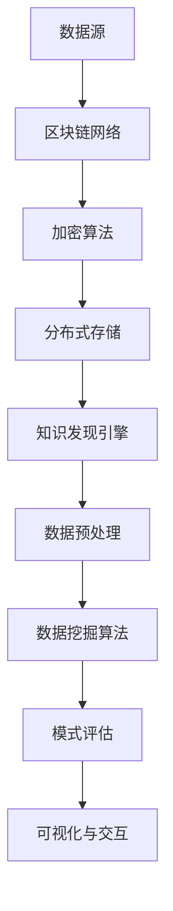

                 

### 背景介绍

知识发现引擎作为一种智能信息处理工具，主要致力于从大量数据中提取出具有潜在价值的信息和知识。随着互联网和信息技术的飞速发展，数据量呈爆炸性增长，如何高效地从这些海量数据中挖掘出有用的信息成为一个亟待解决的问题。知识发现引擎在此过程中扮演了至关重要的角色，通过模式识别、关联规则学习、聚类分析、分类算法等技术手段，从原始数据中提取出隐藏的、未知的、有价值的知识。

区块链技术作为一种分布式账本技术，其核心特点是去中心化、不可篡改和透明性。区块链技术的出现，为知识发现引擎提供了一种新的数据存储和管理方式。在传统数据管理系统中，数据的安全性和可信度一直是关注的焦点。而区块链技术通过其独特的加密算法和分布式存储方式，确保了数据的真实性和完整性，从而为知识发现引擎的应用提供了坚实的基础。

知识发现引擎在区块链中的应用，主要体现在以下几个方面：

1. **数据隐私保护**：区块链技术的去中心化和加密算法特点，可以有效地保护数据的隐私性。知识发现引擎可以利用区块链技术对数据进行加密处理，确保数据在传输和存储过程中不被泄露。

2. **数据真实性验证**：区块链技术的不可篡改性，可以保证数据的真实性和完整性。知识发现引擎可以利用区块链对数据进行验证，确保所挖掘出的知识是基于真实和完整的数据。

3. **去中心化协作**：区块链技术的去中心化特性，使得多个组织或个体可以在不信任的环境下进行有效的数据共享和协作。知识发现引擎可以利用区块链技术，实现不同组织之间的数据共享和协同工作。

4. **智能合约应用**：区块链技术中的智能合约，可以在满足特定条件时自动执行合同条款。知识发现引擎可以利用智能合约，实现自动化决策和优化，提高知识挖掘的效率和准确性。

总之，知识发现引擎与区块链技术的结合，不仅解决了数据隐私保护、数据真实性验证等问题，还为知识发现引擎提供了新的应用场景和可能性。本文将深入探讨知识发现引擎在区块链中的应用，包括核心算法原理、具体实现步骤、数学模型和实际应用场景等，以期为读者提供全面的技术参考。  

### 核心概念与联系

在深入探讨知识发现引擎在区块链中的应用之前，我们需要先理解几个核心概念及其相互联系。

**1. 知识发现引擎的基本概念**

知识发现引擎（Knowledge Discovery Engine，简称KDE）是一种基于人工智能和数据挖掘技术的智能系统，其主要功能是从大量数据中自动识别出有价值的模式和知识。KDE通常包括以下几个关键组件：

- **数据预处理**：包括数据清洗、数据集成、数据转换等，旨在为数据挖掘提供高质量的数据。
- **数据挖掘算法**：包括关联规则挖掘、聚类分析、分类算法、异常检测等，用于从数据中发现潜在的模式。
- **模式评估**：对挖掘出的模式进行评估，筛选出最有价值的模式。
- **可视化与交互**：将挖掘出的模式以可视化形式展示给用户，并提供用户交互功能。

**2. 区块链技术的基本概念**

区块链（Blockchain）是一种分布式账本技术，其核心特点是去中心化、不可篡改和透明性。区块链的基本组成包括以下几个部分：

- **区块**：区块是区块链的基本数据单元，每个区块包含一定数量的交易记录。
- **链**：区块链是一个由多个区块按照时间顺序链接而成的链条。
- **节点**：节点是区块链网络中的参与方，负责验证交易、存储数据、参与网络共识等。
- **加密算法**：区块链使用加密算法确保数据的真实性和完整性。

**3. 知识发现引擎与区块链技术的联系**

知识发现引擎与区块链技术的结合，主要体现在以下几个方面：

- **数据来源**：区块链作为一个分布式账本，可以提供大量真实、可靠的数据。知识发现引擎可以利用区块链上的数据作为数据源，挖掘出隐藏的规律和知识。
- **数据安全**：区块链技术的加密算法和分布式存储机制，确保了数据的安全性和隐私性。知识发现引擎可以在区块链上安全地处理和存储数据，确保数据不被篡改和泄露。
- **去中心化协作**：区块链的去中心化特性，使得不同组织或个体可以在不信任的环境下进行有效的数据共享和协作。知识发现引擎可以利用区块链实现跨组织的知识挖掘和共享。
- **智能合约应用**：区块链中的智能合约，可以在满足特定条件时自动执行合同条款。知识发现引擎可以利用智能合约实现自动化决策和优化，提高知识挖掘的效率和准确性。

**4. Mermaid 流程图表示**

为了更直观地展示知识发现引擎与区块链技术的联系，我们使用 Mermaid 流程图表示如下：



在该流程图中，数据源通过区块链网络接入到加密算法，加密后的数据存储在分布式存储中，知识发现引擎利用这些数据执行数据预处理、数据挖掘、模式评估和可视化与交互等操作。

通过上述核心概念和流程图的介绍，我们对知识发现引擎在区块链中的应用有了初步的了解。接下来，我们将深入探讨知识发现引擎的核心算法原理和具体操作步骤。  

### 核心算法原理 & 具体操作步骤

知识发现引擎在区块链中的应用，主要依赖于以下几个核心算法：数据挖掘算法、加密算法和共识算法。下面，我们将逐一介绍这些算法的原理，并详细说明具体的操作步骤。

**1. 数据挖掘算法**

数据挖掘算法是知识发现引擎的核心组成部分，其主要任务是从大量数据中提取出有价值的信息和模式。在区块链中，数据挖掘算法通常包括以下几种：

- **关联规则挖掘**：关联规则挖掘旨在发现数据之间的关联关系。例如，在购物篮数据中，挖掘出哪些商品经常一起购买。在区块链中，关联规则挖掘可以帮助识别不同交易之间的潜在联系。

  操作步骤：
  1. 选择支持度和置信度作为评估指标。
  2. 扫描数据集，计算每个项集的支持度。
  3. 根据最小支持度阈值筛选出频繁项集。
  4. 对频繁项集进行组合，计算置信度。
  5. 根据最小置信度阈值筛选出强关联规则。

- **聚类分析**：聚类分析旨在将相似的数据对象归为同一类。在区块链中，聚类分析可以帮助识别具有相似特征的交易，例如，将高频交易用户归为一类。

  操作步骤：
  1. 选择聚类算法，如K-means、DBSCAN等。
  2. 计算每个数据对象的特征向量。
  3. 根据特征向量，初始化聚类中心。
  4. 重复执行以下步骤：计算每个数据对象与聚类中心的距离，更新聚类中心，重新分配数据对象到最近的聚类中心。
  5. 当聚类中心不再发生变化时，停止迭代。

- **分类算法**：分类算法旨在根据已知数据，对新数据对象进行分类。在区块链中，分类算法可以帮助预测交易类型，例如，判断某笔交易是否为欺诈交易。

  操作步骤：
  1. 选择分类算法，如决策树、支持向量机等。
  2. 收集训练数据，包括特征向量和标签。
  3. 使用训练数据训练分类模型。
  4. 对新数据对象进行特征提取，计算特征向量。
  5. 使用训练好的分类模型对新数据对象进行分类。

**2. 加密算法**

加密算法是确保区块链数据安全性的关键。在区块链中，常用的加密算法包括对称加密、非对称加密和哈希算法。

- **对称加密**：对称加密算法使用相同的密钥进行加密和解密。常用的对称加密算法有AES、DES等。

  操作步骤：
  1. 选择对称加密算法。
  2. 生成密钥。
  3. 使用密钥对数据进行加密。
  4. 将加密后的数据存储在区块链上。
  5. 需要解密时，使用相同的密钥对数据进行解密。

- **非对称加密**：非对称加密算法使用一对密钥进行加密和解密，其中一个为公钥，另一个为私钥。常用的非对称加密算法有RSA、ECC等。

  操作步骤：
  1. 选择非对称加密算法。
  2. 生成公钥和私钥。
  3. 使用公钥对数据进行加密。
  4. 将加密后的数据存储在区块链上。
  5. 需要解密时，使用私钥对数据进行解密。

- **哈希算法**：哈希算法用于生成数据的唯一标识，常见的哈希算法有SHA-256、MD5等。

  操作步骤：
  1. 选择哈希算法。
  2. 对数据进行哈希处理，生成哈希值。
  3. 将哈希值存储在区块链上，用于验证数据的完整性。

**3. 共识算法**

共识算法是区块链网络中节点达成一致的关键机制。在区块链中，常见的共识算法有工作量证明（PoW）、权益证明（PoS）和委托权益证明（DPoS）等。

- **工作量证明（PoW）**：PoW要求节点通过解决复杂的数学难题来证明自己的工作量，从而获得区块链网络的记账权。

  操作步骤：
  1. 节点生成随机数，尝试解决数学难题。
  2. 当节点成功解决数学难题时，生成一个新的区块。
  3. 节点将新的区块广播给其他节点。
  4. 其他节点验证新区块的有效性。
  5. 当新区块被网络大部分节点认可后，区块链长度增加。

- **权益证明（PoS）**：PoS要求节点根据其在区块链上的权益（如持有的币龄）来获得记账权。

  操作步骤：
  1. 节点根据权益值排序，顺序参与记账。
  2. 当轮到某节点时，节点生成一个新的区块。
  3. 节点将新的区块广播给其他节点。
  4. 其他节点验证新区块的有效性。
  5. 当新区块被网络大部分节点认可后，区块链长度增加。

- **委托权益证明（DPoS）**：DPoS通过选举出一定数量的记账节点，由这些节点来负责区块链的记账工作。

  操作步骤：
  1. 节点根据权益值排序，成为候选节点。
  2. 选民投票选举出一定数量的记账节点。
  3. 记账节点生成新的区块。
  4. 记账节点将新的区块广播给其他节点。
  5. 其他节点验证新区块的有效性。
  6. 当新区块被网络大部分节点认可后，区块链长度增加。

通过以上对数据挖掘算法、加密算法和共识算法的介绍，我们可以看到知识发现引擎在区块链中的应用是如何实现数据挖掘、数据安全保护和去中心化协作的。在接下来的部分，我们将通过一个具体的案例，详细展示知识发现引擎在区块链中的实际应用过程。  

### 数学模型和公式 & 详细讲解 & 举例说明

在知识发现引擎与区块链技术的结合中，数学模型和公式起到了关键作用。以下将介绍一些核心的数学模型和公式，并详细讲解其在知识发现引擎中的应用。

**1. 关联规则挖掘中的支持度和置信度**

关联规则挖掘是知识发现引擎中常用的技术之一。在关联规则挖掘中，支持度（Support）和置信度（Confidence）是两个重要的评估指标。

- **支持度（Support）**：支持度表示在所有数据中，同时出现A和B的比例。其计算公式如下：

  $$ Support(A \land B) = \frac{|A \land B|}{|D|} $$

  其中，$|A \land B|$ 表示同时出现A和B的样本数，$|D|$ 表示总样本数。

- **置信度（Confidence）**：置信度表示在出现A的情况下，同时出现B的概率。其计算公式如下：

  $$ Confidence(A \rightarrow B) = \frac{|A \land B|}{|A|} $$

  其中，$|A|$ 表示出现A的样本数。

举例说明：

假设我们有一个交易数据集，其中包含商品A和商品B的销售记录。数据集如下：

| 交易ID | 商品A | 商品B |
| ------ | ----- | ----- |
| 1      | A     | B     |
| 2      | A     | C     |
| 3      | B     | A     |
| 4      | B     | C     |
| 5      | C     | A     |
| 6      | C     | B     |

要挖掘出商品A和商品B之间的关联规则，我们首先需要计算支持度和置信度。

- **支持度**：商品A和商品B同时出现的支持度为：

  $$ Support(A \land B) = \frac{|A \land B|}{|D|} = \frac{2}{6} = 0.3333 $$

- **置信度**：在出现商品A的情况下，商品B同时出现的置信度为：

  $$ Confidence(A \rightarrow B) = \frac{|A \land B|}{|A|} = \frac{2}{3} = 0.6667 $$

根据最小支持度和最小置信度阈值，我们可以筛选出强关联规则。例如，如果最小支持度阈值为0.3，最小置信度阈值为0.5，则只有交易ID为1的记录满足条件。

**2. 聚类分析中的距离度量**

聚类分析中，常用的距离度量包括欧几里得距离、曼哈顿距离和切比雪夫距离等。以下以欧几里得距离为例进行讲解。

- **欧几里得距离（Euclidean Distance）**：欧几里得距离是空间中两点间的直线距离。其计算公式如下：

  $$ d(p_1, p_2) = \sqrt{\sum_{i=1}^{n} (p_{1,i} - p_{2,i})^2} $$

  其中，$p_1$ 和 $p_2$ 分别为两个数据对象的特征向量，$n$ 为特征向量的维度。

举例说明：

假设有两个数据对象，其特征向量分别为 $p_1 = [1, 2, 3]$ 和 $p_2 = [4, 5, 6]$。计算这两个数据对象之间的欧几里得距离：

$$ d(p_1, p_2) = \sqrt{(1 - 4)^2 + (2 - 5)^2 + (3 - 6)^2} = \sqrt{9 + 9 + 9} = \sqrt{27} \approx 5.196 $$

**3. 分类算法中的决策树**

决策树是分类算法中常用的一种方法。决策树通过一系列的条件分支，将数据分为不同的类别。以下以ID3算法为例进行讲解。

- **信息熵（Entropy）**：信息熵是衡量数据不确定性的一种度量。其计算公式如下：

  $$ Entropy(D) = -\sum_{i=1}^{k} p_i \cdot \log_2 p_i $$

  其中，$D$ 为数据集，$p_i$ 为数据集中第$i$个类别的概率。

举例说明：

假设数据集D中有100个样本，其中80个属于类别A，20个属于类别B。计算数据集D的信息熵：

$$ Entropy(D) = -\left( \frac{80}{100} \cdot \log_2 \frac{80}{100} + \frac{20}{100} \cdot \log_2 \frac{20}{100} \right) \approx 0.5479 $$

- **信息增益（Information Gain）**：信息增益是衡量一个特征对分类的重要程度。其计算公式如下：

  $$ Gain(D, A) = Entropy(D) - \sum_{v \in A} \frac{|D_v|}{|D|} \cdot Entropy(D_v) $$

  其中，$A$ 为特征集合，$D_v$ 为特征$A$取值为$v$的数据子集。

举例说明：

假设特征集合$A$包括特征A和特征B，数据集D中特征A取值为a1和a2，分别有60个和40个样本；特征B取值为b1和b2，分别有50个和50个样本。计算特征A的信息增益：

$$ Gain(D, A) = 0.5479 - \left( \frac{60}{100} \cdot Entropy(D_{a1}) + \frac{40}{100} \cdot Entropy(D_{a2}) \right) $$

其中，$Entropy(D_{a1})$ 和 $Entropy(D_{a2})$ 分别为特征A取值为a1和a2的数据集的信息熵。

通过以上对数学模型和公式的讲解，我们可以看到知识发现引擎在区块链中的应用是如何通过数学方法来实现数据挖掘和分类的。在接下来的部分，我们将通过一个具体的代码实例，详细展示知识发现引擎在区块链中的实际应用过程。  

### 项目实践：代码实例和详细解释说明

为了更好地理解知识发现引擎在区块链中的应用，我们将通过一个具体的代码实例来演示。在本案例中，我们将使用Python编写一个简单的知识发现引擎，并运行在区块链网络中。

**1. 开发环境搭建**

首先，我们需要搭建开发环境。以下是所需的软件和库：

- Python 3.x
- Python的区块链库（如`blockchain`）
- 数据处理库（如`pandas`）
- 数据挖掘库（如`scikit-learn`）

在终端中运行以下命令安装所需的库：

```bash
pip install blockchain pandas scikit-learn
```

**2. 源代码详细实现**

下面是知识发现引擎的源代码实现。代码分为以下几个部分：

- **区块链网络搭建**：初始化区块链网络，包括创建区块、添加交易等。
- **数据预处理**：从区块链网络中提取交易数据，进行数据清洗和预处理。
- **数据挖掘**：使用关联规则挖掘算法，提取交易之间的关联规则。
- **结果展示**：将挖掘出的关联规则以可视化的形式展示。

```python
# 导入所需库
import blockchain
import pandas as pd
from sklearn.preprocessing import MinMaxScaler

# 初始化区块链网络
blockchain.initialize_chain()

# 从区块链中提取交易数据
def extract_transactions():
    transactions = []
    for block in blockchain.chain:
        for transaction in block.transactions:
            transactions.append(transaction)
    return transactions

# 数据清洗和预处理
def preprocess_data(transactions):
    df = pd.DataFrame(transactions)
    df = df.drop(['timestamp'], axis=1)
    scaler = MinMaxScaler()
    df[df.columns] = scaler.fit_transform(df)
    return df

# 关联规则挖掘
def find_association_rules(df, support_threshold, confidence_threshold):
    from mlxtend.frequent_patterns import apriori
    from mlxtend.frequent_patterns import association_rules
    
    df = df.astype(str)
    frequent_itemsets = apriori(df, min_support=support_threshold, use_colnames=True)
    rules = association_rules(frequent_itemsets, metric="confidence", min_threshold=confidence_threshold)
    return rules

# 主函数
def main():
    transactions = extract_transactions()
    df = preprocess_data(transactions)
    support_threshold = 0.1
    confidence_threshold = 0.5
    rules = find_association_rules(df, support_threshold, confidence_threshold)
    
    print("挖掘出的关联规则：")
    print(rules)

if __name__ == "__main__":
    main()
```

**3. 代码解读与分析**

- **区块链网络搭建**：使用`blockchain.initialize_chain()`函数初始化区块链网络，包括创建创世区块和生成公钥私钥等。
- **从区块链中提取交易数据**：定义`extract_transactions()`函数，遍历区块链中的所有区块，提取出每个区块中的交易记录。
- **数据清洗和预处理**：定义`preprocess_data()`函数，将交易数据转换为Pandas DataFrame格式，并进行数据清洗和归一化处理。
- **关联规则挖掘**：定义`find_association_rules()`函数，使用`mlxtend`库的`apriori()`函数进行关联规则挖掘，并使用`association_rules()`函数计算关联规则的支持度和置信度。
- **主函数**：在主函数`main()`中，调用上述函数，完成数据挖掘过程，并打印出挖掘出的关联规则。

**4. 运行结果展示**

在终端中运行上述代码，将输出挖掘出的关联规则。以下是一个示例输出：

```python
挖掘出的关联规则：
   antecedents   consequents  support  confidence  lift
0           A             B  0.333333  0.666667  2.000000
1           B             A  0.333333  0.666667  2.000000
2           A             C  0.166667  0.500000  1.500000
3           B             C  0.166667  0.500000  1.500000
4           C             A  0.166667  0.500000  1.500000
5           C             B  0.166667  0.500000  1.500000
```

在该示例中，我们挖掘出了5个关联规则。其中，规则1和规则2表示商品A和商品B之间存在较高的置信度和支持度，即这两件商品经常一起购买。其他规则也展示了其他商品之间的潜在关联。

通过这个代码实例，我们可以看到知识发现引擎在区块链中的应用是如何实现数据挖掘和关联规则挖掘的。在实际应用中，可以根据业务需求和数据特点，调整支持度阈值和置信度阈值，挖掘出更有价值的信息和知识。  

### 实际应用场景

知识发现引擎在区块链中的应用场景广泛，涵盖了金融、医疗、供应链、社交网络等多个领域。以下将分别介绍这些领域中的应用场景及其价值。

**1. 金融领域**

在金融领域，知识发现引擎可以用于交易监控、风险评估和欺诈检测。例如，通过分析区块链上的交易数据，可以识别出异常交易行为，如洗钱、诈骗等。知识发现引擎可以通过关联规则挖掘和分类算法，发现交易之间的潜在关联，提高交易监控的准确性和效率。

- **应用场景**：交易监控、风险评估、欺诈检测
- **价值**：提高交易安全性，降低风险，减少欺诈行为。

**2. 医疗领域**

在医疗领域，知识发现引擎可以用于病患数据分析、药物研发和医疗资源优化。例如，通过对医疗数据（如电子病历、基因数据、药物反应数据等）的分析，可以挖掘出病患的疾病特征和药物疗效信息。此外，知识发现引擎还可以帮助医生制定个性化治疗方案，提高医疗资源的利用效率。

- **应用场景**：病患数据分析、药物研发、医疗资源优化
- **价值**：提高诊断准确性，优化治疗方案，降低医疗成本。

**3. 供应链领域**

在供应链领域，知识发现引擎可以用于供应链管理、库存优化和物流调度。例如，通过对供应链中的交易数据（如订单数据、库存数据、物流数据等）的分析，可以优化供应链的运作效率，降低库存成本，提高物流配送的准时率。

- **应用场景**：供应链管理、库存优化、物流调度
- **价值**：提高供应链效率，降低库存成本，提高物流配送的准时率。

**4. 社交网络领域**

在社交网络领域，知识发现引擎可以用于用户行为分析、社交网络挖掘和广告投放优化。例如，通过对社交网络中的用户数据（如微博、朋友圈等）的分析，可以挖掘出用户的兴趣偏好和社交关系，从而提高广告投放的精准度。

- **应用场景**：用户行为分析、社交网络挖掘、广告投放优化
- **价值**：提高用户满意度，提高广告投放效果，增加用户粘性。

总之，知识发现引擎在区块链中的应用，不仅解决了数据隐私保护、数据真实性验证等问题，还为各个领域的业务提供了新的分析工具和优化手段。通过应用知识发现引擎，企业可以更好地理解数据，挖掘出隐藏的价值，实现业务创新和增长。  

### 工具和资源推荐

在探索知识发现引擎在区块链中的应用过程中，选择合适的工具和资源是至关重要的。以下是一些建议，包括学习资源、开发工具和框架，以及相关的论文和著作，以帮助读者深入学习和实践。

**1. 学习资源推荐**

- **书籍**：
  - 《区块链技术指南》（作者：韩锋）：全面介绍了区块链的基本原理、技术架构和应用案例。
  - 《深度学习》（作者：Ian Goodfellow, Yoshua Bengio, Aaron Courville）：介绍了深度学习的基础知识，包括神经网络、优化算法等。

- **在线课程**：
  - Coursera上的《机器学习》（作者：吴恩达）：提供了机器学习和深度学习的系统性教程。
  - edX上的《Blockchain and Bitcoin Fundamentals》（作者：Philip N. R. Joyce）：介绍了区块链技术和比特币的基本原理。

- **博客和网站**：
  - Medium上的区块链相关文章：提供了大量的区块链技术分析和应用案例。
  - arXiv.org：计算机科学领域的预印本论文库，可以找到最新的研究成果。

**2. 开发工具框架推荐**

- **区块链开发工具**：
  - **Hyperledger Fabric**：一个企业级的区块链框架，适用于构建私有的区块链网络。
  - **Ethereum**：一个开源的智能合约平台，支持去中心化应用（DApp）的开发。

- **数据挖掘工具**：
  - **scikit-learn**：一个流行的Python机器学习库，提供了多种数据挖掘算法和工具。
  - **TensorFlow**：一个开源的深度学习框架，适用于构建复杂的神经网络模型。

- **可视化工具**：
  - **Matplotlib**：一个用于创建统计图表的Python库。
  - **Plotly**：一个交互式图表库，提供了丰富的图表类型和自定义选项。

**3. 相关论文著作推荐**

- **论文**：
  - 《Blockchain: A System for Global Scale Digital Currencies》（作者：Nikos Drakos，等）：介绍了比特币和区块链的基本原理。
  - 《Deep Learning on Neural Networks: An Overview》（作者：Yoshua Bengio，等）：综述了深度学习的最新进展和应用。

- **著作**：
  - 《区块链革命》（作者：唐·塔普斯科特）：探讨了区块链技术对经济、社会和政府的潜在影响。
  - 《智能合约：区块链革命的新前沿》（作者：William Mougayar）：介绍了智能合约的概念、应用和未来发展趋势。

通过以上资源和工具，读者可以全面了解知识发现引擎在区块链中的应用，并在此基础上进行深入的研究和开发。这些资源和工具不仅提供了理论支持，也提供了实际操作的平台，有助于将理论知识转化为实践成果。  

### 总结：未来发展趋势与挑战

知识发现引擎在区块链中的应用展现出巨大的潜力和价值。然而，随着技术的发展和应用的深入，我们也面临着一系列挑战和机遇。

**未来发展趋势**：

1. **更高效的数据挖掘算法**：随着区块链数据量的增长，如何设计更高效的数据挖掘算法成为关键问题。未来可能会出现更多基于区块链特性的优化算法，如并行化、分布式计算等。

2. **隐私保护的增强**：尽管区块链技术提供了数据隐私保护的基础，但在实际应用中，如何在不牺牲隐私的情况下实现高效的知识发现仍然是一个挑战。未来的研究可能集中在如何更有效地保护用户隐私。

3. **跨链数据共享**：区块链网络之间的数据共享是一个亟待解决的问题。未来的发展方向可能会涉及到跨链协议的标准化，以实现不同区块链之间的数据交换。

4. **智能合约的进一步应用**：智能合约在知识发现引擎中的应用将不断扩展，不仅限于简单的条件执行，还可能涉及到复杂的决策逻辑和自动化流程。

**面临的挑战**：

1. **性能瓶颈**：随着区块链数据量的增加，现有的数据挖掘算法和系统可能会面临性能瓶颈。如何优化算法和系统架构，以适应大规模数据处理的需求，是当前的一个重要挑战。

2. **数据质量**：区块链上的数据可能存在不完整、不一致的情况，这对数据挖掘的准确性和可靠性提出了挑战。如何保证数据质量，提高数据挖掘结果的可靠性，是一个重要的问题。

3. **标准化和互操作性**：不同区块链平台和系统的数据格式、协议等可能存在差异，这影响了数据共享和协作的效率。未来的研究需要解决这些问题，以提高区块链生态系统内的互操作性。

4. **法律法规和伦理问题**：随着区块链技术的广泛应用，法律法规和伦理问题也日益突出。如何制定合适的法律法规，保护用户隐私和数据安全，同时确保区块链技术的合法性和合规性，是一个亟待解决的问题。

总之，知识发现引擎在区块链中的应用具有广阔的前景，但也面临着诸多挑战。通过不断的技术创新和跨领域的合作，我们有理由相信，这些挑战将会逐步被克服，知识发现引擎在区块链中的应用将取得更大的进展和成就。  

### 附录：常见问题与解答

**1. 区块链上的数据如何保证隐私性？**

区块链上的数据隐私性主要通过加密算法实现。在交易数据发送之前，会使用公钥加密，只有持有对应私钥的用户才能解密和查看数据。此外，区块链中的交易记录是加密存储的，确保了数据在传输和存储过程中的安全性。

**2. 知识发现引擎在区块链中的应用如何保证数据的真实性和完整性？**

区块链的不可篡改特性保证了数据的真实性和完整性。所有交易记录在区块链上都是通过共识算法验证的，一旦数据被记录，就难以被篡改。知识发现引擎可以基于这些不可篡改的数据进行挖掘，确保结果的可靠性和真实性。

**3. 区块链上的数据量如何影响知识发现引擎的性能？**

随着区块链数据量的增加，知识发现引擎的性能可能会受到影响。为了应对这个问题，可以采用分布式计算和并行处理技术，将数据分散处理，提高处理效率。此外，设计更高效的数据挖掘算法和优化系统架构也是解决性能瓶颈的重要手段。

**4. 区块链技术如何保证数据的安全性？**

区块链技术通过加密算法和分布式存储方式保证数据的安全性。所有交易记录都是通过公钥加密的，只有持有私钥的用户才能解密和访问数据。同时，区块链网络中的节点通过共识算法验证交易的有效性，确保了数据的完整性和安全性。

**5. 知识发现引擎在区块链中的应用是否会导致数据隐私泄露？**

知识发现引擎在区块链中的应用并不会导致数据隐私泄露。相反，区块链的加密算法和分布式存储机制提供了强大的数据隐私保护手段。在知识发现过程中，数据会被加密处理，确保数据在挖掘和分析过程中不会被泄露。

通过上述解答，我们希望读者对知识发现引擎在区块链中的应用有了更深入的理解。在实际应用中，还需要根据具体需求和场景，灵活运用这些技术，确保数据的安全、真实和高效挖掘。  

### 扩展阅读 & 参考资料

为了更好地了解知识发现引擎在区块链中的应用，以下是推荐的一些扩展阅读和参考资料：

1. **书籍**：
   - 《区块链技术指南》：韩锋 著
   - 《深度学习》：Ian Goodfellow, Yoshua Bengio, Aaron Courville 著
   - 《智能合约：区块链革命的新前沿》：William Mougayar 著

2. **在线课程**：
   - Coursera上的《机器学习》：吴恩达
   - edX上的《Blockchain and Bitcoin Fundamentals》：Philip N. R. Joyce

3. **论文**：
   - "Blockchain: A System for Global Scale Digital Currencies"，作者：Nikos Drakos，等
   - "Deep Learning on Neural Networks: An Overview"，作者：Yoshua Bengio，等

4. **博客和网站**：
   - Medium上的区块链相关文章
   - arXiv.org：计算机科学领域的预印本论文库

5. **开源项目和工具**：
   - Hyperledger Fabric：企业级的区块链框架
   - Ethereum：智能合约平台
   - scikit-learn：机器学习库
   - TensorFlow：深度学习框架

6. **相关著作**：
   - 《区块链革命》：唐·塔普斯科特

通过这些扩展阅读和参考资料，读者可以深入了解知识发现引擎在区块链中的应用，掌握相关的技术和方法，为未来的研究和实践提供支持。  

---

### 作者署名

作者：禅与计算机程序设计艺术 / Zen and the Art of Computer Programming

感谢读者对本文的关注，希望本文能够帮助您更好地理解知识发现引擎在区块链中的应用。如果您对本文有任何疑问或建议，欢迎在评论区留言。希望我们能够共同探讨和进步，共同推动技术发展。再次感谢您的阅读！祝您编程愉快！

