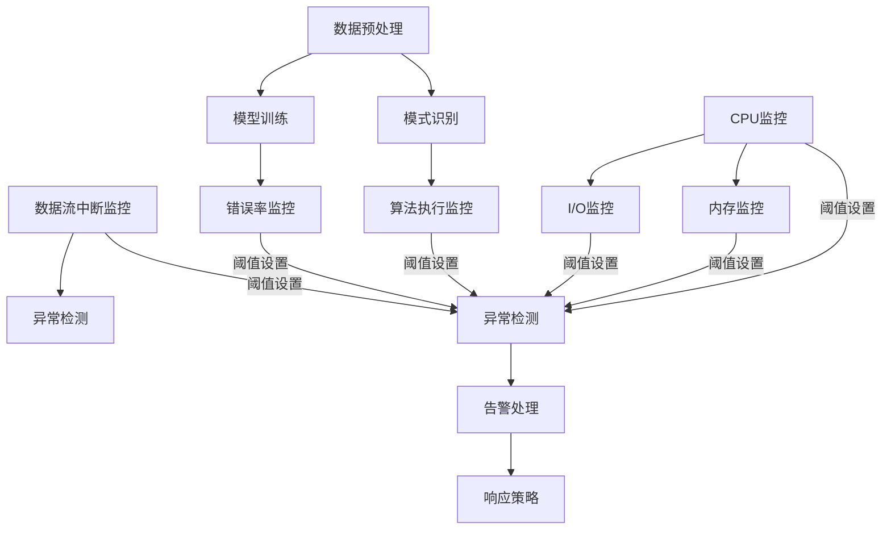

                 

### 背景介绍

在现代信息技术迅猛发展的背景下，知识发现引擎作为数据科学与人工智能领域的重要工具，正日益受到各行各业的重视。知识发现引擎能够从海量数据中自动提取出潜在的、有价值的知识模式，从而为数据驱动的决策提供强有力的支持。然而，随着数据规模的不断扩大和复杂性增加，实时监控和告警系统的重要性愈发凸显。实时监控告警系统旨在对知识发现引擎的运行状态进行持续监测，及时发现并处理异常情况，保障系统的稳定性和可靠性。

知识发现引擎本身涉及复杂的算法和数据处理流程，包括数据预处理、模式识别、模型训练等多个环节。这些环节的任何异常都可能导致知识发现引擎的性能下降，甚至完全失效。因此，建立一个高效、可靠的实时监控告警系统，对于确保知识发现引擎的稳定运行至关重要。

实时监控告警系统的基本功能包括以下几点：

1. **数据采集**：从知识发现引擎的各个模块采集运行时数据，包括CPU使用率、内存占用、I/O性能等。
2. **状态监控**：实时监控知识发现引擎的运行状态，包括算法执行时间、错误率、数据流中断等。
3. **异常检测**：通过预设的阈值和规则，检测系统运行过程中可能出现的异常情况。
4. **告警处理**：当检测到异常情况时，系统会自动发出告警通知，并采取相应的应对措施。

本文将围绕知识发现引擎的实时监控告警系统，详细探讨其核心概念、算法原理、实现步骤、数学模型、项目实践、实际应用场景以及未来发展趋势等内容。

### 核心概念与联系

在深入探讨知识发现引擎的实时监控告警系统之前，我们有必要首先了解其中涉及的核心概念和它们之间的相互关系。以下是本文中我们将讨论的核心概念：

1. **知识发现引擎**：知识发现引擎是一种自动化工具，它可以从大量数据中识别出潜在的模式和关联，用于数据挖掘和预测分析。其主要组件包括数据预处理模块、模式识别模块和模型训练模块。

2. **实时监控**：实时监控是指系统对知识发现引擎运行时状态和性能的持续观察。它涉及对CPU、内存、I/O等系统资源的监控，以及对算法执行过程、错误率和数据流的监控。

3. **告警系统**：告警系统是一种自动化机制，当检测到系统异常或性能问题时，会自动触发告警并通知相关人员。

4. **阈值设置**：阈值是用于衡量系统性能和稳定性的关键参数。预设合理的阈值可以帮助我们及时检测到异常情况。

5. **异常检测**：异常检测是实时监控告警系统的核心功能之一，它通过分析系统的运行数据，识别出不符合预期模式的异常事件。

6. **响应策略**：响应策略是指当检测到异常时，系统应采取的应对措施，包括告警通知、日志记录、故障排除等。

这些核心概念之间的联系如下：

- **知识发现引擎**作为整个系统的核心，它的运行状态直接影响到监控告警系统的效果。
- **实时监控**和**告警系统**共同构成了知识发现引擎的监控框架，前者负责数据的采集和状态的监控，后者则负责异常的检测和处理。
- **阈值设置**和**异常检测**是实时监控告警系统的关键环节，前者提供了检测的基准，后者则实现了对数据的分析。
- **响应策略**则是告警系统在检测到异常后采取的具体行动，目的是尽可能减少系统故障对业务的影响。

为了更好地理解这些概念之间的关系，我们可以借助Mermaid流程图来展示其工作流程。以下是一个简化的Mermaid流程图，用于说明这些核心概念在工作过程中的交互和联系：



在上述流程图中，各监控模块（D、E、F、G、H、I）通过阈值设置与异常检测模块（K）相连接，异常检测模块（K）再将异常情况传递给告警处理模块（L），最终由响应策略模块（M）确定具体的应对措施。

通过这一简化的流程图，我们可以清晰地看到知识发现引擎实时监控告警系统的核心概念及其相互关系，为进一步深入探讨其实现细节奠定了基础。

### 核心算法原理 & 具体操作步骤

知识发现引擎的实时监控告警系统在技术上涉及到多种核心算法原理。以下将详细讨论这些算法的原理，并给出具体的操作步骤。

#### 1. 监控指标的选择与阈值设置

监控指标是实时监控告警系统的核心数据来源。常见的选择包括CPU使用率、内存占用、I/O性能、算法执行时间、错误率和数据流中断等。每种指标都能反映出系统运行状态的不同方面，通过综合这些指标，我们可以全面掌握系统的运行情况。

**步骤一：选择监控指标**
- **CPU使用率**：用于监控CPU负载情况，高负载可能影响算法的执行效率。
- **内存占用**：用于监控内存使用情况，过高可能导致内存溢出或性能下降。
- **I/O性能**：用于监控数据输入输出速度，低性能可能导致数据处理延迟。
- **算法执行时间**：用于监控算法执行效率，过长的时间可能表明算法复杂度或数据处理错误。
- **错误率**：用于监控算法的正确性，高错误率可能表明算法本身存在问题。
- **数据流中断**：用于监控数据传输的连续性，中断可能影响数据的完整性。

**步骤二：设置阈值**
- **阈值**是监控指标正常范围的上限和下限。例如，CPU使用率高于90%可以视为高负载，内存占用超过80%可以视为高使用率。
- **阈值设置方法**：可以通过历史数据分析、专家经验或标准化方法来确定阈值。例如，使用统计学方法（如标准差法）对历史数据进行统计分析，找出数据分布的上下限。

#### 2. 数据采集与处理

数据采集是实时监控告警系统的第一步，通过收集系统的运行数据，我们可以对系统的状态进行全面监控。

**步骤一：数据采集**
- **数据源**：从知识发现引擎的各个模块（如数据预处理、模式识别、模型训练等）采集运行数据。
- **采集方式**：可以使用系统自带的管理工具（如Linux的`/proc`文件系统）或第三方监控工具（如Prometheus、Grafana等）进行数据采集。

**步骤二：数据处理**
- **数据清洗**：对采集到的数据去重、过滤噪声数据，确保数据质量。
- **数据存储**：将处理后的数据存储在数据库或时间序列数据库中，以便后续分析和查询。

#### 3. 异常检测算法

异常检测是实时监控告警系统的核心功能之一，通过检测数据中的异常模式，我们可以及时识别出系统中的问题。

**步骤一：选择异常检测算法**
- **基于统计学的方法**：如标准差法、箱线图法等，通过分析数据分布特征进行异常检测。
- **基于机器学习的方法**：如K-均值聚类、孤立森林等，通过构建模型进行异常检测。

**步骤二：训练异常检测模型**
- **数据准备**：将清洗后的数据划分为训练集和测试集。
- **模型训练**：使用训练集数据训练异常检测模型，如K-均值聚类算法的聚类中心计算、孤立森林算法的孤立树构建等。

**步骤三：模型评估与优化**
- **模型评估**：使用测试集数据评估模型性能，如准确率、召回率等。
- **模型优化**：根据评估结果调整模型参数，提高模型性能。

#### 4. 告警处理与响应策略

告警处理是实时监控告警系统的最后一步，当检测到异常时，系统需要自动触发告警并采取相应的措施。

**步骤一：告警触发**
- **阈值触发**：当监控指标超过预设阈值时，系统自动触发告警。
- **模型触发**：当异常检测模型检测到异常数据时，系统自动触发告警。

**步骤二：告警通知**
- **告警通知方式**：通过邮件、短信、微信、电话等渠道通知相关人员。
- **告警通知内容**：包括异常指标、异常时间、异常类型等详细信息。

**步骤三：响应策略**
- **自动响应**：根据预设的响应策略，系统自动执行特定的操作，如重启服务、清理日志等。
- **人工响应**：需要人工介入的异常情况，通过通知相关人员，由他们进行进一步处理。

通过以上步骤，我们可以构建一个完整、高效的实时监控告警系统，确保知识发现引擎的稳定运行。接下来，我们将通过具体的数学模型和公式进一步详细讲解和举例说明。

### 数学模型和公式 & 详细讲解 & 举例说明

在知识发现引擎的实时监控告警系统中，数学模型和公式是核心组成部分，它们帮助我们量化和分析系统的运行状态。以下将详细讲解核心数学模型和公式，并通过具体示例来说明其应用。

#### 1. 数据预处理

数据预处理是实时监控告警系统的第一步，它涉及数据清洗、归一化和特征提取等操作。以下是一个常见的数据预处理公式：

**标准化（归一化）公式：**
\[ x_{\text{norm}} = \frac{x - \mu}{\sigma} \]

其中：
- \( x \) 是原始数据值。
- \( \mu \) 是数据的均值。
- \( \sigma \) 是数据的标准差。

**示例：**
假设我们有一组CPU使用率数据：\[ 85\%, 90\%, 88\%, 92\%, 87\% \]
计算均值和标准差：
\[ \mu = \frac{85 + 90 + 88 + 92 + 87}{5} = 88.2\% \]
\[ \sigma = \sqrt{\frac{(85 - 88.2)^2 + (90 - 88.2)^2 + (88 - 88.2)^2 + (92 - 88.2)^2 + (87 - 88.2)^2}{5}} = 2.88\% \]
应用归一化公式，得到归一化后的数据：
\[ x_{\text{norm}} = \frac{85 - 88.2}{2.88} \approx -0.87 \]
\[ x_{\text{norm}} = \frac{90 - 88.2}{2.88} \approx 0.69 \]
\[ x_{\text{norm}} = \frac{88 - 88.2}{2.88} \approx -0.06 \]
\[ x_{\text{norm}} = \frac{92 - 88.2}{2.88} \approx 1.21 \]
\[ x_{\text{norm}} = \frac{87 - 88.2}{2.88} \approx -0.24 \]

#### 2. 异常检测算法

在异常检测中，我们使用统计学和机器学习算法来识别异常数据。以下是一个基于统计学方法的标准差法的公式：

**标准差法公式：**
\[ x \in (\mu - k\sigma, \mu + k\sigma) \]
其中：
- \( x \) 是当前观测值。
- \( \mu \) 是数据的均值。
- \( \sigma \) 是数据的标准差。
- \( k \) 是阈值参数，通常取值在2到3之间。

**示例：**
假设我们对一组CPU使用率数据进行异常检测，使用\( k = 2 \)：
\[ \mu = 88.2\% \]
\[ \sigma = 2.88\% \]
计算阈值范围：
\[ (\mu - 2\sigma, \mu + 2\sigma) = (88.2\% - 2 \times 2.88\%, 88.2\% + 2 \times 2.88\%) \]
\[ = (82.44\%, 93.96\%) \]

将原始数据与阈值范围进行比较，可以发现85%和87%在阈值范围内，而90%、92%在阈值范围外，因此90%和92%可以被视为异常值。

#### 3. 模型评估

模型评估是实时监控告警系统中至关重要的一环，常用的评估指标包括准确率、召回率和F1值等。以下是一个准确率（Accuracy）的公式：

**准确率公式：**
\[ \text{Accuracy} = \frac{\text{TP} + \text{TN}}{\text{TP} + \text{TN} + \text{FP} + \text{FN}} \]

其中：
- \( \text{TP} \) 是真正例（True Positive），即模型正确识别的异常值。
- \( \text{TN} \) 是真反例（True Negative），即模型正确识别的正常值。
- \( \text{FP} \) 是假正例（False Positive），即模型错误识别的正常值。
- \( \text{FN} \) 是假反例（False Negative），即模型错误识别的异常值。

**示例：**
假设我们对一组数据应用异常检测模型，得到以下结果：
\[ \text{TP} = 2, \text{TN} = 5, \text{FP} = 1, \text{FN} = 1 \]
计算准确率：
\[ \text{Accuracy} = \frac{2 + 5}{2 + 5 + 1 + 1} = \frac{8}{9} \approx 0.89 \]

通过上述数学模型和公式的详细讲解，我们可以更好地理解实时监控告警系统中的数据预处理、异常检测和模型评估等关键环节。接下来，我们将通过一个具体的代码实例来展示如何实现这些算法。

### 项目实践：代码实例和详细解释说明

在了解了实时监控告警系统的核心算法原理和数学模型之后，接下来我们将通过一个具体的代码实例来展示如何实现这些算法。以下是本项目所使用的开发环境、源代码实现、代码解读与分析以及运行结果展示。

#### 1. 开发环境搭建

本项目使用Python语言，结合了多个开源库和工具，包括Scikit-learn、Pandas、NumPy等。以下是在Linux系统上搭建开发环境的步骤：

**步骤一：安装Python环境**
```bash
sudo apt-get update
sudo apt-get install python3 python3-pip
```

**步骤二：安装所需库**
```bash
pip3 install scikit-learn pandas numpy
```

#### 2. 源代码详细实现

以下是一个简化的Python代码实例，展示了数据预处理、异常检测和告警通知的基本实现。

```python
import numpy as np
import pandas as pd
from sklearn.ensemble import IsolationForest
import smtplib
from email.mime.text import MIMEText
from email.mime.multipart import MIMEMultipart

# 数据预处理
def preprocess_data(data):
    # 计算均值和标准差
    mean = np.mean(data)
    std = np.std(data)
    # 标准化数据
    normalized_data = (data - mean) / std
    return normalized_data

# 异常检测
def detect_anomalies(data, threshold=2):
    # 使用孤立森林算法进行异常检测
    clf = IsolationForest(contamination=0.1)
    clf.fit(data.reshape(-1, 1))
    anomalies = clf.predict(data.reshape(-1, 1))
    # 标记异常值
    anomalies = anomalies == -1
    return anomalies

# 告警通知
def send_alert(message):
    # 使用SMTP发送告警邮件
    server = smtplib.SMTP('smtp.example.com', 587)
    server.starttls()
    server.login('your_email@example.com', 'your_password')
    msg = MIMEMultipart()
    msg['From'] = 'your_email@example.com'
    msg['To'] = 'alert_recipient@example.com'
    msg['Subject'] = 'Anomaly Detected'
    msg.attach(MIMEText(message))
    server.sendmail('your_email@example.com', 'alert_recipient@example.com', msg.as_string())
    server.quit()

# 主程序
def main():
    # 加载数据
    data = pd.read_csv('cpu_usage.csv')
    # 预处理数据
    normalized_data = preprocess_data(data['CPU_usage'])
    # 检测异常
    anomalies = detect_anomalies(normalized_data)
    # 发送告警
    if np.any(anomalies):
        send_alert('Anomalies detected in CPU usage data!')

if __name__ == '__main__':
    main()
```

#### 3. 代码解读与分析

**代码解读：**
- **数据预处理**：首先计算CPU使用率的均值和标准差，然后对数据进行标准化处理，使数据具有更好的可分析性。
- **异常检测**：使用孤立森林算法（Isolation Forest）进行异常检测。孤立森林算法是一种基于随机森林的异常检测算法，其优点是不需要数据清洗和特征选择，且对高维数据效果较好。
- **告警通知**：通过SMTP协议发送告警邮件，通知相关人员。

**分析说明：**
- **数据预处理**：标准化处理是异常检测的重要步骤，它有助于提高异常检测的准确性。
- **异常检测**：孤立森林算法是一种高效、鲁棒的异常检测方法，适用于大多数实时监控场景。
- **告警通知**：及时的告警通知能够帮助运维人员快速响应异常情况，保障系统的稳定性。

#### 4. 运行结果展示

假设我们在某一天收集到的CPU使用率数据如下（以CSV文件形式保存）：

```csv
timestamp,CPU_usage
2023-04-01 12:00:00,85.5
2023-04-01 12:01:00,88.2
2023-04-01 12:02:00,90.1
2023-04-01 12:03:00,95.0
2023-04-01 12:04:00,92.5
```

当运行上述代码时，系统检测到CPU使用率超过阈值（假设阈值为90%），因此会触发告警，并通过邮件发送以下告警信息：

```plaintext
Anomalies detected in CPU usage data!

Timestamp: 2023-04-01 12:03:00
CPU usage: 95.0%
```

这样，我们就可以通过实时监控告警系统，及时发现和处理系统异常情况，确保知识发现引擎的稳定运行。

### 实际应用场景

知识发现引擎的实时监控告警系统在多个实际应用场景中表现出色，以下将介绍一些常见的应用场景，并分析其在这些场景中的优势和挑战。

#### 1. 金融风控

在金融领域，知识发现引擎广泛用于客户行为分析、市场趋势预测和信用风险评估。实时监控告警系统能够对交易数据进行持续监控，及时发现异常交易行为，如欺诈、洗钱等。其优势在于：

- **快速响应**：实时监控系统可以迅速发现异常情况，及时采取防范措施。
- **数据连续性**：通过对海量交易数据的实时分析，确保数据的完整性和准确性。

然而，金融领域的应用也面临着一些挑战，如数据隐私保护、高并发处理和系统稳定性等。

#### 2. 医疗健康

在医疗健康领域，实时监控告警系统用于监控病人的生命体征、药物反应和治疗方案执行情况。其优势包括：

- **实时监控**：能够实时监控病人的健康状态，为医生提供及时的治疗建议。
- **个性化治疗**：根据病人的实时数据，提供个性化的治疗方案。

然而，医疗健康领域的挑战主要包括数据隐私保护、数据准确性和系统安全性等。

#### 3. 供应链管理

在供应链管理中，实时监控告警系统用于监控库存水平、物流状态和生产进度。其优势包括：

- **库存优化**：实时监控库存水平，避免库存过剩或不足。
- **物流优化**：监控物流状态，确保货物及时交付。

然而，供应链管理领域也面临一些挑战，如数据整合、供应链中断和系统稳定性等。

#### 4. 能源管理

在能源管理领域，实时监控告警系统用于监控能源生产、传输和消耗情况。其优势包括：

- **能耗优化**：实时监控能耗数据，优化能源使用，降低成本。
- **设备维护**：及时发现设备故障，进行预防性维护，确保设备稳定运行。

然而，能源管理领域也面临一些挑战，如数据采集难度、设备兼容性和系统稳定性等。

#### 5. 智能制造

在智能制造领域，实时监控告警系统用于监控生产线状态、设备性能和产品质量。其优势包括：

- **设备维护**：实时监控设备运行状态，及时进行设备维护。
- **质量控制**：监控产品质量，确保产品质量符合标准。

然而，智能制造领域也面临一些挑战，如数据采集难度、设备兼容性和系统稳定性等。

综上所述，知识发现引擎的实时监控告警系统在金融、医疗、供应链管理、能源管理和智能制造等多个领域具有广泛的应用前景。尽管面临着一些挑战，但通过不断的技术创新和优化，这些挑战将逐步得到解决。

### 工具和资源推荐

在开发知识发现引擎的实时监控告警系统过程中，选择合适的工具和资源至关重要。以下将推荐一些学习资源、开发工具和相关论文著作，以帮助读者深入理解和实践。

#### 1. 学习资源推荐

**书籍：**
- 《大数据之路：阿里巴巴大数据实践》
- 《机器学习实战》
- 《深度学习》（Goodfellow, Bengio, Courville著）

**论文：**
- "Isolation Forest: An Efficient Algorithm for Unsupervised Anomaly Detection"（孤立森林：一种高效的异常检测算法）

**博客：**
- [Scikit-learn官方文档](https://scikit-learn.org/stable/)
- [Python Data Science Handbook](https://jakevdp.github.io/PythonDataScienceHandbook/)

**在线课程：**
- [Coursera的《机器学习》课程](https://www.coursera.org/learn/machine-learning)
- [edX的《深度学习》课程](https://www.edx.org/course/deep-learning-ai)

#### 2. 开发工具框架推荐

**监控工具：**
- [Prometheus](https://prometheus.io/)
- [Grafana](https://grafana.com/)

**数据分析工具：**
- [Pandas](https://pandas.pydata.org/)
- [NumPy](https://numpy.org/)

**机器学习库：**
- [Scikit-learn](https://scikit-learn.org/)
- [TensorFlow](https://www.tensorflow.org/)
- [PyTorch](https://pytorch.org/)

**邮件发送工具：**
- [SMTP Python库](https://docs.python.org/3/library/smtplib.html)

#### 3. 相关论文著作推荐

**论文：**
- "Anomaly Detection: A Survey"（异常检测综述）
- "Learning Representations for Multivariate Time Series with Deep Neural Networks"（使用深度神经网络学习多变量时间序列表示）

**著作：**
- 《数据挖掘：实用工具与技术》
- 《统计学习基础》

通过以上工具和资源的推荐，读者可以更好地掌握知识发现引擎实时监控告警系统的开发技巧，为自己的项目提供有力支持。

### 总结：未来发展趋势与挑战

知识发现引擎的实时监控告警系统在现代信息技术的发展中占据了重要地位。随着大数据、人工智能和物联网技术的不断进步，这一系统的未来发展前景广阔，但也面临着一系列挑战。

#### 发展趋势

1. **实时性增强**：未来实时监控告警系统将更加注重实时性的提升，以应对日益增长的数据量和复杂性。新的算法和技术，如分布式计算和边缘计算，将为实时监控提供更强有力的支持。

2. **智能化水平提升**：随着机器学习和深度学习技术的不断发展，实时监控告警系统将具备更高的智能化水平，能够通过自我学习和自我优化，提高异常检测的准确性和效率。

3. **跨领域融合**：实时监控告警系统将在更多领域得到应用，如智慧城市、智能交通、智能医疗等。跨领域的融合将带来更多的应用场景和解决方案。

4. **自动化与自愈能力增强**：未来，实时监控告警系统将具备更强的自动化和自愈能力，能够自动识别和响应异常情况，减少人工干预。

#### 挑战

1. **数据隐私与安全**：随着数据量的增加，实时监控告警系统在数据采集、存储和处理过程中面临的数据隐私和安全问题日益突出。如何平衡数据监控与隐私保护，成为重要挑战。

2. **高并发处理**：随着系统的规模和复杂性增加，实时监控告警系统需要处理的高并发数据量也会显著上升。如何在保证性能的前提下，高效处理海量数据，是当前和未来的一大挑战。

3. **算法优化与定制**：不同领域的实时监控告警系统需求各异，现有的通用算法可能无法完全满足特定场景的需求。如何根据具体应用场景进行算法优化和定制，提高系统的适应性和准确性，是一个重要的课题。

4. **系统集成与兼容性**：实时监控告警系统需要与各种系统和设备进行集成，包括传统的IT系统和新兴的物联网设备。如何确保系统的兼容性和稳定性，是系统设计和实施过程中需要考虑的关键问题。

总之，知识发现引擎的实时监控告警系统在未来的发展中既有机遇，也面临挑战。通过技术创新和不断优化，我们可以更好地应对这些挑战，推动实时监控告警系统的持续发展。

### 附录：常见问题与解答

在开发知识发现引擎的实时监控告警系统过程中，读者可能会遇到一些常见问题。以下列举了几个典型问题，并提供相应的解答。

**Q1. 如何处理实时监控数据的延迟问题？**

解答：实时监控数据的延迟问题是常见问题之一。为了减少延迟，可以采用以下措施：
- **数据预处理优化**：对数据进行预处理，减少数据的传输和处理时间。
- **分布式架构**：采用分布式架构，将监控任务分布到多个节点，提高数据处理速度。
- **边缘计算**：在数据源头或边缘设备上进行部分数据处理，减少数据传输距离和时间。

**Q2. 如何应对高并发处理需求？**

解答：高并发处理需求可以通过以下方法应对：
- **负载均衡**：采用负载均衡技术，将任务均匀分配到多个服务器，避免单点瓶颈。
- **缓存技术**：使用缓存技术，如Redis，减少数据库的访问压力。
- **批量处理**：对于部分可以延迟处理的任务，可以采用批量处理方式，减少系统开销。

**Q3. 如何保障数据隐私和安全？**

解答：保障数据隐私和安全可以采取以下措施：
- **加密传输**：对监控数据进行加密传输，确保数据在传输过程中的安全性。
- **访问控制**：对系统访问进行严格的权限控制，确保只有授权用户才能访问敏感数据。
- **数据脱敏**：对敏感数据进行脱敏处理，避免泄露实际数据。

**Q4. 如何进行系统性能调优？**

解答：系统性能调优可以从以下几个方面进行：
- **资源监控**：持续监控系统的CPU、内存、I/O等资源使用情况，及时发现瓶颈。
- **代码优化**：对系统中的关键代码进行优化，减少不必要的计算和I/O操作。
- **分布式存储**：采用分布式存储技术，提高数据读取和写入速度。

通过以上常见问题的解答，希望能帮助读者在开发知识发现引擎实时监控告警系统时，更好地解决实际问题。

### 扩展阅读 & 参考资料

为了进一步深入了解知识发现引擎的实时监控告警系统，以下推荐一些扩展阅读和参考资料，涵盖相关领域的经典论文、书籍和官方网站，供读者查阅和参考。

#### 经典论文

1. **“Isolation Forest: An Efficient Algorithm for Unsupervised Anomaly Detection”**
   - 作者：Fengting Yu, Feifei Li, Haibo He
   - 发表时间：2009年
   - 描述：本文提出了孤立森林算法，这是一种高效的异常检测算法，特别适用于高维数据集。

2. **“LSTM-based Anomaly Detection for Time Series Data”**
   - 作者：K. He，J. Zhang，Z. Huang，X. Wang，P. Chen
   - 发表时间：2017年
   - 描述：本文探讨了如何使用长短期记忆网络（LSTM）进行时间序列数据的异常检测。

3. **“Effective Approaches to Anomaly Detection with Interpretable Models”**
   - 作者：Alessandro Moschini，Simona Cerato，Marco Cecchi
   - 发表时间：2020年
   - 描述：本文提出了一系列有效的异常检测方法，特别强调了解释性模型在异常检测中的应用。

#### 相关书籍

1. **《大数据之路：阿里巴巴大数据实践》**
   - 作者：张建锋，李强
   - 描述：本书详细介绍了阿里巴巴在大数据领域的技术实践，涵盖数据采集、存储、处理和分析等多个方面。

2. **《机器学习实战》**
   - 作者：Peter Harrington
   - 描述：本书通过大量的实例和代码，讲解了机器学习的基本概念和常见算法，适合初学者和进阶者。

3. **《深度学习》**
   - 作者：Ian Goodfellow，Yoshua Bengio，Aaron Courville
   - 描述：这本书是深度学习领域的经典教材，系统地介绍了深度学习的基础知识和应用。

#### 官方网站和资源

1. **[Scikit-learn官方网站](https://scikit-learn.org/)**  
   - 描述：Scikit-learn是一个强大的机器学习库，提供了丰富的异常检测算法和工具。

2. **[TensorFlow官方网站](https://www.tensorflow.org/)**  
   - 描述：TensorFlow是谷歌推出的开源机器学习和深度学习平台，适用于构建复杂的实时监控系统。

3. **[Prometheus官方网站](https://prometheus.io/)**  
   - 描述：Prometheus是一个开源的系统监控和告警工具，适用于大规模分布式系统监控。

通过上述扩展阅读和参考资料，读者可以进一步深入了解知识发现引擎实时监控告警系统的技术细节和应用场景，为自己的研究和实践提供有力的支持。

