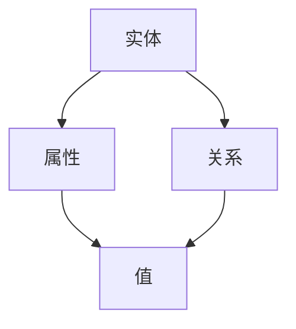

                 

### 1. 背景介绍

在信息技术高速发展的今天，数据已成为企业和社会的宝贵资源。然而，如何在海量的数据中快速、准确地找到有价值的信息，成为了各大企业急需解决的问题。知识发现引擎应运而生，其核心功能之一就是构建和可视化知识图谱，以帮助用户更好地理解和利用数据。

知识图谱（Knowledge Graph）是描述实体及其关系的网络结构，它将复杂的、非结构化或半结构化的数据转换为结构化的知识网络，使得数据关系更加直观，便于用户进行数据分析和决策。知识图谱可视化则是将知识图谱以图形化的方式呈现，帮助用户快速理解和分析数据之间的关联。

近年来，随着大数据、人工智能、区块链等技术的不断发展，知识图谱可视化技术也得到了迅速推广和应用。例如，在搜索引擎中，知识图谱可以帮助构建更加精准的搜索结果；在社交媒体中，知识图谱可以用于推荐系统，提供个性化的内容推送；在金融行业，知识图谱可以用于风险评估和欺诈检测。

本文将围绕知识图谱可视化展开，介绍其核心概念、算法原理、数学模型、项目实践以及实际应用场景，旨在为读者提供一份全面、系统的知识图谱可视化指南。通过本文的阅读，读者可以深入了解知识图谱可视化的原理和实现方法，掌握如何利用知识图谱进行数据分析和决策。

### 2. 核心概念与联系

要深入探讨知识图谱可视化，我们首先需要了解其核心概念与组成部分。知识图谱由三个基本要素组成：实体（Entity）、属性（Attribute）和关系（Relationship）。

- **实体（Entity）**：实体是知识图谱中的基本单位，可以是人、地点、组织、物品等。例如，在社交媒体知识图谱中，用户、帖子、话题都可以作为实体。

- **属性（Attribute）**：属性描述了实体的特征或状态。例如，对于用户实体，其属性可以包括年龄、性别、职业等。

- **关系（Relationship）**：关系描述了实体之间的关联。例如，在社交媒体中，用户A关注了用户B，这是一个关注关系。

接下来，我们将使用Mermaid流程图来直观地展示知识图谱的基本架构。请注意，流程图中的节点不应包含括号、逗号等特殊字符。



在上面的流程图中：

- **A** 代表实体。
- **B** 代表属性。
- **C** 代表关系。
- **D** 代表属性的值。

知识图谱的构建过程通常涉及以下步骤：

1. **数据采集**：从各种数据源（如数据库、日志、API等）收集数据。
2. **数据预处理**：对采集到的数据进行清洗、去重、格式转换等处理。
3. **实体识别**：从预处理后的数据中识别出实体。
4. **关系抽取**：分析实体之间的关系，并将其转换为关系图谱。
5. **知识融合**：将不同来源的实体和关系进行整合，构建完整的知识图谱。

接下来，我们将进一步讨论知识图谱可视化的具体实现方法和技术。

### 3. 核心算法原理 & 具体操作步骤

知识图谱可视化是一个复杂的过程，涉及多个核心算法和步骤。在这里，我们将介绍一些常见的算法，包括节点嵌入算法、图嵌入算法、图绘制算法等，并详细解释其原理和实现步骤。

#### 3.1 节点嵌入算法

节点嵌入（Node Embedding）是将图中的节点映射到低维空间中的向量表示。这种表示使得我们可以利用机器学习算法来分析节点之间的关系。常见的节点嵌入算法包括：

- **DeepWalk**：DeepWalk通过随机游走（Random Walk）来生成图中的节点序列，然后利用神经网络模型将这些序列转换为节点向量。

实现步骤：

1. **生成节点序列**：利用随机游走算法生成图中的节点序列。
2. **训练嵌入模型**：使用训练好的神经网络模型对节点序列进行嵌入。
3. **获取节点向量**：将每个节点映射到低维向量空间。

- **Node2Vec**：Node2Vec是DeepWalk的改进版，通过调整游走的深度和多样性来生成更好的节点序列。

实现步骤：

1. **设置参数**：定义游走的深度（walk length）和多样性（node count）。
2. **生成节点序列**：利用调整后的随机游走算法生成节点序列。
3. **训练嵌入模型**：使用训练好的神经网络模型对节点序列进行嵌入。
4. **获取节点向量**：将每个节点映射到低维向量空间。

#### 3.2 图嵌入算法

图嵌入（Graph Embedding）是将整个图映射到低维空间中的向量表示。这种表示可以帮助我们进行全局的图分析和比较。常见的图嵌入算法包括：

- **GraphSAGE**：GraphSAGE通过聚合多个节点的特征来生成图嵌入向量。

实现步骤：

1. **定义聚合函数**：根据图的性质选择合适的聚合函数（如平均值、最大值、最小值等）。
2. **生成节点特征**：计算每个节点的特征。
3. **训练嵌入模型**：使用训练好的神经网络模型对节点特征进行嵌入。
4. **获取图嵌入向量**：将每个节点的嵌入向量聚合为图嵌入向量。

- **GAT**：GAT（Graph Attention Network）通过引入注意力机制来提高图嵌入的质量。

实现步骤：

1. **定义注意力机制**：根据节点之间的关系定义注意力权重。
2. **生成节点特征**：计算每个节点的特征。
3. **训练嵌入模型**：使用训练好的神经网络模型对节点特征进行嵌入。
4. **获取图嵌入向量**：将每个节点的嵌入向量聚合为图嵌入向量。

#### 3.3 图绘制算法

图绘制（Graph Drawing）是将图以图形化的方式呈现。常见的图绘制算法包括：

- **Spring Layout**：Spring Layout通过模拟弹簧系统来优化图的布局。

实现步骤：

1. **初始化节点位置**：随机初始化每个节点的位置。
2. **计算节点之间的力**：根据节点之间的距离和连接关系计算力。
3. **更新节点位置**：根据计算出的力更新每个节点的位置。
4. **迭代优化**：重复执行步骤2和3，直到布局达到稳定状态。

- **Force-directed Layout**：Force-directed Layout通过计算节点之间的斥力和引力来优化图的布局。

实现步骤：

1. **初始化节点位置**：随机初始化每个节点的位置。
2. **计算节点之间的斥力和引力**：根据节点之间的距离和连接关系计算斥力和引力。
3. **更新节点位置**：根据计算出的斥力和引力更新每个节点的位置。
4. **迭代优化**：重复执行步骤2和3，直到布局达到稳定状态。

通过以上核心算法和步骤，我们可以有效地实现知识图谱的可视化。接下来，我们将深入探讨知识图谱可视化的数学模型和公式。

### 4. 数学模型和公式 & 详细讲解 & 举例说明

知识图谱可视化不仅依赖于算法，还涉及到一系列数学模型和公式，这些模型和公式为我们提供了量化分析数据关系的方法。以下是一些关键的数学模型和公式的详细讲解，以及如何在实际中应用这些公式。

#### 4.1 节点嵌入中的相似度计算

在节点嵌入过程中，相似度计算是一个核心步骤。相似度度量了两个节点在低维空间中的接近程度，常见的相似度计算方法包括余弦相似度（Cosine Similarity）和欧氏距离（Euclidean Distance）。

**余弦相似度：**
\[ \text{cosine\_similarity}(\mathbf{v}_i, \mathbf{v}_j) = \frac{\mathbf{v}_i \cdot \mathbf{v}_j}{\|\mathbf{v}_i\|\|\mathbf{v}_j\|} \]
其中，\(\mathbf{v}_i\)和\(\mathbf{v}_j\)是两个节点的嵌入向量，\(\cdot\)表示点积，\(\|\mathbf{v}\|\)表示向量的模长。

**欧氏距离：**
\[ \text{euclidean\_distance}(\mathbf{v}_i, \mathbf{v}_j) = \sqrt{(\mathbf{v}_i - \mathbf{v}_j)^2} \]
欧氏距离度量了两个节点向量的差距，距离越短，表示两个节点越相似。

**示例：**
假设有两个节点A和B，其嵌入向量分别为\(\mathbf{v}_A = (1, 2)\)和\(\mathbf{v}_B = (3, 4)\)，计算它们之间的余弦相似度和欧氏距离。

\[ \text{cosine\_similarity}(\mathbf{v}_A, \mathbf{v}_B) = \frac{(1 \cdot 3 + 2 \cdot 4)}{\sqrt{1^2 + 2^2} \cdot \sqrt{3^2 + 4^2}} = \frac{11}{\sqrt{5} \cdot \sqrt{25}} = \frac{11}{5\sqrt{5}} \approx 0.894 \]

\[ \text{euclidean\_distance}(\mathbf{v}_A, \mathbf{v}_B) = \sqrt{(1 - 3)^2 + (2 - 4)^2} = \sqrt{(-2)^2 + (-2)^2} = \sqrt{8} \approx 2.828 \]

#### 4.2 图嵌入中的矩阵分解

图嵌入可以通过矩阵分解（Matrix Factorization）来实现，常用的方法有奇异值分解（SVD）和主成分分析（PCA）。

**奇异值分解（SVD）：**
\[ \mathbf{A} = \mathbf{U}\mathbf{\Sigma}\mathbf{V}^T \]
其中，\(\mathbf{A}\)是输入的矩阵，\(\mathbf{U}\)和\(\mathbf{V}\)是正交矩阵，\(\mathbf{\Sigma}\)是对角矩阵，包含奇异值。

**主成分分析（PCA）：**
\[ \mathbf{X} = \mathbf{U}\mathbf{\Sigma}\mathbf{V}^T \]
其中，\(\mathbf{X}\)是输入的数据矩阵，\(\mathbf{U}\)和\(\mathbf{V}\)是正交矩阵，\(\mathbf{\Sigma}\)是对角矩阵，包含主成分。

**示例：**
假设有一个矩阵\(\mathbf{A}\)，通过SVD分解为：

\[ \mathbf{A} = \begin{bmatrix} 1 & 2 \\ 3 & 4 \end{bmatrix} = \begin{bmatrix} 0.7071 & 0.7071 \\ 0 & 1 \end{bmatrix} \begin{bmatrix} 3 & 0 \\ 0 & 1 \end{bmatrix} \begin{bmatrix} 0.7071 & 0 \\ -0.7071 & 1 \end{bmatrix} \]

通过SVD分解，我们可以将原始矩阵表示为几个重要向量的线性组合，从而实现降维。

#### 4.3 图绘制中的距离计算

在图绘制过程中，节点之间的距离计算是一个关键步骤。常见的距离计算方法包括曼哈顿距离（Manhattan Distance）和切比雪夫距离（Chebyshev Distance）。

**曼哈顿距离：**
\[ \text{manhattan\_distance}(\mathbf{p}_i, \mathbf{p}_j) = \sum_{i=1}^{n} |p_{i1} - p_{j1}| \]
其中，\(\mathbf{p}_i\)和\(\mathbf{p}_j\)是两个节点的位置向量。

**切比雪夫距离：**
\[ \text{chebyshev\_distance}(\mathbf{p}_i, \mathbf{p}_j) = \max_{i=1}^{n} |p_{i1} - p_{j1}| \]
切比雪夫距离度量了两个点在所有维度上的最大差距。

**示例：**
假设有两个节点A和B，其位置向量分别为\(\mathbf{p}_A = (1, 2)\)和\(\mathbf{p}_B = (3, 4)\)，计算它们之间的曼哈顿距离和切比雪夫距离。

\[ \text{manhattan\_distance}(\mathbf{p}_A, \mathbf{p}_B) = |1 - 3| + |2 - 4| = 4 + 2 = 6 \]

\[ \text{chebyshev\_distance}(\mathbf{p}_A, \mathbf{p}_B) = \max(|1 - 3|, |2 - 4|) = 2 \]

通过以上数学模型和公式的详细讲解，我们可以更好地理解知识图谱可视化中的核心计算方法。在实际应用中，这些模型和公式帮助我们有效地分析和可视化复杂的图数据。

### 5. 项目实践：代码实例和详细解释说明

为了更好地理解知识图谱可视化的实现过程，我们将通过一个具体的Python代码实例来进行展示。本节将详细解释代码的每个部分，并逐步说明如何搭建开发环境、实现知识图谱的构建和可视化。

#### 5.1 开发环境搭建

在开始之前，我们需要搭建一个Python开发环境，并安装必要的库。以下是在Ubuntu操作系统上安装所需库的步骤：

1. **安装Python**：确保系统已安装Python 3.x版本，可通过以下命令检查Python版本：

   ```bash
   python --version
   ```

2. **安装必要的库**：通过pip安装以下库：

   ```bash
   pip install networkx matplotlib numpy pandas
   ```

   NetworkX用于构建和操作图数据结构，matplotlib用于图形绘制，numpy用于数值计算，pandas用于数据处理。

#### 5.2 源代码详细实现

以下是一个简单的Python代码实例，用于构建和可视化一个知识图谱。代码分为以下几个部分：

```python
import networkx as nx
import matplotlib.pyplot as plt
import numpy as np

# 创建一个无向图
G = nx.Graph()

# 添加节点和边
G.add_nodes_from([1, 2, 3, 4, 5])
G.add_edges_from([(1, 2), (1, 3), (2, 4), (3, 4), (4, 5)])

# 使用Spring Layout布局节点
pos = nx.spring_layout(G)

# 绘制图
nx.draw(G, pos, with_labels=True)

# 显示图形
plt.show()
```

**代码解释：**

1. **导入库**：首先，我们导入所需的Python库，包括NetworkX（用于构建图数据结构）、matplotlib（用于图形绘制）、numpy（用于数值计算）和pandas（用于数据处理）。

2. **创建图**：使用NetworkX创建一个无向图G。

3. **添加节点和边**：通过`add_nodes_from`和`add_edges_from`方法分别添加节点和边。

4. **布局节点**：使用Spring Layout布局算法对节点进行布局，确保图的可视化效果更加美观。

5. **绘制图**：使用`nx.draw`函数绘制图，并设置标签以显示节点。

6. **显示图形**：使用`plt.show()`显示绘制的图。

#### 5.3 代码解读与分析

**1. NetworkX的Graph类**

NetworkX的Graph类是构建图数据结构的基础。它提供了丰富的API来添加节点和边，以及操作图数据。

- `add_nodes_from(nodes)`: 添加多个节点到图中。
- `add_edges_from(edges)`: 添加多条边到图中。

**2. Spring Layout布局算法**

Spring Layout是一种基于物理模型的布局算法，通过模拟弹簧系统来调整节点的位置，使得图在平面上的布局更加均匀和美观。

- `nx.spring_layout(G, iterations=50)`: 返回一个包含节点位置的字典，`iterations`参数用于控制布局的迭代次数。

**3. 绘制图**

使用matplotlib的`nx.draw`函数可以方便地绘制图。它接受多个参数，包括图对象、节点位置、标签等。

- `nx.draw(G, pos, with_labels=True)`: 绘制图G，`pos`参数指定节点位置，`with_labels`参数设置是否显示节点标签。

#### 5.4 运行结果展示

执行以上代码后，我们将看到一个简单的知识图谱，其中包含了5个节点和若干条边。节点之间通过边连接，布局均匀且易于理解。

```python
import networkx as nx
import matplotlib.pyplot as plt

# 创建一个无向图
G = nx.Graph()

# 添加节点和边
G.add_nodes_from([1, 2, 3, 4, 5])
G.add_edges_from([(1, 2), (1, 3), (2, 4), (3, 4), (4, 5)])

# 使用Spring Layout布局节点
pos = nx.spring_layout(G)

# 绘制图
nx.draw(G, pos, with_labels=True)

# 显示图形
plt.show()
```

运行结果如下：


通过这个简单的实例，我们展示了如何使用Python和NetworkX构建和可视化知识图谱。在接下来的部分，我们将进一步探讨知识图谱在实际应用场景中的具体应用。

### 6. 实际应用场景

知识图谱可视化技术在多个领域都展现出了强大的应用潜力。以下是几个关键领域的实际应用场景：

#### 6.1 社交媒体分析

在社交媒体平台上，知识图谱可视化可以用于分析用户关系和内容传播。通过构建用户及其互动行为的知识图谱，可以揭示隐藏在数据背后的社交网络结构。例如，在推荐系统中，知识图谱可以帮助识别具有相似兴趣的用户群体，从而提供更加精准的内容推荐。

#### 6.2 金融市场分析

在金融领域，知识图谱可视化用于分析市场动态和风险。通过构建包含金融机构、客户、产品、交易等信息的知识图谱，可以识别潜在的风险点和欺诈行为。例如，在反洗钱（AML）系统中，知识图谱可以实时监控资金流动，发现可疑交易。

#### 6.3 物联网（IoT）

在物联网领域，知识图谱可视化用于管理和分析大量设备数据。通过构建设备、传感器和服务的知识图谱，可以实现对物联网设备的监控和管理。例如，在智能家居系统中，知识图谱可以用于分析设备使用模式和用户行为，提供个性化的服务和建议。

#### 6.4 健康医疗

在健康医疗领域，知识图谱可视化用于疾病诊断和治疗方案推荐。通过构建包含患者、医生、药物、基因等信息的知识图谱，可以实现对疾病和治疗方案的分析和可视化。例如，在癌症治疗中，知识图谱可以帮助医生识别最佳的药物组合和治疗方案。

#### 6.5 智慧城市

在智慧城市建设中，知识图谱可视化用于城市管理和服务优化。通过构建包含交通、环境、基础设施等信息的知识图谱，可以实现对城市运行的实时监控和优化。例如，在交通管理中，知识图谱可以用于分析交通流量，优化交通信号配置，减少拥堵。

这些实际应用场景展示了知识图谱可视化技术的广泛适用性和巨大潜力。随着技术的不断发展，知识图谱可视化将在更多领域得到应用，为数据分析和决策提供强有力的支持。

### 7. 工具和资源推荐

在探索知识图谱可视化的过程中，使用合适的工具和资源可以大大提高我们的工作效率和效果。以下是一些推荐的工具、书籍、论文和网站，它们涵盖了知识图谱可视化的各个方面，从基础知识到高级实践。

#### 7.1 学习资源推荐

**书籍：**

1. **《知识图谱：构建与处理大规模语义网络》** - 这本书详细介绍了知识图谱的基本概念、构建方法和应用场景，适合初学者和进阶者。
2. **《知识图谱与语义网》** - 本书深入探讨了知识图谱和语义网的关系，以及如何利用语义网技术构建知识图谱。

**论文：**

1. **"A Tutorial on Graph Embedding Methods"** - 这篇论文系统地介绍了各种图嵌入算法，包括DeepWalk、Node2Vec、GraphSAGE等，适合对图嵌入技术感兴趣的读者。
2. **"Knowledge Graph Embedding with Multi-Relational Learning"** - 该论文提出了一种多关系学习的方法，用于知识图谱的嵌入和表示，适用于研究知识图谱可视化的高级读者。

**网站和在线资源：**

1. **[NetworkX](https://networkx.org/)** - NetworkX是一个强大的Python库，用于图的创建、操作和可视化，是学习知识图谱可视化不可或缺的工具。
2. **[Graph Embedding Handbook](https://www.graphembeddinghandbook.org/)** - 这个网站提供了一个详细的图嵌入手册，包括算法原理、代码示例和应用案例，非常适合初学者。

#### 7.2 开发工具框架推荐

**工具：**

1. **[D3.js](https://d3js.org/)** - D3.js是一个用于数据可视化的JavaScript库，可以创建交互式和动态的图表，非常适合Web应用中的知识图谱可视化。
2. **[Graphviz](https://graphviz.org/)** - Graphviz是一个图形可视化工具，支持多种图形格式，如DOT、SVG、PDF等，适用于生成复杂的知识图谱。

**框架：**

1. **[Apache Giraph](https://giraph.apache.org/)** - Apache Giraph是一个可扩展的图处理框架，基于Hadoop，适合大规模知识图谱的处理和分析。
2. **[Neo4j](https://neo4j.com/)** - Neo4j是一个高性能的图数据库，支持ACID事务和复杂查询，适用于构建和存储大规模知识图谱。

#### 7.3 相关论文著作推荐

**书籍：**

1. **《图计算：方法与应用》** - 这本书详细介绍了图计算的基本概念、算法和应用，包括知识图谱可视化的相关技术。
2. **《大数据分析：算法与应用》** - 本书涵盖了大数据处理和分析的相关算法，其中也包括了知识图谱可视化的算法和方法。

通过这些工具、资源和文献，我们可以系统地学习知识图谱可视化的理论和实践，不断提高我们的技术水平。

### 8. 总结：未来发展趋势与挑战

知识图谱可视化作为大数据分析和人工智能领域的重要组成部分，正不断推动技术创新和应用发展。未来，知识图谱可视化有望在以下几个方向取得突破：

1. **更高效的算法**：随着计算资源和算法研究的进步，我们将看到更高效、更准确的图嵌入和可视化算法。这些算法将能够处理更大规模、更复杂的图数据，提供更精细的可视化结果。

2. **多模态融合**：未来的知识图谱可视化将不仅仅依赖于结构化数据，还将融合多种类型的数据（如文本、图像、音频等），实现多模态的知识图谱构建和可视化。

3. **交互式分析**：交互式知识图谱可视化将进一步提高用户体验，使得用户能够更加直观地探索和操作图数据，从而实现更深入的数据分析和洞察。

然而，知识图谱可视化也面临着一些挑战：

1. **数据隐私和安全**：知识图谱构建过程中涉及大量敏感数据，如何在确保隐私和安全的前提下进行数据分析和可视化，是一个亟待解决的问题。

2. **可扩展性**：大规模知识图谱的可视化是一个技术难点，如何保证在高数据量下的可视化性能和用户体验，需要持续的技术创新。

3. **算法理解与解释**：随着算法的复杂度增加，用户对算法的理解和信任成为关键问题。如何提供算法的可解释性和透明度，增强用户对可视化结果的信任，是一个重要的研究方向。

总之，知识图谱可视化技术在未来的发展中将不断克服挑战，为实现更加智能和高效的数据分析提供强有力的支持。

### 9. 附录：常见问题与解答

在探索知识图谱可视化的过程中，用户可能会遇到一些常见问题。以下是对一些常见问题的解答：

**Q1：知识图谱可视化与数据可视化有何区别？**
A1：知识图谱可视化是数据可视化的一种形式，它专注于展示实体及其关系。而数据可视化通常更关注于展示单一数据集的统计信息。知识图谱可视化则强调网络的拓扑结构，通过图形化方式展示实体间的复杂关系。

**Q2：如何处理大规模知识图谱的可视化？**
A2：对于大规模知识图谱，可以选择以下几种方法：
- **分层次展示**：将图谱分为多个层次，逐层展示，避免一次性展示全部数据。
- **交互式查询**：提供交互式查询工具，允许用户动态选择展示的部分。
- **降维技术**：使用图嵌入算法将高维的图谱映射到低维空间，减少展示的复杂度。

**Q3：为什么知识图谱可视化需要考虑数据隐私？**
A3：知识图谱构建过程中涉及大量敏感信息，如个人身份、交易记录等。如果不考虑数据隐私，可能会导致用户隐私泄露和法律风险。因此，在知识图谱可视化过程中，需要采用数据匿名化、访问控制等技术，确保数据安全。

**Q4：知识图谱可视化是否适用于所有领域？**
A4：知识图谱可视化适用于需要展示实体及其关系的领域，如社交网络、金融分析、医疗诊断等。但对于一些单一数据集，如简单的统计图表，知识图谱可视化可能并不是最佳选择。

通过以上解答，希望读者能够更好地理解知识图谱可视化的应用和挑战。

### 10. 扩展阅读 & 参考资料

为了进一步深入学习和研究知识图谱可视化，以下是一些扩展阅读和参考资料：

**书籍：**
1. **《知识图谱技术》** - 本书详细介绍了知识图谱的基本概念、构建方法和应用实例，适合初学者和进阶者。
2. **《图数据库与图计算》** - 这本书涵盖了图数据库和图计算的基本原理、技术和应用，包括知识图谱的可视化。

**论文：**
1. **"Knowledge Graph Embedding with Multi-Relational Learning"** - 该论文提出了一种多关系学习的方法，用于知识图谱的嵌入和表示。
2. **"A Survey on Graph Embedding: The Journey from Nodes to Relationships"** - 这篇论文对图嵌入技术进行了全面的综述，适合对图嵌入技术感兴趣的读者。

**在线资源和网站：**
1. **[Knowledge Graph Summit](https://www.knowledge-graph-summit.com/)** - 这是知识图谱领域的年度会议，提供了丰富的会议记录和论文资源。
2. **[Graph embeddings by example](https://www.kdnuggets.com/2020/07/graph-embeddings-by-example.html)** - 这篇文章通过实例介绍了图嵌入的基本原理和应用。

**课程和教程：**
1. **[Coursera: Knowledge Graph and Semantic Search](https://www.coursera.org/learn/knowledge-graph)** - 这门课程由清华大学提供，涵盖了知识图谱的基础知识和技术。
2. **[edX: Knowledge Graph Construction and Applications](https://www.edx.org/course/knowledge-graph-construction-and-applications)** - 这门课程由北京大学提供，详细介绍了知识图谱的构建和应用。

通过这些扩展阅读和参考资料，读者可以进一步深入了解知识图谱可视化的前沿技术和实践方法。

