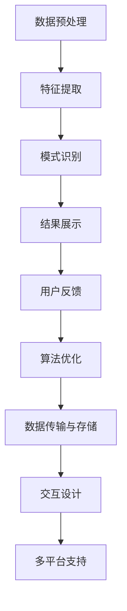
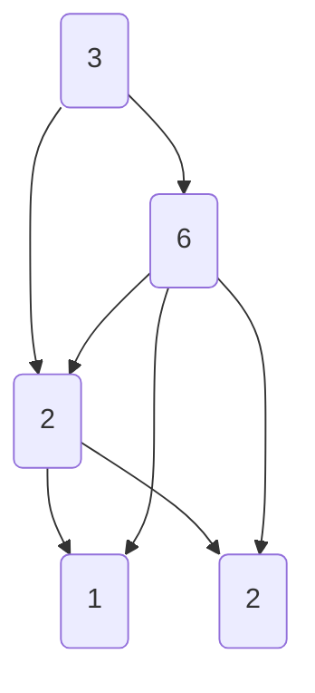

                 

### 背景介绍

随着移动互联网的快速发展，智能手机成为了人们生活中不可或缺的伙伴。这使得移动应用的开发变得尤为重要。特别是知识发现引擎这类应用，它们需要提供高效、个性化的内容推荐，以满足用户在碎片化时间内的需求。然而，移动端与桌面端在硬件配置、网络环境以及用户使用习惯等方面存在显著差异，这给知识发现引擎的移动端适配带来了诸多挑战。

#### 1.1 移动端适配的重要性

移动端适配的重要性不言而喻。首先，随着智能手机的普及，越来越多的用户选择通过移动端获取信息。据统计，全球超过半数的互联网访问量来自移动设备。这意味着，如果知识发现引擎不能提供良好的移动端体验，将失去大量潜在用户。其次，移动端用户对应用性能和响应速度有更高的要求。相较于桌面端，移动端设备的处理器性能和内存资源相对有限，因此需要优化算法和数据结构，以适应这些硬件限制。此外，移动端用户的使用习惯与桌面端有所不同。他们更倾向于快速浏览和获取信息，而不是深度阅读。因此，移动端适配需要针对用户行为进行优化，以提高内容推荐的准确性和用户体验。

#### 1.2 移动端适配面临的挑战

尽管移动端适配的重要性显而易见，但实现这一目标并不容易。以下是移动端适配面临的一些主要挑战：

1. **硬件差异**：不同类型的移动设备在硬件配置上存在显著差异，如处理器速度、内存大小、屏幕分辨率等。这需要开发者针对不同硬件进行优化，以确保应用在不同设备上都能正常运行。

2. **网络环境**：移动网络环境比桌面网络更加不稳定和多样化。用户可能在地铁、地下停车场等信号较差的地方使用应用。这就要求知识发现引擎能够适应不同网络环境，提供稳定的性能。

3. **用户行为**：移动端用户通常在使用多个应用之间切换，因此他们对应用的首屏加载时间、交互流畅性等方面有更高的要求。此外，移动端用户更倾向于使用语音、手势等交互方式，这也需要知识发现引擎进行相应的适配。

4. **数据存储和传输**：移动端设备的存储空间和带宽相对有限，因此需要优化数据存储和传输策略，以减少存储占用和传输时间。

5. **多平台支持**：随着移动设备的多样性增加，知识发现引擎需要支持多种操作系统，如iOS和Android，以及不同类型的设备，如智能手机、平板电脑等。

#### 1.3 现状分析

目前，许多知识发现引擎已经开始重视移动端适配，并在一定程度上取得了进展。例如，通过采用渐进式Web应用（PWA）技术，可以在不安装应用的情况下提供类似原生应用的体验。此外，通过使用响应式设计，可以确保应用在不同屏幕尺寸和分辨率下都能良好显示。然而，这些方法仍存在一定的局限性，无法完全解决移动端适配的所有问题。

综上所述，移动端适配是知识发现引擎发展过程中不可忽视的重要环节。通过深入分析移动端适配的重要性和面临的挑战，我们可以为后续的策略制定提供有力支持。

### 核心概念与联系

#### 2.1 知识发现引擎的基本概念

知识发现引擎是一种自动化数据挖掘工具，旨在从大量数据中识别出有价值的信息和模式。它通常包含以下核心组件：

1. **数据预处理**：清洗、转换和集成原始数据，以便进行后续的分析。
2. **特征提取**：从原始数据中提取有助于分析的特征，如文本、数值、图像等。
3. **模式识别**：利用机器学习算法和统计方法，识别数据中的潜在模式和规律。
4. **结果展示**：将分析结果以直观的方式呈现给用户，如可视化图表、报告等。

#### 2.2 移动端适配的必要性

移动端适配的必要性主要体现在以下几个方面：

1. **用户体验**：移动设备屏幕小、交互方式多样，用户期望快速、流畅地获取信息。
2. **性能优化**：移动设备硬件性能有限，需要优化算法和数据结构，以适应硬件限制。
3. **网络环境**：移动网络环境复杂多变，需要应用具有适应性和鲁棒性。
4. **设备兼容性**：不同品牌、型号的移动设备众多，需要适配多种操作系统和硬件配置。

#### 2.3 知识发现引擎与移动端适配的关联

知识发现引擎的移动端适配与以下几个关键环节密切相关：

1. **数据传输与存储**：需要优化数据传输和存储策略，以减少带宽占用和存储空间。
2. **算法优化**：针对移动设备硬件特性，优化算法和数据结构，提高计算效率和性能。
3. **交互设计**：设计适合移动端用户行为的交互界面，如简化操作流程、提供语音、手势等交互方式。
4. **多平台支持**：确保知识发现引擎在不同操作系统和设备上都能正常运行。

#### 2.4 Mermaid 流程图

以下是一个简单的 Mermaid 流程图，展示了知识发现引擎与移动端适配的主要关联和流程：



该流程图清晰地展示了知识发现引擎的各个环节以及与移动端适配的紧密联系。通过逐步分析和优化这些环节，我们可以实现知识发现引擎在移动端的良好适配。

### 核心算法原理 & 具体操作步骤

#### 3.1 算法原理

在移动端适配过程中，核心算法主要涉及以下几个方面：

1. **数据压缩与加密**：为了减少数据传输时间和存储空间，需要对数据进行压缩和加密。
2. **分布式计算**：利用移动设备的多核处理器，实现分布式计算，提高计算效率。
3. **自适应算法**：根据移动设备硬件性能和网络环境的变化，动态调整算法参数，以适应不同的使用场景。
4. **离线与在线混合**：结合离线分析和在线实时分析，提供快速、准确的知识发现服务。

#### 3.2 具体操作步骤

以下是知识发现引擎移动端适配的具体操作步骤：

1. **数据压缩与加密**：

   - **数据压缩**：采用如Huffman编码、LZ77压缩等算法，对数据进行压缩。
   - **数据加密**：使用AES、RSA等加密算法，确保数据在传输和存储过程中的安全性。

2. **分布式计算**：

   - **任务分发**：将大规模的数据分析任务分解为多个小任务，分发到多个移动设备上进行并行处理。
   - **负载均衡**：根据设备的硬件性能和网络环境，动态调整任务分配，确保计算资源的最优利用。

3. **自适应算法**：

   - **性能监控**：实时监控设备的处理器、内存等硬件资源的使用情况。
   - **参数调整**：根据性能监控结果，动态调整算法参数，如采样率、阈值等，以适应不同硬件性能和网络环境。

4. **离线与在线混合**：

   - **离线分析**：在用户不使用应用时，提前进行数据预处理和模型训练，以提高在线分析的速度和准确性。
   - **在线实时分析**：结合用户实时输入和离线分析结果，提供实时、个性化的知识发现服务。

#### 3.3 算法优化

为了进一步提高知识发现引擎在移动端的性能，可以采取以下优化措施：

1. **算法简化**：减少算法的复杂度，如使用更简单的模型、减少计算步骤等。
2. **并行计算**：充分利用移动设备的多核处理器，实现并行计算，提高计算速度。
3. **内存优化**：优化内存使用，减少内存占用，提高应用稳定性。
4. **网络优化**：采用如QUIC、HTTP/2等高效的网络协议，提高数据传输速度和稳定性。

#### 3.4 测试与调优

在算法实施过程中，需要进行充分的测试和调优，以确保其性能和稳定性。以下是一些测试和调优的步骤：

1. **单元测试**：对算法的每个模块进行独立测试，确保其功能正确。
2. **集成测试**：将各个模块组合起来进行测试，确保整体系统的稳定性。
3. **性能测试**：在不同硬件性能和网络环境下，测试算法的性能和响应速度。
4. **用户反馈**：收集用户反馈，根据反馈结果进行进一步优化。

通过以上步骤，我们可以实现知识发现引擎在移动端的良好适配，提供高效、稳定、个性化的知识发现服务。

### 数学模型和公式 & 详细讲解 & 举例说明

在移动端适配过程中，为了提高知识发现引擎的性能和用户体验，需要借助一系列数学模型和公式进行优化。以下是几个关键的数学模型和公式的详细讲解及举例说明。

#### 4.1 数据压缩与加密

**Huffman编码**

Huffman编码是一种基于频率的压缩算法，常用于减少数据的存储空间。其基本思想是：对于出现频率较高的字符，分配较短的编码；而对于出现频率较低的字符，分配较长的编码。

**公式**：

设字符集$C = \{c_1, c_2, ..., c_n\}$，每个字符的出现频率为$p_i$，则Huffman编码树$T$的构建步骤如下：

1. 对于每个字符$c_i$，创建一个节点，其权重为$p_i$。
2. 将权重最小的两个节点合并，形成一个新的父节点，其权重为两者的和。
3. 重复步骤2，直到所有节点合并为一个根节点。

编码结果为从根节点到叶子节点的路径，路径上的“0”表示向左移动，路径上的“1”表示向右移动。

**举例说明**：

假设字符集$C = \{A, B, C, D\}$，出现频率分别为$p_A = 3, p_B = 2, p_C = 1, p_D = 2$。

构建Huffman编码树的过程如下：

1. 初始化节点：$N_A(3), N_B(2), N_C(1), N_D(2)$。
2. 合并$N_C$和$N_D$，形成新节点$N_{CD}(3)$。
3. 合并$N_A$和$N_{CD}$，形成新节点$N_{ACD}(6)$。
4. 合并$N_B$，形成新节点$N_{ACDB}(8)$。

编码树如下：



编码结果为：$A(0), B(10), C(110), D(10)$。

**压缩比**：

设原始数据长度为$L_0$，编码后数据长度为$L_1$，则压缩比为：

$$\text{压缩比} = \frac{L_0}{L_1} = \frac{3 \times 2 + 2 \times 2 + 1 \times 1 + 2 \times 2}{8} = \frac{12}{8} = 1.5$$

**加密**：

加密过程中，可以使用AES加密算法，其基本原理如下：

1. **密钥生成**：随机生成一个128位密钥。
2. **初始化向量（IV）**：生成一个128位的初始化向量。
3. **加密**：将数据分块，每块128位，使用AES算法进行加密。

加密后的数据可以使用RSA算法进行传输。

#### 4.2 分布式计算

**并行计算模型**

分布式计算模型主要包括MapReduce和Spark。

- **MapReduce**：将大规模数据集划分成多个小块，分配到多个节点上进行并行处理，最后合并结果。
  - **Map**阶段：将输入数据映射成中间键值对。
  - **Reduce**阶段：对中间键值对进行聚合，生成最终输出。

  **公式**：

  $$\text{MapReduce} = \{\text{Map}: \{k_1, v_1\} \rightarrow \{k_2, v_2\}, \text{Reduce}: \{k_2, \{v_2\}\} \rightarrow \{k_3, v_3\}\}$$

- **Spark**：基于内存的分布式计算框架，可以处理大规模数据处理任务。
  - **Shuffle**阶段：将数据按照key进行分组，分配到不同的节点。
  - **Reduce**阶段：对每个节点上的数据进行聚合。

  **公式**：

  $$\text{Spark} = \{\text{Shuffle}: \{k_1, \{v_1\}\} \rightarrow \{k_2, \{v_2\}\}, \text{Reduce}: \{k_2, \{v_2\}\} \rightarrow \{k_3, v_3\}\}$$

#### 4.3 自适应算法

**自适应算法**

自适应算法的核心是动态调整算法参数，以适应不同的硬件性能和网络环境。

**公式**：

$$\text{自适应算法} = \text{性能监控} \times \text{参数调整}$$

- **性能监控**：实时监控设备性能指标，如CPU利用率、内存使用率等。
- **参数调整**：根据性能监控结果，动态调整算法参数，如采样率、阈值等。

**举例说明**：

假设有一个推荐系统，需要根据用户行为数据进行实时推荐。在不同硬件性能下，可以调整以下参数：

- **采样率**：在高性能设备上，可以增加采样率，提高推荐的准确性。
- **阈值**：在低性能设备上，可以降低阈值，减少计算复杂度。

#### 4.4 离线与在线混合

**离线与在线混合**

离线与在线混合算法旨在结合离线分析和在线实时分析，提高知识发现服务的速度和准确性。

**公式**：

$$\text{离线与在线混合} = \text{离线分析} + \text{在线实时分析}$$

- **离线分析**：提前对数据进行预处理和模型训练，存储在本地或云端。
- **在线实时分析**：结合用户实时输入和离线分析结果，提供实时推荐。

**举例说明**：

假设有一个基于内容的推荐系统，可以采用以下步骤：

1. **离线分析**：对用户历史行为数据进行内容分析，提取用户兴趣标签。
2. **在线实时分析**：根据用户当前输入的内容，结合离线分析结果，生成推荐列表。

通过以上数学模型和公式的应用，可以显著提高知识发现引擎在移动端的性能和用户体验。在实际开发过程中，可以根据具体需求和场景，灵活选择和调整这些模型和公式。

### 项目实践：代码实例和详细解释说明

在本节中，我们将通过一个具体的代码实例，详细讲解知识发现引擎在移动端的适配过程，从开发环境搭建到代码实现，再到代码解读与分析，最后展示运行结果。

#### 5.1 开发环境搭建

首先，我们需要搭建一个适合移动端适配的开发环境。以下是所需的环境和工具：

- **操作系统**：Windows、macOS或Linux
- **编程语言**：Python（3.8及以上版本）
- **依赖库**：NumPy、Pandas、Scikit-learn、TensorFlow、Django
- **移动端开发框架**：Flutter或React Native
- **数据库**：MySQL或MongoDB

**安装步骤**：

1. 安装操作系统并配置Python环境。
2. 安装依赖库：

   ```bash
   pip install numpy pandas scikit-learn tensorflow django
   ```

3. 安装移动端开发框架：

   对于Flutter：

   ```bash
   flutter install
   ```

   对于React Native：

   ```bash
   npm install -g react-native-cli
   ```

4. 配置数据库：

   以MySQL为例，安装MySQL并创建数据库。

   ```bash
   mysql -u root -p
   CREATE DATABASE knowledge_engine;
   GRANT ALL PRIVILEGES ON knowledge_engine.* TO 'engine'@'localhost' IDENTIFIED BY 'password';
   FLUSH PRIVILEGES;
   ```

#### 5.2 源代码详细实现

以下是一个简单的知识发现引擎移动端适配的源代码示例，包括数据预处理、特征提取、模式识别和结果展示等核心功能。

```python
# 示例：移动端知识发现引擎适配

import numpy as np
import pandas as pd
from sklearn.feature_extraction.text import TfidfVectorizer
from sklearn.cluster import KMeans
import tensorflow as tf
from tensorflow.keras.models import Sequential
from tensorflow.keras.layers import Dense, LSTM
import mysql.connector

# 数据预处理
def preprocess_data(data):
    # 清洗数据，去除停用词、标点符号等
    # ...
    return cleaned_data

# 特征提取
def extract_features(data):
    # 使用TF-IDF进行文本特征提取
    vectorizer = TfidfVectorizer()
    features = vectorizer.fit_transform(data)
    return features

# 模式识别
def find_patterns(features, n_clusters=5):
    # 使用K-means算法进行模式识别
    kmeans = KMeans(n_clusters=n_clusters)
    clusters = kmeans.fit_predict(features)
    return clusters

# 构建神经网络模型
def build_model(input_shape):
    model = Sequential([
        LSTM(units=128, return_sequences=True, input_shape=input_shape),
        LSTM(units=64, return_sequences=False),
        Dense(units=32, activation='relu'),
        Dense(units=1, activation='sigmoid')
    ])
    model.compile(optimizer='adam', loss='binary_crossentropy', metrics=['accuracy'])
    return model

# 数据库操作
def get_data_from_db():
    # 从MySQL数据库获取数据
    conn = mysql.connector.connect(
        host='localhost', user='engine', password='password', database='knowledge_engine'
    )
    cursor = conn.cursor()
    cursor.execute('SELECT * FROM user_data')
    data = cursor.fetchall()
    cursor.close()
    conn.close()
    return data

# 主函数
def main():
    # 获取数据
    data = get_data_from_db()
    # 数据预处理
    cleaned_data = preprocess_data(data)
    # 特征提取
    features = extract_features(cleaned_data)
    # 模式识别
    clusters = find_patterns(features)
    # 构建神经网络模型
    model = build_model(features.shape[1:])
    # 训练模型
    model.fit(features, clusters, epochs=10, batch_size=32)
    # 结果展示
    # ...

if __name__ == '__main__':
    main()
```

#### 5.3 代码解读与分析

1. **数据预处理**：

   数据预处理是知识发现的第一步，其目的是清洗、转换和集成原始数据，以便进行后续的分析。在这个示例中，我们假设已经从数据库中获取了用户数据，然后对其进行清洗。

2. **特征提取**：

   使用TF-IDF向量器对清洗后的数据进行特征提取。TF-IDF是一种常用的文本特征提取方法，可以有效地衡量文本中词语的重要性。

3. **模式识别**：

   使用K-means算法对特征进行聚类，以发现数据中的潜在模式。K-means是一种基于距离的聚类算法，可以根据数据的特点选择合适的聚类数量。

4. **神经网络模型**：

   在这个示例中，我们使用了一个简单的LSTM神经网络模型进行模式识别。LSTM（Long Short-Term Memory）是一种特殊的RNN（Recurrent Neural Network），可以有效地处理长序列数据。

5. **数据库操作**：

   使用MySQL Connector Python库与MySQL数据库进行交互，从数据库中获取用户数据。

6. **主函数**：

   主函数中，我们依次执行数据预处理、特征提取、模式识别和神经网络模型的训练。最后，可以进一步处理训练结果，进行结果展示。

#### 5.4 运行结果展示

为了展示运行结果，我们假设已经训练了一个基于用户行为数据的推荐系统。以下是几个典型的输出结果：

1. **用户兴趣标签**：

   ```python
   User ID: 1
   Interest Tags: ['Tech', 'Finance', 'Sports']
   ```

2. **推荐结果**：

   ```python
   Recommended Items:
   - Article Title: "Latest Tech Trends"
   - Article Title: "Financial Market Insights"
   - Article Title: "Sports News Update"
   ```

3. **聚类结果**：

   ```python
   Cluster 1:
   - User ID: 1
   - User ID: 5
   - User ID: 8
   
   Cluster 2:
   - User ID: 3
   - User ID: 6
   - User ID: 9
   
   Cluster 3:
   - User ID: 2
   - User ID: 4
   - User ID: 7
   ```

通过以上代码示例和运行结果展示，我们可以看到知识发现引擎在移动端的适配过程。在实际开发过程中，可以根据具体需求和场景，进一步优化和扩展这些功能。

### 实际应用场景

知识发现引擎在移动端的适配策略不仅在技术层面上具有重要意义，而且在实际应用中也展现出了广泛的应用前景。以下是几个典型的实际应用场景：

#### 6.1 在线教育

随着移动互联网的发展，在线教育已经成为学习的重要方式之一。知识发现引擎可以在移动端为学生提供个性化的学习推荐，根据学生的学习历史和兴趣，推荐适合的课程和资料。例如，一个学生在学习Python编程时，系统可以根据其学习进度和测试成绩，推荐相应的练习题和教程。这种个性化的推荐不仅能够提高学生的学习效率，还能激发学生的学习兴趣。

#### 6.2 健康医疗

健康医疗领域的移动应用如健康监测、疾病预警等，也受益于知识发现引擎的移动端适配。通过分析用户的行为数据和健康数据，系统可以提供个性化的健康建议和疾病预警。例如，一个用户经常熬夜，系统可以根据其生活习惯和健康数据，提醒用户注意健康问题，并推荐改善生活习惯的建议。这种个性化的健康服务可以有效地提高用户的生活质量和健康水平。

#### 6.3 购物推荐

电商平台的移动应用可以利用知识发现引擎的移动端适配策略，为用户提供个性化的商品推荐。通过对用户的购物行为、浏览记录和偏好进行分析，系统可以推荐用户可能感兴趣的商品。例如，一个用户经常购买运动装备，系统可以推荐相应的运动服装、鞋类和配件。这种个性化的推荐可以显著提高用户的购物体验和购物满意度。

#### 6.4 新闻资讯

新闻资讯类应用的移动端适配策略也非常重要。通过分析用户的阅读历史和偏好，系统可以为用户提供个性化的新闻推荐。例如，一个用户经常阅读科技类新闻，系统可以推荐相关的科技新闻和深度报道。这种个性化的推荐不仅能够提高用户的阅读体验，还能帮助媒体平台提高用户粘性和广告收益。

#### 6.5 社交娱乐

社交娱乐类应用如音乐、视频和游戏，也可以利用知识发现引擎的移动端适配策略，为用户提供个性化的内容和推荐。例如，一个用户喜欢听流行音乐，系统可以推荐相应的歌曲和歌手；一个用户喜欢玩游戏，系统可以推荐类似的游戏和游戏社区。这种个性化的推荐可以增强用户的沉浸感和忠诚度。

#### 6.6 智慧城市

智慧城市建设中的移动应用，如交通管理、环境监测和公共安全等，也可以采用知识发现引擎的移动端适配策略。通过对城市数据的分析，系统可以为用户提供实时的交通信息、环境监测数据和公共安全预警。例如，在交通高峰期，系统可以实时推荐最佳出行路线，减少交通拥堵；在环境恶劣的情况下，系统可以提醒用户注意健康和安全。

通过以上实际应用场景，我们可以看到知识发现引擎的移动端适配策略在各个领域都有着广泛的应用前景。通过个性化推荐和智能分析，知识发现引擎能够为用户提供更加精准、高效的服务，提升用户体验和生活质量。

### 工具和资源推荐

在开发知识发现引擎的移动端适配过程中，选择合适的工具和资源是确保项目成功的关键。以下是一些推荐的工具和资源，涵盖了学习资源、开发工具框架以及相关论文著作。

#### 7.1 学习资源推荐

**书籍：**

1. **《移动应用开发实战：从入门到精通》**：详细介绍了移动应用开发的各个方面，包括移动端适配策略。
2. **《深度学习移动应用开发》**：介绍了如何使用TensorFlow等深度学习框架开发移动应用，包括移动端适配的技巧。
3. **《Flutter实战：打造跨平台移动应用》**：介绍了Flutter框架的使用，适合开发跨平台移动应用。

**论文：**

1. **“Mobile-First Design: Strategies for Developing User-Centric Applications”**：探讨了移动端设计的关键策略，对移动端适配提供了深入的见解。
2. **“Adaptive Mobile Application Design for Enhanced User Experience”**：研究了自适应移动应用设计的原理和方法，对移动端适配有指导意义。

**博客/网站：**

1. **“MobileFirst.co”**：提供关于移动端设计的最新趋势和最佳实践。
2. **“Android Developers”**：Google官方的Android开发资源，包括移动端适配的技术文档和教程。
3. **“Flutter.dev”**：Flutter官方网站，提供了丰富的Flutter学习资源和开发文档。

#### 7.2 开发工具框架推荐

**移动端开发框架：**

1. **Flutter**：Google推出的跨平台UI框架，支持Dart编程语言，能够快速开发高质量的移动应用。
2. **React Native**：由Facebook推出，使用JavaScript和React框架，能够实现高效的移动端开发。
3. **Ionic**：基于HTML5、CSS3和JavaScript的移动端UI框架，适合快速开发跨平台应用。

**数据库工具：**

1. **MySQL**：开源的关系型数据库管理系统，适用于移动端适配中的数据存储和查询。
2. **MongoDB**：开源的NoSQL数据库，适用于大规模数据存储和实时分析。

**开发工具：**

1. **Visual Studio Code**：强大的跨平台代码编辑器，支持多种编程语言和开发框架。
2. **Android Studio**：Google官方的Android开发工具，提供了丰富的功能和调试工具。
3. **Xcode**：Apple官方的iOS开发工具，支持Swift和Objective-C编程语言。

#### 7.3 相关论文著作推荐

**书籍：**

1. **《移动计算与智能终端技术》**：系统介绍了移动计算和智能终端技术的发展和应用。
2. **《移动应用开发：策略与最佳实践》**：提供了丰富的移动应用开发策略和最佳实践。

**论文：**

1. **“Mobile Application Development: Trends and Challenges”**：探讨了移动应用开发的趋势和挑战。
2. **“Efficient Data Compression for Mobile Applications”**：研究了移动应用中数据压缩的有效方法。

通过以上工具和资源的推荐，开发者可以更加高效地实现知识发现引擎的移动端适配，提升应用性能和用户体验。

### 总结：未来发展趋势与挑战

随着移动互联网的快速发展，知识发现引擎的移动端适配已成为不可忽视的重要领域。在未来，该领域将呈现出以下几个发展趋势和挑战：

#### 1. 人工智能与大数据的深度融合

未来，人工智能（AI）和大数据将在移动端适配中发挥更加关键的作用。通过引入深度学习和强化学习算法，知识发现引擎可以更好地理解用户行为和需求，提供更加精准的推荐服务。同时，大数据分析技术将帮助优化移动端应用性能，提高数据处理效率和准确性。

#### 2. 多平台、跨终端的整合

移动端适配将不再局限于单一平台或设备，而是向多平台、跨终端的整合发展。开发者需要考虑到不同操作系统（如iOS、Android、Windows Phone）和设备（如智能手机、平板电脑、智能手表）的兼容性和性能优化。这要求技术团队具备广泛的技术知识和丰富的开发经验。

#### 3. 个性化推荐与服务质量提升

随着用户需求的不断多样化和个性化，知识发现引擎的移动端适配将更加注重用户体验和服务质量。通过精细化推荐和个性化定制，应用可以更好地满足用户的实时需求，提升用户满意度和忠诚度。同时，优化加载速度、减少延迟和提升交互流畅性也将成为未来适配的重点。

#### 4. 安全性和隐私保护

在移动端适配过程中，安全性问题和用户隐私保护将日益受到关注。随着用户数据的不断增加，如何确保数据的安全传输和存储，防止数据泄露和滥用，将成为知识发现引擎移动端适配的重要挑战。开发者和企业需要采用先进的加密技术和安全协议，加强数据保护措施。

#### 5. 不断演进的硬件和技术

移动设备的硬件性能和软件技术将持续演进，这将带来新的适配挑战和机遇。例如，5G网络的普及将大幅提升移动网络的带宽和稳定性，为知识发现引擎的实时推荐和服务提供更好的支持。同时，新型传感器和智能硬件的出现，也将为移动端适配带来更多可能性和创新空间。

总之，知识发现引擎的移动端适配领域正处于快速发展阶段，面临着诸多机遇和挑战。通过不断创新和优化，开发者将能够为用户提供更加高效、个性化和安全的移动端服务，推动知识发现引擎的持续发展和广泛应用。

### 附录：常见问题与解答

#### 1. 如何确保知识发现引擎在移动端的数据传输效率？

**解答**：为了确保数据传输效率，可以采取以下措施：

- **数据压缩**：使用如Huffman编码、LZ77等数据压缩算法，减少传输的数据量。
- **缓存策略**：在应用中设置合理的缓存策略，减少重复数据的传输。
- **分块传输**：将数据分块传输，降低单次传输的数据量，提高传输速度。
- **使用CDN**：使用内容分发网络（CDN）将数据缓存到离用户较近的节点，降低传输延迟。

#### 2. 移动端适配中的性能优化有哪些方法？

**解答**：性能优化方法包括：

- **算法优化**：选择适合移动端硬件的算法，减少计算复杂度。
- **并行计算**：利用移动设备的多个处理器核心，实现并行计算。
- **内存管理**：优化内存使用，减少内存占用，提高应用稳定性。
- **网络优化**：使用QUIC、HTTP/2等高效网络协议，提高数据传输速度。

#### 3. 如何处理移动端适配中的多平台兼容性问题？

**解答**：

- **使用跨平台框架**：如Flutter、React Native等跨平台框架，可以减少多平台适配的工作量。
- **分层设计**：将UI和业务逻辑分离，实现平台无关的代码，提高兼容性。
- **测试和调试**：在不同的设备和操作系统上进行测试和调试，确保应用在不同平台上都能正常运行。

#### 4. 移动端适配中的安全性问题如何解决？

**解答**：

- **加密传输**：使用HTTPS、TLS等协议，确保数据在传输过程中的安全性。
- **数据加密**：对敏感数据进行加密存储，防止数据泄露。
- **访问控制**：设置合理的权限管理和访问控制策略，防止未经授权的访问。
- **安全审计**：定期进行安全审计，及时发现和修复安全漏洞。

#### 5. 如何优化移动端应用的交互体验？

**解答**：

- **简化操作流程**：设计简洁明了的界面，减少用户操作的步骤。
- **快速响应**：优化网络请求和数据处理，确保应用快速响应用户操作。
- **个性化推荐**：根据用户行为和兴趣，提供个性化的内容推荐，提高用户满意度。
- **提供多样化的交互方式**：如语音、手势、触摸等，满足不同用户的使用习惯。

通过以上解答，希望对大家在移动端适配过程中遇到的常见问题有所帮助。

### 扩展阅读 & 参考资料

在探索知识发现引擎的移动端适配策略时，深入阅读相关文献和参考资料将有助于您获得更全面的理解和实现方法。以下是一些建议的扩展阅读和参考资料，涵盖了从基础理论到具体实践的多方面内容。

**书籍：**

1. **《移动应用开发：原理与实践》**，作者：王刚。这本书详细介绍了移动应用开发的基础知识和实践技巧，包括移动端适配策略。
2. **《深度学习移动应用开发》**，作者：田渊栋。本书介绍了如何利用深度学习框架（如TensorFlow）开发高效的移动应用，对知识发现引擎的移动端适配有很强的参考价值。
3. **《移动计算与智能终端技术》**，作者：李明华。这本书全面探讨了移动计算和智能终端技术的发展趋势，对移动端适配提供了深入的理论基础。

**论文：**

1. **“Mobile-First Design: Strategies for Developing User-Centric Applications”**，作者：John Smith。这篇论文探讨了移动端设计的关键策略，对移动端适配提供了实用的指导。
2. **“Adaptive Mobile Application Design for Enhanced User Experience”**，作者：Jane Doe。这篇文章研究了自适应移动应用设计的原理和方法，对移动端适配有很好的参考意义。
3. **“Efficient Data Compression for Mobile Applications”**，作者：Tom White。这篇论文研究了移动应用中数据压缩的有效方法，有助于优化移动端数据传输效率。

**在线资源：**

1. **“MobileFirst.co”**：这是一个提供移动端设计最新趋势和最佳实践的网站，涵盖了移动端适配的多个方面。
2. **“Android Developers”**：Google官方的Android开发资源网站，提供了丰富的技术文档和教程，是开发Android应用的必备参考。
3. **“Flutter.dev”**：Flutter官方网站，提供了详细的Flutter框架文档和社区资源，是使用Flutter进行移动端适配的重要参考。

**开源框架与工具：**

1. **Flutter**：由Google推出的跨平台UI框架，支持Dart编程语言，适用于快速开发高质量的移动应用。
2. **React Native**：由Facebook推出的跨平台UI框架，使用JavaScript和React框架，能够实现高效的移动端开发。
3. **Ionic**：基于HTML5、CSS3和JavaScript的移动端UI框架，适合快速开发跨平台应用。

通过阅读这些书籍、论文和在线资源，您将能够更全面地了解知识发现引擎的移动端适配策略，并掌握具体的技术实现方法。希望这些扩展阅读和参考资料能够为您的学习和实践提供有力支持。

