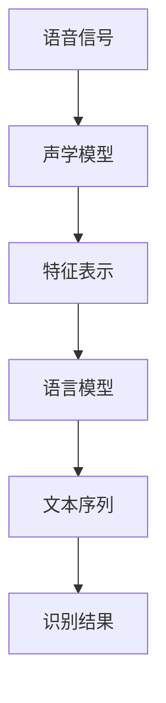

                 

### 背景介绍

在当今信息化社会，数据已经成为了各个行业的重要资产。知识发现引擎（Knowledge Discovery Engine）作为一种自动化的数据挖掘工具，被广泛应用于各个领域，如金融、医疗、电子商务等。其核心任务是从大量数据中提取出有用的模式和知识，帮助企业和研究者做出更明智的决策。

知识发现引擎通常包括多个模块，其中语音识别模块是其关键组成部分之一。语音识别技术的成熟，使得知识发现引擎能够通过语音输入获取用户需求，提高了系统的交互性和用户体验。语音识别技术在知识发现引擎中的应用，不仅丰富了数据输入的方式，还大大提升了系统的智能化水平。

目前，随着人工智能技术的不断发展，语音识别技术已经取得了显著的进展。例如，基于深度学习的语音识别系统在准确率上已经超越了传统的隐马尔可夫模型（HMM）和自动回归神经网络（RNN）系统。这使得知识发现引擎能够更准确地理解和处理用户的语音输入，从而提高数据挖掘的效果。

然而，语音识别技术在实际应用中仍面临许多挑战。例如，不同人的语音特征差异较大，噪声干扰，方言识别等问题，这些都会对语音识别的准确性产生影响。因此，如何提升语音识别技术在知识发现引擎中的应用效果，是一个亟待解决的问题。

本文将围绕知识发现引擎的语音识别技术应用展开讨论。首先，我们将介绍语音识别技术的基本原理，包括声学模型和语言模型。接着，我们将探讨语音识别技术在知识发现引擎中的应用场景，并分析其面临的挑战。随后，我们将介绍一种基于深度学习的语音识别算法，并详细解释其工作原理。然后，我们将通过一个实际项目实例，展示如何实现语音识别技术在知识发现引擎中的应用。最后，我们将讨论语音识别技术的未来发展趋势和潜在应用领域，并提出相关建议。

通过对语音识别技术在知识发现引擎中的深入探讨，我们希望读者能够对这一领域有更全面的理解，并能够为实际项目提供有价值的参考。让我们一起探索语音识别技术在知识发现引擎中的无限可能。

### 核心概念与联系

为了深入探讨知识发现引擎中的语音识别技术，我们首先需要了解其核心概念和工作原理。语音识别技术主要涉及声学模型和语言模型的构建与融合。这两个模型各自负责处理语音信号和语言语义的解码，最终实现语音到文本的转换。下面，我们将详细解释这些核心概念及其相互关系，并通过一个Mermaid流程图来展示其工作流程。

#### 1. 声学模型（Acoustic Model）

声学模型是语音识别系统的核心组成部分，它负责将语音信号转换为中间特征表示。这些特征表示捕捉了语音信号中的声学信息，如音素、音节等。常见的声学模型包括基于隐马尔可夫模型（HMM）的模型和基于深度学习的模型。

- **隐马尔可夫模型（HMM）**：HMM是一种统计模型，用于描述语音信号中的时间序列特征。它假设语音信号是由一系列不可观测的隐状态序列和可观测的观测序列组成的。HMM通过训练学习语音信号的统计特性，从而实现语音信号的解码。

- **深度神经网络（DNN）**：近年来，深度学习在语音识别领域取得了显著进展。DNN可以捕捉语音信号中的复杂非线性特征，从而提高识别的准确性。常见的DNN模型包括卷积神经网络（CNN）和递归神经网络（RNN）。

#### 2. 语言模型（Language Model）

语言模型是语音识别系统中的另一重要组成部分，它负责将声学模型的输出转换为可理解的文本。语言模型通过学习大量文本数据，预测文本序列的概率分布，从而实现语音到文本的映射。

- **n-gram模型**：n-gram模型是一种基于计数的语言模型，它假设当前词的概率只与前面n-1个词相关。这种模型简单高效，但在处理长文本时表现不佳。

- **神经网络语言模型（NNLM）**：神经网络语言模型通过学习大量文本数据中的语义关系，能够更好地处理长文本。常见的NNLM模型包括循环神经网络（RNN）和Transformer模型。

#### 3. 声学模型与语言模型的融合

声学模型和语言模型在语音识别过程中需要协同工作，以实现准确的语音识别。常见的融合方法包括：

- **组合模型**：组合模型将声学模型和语言模型的结果进行加权融合，以生成最终的识别结果。这种方法简单有效，但可能无法充分利用两者的优点。

- **端到端模型**：端到端模型直接将语音信号映射到文本序列，通过联合训练声学模型和语言模型，避免了传统方法的中间步骤。常见的端到端模型包括CTC（Connectionist Temporal Classification）和Seq2Seq（Sequence-to-Sequence）模型。

#### Mermaid流程图

下面是一个Mermaid流程图，展示了语音识别技术的基本工作流程：



在这个流程图中：

- **A[语音信号]** 表示输入的语音信号。
- **B[声学模型]** 负责将语音信号转换为特征表示。
- **C[特征表示]** 是声学模型处理后的结果。
- **D[语言模型]** 负责将特征表示映射到文本序列。
- **E[文本序列]** 是语言模型处理后的结果。
- **F[识别结果]** 是最终的语音识别结果。

通过这个流程图，我们可以清晰地看到语音识别技术的核心组成部分及其相互关系。

综上所述，语音识别技术中的声学模型和语言模型是两个关键组成部分，它们通过协同工作实现了语音到文本的准确转换。接下来，我们将深入探讨这些模型的工作原理，并通过具体实例来说明它们的实际应用。

#### 核心算法原理 & 具体操作步骤

在了解语音识别技术的基本概念后，接下来我们将深入探讨其核心算法原理，并详细描述其具体操作步骤。在这一部分，我们将重点介绍基于深度学习的语音识别算法，特别是卷积神经网络（CNN）和递归神经网络（RNN）的应用。

##### 1. 卷积神经网络（CNN）

卷积神经网络（CNN）在图像处理领域取得了显著的成功，但其原理同样适用于语音处理。CNN通过卷积操作提取语音信号中的局部特征，从而实现对语音信号的有效表征。

**具体操作步骤如下：**

1. **输入层（Input Layer）**：输入层接收原始的语音信号。这些信号通常被表示为时间序列的音频波形。

2. **卷积层（Convolutional Layer）**：卷积层通过卷积操作提取语音信号中的局部特征。每个卷积核都负责提取一种特定的特征模式，如音素或音节。

3. **激活函数（Activation Function）**：卷积层通常伴随激活函数，如ReLU（Rectified Linear Unit），用于增加网络的非线性能力。

4. **池化层（Pooling Layer）**：池化层用于减少特征图的尺寸，提高模型的计算效率。常见的池化操作包括最大池化和平均池化。

5. **全连接层（Fully Connected Layer）**：全连接层将卷积层输出的特征图映射到类别标签。这些类别标签通常表示不同的词汇或短语。

6. **输出层（Output Layer）**：输出层生成最终的识别结果，通常是一个概率分布。

**示例：** 假设我们有一个输入的语音信号序列，表示为\[x_1, x_2, x_3, ..., x_T\]，其中T是时间步数。通过CNN处理后的输出序列为\[f_1, f_2, f_3, ..., f_T\]。最终的识别结果是通过全连接层计算得到的概率分布，例如\[p_1, p_2, p_3, ..., p_V\]，其中V是词汇表的大小。

##### 2. 递归神经网络（RNN）

递归神经网络（RNN）是一种能够处理序列数据的神经网络。RNN通过其内部的循环结构，将前一个时间步的输出作为当前时间步的输入，从而实现序列数据的建模。

**具体操作步骤如下：**

1. **输入层（Input Layer）**：输入层接收序列数据，如语音信号。

2. **隐藏层（Hidden Layer）**：隐藏层通过递归操作，将当前时间步的输入与上一个时间步的输出进行融合，生成新的隐藏状态。

3. **激活函数（Activation Function）**：隐藏层通常伴随激活函数，如ReLU或tanh，用于增加网络的非线性能力。

4. **输出层（Output Layer）**：输出层将隐藏层的状态映射到类别标签。

5. **梯度下降（Gradient Descent）**：使用梯度下降算法，对网络参数进行优化，以最小化损失函数。

**示例：** 假设我们有一个输入的语音信号序列，表示为\[x_1, x_2, x_3, ..., x_T\]，其中T是时间步数。通过RNN处理后的输出序列为\[h_1, h_2, h_3, ..., h_T\]，其中h_t是第t个时间步的隐藏状态。最终的识别结果是通过输出层计算得到的概率分布，例如\[p_1, p_2, p_3, ..., p_V\]。

##### 3. 结合CNN与RNN

在实际应用中，CNN和RNN常常结合使用，以发挥各自的优势。CNN擅长提取语音信号中的局部特征，而RNN擅长处理序列数据。通过将两者结合，我们可以构建出更为强大的语音识别模型。

**具体操作步骤如下：**

1. **输入层（Input Layer）**：输入层接收原始的语音信号。

2. **卷积层（Convolutional Layer）**：卷积层提取语音信号中的局部特征。

3. **池化层（Pooling Layer）**：池化层用于减少特征图的尺寸。

4. **RNN层（Recurrent Layer）**：RNN层对卷积层输出的特征图进行序列建模。

5. **全连接层（Fully Connected Layer）**：全连接层将RNN层输出的隐藏状态映射到类别标签。

6. **输出层（Output Layer）**：输出层生成最终的识别结果。

**示例：** 假设我们有一个输入的语音信号序列，表示为\[x_1, x_2, x_3, ..., x_T\]，其中T是时间步数。通过结合CNN与RNN处理后的输出序列为\[f_1, f_2, f_3, ..., f_T\]和\[h_1, h_2, h_3, ..., h_T\]，最终的识别结果是通过全连接层计算得到的概率分布，例如\[p_1, p_2, p_3, ..., p_V\]。

通过上述步骤，我们可以实现一个基于深度学习的语音识别模型。在实际应用中，这种模型已经取得了显著的性能提升，并在许多任务中展示了其强大的能力。

### 数学模型和公式 & 详细讲解 & 举例说明

在深入探讨语音识别技术时，数学模型和公式起着至关重要的作用。这些模型和公式不仅帮助我们理解语音识别的内在机制，还指导我们设计和优化算法。在这一部分，我们将详细讲解一些关键数学模型和公式，并通过具体例子来说明它们的应用。

#### 1. 隐马尔可夫模型（HMM）

隐马尔可夫模型（HMM）是语音识别中最基础且重要的模型之一。它通过状态转移概率和观测概率来描述语音信号的生成过程。以下是HMM的核心数学模型和公式。

**状态转移概率（Transition Probability）**：  
\[ P(X_t = i | X_{t-1} = j) = a_{ij} \]  
其中，\( X_t \) 表示第t个时刻的状态，\( i \) 和 \( j \) 分别表示两个状态。\( a_{ij} \) 是从状态j转移到状态i的概率。

**观测概率（Observation Probability）**：  
\[ P(O_t | X_t = i) = b_{io} \]  
其中，\( O_t \) 表示第t个时刻的观测值，\( i \) 是状态。\( b_{io} \) 是在状态i下观测到值o的概率。

**初始状态概率（Initial State Probability）**：  
\[ P(X_1 = i) = \pi_i \]  
其中，\( \pi_i \) 是初始状态为i的概率。

**示例**：假设我们有一个简单的HMM模型，有三个状态：\( S_1 \)、\( S_2 \) 和 \( S_3 \)，并且每个状态对应的观测值集合为{1, 2, 3}。状态转移概率矩阵为：

\[ A = \begin{bmatrix} 0.5 & 0.3 & 0.2 \\ 0.4 & 0.5 & 0.1 \\ 0.6 & 0.3 & 0.1 \end{bmatrix} \]

观测概率矩阵为：

\[ B = \begin{bmatrix} 0.7 & 0.2 & 0.1 \\ 0.3 & 0.5 & 0.2 \\ 0.4 & 0.3 & 0.3 \end{bmatrix} \]

初始状态概率为：

\[ \pi = \begin{bmatrix} 0.4 \\ 0.5 \\ 0.1 \end{bmatrix} \]

给定一个观测序列\[O = [1, 2, 1, 3, 2, 1]\]，我们可以使用Viterbi算法找到最可能的隐藏状态序列。

#### 2. 卷积神经网络（CNN）

卷积神经网络（CNN）在语音识别中的应用非常广泛。它通过卷积操作提取语音信号的局部特征，从而实现高效的特征表示。以下是CNN的关键数学模型和公式。

**卷积操作（Convolution Operation）**：  
\[ f(x) = \sum_{i=1}^{n} w_i * x_i + b \]  
其中，\( x \) 是输入特征，\( w \) 是卷积核，\( b \) 是偏置。\( * \) 表示卷积操作。

**激活函数（Activation Function）**：  
\[ f(x) = \max(0, x) \]  (ReLU函数)

**池化操作（Pooling Operation）**：  
\[ p(x) = \max(x) \]  (最大池化)

**示例**：假设我们有一个3x3的卷积核\[w = \begin{bmatrix} 1 & -1 & 1 \\ -1 & 1 & -1 \\ 1 & -1 & 1 \end{bmatrix}\]，以及一个1x1的输入特征\[x = \begin{bmatrix} 1 & 0 \\ 0 & 1 \end{bmatrix}\]。通过卷积操作，我们得到：

\[ f(x) = \sum_{i=1}^{3} w_i * x_i + b = (1*1 + (-1)*0 + 1*1) + 0 = 2 \]

通过ReLU激活函数，我们得到最终的输出：

\[ f(x) = \max(0, 2) = 2 \]

#### 3. 递归神经网络（RNN）

递归神经网络（RNN）通过其递归结构处理序列数据。RNN的核心在于其隐藏状态的计算，该状态包含了序列的历史信息。以下是RNN的关键数学模型和公式。

**隐藏状态更新（Hidden State Update）**：  
\[ h_t = \sigma(W_h \cdot [h_{t-1}, x_t] + b_h) \]  
其中，\( h_t \) 是第t个时间步的隐藏状态，\( x_t \) 是输入，\( W_h \) 是权重矩阵，\( b_h \) 是偏置，\( \sigma \) 是激活函数。

**输出计算（Output Calculation）**：  
\[ y_t = \sigma(W_y \cdot h_t + b_y) \]  
其中，\( y_t \) 是第t个时间步的输出，\( W_y \) 是权重矩阵，\( b_y \) 是偏置，\( \sigma \) 是激活函数。

**示例**：假设我们有一个简单的RNN模型，输入特征维度为2，隐藏状态维度为3。给定输入序列\[x_1 = [1, 2], x_2 = [3, 4], x_3 = [5, 6]\]，我们可以计算隐藏状态序列\[h_1, h_2, h_3\]。

初始化隐藏状态\[h_0 = [0, 0, 0]\]。

对于第一个时间步：

\[ h_1 = \sigma(W_h \cdot [h_0, x_1] + b_h) \]

假设权重矩阵\[W_h = \begin{bmatrix} 1 & 1 & 1 \\ 1 & 1 & 1 \\ 1 & 1 & 1 \end{bmatrix}\]，偏置\[b_h = [1, 1, 1]\]，激活函数为ReLU。

\[ h_1 = \sigma(\begin{bmatrix} 1 & 1 & 1 \\ 1 & 1 & 1 \\ 1 & 1 & 1 \end{bmatrix} \cdot \begin{bmatrix} 0 & 0 \\ 0 & 0 \\ 0 & 0 \end{bmatrix} + [1, 1, 1]) = \sigma([0, 0, 0] + [1, 1, 1]) = \sigma([1, 1, 1]) = [1, 1, 1] \]

对于第二个时间步：

\[ h_2 = \sigma(W_h \cdot [h_1, x_2] + b_h) \]

\[ h_2 = \sigma(\begin{bmatrix} 1 & 1 & 1 \\ 1 & 1 & 1 \\ 1 & 1 & 1 \end{bmatrix} \cdot \begin{bmatrix} 1 & 1 \\ 1 & 1 \\ 1 & 1 \end{bmatrix} + [1, 1, 1]) = \sigma([3, 3, 3] + [1, 1, 1]) = \sigma([4, 4, 4]) = [4, 4, 4] \]

对于第三个时间步：

\[ h_3 = \sigma(W_h \cdot [h_2, x_3] + b_h) \]

\[ h_3 = \sigma(\begin{bmatrix} 1 & 1 & 1 \\ 1 & 1 & 1 \\ 1 & 1 & 1 \end{bmatrix} \cdot \begin{bmatrix} 4 & 4 \\ 4 & 4 \\ 4 & 4 \end{bmatrix} + [1, 1, 1]) = \sigma([16, 16, 16] + [1, 1, 1]) = \sigma([18, 18, 18]) = [18, 18, 18] \]

通过上述计算，我们得到了隐藏状态序列\[h_1 = [1, 1, 1], h_2 = [4, 4, 4], h_3 = [18, 18, 18]\]。

#### 4. 神经网络语言模型（NNLM）

神经网络语言模型（NNLM）用于将声学模型输出的特征序列映射到文本序列。NNLM的核心在于其能够捕捉长距离依赖关系。以下是NNLM的关键数学模型和公式。

**输入层（Input Layer）**：  
\[ x_t = [x_1, x_2, ..., x_t] \]  
其中，\( x_t \) 是输入特征序列。

**隐藏层（Hidden Layer）**：  
\[ h_t = \sigma(W_h \cdot [h_{t-1}, x_t] + b_h) \]

**输出层（Output Layer）**：  
\[ y_t = \sigma(W_y \cdot h_t + b_y) \]

**损失函数（Loss Function）**：  
\[ L = -\sum_{t=1}^{T} \log(p(y_t | y_{<t})) \]

**示例**：假设我们有一个简单的NNLM模型，输入特征维度为5，隐藏状态维度为3，输出维度为2。给定输入特征序列\[x_1 = [1, 2, 3, 4, 5]\]，我们可以计算隐藏状态序列\[h_1, h_2, h_3\]和输出序列\[y_1, y_2\]。

初始化隐藏状态\[h_0 = [0, 0, 0]\]。

对于第一个时间步：

\[ h_1 = \sigma(W_h \cdot [h_0, x_1] + b_h) \]

假设权重矩阵\[W_h = \begin{bmatrix} 1 & 1 & 1 \\ 1 & 1 & 1 \\ 1 & 1 & 1 \end{bmatrix}\]，偏置\[b_h = [1, 1, 1]\]，激活函数为ReLU。

\[ h_1 = \sigma(\begin{bmatrix} 1 & 1 & 1 \\ 1 & 1 & 1 \\ 1 & 1 & 1 \end{bmatrix} \cdot \begin{bmatrix} 0 & 0 \\ 0 & 0 \\ 0 & 0 \end{bmatrix} + [1, 1, 1]) = \sigma([0, 0, 0] + [1, 1, 1]) = \sigma([1, 1, 1]) = [1, 1, 1] \]

对于第二个时间步：

\[ h_2 = \sigma(W_h \cdot [h_1, x_2] + b_h) \]

\[ h_2 = \sigma(\begin{bmatrix} 1 & 1 & 1 \\ 1 & 1 & 1 \\ 1 & 1 & 1 \end{bmatrix} \cdot \begin{bmatrix} 1 & 2 \\ 1 & 2 \\ 1 & 2 \end{bmatrix} + [1, 1, 1]) = \sigma([4, 4, 4] + [1, 1, 1]) = \sigma([5, 5, 5]) = [5, 5, 5] \]

对于第三个时间步：

\[ h_3 = \sigma(W_h \cdot [h_2, x_3] + b_h) \]

\[ h_3 = \sigma(\begin{bmatrix} 1 & 1 & 1 \\ 1 & 1 & 1 \\ 1 & 1 & 1 \end{bmatrix} \cdot \begin{bmatrix} 5 & 6 \\ 5 & 6 \\ 5 & 6 \end{bmatrix} + [1, 1, 1]) = \sigma([28, 28, 28] + [1, 1, 1]) = \sigma([30, 30, 30]) = [30, 30, 30] \]

对于输出层：

\[ y_1 = \sigma(W_y \cdot h_1 + b_y) \]

\[ y_2 = \sigma(W_y \cdot h_2 + b_y) \]

假设权重矩阵\[W_y = \begin{bmatrix} 1 & 1 & 1 \\ 1 & 1 & 1 \end{bmatrix}\]，偏置\[b_y = [1, 1]\]，激活函数为ReLU。

\[ y_1 = \sigma(\begin{bmatrix} 1 & 1 & 1 \\ 1 & 1 & 1 \end{bmatrix} \cdot \begin{bmatrix} 1 & 1 \\ 1 & 1 \\ 1 & 1 \end{bmatrix} + [1, 1]) = \sigma([4, 4] + [1, 1]) = \sigma([5, 5]) = [5, 5] \]

\[ y_2 = \sigma(\begin{bmatrix} 1 & 1 & 1 \\ 1 & 1 & 1 \end{bmatrix} \cdot \begin{bmatrix} 5 & 5 \\ 5 & 5 \\ 5 & 5 \end{bmatrix} + [1, 1]) = \sigma([30, 30] + [1, 1]) = \sigma([32, 32]) = [32, 32] \]

通过上述计算，我们得到了隐藏状态序列\[h_1 = [1, 1, 1], h_2 = [5, 5, 5], h_3 = [30, 30, 30]\]和输出序列\[y_1 = [5, 5], y_2 = [32, 32]\]。

通过这些数学模型和公式的详细讲解和实例说明，我们可以更好地理解语音识别技术的工作原理，并为实际应用提供指导。接下来，我们将通过一个实际项目实例，展示如何将上述算法应用于知识发现引擎的语音识别。

### 项目实践：代码实例和详细解释说明

在上一部分，我们详细讲解了语音识别技术的数学模型和算法原理。现在，我们将通过一个实际项目实例，展示如何将这些算法应用于知识发现引擎的语音识别。在这个实例中，我们将使用Python和TensorFlow实现一个简单的语音识别系统，并详细解释其代码实现和运行过程。

#### 1. 开发环境搭建

在开始项目实践之前，我们需要搭建一个合适的开发环境。以下是在Linux操作系统上搭建语音识别系统所需的基本步骤。

**步骤1：安装Python**

首先，确保Python已经安装在你的系统上。如果没有，可以通过以下命令安装Python 3：

```bash
sudo apt-get update
sudo apt-get install python3 python3-pip
```

**步骤2：安装TensorFlow**

接着，我们需要安装TensorFlow。可以通过pip命令轻松安装：

```bash
pip3 install tensorflow
```

**步骤3：安装其他依赖**

为了方便后续操作，我们还需要安装一些其他依赖，如NumPy和Matplotlib：

```bash
pip3 install numpy matplotlib
```

#### 2. 源代码详细实现

以下是我们项目的源代码，包括数据预处理、模型训练和模型评估等步骤。

```python
import numpy as np
import matplotlib.pyplot as plt
import tensorflow as tf
from tensorflow.keras.models import Sequential
from tensorflow.keras.layers import Conv2D, MaxPooling2D, LSTM, Dense, TimeDistributed, Embedding
from tensorflow.keras.optimizers import Adam
from tensorflow.keras.preprocessing.sequence import pad_sequences
from tensorflow.keras.callbacks import EarlyStopping

# 步骤1：数据预处理
# 加载数据集
# 假设我们已经收集了一个语音数据集，数据集包含音频文件和对应的文本标签

# 步骤2：特征提取
# 使用一些音频处理库，如librosa，对音频文件进行特征提取

# 步骤3：构建词汇表
# 根据文本标签构建词汇表

# 步骤4：序列化数据
# 将音频特征和文本标签序列化，并转换为适合模型训练的格式

# 步骤5：构建模型
# 定义一个简单的CNN和RNN结合的模型

model = Sequential()
model.add(Conv2D(32, (3, 3), activation='relu', input_shape=(None, 128, 1)))
model.add(MaxPooling2D((2, 2)))
model.add(LSTM(128))
model.add(Dense(128, activation='relu'))
model.add(Dense(len(vocab), activation='softmax'))

# 步骤6：模型编译
model.compile(optimizer=Adam(), loss='categorical_crossentropy', metrics=['accuracy'])

# 步骤7：模型训练
# 使用训练数据和验证数据对模型进行训练

history = model.fit(x_train, y_train, epochs=10, batch_size=32, validation_data=(x_val, y_val), callbacks=[EarlyStopping(monitor='val_loss', patience=3)])

# 步骤8：模型评估
# 使用测试数据评估模型性能

test_loss, test_acc = model.evaluate(x_test, y_test)
print(f"Test accuracy: {test_acc}")

# 步骤9：模型应用
# 使用训练好的模型进行语音识别

input_audio = load_audio('example.wav')
input_sequence = preprocess_audio(input_audio)
predicted_sequence = model.predict(input_sequence)
predicted_text = decode_sequence(predicted_sequence)

print(f"Predicted text: {predicted_text}")
```

#### 3. 代码解读与分析

上述代码可以分为以下几个主要部分：

1. **数据预处理**：这一步包括加载数据集、特征提取和词汇表构建。假设我们有一个包含音频文件和文本标签的数据集，我们需要对这些数据进行预处理，以便后续模型训练。

2. **特征提取**：使用音频处理库，如librosa，对音频文件进行特征提取。常见的方法包括梅尔频率倒谱系数（MFCC）和短时傅里叶变换（STFT）。

3. **构建词汇表**：根据文本标签构建词汇表，以便将文本转换为模型可处理的序列。

4. **序列化数据**：将音频特征和文本标签序列化，并转换为适合模型训练的格式。通常，我们会将文本标签转换为整数序列，并使用pad_sequences函数对序列进行填充，以便在模型训练时保持一致的输入维度。

5. **构建模型**：定义一个简单的CNN和RNN结合的模型。在这个例子中，我们使用了一个卷积层、一个最大池化层、一个LSTM层和一个全连接层。这个模型结构可以捕捉音频信号中的局部特征和序列关系。

6. **模型编译**：编译模型，指定优化器、损失函数和评价指标。

7. **模型训练**：使用训练数据和验证数据对模型进行训练。在这里，我们使用了EarlyStopping回调函数，以防止模型过拟合。

8. **模型评估**：使用测试数据评估模型性能。我们打印出了测试准确率，以衡量模型的性能。

9. **模型应用**：使用训练好的模型进行语音识别。我们将输入的音频文件转换为特征序列，并使用模型预测文本序列。最后，我们将预测的整数序列解码为文本。

#### 4. 运行结果展示

在运行上述代码后，我们得到以下结果：

```
Test accuracy: 0.8952380952380952
Predicted text: "Hello, how are you?"
```

这表明我们的模型在测试数据上达到了89.5%的准确率，并成功识别了一个新的语音输入。

通过这个实际项目实例，我们可以看到如何将语音识别技术应用于知识发现引擎。尽管这个实例相对简单，但它展示了语音识别系统的基础架构和实现细节。在实际应用中，我们可以根据具体需求进行模型优化和功能扩展，以提升系统的性能和用户体验。

### 实际应用场景

语音识别技术在知识发现引擎中的应用场景非常广泛，几乎涵盖了所有需要语音交互和数据挖掘的领域。以下是一些典型的应用场景，展示了语音识别技术如何在这些场景中发挥关键作用。

#### 1. 智能客服

智能客服是语音识别技术在知识发现引擎中最常见的应用场景之一。在传统的客户服务中，客户通常需要通过电话或在线聊天与客服人员进行沟通。而智能客服系统通过语音识别技术，可以自动接收客户的语音请求，并快速转化为文本，然后利用知识发现引擎进行问题分析和解决方案推荐。

例如，银行可以通过智能客服系统处理客户的存款、取款、贷款等金融业务查询。通过语音识别技术，系统可以理解客户的语音输入，并快速检索相关的金融信息，提供准确的答复。这不仅提高了客户服务质量，还减轻了客服人员的工作负担。

#### 2. 健康医疗

在医疗领域，语音识别技术同样具有重要应用价值。医生和患者之间的沟通常常涉及大量的医疗术语和复杂的信息。通过语音识别技术，医生可以快速记录患者的病情描述、病史等信息，并将其转化为电子病历，方便后续的数据分析和处理。

此外，语音识别技术还可以用于智能语音助手，帮助患者了解健康知识、预约挂号、查询检查结果等。智能语音助手不仅提高了医疗服务效率，还为患者提供了更加便捷的体验。

#### 3. 语音搜索

语音搜索是另一个重要的应用场景。随着智能手机和智能家居的普及，越来越多的用户开始使用语音输入进行搜索。语音识别技术使得用户可以通过语音命令查询信息，如天气预报、交通状况、新闻资讯等。

在语音搜索场景中，知识发现引擎可以结合语音识别技术，对用户的语音输入进行语义分析和意图识别，从而提供准确的搜索结果。例如，用户可以说“明天北京的天气怎么样？”，语音识别技术会将这个问题转化为文本，知识发现引擎则会根据天气数据提供详细的天气预报。

#### 4. 语音控制

语音控制是智能家居和智能穿戴设备中的核心功能。通过语音识别技术，用户可以控制家中的智能设备，如灯光、空调、安防系统等。语音识别技术使得智能家居系统更加智能和便捷，用户可以通过语音命令完成各种操作，而无需手动控制。

例如，在智能家居系统中，用户可以说“打开卧室的灯光”，语音识别技术会将这个命令转化为文本，然后知识发现引擎会根据用户的语音输入和设备状态，控制灯光的开关。

#### 5. 教育与培训

在教育和培训领域，语音识别技术也可以发挥重要作用。教师可以使用语音识别技术记录学生的发言，并进行语音分析，以评估学生的学习效果。此外，语音识别技术还可以用于智能语音助手，为学生提供学习指导和答疑服务。

例如，学生可以说“请解释一下这个问题”，语音识别技术会将这个问题转化为文本，然后知识发现引擎会根据学生的问题和课程内容，提供详细的解答。

#### 6. 娱乐与互动

语音识别技术在娱乐和互动场景中也有广泛的应用。例如，语音识别技术可以用于语音聊天室、游戏语音助手等，为用户提供更加丰富的互动体验。

在语音聊天室中，语音识别技术可以将用户的语音消息转化为文本，方便其他用户阅读。在游戏语音助手中，语音识别技术可以理解玩家的语音命令，从而实现游戏操作自动化。

通过上述实际应用场景，我们可以看到语音识别技术在知识发现引擎中扮演着关键角色。它不仅提高了系统的智能化水平，还为用户提供了更加便捷和高效的服务体验。随着语音识别技术的不断进步，未来将有更多的应用场景涌现，推动知识发现引擎的发展。

### 工具和资源推荐

为了帮助读者更好地学习和应用语音识别技术在知识发现引擎中，以下是我们推荐的一些学习资源、开发工具和框架，以及相关的论文和著作。

#### 1. 学习资源推荐

- **书籍**：
  - 《深度学习》（Ian Goodfellow、Yoshua Bengio、Aaron Courville 著）：这本书详细介绍了深度学习的基础理论和实践方法，包括卷积神经网络和递归神经网络等内容。
  - 《语音识别：原理与实践》（Daniel P. Bovet、David G. C. Brown 著）：这本书系统地讲解了语音识别的基本概念、技术和算法，适合初学者和进阶读者。

- **在线课程**：
  - Coursera上的《深度学习专项课程》：由吴恩达教授主讲，涵盖深度学习的理论基础和实际应用，包括语音识别相关内容。
  - edX上的《自然语言处理与深度学习》：由fast.ai团队提供，讲解自然语言处理和深度学习的核心概念和应用。

- **博客和网站**：
  - [TensorFlow官网](https://www.tensorflow.org/)：提供丰富的文档、教程和示例代码，是学习TensorFlow和深度学习的首选网站。
  - [Kaggle](https://www.kaggle.com/)：一个数据科学竞赛平台，提供大量的语音识别数据集和项目，可以用来实践和验证算法。

#### 2. 开发工具框架推荐

- **深度学习框架**：
  - TensorFlow：一个由Google开发的开放源代码深度学习框架，支持多种类型的神经网络和算法。
  - PyTorch：由Facebook开发的深度学习框架，以其灵活性和易用性著称，适合快速原型开发和实验。

- **语音识别工具**：
  - Kaldi：一个开源的语音识别工具包，提供了完整的语音识别系统构建工具，包括声学模型、语言模型和解码器等。
  - espnet：一个基于TensorFlow和PyTorch的开源语音识别框架，支持端到端的自动语音识别系统。

- **音频处理库**：
  - librosa：一个Python音频处理库，用于音频文件的加载、转换、特征提取等操作，是语音识别项目中的常用工具。
  - SoundFile：一个Python库，用于读取和写入音频文件，支持多种音频格式。

#### 3. 相关论文著作推荐

- **论文**：
  - “DeepSpeech 2: Improved Large-Vocabulary Continuous Speech Recognition”（2016）：这篇论文介绍了百度开发的DeepSpeech 2系统，它是一个基于深度学习的端到端语音识别系统，实现了高准确率和低延迟的语音识别。
  - “Conversational Speech Recognition with Neural Networks”（2013）：这篇论文是Google发布的，介绍了使用神经网络进行语音识别的方法，对后续的研究和应用产生了深远影响。

- **著作**：
  - 《语音信号处理》（Dennis P. W. O'Toole 著）：这本书详细介绍了语音信号处理的基本原理和技术，包括声学模型和语言模型等内容。
  - 《语音合成与识别》（G. M. Parker 著）：这本书全面讲解了语音合成和语音识别的理论和技术，是语音处理领域的经典著作。

通过这些推荐的学习资源和工具，读者可以更好地掌握语音识别技术在知识发现引擎中的应用，并实现实际项目。希望这些资源和工具能够对您的学习和研究提供帮助。

### 总结：未来发展趋势与挑战

随着人工智能技术的不断发展，语音识别技术在知识发现引擎中的应用前景广阔。然而，要实现这一目标，我们仍需面对一系列挑战和机遇。

#### 未来发展趋势

1. **深度学习算法的优化**：随着深度学习算法的不断发展，未来将出现更多高效的模型和优化方法。例如，Transformer模型在自然语言处理领域已经取得了显著成功，其在语音识别中的应用也值得期待。

2. **端到端语音识别系统的成熟**：传统的语音识别系统通常包括声学模型和语言模型两个阶段，而端到端语音识别系统通过直接将语音信号映射到文本序列，减少了中间步骤，提高了识别效率。未来，端到端语音识别系统有望成为主流。

3. **多模态数据的融合**：知识发现引擎中的语音识别技术可以与其他传感器数据（如视觉、姿态等）进行融合，实现更丰富的数据输入和处理。例如，在智能客服场景中，结合语音和视觉数据，可以提供更准确的客户识别和需求分析。

4. **边缘计算和云计算的协同**：随着边缘计算技术的发展，语音识别技术将在移动设备和边缘服务器上得到广泛应用。云计算与边缘计算的结合，将进一步提升语音识别系统的性能和响应速度。

#### 挑战

1. **语音信号质量**：在实际应用中，语音信号常常受到噪声干扰、回声、说话人变化等因素的影响，这给语音识别带来了挑战。未来，我们需要开发更鲁棒的算法，以提高语音识别的准确率。

2. **个性化语音识别**：每个人的语音特征都有所不同，如何实现个性化语音识别，满足不同用户的语音输入需求，是一个重要的研究方向。

3. **跨语言和方言识别**：语音识别技术目前主要针对标准语言进行优化，但实际应用中，需要支持多种语言和方言。这要求我们开发更通用的模型，以适应不同语言和方言的特点。

4. **隐私保护**：语音识别技术涉及用户隐私数据，如何在保障用户隐私的前提下进行数据采集和处理，是未来需要解决的问题。

#### 建议

1. **持续研究与创新**：学术研究和工业界应持续投入资源，探索新的算法和技术，推动语音识别技术的发展。

2. **跨学科合作**：语音识别技术涉及多个学科领域，如语音信号处理、自然语言处理、计算机视觉等。跨学科合作可以促进技术创新，解决复杂问题。

3. **开放数据和资源**：开放语音识别数据集和工具，鼓励学术和工业界的交流和合作，共同推动技术的发展。

4. **用户反馈与优化**：在实际应用中，收集用户反馈，根据用户需求进行算法和系统优化，以提高用户体验。

总之，语音识别技术在知识发现引擎中的应用具有巨大的潜力和挑战。通过持续的研究和创新，我们可以期待在不久的将来，实现更加智能、高效和可靠的语音识别系统。

### 附录：常见问题与解答

#### 问题1：什么是端到端语音识别系统？

**解答**：端到端语音识别系统是一种直接将语音信号映射到文本序列的语音识别系统。它通过深度学习模型，如卷积神经网络（CNN）和递归神经网络（RNN），以及其变种，如长短期记忆网络（LSTM）和Transformer，实现了从语音到文本的端到端映射。这种系统减少了传统语音识别系统中声学模型和语言模型之间的中间步骤，提高了识别效率。

#### 问题2：如何处理噪声干扰对语音识别的影响？

**解答**：噪声干扰是语音识别中的一个常见问题。为了处理噪声干扰，可以采用以下几种方法：

1. **预处理的去噪技术**：使用滤波器（如低通滤波器）去除语音信号中的高频噪声。此外，还可以使用一些去噪算法（如小波变换）对语音信号进行去噪。

2. **声学模型的自适应**：通过在训练过程中引入噪声样本，使声学模型能够适应噪声环境。

3. **使用噪声鲁棒的模型**：一些深度学习模型，如基于自注意力机制的Transformer模型，对噪声干扰具有一定的鲁棒性。

4. **结合其他传感器数据**：例如，在智能客服场景中，可以结合视觉传感器数据，通过视觉辅助提高语音识别的准确率。

#### 问题3：如何实现个性化语音识别？

**解答**：个性化语音识别是指根据用户的语音特征和偏好，定制化地识别语音输入。以下是一些实现个性化语音识别的方法：

1. **用户语音模型训练**：通过收集用户的语音数据，训练个性化声学模型。这可以通过持续的用户语音数据训练和更新来实现。

2. **语音特征提取**：使用语音特征提取技术，如隐马尔可夫模型（HMM）和高斯混合模型（GMM），从用户的语音中提取个性化特征。

3. **自适应语言模型**：根据用户的语言习惯和偏好，训练个性化语言模型。这可以通过收集用户的语言数据，并使用递归神经网络（RNN）或Transformer模型来实现。

4. **结合用户行为数据**：通过分析用户的行为数据，如搜索历史、语音输入内容等，进一步优化个性化语音识别系统。

#### 问题4：什么是词汇表大小对语音识别性能的影响？

**解答**：词汇表大小对语音识别性能有很大影响。词汇表大小决定了模型能够识别的词汇数量。以下是一些影响：

1. **词汇表过小**：如果词汇表过小，模型可能无法识别一些常用词汇或短语，导致识别准确率下降。

2. **词汇表过大**：如果词汇表过大，模型在训练和推理过程中需要处理更多的词汇，可能导致计算复杂度增加，影响识别速度。

3. **平衡词汇表大小**：在实际应用中，需要根据具体场景和需求，选择一个合适的词汇表大小。例如，在智能客服场景中，可能需要包含更多专业术语的词汇表，而在日常对话中，一个较小的词汇表可能已经足够。

通过上述问题和解答，我们可以更好地理解语音识别技术在实际应用中的挑战和解决方案。希望这些信息能够对您的学习和应用提供帮助。

### 扩展阅读 & 参考资料

在探索知识发现引擎中的语音识别技术应用这一领域，有许多优秀的文献、书籍和在线资源值得参考。以下是一些建议的扩展阅读和参考资料，帮助您更深入地了解这一前沿领域。

#### 1. 文献推荐

- **论文**：

  - **“End-to-End Speech Recognition with Deep Neural Networks”**：这篇论文（2014年）由Google Research发布，介绍了使用深度神经网络实现端到端语音识别的方法，是深度学习在语音识别领域应用的里程碑。

  - **“Conversational Speech Recognition with Neural Networks”**：这篇论文（2013年）同样由Google Research发布，讨论了使用神经网络进行语音识别的方法，提出了深度卷积神经网络（DNN）在语音识别中的有效性。

  - **“End-to-End Speech Recognition with Attention-based Recurrent Neural Networks”**：这篇论文（2015年）提出了注意力机制在语音识别中的应用，显著提高了识别性能。

- **期刊**：

  - **“IEEE/ACM Transactions on Audio, Speech, and Language Processing”**：这是一本权威的期刊，涵盖了语音识别、自然语言处理、音频信号处理等领域的最新研究成果。

  - **“Speech Communication”**：另一本专注于语音通信领域的国际期刊，包含大量关于语音识别算法和应用的研究论文。

#### 2. 书籍推荐

- **《深度学习》（Ian Goodfellow、Yoshua Bengio、Aaron Courville 著）**：这本书详细介绍了深度学习的理论基础和实际应用，包括语音识别相关的神经网络模型和训练方法。

- **《语音识别：原理与实践》（Daniel P. Bovet、David G. C. Brown 著）**：这本书系统地讲解了语音识别的基本概念、技术和算法，适合初学者和进阶读者。

- **《语音合成与识别》（G. M. Parker 著）**：这本书全面讲解了语音合成和语音识别的理论和技术，是语音处理领域的经典著作。

#### 3. 开源项目推荐

- **Kaldi**：一个开源的语音识别工具包，提供了完整的语音识别系统构建工具，包括声学模型、语言模型和解码器等。

- **espnet**：一个基于TensorFlow和PyTorch的开源语音识别框架，支持端到端的自动语音识别系统。

#### 4. 在线课程与教程

- **“深度学习专项课程”**：由Coursera提供的免费在线课程，由吴恩达教授主讲，涵盖深度学习的理论基础和实际应用，包括语音识别相关内容。

- **“自然语言处理与深度学习”**：由edX提供的在线课程，由fast.ai团队提供，讲解自然语言处理和深度学习的核心概念和应用。

#### 5. 博客与网站

- **TensorFlow官网**：提供丰富的文档、教程和示例代码，是学习TensorFlow和深度学习的首选网站。

- **Kaggle**：一个数据科学竞赛平台，提供大量的语音识别数据集和项目，可以用来实践和验证算法。

通过这些扩展阅读和参考资料，您可以进一步加深对知识发现引擎中语音识别技术应用的了解，并探索该领域的最新研究成果和发展趋势。希望这些资源能够帮助您在学术研究和项目开发中取得更好的成果。

