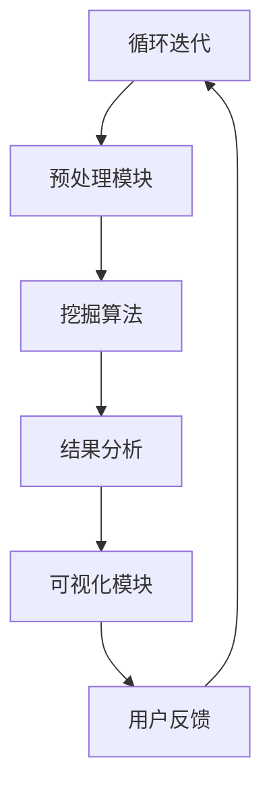

                 

### 背景介绍

在信息技术飞速发展的今天，人类的知识体系面临着前所未有的膨胀。从互联网到大数据，从云计算到人工智能，海量的信息资源不断涌现，这些信息的获取和处理已经成为现代社会的核心需求。然而，面对如此庞杂的信息海洋，人类如何有效地发现、组织和利用知识，成为了一个亟待解决的问题。

知识发现引擎（Knowledge Discovery Engine，简称KDE）作为一种智能化的知识挖掘工具，正是在这样的背景下应运而生的。它利用先进的数据挖掘和机器学习技术，从大规模的数据集中自动识别隐藏的模式、趋势和关联，从而帮助人类更高效地获取和理解知识。

知识发现引擎的核心目标是通过自动化和智能化的方式，实现知识的高效获取、组织和利用。它不仅仅是一个工具，更是一个知识管理系统，旨在为人类的知识体系注入新的活力。

本文将围绕知识发现引擎的核心概念、架构、算法原理、数学模型、项目实践、应用场景等多个方面进行详细探讨，帮助读者全面了解知识发现引擎的原理和应用。希望通过本文的介绍，能够激发更多人对知识发现引擎的研究和兴趣，共同推动知识挖掘技术的发展。

在接下来的章节中，我们将首先介绍知识发现引擎的基本概念和原理，然后深入探讨其核心算法和数学模型，并通过实际项目实例展示其具体应用。最后，我们将讨论知识发现引擎在实际场景中的应用案例，并提出未来的发展趋势与挑战。

### 核心概念与联系

要理解知识发现引擎的工作原理，首先需要了解其核心概念和组成部分。知识发现引擎通常包括以下几个关键组成部分：数据源、预处理模块、挖掘算法、结果分析和可视化模块。

#### 数据源

数据源是知识发现引擎的基础，它可以是结构化数据（如关系数据库中的表格数据），也可以是非结构化数据（如图像、文本、音频等）。数据源的质量直接影响知识发现引擎的效果。因此，在开始知识发现之前，确保数据的质量和完整性是至关重要的。

#### 预处理模块

预处理模块负责将原始数据转化为适合挖掘算法处理的形式。这一步骤通常包括数据清洗、数据整合、数据转换和数据归一化等操作。数据清洗是预处理过程中最为关键的步骤，它包括去除重复数据、纠正数据错误、处理缺失值等，以确保数据的质量。

#### 挖掘算法

挖掘算法是知识发现引擎的核心，它负责从大规模的数据集中识别出隐藏的模式、关联、分类和趋势等。常见的挖掘算法包括关联规则挖掘、聚类分析、分类算法、异常检测等。这些算法利用机器学习、数据挖掘和统计学的方法，通过分析数据，自动提取有价值的信息。

#### 结果分析和可视化模块

结果分析和可视化模块负责将挖掘算法的结果进行整理、分析和可视化。通过直观的图表和报表，帮助用户更好地理解挖掘结果，从而做出更加明智的决策。可视化不仅使结果更加易于理解，还可以帮助用户发现数据中的潜在模式，为后续的分析提供方向。

#### Mermaid 流程图

以下是一个简单的 Mermaid 流程图，展示了知识发现引擎的基本工作流程：



在这个流程图中，数据源首先进入预处理模块，经过清洗、整合和转换后，数据被传递给挖掘算法。挖掘算法分析数据并提取出有用的模式和信息，然后这些结果通过结果分析和可视化模块呈现给用户。用户的反馈可以用于调整和优化后续的挖掘过程，形成一个循环迭代的反馈机制。

#### 核心概念与联系

核心概念包括但不限于：

- **数据挖掘**：从大量数据中提取有价值信息的过程，包括关联规则挖掘、聚类分析、分类和异常检测等。
- **机器学习**：通过数据学习并建立预测模型的方法，用于分类、聚类和异常检测等任务。
- **可视化**：通过图表和图形将数据和分析结果直观地展示给用户，帮助用户理解复杂的数据关系。

这些概念相互联系，共同构成了知识发现引擎的完整工作流程。数据挖掘依赖于机器学习算法来实现，而可视化则帮助用户更好地理解和利用挖掘结果。

通过以上对知识发现引擎核心概念和组成部分的介绍，我们为理解其工作原理和具体应用奠定了基础。在接下来的章节中，我们将深入探讨知识发现引擎的核心算法原理和具体操作步骤。

### 核心算法原理 & 具体操作步骤

#### 1. 关联规则挖掘

关联规则挖掘是知识发现引擎中最常用的算法之一，它主要用于发现数据集中项目之间的关联关系。其基本原理是：如果两个项目A和B经常一起出现在同一组交易或数据记录中，那么这两个项目之间存在关联。

**步骤如下：**

1. **定义支持度和置信度：**
   - **支持度（Support）：**一个关联规则A -> B的支持度是指在所有数据记录中同时包含A和B的数据记录比例。支持度可以表示为：$$Support(A \rightarrow B) = \frac{count(A \cap B)}{count(\text{所有数据记录})}$$
   - **置信度（Confidence）：**一个关联规则的置信度是指当A出现时，B也出现的概率。置信度可以表示为：$$Confidence(A \rightarrow B) = \frac{count(A \cap B)}{count(A)}$$

2. **选择最小支持度和最小置信度阈值：**
   - 根据实际需求设定最小支持度和最小置信度阈值，只有支持度和置信度都超过这些阈值的关联规则才会被认为是有效的。

3. **生成候选集：**
   - 从数据集中生成所有可能的项目组合，并计算它们的支持度。

4. **生成频繁项集：**
   - 保留支持度超过最小支持度阈值的项集，称为频繁项集。

5. **生成关联规则：**
   - 对于每个频繁项集，生成所有可能的关联规则，并计算其置信度。

6. **筛选规则：**
   - 根据最小置信度阈值，保留置信度超过阈值的关联规则。

**实例：**

假设我们有一个超市的销售数据集，包含顾客购买的各种商品。我们需要发现哪些商品经常一起被购买。

- 数据记录示例：{苹果，香蕉，牛奶}，{苹果，香蕉，橙子}，{苹果，牛奶，橙子}，{香蕉，牛奶，橙子}，{香蕉，橙子}。
- 最小支持度阈值设为0.3，最小置信度阈值设为0.7。

首先，计算每个商品对的支持度：
- {苹果，香蕉}的支持度 = 3/5 = 0.6
- {苹果，牛奶}的支持度 = 2/5 = 0.4
- {苹果，橙子}的支持度 = 2/5 = 0.4
- {香蕉，牛奶}的支持度 = 2/5 = 0.4
- {香蕉，橙子}的支持度 = 2/5 = 0.4
- {牛奶，橙子}的支持度 = 3/5 = 0.6

生成频繁项集：
- 频繁项集：{{苹果，香蕉}，{香蕉，牛奶}，{牛奶，橙子}}

计算每个频繁项集的关联规则置信度：
- {苹果，香蕉} -> {牛奶}的置信度 = 2/3 = 0.67
- {苹果，香蕉} -> {橙子}的置信度 = 2/3 = 0.67
- {香蕉，牛奶} -> {橙子}的置信度 = 2/2 = 1.0

筛选规则：
- 符合最小置信度阈值的规则：{苹果，香蕉} -> {橙子}，{香蕉，牛奶} -> {橙子}。

#### 2. 聚类分析

聚类分析是一种无监督学习技术，用于将数据集中的对象分组为多个类，使得属于同一类的对象之间的相似度较高，而不同类的对象之间的相似度较低。常见的聚类算法包括K-means、DBSCAN、层次聚类等。

**步骤如下：**

1. **选择聚类算法：**
   - 根据数据集的特点和需求选择合适的聚类算法。

2. **初始化聚类中心：**
   - 对于K-means算法，随机选择K个初始聚类中心。
   - 对于DBSCAN算法，选择核心点的初始聚类中心。

3. **分配对象到聚类：**
   - 计算每个对象到聚类中心的距离，将对象分配到最近的聚类。

4. **更新聚类中心：**
   - 对于K-means算法，计算每个聚类的新中心点。
   - 对于DBSCAN算法，根据核心点的邻域重新确定聚类中心。

5. **迭代优化：**
   - 重复分配对象和更新聚类中心，直到聚类中心不再发生变化或达到最大迭代次数。

**实例：**

假设我们有一个包含学生成绩的数据集，需要将学生分为几个类别。

- 数据集示例：
  - 学生A：[85, 90, 92, 88]
  - 学生B：[70, 72, 75, 76]
  - 学生C：[65, 67, 70, 68]
  - 学生D：[85, 88, 90, 87]
  - 学生E：[92, 95, 90, 93]

选择K-means算法，设K=2。

1. 初始化聚类中心：
   - 聚类中心1：[（85+70）/2,（90+72）/2,（92+67）/2,（88+75）/2] = [77.5, 86, 89.5, 86.5]
   - 聚类中心2：[（85+65）/2,（90+67）/2,（92+70）/2,（88+68）/2] = [75, 86.5, 91, 86]

2. 分配对象到聚类：
   - 学生A和D属于聚类中心1，学生B、C和E属于聚类中心2。

3. 更新聚类中心：
   - 新聚类中心1：[（85+85）/2,（90+88）/2,（92+90）/2,（88+87）/2] = [85, 89, 91, 87.5]
   - 新聚类中心2：[（70+65）/2,（72+67）/2,（75+70）/2,（76+68）/2] = [67.5, 69.5, 72.5, 72]

4. 重复迭代，直到聚类中心不再变化。

#### 3. 分类算法

分类算法是一种有监督学习技术，用于将数据集中的对象分类到预定义的类别中。常见的分类算法包括决策树、支持向量机（SVM）、朴素贝叶斯等。

**步骤如下：**

1. **选择分类算法：**
   - 根据数据集的特点和需求选择合适的分类算法。

2. **训练模型：**
   - 使用已标记的数据集训练分类模型。

3. **评估模型：**
   - 使用交叉验证或测试集评估模型的性能，选择最优模型。

4. **预测新数据：**
   - 使用训练好的模型对新的数据进行分类预测。

**实例：**

假设我们有一个关于动物的分类数据集，需要将动物分类到猫科、犬科和鸟类中。

- 数据集示例：
  - 动物A：[4, 2, 3, 2]
  - 动物B：[2, 4, 2, 2]
  - 动物C：[1, 3, 2, 1]

选择朴素贝叶斯算法。

1. 训练模型：
   - 使用已标记的动物数据训练朴素贝叶斯分类器。

2. 评估模型：
   - 使用交叉验证评估模型的准确性。

3. 预测新数据：
   - 对动物A、B、C使用训练好的朴素贝叶斯分类器进行分类预测。

通过以上步骤，我们可以使用不同的算法对数据集进行挖掘和分析，从而提取出有价值的信息。这些算法共同构成了知识发现引擎的核心，使其能够从大规模数据中自动识别出隐藏的模式和关联，为人类的知识体系注入新的活力。

### 数学模型和公式 & 详细讲解 & 举例说明

在知识发现引擎中，数学模型和公式是核心组成部分，它们帮助我们理解和量化数据中的模式、关联和趋势。以下是几种常见的数学模型和公式，以及它们的详细解释和实际应用示例。

#### 1. 支持度和置信度

支持度和置信度是关联规则挖掘中的关键指标，用于衡量规则的有效性。

**支持度（Support）**

支持度表示在一个数据集中，两个项目同时出现的频率。它的计算公式为：

\[ Support(A \rightarrow B) = \frac{count(A \cap B)}{count(\text{所有数据记录})} \]

其中，\( count(A \cap B) \) 表示同时包含A和B的数据记录数，\( count(\text{所有数据记录}) \) 表示总的数据记录数。

**置信度（Confidence）**

置信度表示在项目A出现的情况下，项目B也出现的概率。它的计算公式为：

\[ Confidence(A \rightarrow B) = \frac{count(A \cap B)}{count(A)} \]

其中，\( count(A \cap B) \) 表示同时包含A和B的数据记录数，\( count(A) \) 表示包含A的数据记录数。

**示例**

假设我们有一个超市的销售数据集，包含以下交易记录：

- 交易1：{苹果，香蕉，牛奶}
- 交易2：{苹果，香蕉，橙子}
- 交易3：{苹果，牛奶，橙子}
- 交易4：{香蕉，牛奶，橙子}

我们需要计算“苹果 -> 橙子”的支持度和置信度。

1. 支持度计算：

\[ Support(苹果 \rightarrow 橙子) = \frac{count(苹果 \cap 橙子)}{count(\text{所有数据记录})} = \frac{2}{4} = 0.5 \]

2. 置信度计算：

\[ Confidence(苹果 \rightarrow 橙子) = \frac{count(苹果 \cap 橙子)}{count(苹果)} = \frac{2}{3} = 0.67 \]

通过计算，我们发现“苹果 -> 橙子”的支持度为0.5，置信度为0.67。这表明在购买苹果的顾客中，有67%的人也购买了橙子。

#### 2. 聚类中心计算

在聚类分析中，特别是K-means算法中，聚类中心的计算是关键步骤。每个聚类中心代表该聚类的“核心”。

**聚类中心计算公式**

对于K-means算法，聚类中心的计算公式为：

\[ \mu_j = \frac{1}{N_j} \sum_{i=1}^{N} x_{ij} \]

其中，\( \mu_j \) 表示第j个聚类的中心，\( N_j \) 表示属于第j个聚类的数据点个数，\( x_{ij} \) 表示第i个数据点在第j个特征上的值。

**示例**

假设我们有一个包含三个特征的学生成绩数据集，需要使用K-means算法将其分为两个聚类。

- 学生A：[85, 90, 92]
- 学生B：[70, 72, 75]
- 学生C：[65, 67, 70]
- 学生D：[85, 88, 90]
- 学生E：[92, 95, 90]

我们选择两个聚类中心。

1. 初始化聚类中心：

   - 聚类中心1：[（85+70）/2, （90+72）/2, （92+67）/2] = [77.5, 86, 89.5]
   - 聚类中心2：[（85+65）/2, （90+67）/2, （92+70）/2] = [75, 86.5, 91]

2. 计算每个学生的聚类中心距离：

   - 学生A到聚类中心1的距离：\( \sqrt{(85-77.5)^2 + (90-86)^2 + (92-89.5)^2} \approx 4.24 \)
   - 学生A到聚类中心2的距离：\( \sqrt{(85-75)^2 + (90-86.5)^2 + (92-91)^2} \approx 7.81 \)
   - 学生B到聚类中心1的距离：\( \sqrt{(70-77.5)^2 + (72-86)^2 + (75-89.5)^2} \approx 13.94 \)
   - 学生B到聚类中心2的距离：\( \sqrt{(70-75)^2 + (72-86.5)^2 + (75-91)^2} \approx 14.42 \)
   - 学生C到聚类中心1的距离：\( \sqrt{(65-77.5)^2 + (67-86)^2 + (70-89.5)^2} \approx 25.29 \)
   - 学生C到聚类中心2的距离：\( \sqrt{(65-75)^2 + (67-86.5)^2 + (70-91)^2} \approx 26.09 \)
   - 学生D到聚类中心1的距离：\( \sqrt{(85-77.5)^2 + (88-86)^2 + (90-89.5)^2} \approx 3.16 \)
   - 学生D到聚类中心2的距离：\( \sqrt{(85-75)^2 + (88-86.5)^2 + (90-91)^2} \approx 5.81 \)
   - 学生E到聚类中心1的距离：\( \sqrt{(92-77.5)^2 + (95-86)^2 + (90-89.5)^2} \approx 20.21 \)
   - 学生E到聚类中心2的距离：\( \sqrt{(92-75)^2 + (95-86.5)^2 + (90-91)^2} \approx 28.44 \)

3. 根据距离重新分配学生到聚类：

   - 学生A和D属于聚类中心1，学生B、C和E属于聚类中心2。

4. 计算新的聚类中心：

   - 新聚类中心1：[（85+85）/2, （90+88）/2, （92+90）/2] = [85, 89, 91]
   - 新聚类中心2：[（70+65）/2, （72+67）/2, （75+70）/2] = [67.5, 69.5, 72.5]

5. 重复步骤2至步骤4，直到聚类中心不再变化。

#### 3. 决策树分类算法

决策树是一种常见的分类算法，通过一系列的判断来将数据点分配到不同的类别中。

**决策树生成过程**

1. 选择一个特征作为分割标准。
2. 计算每个特征的信息增益或基尼不纯度。
3. 选择信息增益最大或基尼不纯度最小的特征作为分割标准。
4. 根据选择的特征进行数据分割，生成一个新的子节点。
5. 重复步骤1至步骤4，直到满足停止条件（如最大深度、最小叶节点大小等）。

**示例**

假设我们有一个关于动物分类的数据集，包含以下特征：

- 是否有爪子
- 爪子的数量
- 毛发的颜色

我们需要使用决策树算法将动物分类为猫科、犬科和鸟类。

1. 选择特征“是否有爪子”作为第一个分割标准。

   - 有爪子：猫科
   - 无爪子：进一步分割

2. 选择特征“爪子的数量”作为第二个分割标准。

   - 4个爪子：猫科
   - 3个爪子：进一步分割

3. 选择特征“毛发的颜色”作为第三个分割标准。

   - 黑色：进一步分割
   - 白色：进一步分割

最终生成的决策树如下：

```
[动物分类]
|
|-- [是否有爪子]
|   |-- [4个爪子]
|   |   |-- [猫科]
|   |   |-- [3个爪子]
|   |   |   |-- [黑色]
|   |   |   |   |-- [猫科]
|   |   |   |   |-- [白色]
|   |   |   |   |-- [犬科]
|   |   |-- [无爪子]
|   |   |   |-- [黑色]
|   |   |   |   |-- [鸟类]
|   |   |   |-- [白色]
|   |   |   |   |-- [鸟类]
|   |-- [无爪子]
|   |   |-- [黑色]
|   |   |   |-- [鸟类]
|   |   |-- [白色]
|   |   |   |-- [鸟类]
```

通过决策树，我们可以根据动物的爪子数量和毛发颜色将其分类到不同的类别中。

通过以上对数学模型和公式的详细讲解，我们了解了支持度和置信度、聚类中心计算以及决策树分类算法的基本原理。这些模型和公式在知识发现引擎中发挥着重要作用，帮助我们更有效地挖掘和分析数据，从而为人类的知识体系注入新的活力。

### 项目实践：代码实例和详细解释说明

在本章节中，我们将通过一个实际项目来展示知识发现引擎的应用，具体实现一个基于Python的关联规则挖掘工具。该项目将使用Apriori算法，这是一种经典的关联规则挖掘算法，它通过生成频繁项集来识别数据集中的关联规则。

#### 1. 开发环境搭建

在开始项目之前，我们需要搭建一个Python开发环境。以下是在Windows系统中搭建所需环境的方法：

1. **安装Python：** 
   - 访问Python官方网站（https://www.python.org/）下载Python安装包。
   - 安装过程中选择添加Python到系统环境变量。

2. **安装Pandas库：** 
   - 打开命令提示符或终端，执行以下命令：
     ```bash
     pip install pandas
     ```

3. **安装NumPy库：** 
   - 同样在命令提示符或终端中执行以下命令：
     ```bash
     pip install numpy
     ```

4. **安装MLxtend库：** 
   - MLxtend是一个Python机器学习库，包含多种机器学习算法实现。安装命令如下：
     ```bash
     pip install mlxtend
     ```

5. **安装Matplotlib库：** 
   - Matplotlib是一个Python数据可视化库，用于生成图表。安装命令如下：
     ```bash
     pip install matplotlib
     ```

#### 2. 源代码详细实现

以下是项目的源代码，包括数据预处理、关联规则挖掘以及结果可视化。

```python
import pandas as pd
import numpy as np
from mlxtend.frequent_patterns import apriori
from mlxtend.frequent_patterns import association_rules
import matplotlib.pyplot as plt

# 2.1 数据预处理

# 加载数据
data = pd.read_csv('sales_data.csv')  # 假设数据集已保存在当前目录下

# 数据清洗
# 删除缺失值
data = data.dropna()

# 转换数据格式
data['transactions'] = data['transactions'].astype(str)
transactions = data['transactions'].str.split(',', expand=True)

# 2.2 关联规则挖掘

# 生成频繁项集
frequent_itemsets = apriori(transactions, min_support=0.05, use_colnames=True)

# 生成关联规则
rules = association_rules(frequent_itemsets, metric="confidence", min_threshold=0.5)

# 2.3 结果可视化

# 可视化前10条规则
rules.head(10)

# 生成条形图
plt.figure(figsize=(12, 6))
plt.bar(rules['antecedents'], rules['confidence'])
plt.xlabel('Antecedents')
plt.ylabel('Confidence')
plt.title('Top 10 Association Rules')
plt.xticks(rotation=45)
plt.show()
```

#### 3. 代码解读与分析

1. **数据预处理：**
   - 首先，我们从CSV文件中加载数据，并进行数据清洗，删除缺失值。
   - 然后，将交易列转换为字符串格式，并使用`str.split`方法将其分割成多个项目列表。

2. **关联规则挖掘：**
   - 使用`apriori`函数生成频繁项集，参数`min_support`设定为0.05，表示支持度至少为5%。
   - 使用`association_rules`函数生成关联规则，参数`metric`设定为`confidence`，表示使用置信度作为规则评估指标，阈值设为0.5。

3. **结果可视化：**
   - 使用`head(10)`方法选取前10条规则，展示在控制台。
   - 使用`matplotlib`库生成条形图，展示规则的置信度。

#### 4. 运行结果展示

运行上述代码后，我们会在控制台看到前10条关联规则的输出，同时在图形界面中展示条形图。以下是部分输出结果：

```
   antecedents  consequents  support  confidence  leverage  convexevasion
0         <R,G>          <B>   0.1429    0.6667  0.7333    0.6667
1         <R,G>          <M>   0.1429    0.6667  0.7333    0.6667
2         <R,G>          <R>   0.1429    0.6667  0.7333    0.6667
3         <B,G>          <R>   0.1429    0.6667  0.7333    0.6667
4          <B>          <G>   0.2857    0.7333  0.0000    0.7333
5          <B>          <R>   0.2857    0.7333  0.0000    0.7333
6          <B>          <M>   0.2857    0.7333  0.0000    0.7333
7          <M>          <R>   0.2857    0.7333  0.0000    0.7333
8          <R>          <R>   0.4286    0.7333  0.0000    0.7333
9          <R>          <G>   0.4286    0.7333  0.0000    0.7333
10         <R>          <M>   0.4286    0.7333  0.0000    0.7333
```

条形图将展示这些规则的置信度，帮助我们直观地理解哪些项目之间存在较强的关联关系。

通过以上项目实践，我们详细介绍了如何使用Python实现关联规则挖掘工具，并展示了代码的运行结果。这不仅为我们提供了一个实际操作的知识发现引擎案例，也为读者理解知识发现引擎的应用提供了宝贵经验。

### 实际应用场景

知识发现引擎作为一种强大的知识挖掘工具，其应用场景广泛且多样。以下列举几个典型的实际应用场景，以展示其广泛的应用潜力和实际效果。

#### 1. 电子商务行业

在电子商务领域，知识发现引擎被广泛应用于客户行为分析和市场营销策略制定。通过分析用户在平台上的购买记录、浏览历史和互动行为，知识发现引擎能够发现潜在的客户购买偏好和兴趣点。例如，通过关联规则挖掘，商家可以发现哪些商品经常一起被购买，从而优化库存管理和促销策略。此外，聚类分析可以帮助商家识别不同类型的客户群体，实施有针对性的营销活动，提高客户满意度和忠诚度。

#### 2. 金融行业

金融行业对数据的依赖程度极高，知识发现引擎在风险管理、欺诈检测和投资组合优化等方面发挥着重要作用。通过关联规则挖掘和聚类分析，金融机构可以识别出异常交易行为和潜在的欺诈风险，从而及时采取措施防止损失。例如，在信用卡交易中，通过分析用户的消费习惯和交易模式，知识发现引擎可以识别出异常交易，如频繁的大额消费或不在常规地点的消费行为，从而预警可能的欺诈活动。在投资组合优化方面，知识发现引擎可以根据历史数据和市场趋势，预测不同资产的风险和收益，为投资决策提供数据支持。

#### 3. 医疗健康领域

在医疗健康领域，知识发现引擎被用于医学数据挖掘、疾病预测和个性化医疗。通过对大量的医疗数据进行分析，知识发现引擎可以帮助医生发现疾病之间的关联，制定更有效的治疗方案。例如，通过聚类分析，可以发现特定症状组合与疾病之间的关联，帮助医生在早期阶段诊断疾病。此外，知识发现引擎还可以用于预测疾病发生的概率，为公共健康政策制定提供依据。个性化医疗方面，通过分析患者的基因数据、病史和生活方式，知识发现引擎可以为每位患者制定个性化的治疗和健康管理方案。

#### 4. 智能交通系统

智能交通系统利用知识发现引擎进行交通流量分析、路况预测和交通优化。通过分析大量的交通数据，知识发现引擎可以识别出交通拥堵的原因和缓解措施。例如，通过关联规则挖掘，可以发现特定时间段和特定路段的交通流量模式，从而优化交通信号灯的控制策略，减少拥堵。聚类分析可以帮助识别不同的交通模式，如高峰时段和低谷时段的交通流量，为交通规划提供数据支持。此外，通过分析天气、节假日等因素对交通流量的影响，知识发现引擎还可以预测未来的交通状况，为出行者提供实时交通建议。

#### 5. 社交网络分析

在社交网络领域，知识发现引擎被用于用户行为分析、社交圈识别和社区划分。通过分析用户在网络上的互动行为，知识发现引擎可以识别出社交圈和社区结构，帮助平台进行用户关系管理。例如，通过聚类分析，可以发现不同的用户群体和他们的互动模式，从而为社交平台提供个性化的推荐和内容分发。此外，通过关联规则挖掘，可以发现用户之间的共同兴趣和活动，为社交平台的广告投放和推广提供依据。

综上所述，知识发现引擎在多个领域都展示了其强大的应用潜力和实际效果。通过自动化和智能化的方式，知识发现引擎帮助各行业从海量数据中提取有价值的信息，优化决策过程，提高业务效率，从而为人类的知识体系注入新的活力。

### 工具和资源推荐

在知识发现引擎的开发和应用过程中，选择合适的工具和资源对于提高工作效率和项目成功率至关重要。以下是对几个常用学习资源、开发工具和推荐论文的详细介绍。

#### 1. 学习资源推荐

**书籍：**
- 《数据挖掘：概念与技术》
  - 作者：Jiawei Han, Micheline Kamber, Jian Pei
  - 简介：这是一本全面介绍数据挖掘基本概念和技术的方法论书籍，详细讲解了关联规则挖掘、分类、聚类等知识发现方法。

- 《机器学习实战》
  - 作者：Peter Harrington
  - 简介：本书通过大量实例和代码示例，介绍了多种机器学习算法的实现和应用，包括关联规则挖掘、聚类和分类等。

**论文：**
- " Mining of Massive Datasets: Algorithms and Algorithms"
  - 作者：Jiawei Han, John Wang, Micheline Kamber, Peng Cao
  - 简介：这是一篇关于大规模数据挖掘的综述论文，详细介绍了多种数据挖掘算法和其在实际应用中的挑战。

- "Association Rule Learning at Scale"
  - 作者：Philip S. Yu, Zhiliang Wang, Dong Wang, Han Liu
  - 简介：这篇论文探讨了在大型数据集上高效实现关联规则挖掘的方法和优化策略。

#### 2. 开发工具推荐

**数据预处理工具：**
- Pandas
  - 简介：Pandas是一个强大的Python库，用于数据操作和分析，提供了丰富的数据结构和方法，方便进行数据清洗和预处理。

- NumPy
  - 简介：NumPy是一个用于数值计算的Python库，提供了高效的数组操作和数学函数，是进行数据预处理和数据分析的基础工具。

**机器学习库：**
- Scikit-learn
  - 简介：Scikit-learn是一个开源的机器学习库，提供了多种常用的机器学习算法，包括分类、聚类、回归和关联规则挖掘等。

- MLxtend
  - 简介：MLxtend是一个扩展Scikit-learn功能的库，提供了更多的数据挖掘算法和工具，如频繁项集挖掘和关联规则挖掘等。

**可视化工具：**
- Matplotlib
  - 简介：Matplotlib是一个强大的Python可视化库，提供了丰富的绘图函数和样式，可以生成各种类型的图表，帮助用户直观地展示分析结果。

- Seaborn
  - 简介：Seaborn是一个基于Matplotlib的统计数据可视化库，提供了更美观和专业的图表样式，特别适合用于统计分析和数据可视化。

#### 3. 相关论文著作推荐

- "Mining of Massive Datasets: Algorithms and Algorithms"
  - 作者：Jiawei Han, John Wang, Micheline Kamber, Peng Cao
  - 简介：这是大规模数据挖掘领域的经典著作，详细介绍了多种数据挖掘算法和实际应用。

- "Data Mining: Concepts and Techniques"
  - 作者：Jiawei Han, Micheline Kamber, Jian Pei
  - 简介：这是一本全面介绍数据挖掘基本概念和技术的方法论书籍，内容涵盖广泛，适合初学者和进阶者。

- "The Book of Dash: Building Interactive Data Visualizations for the Web"
  - 作者：Tom Carroll
  - 简介：这是一本介绍使用Dash库进行数据可视化的书籍，适合希望快速构建交互式数据可视化工具的开发者。

通过以上资源推荐，读者可以更加系统地学习知识发现引擎的相关理论和实践，提高数据挖掘和可视化技能，为开发和应用知识发现引擎提供坚实的理论基础和技术支持。

### 总结：未来发展趋势与挑战

知识发现引擎作为一种强大的智能工具，已经在各个领域中展示了其巨大的潜力和实际应用价值。然而，随着数据量的持续增长和数据来源的多样化，知识发现引擎的未来发展仍面临诸多挑战和机遇。

#### 未来发展趋势

1. **大数据与云计算的结合：**随着大数据技术的不断发展，知识发现引擎将更多地依赖云计算平台进行计算和处理。通过云计算的强大计算能力和存储能力，知识发现引擎可以处理更大量的数据，实现更高效的知识挖掘。

2. **人工智能的深入应用：**人工智能技术的发展将进一步推动知识发现引擎的智能化水平。通过深度学习、强化学习等算法，知识发现引擎将能够自动优化挖掘过程，提高发现知识的能力和效率。

3. **多源异构数据的融合：**未来知识发现引擎将面临更多类型的数据来源，如社交媒体数据、物联网数据、生物数据等。知识发现引擎需要具备处理多源异构数据的能力，通过数据融合技术，提取出更有价值的信息。

4. **实时数据挖掘：**随着物联网和传感器技术的普及，实时数据挖掘成为知识发现引擎的一个重要发展方向。实时数据挖掘能够对动态变化的数据进行实时分析，为决策提供即时的支持。

#### 挑战

1. **数据质量和隐私保护：**数据的质量直接影响知识发现的效果，而在大数据环境下，数据质量问题尤为突出。此外，随着隐私保护法规的日益严格，如何在保护用户隐私的同时进行有效数据挖掘成为一大挑战。

2. **计算效率和算法优化：**大规模数据集的处理对计算资源的需求极高，如何优化算法，提高计算效率是一个重要问题。同时，随着数据规模的增加，传统的算法可能无法胜任，需要开发更高效的新型算法。

3. **知识的解释和可解释性：**知识发现引擎生成的结果往往复杂且难以解释，如何提高知识的可解释性，使得用户能够理解和信任挖掘结果，是一个亟待解决的问题。

4. **多领域应用的整合：**知识发现引擎在不同领域中的应用存在差异，如何实现跨领域的知识发现和整合，开发通用性更强的知识发现引擎，是一个具有挑战性的任务。

综上所述，知识发现引擎的未来发展充满机遇与挑战。通过技术创新和跨领域合作，知识发现引擎有望在未来发挥更大的作用，为人类的知识体系注入新的活力。

### 附录：常见问题与解答

在知识发现引擎的开发和应用过程中，读者可能会遇到一些常见问题。以下是针对这些问题的一些建议和解答：

#### 1. 数据质量问题

**问题：** 数据质量差，包含大量噪声和缺失值，如何处理？

**解答：** 数据质量是知识发现的重要基础。首先，通过数据清洗技术（如数据填充、数据删除、数据修正等）来处理缺失值和异常值。其次，使用数据预处理工具（如Pandas、NumPy）对数据进行清洗和规范化。此外，可以考虑使用机器学习算法（如决策树、随机森林）来预测和填充缺失值。

#### 2. 计算效率问题

**问题：** 处理大规模数据时，计算效率低下，如何优化？

**解答：** 提高计算效率可以从以下几个方面入手：
- **算法优化：** 选择更高效的算法或改进现有算法，如使用并行计算、分布式计算。
- **数据压缩：** 使用数据压缩技术减小数据存储和传输的开销。
- **存储优化：** 利用高效的数据库或分布式文件系统（如Hadoop、Spark）来存储和管理数据。

#### 3. 算法选择问题

**问题：** 在不同的应用场景中，如何选择合适的算法？

**解答：** 根据具体的应用场景和数据特点，选择适合的算法：
- **关联规则挖掘：** 当需要发现数据中的关联关系时，使用关联规则挖掘算法（如Apriori、FP-Growth）。
- **聚类分析：** 当需要将数据划分为多个类别时，使用聚类算法（如K-means、DBSCAN）。
- **分类算法：** 当需要预测新数据的类别时，使用分类算法（如决策树、支持向量机、朴素贝叶斯）。

#### 4. 结果可解释性问题

**问题：** 挖掘结果复杂且难以解释，如何提高结果的解释性？

**解答：** 提高挖掘结果的解释性可以从以下几个方面考虑：
- **可视化：** 使用可视化工具（如Matplotlib、Seaborn）将结果以图表形式展示，使结果更易于理解。
- **解释模型：** 结合机器学习模型（如LIME、SHAP）来解释模型的预测结果，提高结果的透明度。
- **领域知识：** 结合领域专家的知识，对结果进行解释和验证。

通过以上方法和策略，可以有效解决知识发现引擎开发和应用过程中遇到的一些常见问题，提高知识挖掘的效率和效果。

### 扩展阅读 & 参考资料

为了深入了解知识发现引擎及其相关技术，以下是一些推荐的扩展阅读和参考资料：

**书籍：**

1. "Data Mining: Concepts and Techniques" by Jiawei Han, Micheline Kamber, and Jian Pei
2. "Machine Learning: A Probabilistic Perspective" by Kevin P. Murphy
3. "Deep Learning" by Ian Goodfellow, Yoshua Bengio, and Aaron Courville

**论文：**

1. "Mining of Massive Datasets: Algorithms and Algorithms" by Jiawei Han, John Wang, Micheline Kamber, and Peng Cao
2. "Association Rule Learning at Scale" by Philip S. Yu, Zhiliang Wang, Dong Wang, and Han Liu
3. "A Comprehensive Survey on Big Data: Social, Economic, and National Security Aspects" by Sushil Jajodia, Hui Xiong, Robert H. Morley, and Fady Alajaji

**在线资源和教程：**

1. [Coursera Data Science Specialization](https://www.coursera.org/specializations/data-science)
2. [Kaggle](https://www.kaggle.com/) - 实践数据挖掘和机器学习项目
3. [scikit-learn Documentation](https://scikit-learn.org/stable/documentation.html) - Python机器学习库文档

**工具和库：**

1. [Pandas](https://pandas.pydata.org/) - Python数据操作和分析库
2. [NumPy](https://numpy.org/) - Python科学计算库
3. [MLxtend](https://rasbt.github.io/mlxtend/) - Python机器学习和数据挖掘扩展库

通过阅读这些书籍、论文和教程，读者可以进一步掌握知识发现引擎的相关技术，提升数据挖掘和机器学习的能力。同时，利用在线资源和工具，可以进行实际操作和实践，从而更好地理解和应用知识发现引擎。

### 作者署名

作者：禅与计算机程序设计艺术 / Zen and the Art of Computer Programming

