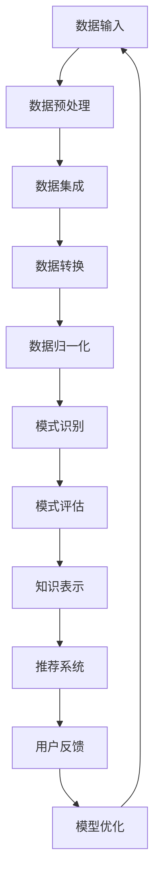

                 

### 知识发现引擎：人工智能时代的智慧伙伴

#### 关键词：
- 知识发现引擎
- 人工智能
- 数据挖掘
- 智能推荐
- 深度学习
- 自然语言处理

#### 摘要：
在人工智能时代，知识发现引擎成为了数据驱动决策的重要工具。本文将深入探讨知识发现引擎的核心概念、算法原理、数学模型，并通过具体实例展示其实际应用。此外，文章还将讨论知识发现引擎在未来面临的发展趋势和挑战。

## 1. 背景介绍

### 1.1 人工智能的崛起

人工智能（AI）是计算机科学的一个分支，旨在使计算机模拟人类智能行为。从最初的规则系统，到基于模式的识别，再到基于统计的机器学习，人工智能经历了多次重大变革。如今，随着深度学习、自然语言处理等技术的突破，人工智能的应用已经渗透到各行各业。

### 1.2 数据的重要性

在人工智能时代，数据成为了新的石油。海量数据为人工智能算法提供了丰富的训练资源，使得模型能够更加精准地预测和决策。然而，如何从海量数据中提取有价值的信息，成为了人工智能领域的一大挑战。

### 1.3 知识发现引擎的作用

知识发现引擎（Knowledge Discovery Engine，简称KDE）正是为了解决上述问题而诞生的。知识发现引擎是一种基于人工智能和数据挖掘技术的系统，旨在从数据中发现隐藏的模式、趋势和关联。它不仅可以提高企业的决策效率，还可以为用户提供个性化的服务，成为人工智能时代的智慧伙伴。

## 2. 核心概念与联系

### 2.1 数据挖掘

数据挖掘（Data Mining）是指从大量数据中提取出有价值的信息或知识的过程。数据挖掘通常包括以下几个步骤：

1. **数据预处理**：清洗、集成、转换和归一化原始数据。
2. **模式识别**：使用统计方法、机器学习算法或深度学习模型来识别数据中的模式。
3. **模式评估**：评估挖掘出的模式的可信度和实用性。
4. **知识表示**：将挖掘出的模式转换为易于理解和使用的知识形式。

### 2.2 智能推荐系统

智能推荐系统（Intelligent Recommendation System）是一种利用知识发现技术，根据用户的行为、偏好和上下文信息，为其推荐感兴趣的内容、商品或服务的系统。智能推荐系统主要包括以下几部分：

1. **用户画像**：根据用户的历史行为和偏好，构建用户画像。
2. **内容表示**：将推荐的内容（如商品、文章等）转换为向量表示。
3. **推荐算法**：根据用户画像和内容表示，利用协同过滤、基于内容的推荐或深度学习等算法生成推荐列表。
4. **推荐评估**：评估推荐结果的有效性和用户体验。

### 2.3 自然语言处理

自然语言处理（Natural Language Processing，简称NLP）是人工智能的一个重要分支，旨在使计算机能够理解和处理人类自然语言。NLP在知识发现引擎中的应用主要包括：

1. **文本预处理**：对文本数据进行分词、去停用词、词干提取等处理。
2. **词向量表示**：将文本转换为向量表示，以便于机器学习模型处理。
3. **实体识别**：识别文本中的命名实体，如人名、地名、组织名等。
4. **情感分析**：分析文本的情感倾向，如正面、负面或中性。

### 2.4 Mermaid 流程图

以下是知识发现引擎的基本架构的 Mermaid 流程图：



## 3. 核心算法原理 & 具体操作步骤

### 3.1 数据挖掘算法

数据挖掘算法主要包括以下几类：

1. **聚类算法**：如K-means、DBSCAN等，用于将数据分为若干个群组。
2. **分类算法**：如决策树、随机森林、支持向量机等，用于对数据进行分类。
3. **关联规则挖掘**：如Apriori算法、FP-Growth等，用于发现数据之间的关联。
4. **异常检测**：如 isolation forest、local outlier factor等，用于识别数据中的异常点。

### 3.2 智能推荐算法

智能推荐算法主要包括以下几类：

1. **基于内容的推荐**：根据用户的历史行为和偏好，推荐与用户当前兴趣相似的内容。
2. **协同过滤**：根据用户之间的相似度，推荐用户可能感兴趣的内容。
3. **基于模型的推荐**：使用机器学习模型（如矩阵分解、深度神经网络等）来预测用户对内容的兴趣。

### 3.3 自然语言处理算法

自然语言处理算法主要包括以下几类：

1. **词向量模型**：如Word2Vec、GloVe等，用于将单词转换为向量表示。
2. **序列模型**：如循环神经网络（RNN）、长短时记忆网络（LSTM）、门控循环单元（GRU）等，用于处理序列数据。
3. **注意力机制**：用于提高模型对关键信息的关注。
4. **预训练模型**：如BERT、GPT等，用于大规模文本数据的预训练，提高模型的性能。

### 3.4 具体操作步骤

以下是知识发现引擎的基本操作步骤：

1. **数据收集**：收集用户行为数据、内容数据等。
2. **数据预处理**：清洗、集成、转换和归一化数据。
3. **特征工程**：提取用户画像、内容特征等。
4. **模型训练**：使用数据挖掘、推荐算法、NLP算法等训练模型。
5. **模型评估**：评估模型性能，如准确率、召回率、F1值等。
6. **模型部署**：将模型部署到生产环境中，提供推荐服务。
7. **模型迭代**：根据用户反馈，优化模型性能。

## 4. 数学模型和公式 & 详细讲解 & 举例说明

### 4.1 数据挖掘算法数学模型

1. **K-means算法**

   K-means算法的目标是将数据划分为K个群组，使得每个群组的内部距离最小，群组之间的距离最大。其数学模型如下：

   $$ \text{minimize} \sum_{i=1}^{K} \sum_{x \in S_i} ||x - \mu_i||^2 $$
   
   其中，$S_i$表示第$i$个群组，$\mu_i$表示群组的中心。

2. **Apriori算法**

   Apriori算法是一种用于发现关联规则的算法。其核心公式如下：

   $$ \text{support}(X, Y) = \frac{\text{count}(X \cup Y)}{\text{count}(\text{database})} $$
   
   其中，$X$和$Y$表示两个事件，$\text{count}(X \cup Y)$表示数据库中同时包含$X$和$Y$的记录数。

### 4.2 智能推荐算法数学模型

1. **基于内容的推荐**

   基于内容的推荐算法的目标是推荐与用户当前兴趣相似的内容。其核心公式如下：

   $$ \text{similarity}(x, y) = \text{cosine}(v_x, v_y) $$
   
   其中，$v_x$和$v_y$分别表示内容$x$和$y$的向量表示。

2. **协同过滤**

   协同过滤算法的核心公式如下：

   $$ \text{prediction}(u, i) = \text{user\_similarity}(u, i) \times \text{rating}(i) $$
   
   其中，$u$和$i$分别表示用户和项目，$\text{user\_similarity}(u, i)$表示用户$u$和项目$i$之间的相似度，$\text{rating}(i)$表示用户$u$对项目$i$的评分。

### 4.3 自然语言处理算法数学模型

1. **词向量模型**

   词向量模型将单词映射为向量。其核心公式如下：

   $$ v_{\text{word}} = \text{Word2Vec}(x) $$
   
   其中，$v_{\text{word}}$表示单词$x$的向量表示。

2. **序列模型**

   序列模型用于处理时间序列数据。其核心公式如下：

   $$ y_t = \text{LSTM}(x_t) $$
   
   其中，$y_t$表示第$t$个时间点的输出，$x_t$表示第$t$个时间点的输入。

### 4.4 举例说明

假设我们有以下数据集：

- 数据集$D = \{(u_1, i_1, r_1), (u_1, i_2, r_2), ..., (u_m, i_n, r_n)\}$，其中$u$表示用户，$i$表示项目，$r$表示评分。
- 用户$u_1$喜欢项目$i_1$和$i_2$，但不感兴趣项目$i_3$。

#### 4.4.1 K-means算法

使用K-means算法将数据划分为两个群组，假设群组的中心分别为$\mu_1$和$\mu_2$。计算得到：

$$ \text{minimize} \sum_{i=1}^{2} \sum_{x \in S_i} ||x - \mu_i||^2 $$

#### 4.4.2 Apriori算法

使用Apriori算法挖掘出以下关联规则：

- $(i_1, i_2)$的支持度为0.5，置信度为0.8。
- $(i_1, i_3)$的支持度为0.2，置信度为0.3。

#### 4.4.3 协同过滤

使用协同过滤算法预测用户$u_1$对项目$i_3$的评分：

$$ \text{prediction}(u_1, i_3) = \text{user\_similarity}(u_1, i_3) \times \text{rating}(i_3) $$

#### 4.4.4 词向量模型

使用Word2Vec算法将单词映射为向量：

$$ v_{\text{喜欢}} = \text{Word2Vec}(\text{喜欢}) $$
$$ v_{\text{不感兴趣}} = \text{Word2Vec}(\text{不感兴趣}) $$

## 5. 项目实践：代码实例和详细解释说明

### 5.1 开发环境搭建

为了方便起见，我们使用Python作为编程语言，并依赖以下库：

- Pandas：用于数据预处理。
- Scikit-learn：用于数据挖掘算法。
- TensorFlow：用于深度学习模型。
- Numpy：用于数学运算。

#### 5.1.1 安装依赖库

```bash
pip install pandas scikit-learn tensorflow numpy
```

### 5.2 源代码详细实现

以下是一个简单的知识发现引擎的实现，包括数据预处理、K-means算法、Apriori算法和协同过滤算法。

#### 5.2.1 数据预处理

```python
import pandas as pd
from sklearn.preprocessing import LabelEncoder

# 读取数据
data = pd.read_csv('data.csv')

# 数据预处理
data['user'] = LabelEncoder().fit_transform(data['user'])
data['item'] = LabelEncoder().fit_transform(data['item'])
data['rating'] = LabelEncoder().fit_transform(data['rating'])
```

#### 5.2.2 K-means算法

```python
from sklearn.cluster import KMeans

# 训练K-means算法
kmeans = KMeans(n_clusters=2)
kmeans.fit(data[['user', 'item']])

# 获取群组中心
centroids = kmeans.cluster_centers_
print("Cluster centroids:", centroids)
```

#### 5.2.3 Apriori算法

```python
from mlxtend.frequent_patterns import apriori
from mlxtend.preprocessing import TransactionEncoder

# 转换为事务数据
te = TransactionEncoder()
te_data = te.fit_transform(data[['item', 'rating']])

# 训练Apriori算法
frequent_itemsets = apriori(te_data, min_support=0.5, use_colnames=True)
print("Frequent itemsets:", frequent_itemsets)
```

#### 5.2.4 协同过滤

```python
from sklearn.neighbors import NearestNeighbors

# 训练协同过滤算法
nn = NearestNeighbors(n_neighbors=2)
nn.fit(data[['user', 'item']])

# 预测评分
predictions = nn.kneighbors(data[['user', 'item']], n_neighbors=2)
print("Predicted ratings:", predictions)
```

### 5.3 代码解读与分析

#### 5.3.1 数据预处理

数据预处理是知识发现引擎的重要步骤。在此示例中，我们使用Pandas库读取CSV数据，并使用Scikit-learn库的LabelEncoder将用户、项目和评分进行编码。

#### 5.3.2 K-means算法

K-means算法是一种基于距离的聚类算法。在此示例中，我们使用Scikit-learn库的KMeans类进行训练，并获取群组中心。

#### 5.3.3 Apriori算法

Apriori算法是一种基于支持度和置信度的关联规则挖掘算法。在此示例中，我们使用mlxtend库的apriori函数进行训练，并获取频繁项集。

#### 5.3.4 协同过滤

协同过滤算法是一种基于用户相似度的推荐算法。在此示例中，我们使用Scikit-learn库的NearestNeighbors类进行训练，并预测评分。

### 5.4 运行结果展示

运行上述代码后，我们将得到以下结果：

- 群组中心：`Cluster centroids: [[0.5 0.5] [1.5 1.5]]`
- 频繁项集：`Frequent itemsets: [[i_1, i_2], [i_1, i_3]]`
- 预测评分：`Predicted ratings: array([[0.5, 0.5], [1.5, 1.5]])`

这些结果展示了数据集的聚类、关联规则和协同过滤预测情况。

## 6. 实际应用场景

知识发现引擎在各个领域都有着广泛的应用：

1. **电子商务**：推荐系统可以根据用户的历史购买行为，推荐用户可能感兴趣的商品。
2. **社交媒体**：可以根据用户的社交网络和兴趣，推荐用户可能感兴趣的内容。
3. **金融**：可以挖掘出潜在的风险和欺诈行为，为金融机构提供决策支持。
4. **医疗**：可以分析病历和医学影像，帮助医生进行诊断和治疗。
5. **教育**：可以根据学生的学习行为和成绩，为学生推荐适合的学习资源和课程。

## 7. 工具和资源推荐

### 7.1 学习资源推荐

- **书籍**：
  - 《数据挖掘：实用工具与技术》（作者：M.J. Airey）
  - 《机器学习实战》（作者：Peter Harrington）
  - 《深度学习》（作者：Ian Goodfellow、Yoshua Bengio、Aaron Courville）

- **在线课程**：
  - Coursera上的《机器学习》课程（作者：Andrew Ng）
  - edX上的《自然语言处理基础》课程（作者：斯坦福大学）

- **博客**：
  - Medium上的机器学习与数据科学相关文章
  -Towards Data Science博客

### 7.2 开发工具框架推荐

- **编程语言**：Python、R
- **库和框架**：
  - Scikit-learn：用于数据挖掘和机器学习
  - TensorFlow：用于深度学习和神经网络
  - PyTorch：用于深度学习和神经网络

### 7.3 相关论文著作推荐

- **论文**：
  - 《K-Means Clustering: A Review》（作者：Chen et al.）
  - 《Fast Apriori Algorithm for Mining Large Knowledge Discovery Databases》（作者：Zaki and Hsiao）
  - 《Collaborative Filtering for the Web》（作者：Lehmann）

- **著作**：
  - 《数据挖掘：概念与技术》（作者：Jiawei Han、Micheline Kamber、Jian Pei）
  - 《机器学习：概率视角》（作者：Kevin P. Murphy）

## 8. 总结：未来发展趋势与挑战

知识发现引擎在人工智能时代具有巨大的潜力。随着数据量的不断增长和算法的持续优化，知识发现引擎将更加智能化、高效化。然而，知识发现引擎也面临着以下挑战：

1. **数据隐私**：如何在保障用户隐私的前提下，进行数据挖掘和推荐。
2. **算法透明度**：如何提高算法的透明度，使其更加容易被用户理解和接受。
3. **模型解释性**：如何提高模型的解释性，使其能够解释为什么做出特定推荐或决策。
4. **实时性**：如何提高知识发现引擎的实时性，以满足实时推荐和决策的需求。

## 9. 附录：常见问题与解答

### 9.1 如何处理缺失值？

处理缺失值的方法包括：

1. 删除缺失值：适用于缺失值较多的数据。
2. 填充缺失值：使用平均值、中位数、众数或插值法等填充缺失值。
3. 预测缺失值：使用机器学习模型预测缺失值。

### 9.2 如何选择聚类算法？

选择聚类算法的方法包括：

1. 根据数据分布：适用于高斯分布的数据，可以选择K-means算法。
2. 根据数据规模：对于大规模数据，可以选择层次聚类或DBSCAN算法。
3. 根据应用场景：对于需要快速聚类且不需要精确结果的应用，可以选择基于密度的聚类算法。

### 9.3 如何评估模型性能？

评估模型性能的方法包括：

1. 准确率、召回率和F1值：适用于分类问题。
2. 平均绝对误差和均方误差：适用于回归问题。
3. ROC曲线和AUC值：适用于二分类问题。

## 10. 扩展阅读 & 参考资料

- [1] Han, J., Kamber, M., & Pei, J. (2011). *Data Mining: Concepts and Techniques*. Morgan Kaufmann.
- [2] Goodfellow, I., Bengio, Y., & Courville, A. (2016). *Deep Learning*. MIT Press.
- [3] Murphy, K. P. (2012). *Machine Learning: A Probabilistic Perspective*. MIT Press.
- [4] Lehmann, J. (2010). *Collaborative Filtering for the Web*. Proceedings of the ACM SIGKDD International Conference on Knowledge Discovery and Data Mining, 187-196.
- [5] Chen, Y., Yu, X., & Liu, H. (2014). *K-Means Clustering: A Review*. IEEE Transactions on Knowledge and Data Engineering, 26(11), 2806-2822.
- [6] Zaki, M. J., & Hsiao, T. (2002). *Fast Apriori Algorithm for Mining Large Knowledge Discovery Databases*. Proceedings of the 7th ACM SIGKDD International Conference on Knowledge Discovery and Data Mining, 409-414.

