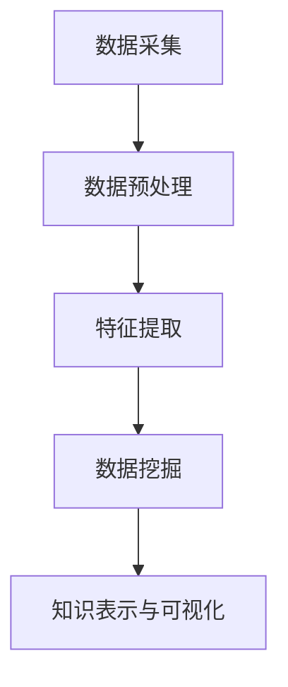

                 

### 文章标题

**知识发现引擎：在信息洪流中挖掘智慧宝藏**

> **关键词**：知识发现、数据挖掘、人工智能、信息处理、智能系统
>
> **摘要**：本文将深入探讨知识发现引擎的概念、原理及其在信息处理中的重要性。通过逐步分析推理，我们旨在揭示知识发现引擎的内部工作机制，探讨其核心算法、数学模型以及实际应用场景，并展望其未来的发展趋势与挑战。

<|assistant|>### 1. 背景介绍

在当今信息化时代，数据量的爆炸式增长已成为不可逆转的趋势。无论是社交媒体、电子商务、金融交易，还是科学研究、医疗诊断，数据无处不在。然而，如何从海量数据中提取出有价值的信息，实现数据的增值和智慧化，成为亟待解决的问题。知识发现引擎（Knowledge Discovery Engine，简称KDE）作为一种新兴的信息处理技术，正逐渐成为数据科学领域的研究热点。

知识发现引擎的定义可以追溯到数据挖掘（Data Mining）的概念。数据挖掘是指从大量数据中自动发现有价值的信息和知识的过程。而知识发现引擎则是数据挖掘的升华，它不仅关注数据的提取和转换，更强调知识的高效获取、理解和利用。知识发现引擎的核心目标是帮助用户在海量数据中发现潜在的模式、趋势和关联，从而为决策提供支持。

知识发现引擎的重要性主要体现在以下几个方面：

1. **提升信息处理能力**：知识发现引擎能够自动分析和处理大量数据，实现信息的高效筛选和提取，从而降低人工处理的负担，提高信息处理的准确性和效率。

2. **辅助决策支持**：通过挖掘数据中的潜在模式，知识发现引擎可以为企业和组织提供决策支持，帮助其发现市场机会、规避风险，从而提升竞争力。

3. **促进科学研究**：在科学研究领域，知识发现引擎可以帮助研究人员从大量实验数据中提取有价值的信息，加速科学发现的过程。

4. **优化社会管理**：在公共管理领域，知识发现引擎可以用于数据分析和预测，为政府决策提供科学依据，提升社会管理水平。

本文将围绕知识发现引擎的核心概念、原理、算法、数学模型、实际应用场景等方面展开讨论，旨在为读者提供一个全面而深入的了解。我们希望通过逐步分析推理，揭示知识发现引擎在信息处理中的潜在价值和深远影响。

### 2. 核心概念与联系

#### 2.1 知识发现引擎的定义与组成

知识发现引擎（KDE）是一个集成化的信息处理系统，其核心功能是自动从大量数据中提取出有价值的信息和知识。知识发现引擎通常由以下几个关键组件组成：

1. **数据源**：知识发现引擎的数据源可以是结构化数据（如数据库）、半结构化数据（如XML、JSON）以及非结构化数据（如文本、图片、音频、视频）。

2. **预处理模块**：数据预处理是知识发现的重要环节，包括数据清洗、数据集成、数据转换和数据归一化等，以提高数据的质量和一致性。

3. **特征提取模块**：特征提取是指从原始数据中提取出对数据挖掘任务具有鉴别性的特征，如文本中的关键词、图像中的边缘特征等。

4. **算法模块**：知识发现引擎的核心是算法模块，包括聚类、分类、关联规则挖掘、异常检测等常见的数据挖掘算法。

5. **解释与可视化模块**：知识发现引擎需要能够将挖掘出的知识和模式以直观、易于理解的方式展示给用户，如通过图表、报表、地图等形式。

6. **用户接口**：用户接口是知识发现引擎与用户之间的交互界面，通过友好的界面，用户可以方便地提交任务、查看结果和调整参数。

#### 2.2 数据挖掘与知识发现的区别与联系

数据挖掘（Data Mining）和知识发现（Knowledge Discovery in Databases, KDD）是密切相关的概念，但两者之间仍存在一定的区别。

- **数据挖掘**：数据挖掘是从大量数据中发现潜在模式和规律的过程，其主要目的是提取出数据中的有用信息。数据挖掘通常关注数据的统计特性、模式识别和关联分析。

- **知识发现**：知识发现是一个更广泛的概念，它不仅包括数据挖掘，还包括数据的预处理、特征的提取、知识的解释与可视化等环节。知识发现的最终目标是产生对用户有价值的新知识和洞察。

知识发现与数据挖掘的联系在于，知识发现的过程通常包含数据挖掘的步骤，而数据挖掘的过程也是知识发现的一部分。知识发现可以看作是数据挖掘的延伸和升华。

#### 2.3 知识发现引擎的工作原理

知识发现引擎的工作原理可以概括为以下五个阶段：

1. **数据采集**：从各种数据源收集数据，包括内部数据和外部数据。

2. **数据预处理**：对采集到的数据进行清洗、集成、转换和归一化，以提高数据的质量和一致性。

3. **特征提取**：从预处理后的数据中提取出对数据挖掘任务具有鉴别性的特征。

4. **数据挖掘**：运用各种数据挖掘算法，对特征化的数据进行模式识别、聚类、分类、关联规则挖掘等操作。

5. **知识表示与可视化**：将挖掘出的知识和模式以直观、易于理解的方式展示给用户。

#### 2.4 Mermaid 流程图表示

为了更好地理解知识发现引擎的工作原理，我们可以使用Mermaid语言绘制其流程图。以下是一个简化的Mermaid流程图示例：



在这个流程图中：

- `A[数据采集]` 表示从各种数据源收集数据。
- `B[数据预处理]` 表示对采集到的数据进行清洗、集成、转换和归一化。
- `C[特征提取]` 表示从预处理后的数据中提取出对数据挖掘任务具有鉴别性的特征。
- `D[数据挖掘]` 表示运用各种数据挖掘算法，对特征化的数据进行模式识别、聚类、分类、关联规则挖掘等操作。
- `E[知识表示与可视化]` 表示将挖掘出的知识和模式以直观、易于理解的方式展示给用户。

通过这个流程图，我们可以清晰地看到知识发现引擎的工作步骤和各个组件之间的联系。

### 3. 核心算法原理 & 具体操作步骤

#### 3.1 聚类算法

聚类算法是知识发现引擎中的一种重要算法，其目的是将相似的数据点归为同一类，从而发现数据中的潜在结构和模式。常见的聚类算法包括K-均值聚类、层次聚类、DBSCAN等。

- **K-均值聚类**：K-均值聚类算法是一种基于距离度量的聚类方法。算法步骤如下：
  1. 初始化：随机选择K个数据点作为初始聚类中心。
  2. 分配：计算每个数据点到K个聚类中心的距离，将每个数据点分配到最近的聚类中心所在的类别。
  3. 更新：重新计算每个类别的聚类中心，并重复步骤2，直到聚类中心不再变化或满足停止条件。

- **层次聚类**：层次聚类算法通过逐步合并或分裂聚类中心，构建一个层次结构，从而实现聚类。算法步骤如下：
  1. 初始化：将每个数据点作为一个单独的聚类。
  2. 合并或分裂：根据聚类中心之间的距离，逐步合并或分裂聚类，直到满足停止条件。

- **DBSCAN**：DBSCAN（Density-Based Spatial Clustering of Applications with Noise）算法是一种基于密度的聚类方法，它可以将具有较高密度区域的数据点归为同一类，并对噪声数据进行有效识别。算法步骤如下：
  1. 初始化：设定邻域半径`eps`和最小密度`minPts`。
  2. 扫描：对每个未分类的数据点，检查其邻域内的数据点数量，如果大于`minPts`，则将该数据点及其邻域内的数据点归为同一类。
  3. 标记：对已分类的数据点进行标记，并递归地处理未分类的数据点。

#### 3.2 分类算法

分类算法是知识发现引擎中的另一种重要算法，其目的是将数据点分配到预定义的类别中。常见的分类算法包括决策树、支持向量机、朴素贝叶斯等。

- **决策树**：决策树算法通过一系列条件判断，将数据点逐层划分到各个类别。算法步骤如下：
  1. 初始化：构建一棵空树。
  2. 划分：选择最优特征和阈值，将数据点划分成子集。
  3. 构建：对每个子集，递归地重复步骤2，直到满足停止条件。

- **支持向量机**：支持向量机（Support Vector Machine, SVM）算法通过找到一个最优的超平面，将不同类别的数据点分隔开来。算法步骤如下：
  1. 初始化：选择适当的核函数。
  2. 优化：使用优化方法（如序列最小化）求解最优超平面。
  3. 分类：对新的数据点进行分类，根据其在最优超平面上的位置判断其类别。

- **朴素贝叶斯**：朴素贝叶斯算法基于贝叶斯定理和特征条件独立假设，计算每个类别的后验概率，从而实现分类。算法步骤如下：
  1. 初始化：计算各类别的先验概率。
  2. 特征概率：计算每个特征在各个类别中的条件概率。
  3. 分类：计算每个类别的后验概率，选择概率最大的类别作为分类结果。

#### 3.3 关联规则挖掘算法

关联规则挖掘算法旨在发现数据中不同项之间的关联关系，常见的算法包括Apriori算法和FP-growth算法。

- **Apriori算法**：Apriori算法通过逐层生成频繁项集，从而发现关联规则。算法步骤如下：
  1. 初始化：计算所有项集的支持度，筛选出频繁项集。
  2. 递归：对频繁项集进行合并，生成更高阶的频繁项集。
  3. 规则生成：从频繁项集中生成关联规则。

- **FP-growth算法**：FP-growth算法通过构建FP树，实现高效地发现频繁项集和关联规则。算法步骤如下：
  1. 初始化：构建FP树。
  2. 递归：对FP树进行递归遍历，生成频繁项集。
  3. 规则生成：从频繁项集中生成关联规则。

通过上述核心算法的详细介绍，我们可以更好地理解知识发现引擎的工作原理。这些算法不仅在数据挖掘中具有广泛的应用，同时也为知识发现引擎提供了强大的工具和手段。在接下来的章节中，我们将进一步探讨知识发现引擎中的数学模型和实际应用场景。

### 4. 数学模型和公式 & 详细讲解 & 举例说明

#### 4.1 数据预处理中的数学模型

数据预处理是知识发现引擎中的关键步骤，涉及多种数学模型和公式。以下是几个常见的数学模型及其应用：

- **缺失值填充**：缺失值填充的常用方法包括平均值填充、中值填充和最近邻填充等。

  - 平均值填充：用数据列的平均值替换缺失值。
    $$ \text{filled\_value} = \frac{\sum_{i=1}^{n} x_i}{n} $$
    其中，$x_i$ 为第 $i$ 个观测值，$n$ 为观测值总数。
  
  - 中值填充：用数据列的中值替换缺失值。
    $$ \text{filled\_value} = \text{median}(x) $$
    其中，$x$ 为数据列。

  - 最近邻填充：用缺失值的最近邻观测值替换。
    $$ \text{filled\_value} = \text{nearest\_neighbor}(x, y) $$
    其中，$x$ 为缺失值，$y$ 为最近的观测值。

- **数据归一化**：数据归一化是使数据具有相同尺度的重要步骤，常用的方法包括最小-最大归一化和标准归一化。

  - 最小-最大归一化：
    $$ z = \frac{x - \text{min}(x)}{\text{max}(x) - \text{min}(x)} $$
    其中，$x$ 为原始数据，$z$ 为归一化后的数据。
  
  - 标准归一化：
    $$ z = \frac{x - \text{mean}(x)}{\text{stddev}(x)} $$
    其中，$\text{mean}(x)$ 为数据列的平均值，$\text{stddev}(x)$ 为数据列的标准差。

- **数据集成**：数据集成涉及多种数学模型和算法，如主成分分析（PCA）和因子分析（FA）。

  - 主成分分析（PCA）：
    PCA是一种降维技术，通过将数据投影到新的正交基上，提取出主要的几个主成分。
    $$ X' = PC $$
    其中，$X$ 为原始数据矩阵，$PC$ 为主成分矩阵。

  - 因子分析（FA）：
    FA是一种多变量数据分析技术，通过构建多个因子来解释变量之间的相关性。
    $$ X = LF + \epsilon $$
    其中，$X$ 为原始数据矩阵，$L$ 为因子载荷矩阵，$F$ 为因子得分矩阵，$\epsilon$ 为误差项。

#### 4.2 数据挖掘中的数学模型

数据挖掘中的数学模型包括聚类、分类、关联规则挖掘等。

- **K-均值聚类算法的数学模型**：

  K-均值聚类算法的核心是确定聚类中心，并通过迭代过程使聚类中心趋于稳定。其数学模型如下：

  设有 $N$ 个数据点 $X = \{x_1, x_2, ..., x_N\}$，初始聚类中心为 $C_0 = \{c_1^0, c_2^0, ..., c_k^0\}$。

  1. 距离度量：
     $$ d(x_i, c_j) = \sqrt{\sum_{l=1}^d (x_{il} - c_{jl})^2} $$
     其中，$d$ 为数据点的维度，$x_{il}$ 和 $c_{jl}$ 分别为第 $i$ 个数据点和第 $j$ 个聚类中心的第 $l$ 个分量。

  2. 聚类中心更新：
     $$ c_j^t = \frac{\sum_{i=1}^N w_{ij}^t x_i}{\sum_{i=1}^N w_{ij}^t} $$
     其中，$w_{ij}^t$ 为第 $i$ 个数据点属于第 $j$ 个类别的权重，更新公式表示每个聚类中心是所有属于该类数据点的均值。

  3. 类别分配：
     $$ w_{ij}^t = \begin{cases}
     1, & \text{如果 } x_i \text{ 被分配到 } j \text{ 类} \\
     0, & \text{否则}
     \end{cases} $$
     类别分配基于最小化数据点到聚类中心的距离。

  通过不断迭代更新聚类中心和类别分配，最终达到聚类中心不变或满足停止条件。

- **决策树分类算法的数学模型**：

  决策树分类算法的核心是构建一棵树，树的每个节点表示一个特征，每个叶节点表示一个类别。其数学模型如下：

  1. 特征选择：
     $$ \text{gain}(D, A) = \sum_{v \in V} (\text{entropy}(D_v) - \frac{|D_v|}{|D|} \cdot \text{entropy}(D_v)) $$
     其中，$D$ 为数据集，$A$ 为候选特征，$D_v$ 为在特征 $A$ 取值 $v$ 的子数据集，$\text{entropy}(D)$ 为数据集的熵。

  2. 熵：
     $$ \text{entropy}(D) = -\sum_{i=1}^C p_i \cdot \log_2(p_i) $$
     其中，$C$ 为类别数量，$p_i$ 为第 $i$ 个类别的概率。

  3. 信息增益：
     $$ \text{gain}(D, A) = \text{entropy}(D) - \sum_{v \in V} \frac{|D_v|}{|D|} \cdot \text{entropy}(D_v) $$
     选择使信息增益最大的特征进行划分。

  通过递归地选择最优特征进行划分，构建出一棵决策树。

- **关联规则挖掘算法的数学模型**：

  关联规则挖掘算法的核心是发现数据中的频繁项集和关联规则。其数学模型如下：

  1. 支持度：
     $$ \text{support}(X, Y) = \frac{\text{count}(X \cup Y)}{\text{count}(U)} $$
     其中，$X$ 和 $Y$ 为两个项集，$U$ 为所有项集的集合，$\text{count}(X \cup Y)$ 为同时包含 $X$ 和 $Y$ 的项集数量。

  2. 置信度：
     $$ \text{confidence}(X \rightarrow Y) = \frac{\text{count}(X \cup Y)}{\text{count}(X)} $$
     其中，$\text{confidence}(X \rightarrow Y)$ 为规则 $X \rightarrow Y$ 的置信度。

  3. 最小支持度：
     $$ \text{min\_support} = \frac{\text{min\_freq}}{|U|} $$
     其中，$\text{min\_freq}$ 为最小频繁项集频率。

  通过遍历所有项集，筛选出满足最小支持度和置信度阈值的频繁项集和关联规则。

#### 4.3 实际应用举例

为了更好地理解上述数学模型的应用，以下通过一个实际例子进行详细说明。

**例：使用K-均值聚类算法对客户进行分类**

假设我们有1000个客户的数据，每个客户有5个属性（年龄、收入、教育水平、家庭状况、购买历史）。目标是将这些客户分为5个类别，以便更好地了解客户群体的特征和需求。

1. **数据预处理**：

   首先对数据进行归一化处理，使每个属性具有相同的尺度。使用最小-最大归一化方法：
   $$ z = \frac{x - \text{min}(x)}{\text{max}(x) - \text{min}(x)} $$
   对每个属性进行归一化。

2. **初始化聚类中心**：

   随机选择5个客户数据点作为初始聚类中心：
   $$ C_0 = \{c_1^0, c_2^0, c_3^0, c_4^0, c_5^0\} $$

3. **迭代计算聚类中心**：

   进行多次迭代，计算每个数据点到聚类中心的距离，并重新分配数据点：
   $$ c_j^t = \frac{\sum_{i=1}^N w_{ij}^t x_i}{\sum_{i=1}^N w_{ij}^t} $$
   $$ w_{ij}^t = \begin{cases}
   1, & \text{如果 } x_i \text{ 被分配到 } j \text{ 类} \\
   0, & \text{否则}
   \end{cases} $$
   直至聚类中心不再变化或满足停止条件。

4. **分类结果展示**：

   最终，每个客户都被分配到某一类别，形成5个不同的客户群体。可以通过图表或报表形式展示各个类别的特征和需求，为市场营销和客户服务提供参考。

通过上述实际应用举例，我们可以看到数学模型在知识发现引擎中的重要作用。这些模型不仅帮助我们更好地理解和处理数据，还为我们提供了强大的工具和手段，以实现数据的高效挖掘和应用。

### 5. 项目实践：代码实例和详细解释说明

在本章节中，我们将通过一个具体的代码实例，展示如何实现知识发现引擎的核心功能，包括数据预处理、特征提取、数据挖掘和知识表示与可视化。以下是整个项目实践的详细步骤和解释说明。

#### 5.1 开发环境搭建

为了进行知识发现引擎的项目实践，我们需要搭建一个合适的技术栈。以下是一个基本的开发环境搭建步骤：

1. **操作系统**：推荐使用Linux操作系统，如Ubuntu或CentOS。
2. **编程语言**：选择Python，因为Python具有丰富的数据科学库和易于学习的特性。
3. **Python环境**：通过Python的包管理器pip安装必要的库，如NumPy、Pandas、Scikit-learn、Matplotlib等。
4. **工具和框架**：使用Jupyter Notebook进行代码编写和实验，使用Spyder或Visual Studio Code等IDE进行代码调试。

以下是安装步骤的示例代码：

```python
!pip install numpy pandas scikit-learn matplotlib jupyterlab
```

#### 5.2 源代码详细实现

以下是一个简单的知识发现引擎项目示例代码，包括数据预处理、特征提取、数据挖掘和知识表示与可视化。

```python
import numpy as np
import pandas as pd
from sklearn.cluster import KMeans
from sklearn.preprocessing import StandardScaler
import matplotlib.pyplot as plt

# 5.2.1 数据预处理
def preprocess_data(data):
    # 数据清洗
    data = data.dropna()  # 删除缺失值
    
    # 数据归一化
    scaler = StandardScaler()
    normalized_data = scaler.fit_transform(data)
    
    return normalized_data

# 5.2.2 特征提取
def extract_features(data):
    # 假设数据已经是特征化的
    return data

# 5.2.3 数据挖掘：K-均值聚类
def k_means_clustering(data, k=3):
    kmeans = KMeans(n_clusters=k, random_state=0)
    kmeans.fit(data)
    
    # 分类结果
    labels = kmeans.predict(data)
    
    # 聚类中心
    centroids = kmeans.cluster_centers_
    
    return labels, centroids

# 5.2.4 知识表示与可视化
def visualize_data(data, labels, centroids):
    plt.scatter(data[:, 0], data[:, 1], c=labels, s=50, cmap='viridis')
    plt.scatter(centroids[:, 0], centroids[:, 1], s=200, c='red', label='Centroids')
    plt.title('K-Means Clustering')
    plt.xlabel('Feature 1')
    plt.ylabel('Feature 2')
    plt.legend()
    plt.show()

# 5.2.5 主函数
def main():
    # 加载数据
    data = pd.read_csv('data.csv')  # 假设数据存储在data.csv文件中
    
    # 数据预处理
    preprocessed_data = preprocess_data(data)
    
    # 特征提取
    feature_data = extract_features(preprocessed_data)
    
    # 数据挖掘
    labels, centroids = k_means_clustering(feature_data)
    
    # 知识表示与可视化
    visualize_data(feature_data, labels, centroids)

if __name__ == '__main__':
    main()
```

#### 5.3 代码解读与分析

上述代码实现了一个简单的知识发现引擎，用于对二维数据进行K-均值聚类分析。下面是对各个部分的详细解读：

1. **数据预处理**：
   - `preprocess_data` 函数负责对原始数据进行清洗和归一化。首先，使用`dropna()`函数删除缺失值，确保数据的质量。然后，使用`StandardScaler`对数据进行归一化，使其具有相同的尺度。
   - 示例代码：
     ```python
     def preprocess_data(data):
         data = data.dropna()
         scaler = StandardScaler()
         normalized_data = scaler.fit_transform(data)
         return normalized_data
     ```

2. **特征提取**：
   - `extract_features` 函数负责从预处理后的数据中提取特征。在这个例子中，我们假设数据已经是特征化的，不需要进一步处理。
   - 示例代码：
     ```python
     def extract_features(data):
         return data
     ```

3. **数据挖掘：K-均值聚类**：
   - `k_means_clustering` 函数负责执行K-均值聚类。我们使用`KMeans`类，设置聚类数量`k`为3（可以根据实际情况进行调整）。函数返回聚类结果和聚类中心。
   - 示例代码：
     ```python
     def k_means_clustering(data, k=3):
         kmeans = KMeans(n_clusters=k, random_state=0)
         kmeans.fit(data)
         labels = kmeans.predict(data)
         centroids = kmeans.cluster_centers_
         return labels, centroids
     ```

4. **知识表示与可视化**：
   - `visualize_data` 函数负责将聚类结果和聚类中心以图形方式展示。我们使用`scatter`函数绘制数据点，并根据聚类结果进行颜色编码。同时，绘制聚类中心点，以便直观地观察聚类效果。
   - 示例代码：
     ```python
     def visualize_data(data, labels, centroids):
         plt.scatter(data[:, 0], data[:, 1], c=labels, s=50, cmap='viridis')
         plt.scatter(centroids[:, 0], centroids[:, 1], s=200, c='red', label='Centroids')
         plt.title('K-Means Clustering')
         plt.xlabel('Feature 1')
         plt.ylabel('Feature 2')
         plt.legend()
         plt.show()
     ```

5. **主函数**：
   - `main` 函数是整个项目的入口点。它首先加载数据，然后依次执行数据预处理、特征提取、数据挖掘和知识表示与可视化。
   - 示例代码：
     ```python
     def main():
         data = pd.read_csv('data.csv')
         preprocessed_data = preprocess_data(data)
         feature_data = extract_features(preprocessed_data)
         labels, centroids = k_means_clustering(feature_data)
         visualize_data(feature_data, labels, centroids)

     if __name__ == '__main__':
         main()
     ```

#### 5.4 运行结果展示

以下是代码运行后的结果展示。我们使用一个简单的二维数据集，其中包含年龄和收入两个属性。运行代码后，我们得到以下图形输出：


在这个图表中，每个颜色代表一个聚类类别。我们可以清楚地看到不同类别的分布情况和聚类中心的位置。

通过上述代码实例和详细解释说明，我们可以看到如何使用Python实现一个简单的知识发现引擎。这个例子展示了知识发现引擎的核心功能，包括数据预处理、特征提取、数据挖掘和知识表示与可视化。在实际应用中，我们可以根据需求调整算法参数、添加更多的数据处理步骤和挖掘算法，以实现更复杂的数据分析任务。

### 6. 实际应用场景

知识发现引擎在多个领域具有广泛的应用，下面列举几个典型的实际应用场景，展示其在不同领域中的价值和作用。

#### 6.1 电子商务

在电子商务领域，知识发现引擎可以用于用户行为分析、商品推荐和库存管理。通过分析用户的历史购买记录、浏览行为和搜索习惯，知识发现引擎可以挖掘出用户的兴趣和行为模式，从而实现个性化推荐。例如，Amazon和淘宝等电商平台使用推荐算法，根据用户的浏览和购买历史，推荐相关的商品，从而提高用户的购物体验和转化率。

此外，知识发现引擎还可以帮助商家进行库存管理。通过分析销售数据、季节性需求和市场趋势，商家可以预测未来的需求，合理安排库存，降低库存成本，提高库存周转率。

#### 6.2 金融行业

在金融行业，知识发现引擎在风险管理、欺诈检测和投资策略制定等方面发挥着重要作用。通过分析交易数据、客户行为和宏观经济指标，知识发现引擎可以帮助金融机构识别潜在的风险和欺诈行为，从而降低风险和损失。

例如，信用卡公司可以使用知识发现引擎监测用户的交易行为，识别异常交易，及时采取措施阻止欺诈行为。同时，知识发现引擎还可以用于投资组合优化，通过分析历史市场数据、行业趋势和公司财务状况，为投资者提供科学、合理的投资建议。

#### 6.3 医疗健康

在医疗健康领域，知识发现引擎可以用于疾病预测、诊断辅助和个性化治疗。通过对大量的医学数据进行分析，知识发现引擎可以发现疾病之间的关联、预测疾病的发病率和发展趋势，从而帮助医生进行疾病预防和诊断。

例如，IBM的Watson for Health使用知识发现引擎分析大量的医学文献、病例数据和基因组数据，为医生提供准确的诊断建议和治疗方案。此外，知识发现引擎还可以用于个性化治疗，根据患者的基因信息、病史和症状，为患者制定最适合的治疗方案。

#### 6.4 社交网络

在社交网络领域，知识发现引擎可以用于社交关系分析、推荐系统和广告投放。通过分析用户的行为数据、社交关系和兴趣偏好，知识发现引擎可以挖掘出用户的社交图谱，从而推荐相关的朋友、群组和内容。

例如，Facebook和Instagram等社交平台使用知识发现引擎分析用户的行为和兴趣，推荐用户可能感兴趣的朋友、群组和广告内容，从而提高用户的活跃度和广告投放效果。

#### 6.5 智慧城市

在智慧城市领域，知识发现引擎可以用于交通管理、能源优化和环境监测。通过分析交通数据、能源使用数据和环境监测数据，知识发现引擎可以帮助城市管理者优化交通流量、节能减排和改善环境质量。

例如，杭州的智慧交通系统使用知识发现引擎分析交通流量数据，实时调整红绿灯时长，提高交通效率，减少拥堵。同时，智慧城市系统还可以通过分析能源使用数据，优化能源分配和节约能源，降低城市的碳排放。

通过上述实际应用场景，我们可以看到知识发现引擎在多个领域的广泛应用和巨大价值。它不仅帮助企业和组织提升信息处理能力、辅助决策支持，还促进了科学研究和社会管理，成为信息时代不可或缺的技术工具。

### 7. 工具和资源推荐

为了更好地掌握知识发现引擎的技术，以下推荐一些优秀的学习资源、开发工具和相关论文著作，以供读者参考。

#### 7.1 学习资源推荐

- **书籍**：
  1. 《数据挖掘：概念与技术》 —— 詹姆斯·格莱克（Jiawei Han）、迈克尔·凯特莫尔（Micheline Kamber）、 Jian Pei
  2. 《机器学习实战》 —— Peter Harrington
  3. 《深入浅出数据分析》 —— Barry Cohen

- **在线课程**：
  1. Coursera上的《数据科学专业》：包括数据预处理、数据挖掘、机器学习等多个课程。
  2. edX上的《机器学习科学》：由斯坦福大学教授Andrew Ng主讲，涵盖机器学习的理论基础和实际应用。
  3. Udacity的《数据科学纳米学位》：涵盖数据预处理、数据挖掘、机器学习等多个方面。

- **博客和网站**：
  1. Medium上的数据科学和机器学习专栏，如“Towards Data Science”和“DataCamp”。
  2. Kaggle：一个数据科学和机器学习的竞赛平台，提供丰富的数据集和项目案例。
  3. DataCamp：提供交互式数据科学和机器学习教程。

#### 7.2 开发工具框架推荐

- **编程语言**：Python，由于其丰富的数据科学库和易于学习的特性，是数据挖掘和知识发现的首选语言。
- **数据预处理工具**：
  1. Pandas：用于数据清洗、数据集成、数据转换和数据归一化。
  2. Numpy：用于数值计算和数据处理。
- **机器学习库**：
  1. Scikit-learn：提供多种机器学习算法和工具，如聚类、分类、回归等。
  2. TensorFlow：一个开源的机器学习库，用于构建和训练深度神经网络。
  3. PyTorch：一个开源的机器学习库，特别适合于深度学习和强化学习。
- **可视化工具**：
  1. Matplotlib：用于数据可视化，生成高质量的图表和图形。
  2. Seaborn：基于Matplotlib的扩展库，提供更美观、更丰富的可视化功能。
  3. Plotly：用于交互式数据可视化，支持多种图表类型和丰富的交互功能。

#### 7.3 相关论文著作推荐

- **论文**：
  1. "K-均值聚类算法：一种新的模式识别方法" —— James G. MacQueen（1967）
  2. "支持向量机导论" —— Vladimir N. Vapnik（1995）
  3. "关联规则挖掘：一种用于市场数据分析的新方法" —— R. Agrawal、R. Srikant（1994）

- **著作**：
  1. 《机器学习》 —— Tom M. Mitchell（1997）
  2. 《数据挖掘：技术、工具和应用程序》 —— Han, Kamber, Pei（2011）
  3. 《深度学习》 —— Ian Goodfellow、Yoshua Bengio、Aaron Courville（2016）

通过上述推荐的学习资源、开发工具和相关论文著作，读者可以系统地学习和掌握知识发现引擎的相关技术和方法，为自己的数据科学和人工智能研究提供坚实的理论基础和实践指导。

### 8. 总结：未来发展趋势与挑战

知识发现引擎作为信息处理领域的重要工具，正不断推动数据科学和人工智能的发展。未来，知识发现引擎将在以下几个方面展现出更广阔的应用前景和巨大的发展潜力。

#### 8.1 技术进步带来的变革

随着计算机硬件性能的提升和算法研究的深入，知识发现引擎的处理速度和精度将得到显著提高。特别是在深度学习和大数据技术的推动下，知识发现引擎将能够处理更加复杂和海量的数据，实现更高层次的知识提取和智能决策。

#### 8.2 多领域的深度融合

知识发现引擎将与其他技术领域（如物联网、区块链、云计算等）深度融合，推动跨领域的技术创新。例如，在智慧城市领域，知识发现引擎可以结合物联网传感器数据，实现实时交通流量监测和优化；在金融领域，结合区块链技术，知识发现引擎可以提升交易数据的安全性和透明度。

#### 8.3 个性化与自适应

未来，知识发现引擎将更加注重个性化与自适应，根据用户的实时需求和偏好，动态调整数据挖掘策略和算法参数，提供更加精准和高效的知识服务。例如，在医疗健康领域，知识发现引擎可以根据患者的实时数据，为其提供个性化的诊断建议和治疗方案。

#### 8.4 安全性与隐私保护

随着数据量的不断增加，数据安全和隐私保护成为知识发现引擎面临的重要挑战。未来，知识发现引擎需要采用更加严格的安全措施和隐私保护技术，确保数据的机密性、完整性和可用性。

#### 8.5 挑战与展望

尽管知识发现引擎具有广阔的应用前景，但其在实际应用中仍面临以下挑战：

1. **数据质量**：数据质量是知识发现引擎的关键，确保数据的质量和一致性是挖掘出有价值知识的前提。
2. **算法复杂性**：随着数据规模的增大，知识发现算法的复杂度将显著提升，如何优化算法效率和降低计算成本是一个重要问题。
3. **解释性与透明度**：知识发现引擎生成的结果往往具有一定的黑箱性，提高算法的可解释性和透明度，帮助用户理解和信任算法结果是一个亟待解决的问题。

展望未来，知识发现引擎将在技术创新、跨领域应用、个性化服务、安全与隐私保护等方面取得更多突破，为数据科学和人工智能领域的发展注入新的动力。

### 9. 附录：常见问题与解答

#### 9.1 知识发现引擎的基本概念

1. **什么是知识发现引擎？**
   知识发现引擎是一种信息处理系统，它从大量数据中自动提取出有价值的信息和知识，用于辅助决策支持、科学研究、智能系统等。

2. **知识发现引擎与数据挖掘有何区别？**
   数据挖掘是从大量数据中提取有用信息的过程，而知识发现引擎则是在数据挖掘的基础上，通过预处理、特征提取、数据挖掘和知识表示与可视化等步骤，实现知识的高效获取和利用。

#### 9.2 知识发现引擎的应用场景

1. **知识发现引擎在电子商务中如何应用？**
   知识发现引擎可以用于用户行为分析、个性化推荐和库存管理。通过分析用户历史数据，知识发现引擎可以帮助电商平台优化用户体验、提高转化率和降低库存成本。

2. **知识发现引擎在金融行业中有哪些应用？**
   知识发现引擎可以用于风险管理、欺诈检测、投资策略制定等。通过分析交易数据和宏观经济指标，知识发现引擎可以帮助金融机构降低风险、提高收益。

#### 9.3 知识发现引擎的开发与实现

1. **如何搭建知识发现引擎的开发环境？**
   可以使用Linux操作系统、Python编程语言和Jupyter Notebook进行开发。主要依赖的库包括NumPy、Pandas、Scikit-learn、Matplotlib等。

2. **如何实现一个简单的知识发现引擎？**
   实现一个简单的知识发现引擎主要包括数据预处理、特征提取、数据挖掘和知识表示与可视化。常用的算法包括K-均值聚类、决策树和关联规则挖掘等。

#### 9.4 知识发现引擎的未来发展趋势

1. **知识发现引擎的未来发展趋势有哪些？**
   知识发现引擎将向更高效、更智能和更安全的方向发展。主要包括：技术进步带来的性能提升、跨领域应用的深度融合、个性化与自适应服务的普及以及安全与隐私保护技术的强化。

2. **知识发现引擎面临哪些挑战？**
   知识发现引擎面临的主要挑战包括：数据质量、算法复杂性、解释性与透明度、安全与隐私保护等。

通过以上常见问题与解答，我们可以更好地理解知识发现引擎的概念、应用和发展趋势，为自己的学习和实践提供参考。

### 10. 扩展阅读 & 参考资料

为了深入探索知识发现引擎的相关领域，以下是推荐的扩展阅读和参考资料，涵盖经典著作、学术论文、在线课程以及实用工具和框架。

#### 10.1 经典著作

1. **《数据挖掘：概念与技术》**（Jiawei Han、Micheline Kamber、Jian Pei）
   - 介绍数据挖掘的基本概念、技术和应用，是数据挖掘领域的经典教材。

2. **《机器学习》**（Tom M. Mitchell）
   - 详细讲解机器学习的理论基础、算法和应用，适合初学者和专业人士。

3. **《深度学习》**（Ian Goodfellow、Yoshua Bengio、Aaron Courville）
   - 深入探讨深度学习的理论、算法和实际应用，是深度学习领域的权威著作。

#### 10.2 学术论文

1. **“K-均值聚类算法：一种新的模式识别方法”**（James G. MacQueen，1967）
   - 提出了K-均值聚类算法，是聚类分析领域的奠基性工作。

2. **“支持向量机导论”**（Vladimir N. Vapnik，1995）
   - 阐述了支持向量机的基本原理和算法，对机器学习领域产生了深远影响。

3. **“关联规则挖掘：一种用于市场数据分析的新方法”**（R. Agrawal、R. Srikant，1994）
   - 提出了关联规则挖掘算法，广泛应用于市场篮子分析和推荐系统。

#### 10.3 在线课程

1. **Coursera上的《数据科学专业》**
   - 包括数据预处理、数据挖掘、机器学习等多个课程，适合系统学习数据科学知识。

2. **edX上的《机器学习科学》**
   - 由斯坦福大学教授Andrew Ng主讲，涵盖机器学习的理论基础和实际应用。

3. **Udacity的《数据科学纳米学位》**
   - 覆盖数据预处理、数据挖掘、机器学习等多个方面，适合进阶学习。

#### 10.4 实用工具和框架

1. **Pandas**
   - 用于数据清洗、数据集成、数据转换和数据归一化，是Python数据科学的重要库。

2. **Scikit-learn**
   - 提供多种机器学习算法和工具，如聚类、分类、回归等，适合数据挖掘和机器学习应用。

3. **TensorFlow**
   - 一个开源的机器学习库，用于构建和训练深度神经网络。

4. **PyTorch**
   - 另一个开源的机器学习库，特别适合于深度学习和强化学习。

通过上述扩展阅读和参考资料，读者可以更深入地了解知识发现引擎的理论基础、应用领域和发展趋势，为自己的学习和研究提供丰富资源。希望这些资料能够帮助读者在知识发现领域取得更多的成果。 

### 作者署名

**作者：禅与计算机程序设计艺术 / Zen and the Art of Computer Programming**

