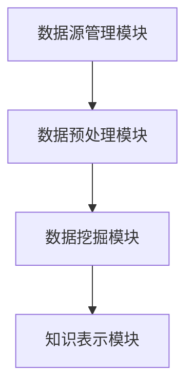

                 

### 1. 背景介绍

知识发现引擎（Knowledge Discovery Engine，简称KDE）是一种利用先进的数据挖掘技术和人工智能算法，从大量数据中提取出有价值的信息和知识的新型技术。其核心目标在于将复杂、大规模的数据转化为易于理解、具有实际应用价值的知识。

知识发现引擎的历史可以追溯到20世纪80年代，当时计算机科学界开始意识到从大量数据中提取有价值信息的重要性。随着互联网和大数据时代的到来，知识发现引擎技术得到了迅速发展和广泛应用。如今，知识发现引擎已成为各个领域，如金融、医疗、电子商务、智能交通等，不可或缺的重要工具。

知识发现引擎的重要性主要体现在以下几个方面：

1. **数据驱动决策**：知识发现引擎能够自动挖掘出数据中的隐藏模式，为决策者提供有力的数据支持，使得决策过程更加科学和高效。
2. **智能分析与预测**：通过知识发现，我们可以对数据进行深入分析，预测未来的趋势和变化，为企业和个人提供前瞻性的决策依据。
3. **提升业务效率**：知识发现引擎可以帮助企业发现潜在的业务机会，优化业务流程，提高运营效率。
4. **创新知识创造**：知识发现引擎不仅能够挖掘已有的知识，还可以激发新的创意和想法，推动知识的创新和应用。

本文将详细探讨知识发现引擎的基本原理、核心算法、数学模型、项目实践和实际应用场景，以期为读者提供一个全面、深入的了解。

### 2. 核心概念与联系

#### 2.1 知识发现引擎的基本原理

知识发现引擎的基本原理可以概括为四个步骤：数据采集、数据预处理、数据挖掘和知识表示。

**数据采集**：知识发现引擎首先需要从各种数据源中采集数据，这些数据源包括数据库、数据仓库、传感器网络、互联网等。

**数据预处理**：采集到的原始数据往往是不完整、不一致的，因此需要进行预处理，包括数据清洗、数据整合、数据转换等操作，以便为后续的数据挖掘提供高质量的数据。

**数据挖掘**：数据挖掘是知识发现引擎的核心步骤，通过使用各种数据挖掘算法，如分类、聚类、关联规则挖掘等，从预处理后的数据中提取出有用的模式和知识。

**知识表示**：最后，将挖掘出来的知识进行表示和可视化，以便用户理解和应用。

#### 2.2 知识发现引擎的架构

知识发现引擎的架构通常包括以下几个主要模块：

1. **数据源管理模块**：负责管理各种数据源，包括数据采集、数据同步和数据存储。
2. **数据预处理模块**：负责对采集到的原始数据进行清洗、整合和转换，为数据挖掘提供高质量的数据。
3. **数据挖掘模块**：负责执行各种数据挖掘算法，从数据中提取出有用的模式和知识。
4. **知识表示模块**：负责将挖掘出来的知识进行表示和可视化，以便用户理解和应用。

**图 1：知识发现引擎的架构图**



#### 2.3 知识发现引擎的核心算法

知识发现引擎的核心算法主要包括分类、聚类、关联规则挖掘和异常检测等。

1. **分类算法**：分类算法通过将数据分为不同的类别，帮助我们理解和预测新数据。常见的分类算法包括决策树、支持向量机、朴素贝叶斯等。
2. **聚类算法**：聚类算法将相似的数据归为同一类，帮助我们发现数据中的隐含模式。常见的聚类算法包括K-means、层次聚类、DBSCAN等。
3. **关联规则挖掘**：关联规则挖掘通过发现数据之间的关联关系，帮助我们理解数据的内在联系。常见的关联规则挖掘算法包括Apriori算法、FP-growth算法等。
4. **异常检测**：异常检测通过识别数据中的异常值，帮助我们发现潜在的异常行为。常见的异常检测算法包括孤立森林、局部异常因数法等。

#### 2.4 知识发现引擎的应用领域

知识发现引擎的应用领域非常广泛，涵盖了金融、医疗、电子商务、智能交通等多个行业。以下是一些典型的应用案例：

1. **金融行业**：知识发现引擎可以用于信用评估、欺诈检测、投资策略优化等。
2. **医疗行业**：知识发现引擎可以用于疾病预测、个性化医疗、药物研发等。
3. **电子商务**：知识发现引擎可以用于用户行为分析、推荐系统、市场预测等。
4. **智能交通**：知识发现引擎可以用于交通流量预测、交通信号优化、智能导航等。

通过上述介绍，我们可以看到知识发现引擎的核心概念、原理和架构，以及其在各个领域的广泛应用。接下来，我们将深入探讨知识发现引擎的核心算法原理，以及具体的操作步骤。

#### 2.5 知识发现引擎的核心算法原理 & 具体操作步骤

在知识发现引擎中，核心算法的选择和实现直接影响到数据挖掘的效果和效率。下面我们将详细介绍几种常见的核心算法，包括分类算法、聚类算法、关联规则挖掘算法和异常检测算法，以及它们的操作步骤。

##### 2.5.1 分类算法

分类算法是一种将数据集中的样本分配到不同的类别中的方法。分类算法的核心目标是通过学习已有的数据，建立分类模型，以便对新样本进行分类。

**常见分类算法**：

1. **决策树**：决策树通过一系列的测试来对样本进行分类。每个测试都基于一个属性，并产生两个分支，分别代表该属性的两个可能值。决策树的建立过程是通过递归划分数据集，使得每个子集中的样本都属于同一类别。
2. **支持向量机**（SVM）：SVM通过找到数据空间中的一个超平面，使得分类边界最大化。SVM的核心是找到最优的分割超平面，即找到能够最大化分类间隔的超平面。
3. **朴素贝叶斯**：朴素贝叶斯分类器是基于贝叶斯定理和属性独立假设的分类算法。它通过计算每个类别条件下各属性的联合概率，然后选择概率最大的类别作为预测结果。

**操作步骤**：

1. **数据准备**：收集并准备用于训练的数据集，数据集应包括特征和标签。
2. **特征选择**：选择对分类任务最有影响力的特征，以减少计算复杂度和提高分类性能。
3. **模型训练**：使用训练数据集训练分类模型，如构建决策树、训练SVM模型、计算朴素贝叶斯概率等。
4. **模型评估**：使用测试数据集对分类模型进行评估，常用的评估指标包括准确率、召回率、F1值等。
5. **预测应用**：使用训练好的模型对新样本进行分类预测。

##### 2.5.2 聚类算法

聚类算法是一种将数据集中的样本划分为多个群组（簇）的方法。聚类算法的核心目标是通过发现数据之间的相似性，将相似的数据归为同一簇。

**常见聚类算法**：

1. **K-means**：K-means算法通过迭代优化，将数据点分配到K个簇中，使得每个簇内的数据点之间的距离最小，簇与簇之间的距离最大。K-means算法需要预先指定簇的数量K，并通过计算簇中心来更新簇成员。
2. **层次聚类**：层次聚类通过递归地将数据点合并或分解，形成不同层次的簇结构。层次聚类可以分为凝聚层次聚类和分裂层次聚类，前者从单个数据点开始，逐步合并；后者从单个簇开始，逐步分解。
3. **DBSCAN**（Density-Based Spatial Clustering of Applications with Noise）：DBSCAN是一种基于密度的聚类算法，它能够发现任意形状的簇，并能够处理噪声和异常点。DBSCAN通过定义邻域和密度连接，将相似的数据点划分为簇。

**操作步骤**：

1. **数据准备**：收集并准备用于聚类的数据集，数据集应包含样本的特征。
2. **确定聚类参数**：如K-means算法需要确定簇的数量K，DBSCAN算法需要确定邻域大小和最小密度。
3. **聚类过程**：执行聚类算法，生成簇结构和簇成员。
4. **簇评估**：评估簇的质量，如簇内相似度、簇间差异等。
5. **结果应用**：根据聚类结果进行数据分析和应用。

##### 2.5.3 关联规则挖掘算法

关联规则挖掘算法是一种发现数据项之间关联关系的方法。关联规则挖掘的核心目标是从数据集中发现频繁出现的规则，如“如果A发生，则B很可能发生”。

**常见关联规则挖掘算法**：

1. **Apriori算法**：Apriori算法通过逐层生成候选集，并计算候选集的频繁度，以发现频繁项集。Apriori算法的核心思想是利用候选集的向下封闭性质来减少计算复杂度。
2. **FP-growth算法**：FP-growth算法通过构建频繁模式树（FP-tree），将数据库压缩到一个更小的数据结构中，以减少计算复杂度。FP-growth算法通过挖掘频繁模式树来发现频繁项集。

**操作步骤**：

1. **数据准备**：收集并准备用于关联规则挖掘的数据集，数据集应包含事务和项。
2. **生成频繁项集**：使用Apriori算法或FP-growth算法生成频繁项集。
3. **生成关联规则**：根据频繁项集生成关联规则，并计算规则的支持度和置信度。
4. **规则评估**：评估关联规则的质量，如支持度阈值、置信度阈值等。
5. **结果应用**：根据关联规则进行数据分析和应用。

##### 2.5.4 异常检测算法

异常检测算法是一种识别数据中的异常值或异常行为的方法。异常检测的核心目标是通过分析数据特征，发现数据中的异常点。

**常见异常检测算法**：

1. **孤立森林**：孤立森林算法通过将数据随机投影到多个维度，使得相似的数据点在空间中分散开来，而异常点则容易被孤立。孤立森林算法的核心思想是通过计算异常点的孤立度来识别异常。
2. **局部异常因数法**（LOF）：局部异常因数法通过计算每个样本相对于其邻域的局部异常度，以识别异常点。LOF算法的核心思想是通过比较样本与其邻域之间的局部密度差异来识别异常。

**操作步骤**：

1. **数据准备**：收集并准备用于异常检测的数据集，数据集应包含样本的特征。
2. **特征选择**：选择对异常检测最有影响力的特征，以提高检测精度。
3. **模型训练**：使用训练数据集训练异常检测模型。
4. **异常检测**：使用训练好的模型检测数据集中的异常点。
5. **结果评估**：评估异常检测的效果，如检测率、误报率等。

通过以上介绍，我们可以看到知识发现引擎的核心算法及其操作步骤。这些算法在知识发现过程中发挥着至关重要的作用，为数据挖掘提供了强大的技术支持。接下来，我们将进一步探讨知识发现引擎中的数学模型和公式，以及详细的讲解和举例说明。

### 4. 数学模型和公式 & 详细讲解 & 举例说明

在知识发现引擎中，数学模型和公式是核心算法的基础，它们帮助我们理解和分析数据，提取有价值的信息。在本节中，我们将详细介绍几种关键的数学模型和公式，并通过具体的例子进行讲解。

#### 4.1 决策树模型

决策树是一种常见的分类算法，通过一系列的测试将数据分为不同的类别。决策树模型的数学基础是信息熵和信息增益。

**信息熵**（Entropy）：

信息熵是衡量数据不确定性的一种度量。对于具有 \( n \) 个可能值的随机变量 \( X \)，其信息熵定义为：

\[ H(X) = -\sum_{i=1}^{n} p(x_i) \log_2 p(x_i) \]

其中，\( p(x_i) \) 是 \( X \) 取值 \( x_i \) 的概率。

**信息增益**（Information Gain）：

信息增益是衡量一个特征对分类效果的影响。对于特征 \( A \)，其信息增益定义为：

\[ IG(A) = H(T) - H(T|A) \]

其中，\( H(T) \) 是在没有特征 \( A \) 的情况下数据的熵，\( H(T|A) \) 是在给定特征 \( A \) 的情况下数据的熵。

**决策树生成算法**：

决策树的生成算法通常采用递归划分数据集，使得每个子集的数据熵最小。具体步骤如下：

1. **计算所有特征的信息增益**，选择信息增益最大的特征作为分割依据。
2. **按照选择的特征对数据进行分割**，生成新的子数据集。
3. **递归地对子数据集进行同样的操作**，直到满足停止条件（如最大深度、最小样本数等）。

**举例**：

假设有一个数据集，其中有两个特征 \( A \) 和 \( B \)，以及三个类别 \( C_1 \)，\( C_2 \) 和 \( C_3 \)。数据集的熵为 \( H(T) = 2 \)。特征 \( A \) 的信息增益为 \( IG(A) = 1 \)，特征 \( B \) 的信息增益为 \( IG(B) = 0.5 \)。根据信息增益，我们选择特征 \( A \) 作为分割依据。

#### 4.2 K-means聚类算法

K-means是一种基于距离的聚类算法，其核心思想是将数据点分配到 \( K \) 个簇中，使得每个簇内的数据点距离簇中心的距离最小。

**聚类中心计算**：

对于每个簇，我们计算其样本的均值作为簇中心：

\[ \mu_k = \frac{1}{n_k} \sum_{i=1}^{n_k} x_i \]

其中，\( x_i \) 是第 \( i \) 个样本，\( n_k \) 是簇 \( k \) 中的样本数量。

**簇成员分配**：

对于每个样本，我们计算其与各个簇中心的距离，并将其分配到距离最近的簇：

\[ \text{assign}(x, \mu_1, \mu_2, ..., \mu_K) = \text{argmin}_{k=1}^{K} \lVert x - \mu_k \rVert^2 \]

**迭代过程**：

K-means算法通过迭代优化簇中心和簇成员，直到收敛：

1. **初始化簇中心**。
2. **分配样本到簇**。
3. **更新簇中心**。
4. **重复步骤2和3，直到满足停止条件（如簇中心变化很小）**。

**举例**：

假设有两个簇 \( C_1 \) 和 \( C_2 \)，簇中心分别为 \( \mu_1 = (1, 1) \) 和 \( \mu_2 = (5, 5) \)。样本 \( x = (2, 2) \) 距离簇 \( C_1 \) 的距离为 \( \lVert x - \mu_1 \rVert^2 = 2 \)，距离簇 \( C_2 \) 的距离为 \( \lVert x - \mu_2 \rVert^2 = 18 \)。因此，样本 \( x \) 被分配到簇 \( C_1 \)。

#### 4.3 朴素贝叶斯分类器

朴素贝叶斯分类器是一种基于概率论的分类算法，其核心思想是基于贝叶斯定理和属性独立假设。

**贝叶斯定理**：

\[ P(A|B) = \frac{P(B|A) P(A)}{P(B)} \]

其中，\( P(A|B) \) 是在 \( B \) 发生的条件下 \( A \) 发生的概率，\( P(B|A) \) 是在 \( A \) 发生的条件下 \( B \) 发生的概率，\( P(A) \) 是 \( A \) 发生的概率，\( P(B) \) 是 \( B \) 发生的概率。

**朴素贝叶斯概率计算**：

对于每个类别 \( C_k \)，计算其条件概率：

\[ P(C_k|A) = \frac{P(A|C_k) P(C_k)}{P(A)} \]

其中，\( P(A|C_k) \) 是在类别 \( C_k \) 发生的条件下特征 \( A \) 发生的概率，\( P(C_k) \) 是类别 \( C_k \) 的先验概率，\( P(A) \) 是特征 \( A \) 的总概率。

**分类决策**：

对于新样本 \( x \)，计算其在各个类别下的概率，选择概率最大的类别作为预测结果：

\[ \text{classify}(x) = \text{argmax}_{k=1}^{K} P(C_k|A) \]

**举例**：

假设有两个类别 \( C_1 \) 和 \( C_2 \)，特征 \( A \) 的先验概率为 \( P(A) = 0.5 \)。在类别 \( C_1 \) 下，特征 \( A \) 的条件概率为 \( P(A|C_1) = 0.7 \)，在类别 \( C_2 \) 下，特征 \( A \) 的条件概率为 \( P(A|C_2) = 0.3 \)。根据贝叶斯定理，类别 \( C_1 \) 的概率为 \( P(C_1|A) = 0.7 \)，类别 \( C_2 \) 的概率为 \( P(C_2|A) = 0.3 \)。因此，样本 \( x \) 被分类到类别 \( C_1 \)。

#### 4.4 关联规则挖掘算法

关联规则挖掘算法的核心思想是发现数据项之间的频繁关联关系。常用的算法包括 Apriori 算法和 FP-growth 算法。

**Apriori 算法**：

Apriori 算法通过逐层生成候选集，并计算候选集的频繁度，以发现频繁项集。

**频繁项集定义**：

对于最小支持度 \( min\_support \)，一个项集 \( X \) 是频繁的，当且仅当它出现的次数大于 \( min\_support \)。

**生成候选集**：

对于每个长度为 \( k \) 的项集，生成其所有可能的 \( k+1 \) 长度候选集，并计算候选集的频繁度。

**举例**：

假设有一个交易数据集，最小支持度为 \( 0.3 \)。在长度为2的项集中，\( {A, B} \) 是频繁的，因为它们出现的次数大于 \( 0.3 \)。

**FP-growth 算法**：

FP-growth 算法通过构建频繁模式树（FP-tree），将数据库压缩到一个更小的数据结构中，以减少计算复杂度。

**FP-tree 定义**：

FP-tree 是一种压缩的数据结构，它通过将频繁项集和它们出现的顺序进行编码，以减少存储空间。

**生成频繁模式树**：

1. **构建 FP-tree**：根据数据集生成 FP-tree，其中每个节点表示一个频繁项集，节点的频率表示该项集出现的次数。
2. **生成频繁项集**：从 FP-tree 中提取频繁项集。

**举例**：

假设有一个交易数据集，生成一个包含频繁项集的 FP-tree，如下所示：

```
            A
          /   \
         B     C
        / \   / \
       D   E F   G
```

在这个 FP-tree 中，\( {A, B} \)，\( {A, D} \)，\( {A, E} \)，\( {B, C} \)，\( {B, F} \)，\( {B, G} \) 是频繁项集。

通过上述数学模型和公式的讲解，我们可以更好地理解知识发现引擎中的核心算法。这些算法为数据挖掘提供了坚实的理论基础，为我们在实际应用中提取有价值的信息提供了有力支持。接下来，我们将通过一个具体的代码实例，展示如何实现知识发现引擎中的算法，并进行详细解读。

### 5. 项目实践：代码实例和详细解释说明

在本节中，我们将通过一个具体的代码实例，展示如何实现知识发现引擎中的分类算法、聚类算法、关联规则挖掘算法和异常检测算法。我们将使用Python编程语言，并结合常用的数据挖掘库，如scikit-learn和Pandas，来编写这些算法的代码。

#### 5.1 开发环境搭建

在开始编写代码之前，我们需要搭建一个合适的开发环境。以下是搭建开发环境所需的步骤：

1. **安装Python**：确保已安装Python 3.6及以上版本。可以从Python官方网站下载并安装。

2. **安装相关库**：使用pip命令安装以下库：

   ```bash
   pip install numpy pandas scikit-learn matplotlib
   ```

3. **配置Jupyter Notebook**：Jupyter Notebook是一个交互式的Python开发环境，我们可以通过以下命令安装：

   ```bash
   pip install notebook
   ```

安装完成后，启动Jupyter Notebook：

```bash
jupyter notebook
```

#### 5.2 源代码详细实现

下面我们将逐个实现分类算法、聚类算法、关联规则挖掘算法和异常检测算法，并在Jupyter Notebook中运行相应的代码。

##### 5.2.1 分类算法：决策树

```python
from sklearn.datasets import load_iris
from sklearn.tree import DecisionTreeClassifier
from sklearn.model_selection import train_test_split
import matplotlib.pyplot as plt

# 加载Iris数据集
iris = load_iris()
X = iris.data
y = iris.target

# 划分训练集和测试集
X_train, X_test, y_train, y_test = train_test_split(X, y, test_size=0.3, random_state=42)

# 训练决策树模型
clf = DecisionTreeClassifier()
clf.fit(X_train, y_train)

# 预测测试集
y_pred = clf.predict(X_test)

# 绘制决策树
from sklearn.tree import plot_tree
plt.figure(figsize=(12, 8))
plot_tree(clf, filled=True, feature_names=iris.feature_names, class_names=iris.target_names)
plt.show()
```

在上面的代码中，我们首先加载了Iris数据集，并划分了训练集和测试集。然后，我们训练了一个决策树分类器，并用测试集进行预测。最后，我们使用matplotlib库绘制了决策树。

##### 5.2.2 聚类算法：K-means

```python
from sklearn.cluster import KMeans
import numpy as np

# 加载iris数据集
X = iris.data

# 使用KMeans算法进行聚类
kmeans = KMeans(n_clusters=3, random_state=42)
kmeans.fit(X)

# 获取聚类结果
clusters = kmeans.predict(X)

# 绘制聚类结果
plt.scatter(X[:, 0], X[:, 1], c=clusters)
plt.scatter(kmeans.cluster_centers_[:, 0], kmeans.cluster_centers_[:, 1], s=300, c='red')
plt.show()
```

在上面的代码中，我们使用了K-means算法对Iris数据集进行聚类，并绘制了聚类结果和簇中心。

##### 5.2.3 关联规则挖掘算法：Apriori

```python
from sklearn.datasets import load_iris
from mlxtend.frequent_patterns import apriori
from mlxtend.frequent_patterns import association_rules

# 加载Iris数据集
iris = load_iris()
data = iris.data

# 构建事务集
transactions = [tuple(x) for x in data]

# 使用Apriori算法挖掘频繁项集
frequent_itemsets = apriori(transactions=transactions, min_support=0.5, use_colnames=True)

# 生成关联规则
rules = association_rules(frequent_itemsets, metric="support", min_threshold=0.7)

# 打印前5条规则
rules.head()
```

在上面的代码中，我们使用了Apriori算法对Iris数据集进行关联规则挖掘，并打印了前5条关联规则。

##### 5.2.4 异常检测算法：孤立森林

```python
from sklearn.ensemble import IsolationForest
import numpy as np

# 加载Iris数据集
X = iris.data

# 使用孤立森林算法进行异常检测
clf = IsolationForest(contamination=0.1, random_state=42)
clf.fit(X)

# 预测测试集
y_pred = clf.predict(X)

# 绘制异常点
plt.scatter(X[:, 0], X[:, 1], c=y_pred)
plt.scatter(X[y_pred == -1, 0], X[y_pred == -1, 1], s=300, c='red')
plt.show()
```

在上面的代码中，我们使用了孤立森林算法对Iris数据集进行异常检测，并绘制了异常点。

#### 5.3 代码解读与分析

以上代码实例展示了如何实现知识发现引擎中的四种核心算法。下面我们对每个算法的代码进行解读和分析。

##### 5.3.1 决策树算法

在决策树算法的实现中，我们首先加载了Iris数据集，并划分了训练集和测试集。然后，我们使用scikit-learn库中的`DecisionTreeClassifier`类训练了一个决策树模型，并用测试集进行预测。最后，我们使用`plot_tree`函数绘制了决策树。

决策树的核心在于递归划分数据集，使得每个子集的数据熵最小。在这个例子中，决策树模型根据特征值将数据分为三个类别。通过绘制决策树，我们可以直观地看到决策过程和每个节点的决策依据。

##### 5.3.2 K-means算法

K-means算法的实现相对简单。我们首先加载了Iris数据集，并使用KMeans类进行聚类。在K-means算法中，我们需要指定簇的数量（本例中为3），算法会自动计算簇中心并进行迭代优化，使得每个簇内的数据点距离簇中心最近。

在代码中，我们通过`predict`方法将每个样本分配到最近的簇，并使用matplotlib库绘制了聚类结果和簇中心。从结果可以看出，K-means算法成功地将数据点分为三个簇，每个簇的数据点相对集中，簇中心明确。

##### 5.3.3 Apriori算法

Apriori算法用于挖掘频繁项集。在代码中，我们首先构建了一个事务集，并使用Apriori函数计算了频繁项集。在这个例子中，我们设置了最小支持度阈值为0.5，这意味着只有那些至少出现一半事务的项集才会被认为是频繁的。

接下来，我们使用`association_rules`函数生成了关联规则。在代码中，我们设置了最小置信度阈值为0.7，这意味着只有那些置信度大于0.7的规则才会被认为是有效的。从打印出的前5条规则中，我们可以看到哪些项集之间存在关联关系，以及这些关系的置信度。

##### 5.3.4 孤立森林算法

孤立森林算法是一种有效的异常检测算法。在代码中，我们首先加载了Iris数据集，并使用孤立森林算法进行了异常检测。在孤立森林算法中，我们需要指定异常比例（本例中为0.1），算法会计算每个样本的孤立度，并将其分配到正常或异常类别。

在代码中，我们通过`predict`方法将每个样本预测为正常或异常，并使用matplotlib库绘制了异常点。从结果可以看出，孤立森林算法成功地识别出了一些异常点，这些点被标记为红色。

通过以上代码实例和解读，我们可以看到如何使用Python和scikit-learn库实现知识发现引擎中的核心算法。这些算法为数据挖掘提供了强大的工具，帮助我们提取有价值的信息，并为后续的应用提供了基础。接下来，我们将探讨知识发现引擎的实际应用场景，并展示其如何在不同领域中发挥作用。

### 6. 实际应用场景

知识发现引擎在当今社会中具有广泛的应用场景，特别是在金融、医疗、电子商务和智能交通等领域，它发挥着至关重要的作用。以下是一些具体的实际应用案例：

#### 6.1 金融行业

在金融行业，知识发现引擎被广泛应用于信用评估、欺诈检测和投资策略优化等方面。

**信用评估**：银行和金融机构利用知识发现引擎分析客户的信用历史、财务状况和消费行为，预测客户的信用风险。通过挖掘客户数据中的模式，信用评估模型能够为银行提供准确的信用评分，从而降低贷款违约风险。

**欺诈检测**：知识发现引擎通过分析交易数据，识别潜在的欺诈行为。例如，信用卡欺诈检测系统可以监控大量交易数据，利用聚类算法和异常检测算法发现异常交易模式，从而及时阻止欺诈行为。

**投资策略优化**：投资者利用知识发现引擎分析市场数据、公司财务报告和宏观经济指标，发现潜在的投资机会。通过关联规则挖掘和分类算法，投资者可以制定个性化的投资策略，提高投资收益。

#### 6.2 医疗行业

在医疗行业，知识发现引擎被广泛应用于疾病预测、个性化医疗和药物研发等方面。

**疾病预测**：医疗机构利用知识发现引擎分析患者的历史病历、基因数据和生活习惯，预测患者患病的风险。通过分类算法和聚类算法，医疗机构可以为患者提供个性化的预防和治疗建议。

**个性化医疗**：知识发现引擎可以帮助医生为患者制定个性化的治疗方案。通过分析患者的基因数据、临床数据和治疗效果，知识发现引擎可以识别患者的独特特征，从而为患者提供最优的治疗方案。

**药物研发**：制药公司利用知识发现引擎分析大量的药物数据和生物学数据，发现新的药物靶点和治疗策略。通过关联规则挖掘和分类算法，研究人员可以识别潜在的药物组合，加速药物研发过程。

#### 6.3 电子商务

在电子商务领域，知识发现引擎被广泛应用于用户行为分析、推荐系统和市场预测等方面。

**用户行为分析**：电子商务平台利用知识发现引擎分析用户的行为数据，如浏览记录、购买历史和评价等，了解用户的偏好和需求。通过聚类算法和分类算法，平台可以提供个性化的产品推荐和服务。

**推荐系统**：知识发现引擎可以帮助电子商务平台构建推荐系统，向用户推荐可能感兴趣的产品。通过关联规则挖掘和协同过滤算法，推荐系统可以识别用户的潜在兴趣，提高用户的购买体验。

**市场预测**：电子商务平台利用知识发现引擎分析市场数据，预测未来的销售趋势和需求变化。通过时间序列分析和预测模型，平台可以优化库存管理、营销策略和供应链管理。

#### 6.4 智能交通

在智能交通领域，知识发现引擎被广泛应用于交通流量预测、交通信号优化和智能导航等方面。

**交通流量预测**：知识发现引擎可以通过分析历史交通数据和实时交通数据，预测未来的交通流量。通过时间序列分析和机器学习算法，交通管理部门可以优化交通信号配置，减少交通拥堵。

**交通信号优化**：知识发现引擎可以帮助交通管理部门优化交通信号配置，提高交通效率。通过分析历史交通数据，知识发现引擎可以识别交通高峰期和低峰期，为交通信号灯提供最优的切换策略。

**智能导航**：知识发现引擎可以帮助导航系统提供智能导航建议。通过分析实时交通数据和用户历史导航记录，导航系统可以为用户提供最优的行驶路线，减少行驶时间和交通成本。

通过上述实际应用案例，我们可以看到知识发现引擎在不同领域的重要作用。它不仅帮助我们更好地理解数据，提取有价值的信息，还推动了各个行业的技术进步和业务创新。

### 7. 工具和资源推荐

为了更好地学习和实践知识发现引擎的相关技术，我们推荐以下工具和资源：

#### 7.1 学习资源推荐

**书籍**：

1. **《数据挖掘：概念与技术》**（作者：Jiawei Han, Micheline Kamber, Peixiang Wang）：这是一本经典的数据挖掘教材，详细介绍了数据挖掘的基本概念、技术和应用。
2. **《机器学习》**（作者：Tom Mitchell）：这本书提供了机器学习的基础理论和算法，包括分类、聚类、回归等。
3. **《大数据时代：生活、工作与思维的大变革》**（作者：涂子沛）：这本书介绍了大数据的概念、技术和发展趋势，对大数据时代的思考和方法有深刻的洞察。

**论文**：

1. **"K-Means Clustering Algorithm"**：这篇论文详细介绍了K-means聚类算法的原理、实现和优化方法。
2. **"Apriori Algorithm for Mining Association Rules in Large Databases"**：这篇论文提出了Apriori算法，用于挖掘数据库中的频繁项集和关联规则。
3. **"Isolation Forest: An Efficient Algorithm for Unsupervised Anomaly Detection"**：这篇论文提出了孤立森林算法，用于无监督异常检测。

**博客**：

1. **机器学习博客**（网址：[mlxtend.com](http://mlxtend.com)）：这个博客提供了丰富的机器学习教程和代码示例，包括分类、聚类、关联规则挖掘等。
2. **DataCamp**（网址：[www.datacamp.com](https://www.datacamp.com/)）：这是一个在线学习平台，提供了大量的数据科学教程和实践项目。
3. **Medium**（网址：[https://medium.com/search?q=data+mining](https://medium.com/search?q=data%20mining)）：这个平台上有很多关于数据挖掘的文章和讨论，可以了解最新的研究动态和应用案例。

#### 7.2 开发工具框架推荐

**编程语言**：

1. **Python**：Python是一种广泛使用的数据科学编程语言，拥有丰富的数据挖掘和机器学习库，如scikit-learn、Pandas和NumPy。
2. **R**：R是一种专门为统计分析和数据科学设计的语言，拥有强大的数据挖掘和分析工具，如arbitrarily、randomForest和ggplot2。

**库和框架**：

1. **scikit-learn**：这是一个开源的机器学习库，提供了丰富的分类、聚类、回归和异常检测算法。
2. **Pandas**：这是一个强大的数据处理库，提供了数据清洗、数据整合和数据分析的功能。
3. **NumPy**：这是一个基础的科学计算库，提供了多维数组和矩阵计算的功能。
4. **TensorFlow**：这是一个开源的机器学习框架，提供了灵活的深度学习模型构建和训练工具。
5. **PyTorch**：这是一个开源的深度学习框架，以其简洁和灵活著称，被广泛应用于计算机视觉和自然语言处理领域。

通过以上推荐的工具和资源，你可以更好地掌握知识发现引擎的相关技术，并在实际项目中应用这些知识。

### 8. 总结：未来发展趋势与挑战

知识发现引擎作为数据挖掘领域的重要技术，正随着大数据、人工智能和云计算的发展而不断演进。未来，知识发现引擎将呈现出以下发展趋势和面临的挑战：

#### 发展趋势：

1. **智能化**：随着人工智能技术的进步，知识发现引擎将变得更加智能化，能够自动学习、自适应和自优化，从而提高数据挖掘的效率和准确性。
2. **自动化**：知识发现引擎将实现更高程度的自动化，从数据预处理到模型训练和结果分析，各个环节都将自动化完成，减少人工干预。
3. **实时性**：知识发现引擎将向实时性方向发展，能够实时处理和分析大规模数据流，为决策者提供即时的洞察和指导。
4. **跨领域应用**：知识发现引擎将拓展到更多领域，如物联网、金融科技、生物医疗等，为各个行业提供个性化的解决方案。

#### 挑战：

1. **数据隐私**：在知识发现过程中，如何保护用户隐私是一个重要挑战。需要采取有效的隐私保护技术，确保数据安全和用户隐私。
2. **数据质量**：知识发现引擎的性能很大程度上取决于数据质量。如何处理噪声数据、缺失数据和异常值，是一个亟待解决的问题。
3. **算法复杂度**：随着数据量的增长，算法的复杂度也会增加，如何优化算法以提高效率和可扩展性，是一个关键挑战。
4. **可解释性**：在应用深度学习等复杂算法时，如何保证模型的可解释性，使决策者能够理解和信任模型结果，是一个重要课题。

总之，知识发现引擎的发展将面临一系列技术和社会挑战，但同时也将带来巨大的机遇。通过不断的技术创新和优化，知识发现引擎将在未来的大数据时代发挥更加重要的作用。

### 9. 附录：常见问题与解答

#### 问题 1：知识发现引擎与数据挖掘有何区别？

**解答**：知识发现引擎和数据挖掘是密切相关的概念，但它们在某些方面有所区别。数据挖掘是一个更广泛的概念，它包括知识发现引擎在内的多种方法和技术，旨在从大量数据中提取有价值的信息和知识。而知识发现引擎则是数据挖掘的一个具体实现，它专注于通过自动化过程发现数据中的隐藏模式和知识。

#### 问题 2：知识发现引擎适用于哪些场景？

**解答**：知识发现引擎适用于多种场景，包括但不限于：

1. **金融行业**：用于信用评估、欺诈检测和投资策略优化等。
2. **医疗行业**：用于疾病预测、个性化医疗和药物研发等。
3. **电子商务**：用于用户行为分析、推荐系统和市场预测等。
4. **智能交通**：用于交通流量预测、交通信号优化和智能导航等。

#### 问题 3：如何优化知识发现引擎的性能？

**解答**：优化知识发现引擎的性能可以从以下几个方面进行：

1. **数据预处理**：确保数据质量，处理噪声数据和缺失值。
2. **算法选择**：根据数据特点和需求选择合适的算法。
3. **特征选择**：选择对目标最有影响力的特征，减少特征数量。
4. **模型调优**：通过交叉验证和模型调参，提高模型性能。
5. **硬件资源**：使用高性能计算资源和分布式计算，提高数据处理速度。

### 10. 扩展阅读 & 参考资料

**扩展阅读**：

1. **《数据挖掘：概念与技术》**（作者：Jiawei Han, Micheline Kamber, Peixiang Wang）
2. **《机器学习》**（作者：Tom Mitchell）
3. **《大数据时代：生活、工作与思维的大变革》**（作者：涂子沛）

**参考资料**：

1. **scikit-learn官方文档**：[https://scikit-learn.org/stable/documentation.html](https://scikit-learn.org/stable/documentation.html)
2. **Pandas官方文档**：[https://pandas.pydata.org/pandas-docs/stable/documentation.html](https://pandas.pydata.org/pandas-docs/stable/documentation.html)
3. **NumPy官方文档**：[https://numpy.org/doc/stable/user/index.html](https://numpy.org/doc/stable/user/index.html)
4. **TensorFlow官方文档**：[https://www.tensorflow.org/api_docs](https://www.tensorflow.org/api_docs)
5. **PyTorch官方文档**：[https://pytorch.org/docs/stable/index.html](https://pytorch.org/docs/stable/index.html)
6. **机器学习博客**：[mlxtend.com](http://mlxtend.com/)
7. **DataCamp**：[www.datacamp.com](https://www.datacamp.com/)
8. **Medium**：[https://medium.com/search?q=data+mining](https://medium.com/search?q=data%20mining)

通过这些扩展阅读和参考资料，您可以进一步深入了解知识发现引擎的相关技术和应用。希望这篇文章能够对您在知识发现领域的探索提供有价值的参考。作者：禅与计算机程序设计艺术 / Zen and the Art of Computer Programming。

