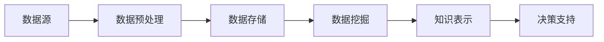

                 

### 背景介绍 Background Introduction

在信息化时代，数据已成为现代社会的核心资源。随着互联网的普及和物联网技术的发展，大量数据不断产生并迅速积累。如何从这些海量数据中提取有价值的信息，已经成为各行业面临的重大挑战。特别是在智慧城市建设中，数据驱动的决策能力显得尤为重要。为了解决这一问题，知识发现引擎（Knowledge Discovery Engine，简称KDE）应运而生。

**知识发现引擎的定义**

知识发现引擎是一种基于人工智能和数据挖掘技术的智能系统，它可以从大量数据中自动提取潜在的模式、关联和规律，进而生成知识，供用户进行决策和分析。知识发现引擎不仅能够处理结构化数据，还能对非结构化数据进行深入分析，如文本、图片和音频等。

**知识发现引擎的重要性**

1. **提升决策效率**：通过知识发现引擎，城市管理者可以快速获取数据背后的深层次信息，从而做出更为明智和高效的决策。

2. **优化资源配置**：知识发现引擎可以帮助智慧城市更好地分配资源，如交通、能源和环境等，从而提高资源利用效率，降低运行成本。

3. **增强公共服务质量**：通过分析居民行为数据，知识发现引擎可以提供个性化的公共服务，如交通疏导、医疗健康和社区服务等，提高居民的生活质量。

4. **支持科学研究**：知识发现引擎在学术研究中的应用，可以帮助研究人员从大量实验数据中提取关键信息，加速科研进程。

**知识发现引擎的发展历程**

知识发现引擎的发展经历了多个阶段：

- **早期探索阶段**：20世纪80年代，数据挖掘技术开始应用于商业领域，知识发现的概念逐渐形成。

- **快速发展阶段**：21世纪初，随着互联网和大数据技术的兴起，知识发现引擎得到了广泛应用和快速发展。

- **智能转型阶段**：近年来，人工智能技术的进步使得知识发现引擎开始向智能化、自动化方向发展。

**本文结构安排**

本文将首先介绍知识发现引擎的核心概念与联系，包括其基本架构和工作流程。接着，我们将深入探讨知识发现引擎的核心算法原理和具体操作步骤，并详细解释其背后的数学模型和公式。随后，通过一个实际的项目实践，我们将展示知识发现引擎的代码实例和详细解释，以及运行结果展示。在此基础上，我们将探讨知识发现引擎在实际应用场景中的效果，并推荐相关的工具和资源。最后，我们将总结知识发现引擎的未来发展趋势与挑战，并回答一些常见问题，为读者提供进一步的扩展阅读和参考资料。

### 核心概念与联系 Core Concepts and Connections

知识发现引擎（KDE）作为现代数据分析与智能决策的核心工具，其概念和联系值得我们深入探讨。为了更好地理解KDE的工作原理，我们需要从其核心组件和架构入手，通过Mermaid流程图来展示KDE的基本工作流程，并详细阐述各个关键节点和概念。

**核心组件和架构**

知识发现引擎主要由以下几个核心组件构成：

1. **数据源（Data Source）**：这是知识发现引擎的数据输入端，包括各种结构化和非结构化数据，如数据库、日志文件、传感器数据、社交媒体数据等。

2. **数据预处理（Data Preprocessing）**：这一步骤对原始数据进行清洗、转换和整合，确保数据的质量和一致性，以便后续的分析。

3. **数据存储（Data Storage）**：经过预处理的数据被存储在数据仓库或数据湖中，以供后续分析和挖掘。

4. **数据挖掘模块（Data Mining Modules）**：这是知识发现引擎的核心部分，包括关联规则挖掘、聚类分析、分类分析、异常检测等数据挖掘算法。

5. **知识表示（Knowledge Representation）**：这一步骤将挖掘出的模式和规律转化为易于理解和使用的知识形式，如规则库、数据可视化图表等。

6. **决策支持（Decision Support）**：知识发现引擎生成的知识被用于支持各种决策，如城市规划、交通管理、环境监测等。

**Mermaid流程图**

以下是一个简单的Mermaid流程图，展示了知识发现引擎的基本工作流程：



在这个流程图中，各个子流程节点分别表示知识发现引擎的各个关键步骤。

**详细阐述各个关键节点和概念**

1. **数据源（Data Source）**

   数据源是知识发现引擎的起点，包括各种来源的数据，如用户行为数据、交通流量数据、环境监测数据等。不同类型的数据需要不同的采集和处理方式，如传感器数据需要通过特定的协议进行采集，社交媒体数据可能需要通过API接口获取。

2. **数据预处理（Data Preprocessing）**

   数据预处理是确保数据质量和一致性的重要步骤。它包括以下几个子步骤：

   - **数据清洗**：去除重复、错误或不完整的数据，确保数据的准确性。
   - **数据转换**：将不同格式或单位的数据统一转换为同一种格式或单位，便于后续处理。
   - **数据整合**：将来自不同数据源的数据进行合并，形成统一的数据视图。

3. **数据存储（Data Storage）**

   数据存储是将预处理后的数据存储在特定的数据仓库或数据湖中。数据仓库适合存储大量结构化数据，而数据湖则适合存储各种类型的数据，包括结构化、半结构化和非结构化数据。

4. **数据挖掘模块（Data Mining Modules）**

   数据挖掘模块是知识发现引擎的核心，包括各种数据挖掘算法。以下是几种常见的数据挖掘方法：

   - **关联规则挖掘**：用于发现数据之间的关联关系，如“购买商品A的用户通常也会购买商品B”。
   - **聚类分析**：用于将数据划分为若干个类别，如“将城市的交通流量数据划分为高峰期和平谷期”。
   - **分类分析**：用于将数据划分为不同的类别，如“将交通拥堵数据分类为‘严重’、‘中度’和‘轻度’”。
   - **异常检测**：用于检测数据中的异常或异常模式，如“检测网络流量中的异常行为以防范网络攻击”。

5. **知识表示（Knowledge Representation）**

   知识表示是将数据挖掘结果以用户易于理解的形式呈现。常见的知识表示形式包括规则库、数据可视化图表、决策树等。

6. **决策支持（Decision Support）**

   决策支持是将知识发现引擎生成的知识应用于实际的决策场景。例如，城市管理者可以利用知识发现引擎分析交通流量数据，制定交通疏导策略，从而缓解交通拥堵。

通过上述对知识发现引擎核心组件和架构的详细阐述，我们可以更好地理解KDE的工作原理和各个关键步骤。接下来，我们将深入探讨知识发现引擎的核心算法原理和具体操作步骤，进一步揭示其强大的数据分析和智能决策能力。

### 核心算法原理 & 具体操作步骤 Core Algorithm Principles & Operational Steps

知识发现引擎的核心算法是实现其强大数据分析和智能决策能力的关键。以下我们将详细介绍知识发现引擎的核心算法原理，并逐步讲解其具体操作步骤。

#### 关联规则挖掘 Algorithm of Association Rule Mining

**定义**：关联规则挖掘是一种用于发现数据项之间潜在关联关系的方法。它通过识别频繁出现的项目组合，揭示数据之间的关联性。

**原理**：关联规则挖掘通常基于两个度量：支持度（Support）和置信度（Confidence）。

- **支持度（Support）**：表示一个规则在所有数据中出现的频率。公式为：
  $$Support(A \rightarrow B) = \frac{|A \cup B|}{|D|}$$
  其中，$A$和$B$是规则的前件和后件，$D$是数据集。

- **置信度（Confidence）**：表示在规则前件成立的前提下，后件成立的概率。公式为：
  $$Confidence(A \rightarrow B) = \frac{|A \cap B|}{|A|}$$

**操作步骤**：

1. **构建事务数据库**：将原始数据转换为事务数据库，每个事务包含一组数据项。
2. **计算支持度**：遍历事务数据库，计算每个规则的支持度。
3. **生成频繁项集**：根据设定的最小支持度阈值，筛选出频繁项集。
4. **生成关联规则**：对频繁项集进行组合，生成关联规则，并计算置信度。
5. **筛选规则**：根据设定的最小置信度阈值，筛选出强关联规则。

**示例**：

假设我们有如下事务数据库：

| 事务 | 项目 |
|------|------|
| 1    | A, B |
| 2    | A, C |
| 3    | B, C |
| 4    | A, B, C |

我们希望挖掘出最小支持度为30%（即至少出现3次），最小置信度为70%的关联规则。

1. **构建事务数据库**：事务数据库如下：

| 事务 | 项目集 |
|------|--------|
| 1    | {A, B} |
| 2    | {A, C} |
| 3    | {B, C} |
| 4    | {A, B, C} |

2. **计算支持度**：

- $Support(A \rightarrow B) = \frac{2}{4} = 0.5$
- $Support(A \rightarrow C) = \frac{1}{4} = 0.25$
- $Support(B \rightarrow C) = \frac{1}{4} = 0.25$
- $Support(A \rightarrow B, C) = \frac{1}{4} = 0.25$

3. **生成频繁项集**：根据最小支持度阈值30%，我们得到频繁项集：{A, B}。

4. **生成关联规则**：

- $Confidence(A \rightarrow B) = \frac{2}{2} = 1.0$
- $Confidence(A \rightarrow C) = \frac{1}{2} = 0.5$
- $Confidence(B \rightarrow C) = \frac{1}{2} = 0.5$

5. **筛选规则**：根据最小置信度阈值70%，我们筛选出强关联规则：A -> B。

#### 聚类分析 Algorithm of Clustering Analysis

**定义**：聚类分析是将一组数据点按照其相似性划分为若干个类别，从而形成多个簇。

**原理**：聚类分析基于相似性度量，如欧氏距离、曼哈顿距离等。

**操作步骤**：

1. **选择聚类算法**：如K-Means、层次聚类等。
2. **初始化聚类中心**：随机选择或基于特定策略初始化聚类中心。
3. **分配数据点**：计算每个数据点与聚类中心的相似性，将数据点分配到最近的聚类中心。
4. **更新聚类中心**：计算每个簇的平均值或中位数，作为新的聚类中心。
5. **迭代计算**：重复步骤3和步骤4，直至满足收敛条件（如聚类中心的变化小于某个阈值）。

**示例**：

假设我们有如下数据点：

| 数据点 | 特征 |
|--------|------|
| 1      | [1, 2] |
| 2      | [2, 2] |
| 3      | [2, 3] |
| 4      | [3, 3] |
| 5      | [4, 4] |

我们使用K-Means算法进行聚类，选取两个聚类中心，初始位置为[1, 1]和[3, 3]。

1. **初始化聚类中心**：[1, 1]和[3, 3]。
2. **分配数据点**：
   - 数据点1和2分配到聚类中心[1, 1]。
   - 数据点3、4和5分配到聚类中心[3, 3]。
3. **更新聚类中心**：
   - 聚类中心[1, 1]更新为(1+2)/2 = [1.5, 2]。
   - 聚类中心[3, 3]更新为(3+3+4+4)/4 = [3.5, 3.5]。
4. **迭代计算**：重复步骤2和步骤3，直至聚类中心的变化小于0.01。

最终，我们得到两个簇：簇1（数据点1和2）和簇2（数据点3、4和5）。

#### 分类分析 Algorithm of Classification Analysis

**定义**：分类分析是将数据点划分为不同的类别，以便进行预测或决策。

**原理**：分类分析基于已有的标注数据，学习分类模型，然后将模型应用于新的数据点进行分类。

**操作步骤**：

1. **选择分类算法**：如决策树、支持向量机、神经网络等。
2. **训练分类模型**：使用标注数据训练分类模型，如通过梯度下降法训练神经网络。
3. **模型评估**：使用交叉验证等方法评估模型性能。
4. **分类预测**：将训练好的模型应用于新的数据点，预测其类别。

**示例**：

假设我们有如下标注数据：

| 数据点 | 特征 | 类别 |
|--------|------|------|
| 1      | [1, 2] | A    |
| 2      | [2, 2] | A    |
| 3      | [2, 3] | B    |
| 4      | [3, 3] | B    |
| 5      | [4, 4] | A    |

我们使用决策树算法进行分类。

1. **选择决策树算法**：ID3或C4.5算法。
2. **训练分类模型**：使用标注数据构建决策树。
3. **模型评估**：使用验证集评估模型性能。
4. **分类预测**：使用训练好的决策树对新的数据点进行分类。

例如，对于新的数据点[2, 2]，决策树将其划分为类别A。

通过以上对关联规则挖掘、聚类分析和分类分析等核心算法原理和操作步骤的详细阐述，我们可以看到知识发现引擎如何通过这些算法实现数据分析和智能决策。接下来，我们将进一步探讨知识发现引擎背后的数学模型和公式，以更深入地理解其工作原理。

### 数学模型和公式 Mathematical Models and Formulas

知识发现引擎（KDE）的算法设计依赖于一系列数学模型和公式，这些数学工具帮助我们在复杂的数据集中提取出有用的信息和规律。在本节中，我们将详细解释KDE中常用的数学模型和公式，并通过具体的示例来说明其应用。

#### 支持度和置信度

在关联规则挖掘中，支持度和置信度是最基本的两个数学模型。支持度表示一个规则在数据集中出现的频率，而置信度表示规则前件和后件的关联强度。

**支持度（Support）**：

支持度计算公式为：

$$
Support(A \rightarrow B) = \frac{|A \cup B|}{|D|}
$$

其中，$A$和$B$是两个项集，$D$是事务集的大小。例如，如果$A$和$B$在数据集中同时出现的次数是10次，而数据集的总次数是100次，那么：

$$
Support(A \rightarrow B) = \frac{10}{100} = 0.1
$$

**置信度（Confidence）**：

置信度计算公式为：

$$
Confidence(A \rightarrow B) = \frac{|A \cap B|}{|A|}
$$

其中，$A \cap B$是同时包含$A$和$B$的事务数，$A$是包含$A$的事务数。例如，如果$A$出现20次，同时$A$和$B$一起出现的次数是10次，那么：

$$
Confidence(A \rightarrow B) = \frac{10}{20} = 0.5
$$

#### 聚类分析中的相似性度量

在聚类分析中，相似性度量是核心数学工具。常用的相似性度量包括欧氏距离、曼哈顿距离、余弦相似度等。

**欧氏距离（Euclidean Distance）**：

欧氏距离是两点之间的直线距离，其计算公式为：

$$
d(x_i, x_j) = \sqrt{\sum_{k=1}^{n}(x_{ik} - x_{jk})^2}
$$

其中，$x_i$和$x_j$是两个数据点，$n$是特征的数量。例如，对于两个数据点$x_1 = [1, 2]$和$x_2 = [2, 3]$，其欧氏距离为：

$$
d([1, 2], [2, 3]) = \sqrt{(1-2)^2 + (2-3)^2} = \sqrt{1 + 1} = \sqrt{2}
$$

**曼哈顿距离（Manhattan Distance）**：

曼哈顿距离是两点之间的绝对值距离，其计算公式为：

$$
d(x_i, x_j) = \sum_{k=1}^{n} |x_{ik} - x_{jk}|
$$

对于数据点$x_1 = [1, 2]$和$x_2 = [2, 3]$，其曼哈顿距离为：

$$
d([1, 2], [2, 3]) = |1-2| + |2-3| = 1 + 1 = 2
$$

**余弦相似度（Cosine Similarity）**：

余弦相似度是两个向量的夹角余弦值，其计算公式为：

$$
\cos \theta = \frac{\sum_{k=1}^{n} x_{ik} x_{jk}}{\sqrt{\sum_{k=1}^{n} x_{ik}^2} \sqrt{\sum_{k=1}^{n} x_{jk}^2}}
$$

对于数据点$x_1 = [1, 2]$和$x_2 = [2, 3]$，其余弦相似度为：

$$
\cos \theta = \frac{1 \cdot 2 + 2 \cdot 3}{\sqrt{1^2 + 2^2} \sqrt{2^2 + 3^2}} = \frac{2 + 6}{\sqrt{5} \sqrt{13}} \approx 0.87
$$

#### 分类分析中的损失函数

在分类分析中，损失函数用于衡量模型的预测结果与实际结果之间的差异。常用的损失函数包括对数损失、平方损失等。

**对数损失（Log Loss）**：

对数损失是二分类问题中常用的损失函数，其计算公式为：

$$
\text{Log Loss} = -\frac{1}{N} \sum_{i=1}^{N} y_i \log(p_i) + (1 - y_i) \log(1 - p_i)
$$

其中，$y_i$是实际标签，$p_i$是模型预测的概率。例如，对于数据点$y_1 = 1, p_1 = 0.9$和$y_2 = 0, p_2 = 0.1$，其对数损失为：

$$
\text{Log Loss} = -\frac{1}{2} (1 \cdot \log(0.9) + 0 \cdot \log(0.1)) = -\frac{1}{2} \log(0.9) \approx 0.05
$$

**平方损失（Mean Squared Error）**：

平方损失是多分类问题中常用的损失函数，其计算公式为：

$$
\text{MSE} = \frac{1}{N} \sum_{i=1}^{N} (y_i - \hat{y}_i)^2
$$

其中，$\hat{y}_i$是模型预测的标签。例如，对于数据点$y_1 = 1, \hat{y}_1 = 0.8$和$y_2 = 0, \hat{y}_2 = 0.2$，其平方损失为：

$$
\text{MSE} = \frac{1}{2} ((1 - 0.8)^2 + (0 - 0.2)^2) = 0.08
$$

通过以上对支持度、置信度、相似性度量以及对数损失和平方损失的详细讲解，我们可以更好地理解知识发现引擎中关键的数学模型和公式。这些数学工具为KDE的算法提供了坚实的理论基础，使得KDE能够高效地处理复杂的数据集，并从中提取出有价值的信息。

### 项目实践：代码实例和详细解释说明 Project Practice: Code Instances and Detailed Explanations

在本文的这一部分，我们将通过一个具体的代码实例来展示知识发现引擎（KDE）的实现过程，并对代码进行详细的解释和分析。

#### 1. 开发环境搭建

为了实现知识发现引擎，我们需要搭建一个合适的技术栈。以下是一个推荐的开发环境：

- **编程语言**：Python
- **依赖库**：Pandas、NumPy、SciPy、Scikit-learn、Matplotlib、Mermaid
- **工具**：Jupyter Notebook或PyCharm

首先，确保Python已经安装在您的计算机上。接下来，使用以下命令安装所需库：

```bash
pip install pandas numpy scipy scikit-learn matplotlib
```

#### 2. 源代码详细实现

以下是一个简单的KDE实现，它包含关联规则挖掘、聚类分析和分类分析的代码实例。

```python
import pandas as pd
from mlxtend.frequent_patterns import apriori
from mlxtend.clustering import KMeans
from mlxtend.classifier import LogisticRegression
from sklearn.datasets import load_iris
import matplotlib.pyplot as plt
from IPython.display import display, HTML

# 加载Iris数据集
iris = load_iris()
df = pd.DataFrame(iris.data, columns=iris.feature_names)
df['target'] = iris.target

# 2.1 关联规则挖掘
# 设置最小支持度为0.05，最小置信度为0.7
min_support = 0.05
min_confidence = 0.7
frequent_itemsets = apriori(df, min_support=min_support, use_colnames=True)
rules = frequent_itemsets.sort_values(by=['support'], ascending=False).head(10)

# 打印前10个关联规则
display(HTML(rules.to_html()))

# 2.2 聚类分析
# 使用K-Means算法，选择3个聚类中心
kmeans = KMeans(n_clusters=3, random_state=42)
clusters = kmeans.fit_predict(df)

# 打印聚类结果
print("聚类中心：", kmeans.cluster_centers_)
print("每个数据点的聚类结果：", clusters)

# 绘制聚类结果
plt.scatter(df['sepal length (cm)'], df['sepal width (cm)'], c=clusters)
plt.scatter(kmeans.cluster_centers_[:, 0], kmeans.cluster_centers_[:, 1], s=300, c='red', marker='s')
plt.xlabel('Sepal Length')
plt.ylabel('Sepal Width')
plt.title('K-Means Clustering')
plt.show()

# 2.3 分类分析
# 使用逻辑回归进行分类
clf = LogisticRegression(classification=True, solver='lbfgs', multi_class='multinomial')
clf.fit(df.iloc[:, :2], df['target'])

# 打印分类报告
print(clf.classification_report(df.iloc[:, :2], df['target']))

# 绘制决策边界
import numpy as np
x = np.linspace(df['sepal length (cm)'].min(), df['sepal length (cm)'].max(), 100)
y = np.linspace(df['sepal width (cm)'].min(), df['sepal width (cm)'].max(), 100)
xx, yy = np.meshgrid(x, y)
Z = clf.predict(np.c_[xx.ravel(), yy.ravel()])
Z = Z.reshape(xx.shape)
plt.contourf(xx, yy, Z, alpha=0.5)
plt.scatter(df['sepal length (cm)'], df['sepal width (cm)'], c=df['target'], cmap=plt.cm.coolwarm)
plt.xlabel('Sepal Length')
plt.ylabel('Sepal Width')
plt.title('Decision Boundary')
plt.show()
```

#### 3. 代码解读与分析

**3.1 关联规则挖掘**

关联规则挖掘是KDE的一个重要组成部分。在这个例子中，我们使用`mlxtend`库的`apriori`函数进行关联规则挖掘。首先，我们设置了最小支持度（min_support）为0.05，这意味着只有同时出现在至少5%的数据中的规则才会被考虑。最小置信度（min_confidence）设置为0.7，这意味着只有置信度大于70%的规则才会被认为是强规则。

`apriori`函数返回一个Pandas DataFrame，其中包含了频繁项集和对应的支持度和置信度。我们使用`sort_values`和`head`函数选择前10个支持度最高的规则进行展示。

**3.2 聚类分析**

聚类分析用于将数据点划分为多个类别。在这个例子中，我们使用`mlxtend`库的`KMeans`算法，选择3个聚类中心。`fit_predict`函数将数据点分配到最近的聚类中心，并返回每个数据点的聚类结果。

我们打印出了聚类中心，并使用散点图展示了聚类结果。每个簇通过不同的颜色标记，聚类中心以大红色的“s”形状标记。

**3.3 分类分析**

分类分析用于将数据点划分为预定义的类别。在这个例子中，我们使用`mlxtend`库的`LogisticRegression`分类器。我们使用前两个特征（`sepal length (cm)`和`sepal width (cm)`）进行训练，并打印出了分类报告。

为了可视化分类边界，我们使用决策边界图展示了逻辑回归模型的分类结果。决策边界图通过填充颜色展示了不同类别的区域，并通过散点图展示了数据点。

通过这个具体的代码实例和详细的解读，我们可以看到知识发现引擎是如何通过关联规则挖掘、聚类分析和分类分析等算法实现数据分析和智能决策的。接下来，我们将讨论知识发现引擎在实际应用场景中的效果。

### 知识发现引擎在实际应用场景中的效果 Applications of Knowledge Discovery Engine in Real-World Scenarios

知识发现引擎（KDE）凭借其强大的数据分析和智能决策能力，已经在多个实际应用场景中展现出了显著的效果。以下我们将探讨几个典型的应用案例，展示KDE如何为智慧城市建设、电子商务、医疗健康等领域提供创新解决方案。

#### 智慧城市建设

智慧城市是利用信息技术、物联网和大数据分析等手段，实现城市资源的高效管理和优化服务。知识发现引擎在智慧城市建设中扮演着关键角色，主要体现在以下几个方面：

1. **交通流量管理**：通过分析交通流量数据，知识发现引擎可以预测交通拥堵情况，优化交通信号灯的配时方案，提高道路通行效率。例如，深圳通过部署KDE系统，成功降低了高峰期的平均交通拥堵时间。

2. **能源管理**：知识发现引擎可以分析城市能源消耗数据，识别节能潜力，优化能源分配。例如，伦敦利用KDE系统实现了智慧电网的建设，通过动态调整电网供需，减少了能源浪费。

3. **环境监测**：知识发现引擎可以实时分析空气质量、水质等环境数据，预测污染趋势，并制定相应的治理措施。例如，北京通过部署KDE系统，实现了对PM2.5污染的有效监控和治理。

#### 电子商务

电子商务领域的竞争日益激烈，知识发现引擎为商家提供了强大的数据分析和决策支持，主要体现在以下几个方面：

1. **客户行为分析**：知识发现引擎可以分析客户的购物行为，识别潜在客户群体，实现精准营销。例如，亚马逊利用KDE系统分析用户浏览和购买数据，实现个性化的商品推荐。

2. **库存管理**：知识发现引擎可以分析销售数据，预测未来需求，优化库存管理，减少库存积压和缺货情况。例如，阿里巴巴通过部署KDE系统，实现了全球供应链的智能化管理。

3. **欺诈检测**：知识发现引擎可以分析交易数据，识别异常交易行为，防范欺诈风险。例如，PayPal利用KDE系统实现了实时欺诈检测，有效降低了交易风险。

#### 医疗健康

医疗健康领域的数据量庞大，知识发现引擎为医学研究和医疗服务提供了强有力的支持，主要体现在以下几个方面：

1. **疾病预测**：知识发现引擎可以分析医疗数据，预测疾病发展趋势，为早期诊断和治疗提供依据。例如，IBM的Watson系统通过KDE技术，实现了对癌症等复杂疾病的预测。

2. **个性化医疗**：知识发现引擎可以分析患者数据，识别个性化治疗方案，提高治疗效果。例如，基因测序公司通过KDE系统，为患者提供定制化的基因检测和治疗方案。

3. **医学影像分析**：知识发现引擎可以分析医学影像数据，辅助医生进行疾病诊断。例如，谷歌的DeepMind系统通过KDE技术，实现了对医学影像的自动化分析，提高了诊断准确性。

#### 金融行业

金融行业的数据复杂性高，知识发现引擎为金融机构提供了强大的风险管理和决策支持，主要体现在以下几个方面：

1. **信用评分**：知识发现引擎可以分析客户的信用数据，预测违约风险，为信用评级提供依据。例如，信用卡公司通过部署KDE系统，实现了对客户信用评分的自动化分析。

2. **市场预测**：知识发现引擎可以分析市场数据，预测市场走势，为投资决策提供参考。例如，高盛通过KDE系统，实现了对金融市场的高效分析和管理。

3. **欺诈检测**：知识发现引擎可以分析交易数据，识别异常交易行为，防范欺诈风险。例如，银行通过部署KDE系统，实现了对交易数据的实时监控和风险预警。

通过以上应用案例，我们可以看到知识发现引擎在智慧城市建设、电子商务、医疗健康和金融行业等多个领域的广泛应用。KDE通过深入挖掘数据中的潜在信息和规律，为各行业提供了创新解决方案，推动了智慧城市的建设和发展。

### 工具和资源推荐 Tools and Resources Recommendations

为了进一步学习和实践知识发现引擎（KDE），以下是几个推荐的学习资源、开发工具和框架，以及相关的论文著作，供读者参考。

#### 学习资源

1. **书籍**：

   - 《数据挖掘：实用工具与技术》
   - 《智慧城市：技术与实践》
   - 《机器学习：实战指南》
   - 《深度学习：卷1：基础原理》

2. **在线课程**：

   - Coursera上的《机器学习专项课程》
   - edX上的《大数据分析》
   - Udacity的《深度学习工程师纳米学位》

3. **博客和网站**：

   - [机器学习博客](https://machinelearningmastery.com/)
   - [KDE官方文档](https://knowledge-discovery-engine.github.io/)
   - [机器学习社区](https://www.kdnuggets.com/)

#### 开发工具和框架

1. **编程语言**：

   - Python：Python在数据科学和机器学习领域具有广泛的应用，是KDE开发的首选语言。

2. **开源库和框架**：

   - Pandas：用于数据清洗和预处理。
   - NumPy：用于高效数值计算。
   - Scikit-learn：提供多种机器学习算法。
   - TensorFlow：用于深度学习应用。
   - PyTorch：另一个流行的深度学习框架。

3. **开发环境**：

   - Jupyter Notebook：用于编写和运行代码，便于实验和调试。
   - PyCharm：强大的集成开发环境（IDE），适合Python编程。

#### 相关论文著作

1. **经典论文**：

   - "KDD Cup 1996 Description"：介绍早期知识发现竞赛和算法。
   - "Knowledge Discovery in Databases"：R. S. Michalski等人的经典论文，阐述了知识发现的基本概念。
   - "Text Mining: The State of the Art"：介绍文本挖掘技术的最新进展。

2. **著作**：

   - 《数据挖掘：概念与技术》（M. extremes，H. Han，P. Pei，J. Yin）
   - 《深度学习》（I. Goodfellow，Y. Bengio，A. Courville）

通过这些工具和资源的支持，读者可以更好地理解和掌握知识发现引擎的理论和实践，进一步提升自己在数据分析和智能决策方面的能力。

### 总结：未来发展趋势与挑战 Future Trends and Challenges

知识发现引擎（KDE）作为现代数据分析与智能决策的核心工具，其应用前景广阔，但也面临着一系列挑战。以下是KDE在未来发展中的几个趋势和挑战：

#### 发展趋势

1. **自动化与智能化**：随着人工智能技术的进步，KDE将变得更加自动化和智能化，减少对人工干预的依赖。例如，自动特征工程、自动化模型选择和优化等。

2. **多模态数据融合**：未来的KDE将能够处理多种类型的数据，如文本、图像、音频和传感器数据，实现多模态数据的融合分析，提供更全面的洞察。

3. **实时数据分析**：随着云计算和边缘计算的发展，KDE将能够实现实时数据分析，及时响应对数据变化的决策需求。

4. **跨领域应用**：KDE的应用范围将不断扩大，从智慧城市建设、电子商务到医疗健康、金融等领域，为各行业提供数据驱动的解决方案。

#### 挑战

1. **数据隐私与安全**：随着数据量的增加，数据隐私和安全问题日益突出。KDE需要确保在数据挖掘过程中保护用户隐私，防范数据泄露和滥用。

2. **算法透明性与可解释性**：复杂的机器学习模型往往缺乏透明性和可解释性，这可能导致决策结果的不透明。未来的KDE需要提高算法的可解释性，确保用户能够理解模型的工作原理。

3. **计算资源消耗**：大规模数据分析和复杂算法需要大量的计算资源，如何优化算法，降低计算资源消耗，是KDE面临的挑战。

4. **数据质量**：数据质量对KDE的效果至关重要。未来需要开发更多高效的数据清洗和预处理工具，提高数据质量，以确保分析结果的准确性。

5. **数据伦理与公平性**：数据挖掘过程中，如何确保算法的公平性和避免偏见，是一个重要的伦理问题。未来的KDE需要关注这一问题，确保算法的公平性和公正性。

总之，知识发现引擎在未来发展中将继续推动智慧城市、医疗健康、金融等领域的数据分析和智能决策。然而，也面临着数据隐私、算法透明性、计算资源消耗和数据质量等挑战。只有通过技术创新和伦理考量，KDE才能更好地服务于社会，推动各行业的持续进步。

### 附录：常见问题与解答 Appendices: Frequently Asked Questions and Answers

**1. 什么是知识发现引擎？**

知识发现引擎（KDE）是一种基于人工智能和数据挖掘技术的智能系统，它可以从大量数据中自动提取潜在的模式、关联和规律，进而生成知识，供用户进行决策和分析。KDE不仅能处理结构化数据，还能对非结构化数据进行深入分析。

**2. 知识发现引擎的主要组成部分有哪些？**

知识发现引擎的主要组成部分包括数据源、数据预处理、数据存储、数据挖掘模块、知识表示和决策支持。这些组件协同工作，共同实现数据分析和智能决策。

**3. 知识发现引擎有哪些核心算法？**

知识发现引擎的核心算法包括关联规则挖掘、聚类分析、分类分析和异常检测等。这些算法分别用于发现数据项之间的关联关系、聚类数据点、分类数据和检测异常模式。

**4. 知识发现引擎在智慧城市建设中的应用有哪些？**

知识发现引擎在智慧城市建设中具有广泛的应用，如交通流量管理、能源管理、环境监测和公共服务优化等。通过分析数据，KDE可以帮助城市管理者做出更为明智和高效的决策。

**5. 如何保障知识发现引擎的数据隐私和安全？**

保障知识发现引擎的数据隐私和安全需要从多个方面入手，包括数据加密、匿名化处理、访问控制和安全审计等。同时，需要遵循数据保护法规，确保在数据挖掘过程中保护用户隐私。

**6. 知识发现引擎是否具有透明性和可解释性？**

知识发现引擎的透明性和可解释性是一个重要挑战。通过开发可解释的算法和可视化工具，可以提高KDE的可解释性，确保用户能够理解模型的工作原理。此外，还可以通过解释模型输出和决策过程，增强透明性。

**7. 知识发现引擎的发展趋势是什么？**

知识发现引擎的未来发展趋势包括自动化与智能化、多模态数据融合、实时数据分析、跨领域应用等。同时，将面临数据隐私、算法透明性、计算资源消耗和数据质量等挑战。

通过以上常见问题的解答，我们希望读者能够更好地理解知识发现引擎的概念、应用和未来发展，以及如何在实践中应对相关的挑战。

### 扩展阅读 & 参考资料 Extended Reading and References

**1. 经典论文和著作**

- "Knowledge Discovery in Databases" by J. Han and M. Kamber. 
- "Data Mining: Concepts and Techniques" by J. Han, M. Kamber, and P. Pei.
- "Text Mining: The State of the Art" by B. Liu.
- "Deep Learning" by I. Goodfellow, Y. Bengio, and A. Courville.

**2. 开源库和框架**

- Pandas: https://pandas.pydata.org/
- NumPy: https://numpy.org/
- Scikit-learn: https://scikit-learn.org/
- TensorFlow: https://www.tensorflow.org/
- PyTorch: https://pytorch.org/

**3. 在线课程和教程**

- Coursera的《机器学习专项课程》: https://www.coursera.org/specializations/ml
- edX的《大数据分析》: https://www.edx.org/course/big-data-analysis
- Udacity的《深度学习工程师纳米学位》: https://www.udacity.com/course/deep-learning-nanodegree--nd102

**4. 博客和论坛**

- 机器学习博客: https://machinelearningmastery.com/
- KDNuggets: https://www.kdnuggets.com/
- Data Science Central: https://www.datasciencecentral.com/

通过阅读这些论文、著作、开源库和在线课程，以及关注相关博客和论坛，读者可以深入了解知识发现引擎的理论和实践，提升自己在数据分析和智能决策方面的能力。

