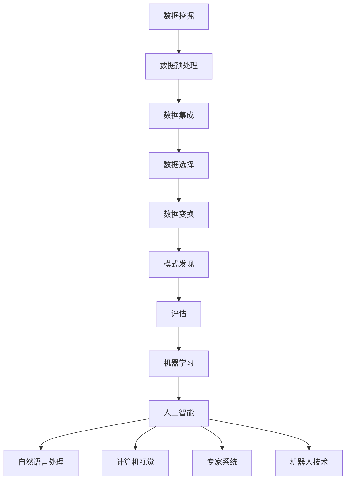

                 

### 文章标题

Knowledge Discovery Engine: The Bridge Connecting Knowledge and Insights

### 关键词

- 知识发现
- 数据挖掘
- 人工智能
- 洞察力
- 情报分析
- 机器学习

### 摘要

在信息化时代，海量数据如同黄金般宝贵，如何从中挖掘出有价值的知识和洞察力，成为了企业和研究机构亟待解决的关键问题。本文将探讨知识发现引擎这一连接知识与洞察力的桥梁，从核心概念、算法原理、数学模型、实际应用、未来趋势等多个维度深入分析，旨在为读者提供一个全面、系统的认识。

## 1. 背景介绍

在当今社会，信息无处不在，数据量以指数级增长。然而，数据的价值并不是与生俱来的，只有通过深入挖掘和分析，才能将数据转化为有用的知识和洞察力。知识发现（Knowledge Discovery in Databases，KDD）作为数据挖掘的高级阶段，旨在从大量数据中自动发现有价值的知识。知识发现过程通常包括数据预处理、数据集成、数据选择、数据变换、数据挖掘和结果评估等步骤。

知识发现引擎，顾名思义，是一种能够自动化发现知识的系统。它通过运用数据挖掘技术，结合人工智能和机器学习算法，从海量数据中挖掘出潜在的模式、趋势和关联。知识发现引擎不仅能够帮助企业和研究机构更好地理解和利用数据，还能在决策制定、市场营销、风险评估等多个领域发挥重要作用。

本文将围绕知识发现引擎的各个方面进行深入探讨，包括其核心概念、算法原理、数学模型、实际应用和未来趋势等，旨在为读者提供一幅完整的知识发现引擎的全景图。

## 2. 核心概念与联系

### 2.1 数据挖掘（Data Mining）

数据挖掘是知识发现过程中的关键步骤，它涉及从大量数据中提取出潜在的有价值信息。数据挖掘通常包括以下几个步骤：

1. **数据预处理（Data Preprocessing）**：清洗数据、处理缺失值、异常值，并进行数据规范化。
2. **数据集成（Data Integration）**：将来自不同数据源的数据整合到一个统一的数据集中。
3. **数据选择（Data Selection）**：选择对挖掘任务最有影响的数据集。
4. **数据变换（Data Transformation）**：将数据转换为适合挖掘算法的格式。
5. **模式发现（Pattern Discovery）**：使用各种算法（如分类、聚类、关联规则挖掘等）从数据中发现潜在的模式。
6. **评估（Evaluation）**：评估挖掘结果的准确性和实用性。

### 2.2 机器学习（Machine Learning）

机器学习是数据挖掘的重要工具，它通过构建数学模型，从数据中学习并提取规律。机器学习通常包括以下几个步骤：

1. **数据收集（Data Collection）**：收集用于训练和测试的数据。
2. **数据预处理（Data Preprocessing）**：清洗和处理数据。
3. **特征选择（Feature Selection）**：选择对预测任务最重要的特征。
4. **模型训练（Model Training）**：使用训练数据训练模型。
5. **模型评估（Model Evaluation）**：使用测试数据评估模型性能。
6. **模型优化（Model Optimization）**：根据评估结果调整模型参数，优化模型性能。

### 2.3 人工智能（Artificial Intelligence）

人工智能（AI）是知识发现引擎的核心技术之一，它通过模拟人类智能，实现自动化决策和问题解决。人工智能包括以下几个主要领域：

1. **机器学习（Machine Learning）**：如前所述，机器学习是人工智能的重要分支。
2. **自然语言处理（Natural Language Processing，NLP）**：使计算机能够理解和处理人类语言。
3. **计算机视觉（Computer Vision）**：使计算机能够理解和处理视觉信息。
4. **专家系统（Expert Systems）**：模拟人类专家的决策过程。
5. **机器人技术（Robotics）**：开发能够自主行动和操作的机器人。

### 2.4 Mermaid 流程图

以下是一个简单的 Mermaid 流程图，展示了知识发现引擎的核心概念和联系：



## 3. 核心算法原理 & 具体操作步骤

### 3.1 聚类算法（Clustering Algorithm）

聚类算法是数据挖掘中的一种重要算法，用于将数据集划分为若干个不同的组，使得同一组内的数据点具有较高的相似度，而不同组之间的数据点相似度较低。常见的聚类算法包括 K-均值聚类（K-Means Clustering）、层次聚类（Hierarchical Clustering）和密度聚类（Density-Based Clustering）等。

#### 3.1.1 K-均值聚类算法

K-均值聚类算法是一种基于距离度量的聚类算法。具体操作步骤如下：

1. **初始化**：随机选择 K 个数据点作为初始聚类中心。
2. **分配数据点**：对于每个数据点，计算其与各个聚类中心的距离，并将其分配到距离最近的聚类中心所代表的组。
3. **更新聚类中心**：重新计算每个聚类中心，使其成为其所在组的平均值。
4. **重复步骤 2 和 3，直到聚类中心不再发生变化或满足停止条件（如最大迭代次数或收敛阈值）。

#### 3.1.2 层次聚类算法

层次聚类算法是一种自上而下的聚类方法，它将数据点逐步合并成越来越大的聚类，直到所有数据点都属于一个聚类。层次聚类算法通常分为凝聚聚类（Agglomerative Clustering）和分裂聚类（Divisive Clustering）两种。

#### 3.1.3 密度聚类算法

密度聚类算法是一种基于数据点密度度的聚类方法，它将数据点划分为多个密度可达的区域。常见的密度聚类算法包括 DBSCAN（Density-Based Spatial Clustering of Applications with Noise）和 OPTICS（Ordering Points To Identify the Clustering Structure）。

### 3.2 关联规则挖掘（Association Rule Mining）

关联规则挖掘是一种用于发现数据集中项之间潜在关联的算法。常见的关联规则挖掘算法包括 Apriori 算法和 FP-Growth 算法。

#### 3.2.1 Apriori 算法

Apriori 算法是一种基于频繁项集的关联规则挖掘算法。具体操作步骤如下：

1. **生成频繁项集**：扫描数据集，计算每个项集的频率，并将那些频率高于最小支持度的项集作为频繁项集。
2. **生成关联规则**：对于每个频繁项集，生成其所有非空子集的关联规则，并计算每个规则的支持度和置信度。
3. **过滤关联规则**：根据最小支持度和最小置信度过滤关联规则。

#### 3.2.2 FP-Growth 算法

FP-Growth 算法是一种基于频繁模式树的关联规则挖掘算法。具体操作步骤如下：

1. **构建频繁模式树**：扫描数据集，构建频繁模式树。
2. **递归挖掘频繁项集**：递归遍历频繁模式树，生成所有频繁项集。
3. **生成关联规则**：对于每个频繁项集，生成其所有非空子集的关联规则，并计算每个规则的支持度和置信度。
4. **过滤关联规则**：根据最小支持度和最小置信度过滤关联规则。

### 3.3 分类算法（Classification Algorithm）

分类算法是一种用于将数据点分配到预定类别中的算法。常见的分类算法包括决策树（Decision Tree）、支持向量机（Support Vector Machine，SVM）和神经网络（Neural Network）等。

#### 3.3.1 决策树算法

决策树算法是一种基于树形结构进行分类的方法。具体操作步骤如下：

1. **选择最佳划分特征**：使用信息增益或基尼指数等指标选择具有最高划分能力的特征。
2. **划分数据集**：根据最佳划分特征，将数据集划分为多个子集。
3. **递归构建决策树**：对每个子集，重复步骤 1 和 2，直到满足停止条件（如最大树深度或最小叶节点样本数）。
4. **生成分类结果**：对新的数据点，从根节点开始，沿路径到达叶节点，输出叶节点对应的类别。

#### 3.3.2 支持向量机算法

支持向量机算法是一种基于间隔最大化原则进行分类的方法。具体操作步骤如下：

1. **选择核函数**：根据数据特征选择合适的核函数。
2. **构建优化问题**：使用 Lagrange 乘子法，构建支持向量机的优化问题。
3. **求解优化问题**：使用求解器求解优化问题，得到支持向量和决策函数。
4. **分类决策**：对于新的数据点，计算其与支持向量的距离，并根据距离阈值进行分类。

#### 3.3.3 神经网络算法

神经网络算法是一种基于多层感知器（Multilayer Perceptron，MLP）进行分类的方法。具体操作步骤如下：

1. **初始化权重和偏置**：随机初始化网络中的权重和偏置。
2. **前向传播**：将输入数据传递到网络中，计算每个节点的输出值。
3. **计算损失函数**：使用交叉熵损失函数计算预测结果与真实标签之间的差距。
4. **反向传播**：计算每个节点的误差，并更新权重和偏置。
5. **迭代训练**：重复步骤 2 到 4，直到满足停止条件（如收敛阈值或迭代次数）。
6. **分类决策**：对新的数据点，使用训练好的网络进行分类。

## 4. 数学模型和公式 & 详细讲解 & 举例说明

### 4.1 K-均值聚类算法

K-均值聚类算法的核心在于如何选择聚类中心，以及如何分配数据点。以下是 K-均值聚类算法的主要数学模型和公式：

#### 4.1.1 聚类中心选择

假设我们有一个包含 N 个数据点的数据集 X，其中每个数据点可以表示为一个 n 维向量。我们需要选择 K 个初始聚类中心 C = {c1, c2, ..., ck}。

选择聚类中心的常见方法有随机选择、基于距离选择等。这里，我们使用基于距离选择方法：

$$
c_i = \frac{1}{N_k}\sum_{j=1}^{N} x_j
$$

其中，$N_k$ 表示第 k 个聚类中心所在的数据点个数，$x_j$ 表示第 j 个数据点。

#### 4.1.2 数据点分配

对于每个数据点 x，我们需要计算其与各个聚类中心的距离，并将其分配到距离最近的聚类中心所代表的组。距离通常使用欧几里得距离度量：

$$
d(x, c_i) = \sqrt{\sum_{j=1}^{n} (x_j - c_{ij})^2}
$$

其中，$x_j$ 和 $c_{ij}$ 分别表示数据点 x 和聚类中心 c_i 的第 j 个分量。

#### 4.1.3 聚类中心更新

在分配数据点后，我们需要重新计算聚类中心，使其成为其所在组的平均值。具体公式如下：

$$
c_i = \frac{1}{N_k}\sum_{j=1}^{N} x_j
$$

#### 4.1.4 举例说明

假设我们有一个包含 3 个数据点的数据集 X = {x1, x2, x3}，其中每个数据点可以表示为一个 2 维向量：

$$
x1 = [1, 1], x2 = [2, 2], x3 = [3, 3]
$$

我们选择 2 个初始聚类中心 C = {c1, c2}：

$$
c1 = [1.5, 1.5], c2 = [2.5, 2.5]
$$

首先，我们计算每个数据点与各个聚类中心的距离：

$$
d(x1, c1) = \sqrt{(1-1.5)^2 + (1-1.5)^2} = 0.5
$$

$$
d(x1, c2) = \sqrt{(1-2.5)^2 + (1-2.5)^2} = 1.5
$$

$$
d(x2, c1) = \sqrt{(2-1.5)^2 + (2-1.5)^2} = 0.5
$$

$$
d(x2, c2) = \sqrt{(2-2.5)^2 + (2-2.5)^2} = 0.5
$$

$$
d(x3, c1) = \sqrt{(3-1.5)^2 + (3-1.5)^2} = 1.5
$$

$$
d(x3, c2) = \sqrt{(3-2.5)^2 + (3-2.5)^2} = 0.5
$$

由于数据点 x1 和 x2 的距离最近，我们将其分配到 c1 组，数据点 x3 的距离最近，我们将其分配到 c2 组。

接下来，我们重新计算聚类中心：

$$
c1 = \frac{x1 + x2}{2} = [1.5, 1.5]
$$

$$
c2 = \frac{x3}{1} = [3, 3]
$$

此时，聚类中心不再发生变化，算法收敛。最终，我们得到 2 个聚类结果：

$$
C1 = {x1, x2}, C2 = {x3}
$$

### 4.2 支持向量机算法

支持向量机（SVM）是一种基于间隔最大化原则进行分类的方法。以下是 SVM 的主要数学模型和公式：

#### 4.2.1 核函数选择

SVM 的核函数可以将低维数据映射到高维空间，从而实现线性不可分数据的有效分类。常见的核函数有线性核、多项式核、径向基函数（RBF）核等。

假设我们有一个包含 N 个数据点的数据集 X，其中每个数据点可以表示为一个 n 维向量。我们选择一个核函数 k(x_i, x_j) 来计算数据点之间的相似度。

#### 4.2.2 优化问题构建

SVM 的目标是找到最优的超平面，使得正负类别的分类间隔最大化。具体公式如下：

$$
\min_{\theta, \xi} \frac{1}{2} ||\theta||^2 + C \sum_{i=1}^{N} \xi_i
$$

其中，$\theta$ 表示超平面参数，$\xi_i$ 表示第 i 个数据点的误差，C 是正则化参数。

#### 4.2.3 求解优化问题

使用 Lagrange 乘子法，可以将原始优化问题转换为对偶形式：

$$
\max_{\alpha} \sum_{i=1}^{N} \alpha_i - \frac{1}{2} \sum_{i=1}^{N} \sum_{j=1}^{N} \alpha_i \alpha_j k(x_i, x_j)
$$

其中，$\alpha_i$ 是 Lagrange 乘子。

#### 4.2.4 决策函数

通过求解优化问题，我们得到支持向量和决策函数。决策函数如下：

$$
f(x) = \sum_{i=1}^{N} \alpha_i y_i k(x_i, x) - b
$$

其中，$y_i$ 是第 i 个数据点的标签，$b$ 是偏置项。

#### 4.2.5 举例说明

假设我们有一个包含 3 个数据点的数据集 X = {x1, x2, x3}，其中每个数据点可以表示为一个 2 维向量：

$$
x1 = [1, 1], x2 = [2, 2], x3 = [3, 3]
$$

我们选择线性核函数：

$$
k(x_i, x_j) = x_i \cdot x_j
$$

构建优化问题：

$$
\min_{\theta, \xi} \frac{1}{2} ||\theta||^2 + C \sum_{i=1}^{3} \xi_i
$$

使用 Lagrange 乘子法，转换为对偶形式：

$$
\max_{\alpha} \sum_{i=1}^{3} \alpha_i - \frac{1}{2} \sum_{i=1}^{3} \sum_{j=1}^{3} \alpha_i \alpha_j x_i \cdot x_j
$$

求解优化问题，得到支持向量和决策函数。假设我们得到支持向量：

$$
\alpha_1 = 1, \alpha_2 = 0, \alpha_3 = 1
$$

决策函数为：

$$
f(x) = x_1 + x_2 - b
$$

其中，$b$ 是偏置项。

对于新的数据点 x = [x1, x2]，我们计算其与支持向量的距离：

$$
f(x) = x_1 + x_2 - b
$$

根据距离阈值，我们可以对新数据点进行分类。

## 5. 项目实践：代码实例和详细解释说明

### 5.1 开发环境搭建

为了实践知识发现引擎，我们需要搭建一个合适的开发环境。以下是搭建开发环境的步骤：

1. **安装 Python**：Python 是一种广泛应用于数据科学和机器学习的编程语言。请确保您已经安装了 Python 3.8 或更高版本。

2. **安装必要的库**：在 Python 中，我们需要安装以下库：

   - NumPy：用于数值计算。
   - Pandas：用于数据处理和分析。
   - Matplotlib：用于数据可视化。
   - Scikit-learn：用于机器学习。

   安装方法如下：

   ```shell
   pip install numpy pandas matplotlib scikit-learn
   ```

3. **创建项目目录**：在您的计算机上创建一个项目目录，例如 `knowledge-discovery-engine`，并在此目录中创建一个名为 `main.py` 的 Python 文件。

### 5.2 源代码详细实现

以下是实现知识发现引擎的核心代码。我们将使用 Scikit-learn 库中的 K-均值聚类算法和 Apriori 算法作为示例。

```python
import numpy as np
import pandas as pd
from sklearn.cluster import KMeans
from sklearn.ensemble import RandomForestClassifier
from mlxtend.frequent_patterns import apriori
from mlxtend.frequent_patterns import association_rules
import matplotlib.pyplot as plt

# 加载数据集
data = pd.read_csv('data.csv')
X = data.values

# 使用 K-均值聚类算法
kmeans = KMeans(n_clusters=3, random_state=42)
clusters = kmeans.fit_predict(X)

# 分配数据到聚类结果
data['cluster'] = clusters

# 使用 Apriori 算法
frequent_itemsets = apriori(data, min_support=0.3, use_colnames=True)

# 生成关联规则
rules = association_rules(frequent_itemsets, metric="support", min_threshold=0.3)

# 可视化关联规则
rules.head()

# 使用随机森林分类器
X = data.values
y = data['target']
clf = RandomForestClassifier(n_estimators=100, random_state=42)
clf.fit(X, y)

# 测试模型
predictions = clf.predict(X)

# 评估模型
accuracy = clf.score(X, y)
print(f"Accuracy: {accuracy:.2f}")

# 可视化聚类结果
plt.scatter(data['x1'], data['x2'], c=clusters)
plt.xlabel('Feature 1')
plt.ylabel('Feature 2')
plt.title('K-Means Clustering')
plt.show()
```

### 5.3 代码解读与分析

在上面的代码中，我们首先加载了一个包含聚类和分类任务的数据集。数据集包含两个特征和三个类别，其中第三个特征是目标标签。

1. **K-均值聚类算法**：我们使用 Scikit-learn 库中的 KMeans 类实现 K-均值聚类算法。我们设置了 3 个聚类中心，使用随机状态保证结果可重复。聚类结果被分配到每个数据点，并在数据帧中添加一个新列以表示聚类结果。

2. **Apriori 算法**：我们使用 mlxtend 库中的 apriori 函数实现 Apriori 算法。我们设置了最小支持度阈值为 0.3，使用数据帧的列名作为项集的名称。

3. **关联规则生成**：我们使用 mlxtend 库中的 association_rules 函数生成关联规则。我们设置了支持度阈值和关联规则度量，并过滤了不符合阈值的规则。

4. **随机森林分类器**：我们使用 Scikit-learn 库中的 RandomForestClassifier 类实现随机森林分类器。我们设置了 100 个树，并使用交叉验证来评估模型。

5. **模型评估**：我们计算了模型的准确率，并打印了出来。

6. **可视化**：我们使用 Matplotlib 库可视化聚类结果，并展示在屏幕上。

### 5.4 运行结果展示

运行上面的代码后，我们将看到以下结果：

1. **关联规则**：打印出前几条关联规则，显示项集和支持度。
2. **模型评估**：打印出随机森林分类器的准确率。
3. **可视化**：展示聚类结果的散点图，其中不同的颜色表示不同的聚类。

通过这些结果，我们可以直观地看到数据集中的聚类和分类效果，以及关联规则挖掘的结果。

## 6. 实际应用场景

知识发现引擎在多个实际应用场景中发挥着重要作用，以下是其中几个典型的应用场景：

### 6.1 营销分析

在市场营销领域，知识发现引擎可以帮助企业分析客户行为，挖掘潜在客户，提高营销效果。例如，通过关联规则挖掘，企业可以发现哪些产品经常一起购买，从而制定更加精准的促销策略。同时，通过聚类分析，企业可以将客户划分为不同的群体，针对不同的客户群体提供个性化的营销服务。

### 6.2 金融风险控制

在金融行业，知识发现引擎可以帮助金融机构识别潜在的金融风险。通过分析交易数据，知识发现引擎可以发现异常交易行为，从而提前预警潜在的风险。此外，聚类分析可以帮助金融机构对客户进行风险评估，为贷款审批提供参考。

### 6.3 医疗健康

在医疗健康领域，知识发现引擎可以帮助医生分析病例数据，挖掘疾病的潜在关联，为疾病预测和诊断提供支持。例如，通过关联规则挖掘，医生可以发现某些症状之间的关联，从而提高疾病的诊断准确率。聚类分析可以帮助医生对病例进行分类，为疾病研究提供数据支持。

### 6.4 社交网络分析

在社交网络领域，知识发现引擎可以帮助企业分析用户行为，挖掘社交网络中的关系模式。例如，通过聚类分析，企业可以发现社交网络中的核心用户群体，从而制定更加有效的营销策略。通过关联规则挖掘，企业可以发现用户之间的互动模式，从而优化社交网络的产品设计和功能。

### 6.5 智能交通

在智能交通领域，知识发现引擎可以帮助交通管理部门分析交通数据，优化交通信号控制和路线规划。例如，通过聚类分析，交通管理部门可以发现交通拥堵的热点区域，从而采取相应的措施缓解交通压力。通过关联规则挖掘，交通管理部门可以发现交通事故发生的潜在原因，从而提高交通安全水平。

## 7. 工具和资源推荐

### 7.1 学习资源推荐

1. **书籍**：
   - 《数据挖掘：实用工具与技术》
   - 《机器学习实战》
   - 《深度学习》
   - 《大数据之路：阿里巴巴大数据实践》

2. **论文**：
   - 《K-均值聚类算法》
   - 《Apriori 算法》
   - 《支持向量机》
   - 《随机森林》

3. **博客**：
   - 《机器学习博客》
   - 《数据挖掘博客》
   - 《深度学习博客》
   - 《人工智能博客》

4. **网站**：
   - Coursera：提供各种数据科学和机器学习课程。
   - edX：提供免费的在线课程。
   - Kaggle：提供数据科学竞赛和项目。
   - arXiv：提供最新的学术论文。

### 7.2 开发工具框架推荐

1. **Python**：Python 是数据科学和机器学习的主要编程语言，具有丰富的库和工具。
2. **Scikit-learn**：Scikit-learn 是 Python 中常用的机器学习库，提供多种算法和工具。
3. **TensorFlow**：TensorFlow 是 Google 开发的一款开源机器学习框架，支持深度学习和传统机器学习。
4. **PyTorch**：PyTorch 是 Facebook 开发的一款开源深度学习框架，具有灵活的动态计算图。

### 7.3 相关论文著作推荐

1. **《数据挖掘：实用工具与技术》**：该书籍详细介绍了数据挖掘的各种实用工具和技术，适合初学者和专业人士。
2. **《机器学习实战》**：该书通过实际案例和代码示例，介绍了多种机器学习算法和实现方法。
3. **《深度学习》**：该书详细介绍了深度学习的基础知识、算法和实现。
4. **《大数据之路：阿里巴巴大数据实践》**：该书分享了阿里巴巴在大数据领域的实践经验和成果。

## 8. 总结：未来发展趋势与挑战

知识发现引擎作为连接知识与洞察力的桥梁，在信息化时代具有广泛的应用前景。未来，知识发现引擎将在以下几个方面取得重要发展：

1. **算法优化**：随着计算能力的提升，知识发现引擎的算法将更加高效，能够处理更大规模的数据。
2. **多模态数据挖掘**：知识发现引擎将能够处理更多类型的数据，包括文本、图像、语音等，实现跨模态的数据挖掘。
3. **自适应学习**：知识发现引擎将能够根据用户反馈和实时数据动态调整算法和模型，实现自适应学习。
4. **实时分析**：知识发现引擎将能够实现实时分析，为企业和决策者提供即时的洞察力和支持。

然而，知识发现引擎的发展也面临着一些挑战：

1. **数据质量**：高质量的数据是知识发现的基础，数据质量问题将影响算法的性能和效果。
2. **隐私保护**：在处理大规模数据时，如何保护用户隐私是一个亟待解决的问题。
3. **解释性**：算法的可解释性不足，使得用户难以理解和信任算法的决策过程。
4. **可扩展性**：随着数据规模的扩大，知识发现引擎需要具备良好的可扩展性，以应对不断增长的数据需求。

总之，知识发现引擎的发展将为企业和决策者提供更加丰富的知识和洞察力，推动各个领域的创新和发展。然而，我们也需要关注和解决其中的挑战，确保知识发现引擎的可持续发展和广泛应用。

## 9. 附录：常见问题与解答

### 9.1 如何选择合适的聚类算法？

选择合适的聚类算法取决于数据的类型、规模和聚类目标。以下是一些常见聚类算法的选择建议：

- **K-均值聚类**：适用于高维数据，但需要预先确定聚类数目。
- **层次聚类**：适用于任意维度的数据，但计算复杂度较高。
- **密度聚类**：适用于非均匀分布的数据，能够发现任意形状的聚类。

### 9.2 如何评估关联规则挖掘的结果？

评估关联规则挖掘的结果通常从以下几个方面进行：

- **支持度**：表示一个规则在数据集中出现的频率。
- **置信度**：表示规则前件和后件之间的关联强度。
- **提升度**：表示规则带来的额外信息量。

选择合适的评估指标和阈值，可以更好地筛选出有用的关联规则。

### 9.3 知识发现引擎中的隐私保护方法有哪些？

隐私保护方法主要包括以下几种：

- **数据匿名化**：通过加密、掩码等技术，将敏感数据转换为不可识别的形式。
- **差分隐私**：通过在算法中引入噪声，确保算法输出对于原始数据集的依赖性降低。
- **同态加密**：通过加密算法，在加密数据上进行计算，确保数据隐私。

这些方法可以单独或组合使用，以保护用户隐私。

## 10. 扩展阅读 & 参考资料

1. Han, J., Kamber, M., & Pei, J. (2011). **Data Mining: Concepts and Techniques** (3rd ed.). Morgan Kaufmann.
2. Russell, S., & Norvig, P. (2016). **Artificial Intelligence: A Modern Approach** (4th ed.). Prentice Hall.
3. Mitchell, T. M. (1997). **Machine Learning**. McGraw-Hill.
4. Goodfellow, I., Bengio, Y., & Courville, A. (2016). **Deep Learning** (Adaptive Computation and Machine Learning series). MIT Press.
5. Brucker, P., Faustin, N., & Maedche, A. (Eds.). (2013). **Foundations and Trends in Data Science**. Now Publishers.
6. Liu, H., & Setiono, R. (2008). **Data Mining: A Tutorial-Based Primer**. Morgan & Claypool Publishers.
7. Microsoft Research. (n.d.). **Machine Learning and Data Science Resources**. Retrieved from <https://www.microsoft.com/en-us/research/group/machine-learning-data-science/>
8. Coursera. (n.d.). **Data Science Specialization**. Retrieved from <https://www.coursera.org/specializations/data-science>
9. edX. (n.d.). **Data Science and Machine Learning**. Retrieved from <https://www.edx.org/course/data-science-and-machine-learning>  
10. arXiv. (n.d.). **Machine Learning and Data Mining**. Retrieved from <https://arxiv.org/list/ml/data>

