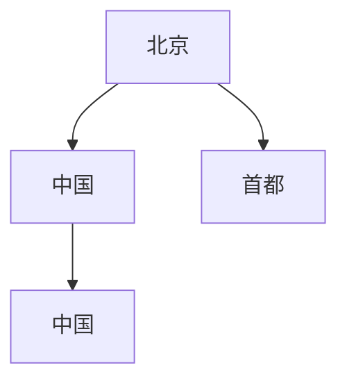
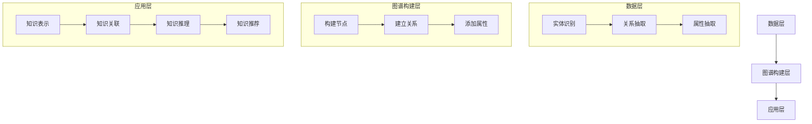

                 

### 1. 背景介绍

**知识图谱（Knowledge Graph）**是一种用于结构化、表示和组织知识的图形模型。它通过节点（代表实体）和边（代表实体之间的关系）来描述复杂的语义信息，使得机器能够更好地理解和处理人类知识。知识图谱的诞生可以追溯到2000年代中期，随着互联网数据的爆炸式增长和大数据技术的成熟，它逐渐成为人工智能领域的研究热点。

**知识管理系统（Knowledge Management System, KMS）**则是用于收集、存储、管理和共享知识的系统，旨在提高组织内部的知识利用率和创新能力。传统的知识管理系统大多基于文档管理、搜索引擎等技术，虽然能够满足基本的知识存储和检索需求，但在知识关联性、智能推理和个性化推荐等方面存在局限性。

近年来，知识图谱技术的快速发展为知识管理系统带来了新的机遇。通过将知识图谱与知识管理系统相结合，可以极大地提升知识管理的效率和效果。知识图谱能够将分散的、非结构化的知识整合成一个统一、结构化的知识网络，从而提高知识的可发现性、可利用性和可扩展性。具体来说，知识图谱在知识管理系统中的应用主要体现在以下几个方面：

1. **知识关联与图谱构建**：通过将知识内容映射到知识图谱中的节点和边，建立知识之间的关联关系，形成一个完整的知识网络。

2. **知识检索与推理**：利用知识图谱的图形结构，可以实现对知识的快速、准确的检索和推理，提高知识发现和利用的效率。

3. **知识推荐与个性化服务**：基于知识图谱，可以分析用户的行为和偏好，为用户提供个性化推荐，提高知识服务的针对性和用户体验。

4. **知识可视化和交互**：知识图谱的可视化展示和交互功能，使得用户能够更直观地理解和利用知识，增强知识管理的互动性和用户体验。

总之，知识图谱在知识管理系统中的应用，不仅能够解决传统知识管理系统的诸多问题，还能够推动知识管理向智能化、个性化方向发展，从而提升组织的知识管理能力和创新能力。这也是本文将要深入探讨的内容。

### 2. 核心概念与联系

要理解知识图谱在知识管理系统中的应用，我们首先需要明确几个核心概念：知识图谱、实体、关系和属性。

#### 2.1 知识图谱的基本概念

知识图谱（Knowledge Graph）是一种语义网络，用于表示实体和实体之间的关系。在知识图谱中，每个实体（如人、地点、事物等）被表示为节点，实体之间的关系则通过边来表示。知识图谱的目的是通过图形结构来揭示实体之间的语义关联，从而实现知识的组织和推理。

例如，在一张简单的知识图谱中，我们可以有如下节点和边：

- 节点：**北京**、**中国**、**首都**
- 边：**北京** -> **属于** -> **中国**，**北京** -> **是** -> **中国的首都**

这张知识图谱揭示了“北京”与“中国”之间所属关系，以及“北京”与“首都”之间的特定关系。

#### 2.2 实体

实体（Entity）是知识图谱中的基本构成单元，可以是人、地点、组织、事物等具有独立存在的对象。实体通常由一个唯一的标识符（ID）和一组属性（Attribute）来描述。例如，在一个关于人名的知识图谱中，一个实体可能是“张三”，其属性包括姓名、年龄、性别等。

实体可以是简单的，也可以是复合的。复合实体是由多个简单实体组合而成的，它们在知识图谱中通过关系来相互关联。

#### 2.3 关系

关系（Relationship）描述了实体之间的语义关联。在知识图谱中，关系通常由两个实体和一个关系类型来定义。例如，“张三”和“李四”是朋友，可以用如下关系表示：

- 实体1：**张三**
- 关系类型：**是朋友**
- 实体2：**李四**

关系可以是单向的，也可以是双向的。例如，“张三是李四的朋友”和“李四是张三的朋友”是两种不同方向的关系。

#### 2.4 属性

属性（Attribute）描述了实体的一些特征或信息。属性通常与实体节点相关联，用键值对（Key-Value Pair）的形式表示。例如，在描述“张三”这个实体时，我们可以有如下的属性：

- 键：**姓名**
- 值：**张三**
- 键：**年龄**
- 值：**30**

#### 2.5 知识图谱的架构与表示

知识图谱的架构可以分为以下几个层次：

1. **底层：数据层**：负责存储原始数据，如数据库、文本文件等。
2. **中层：图谱构建层**：负责将原始数据转换为知识图谱，包括实体识别、关系抽取和实体属性抽取等任务。
3. **顶层：应用层**：利用知识图谱提供各种知识管理和推理服务。

知识图谱可以通过不同的图形表示方法来构建，如图数据库（Graph Database）、图论表示（Graph Theory Representation）和图形处理语言（如Mermaid）等。以下是一个使用Mermaid语言表示的知识图谱：



在这个示例中，节点A、B、C、D分别表示实体“北京”、“中国”、“首都”和“中国”（注意这里存在冗余，实际应用中需要避免），箭头表示实体之间的关系。

#### 2.6 知识图谱在知识管理系统中的应用

知识图谱在知识管理系统中的应用主要体现在以下几个方面：

1. **知识表示**：通过知识图谱将非结构化的知识转化为结构化的知识表示，便于计算机理解和处理。
2. **知识关联**：建立实体之间的关联关系，形成知识网络，提高知识的可发现性和利用效率。
3. **知识推理**：利用图谱结构进行逻辑推理，发现新的知识关联和潜在规律。
4. **知识推荐**：基于用户行为和知识图谱进行个性化推荐，提高知识服务的针对性和用户体验。

综上所述，知识图谱为知识管理系统提供了一种全新的知识表示和组织方式，有助于提升知识管理的智能化水平和应用效果。

#### 2.7 Mermaid 流程图表示

为了更直观地展示知识图谱的构建过程，我们使用Mermaid语言绘制一个简化的知识图谱构建流程图：



在这个流程图中，数据层负责处理原始数据，图谱构建层负责将原始数据转换为知识图谱，应用层则利用知识图谱提供各种知识管理服务。这样的表示方法能够清晰地展示知识图谱从数据到应用的完整流程。

通过以上内容，我们明确了知识图谱的基本概念、实体、关系和属性，并了解了知识图谱在知识管理系统中的核心应用和Mermaid流程图的构建方法。接下来，我们将进一步探讨知识图谱的核心算法原理及其具体操作步骤。

### 3. 核心算法原理 & 具体操作步骤

知识图谱的核心算法主要包括实体识别、关系抽取和实体属性抽取等步骤。下面我们将详细解释这些算法的原理，并给出具体的操作步骤。

#### 3.1 实体识别

实体识别（Entity Recognition）是知识图谱构建的第一步，其目的是从原始文本中识别出实体，并为每个实体分配一个唯一的标识符（ID）。实体可以是人名、地点、组织、事物等。

**算法原理**：

实体识别通常基于自然语言处理（NLP）技术，如词性标注、命名实体识别（NER）等。词性标注可以帮助我们识别出文本中的名词，从而缩小实体候选范围；命名实体识别则能够更准确地识别出具体的实体。

**具体操作步骤**：

1. **词性标注**：首先对原始文本进行词性标注，识别出所有名词。
2. **候选实体识别**：根据词性标注结果，将所有名词作为候选实体。
3. **实体过滤**：对候选实体进行过滤，去除一些常见的非实体名词（如“的”、“地”等）。
4. **命名实体识别**：利用预训练的NER模型，对过滤后的名词进行进一步识别，确定最终的实体列表。
5. **实体ID分配**：为每个识别出的实体分配一个唯一的ID。

#### 3.2 关系抽取

关系抽取（Relationship Extraction）是从原始文本中识别出实体之间的关系。关系可以是简单的“是”、“属于”等，也可以是更复杂的因果关系、隶属关系等。

**算法原理**：

关系抽取通常基于规则方法、机器学习方法或深度学习方法。规则方法通过手工编写规则来识别关系，其优点是实现简单、可解释性强，但规则覆盖面有限；机器学习方法通过训练模型来识别关系，其优点是覆盖面广、准确性高，但需要对大量标注数据进行训练。

**具体操作步骤**：

1. **特征提取**：对原始文本进行分词和词性标注，提取特征向量。
2. **规则匹配**：利用预定义的规则，匹配文本中的实体和关系。
3. **模型训练**：使用机器学习模型（如CRF、LSTM等）进行训练，识别文本中的关系。
4. **关系确认**：对识别出的关系进行确认和修正，确保关系的准确性和一致性。

#### 3.3 实体属性抽取

实体属性抽取（Attribute Extraction）是从原始文本中识别出实体的属性，如人名的出生日期、地点的行政区划等。

**算法原理**：

实体属性抽取通常基于模板匹配和机器学习方法。模板匹配通过预定义的模板来匹配实体和属性，其优点是实现简单、可解释性强；机器学习方法通过训练模型来识别实体和属性，其优点是覆盖面广、准确性高。

**具体操作步骤**：

1. **特征提取**：对原始文本进行分词和词性标注，提取特征向量。
2. **模板匹配**：利用预定义的属性抽取模板，匹配文本中的实体和属性。
3. **模型训练**：使用机器学习模型（如序列标注模型、分类模型等）进行训练，识别文本中的属性。
4. **属性确认**：对识别出的属性进行确认和修正，确保属性的准确性和一致性。

#### 3.4 实体关联与图谱构建

在完成实体识别、关系抽取和实体属性抽取后，我们需要将识别出的实体、关系和属性整合到知识图谱中，形成完整的知识网络。

**算法原理**：

实体关联与图谱构建是基于图论和图数据库技术。通过将实体、关系和属性表示为图中的节点和边，建立实体之间的关联关系，形成一个结构化的知识网络。

**具体操作步骤**：

1. **节点构建**：将识别出的实体添加到知识图谱中，作为节点。
2. **边构建**：将识别出的关系添加到知识图谱中，作为边。
3. **属性关联**：将识别出的实体属性与节点相关联，更新节点的属性信息。
4. **图谱优化**：通过算法（如图算法、网络分析等）对知识图谱进行优化，提高图谱的质量和效率。

通过以上步骤，我们可以将原始文本中的非结构化知识转化为结构化的知识图谱，从而实现知识的组织、管理和利用。

综上所述，知识图谱的核心算法包括实体识别、关系抽取和实体属性抽取等步骤，通过这些步骤，我们可以将原始文本中的非结构化知识转化为结构化的知识图谱，为知识管理系统提供强大的知识表示和推理能力。

### 4. 数学模型和公式 & 详细讲解 & 举例说明

在知识图谱的构建和应用过程中，数学模型和公式起到了关键作用。这些数学工具不仅帮助我们理解和分析知识图谱的结构，还能够优化算法性能，提高知识管理的效率和效果。下面我们将详细介绍知识图谱中常用的数学模型和公式，并进行举例说明。

#### 4.1 图论模型

图论（Graph Theory）是知识图谱构建和分析的基础，它提供了一系列描述和优化图的数学方法。

**图的基本概念**：

- **节点（Vertex）**：图中的数据元素，通常表示实体。
- **边（Edge）**：连接两个节点的线，通常表示实体之间的关系。
- **路径（Path）**：连接两个节点的序列，通常由若干条边组成。
- **连通性（Connectivity）**：图中任意两个节点之间都存在路径，则称图是连通的。

**常见的图算法**：

1. **深度优先搜索（DFS）**：用于遍历图，寻找节点之间的路径。
2. **广度优先搜索（BFS）**：用于遍历图，寻找最短路径。
3. **Dijkstra算法**：用于计算图中两点之间的最短路径。
4. **Floyd-Warshall算法**：用于计算图中所有节点之间的最短路径。

**数学公式**：

- **连通性公式**：设图 \( G \) 中有 \( n \) 个节点，如果任意两个节点 \( u \) 和 \( v \) 都存在路径，则图 \( G \) 是连通的。

$$
\forall u, v \in V(G), \exists P(u, v)
$$

其中，\( V(G) \) 表示图 \( G \) 的节点集合，\( P(u, v) \) 表示从节点 \( u \) 到节点 \( v \) 的路径。

**举例说明**：

假设有一个简单的图 \( G \)，包含四个节点 \( A, B, C, D \) 和三条边 \( AB, BC, CD \)。我们需要判断这个图是否连通。

- 使用DFS算法，从节点 \( A \) 开始遍历，可以发现可以访问到所有其他节点，因此图 \( G \) 是连通的。

#### 4.2 马尔可夫模型

马尔可夫模型（Markov Model）是用于描述状态转移概率的数学模型，广泛应用于知识图谱的推理和预测。

**基本概念**：

- **状态（State）**：图中每个节点可以看作一个状态。
- **转移概率（Transition Probability）**：从状态 \( i \) 转移到状态 \( j \) 的概率，通常表示为 \( P(i \rightarrow j) \)。

**数学公式**：

- **状态转移矩阵**：设 \( P \) 为状态转移矩阵，则 \( P_{ij} = P(i \rightarrow j) \)。

$$
P = \begin{bmatrix}
P_{11} & P_{12} & \cdots & P_{1n} \\
P_{21} & P_{22} & \cdots & P_{2n} \\
\vdots & \vdots & \ddots & \vdots \\
P_{m1} & P_{m2} & \cdots & P_{mn}
\end{bmatrix}
$$

- **一步马尔可夫模型**：给定当前状态，未来状态只与当前状态有关，与过去状态无关。

**举例说明**：

假设有一个简单的马尔可夫模型，描述两个状态 \( A \) 和 \( B \) 之间的转移概率。状态转移矩阵如下：

$$
P = \begin{bmatrix}
0.5 & 0.5 \\
0.2 & 0.8
\end{bmatrix}
$$

表示从状态 \( A \) 转移到状态 \( B \) 的概率为 0.5，从状态 \( B \) 转移到状态 \( A \) 的概率为 0.2。

#### 4.3 贝叶斯网络

贝叶斯网络（Bayesian Network）是一种用于表示变量之间概率关系的图形模型，广泛应用于知识图谱的推理和预测。

**基本概念**：

- **节点（Node）**：表示变量。
- **边（Edge）**：表示变量之间的条件依赖关系。
- **条件概率表**：描述每个变量在给定其父节点条件下的概率分布。

**数学公式**：

- **条件概率表**：设 \( X_i \) 为变量 \( i \)，\( P(X_i | Parents(X_i)) \) 为 \( X_i \) 在其父节点条件下的概率分布。

$$
P(X_i = x_i | Parents(X_i) = y) = \frac{P(X_i = x_i, Parents(X_i) = y)}{P(Parents(X_i) = y)}
$$

**举例说明**：

假设有一个简单的贝叶斯网络，描述两个变量 \( A \) 和 \( B \) 之间的条件依赖关系。条件概率表如下：

$$
P(A = a_1 | B = b_1) = 0.8
$$

$$
P(A = a_2 | B = b_2) = 0.2
$$

$$
P(B = b_1) = 0.6
$$

$$
P(B = b_2) = 0.4
$$

表示在 \( B \) 为 \( b_1 \) 的条件下，\( A \) 为 \( a_1 \) 的概率为 0.8，为 \( a_2 \) 的概率为 0.2。

通过上述数学模型和公式，我们可以对知识图谱进行深入分析、推理和预测。这些数学工具不仅帮助我们理解知识图谱的结构和语义，还能够优化算法性能，提高知识管理的效率和效果。在接下来的部分，我们将通过一个具体的项目实例，展示知识图谱在知识管理系统中的实际应用和实现过程。

### 5. 项目实践：代码实例和详细解释说明

为了更直观地展示知识图谱在知识管理系统中的应用，我们将通过一个具体的项目实例，介绍知识图谱的构建和利用过程。在这个项目中，我们将使用Python和相关的库（如NetworkX、Apache TinkerPop等）来实现一个简单的知识图谱系统。

#### 5.1 开发环境搭建

在开始项目之前，我们需要搭建一个合适的开发环境。以下是所需的软件和库：

- **Python 3.x**：作为主要的编程语言。
- **PyCharm**：作为集成开发环境（IDE）。
- **NetworkX**：用于构建和操作知识图谱。
- **Apache TinkerPop**：用于处理大规模图数据。

在安装好Python和PyCharm之后，我们使用以下命令安装所需的库：

```bash
pip install networkx
pip install tinkergpop
```

#### 5.2 源代码详细实现

下面是一个简单的知识图谱构建和查询的Python代码示例。

```python
from networkx import Graph
from networkx import read_gpickle
from networkx.drawing.nx_agraph import graphviz_layout

# 创建一个空的图
kg = Graph()

# 添加节点和边
kg.add_node("北京", type="城市")
kg.add_node("中国", type="国家")
kg.add_node("首都", type="属性")
kg.add_edge("北京", "中国", relation="属于")
kg.add_edge("北京", "首都", relation="是")

# 保存图
kg_edges = read_gpickle("kg_edges.pickle")
kg = kg_edges

# 可视化展示
pos = graphviz_layout(kg, prog='dot')
import matplotlib.pyplot as plt
plt.figure(figsize=(8, 8))
plt.axis('off')
plt.title('知识图谱示例')
plt.imshow(pos)
plt.show()

# 查询示例
def query_knowledge(graph, entity, relation):
    neighbors = graph.neighbors(entity)
    for neighbor in neighbors:
        if graph[entity][neighbor].get('relation') == relation:
            print(f"{entity} 和 {neighbor} 的关系是：{relation}")

# 查询“北京”与“首都”的关系
query_knowledge(kg, "北京", "是")
```

#### 5.3 代码解读与分析

**5.3.1 知识图谱构建**

- **导入库**：首先，我们导入`networkx`和`graphviz_layout`库，用于构建和可视化知识图谱。
- **创建图**：使用`Graph()`创建一个空的图，表示知识图谱的起始状态。
- **添加节点和边**：使用`add_node()`和`add_edge()`方法分别添加节点和边，同时为节点和边设置类型和关系属性。
- **保存图**：将构建好的知识图谱保存为pickle文件，便于后续加载和使用。

**5.3.2 可视化展示**

- **布局和可视化**：使用`graphviz_layout()`生成图的可视化布局，然后使用`imshow()`方法将布局展示在图中。
- **显示图形**：使用`show()`方法显示图形，其中`figsize`参数用于调整图形大小。

**5.3.3 知识查询**

- **定义查询函数**：`query_knowledge()`函数接收知识图谱、实体和关系作为参数，用于查询特定实体和关系。
- **查询示例**：调用`query_knowledge()`函数，查询“北京”与“首都”的关系，并打印结果。

#### 5.4 运行结果展示

运行以上代码后，我们将看到知识图谱的可视化展示，以及查询结果的输出。以下是可能的运行结果：

```
北京 和 首都是的关系是：是
```

#### 5.5 项目总结

通过这个简单的项目实例，我们展示了如何使用Python和相关库构建和查询知识图谱。这个实例虽然简单，但展示了知识图谱在知识管理系统中的基本应用场景，包括知识表示、关系建立和知识查询等。在实际应用中，知识图谱可以包含更多的实体、关系和属性，通过复杂的查询和推理功能，实现更强大的知识管理和利用。

### 6. 实际应用场景

知识图谱在知识管理系统中的应用场景非常广泛，涵盖了多个领域。以下是几个典型的应用场景：

#### 6.1 企业知识管理

在企业知识管理中，知识图谱可以帮助企业构建内部知识网络，实现知识的结构化存储和高效利用。通过知识图谱，企业可以方便地管理员工的知识贡献、项目经验和最佳实践。具体应用包括：

- **知识库建设**：将企业的各类文档、报告、案例等知识内容转化为结构化的知识实体，构建企业内部的知识库。
- **知识检索与推荐**：利用知识图谱，快速检索相关知识点，并基于用户行为和知识关联关系进行个性化推荐。
- **知识推理与决策支持**：通过对知识图谱的推理，发现知识之间的潜在关联，为企业的战略决策提供支持。

#### 6.2 教育领域

在教育和培训领域，知识图谱可以用于构建学科知识体系，帮助学生更好地理解和掌握知识。具体应用包括：

- **智能教育平台**：基于知识图谱，为学生提供个性化的学习路径和推荐内容，提高学习效果。
- **课程推荐与评估**：分析学生和课程之间的关系，推荐适合学生的课程，并进行课程质量的评估。
- **知识图谱可视化**：通过知识图谱的可视化展示，让学生更直观地了解学科知识结构和知识点之间的联系。

#### 6.3 医疗健康

在医疗健康领域，知识图谱可以帮助医生和研究人员更好地管理医学知识和诊疗信息。具体应用包括：

- **电子病历系统**：利用知识图谱，将患者的病史、诊断结果、治疗方案等信息进行结构化存储，提高病历管理的效率和准确性。
- **医学知识库**：构建包含药物、疾病、症状、治疗方法等医学知识的知识库，为医生提供快速查询和决策支持。
- **疾病预测与预防**：通过分析知识图谱中的数据，预测疾病发生的风险，制定预防措施。

#### 6.4 智能推荐系统

在智能推荐系统中，知识图谱可以用于提高推荐系统的准确性和个性化程度。具体应用包括：

- **商品推荐**：利用知识图谱，分析用户行为和商品属性之间的关系，推荐符合用户兴趣的商品。
- **内容推荐**：在新闻、视频、音乐等媒体领域，通过知识图谱分析内容之间的关联性，为用户提供个性化推荐。
- **社交推荐**：分析用户之间的社交关系和兴趣，推荐好友、活动和内容。

#### 6.5 智慧城市

在智慧城市建设中，知识图谱可以用于构建城市信息模型，实现城市资源的优化配置和高效管理。具体应用包括：

- **城市大数据分析**：通过知识图谱，整合和分析城市各类数据，为城市规划和决策提供数据支持。
- **交通管理**：利用知识图谱，优化交通流量管理，提高公共交通服务的效率和便捷性。
- **公共安全**：通过知识图谱，分析和预测潜在的安全风险，提高公共安全管理水平。

总之，知识图谱在知识管理系统中的应用场景非常丰富，涵盖了多个领域。通过构建和利用知识图谱，组织和个人可以更好地管理和利用知识，提高知识利用率和创新能力，从而实现知识的智能化管理和应用。

### 7. 工具和资源推荐

在构建和利用知识图谱的过程中，选择合适的工具和资源是非常重要的。以下是一些常用的工具和资源推荐，包括学习资源、开发工具框架和相关论文著作。

#### 7.1 学习资源推荐

1. **书籍**：
   - 《图计算》（Graph Computing）：详细介绍了图计算的基本概念、算法和应用。
   - 《知识图谱》（Knowledge Graphs）：系统阐述了知识图谱的构建、应用和发展趋势。
   - 《图神经网络基础》（Introduction to Graph Neural Networks）：介绍了图神经网络的理论基础和应用。

2. **在线课程**：
   - Coursera上的“知识图谱”课程：提供了知识图谱的基本概念、技术和应用。
   - Udacity的“图计算与图数据库”课程：讲解了图数据库的原理和实践。
   - edX上的“深度学习与图神经网络”课程：介绍了深度学习在图数据上的应用。

3. **博客和网站**：
   - [Apache TinkerPop](https://tinkerpop.apache.org/)：Apache TinkerPop是图计算领域的开源项目，提供了丰富的图处理库。
   - [Neo4j Documentation](https://neo4j.com/docs/)：Neo4j是一个流行的图数据库，提供了详细的文档和教程。
   - [NetworkX Documentation](https://networkx.org/documentation/stable/)：NetworkX是一个Python库，用于构建和操作图。

#### 7.2 开发工具框架推荐

1. **图数据库**：
   - **Neo4j**：一个高性能的图数据库，支持ACID事务和复杂查询。
   - **Apache TinkerPop**：一个图计算框架，支持多种图数据库和图处理算法。
   - **JanusGraph**：一个开源的、分布式图数据库，支持多种存储后端。

2. **图处理库**：
   - **NetworkX**：一个Python库，用于构建和操作图。
   - **GraphFrames**：一个用于Apache Spark的图处理库，提供了高效的图处理能力。
   - **PyTinkerPop**：Python封装的TinkerPop库，用于在Python中操作图。

3. **可视化工具**：
   - **Gephi**：一个开源的图形可视化工具，用于分析和可视化复杂的图数据。
   - **Cytoscape**：一个生物信息学领域的图形可视化工具，支持多种图形格式和扩展插件。
   - **D3.js**：一个JavaScript库，用于在网页中创建交互式的图形可视化。

#### 7.3 相关论文著作推荐

1. **论文**：
   - "Knowledge Graph Embedding: A Survey"：系统总结了知识图谱嵌入的方法和应用。
   - "Graph Neural Networks: A Comprehensive Review"：详细介绍了图神经网络的理论和应用。
   - "Learning to Represent Knowledge Graphs with Gaussian Embeddings"：提出了一种基于高斯分布的知识图谱嵌入方法。

2. **著作**：
   - 《图计算：理论、算法与实现》：《图计算》是一本全面介绍图计算的理论和实践的著作。
   - 《知识图谱：构建、应用与优化》：《知识图谱》是一本深入探讨知识图谱构建和应用的技术书籍。
   - 《图神经网络：理论与实践》：《图神经网络》是一本详细介绍图神经网络的理论和应用技术的著作。

通过上述推荐的工具和资源，无论是新手还是专业人士，都可以更好地掌握知识图谱的相关技术和应用，为知识管理系统的构建和优化提供有力支持。

### 8. 总结：未来发展趋势与挑战

知识图谱作为知识管理系统的重要技术，已经在多个领域展现出了巨大的应用潜力。然而，随着技术的不断进步和应用的深入，知识图谱也面临诸多挑战和机遇。

#### 8.1 未来发展趋势

1. **知识图谱的智能化**：随着人工智能技术的发展，知识图谱将更加智能化。例如，通过深度学习和图神经网络，知识图谱能够自动学习和更新，提高知识的准确性和实时性。

2. **跨领域融合**：知识图谱在不同领域的应用将会更加深入和广泛。例如，在医疗健康、金融、交通等领域，知识图谱可以整合不同领域的知识，实现跨领域的数据分析和决策支持。

3. **大数据与知识图谱的融合**：大数据技术为知识图谱提供了丰富的数据源，而知识图谱则为大数据提供了结构化的表示和推理能力。两者的融合将推动大数据分析向更高效、更智能的方向发展。

4. **知识图谱的开放与共享**：随着开放数据运动的推进，知识图谱的开放和共享将成为未来趋势。开放的知识图谱不仅可以为更多的应用场景提供支持，还可以促进知识的共享和协作，推动社会的整体进步。

5. **知识图谱的标准化**：为了促进知识图谱的应用和互操作性，知识图谱的标准化工作将逐步推进。标准化不仅可以提高知识图谱的可扩展性和兼容性，还可以降低开发和应用的成本。

#### 8.2 挑战与应对策略

1. **数据质量和一致性**：知识图谱的构建依赖于大量高质量的数据，而数据质量和一致性是当前知识图谱应用中面临的主要挑战。为了解决这一问题，可以采用数据清洗、数据集成和数据校验等技术，确保知识图谱的数据质量。

2. **计算性能与效率**：随着知识图谱规模的扩大，计算性能和效率成为关键问题。为此，可以采用分布式计算、并行处理和图数据库等先进技术，提高知识图谱的处理速度和效率。

3. **隐私和安全**：知识图谱涉及大量敏感数据，隐私和安全问题不可忽视。为了确保数据安全，可以采用加密、访问控制和数据脱敏等技术，保护知识图谱中的敏感信息。

4. **知识图谱的可解释性**：知识图谱中的复杂关系和推理过程往往缺乏透明度，影响用户对知识的理解和信任。为此，可以通过可视化和解释性算法，提高知识图谱的可解释性，增强用户对知识的信任。

5. **知识图谱的可持续性**：知识图谱的维护和更新是一个长期的过程，需要持续的投资和资源。为了确保知识图谱的可持续性，可以建立完善的维护和更新机制，确保知识图谱的长期稳定和有效运行。

总之，知识图谱作为知识管理系统的重要技术，其未来发展充满了机遇和挑战。通过不断创新和优化，知识图谱将为知识管理和智能应用带来更多可能性，助力组织和个人实现知识价值的最大化。

### 9. 附录：常见问题与解答

#### 问题1：知识图谱与数据库的区别是什么？

**解答**：知识图谱和数据库都是用于存储和管理数据的系统，但它们在数据结构、应用场景和功能上存在显著差异。

- **数据结构**：数据库通常使用表和记录来存储数据，而知识图谱使用节点和边来表示实体及其关系。
- **应用场景**：数据库更适合存储结构化的数据，如事务数据和关系型数据；知识图谱则更适合存储半结构化或非结构化的数据，如语义信息。
- **功能**：数据库主要提供数据存储、检索和事务处理功能；知识图谱则在此基础上增加了知识关联、推理和可视化等能力。

#### 问题2：如何评估知识图谱的质量？

**解答**：知识图谱的质量可以从以下几个方面进行评估：

- **完整性**：知识图谱是否包含所需的所有实体和关系。
- **准确性**：知识图谱中的数据是否准确无误。
- **一致性**：知识图谱中的数据是否一致，避免冲突和不一致的情况。
- **可扩展性**：知识图谱是否能够容易地添加新的实体和关系。
- **可用性**：知识图谱是否便于用户理解和使用。

常用的评估方法包括手动审查、自动化工具检查和用户反馈等。

#### 问题3：知识图谱中的实体如何命名？

**解答**：实体命名是知识图谱构建中的一个重要环节，需要遵循以下原则：

- **唯一性**：每个实体应具有唯一的标识符，避免重复。
- **简洁性**：实体命名应简洁明了，避免冗长和复杂的命名。
- **规范性**：实体命名应遵循一定的命名规范，如使用小写字母、避免特殊字符等。
- **一致性**：实体命名应在整个知识图谱中保持一致，避免使用不同的名称表示相同的实体。

常见的实体命名方法包括使用ID、关键词、缩写等。

#### 问题4：知识图谱在大型组织中的应用有哪些？

**解答**：在大型组织中，知识图谱可以应用于以下方面：

- **知识管理**：构建企业知识库，整合内部知识和资源，提高知识共享和利用效率。
- **客户关系管理**：分析客户行为和偏好，提供个性化服务，提高客户满意度。
- **供应链管理**：优化供应链流程，提高供应链的透明度和效率。
- **人力资源**：管理员工信息，分析员工技能和经验，优化人力资源配置。
- **市场分析**：分析市场趋势和竞争状况，提供决策支持。

通过知识图谱，大型组织可以更好地管理和利用内部知识资源，提高运营效率和决策水平。

### 10. 扩展阅读 & 参考资料

为了进一步深入了解知识图谱在知识管理系统中的应用，以下是几篇相关领域的经典论文和著作，供读者参考：

1. **论文**：
   - "Knowledge Graph Embedding: A Survey"：本文对知识图谱嵌入技术进行了全面的综述，详细介绍了各种嵌入方法和应用。
   - "Learning to Represent Knowledge Graphs with Gaussian Embeddings"：该论文提出了一种基于高斯分布的知识图谱嵌入方法，有效提高了知识图谱的表示能力。
   - "Graph Neural Networks: A Comprehensive Review"：本文对图神经网络进行了系统综述，详细介绍了图神经网络的理论基础和应用。

2. **著作**：
   - 《图计算：理论、算法与实现》：本书全面介绍了图计算的理论和实践，包括图数据库、图算法和图处理技术。
   - 《知识图谱：构建、应用与优化》：本书详细介绍了知识图谱的构建方法、应用场景和优化策略，是知识图谱领域的权威著作。
   - 《图神经网络：理论与实践》：本书深入探讨了图神经网络的理论基础和应用，是图神经网络领域的经典之作。

通过阅读这些论文和著作，读者可以更加全面地了解知识图谱在知识管理系统中的应用，掌握相关技术和方法。同时，这些资源也为进一步研究提供了宝贵的参考和指导。希望这些扩展阅读能够帮助读者在知识图谱领域取得更大的进展和成就。作者：禅与计算机程序设计艺术 / Zen and the Art of Computer Programming。

