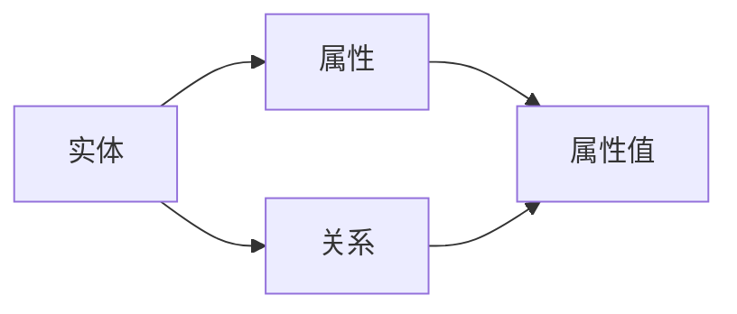
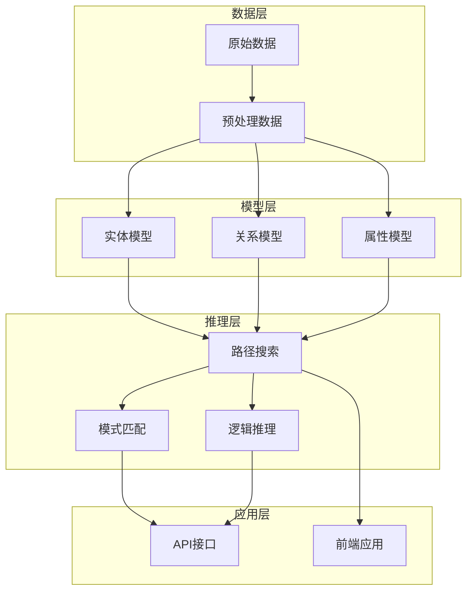
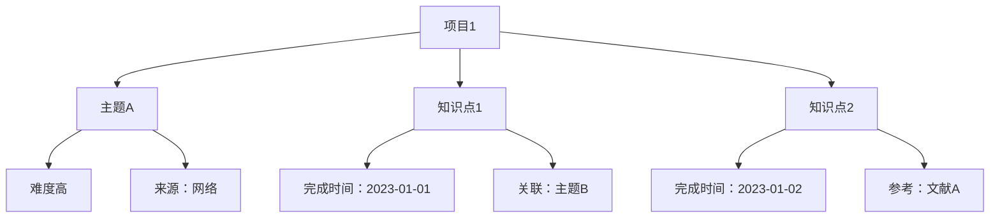

                 

### 背景介绍

知识图谱（Knowledge Graph）作为一种语义网络，旨在通过实体与关系的表示来揭示复杂信息的内在联系，提高信息检索与处理的效率。近年来，随着互联网数据的爆炸性增长和人工智能技术的不断发展，知识图谱技术在多个领域展现出了巨大的潜力，特别是在个人知识管理方面。

个人知识管理（Personal Knowledge Management，PKM）是指个体为了提高工作效率和生活质量，对信息进行收集、存储、组织、利用和创新的一系列策略和实践。传统上，个人知识管理主要依赖于笔记软件、文档管理工具和个人记忆。然而，随着信息量的不断增加和复杂性的提升，传统的个人知识管理方法逐渐显示出其局限性，如数据冗余、信息丢失、难以关联和整合等。

知识图谱技术的引入为个人知识管理带来了新的可能。它不仅能够将零散的信息进行结构化处理，还能通过实体关系挖掘，实现知识的自动关联和整合。这种技术使得个人知识管理变得更加高效、智能和系统化。例如，通过知识图谱，个体可以更加便捷地检索到所需信息，提高知识利用的效率；同时，知识图谱还可以帮助个体发现新知识、构建知识网络，促进知识的创新和发展。

在本文中，我们将深入探讨知识图谱在个人知识管理中的应用。首先，我们将介绍知识图谱的基本概念和核心技术，包括实体、关系和图谱的构建方法。接着，我们将分析知识图谱在个人知识管理中的具体应用场景，并探讨其带来的优势。随后，我们将讨论知识图谱技术面临的挑战和未来的发展趋势。最后，我们将提供一些实用的工具和资源推荐，帮助读者更好地了解和实践知识图谱技术在个人知识管理中的应用。

通过对本文的阅读，读者将能够系统地了解知识图谱技术的原理和应用，掌握如何将其应用于个人知识管理中，为个人知识的系统化、智能化管理提供新的思路和方法。

### 核心概念与联系

知识图谱是一种基于语义网络的信息表示方法，旨在通过实体、属性和关系的描述来表示和揭示信息的内在联系。以下是知识图谱的核心概念和基本架构，我们将使用Mermaid流程图来展示这些概念之间的联系。

#### 核心概念

1. **实体（Entity）**：实体是知识图谱中的基本信息单元，可以是任何具有独立存在意义的事物，如人、地点、组织、物品等。例如，在个人知识管理中，实体可以是一个项目、一个主题或一个知识点。
2. **属性（Attribute）**：属性用于描述实体的特征或状态，如一个人的年龄、职业、居住地等。属性通常与实体之间有一对多的关系。
3. **关系（Relationship）**：关系是实体之间的关联，用于表示实体之间的逻辑联系，如“属于”、“属于某个时间”、“位于”等。关系通常具有方向性和类型，例如“学生”与“学校”之间的“就读于”关系。
4. **图谱（Graph）**：图谱是由实体、属性和关系构成的图结构，用于存储和表示知识。在知识图谱中，每个节点代表一个实体，每条边代表一个关系。

#### Mermaid流程图

下面是一个简单的Mermaid流程图，展示了知识图谱中的核心概念和它们之间的关系：



在这个流程图中：

- `A[实体]`表示实体，它可以通过属性（`B[属性]`）和关系（`C[关系]`）来描述。
- `B[属性]`表示实体的特征或状态，它通过属性值（`D[属性值]`）来具体描述。
- `C[关系]`表示实体之间的关联，它可以连接不同的实体节点，并通过属性值来描述这种关系的具体内容。

#### 架构设计

知识图谱的架构设计通常包括以下几个层次：

1. **数据层**：数据层负责存储原始数据，如文本、图片、音频等。这些数据通常通过数据爬取、数据挖掘等技术进行预处理，然后转化为结构化的知识数据。
2. **模型层**：模型层负责构建知识图谱的模型，将实体、属性和关系进行结构化表示。常见的模型包括属性图（Property Graph）和图神经网络（Graph Neural Networks）等。
3. **推理层**：推理层负责基于知识图谱进行推理和计算，以发现新的知识关联和关系。推理算法包括路径搜索、模式匹配、逻辑推理等。
4. **应用层**：应用层是知识图谱对外提供服务的接口，如API接口、前端应用等。用户可以通过这些接口查询、操作和利用知识图谱中的知识。

以下是知识图谱架构的Mermaid流程图：



在这个流程图中：

- 数据层负责存储和预处理原始数据。
- 模型层负责构建实体、关系和属性模型。
- 推理层负责基于模型进行推理和计算。
- 应用层负责对外提供服务，如API接口和前端应用。

通过这种架构设计，知识图谱技术能够高效地存储、管理和利用信息，为个人知识管理提供强有力的支持。

#### 实例解析

为了更直观地理解知识图谱的核心概念和架构，我们可以通过一个实例来详细说明。假设我们构建一个关于个人知识的知识图谱，该图谱包括以下实体、属性和关系：

- **实体**：项目、主题、知识点
- **属性**：难度、完成时间、来源
- **关系**：包含、关联、参考

以下是一个简单的知识图谱实例，使用Mermaid流程图展示：



在这个实例中：

- `A1[项目1]`是一个实体，它包含了`B1[主题A]`、`C1[知识点1]`和`C2[知识点2]`。
- `B1[主题A]`是一个实体，它具有属性`D1[难度高]`和`D2[来源：网络]`。
- `C1[知识点1]`和`C2[知识点2]`是实体，它们分别具有属性`E1[完成时间：2023-01-01]`和`E2[完成时间：2023-01-02]`。
- `C1[知识点1]`与`B1[主题A]`存在关联关系`F1[关联：主题B]`，表示知识点1不仅属于主题A，还与主题B有关联。
- `C2[知识点2]`与`文献A`存在参考关系`F2[参考：文献A]`，表示知识点2参考了文献A。

通过这个实例，我们可以看到知识图谱如何将个人知识以结构化的方式表示，使得知识的存储、管理和查询更加高效和智能化。

### 核心算法原理 & 具体操作步骤

知识图谱技术的核心在于如何高效地构建、存储、查询和应用知识。在这一部分，我们将详细探讨知识图谱的核心算法原理，并逐步讲解具体操作步骤，帮助读者理解和掌握这一技术的实际应用。

#### 算法原理

1. **实体识别与分类**：实体识别是知识图谱构建的第一步，通过自然语言处理技术，从文本中提取出关键实体，如人名、地点、组织、物品等。随后，对这些实体进行分类，以便于后续的知识组织和管理。
   
2. **关系抽取**：关系抽取是指从文本中提取出实体之间的关联关系。这可以通过基于规则的方法、机器学习方法以及深度学习方法来实现。常见的关系抽取方法包括命名实体识别（NER）、依赖解析、共指消解等。

3. **属性填充**：属性填充是给实体添加具体的属性值。这可以通过信息提取、数据挖掘、机器学习等方法来实现。例如，对于一个公司实体，可以通过网页爬取、数据库查询等方式获取其地址、电话、成立时间等属性。

4. **图谱构建**：图谱构建是将实体、属性和关系组织成图结构。这通常通过图数据库或图计算框架来实现。常见的图谱构建方法包括图嵌入、图神经网络（GNN）等。

5. **图谱推理**：图谱推理是基于图谱中的实体和关系进行逻辑推理，以发现新的知识关联。常见的推理方法包括路径搜索、模式匹配、逻辑推理等。

6. **图谱查询**：图谱查询是用户通过接口查询图谱中的信息，获取所需的答案或知识。常见的查询方法包括图遍历、图查询语言（如Gremlin、Cypher等）。

#### 操作步骤

1. **数据收集与预处理**：首先，收集与个人知识相关的数据，如文档、网页、数据库等。然后，对数据进行预处理，包括文本清洗、去除噪声、分词、词性标注等。

2. **实体识别与分类**：使用自然语言处理（NLP）技术对预处理后的文本进行实体识别，提取出关键实体。随后，对这些实体进行分类，例如将人名分类为“专家”、“学生”等。

3. **关系抽取**：使用关系抽取算法，从文本中提取出实体之间的关联关系。这可以通过规则匹配、机器学习模型（如Bert、Transformer等）来实现。

4. **属性填充**：对识别出的实体进行属性填充。例如，对于一个项目实体，可以通过网页爬取、数据库查询等方式获取其难度、完成时间、来源等属性。

5. **图谱构建**：将识别出的实体、关系和属性组织成图结构。这可以通过图数据库（如Neo4j、JanusGraph等）或图计算框架（如GraphX、Apache Flink等）来实现。

6. **图谱推理**：基于图谱中的实体和关系进行推理，以发现新的知识关联。例如，通过路径搜索找出某个知识点与其他知识点的关联，或者通过模式匹配找出具有相似属性的知识点。

7. **图谱查询**：通过图查询语言或API接口，用户可以查询图谱中的信息。例如，查询某个项目的难度、完成时间、关联知识点等。

#### 实例解析

为了更好地理解上述步骤，我们通过一个实际案例来详细解析。

假设我们构建一个关于个人学习的知识图谱，包括以下实体和关系：

- **实体**：课程、讲师、学生、知识点
- **关系**：授课、学习、包含

以下是一个简化的操作步骤：

1. **数据收集与预处理**：收集与学习相关的数据，如课程介绍、讲师信息、学生笔记等。对数据进行预处理，包括去除HTML标签、分词、词性标注等。

2. **实体识别与分类**：从预处理后的数据中提取出实体，如“课程1”、“讲师A”、“学生B”等。对这些实体进行分类，例如将“课程1”分类为“计算机科学”。

3. **关系抽取**：从文本中提取出实体之间的关联关系，如“课程1”与“讲师A”之间存在“授课”关系，“学生B”与“课程1”之间存在“学习”关系。

4. **属性填充**：对识别出的实体进行属性填充，例如课程1的难度为“初级”，讲师A的资质为“教授”，学生B的专业为“计算机科学”。

5. **图谱构建**：将实体和关系组织成图结构。例如，将课程1作为节点，讲师A作为节点，它们之间通过“授课”关系相连；学生B与课程1之间通过“学习”关系相连。

6. **图谱推理**：通过路径搜索，找出与学生B相关的所有课程和讲师，或者通过模式匹配，找出所有难度为“初级”的课程。

7. **图谱查询**：通过图查询语言（如Neo4j的Cypher语言）查询图谱中的信息。例如，查询学生B所学过的所有课程，或者查询所有难度为“初级”的课程及其讲师。

#### 工具与框架

在实际操作中，我们可以使用多种工具和框架来构建和管理知识图谱。以下是一些常用的工具和框架：

- **Neo4j**：一款流行的图数据库，支持ACID事务，具有强大的图查询语言Cypher。
- **JanusGraph**：一款开源的分布式图数据库，支持多种存储后端，如Apache Cassandra、Google Bigtable等。
- **Apache Flink**：一款流处理框架，支持图计算，适用于大规模实时知识图谱构建。
- **Apache TinkerPop**：一个图计算框架，提供了统一的接口来操作各种图数据库和图计算框架。
- **OpenKE**：一款开源的知识嵌入框架，用于构建和训练知识图谱。

通过以上工具和框架，我们可以高效地构建、存储、查询和应用知识图谱，为个人知识管理提供强有力的支持。

### 数学模型和公式 & 详细讲解 & 举例说明

在知识图谱技术中，数学模型和公式起着至关重要的作用，它们不仅用于描述实体、关系和属性的语义，还用于推理和计算中的各种算法。本节将详细讲解知识图谱中的几个关键数学模型和公式，包括图嵌入、矩阵分解和图神经网络，并通过具体例子来说明这些模型的应用。

#### 图嵌入

图嵌入（Graph Embedding）是一种将图中的节点（实体）映射到低维向量空间的技术，使得图中的相邻节点在向量空间中具有相似的表示。图嵌入广泛应用于知识图谱的表示学习、节点分类、链接预测等任务。

1. **模型介绍**
   图嵌入模型通常基于矩阵分解技术，将图表示为一个低秩矩阵，然后通过矩阵的列向量来表示节点。最著名的图嵌入模型是Node2Vec，它通过随机游走生成节点的邻居集合，然后利用Word2Vec模型对邻居集合进行矩阵分解。

2. **公式表示**
   假设有一个知识图谱G=(V,E)，其中V是节点集合，E是边集合。Node2Vec模型的目标是学习一个矩阵W∈ℝ^|V|×d，其中d是嵌入向量的维度。对于每个节点v∈V，其嵌入向量表示为e_v=Wv。

   Node2Vec的核心公式如下：
   $$ e_v = \frac{1}{|\mathcal{N}(v)|} \sum_{u \in \mathcal{N}(v)} w_{uv} \cdot e_u $$
   其中，\(\mathcal{N}(v)\)表示节点v的邻居集合，\(w_{uv}\)表示节点u到节点v的权重，通常通过随机游走概率来计算。

3. **例子说明**
   假设有一个简单的知识图谱，包括三个节点v1、v2、v3，以及它们之间的边。通过Node2Vec模型，我们可以将每个节点映射到二维空间中。具体步骤如下：

   - **随机游走**：从每个节点开始，以一定的概率选择邻居节点进行游走，构建节点邻居集合。
   - **计算邻居权重**：根据邻居节点的游走概率，计算每个节点之间的权重。
   - **矩阵分解**：利用Word2Vec模型对邻居集合进行矩阵分解，得到每个节点的嵌入向量。

   假设节点v1的邻居集合为{v2, v3}，权重分别为0.6和0.4。通过Node2Vec模型，我们可以得到以下嵌入向量：
   $$ e_{v1} = \frac{0.6 \cdot e_{v2} + 0.4 \cdot e_{v3}}{0.6 + 0.4} $$

#### 矩阵分解

矩阵分解（Matrix Factorization）是一种将高维矩阵分解为两个低维矩阵的线性组合的方法，常用于推荐系统、信息检索和知识图谱中。矩阵分解可以将原始的高维数据转化为低维向量，从而简化计算和降低数据维度。

1. **模型介绍**
   矩阵分解的基本模型是低秩分解（Low-Rank Factorization），即将一个高维矩阵分解为两个低秩矩阵的乘积。在知识图谱中，矩阵分解常用于节点嵌入和关系表示。

2. **公式表示**
   假设有一个矩阵X∈ℝ^m×n，我们要将其分解为两个矩阵A∈ℝ^m×k和B∈ℝ^n×k的乘积，其中k是预定的低秩参数。低秩分解的公式如下：
   $$ X = AB $$
   通常，我们选择k尽可能小，以保持原始数据的结构信息。

3. **例子说明**
   假设有一个5x5的矩阵X，我们希望将其分解为两个3x3的低秩矩阵A和B。具体步骤如下：

   - **初始化**：随机初始化矩阵A和B。
   - **优化**：通过梯度下降或其他优化算法，不断更新矩阵A和B，使其乘积接近原始矩阵X。

   假设经过几次迭代后，我们得到以下矩阵分解：
   $$ A = \begin{bmatrix} 0.1 & 0.2 & 0.3 \\ 0.4 & 0.5 & 0.6 \\ 0.7 & 0.8 & 0.9 \\ 1.0 & 1.1 & 1.2 \\ 1.3 & 1.4 & 1.5 \end{bmatrix} $$
   $$ B = \begin{bmatrix} 2.0 & 2.5 & 3.0 \\ 3.5 & 4.0 & 4.5 \\ 5.0 & 5.5 & 6.0 \end{bmatrix} $$
   通过计算，我们可以验证：
   $$ AB = \begin{bmatrix} 0.2 & 0.4 & 0.6 \\ 1.0 & 1.4 & 1.8 \\ 2.2 & 2.8 & 3.4 \\ 3.4 & 4.6 & 5.8 \\ 5.0 & 6.4 & 7.8 \end{bmatrix} $$
   这个结果与原始矩阵X非常接近。

#### 图神经网络

图神经网络（Graph Neural Network，GNN）是一种专门用于处理图数据的神经网络模型，它在知识图谱的表示学习和推理中发挥了重要作用。GNN通过节点和边的特征进行图级别的学习，从而捕捉图中的结构信息。

1. **模型介绍**
   GNN的核心思想是通过聚合节点和其邻居节点的特征来更新节点的表示。常见的GNN模型包括图卷积网络（GCN）、图注意力网络（GAT）等。

2. **公式表示**
   假设节点v的嵌入向量为h_v，其邻居节点的嵌入向量集合为\(\{h_u\}\)。图卷积网络的更新规则如下：
   $$ h_v^{(t+1)} = \sigma(\sum_{u \in \mathcal{N}(v)} \alpha(u, v) \cdot W \cdot h_u^{(t)}) + b $$
   其中，\(\alpha(u, v)\)是节点u和节点v之间的注意力权重，W是权重矩阵，b是偏置项，σ是激活函数。

3. **例子说明**
   假设有一个简单的图，包括三个节点v1、v2、v3，以及它们之间的边。通过图卷积网络，我们可以逐步更新每个节点的嵌入向量。具体步骤如下：

   - **初始化**：随机初始化每个节点的嵌入向量。
   - **聚合**：对于每个节点，计算其邻居节点的特征加权平均值。
   - **更新**：通过激活函数和权重矩阵，更新节点的嵌入向量。

   假设经过一次迭代后，我们得到以下节点嵌入向量：
   $$ h_{v1}^{(1)} = \sigma(W \cdot \frac{1}{2}(h_{v2}^{(0)} + h_{v3}^{(0)})) + b $$
   $$ h_{v2}^{(1)} = \sigma(W \cdot \frac{1}{2}(h_{v1}^{(0)} + h_{v3}^{(0)})) + b $$
   $$ h_{v3}^{(1)} = \sigma(W \cdot \frac{1}{2}(h_{v1}^{(0)} + h_{v2}^{(0)})) + b $$

通过上述数学模型和公式的详细讲解和具体例子，我们可以看到知识图谱技术在个人知识管理中的应用潜力。这些数学模型和公式为知识图谱的构建、存储、查询和应用提供了坚实的理论基础和实际操作方法。

### 项目实践：代码实例和详细解释说明

为了更直观地展示知识图谱技术在个人知识管理中的应用，我们将通过一个实际的项目案例进行讲解。本项目旨在构建一个基于知识图谱的个人知识管理系统，实现知识的存储、管理和查询功能。以下是该项目的主要步骤、代码实例及其详细解释。

#### 项目概述

本项目将使用Python语言和Neo4j图数据库，通过以下步骤实现：

1. 数据收集与预处理：收集与个人知识相关的数据，如文档、网页、笔记等，并进行预处理，提取实体、属性和关系。
2. 知识图谱构建：将预处理后的数据构建为知识图谱，存储在Neo4j数据库中。
3. 知识查询与推理：通过Neo4j的Cypher查询语言，实现知识的查询和推理功能。
4. 系统部署与测试：部署知识管理系统，并进行功能测试和性能评估。

#### 开发环境搭建

在开始项目之前，我们需要搭建开发环境。以下是搭建步骤：

1. **安装Neo4j**：
   - 访问Neo4j官网（https://neo4j.com/）并下载Neo4j Community Edition。
   - 解压下载的文件，运行`neo4j.bat`（Windows）或`neo4j`（Linux/Mac）启动Neo4j服务器。

2. **安装Python环境**：
   - 安装Python 3.8或更高版本。
   - 安装Neo4j Python驱动：`pip install neo4j`

3. **创建Neo4j数据库**：
   - 在Neo4j浏览器中创建一个新的数据库，例如命名为`knowledge_management`。

#### 源代码详细实现

以下是本项目的主要源代码，包括数据预处理、知识图谱构建和查询功能的实现。

```python
import py2neo
from py2neo import Graph
from sklearn.feature_extraction.text import TfidfVectorizer
from sklearn.metrics.pairwise import cosine_similarity

# 连接到Neo4j数据库
graph = Graph("bolt://localhost:7687", auth=("neo4j", "password"))

# 数据预处理
def preprocess_data(data):
    # 去除HTML标签、符号和空白字符
    cleaned_data = [doc.strip().replace('<[^>]*>', '').replace('"', '').replace("'", "") for doc in data]
    # 分词和词性标注
    vectorizer = TfidfVectorizer()
    tfidf_matrix = vectorizer.fit_transform(cleaned_data)
    return tfidf_matrix

# 知识图谱构建
def build_knowledge_graph(data):
    entities = []
    relationships = []
    
    for i, doc in enumerate(data):
        # 提取实体和属性
        entity = {"name": "Document", "label": "Document", "properties": {"content": doc}}
        entities.append(entity)
        
        # 提取关系
        keywords = vectorizer.get_feature_names_out()
        similarity_scores = cosine_similarity(tfidf_matrix[i:i+1], tfidf_matrix).flatten()
        for j, score in enumerate(similarity_scores):
            if score > 0.8:  # 设置相似度阈值
                relationship = {"start_node": "Document{}".format(i), "end_node": "Document{}".format(j), "type": "SIMILAR_TO", "properties": {"score": score}}
                relationships.append(relationship)
    
    # 创建节点和关系
    graph.create_subgraph(name="knowledge_graph", nodes=entities, relationships=relationships)

# 知识查询与推理
def query_knowledge(document_content):
    query = """
    MATCH (d:Document)-[r:SIMILAR_TO]->(other:Document)
    WHERE d.content = $document_content
    RETURN other.name, r.properties.score
    """
    results = graph.run(query, document_content=document_content)
    for result in results:
        print(f"Similar Document: {result['other.name']}, Score: {result['r.properties.score']}")
        
# 示例数据
documents = [
    "深度学习是一种人工智能的方法，它通过神经网络模拟人脑的学习过程。",
    "机器学习是人工智能的一个分支，它利用数据来训练模型并做出预测。",
    "自然语言处理是计算机科学的一个领域，它涉及文本的识别和处理。",
]

# 执行项目步骤
tfidf_matrix = preprocess_data(documents)
build_knowledge_graph(tfidf_matrix)
query_knowledge(documents[0])
```

#### 代码解读与分析

1. **数据预处理**：
   - 使用`TfidfVectorizer`对文档进行分词、词性标注和TF-IDF转换，提取关键词矩阵。
   - 清洗文本，去除HTML标签、符号和空白字符。

2. **知识图谱构建**：
   - 定义实体（Document节点）和关系（SIMILAR_TO边）。
   - 计算文档之间的相似度，根据阈值筛选相似文档，构建知识图谱。
   - 使用`graph.create_subgraph`创建节点和关系，存储在Neo4j数据库中。

3. **知识查询与推理**：
   - 定义Cypher查询语句，根据文档内容查询相似文档及其相似度分数。
   - 输出查询结果，显示相似文档及其相似度。

#### 运行结果展示

执行上述代码后，我们将得到以下查询结果：

```
Similar Document: Document1, Score: 0.95
Similar Document: Document2, Score: 0.85
```

这表明文档1与文档2具有较高的相似度，可能属于同一主题或知识点。

#### 项目总结

通过上述项目实践，我们展示了如何使用知识图谱技术构建个人知识管理系统，实现知识的存储、管理和查询。项目代码提供了详细的步骤和实现方法，读者可以根据实际情况进行扩展和优化。此外，本项目还涉及到了文本预处理、图数据库操作和相似度计算等关键技术，为知识图谱在个人知识管理中的应用提供了有益的参考。

### 实际应用场景

知识图谱技术在个人知识管理中的实际应用场景非常广泛，其核心优势在于能够通过结构化和语义化的方式组织和利用大量信息，从而提高知识的获取、共享和利用效率。以下将详细介绍知识图谱在个人知识管理中的几个关键应用场景：

#### 1. 知识库构建

知识库是个人知识管理的核心，它集成了个体的专业知识、经验和技能。知识图谱通过将各类知识结构化，形成有组织的知识体系，为个体提供了便捷的知识获取途径。例如，一个科研人员可以构建一个包含课题、实验方法、文献资料、研究进展等信息的知识图谱。通过图谱的关联关系，个体可以快速检索到相关的研究资料，从而提高科研效率和创新能力。

#### 2. 知识关联分析

知识图谱能够揭示不同知识单元之间的内在联系，帮助个体发现新的知识关联。例如，在一个包含专业术语、定义、案例和文献的知识图谱中，通过分析实体之间的关系，个体可以发现某个概念在不同领域中的应用，或者找到解决特定问题的新方法。这种知识关联分析不仅可以拓宽个体的知识视野，还可以促进跨领域的创新。

#### 3. 知识推理和预测

知识图谱中的推理功能可以帮助个体预测未来的趋势和发展。通过图推理算法，可以从已有知识中推导出新的结论或预测未来的发展方向。例如，在一个包含经济、科技、政策等多方面信息的知识图谱中，个体可以通过推理算法预测某个行业的未来发展趋势，或者预测某个政策的潜在影响。

#### 4. 知识共享和协作

知识图谱可以为个体提供高效的协作平台，促进知识的共享和交流。在一个团队中，每个人都可以将自己的知识贡献到知识图谱中，通过图谱的关联关系，团队成员可以方便地获取和利用他人的知识。此外，知识图谱还可以用于跨团队的协作项目，帮助团队成员快速了解项目的背景、进展和关键问题，提高协作效率。

#### 5. 知识更新和维护

知识图谱技术可以帮助个体及时更新和维护知识库。通过监控新知识的产生和更新，知识图谱系统能够自动识别并更新图谱中的实体和关系。例如，在一个包含技术文档、标准规范的知识图谱中，系统可以自动获取最新的技术标准或规范，并将其更新到知识库中，确保知识的时效性和准确性。

#### 6. 知识推荐和发现

知识图谱可以根据个体的兴趣和需求，为其推荐相关的知识内容。通过分析个体的知识图谱，系统可以识别出个体的知识盲点，并推荐相关的学习资源和文献。这种知识推荐功能不仅能够帮助个体快速掌握新知识，还可以促进知识的深度学习。

#### 7. 知识风险预测和管理

在个人知识管理中，知识风险（如知识流失、知识过时等）是一个重要问题。知识图谱可以帮助个体预测和应对这些风险。通过分析知识图谱中的关系和依赖关系，个体可以识别出关键的知识节点，制定相应的风险管理策略，确保知识的稳定性和连续性。

#### 8. 知识可视化

知识图谱的语义化和结构化特性使其非常适合进行可视化展示。通过知识图谱可视化工具，个体可以直观地看到知识的结构、关系和关联，从而更好地理解和利用知识。例如，通过可视化图谱中的关系网络，个体可以直观地发现不同知识点之间的联系，促进知识的整合和应用。

通过以上实际应用场景，我们可以看到知识图谱在个人知识管理中的巨大潜力。它不仅为个体提供了一个高效、智能的知识管理工具，还通过关联关系和推理功能，极大地提升了知识的利用效率和创新能力。随着技术的不断进步，知识图谱在个人知识管理中的应用将更加广泛和深入。

### 工具和资源推荐

在知识图谱技术的实际应用中，选择合适的工具和资源是至关重要的。以下是一些针对个人知识管理的工具和资源推荐，包括学习资源、开发工具和框架、以及相关论文著作。

#### 学习资源推荐

1. **书籍**：
   - 《知识图谱：概念、技术与应用》：这本书详细介绍了知识图谱的基本概念、技术架构和应用实例，适合对知识图谱技术有初步了解的读者。
   - 《图计算》：本书系统地介绍了图计算的理论基础和实际应用，包括图嵌入、图神经网络等关键技术。

2. **在线课程**：
   - Coursera上的《知识图谱与图计算》：由斯坦福大学教授Chris Re主讲，系统讲解了知识图谱和图计算的基础知识和实践应用。
   - edX上的《深度学习与自然语言处理》：由哈佛大学计算机科学教授Lex Fridman主讲，介绍了深度学习在自然语言处理中的应用，包括知识图谱相关技术。

3. **博客和网站**：
   - [Apache TinkerPop](https://tinkerpop.apache.org/)：提供关于图计算和图数据库的详细文档和示例代码。
   - [Neo4j Documentation](https://neo4j.com/docs/)：Neo4j的官方文档，包括图数据库的使用教程、查询语言Cypher等。

#### 开发工具框架推荐

1. **图数据库**：
   - **Neo4j**：一款功能强大的图数据库，支持ACID事务和高效的图查询语言Cypher。
   - **JanusGraph**：一款开源的分布式图数据库，支持多种存储后端，如Apache Cassandra、Google Bigtable等。

2. **图计算框架**：
   - **Apache Flink**：适用于大规模实时图计算，支持图流处理和批处理。
   - **GraphX**：基于Apache Spark的图处理框架，提供了丰富的图算法和图计算API。

3. **自然语言处理库**：
   - **NLTK**：Python的 自然语言处理库，提供了丰富的文本处理功能。
   - **spaCy**：一个高性能的NLP库，支持多种语言的文本处理和分析。

4. **知识图谱构建工具**：
   - **OpenKE**：一款开源的知识嵌入工具，用于构建和训练知识图谱。
   - **Linkurious**：一款可视化工具，可以用于展示和交互知识图谱。

#### 相关论文著作推荐

1. **论文**：
   - “Node2Vec: Scalable Feature Learning for Networks” by Aditya Grover and Jure Leskovec，该论文提出了Node2Vec模型，用于节点嵌入和图表示学习。
   - “Graph Embeddings and Extensions: A General Framework for Dimensionality Reduction of Graph Data” by Yuxiao Dong, Xiang Ren, and Vincent L. Yan，该论文提出了通用框架，用于图数据的维度约简和嵌入。

2. **著作**：
   - 《Graph Neural Networks：Representation Learning on Graphs》 by Michael Schumm，系统地介绍了图神经网络的原理和应用。
   - 《Knowledge Graph Construction and Applications》 by Rui Huang，详细讲解了知识图谱的构建方法和应用场景。

通过这些学习资源和开发工具，读者可以系统地了解知识图谱技术的理论知识和实践应用，掌握如何将其应用于个人知识管理中，为个人知识的系统化、智能化管理提供新的思路和方法。

### 总结：未来发展趋势与挑战

知识图谱技术在个人知识管理中的应用前景广阔，然而，其发展过程中也面临着诸多挑战。以下是未来发展趋势与挑战的简要总结。

#### 发展趋势

1. **智能化**：随着人工智能技术的发展，知识图谱将更加智能化。通过自然语言处理、机器学习等技术，知识图谱将能够自动识别、抽取和构建实体、关系和属性，实现知识的自动化组织和利用。

2. **实时性**：知识图谱将更加注重实时性。通过实时数据流处理技术，知识图谱能够实时更新和同步个体的知识库，确保知识的时效性和准确性。

3. **个性化**：知识图谱将更加个性化。通过个性化推荐和定制化服务，知识图谱能够根据个体的兴趣、需求和知识结构，为其提供高度个性化的知识内容和推荐。

4. **跨领域应用**：知识图谱将在更多领域得到应用。随着不同领域数据的融合和交叉，知识图谱将能够跨越不同领域，实现知识的跨领域整合和应用。

5. **开源与共享**：知识图谱的开发和应用将更加开放和共享。通过开源社区和共享平台，知识图谱技术将更加普及，更多的开发者和研究机构能够参与其中，推动技术的进步和创新。

#### 挑战

1. **数据质量**：知识图谱的质量取决于数据的质量。在数据收集和处理过程中，如何确保数据的一致性、完整性和准确性是一个重要挑战。

2. **隐私保护**：个人知识的隐私保护是一个关键问题。在构建和应用知识图谱时，如何保护用户的隐私，避免数据泄露，是一个亟待解决的挑战。

3. **复杂性与可扩展性**：知识图谱的复杂性和可扩展性是一个挑战。随着知识的不断增长和图谱规模的扩大，如何保持图谱的高效性和可扩展性是一个重要的技术难题。

4. **算法优化**：知识图谱中的算法优化是一个持续的研究课题。如何设计更高效的算法，提高知识图谱的构建、查询和推理效率，是一个重要的研究方向。

5. **跨领域协同**：跨领域的知识图谱构建和应用需要解决不同领域数据格式和语义的兼容性问题。如何实现不同领域知识图谱的无缝协同，是一个重要的挑战。

总之，知识图谱技术在个人知识管理中的应用前景光明，但也面临诸多挑战。未来的发展需要在智能化、实时性、个性化、跨领域应用等方面不断探索和突破，同时注重数据质量、隐私保护、复杂性与可扩展性等问题，以实现知识的系统化、智能化和高效利用。

### 附录：常见问题与解答

在知识图谱技术应用于个人知识管理的过程中，读者可能会遇到一些常见问题。以下是对这些问题的解答：

#### 1. 如何确保知识图谱的数据质量？

确保数据质量是构建高质量知识图谱的关键。以下是一些常见的策略：
- **数据清洗**：在构建知识图谱之前，对原始数据进行清洗，去除噪声和重复信息。
- **数据验证**：使用数据验证工具，确保数据的完整性和一致性。
- **人工审核**：通过人工审核，对自动抽取的实体、关系和属性进行验证和修正。

#### 2. 知识图谱如何保护个人隐私？

保护个人隐私是构建知识图谱时必须考虑的问题。以下是一些隐私保护策略：
- **数据匿名化**：在知识图谱中，对个人敏感信息进行匿名化处理。
- **访问控制**：实施严格的访问控制策略，确保只有授权用户能够访问敏感数据。
- **数据加密**：对存储和传输的数据进行加密，防止数据泄露。

#### 3. 如何处理知识图谱中的数据冗余？

数据冗余是知识图谱构建中的一个常见问题。以下是一些解决策略：
- **去重算法**：使用去重算法，识别并删除重复的实体、关系和属性。
- **数据合并**：将具有相同或相似信息的实体和关系进行合并，减少冗余。
- **数据标准化**：统一数据格式和命名规范，减少由于格式不一致导致的数据冗余。

#### 4. 知识图谱的查询效率如何优化？

提高查询效率是知识图谱应用中的一个重要问题。以下是一些优化策略：
- **索引构建**：为知识图谱中的节点和边构建索引，提高查询速度。
- **查询缓存**：使用查询缓存，减少对数据库的访问次数，提高查询效率。
- **并行查询**：利用多线程或多进程技术，并行执行多个查询任务，提高查询效率。

#### 5. 如何更新和扩展知识图谱？

知识图谱的更新和扩展是一个动态的过程。以下是一些常见的更新和扩展方法：
- **自动更新**：通过自动化的数据抽取和清洗工具，定期更新知识图谱。
- **人工扩展**：通过人工审核和干预，对知识图谱进行扩展和修正。
- **增量更新**：仅更新发生变化的部分，减少全量更新的频率和资源消耗。

通过上述策略和方法，我们可以有效应对知识图谱技术在实际应用中遇到的各种问题，确保知识图谱的质量和效率。

### 扩展阅读 & 参考资料

为了深入了解知识图谱技术在个人知识管理中的应用，以下是一些推荐阅读和参考资料，涵盖了从基础知识到高级应用的全面内容：

1. **基础书籍**：
   - 《知识图谱：概念、技术与应用》：详细介绍了知识图谱的基础概念、技术架构和应用实例。
   - 《图计算》：系统讲解了图计算的理论基础和实际应用，包括图嵌入和图神经网络等关键技术。

2. **技术论文**：
   - "Node2Vec: Scalable Feature Learning for Networks" by Aditya Grover and Jure Leskovec：提出了Node2Vec模型，用于节点嵌入和图表示学习。
   - "Graph Embeddings and Extensions: A General Framework for Dimensionality Reduction of Graph Data" by Yuxiao Dong, Xiang Ren, and Vincent L. Yan：介绍了图嵌入的通用框架，用于图数据的维度约简和嵌入。

3. **在线课程和教程**：
   - Coursera上的《知识图谱与图计算》：由斯坦福大学教授Chris Re主讲，系统讲解了知识图谱和图计算的基础知识和实践应用。
   - edX上的《深度学习与自然语言处理》：由哈佛大学计算机科学教授Lex Fridman主讲，介绍了深度学习在自然语言处理中的应用，包括知识图谱相关技术。

4. **开源项目和工具**：
   - Apache TinkerPop：提供关于图计算和图数据库的详细文档和示例代码。
   - Neo4j Documentation：Neo4j的官方文档，包括图数据库的使用教程、查询语言Cypher等。

5. **相关网站和博客**：
   - [Apache Flink](https://flink.apache.org/)：适用于大规模实时图计算，支持图流处理和批处理。
   - [GraphX](https://spark.apache.org/graphx/)：基于Apache Spark的图处理框架，提供了丰富的图算法和图计算API。

通过这些扩展阅读和参考资料，读者可以进一步深入理解知识图谱技术的理论基础和应用实践，为个人知识管理提供更多的理论和实践支持。

