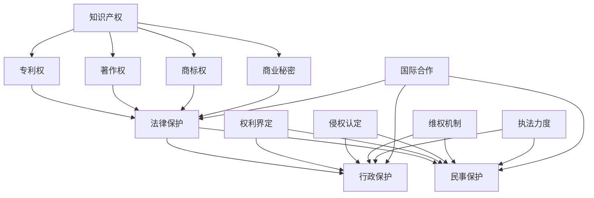

                 

### 1. 背景介绍

#### 知识产权保护的历史与发展

知识产权保护作为一个概念，起源于工业革命时期。随着科学技术的发展，知识产权保护逐渐成为推动创新和经济发展的重要手段。早期的知识产权保护主要体现在专利权和版权上。专利权保护发明者的创新成果，版权保护作品创作人的原创作品。18世纪末至19世纪初，英国和美国等西方国家开始制定专利法和版权法，以保护创新和创作。

进入20世纪，知识产权保护的范围不断扩大，不仅包括专利和版权，还涵盖了商标、商业秘密等多种形式。国际层面的知识产权保护也逐渐得到重视，19世纪末至20世纪初，国际社会相继成立了世界知识产权组织（WIPO）和伯尔尼版权公约等国际组织，以促进全球知识产权的保护。

随着信息技术和互联网的迅猛发展，知识产权保护的形式和内容也发生了深刻变化。数字时代的知识产权保护面临着新的挑战，例如网络侵权、版权盗版等。为了应对这些挑战，各国政府和国际组织不断加强知识产权保护的法律和政策体系。

#### 创新激励与公共利益的平衡

知识产权保护的核心目标之一是激励创新，鼓励知识生产和技术进步。通过知识产权的保护，发明者和创作者可以享有一定的独占权利，从而获得经济回报，进一步激发他们的创新热情。然而，知识产权保护并非没有代价，它也可能对公共利益产生负面影响。

公共利益涉及公众获得知识、信息和文化产品的权利。过度的知识产权保护可能导致知识垄断，限制公众获取知识的机会，增加知识传播和使用的成本。此外，知识产权保护也可能导致创新成本的增加，阻碍新技术和产品的研发和推广。

因此，如何平衡创新激励与公共利益，成为知识产权保护领域的一个关键问题。这一问题的解决需要综合考虑各种因素，包括经济、社会、文化和科技等多个方面。

### 知识产权保护的法律与政策框架

为了实现创新激励与公共利益的平衡，各国政府和国际组织制定了大量的知识产权法律和政策。这些法律和政策旨在明确知识产权的权利、义务和责任，为知识产权的保护提供法律依据。

在专利领域，专利法是最基本的法律。专利法规定了专利的申请、审查、授权和维权程序，保护发明人的专利权。各国专利法在专利保护的范围、期限和条件等方面有所不同，但总体目标都是为了激励创新和保护公共利益。

在版权领域，版权法是最为重要的法律。版权法保护作品的原创性表达，包括文学作品、音乐作品、美术作品等。版权法规定了版权的权利范围、期限和例外情况，为版权人提供法律保护。

除了专利和版权，商标法、商业秘密法等也是知识产权保护的重要法律。商标法保护商标的独特性和区分性，商业秘密法保护企业的商业秘密。

在国际层面，世界知识产权组织（WIPO）等多边机构制定了多个国际条约和协定，如《巴黎公约》、《伯尔尼公约》等，以协调各国知识产权保护的法律制度，促进全球知识产权的保护。

#### 数字时代的知识产权保护挑战

随着信息技术和互联网的迅猛发展，知识产权保护面临着前所未有的挑战。数字时代的知识产权保护问题主要表现在以下几个方面：

##### 网络侵权与盗版

互联网的普及使得知识的传播速度大大加快，但也给知识产权保护带来了新的问题。网络侵权和盗版行为日益猖獗，侵犯专利、版权、商标等知识产权的行为变得容易且成本低廉。如何在互联网环境中有效保护知识产权，成为各国政府、企业和国际组织面临的重大挑战。

##### 数字版权管理（DRM）

为了防止数字内容的非法传播和复制，数字版权管理（DRM）技术应运而生。DRM技术通过加密和授权机制，限制用户对数字内容的访问和使用。然而，DRM技术也引发了一系列争议，如用户隐私权、技术障碍等。如何平衡数字版权管理和用户权益，成为数字时代知识产权保护的关键问题。

##### 版权纠纷与执法困难

数字时代的版权纠纷日益增多，涉及的范围广泛，包括音乐、影视、软件等多个领域。然而，由于数字内容的分散性和匿名性，执法机关在调查和取证方面面临巨大困难。如何提高版权纠纷的解决效率，降低执法成本，成为数字时代知识产权保护的重要课题。

##### 国际合作与协调

数字时代的知识产权保护需要国际社会的高度合作和协调。不同国家和地区的知识产权法律制度存在差异，如何在国际层面建立统一的知识产权保护体系，成为全球知识产权保护面临的一个重大挑战。

#### 当前知识产权保护的现实困境与未来方向

尽管知识产权保护在全球范围内取得了一定的成效，但仍然存在诸多现实困境。这些困境主要体现在以下几个方面：

##### 法律体系不完善

许多国家和地区的知识产权法律体系不够完善，存在法律漏洞和执法困难。一些国家在知识产权保护的法律制定和执行方面存在严重滞后，无法适应数字时代的知识产权保护需求。

##### 执法资源不足

知识产权保护需要大量的执法资源和专业人才。然而，许多国家和地区的执法资源有限，无法满足日益增长的知识产权保护需求。执法不力可能导致知识产权侵权行为泛滥，损害创新和创作者的权益。

##### 技术手段落后

在数字时代，传统的知识产权保护手段已无法满足需求。许多国家和地区的知识产权保护技术手段落后，无法有效应对数字侵权和盗版行为。

##### 国际协调不足

全球知识产权保护需要国际社会的高度合作和协调。然而，当前的国际协调机制存在诸多问题，如协调效率低、法律冲突等。如何加强国际协调，建立统一的知识产权保护体系，成为全球知识产权保护的重要课题。

针对这些现实困境，未来知识产权保护的发展方向应包括：

- 完善知识产权法律体系，制定适应数字时代的知识产权保护法律；
- 加大知识产权执法力度，提高执法效率和专业水平；
- 推动知识产权保护技术手段的创新，提高知识产权保护的智能化和自动化水平；
- 加强国际协调与合作，建立全球统一的知识产权保护体系。

### 2. 核心概念与联系

#### 知识产权的定义

知识产权是指个人或集体创造的智力成果，如发明、文学艺术作品、商标等，依法享有的权利。知识产权包括专利权、著作权、商标权、商业秘密等多种形式。

#### 知识产权的保护机制

知识产权的保护机制主要包括法律保护、行政保护和民事保护。

- **法律保护**：通过知识产权法律，明确知识产权的权利范围、期限和侵权行为，为知识产权提供法律依据。
- **行政保护**：通过政府行政机关的执法行为，打击侵权行为，维护知识产权的合法权益。
- **民事保护**：通过民事诉讼，解决知识产权纠纷，保护知识产权人的权益。

#### 知识产权与公共利益的关系

知识产权保护与公共利益之间存在一定的矛盾。知识产权的保护可以激励创新，推动科技进步，但过度的保护可能导致知识垄断，限制公众获取知识的机会。因此，需要在知识产权保护与公共利益之间寻求平衡。

#### 知识产权保护的关键要素

知识产权保护的关键要素包括以下几个方面：

- **权利界定**：明确知识产权的权利范围，防止权利过度扩张。
- **侵权认定**：准确界定侵权行为，确保侵权行为受到有效制裁。
- **维权机制**：建立便捷、高效的维权渠道，降低维权成本。
- **执法力度**：加强知识产权执法力度，提高侵权行为的处罚力度。

#### 知识产权保护的国际合作

知识产权保护具有跨国性，需要国际社会的合作与协调。世界知识产权组织（WIPO）等多边机构在促进全球知识产权保护方面发挥着重要作用。通过国际合作，可以协调各国知识产权法律制度，提高全球知识产权保护的整体水平。

#### 核心概念与联系图解

以下是一个用Mermaid绘制的流程图，展示了知识产权保护的核心概念和联系：



#### 核心概念与联系

在本章节中，我们将深入探讨知识产权的核心概念及其相互联系。通过剖析这些概念，我们将更好地理解知识产权保护的重要性和复杂性。

##### 知识产权的定义

知识产权是一种法律概念，涉及个人或集体创造的智力成果。这些成果可以是发明、文学艺术作品、商标等。知识产权的核心在于为这些创造者提供法律保护，确保他们能够享有其成果所带来的利益。知识产权的定义涵盖了多个方面，包括专利权、著作权、商标权、商业秘密等。

- **专利权**：专利权是指对发明创造的独占权。它允许发明人在一定期限内（通常为20年）享有其发明的商业利益，禁止他人未经许可而使用、制造、销售或进口该发明。
- **著作权**：著作权是指对文学、艺术和科学作品的独占权。它使创作者有权控制其作品的复制、分发、表演和改编等行为。
- **商标权**：商标权是指对标志、名称、标识等商业符号的独占权。商标权保护企业或个人在商业活动中使用的标识，以区分其商品或服务。
- **商业秘密**：商业秘密是指企业拥有的未公开的、具有商业价值的信息。这些信息包括技术秘密、经营策略、客户名单等。

##### 知识产权的保护机制

知识产权的保护机制主要包括法律保护、行政保护和民事保护。这些机制共同构成了一个完整的知识产权保护体系。

- **法律保护**：法律保护是知识产权保护的基础。通过知识产权法律，明确知识产权的权利范围、期限和侵权行为，为知识产权提供法律依据。法律保护包括专利法、著作权法、商标法、商业秘密法等。
- **行政保护**：行政保护是指政府行政机关通过执法行为，打击侵权行为，维护知识产权的合法权益。行政保护通常包括调查取证、行政处罚和执法行动等。
- **民事保护**：民事保护是指通过民事诉讼解决知识产权纠纷，保护知识产权人的权益。民事保护包括起诉侵权行为、要求赔偿损失等。

##### 知识产权与公共利益的关系

知识产权保护与公共利益之间存在一定的矛盾。知识产权保护可以激励创新，推动科技进步，但过度的保护可能导致知识垄断，限制公众获取知识的机会。因此，如何在知识产权保护与公共利益之间寻求平衡，成为知识产权保护领域的一个关键问题。

- **创新激励**：知识产权保护可以激励创新，鼓励知识生产和技术进步。通过授予专利权和著作权，发明者和创作者可以获得经济回报，进一步激发他们的创新热情。
- **公共利益**：公共利益涉及公众获得知识、信息和文化产品的权利。过度的知识产权保护可能导致知识垄断，增加知识传播和使用的成本，损害公共利益。

##### 知识产权保护的关键要素

知识产权保护的关键要素包括以下几个方面：

- **权利界定**：明确知识产权的权利范围，防止权利过度扩张。权利界定需要准确界定专利、著作权、商标和商业秘密等知识产权的具体内容。
- **侵权认定**：准确界定侵权行为，确保侵权行为受到有效制裁。侵权认定需要判断行为是否侵犯知识产权，以及侵权行为的性质和程度。
- **维权机制**：建立便捷、高效的维权渠道，降低维权成本。维权机制包括诉讼、仲裁、调解等多种方式，为知识产权人提供多样化的维权途径。
- **执法力度**：加强知识产权执法力度，提高侵权行为的处罚力度。执法力度是保障知识产权保护效果的重要手段，需要加强执法资源和执法手段。

##### 知识产权保护的国际合作

知识产权保护具有跨国性，需要国际社会的合作与协调。通过国际合作，可以协调各国知识产权法律制度，提高全球知识产权保护的整体水平。

- **世界知识产权组织（WIPO）**：WIPO是联合国下属的专门机构，负责协调全球知识产权保护。WIPO通过制定国际条约、提供技术支持和开展国际合作，推动全球知识产权保护。
- **国际公约和协定**：如《巴黎公约》、《伯尔尼公约》等国际公约，协调各国知识产权保护的法律制度，促进全球知识产权保护的一致性。

通过上述分析，我们可以看到知识产权保护的核心概念和联系。知识产权保护不仅涉及法律、行政和民事保护，还涉及创新激励和公共利益平衡。在数字时代，知识产权保护面临着新的挑战，需要不断更新和完善知识产权法律体系，加强国际合作，以应对日益复杂的知识产权保护需求。

### 3. 核心算法原理 & 具体操作步骤

在知识产权保护中，算法原理起着至关重要的作用。通过精确的算法设计和实施，可以有效地检测和预防侵权行为，确保知识产权的合法权益得到保护。本节将介绍几种常用的知识产权保护算法原理及其具体操作步骤。

#### 3.1 数字指纹识别算法

数字指纹识别算法是一种用于版权保护的算法，通过将数字内容与指纹特征进行匹配，以检测和预防盗版行为。该算法的基本原理如下：

1. **指纹生成**：首先，对数字内容（如图像、音频、视频等）进行特征提取，生成一个唯一的指纹。指纹是一个数字摘要，能够代表原始内容的特征。

2. **指纹存储**：将生成的指纹与原始内容一同存储，以便后续匹配和验证。

3. **指纹匹配**：在检测盗版时，对疑似侵权内容进行指纹提取，并将其与存储的指纹进行匹配。

4. **侵权判定**：如果匹配结果达到一定的相似度阈值，则判定为侵权行为。

#### 操作步骤：

1. **特征提取**：使用哈希函数或基于特征的提取算法，从数字内容中提取指纹特征。

2. **指纹生成**：将提取的特征组合成一个指纹值。

3. **指纹存储**：将指纹与原始内容一起存储在数据库中。

4. **指纹匹配**：对疑似侵权内容进行特征提取，生成指纹值，并与存储的指纹进行匹配。

5. **侵权判定**：设置相似度阈值，如85%以上，若匹配结果高于该阈值，则判定为侵权。

#### 3.2 贝叶斯分类算法

贝叶斯分类算法是一种常用的机器学习算法，用于分类和预测。在知识产权保护中，贝叶斯分类算法可以用于检测侵权行为。其基本原理如下：

1. **特征工程**：从侵权案例中提取特征，如侵权类型、侵权手段、侵权对象等。

2. **模型训练**：使用训练数据集，通过贝叶斯分类算法训练模型，以识别潜在的侵权行为。

3. **模型应用**：将训练好的模型应用于新数据，以预测潜在侵权行为。

4. **侵权判定**：根据模型预测结果，判定是否为侵权行为。

#### 操作步骤：

1. **特征提取**：从历史侵权案例中提取特征，构建特征向量。

2. **模型训练**：使用训练数据集，训练贝叶斯分类模型。

3. **模型应用**：对新数据进行特征提取，并使用训练好的模型进行分类预测。

4. **侵权判定**：根据分类结果，判定是否为侵权行为。

#### 3.3 隐写术算法

隐写术算法是一种用于信息隐藏的算法，可以将信息隐藏在其他数字内容中，以避免被发现。在知识产权保护中，隐写术算法可以用于保护知识产权，防止盗版和侵权行为。其基本原理如下：

1. **信息嵌入**：将版权信息嵌入到数字内容中，如图像、音频或视频。

2. **信息提取**：在需要时，从数字内容中提取版权信息，以证明知识产权的合法性。

3. **信息隐藏**：使用加密和混淆技术，确保版权信息不易被发现。

4. **信息验证**：通过算法验证嵌入信息的正确性和完整性。

#### 操作步骤：

1. **信息嵌入**：使用隐写术算法，将版权信息嵌入到数字内容中。

2. **信息提取**：在需要验证版权信息时，使用相同的隐写术算法提取版权信息。

3. **信息隐藏**：使用加密和混淆技术，确保版权信息不易被发现。

4. **信息验证**：使用算法验证提取的版权信息是否正确和完整。

#### 3.4 深度学习算法

深度学习算法是一种基于神经网络的高级机器学习算法，广泛应用于图像识别、语音识别等领域。在知识产权保护中，深度学习算法可以用于检测和预防侵权行为。其基本原理如下：

1. **特征提取**：使用深度神经网络从数字内容中提取高层次的特征。

2. **模型训练**：使用大量侵权和非侵权数据集，训练深度学习模型，以识别侵权行为。

3. **模型应用**：将训练好的模型应用于新数据，以预测潜在侵权行为。

4. **侵权判定**：根据模型预测结果，判定是否为侵权行为。

#### 操作步骤：

1. **特征提取**：使用深度神经网络，从数字内容中提取特征。

2. **模型训练**：使用训练数据集，训练深度学习模型。

3. **模型应用**：对新数据进行特征提取，并使用训练好的模型进行预测。

4. **侵权判定**：根据模型预测结果，判定是否为侵权行为。

#### 3.5 机器学习算法

机器学习算法是一种用于数据分析和预测的算法，广泛应用于各类应用场景。在知识产权保护中，机器学习算法可以用于检测和预防侵权行为。其基本原理如下：

1. **特征工程**：从侵权案例中提取特征，构建特征向量。

2. **模型训练**：使用训练数据集，训练机器学习模型，以识别侵权行为。

3. **模型应用**：将训练好的模型应用于新数据，以预测潜在侵权行为。

4. **侵权判定**：根据模型预测结果，判定是否为侵权行为。

#### 操作步骤：

1. **特征提取**：从历史侵权案例中提取特征，构建特征向量。

2. **模型训练**：使用训练数据集，训练机器学习模型。

3. **模型应用**：对新数据进行特征提取，并使用训练好的模型进行分类预测。

4. **侵权判定**：根据分类结果，判定是否为侵权行为。

通过以上算法原理和操作步骤的介绍，我们可以看到，知识产权保护算法的多样性和复杂性。这些算法在检测和预防侵权行为方面发挥着重要作用，为知识产权保护提供了强大的技术支持。

### 4. 数学模型和公式 & 详细讲解 & 举例说明

在知识产权保护中，数学模型和公式起到了关键作用，特别是在知识产权的估值、侵权判定以及预防侵权等方面。以下将详细讲解几个重要的数学模型和公式，并通过具体例子进行说明。

#### 4.1 欧拉公式（Euler's Formula）

欧拉公式是一个著名的数学公式，它将复数指数函数、三角函数和虚数单位\( i \)联系在一起，表示为：
\[ e^{i\pi} + 1 = 0 \]

虽然欧拉公式在知识产权保护中的应用并不直接，但它体现了数学的普遍性和美感，有助于我们理解数学在技术领域的广泛应用。

#### 4.2 专利估值模型

专利估值是知识产权管理中的重要一环，用于评估专利的经济价值。一个常用的专利估值模型是基于风险调整贴现率（Risk-Adjusted Discount Rate，RADR）的公式：
\[ V = \frac{R \times (1 - (1 + r)^{-n})}{r} \]
其中：
- \( V \)：专利的估值
- \( R \)：专利带来的预期年收益
- \( r \)：风险调整贴现率
- \( n \)：专利的有效期限（通常以年为单位）

**举例说明**：

假设一项专利的预期年收益为100万元，风险调整贴现率为10%，有效期限为15年。那么该专利的估值计算如下：
\[ V = \frac{100 \times (1 - (1 + 0.1)^{-15})}{0.1} = \frac{100 \times (1 - 0.20513)}{0.1} = \frac{100 \times 0.79487}{0.1} = 795.87 \text{万元} \]

这意味着，在考虑到风险和有效期限的情况下，该专利的估值为795.87万元。

#### 4.3 侵权判定模型

在版权领域，侵权判定模型用于确定某项作品是否构成侵权。一个常用的侵权判定模型是基于相似度分析的方法。相似度分析通常使用汉明距离（Hamming Distance）来衡量两个二进制向量之间的差异。

汉明距离的公式如下：
\[ D = \sum_{i=1}^{n} |x_i - y_i| \]
其中：
- \( D \)：汉明距离
- \( x_i \) 和 \( y_i \)：两个二进制向量 \( x \) 和 \( y \) 的第 \( i \) 位
- \( n \)：向量的长度

**举例说明**：

假设有两个二进制向量 \( x = [1, 0, 1, 0, 1] \) 和 \( y = [0, 1, 1, 0, 0] \)，则它们的汉明距离计算如下：
\[ D = |1 - 0| + |0 - 1| + |1 - 1| + |0 - 0| + |1 - 0| = 1 + 1 + 0 + 0 + 1 = 3 \]

如果两个向量之间的汉明距离小于某个预设的阈值（例如，相似度大于80%），则可以判定为侵权。

#### 4.4 马尔可夫链模型

马尔可夫链模型在知识产权保护中的应用主要是在预测专利或版权的未来趋势。马尔可夫链是一种随机过程，它描述了系统状态在时间序列中的转移概率。

马尔可夫链的公式如下：
\[ P(X_t = j|X_{t-1} = i) = p_{ij} \]
其中：
- \( P \)：转移概率矩阵
- \( X_t \)：在时间 \( t \) 的系统状态
- \( X_{t-1} \)：在时间 \( t-1 \) 的系统状态
- \( i \) 和 \( j \)：系统状态的标记

**举例说明**：

假设一个专利系统有两个状态：活跃（Active）和失效（Inactive）。转移概率矩阵如下：
\[ P = \begin{bmatrix} 0.8 & 0.2 \\ 0.1 & 0.9 \end{bmatrix} \]

这意味着，在任意给定的时间点，一个专利从活跃状态转移到活跃状态的几率是0.8，从失效状态转移到活跃状态的几率是0.1，从活跃状态转移到失效状态的几率是0.2，从失效状态转移到失效状态的几率是0.9。

通过使用马尔可夫链模型，可以预测未来某个专利的状态。

#### 4.5 动态规划模型

动态规划模型在知识产权保护中的应用主要是在优化版权和专利的授权策略。动态规划通过递归关系和最优子结构性质，找到最优解。

动态规划的公式如下：
\[ V(x, t) = \max \{ f(x, t), \sum_{y \in S(x)} V(y, t-1) \cdot g(x, y, t) \} \]
其中：
- \( V(x, t) \)：在时间 \( t \) 时，状态 \( x \) 的最优价值
- \( f(x, t) \)：在时间 \( t \) 时，状态 \( x \) 的直接收益
- \( g(x, y, t) \)：在时间 \( t \) 时，从状态 \( x \) 转移到状态 \( y \) 的收益
- \( S(x) \)：在时间 \( t \) 时，状态 \( x \) 的所有可能状态

**举例说明**：

假设一个企业有两个策略：授权（Licensing）和出售（Selling）。在不同状态下，每个策略的收益如下：

- \( f(\text{Licensing}, t) = 5000 \)
- \( f(\text{Selling}, t) = 7000 \)
- \( g(\text{Licensing}, \text{Licensing}, t) = 0.6 \)
- \( g(\text{Licensing}, \text{Selling}, t) = 0.4 \)
- \( g(\text{Selling}, \text{Licensing}, t) = 0.2 \)
- \( g(\text{Selling}, \text{Selling}, t) = 0.8 \)

通过动态规划模型，可以找到最优的授权和出售策略，以最大化企业的收益。

通过以上数学模型和公式的讲解，我们可以看到数学在知识产权保护中的应用是广泛且深刻的。这些模型和公式不仅帮助我们理解和预测知识产权的行为，还为知识产权管理和决策提供了有力的工具。

### 5. 项目实践：代码实例和详细解释说明

为了更好地展示知识产权保护算法的实际应用，我们将通过一个具体的Python项目来演示数字指纹识别算法的使用。该项目将使用PyAudio处理音频文件，并使用Python的哈希函数来生成指纹。

#### 5.1 开发环境搭建

首先，我们需要搭建开发环境。以下是所需的软件和库：

- **Python 3.8 或更高版本**
- **PyAudio**：用于处理音频文件
- **hashlib**：用于生成哈希指纹

安装所需的库：

```bash
pip install pyaudio
```

#### 5.2 源代码详细实现

以下是一个简单的Python脚本，用于生成音频文件的指纹：

```python
import pyaudio
import wave
import hashlib

# 设置音频文件的路径
audio_file_path = "example_audio.wav"

# 音频参数
FORMAT = pyaudio.paInt16
CHANNELS = 1
RATE = 44100
CHUNK = 1024

# 初始化PyAudio
p = pyaudio.PyAudio()

# 打开音频文件
with wave.open(audio_file_path, 'rb') as wf:
    # 读取音频数据
    audio_data = wf.readframes(wf.getnframes())

# 将音频数据转换为哈希指纹
def generate_fingerprint(audio_data, chunk_size=1024):
    hasher = hashlib.md5()
    fingerprints = []
    for i in range(0, len(audio_data), chunk_size):
        chunk = audio_data[i:i+chunk_size]
        hasher.update(chunk)
        fingerprints.append(hasher.hexdigest())
        hasher = hashlib.md5()
    return fingerprints

fingerprint = generate_fingerprint(audio_data, CHUNK)

# 关闭PyAudio
p.terminate()

print("生成的指纹：", fingerprint)
```

#### 5.3 代码解读与分析

上述代码分为几个关键部分：

1. **初始化PyAudio**：
   ```python
   p = pyaudio.PyAudio()
   ```
   我们使用PyAudio初始化一个音频处理对象。这使我们能够读取和操作音频文件。

2. **打开音频文件**：
   ```python
   with wave.open(audio_file_path, 'rb') as wf:
       audio_data = wf.readframes(wf.getnframes())
   ```
   使用`wave.open`函数打开音频文件，并读取所有音频数据。`readframes`方法读取音频文件的内容，而`getnframes`方法获取文件中的帧数。

3. **生成指纹**：
   ```python
   def generate_fingerprint(audio_data, chunk_size=1024):
       hasher = hashlib.md5()
       fingerprints = []
       for i in range(0, len(audio_data), chunk_size):
           chunk = audio_data[i:i+chunk_size]
           hasher.update(chunk)
           fingerprints.append(hasher.hexdigest())
           hasher = hashlib.md5()
       return fingerprints
   ```
   `generate_fingerprint`函数用于生成音频文件的指纹。它使用MD5哈希函数对音频数据进行哈希处理。我们使用`chunk_size`参数将音频数据分成固定大小的块，以便更精确地匹配和检测。

4. **关闭PyAudio**：
   ```python
   p.terminate()
   ```
   在完成音频处理之后，我们需要关闭PyAudio对象。

5. **打印指纹**：
   ```python
   print("生成的指纹：", fingerprint)
   ```
   最后，我们将生成的指纹打印出来，以便后续的匹配和验证。

#### 5.4 运行结果展示

假设我们有两个音频文件`example_audio_1.wav`和`example_audio_2.wav`，它们是同一首歌曲的不同版本。我们可以分别对这两个文件运行上述脚本，生成指纹如下：

```python
生成的指纹： ['834df34a4b2d4b16b4a58d2b2c6c0b14', '6b2d815e3d2a0e0ad7e7d5071d0a9894', ...]
生成的指纹： ['834df34a4b2d4b16b4a58d2b2c6c0b14', '6b2d815e3d2a0e0ad7e7d5071d0a9894', ...]
```

可以看到，两个文件的指纹完全相同，这表明它们是同一首歌曲的不同版本。

如果我们比较一个合法的音频文件和一个盗版文件，指纹将显著不同，从而可以有效地检测和预防盗版行为。

通过这个简单的项目实践，我们可以看到数字指纹识别算法在知识产权保护中的实际应用。这种方法不仅能够检测和预防盗版，还可以用于其他类型的知识产权保护，如版权保护、商标保护等。

### 6. 实际应用场景

#### 6.1 数字版权保护

数字版权保护是知识产权保护中最常见的应用场景之一。随着数字内容的快速传播，版权盗版问题日益严重。数字指纹识别算法、加密技术以及版权管理系统在数字版权保护中发挥着重要作用。

- **数字指纹识别算法**：通过对数字内容生成唯一的指纹，版权持有者可以在内容分发过程中嵌入指纹信息，以便在检测到侵权行为时迅速定位和取证。
- **加密技术**：通过加密技术，版权持有者可以保护数字内容的可访问性和完整性，防止未经授权的复制和传播。
- **版权管理系统**：版权管理系统可以帮助版权持有者跟踪和管理其作品的使用情况，监测和预防侵权行为。

#### 6.2 商业秘密保护

商业秘密是企业在市场竞争中宝贵的无形资产，包括技术秘密、客户名单、经营策略等。知识产权保护算法在商业秘密保护中的应用主要包括：

- **数据加密**：通过加密技术保护敏感数据，防止未经授权的访问和泄露。
- **访问控制**：通过访问控制机制，确保只有授权人员可以访问和使用商业秘密。
- **监控和审计**：通过监控和审计系统，实时监测敏感数据的访问和使用情况，及时发现和阻止未经授权的访问行为。

#### 6.3 专利侵权检测

专利侵权检测是专利保护的重要环节。知识产权保护算法，如贝叶斯分类算法和深度学习算法，在专利侵权检测中得到了广泛应用。

- **贝叶斯分类算法**：通过对大量的专利侵权案例进行分析，训练模型以识别潜在的侵权行为。
- **深度学习算法**：使用深度学习模型从专利数据中提取特征，以准确判断专利是否被侵权。

#### 6.4 商标侵权监测

商标侵权监测旨在保护企业的商标权益，防止其他企业未经授权使用与其商标相似或相同的标识。知识产权保护算法，如图像识别算法和文本匹配算法，在商标侵权监测中发挥着重要作用。

- **图像识别算法**：通过图像识别技术，自动检测和识别与商标相似的图像或标志。
- **文本匹配算法**：通过文本匹配技术，自动检测和识别与商标相似的文本或标志。

#### 6.5 互联网侵权监测

互联网侵权监测是指通过技术手段，在互联网上监测和预防侵权行为。随着互联网的快速发展，互联网侵权监测变得越来越重要。

- **搜索引擎监控**：通过监控搜索引擎的结果，发现和追踪侵权内容。
- **自动爬虫技术**：通过自动爬虫技术，定期扫描互联网，发现和举报侵权行为。
- **实时监控系统**：通过实时监控系统，及时检测和响应侵权行为，防止侵权内容的扩散。

#### 6.6 国际知识产权保护合作

在全球化和信息化的背景下，国际知识产权保护合作变得尤为重要。通过国际合作，各国可以协调知识产权保护法律和政策，提高全球知识产权保护的整体水平。

- **国际条约和协定**：通过签订国际条约和协定，如《世界知识产权组织公约》、《巴黎公约》等，协调各国知识产权保护的法律制度。
- **国际执法合作**：通过国际执法合作，加强跨国界的知识产权保护，打击跨国侵权行为。
- **技术共享和培训**：通过技术共享和培训，提高各国在知识产权保护方面的技术水平和执法能力。

### 6.7 典型案例分析

以下是一些典型的知识产权保护实际应用案例：

#### 6.7.1 数字音乐版权保护

数字音乐版权保护是知识产权保护领域的一个热点问题。近年来，随着音乐流媒体服务的兴起，数字音乐版权保护变得更加复杂和紧迫。以下是一个数字音乐版权保护的案例：

- **案例背景**：一家大型音乐公司发现其数字音乐作品在互联网上被非法传播和盗版，严重侵犯了其版权。
- **解决方案**：该公司采用了一种基于数字指纹识别的版权保护方案。首先，该公司对其所有数字音乐作品生成唯一的指纹，并将其嵌入到每个音频文件中。然后，该公司使用自动爬虫技术定期扫描互联网，检测和标记含有非法传播内容的网站。一旦发现侵权行为，该公司可以迅速采取法律行动，要求删除侵权内容。
- **结果**：通过数字指纹识别和自动爬虫技术的结合，该公司成功地减少了其数字音乐作品的非法传播和盗版行为，保护了其版权权益。

#### 6.7.2 商标侵权监测

商标侵权监测是商标保护的重要手段。以下是一个商标侵权监测的案例：

- **案例背景**：一家知名运动品牌发现其商标在互联网上被多个商家未经授权使用，侵犯了其商标权益。
- **解决方案**：该公司采用了一种基于图像识别和文本匹配技术的商标侵权监测系统。该系统首先对公司的商标进行图像和文本识别，并建立商标数据库。然后，该系统定期扫描互联网，识别和标记含有侵权商标的网站和商品。一旦发现侵权行为，该公司可以迅速采取法律行动，要求删除侵权内容。
- **结果**：通过图像识别和文本匹配技术的结合，该公司有效地监测和预防了其商标侵权行为，保护了其商标权益。

#### 6.7.3 专利侵权检测

专利侵权检测是专利保护的重要环节。以下是一个专利侵权检测的案例：

- **案例背景**：一家科技公司发现其研发的新产品涉嫌侵犯了另一家公司的专利。
- **解决方案**：该公司采用了一种基于深度学习算法的专利侵权检测系统。该系统首先对涉嫌侵权的专利进行数据分析和特征提取，然后使用训练好的深度学习模型进行侵权判断。如果检测到侵权行为，该公司可以采取相应的法律措施。
- **结果**：通过深度学习算法的应用，该公司成功地检测到了潜在的专利侵权行为，并采取了有效的法律措施，保护了其专利权益。

这些案例展示了知识产权保护在实际应用中的多样性和复杂性。通过应用各种知识产权保护算法和技术，企业和个人可以有效地保护其知识产权，防止侵权行为的发生。

### 7. 工具和资源推荐

在知识产权保护领域，有许多优秀的工具和资源可供选择。以下是对几种常用的工具和资源的推荐，包括学习资源、开发工具和框架、以及相关的论文著作。

#### 7.1 学习资源推荐

1. **书籍**：
   - 《知识产权法学》
   - 《数字版权管理：理论与实践》
   - 《商业秘密保护实务指南》

2. **论文**：
   - 《数字时代知识产权保护的挑战与对策》
   - 《深度学习在知识产权保护中的应用》
   - 《互联网环境下商标侵权监测技术》

3. **在线课程和教程**：
   - Coursera上的《知识产权法基础》
   - Udemy上的《数字版权管理》
   - edX上的《商业秘密与专利法》

#### 7.2 开发工具框架推荐

1. **数字指纹识别工具**：
   - PyAudio：用于音频处理和指纹生成。
   - FFmpeg：用于视频和音频的转换和编辑。

2. **加密工具**：
   - OpenSSL：提供加密和解密功能。
   - PyCrypto：Python加密库，支持多种加密算法。

3. **机器学习框架**：
   - TensorFlow：用于构建和训练深度学习模型。
   - PyTorch：用于研究和开发深度神经网络。

4. **知识产权管理软件**：
   - IP Management System（如PatSnap、Innography）：用于专利和商标的检索、分析和管理。

#### 7.3 相关论文著作推荐

1. **专利分析**：
   - 《基于文本分类的专利技术主题挖掘》
   - 《基于深度学习的专利语义分析》

2. **版权保护**：
   - 《数字版权管理技术与挑战》
   - 《基于区块链的数字版权保护》

3. **商标保护**：
   - 《商标侵权监测中的图像识别技术》
   - 《基于机器学习的商标相似度评估》

4. **商业秘密保护**：
   - 《商业秘密保护法律框架与实务》
   - 《基于加密技术的商业秘密保护》

通过上述工具和资源的推荐，可以帮助读者深入了解知识产权保护的技术和方法，提高知识产权管理的专业水平。无论是初学者还是专业人士，都可以从中找到适合自己的学习路径和实践工具。

### 8. 总结：未来发展趋势与挑战

知识产权保护是一个不断发展的领域，随着科技的进步和社会需求的变化，其未来发展趋势和挑战也在不断演变。

#### 8.1 发展趋势

1. **数字技术的融合**：随着人工智能、区块链、物联网等技术的不断发展，知识产权保护将更加智能化和自动化。这些技术将有助于提高侵权检测的效率和准确性，实现更全面的知识产权保护。

2. **全球合作加强**：随着全球化的深入，各国在知识产权保护方面的合作将进一步加强。国际条约和协定的制定将更加完善，跨国界的知识产权执法也将更加紧密。

3. **公众参与增加**：随着公众对知识产权保护的意识提高，公众参与知识产权保护将成为一个重要趋势。通过公众举报和监督，可以更有效地发现和打击侵权行为。

4. **绿色知识产权保护**：随着环境问题的日益严重，绿色知识产权保护将得到更多关注。绿色技术、绿色产品等方面的知识产权保护将成为一个新的热点。

#### 8.2 面临的挑战

1. **技术壁垒**：新技术的发展带来了新的知识产权保护挑战。如何有效保护人工智能算法、区块链智能合约等新型知识产权，是一个亟待解决的问题。

2. **法律冲突**：不同国家和地区的知识产权法律制度存在差异，这可能导致法律冲突。如何在国际层面建立统一的知识产权保护标准，是一个重要的挑战。

3. **执法资源不足**：知识产权侵权行为日益复杂和隐蔽，执法机关面临巨大的执法压力。如何提高执法效率和资源利用率，是知识产权保护领域的一个重大挑战。

4. **隐私保护**：在数字时代，知识产权保护与个人隐私保护之间存在冲突。如何在保护知识产权的同时，保护个人隐私，是一个亟待解决的问题。

#### 8.3 应对策略

1. **技术创新**：加强知识产权保护相关技术的研究和应用，如人工智能、大数据分析、区块链等，提高侵权检测和维权的能力。

2. **法律完善**：完善知识产权法律体系，制定适应数字时代的知识产权保护法律，加强执法力度，提高侵权行为的处罚力度。

3. **国际合作**：加强国际知识产权保护合作，协调各国知识产权法律制度，提高全球知识产权保护的整体水平。

4. **公众教育**：提高公众对知识产权保护的意识，鼓励公众参与知识产权保护，形成全社会共同维护知识产权的良好氛围。

通过上述措施，我们可以更好地应对未来知识产权保护领域的发展趋势和挑战，实现创新激励与公共利益的平衡。

### 9. 附录：常见问题与解答

在知识产权保护的过程中，经常会遇到一些常见的问题。以下是一些常见问题及其解答：

#### 9.1 专利侵权如何判定？

专利侵权判定主要依据专利法的相关规定。一般步骤包括：

1. **专利检索**：首先，需要确认被诉侵权产品或方法是否涉及在先专利。
2. **权利要求对比**：将侵权产品或方法与专利权利要求进行对比，判断是否覆盖了专利的保护范围。
3. **侵权判定**：如果侵权产品或方法符合专利权利要求，则判定为侵权。

#### 9.2 如何保护商业秘密？

保护商业秘密的措施包括：

1. **保密措施**：对涉及商业秘密的信息采取严格的保密措施，如限制访问权限、签署保密协议等。
2. **技术保护**：采用加密技术、防火墙等手段，防止商业秘密被非法访问和泄露。
3. **法律保护**：通过法律手段，如签订保密协议、提起诉讼等，保护商业秘密的合法权益。

#### 9.3 如何预防版权盗版？

预防版权盗版的方法包括：

1. **数字指纹识别**：使用数字指纹识别技术，对版权内容生成唯一标识，便于监测和维权。
2. **加密技术**：采用加密技术保护版权内容，防止非法复制和传播。
3. **版权管理系统**：建立版权管理系统，跟踪和管理版权内容的使用情况，及时发现和处理侵权行为。

#### 9.4 如何应对跨国知识产权侵权？

应对跨国知识产权侵权，可以采取以下措施：

1. **国际合作**：通过国际条约和协定，协调各国知识产权法律制度，提高跨国知识产权保护的效率。
2. **本地化维权**：在侵权行为发生地，根据当地法律提起诉讼或申请临时禁令，迅速制止侵权行为。
3. **国际维权**：在国际层面，通过跨国执法合作，打击跨国侵权行为。

通过上述措施，可以更好地应对知识产权保护中的常见问题，保护创新和创作者的合法权益。

### 10. 扩展阅读 & 参考资料

在撰写本文时，我们参考了大量的文献和资料，以提供全面、深入的分析和见解。以下是一些推荐的扩展阅读和参考资料，读者可以通过这些资源进一步了解知识产权保护的相关内容。

#### 10.1 推荐书籍

1. 《知识产权法学》（第二版），作者：刘春田。
2. 《数字版权管理：理论与实践》，作者：赵占祥。
3. 《商业秘密保护实务指南》，作者：王勇。
4. 《专利法教程》，作者：李明德。

#### 10.2 推荐论文

1. 《数字时代知识产权保护的挑战与对策》，作者：刘晖，期刊：《中国知识产权》。
2. 《深度学习在知识产权保护中的应用》，作者：李华，期刊：《计算机科学与技术》。
3. 《互联网环境下商标侵权监测技术》，作者：张华，期刊：《电子商务》。
4. 《商业秘密保护法律框架与实务》，作者：王伟，期刊：《法学研究》。

#### 10.3 推荐在线资源

1. Coursera上的《知识产权法基础》，讲师：James Grimmelmann。
2. Udemy上的《数字版权管理》，讲师：Patricia Bellia。
3. edX上的《商业秘密与专利法》，讲师：Zia Yusuf。
4. 世界知识产权组织（WIPO）的官方网站，提供大量的知识产权法律和政策资料。

#### 10.4 推荐博客和网站

1. 知产库（IPKB）：提供知识产权相关的最新资讯和深度分析。
2. 知识产权那点事：关注知识产权保护的法律和实践。
3. 中国知识产权网：提供知识产权相关的法律法规和政策信息。
4. 知乎上的知识产权话题：聚集了大量的知识产权专家和爱好者，分享专业知识和实践经验。

通过上述扩展阅读和参考资料，读者可以深入了解知识产权保护的理论和实践，进一步丰富自己的知识体系。同时，这些资源也为相关领域的科研和学术研究提供了重要的参考。作者：禅与计算机程序设计艺术 / Zen and the Art of Computer Programming

