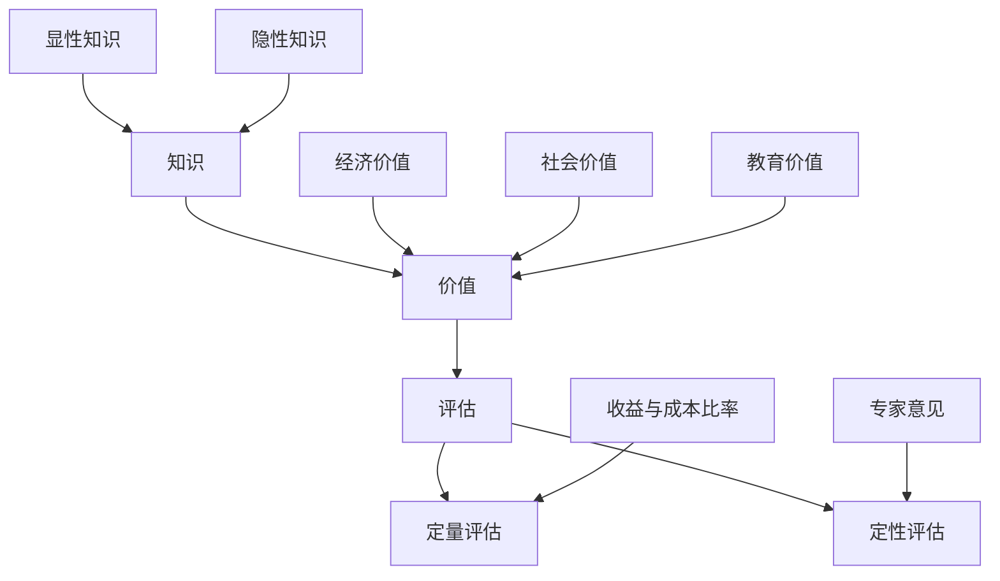

                 

### 背景介绍

在当今这个信息爆炸的时代，知识的产生和传播速度空前加快，知识本身也以指数级增长。然而，对于个人和企业来说，如何评估知识的价值，如何从海量信息中筛选出真正有价值的内容，成为了一个迫切需要解决的问题。知识的价值评估不仅仅是对知识本身的重要性进行衡量，更是对知识在实际应用中的潜在影响和效益进行预估。

知识经济时代，知识的价值成为经济增长的新动力。传统经济模式依赖的是自然资源和劳动力，而知识经济模式则强调智力资源和创新能力。在这样的背景下，知识的价值评估对于企业的战略决策、投资决策、研发投入等都有着至关重要的作用。对于个人来说，知识的价值评估有助于更有效地规划学习路径、提升自身能力，从而在职业生涯中获得竞争优势。

此外，随着人工智能和大数据技术的不断发展，对知识价值的评估方法也在不断创新。数据挖掘、机器学习等技术被广泛应用于知识价值的挖掘和评估，使得知识价值的评估更加科学、精准。然而，当前的研究仍存在许多挑战，如知识价值的动态性、知识类型的多样性、评估标准的统一性等。

本篇文章旨在探讨知识的价值评估这一主题，通过逐步分析，深入探讨核心概念、算法原理、数学模型、实际应用场景以及未来发展趋势。本文将分为以下几个部分：

1. **核心概念与联系**：介绍知识价值评估的相关概念，包括知识、价值、评估等，并绘制Mermaid流程图，展示这些概念之间的联系。
2. **核心算法原理 & 具体操作步骤**：阐述用于评估知识价值的算法原理，并详细描述其操作步骤。
3. **数学模型和公式 & 详细讲解 & 举例说明**：介绍评估知识价值的数学模型和公式，并结合实际案例进行说明。
4. **项目实践：代码实例和详细解释说明**：通过一个具体的项目实践，展示知识价值评估的实际应用。
5. **实际应用场景**：探讨知识价值评估在各个领域的应用案例。
6. **工具和资源推荐**：推荐学习资源和开发工具框架。
7. **总结：未来发展趋势与挑战**：总结本文的核心观点，并展望知识价值评估的未来发展趋势和面临的挑战。

通过对这些方面的详细探讨，本文希望能够为读者提供一个全面、深入的知识价值评估的视角，帮助读者更好地理解和应用这一重要概念。

### 核心概念与联系

为了深入探讨知识的价值评估，我们首先需要明确几个核心概念：知识、价值、评估。这些概念之间有着紧密的联系，理解它们有助于我们构建一个清晰的知识价值评估框架。

#### 知识 (Knowledge)

知识是指经过系统化、结构化处理的信息，是人们通过学习、实践和经验积累而获得的对客观世界的理解。知识可以分为显性知识和隐性知识。显性知识是指可以用文字、语言、图像等手段明确表达的知识，如书籍、论文、报告等。隐性知识则是指深藏于个人经验、技能和思维模式中的知识，难以用语言直接表达，但通过实践和模仿可以传递。

在知识经济时代，知识已经成为重要的生产要素。知识可以通过创新和应用，转化为生产力，推动经济增长。知识的类型多种多样，包括科学知识、技术知识、管理知识、人文知识等，不同类型的知识在价值评估中具有不同的权重和作用。

#### 价值 (Value)

价值是指事物对主体需求的满足程度。在知识价值评估中，价值是指知识对个体、组织或社会带来的实际效益。知识的价值可以从多个维度进行衡量，如经济价值、社会价值、文化价值、教育价值等。经济价值通常是指知识带来的直接经济效益，如提高生产效率、降低成本、增加收入等。社会价值则是指知识对社会进步和福祉的贡献，如提升社会文明、促进社会和谐等。

价值的评估是一个复杂的过程，需要综合考虑多个因素。例如，在评估一项技术知识的价值时，我们需要考虑其技术成熟度、市场需求、潜在风险等。此外，价值评估还需要考虑知识的获取成本、应用成本以及所带来的收益。

#### 评估 (Assessment)

评估是指通过一系列方法和技术，对知识的价值进行测量和判断。知识价值评估是一个多维度、多层次的过程，需要采用科学、合理的方法进行。常见的评估方法包括定量评估和定性评估。

定量评估通常采用数学模型和统计分析技术，通过对大量数据的分析，得出知识价值的量化指标。例如，可以通过计算知识的收益与成本的比率，评估其经济价值。定性评估则通过专家意见、案例研究、比较分析等方法，对知识的价值进行主观判断。

在知识价值评估中，评估标准的选择非常重要。不同的评估标准会导致不同的评估结果。因此，我们需要制定一套科学、合理的评估标准，以确保评估结果的准确性和可靠性。

#### 关系与流程图

知识、价值和评估三者之间的关系可以概括为：知识是价值评估的对象，价值是知识对主体需求的满足程度，评估是测量和判断知识价值的方法。这三者共同构成了知识价值评估的框架。

下面是一个用Mermaid绘制的流程图，展示了知识、价值和评估之间的联系：



在这个流程图中，显性知识和隐性知识是知识的来源，经济价值、社会价值和教育价值是知识价值的多个维度，定量评估和定性评估是评估知识价值的两种方法。通过这个流程图，我们可以更清晰地理解知识价值评估的核心概念和流程。

在接下来的章节中，我们将进一步探讨知识价值评估的算法原理、数学模型、实际应用场景等，帮助读者全面了解这一重要领域。

### 核心算法原理 & 具体操作步骤

在知识价值评估中，选择合适的算法是关键。常用的算法包括基于内容分析的方法、基于网络结构的方法和基于机器学习的方法。以下将分别介绍这些算法的基本原理，并详细描述其操作步骤。

#### 1. 基于内容分析的方法

基于内容分析的方法主要通过分析知识文本中的关键词、主题、情感等，评估知识的价值。这种方法的核心在于对文本的预处理和特征提取。

**具体操作步骤：**

1. **文本预处理**：对原始文本进行清洗，去除标点符号、停用词等，将文本转化为词频矩阵（TF Matrix）。
   
2. **特征提取**：使用词袋模型（Bag of Words, BoW）或词嵌入模型（Word Embedding）提取文本特征。词袋模型将文本转化为词频矩阵，而词嵌入模型则通过向量空间模型将文本转化为词向量。

3. **相似度计算**：计算文本之间的相似度，可以使用余弦相似度、Jaccard相似度等方法。相似度越高，表示文本内容越相关，知识价值越高。

4. **价值评估**：根据相似度结果，对知识文本进行排序，从而评估其价值。通常，排名越靠前的知识文本，其价值越高。

#### 2. 基于网络结构的方法

基于网络结构的方法主要利用知识网络中的链接关系，评估知识的价值。这种方法的核心在于建立知识网络，并计算节点的重要性。

**具体操作步骤：**

1. **知识网络构建**：根据知识文本中的引用关系、共现关系等，构建知识网络。知识网络通常表示为图（Graph）。

2. **节点重要性计算**：使用图论算法计算知识网络中每个节点的重要性，如PageRank、HITS算法等。节点的重要性越高，表示其在知识网络中的地位越重要，知识价值越高。

3. **价值评估**：根据节点的重要性结果，对知识进行排序，从而评估其价值。同样，排名越靠前的知识，其价值越高。

#### 3. 基于机器学习的方法

基于机器学习的方法通过训练模型，自动评估知识的价值。这种方法的核心在于特征工程和模型训练。

**具体操作步骤：**

1. **数据收集**：收集大量的知识文本和其对应的评估结果，用于训练模型。

2. **特征工程**：从知识文本中提取特征，如文本长度、关键词频率、情感分析结果等。

3. **模型训练**：使用监督学习算法（如支持向量机SVM、决策树、神经网络等），训练评估模型。模型需要学习如何根据输入的特征，预测知识文本的价值。

4. **价值评估**：将训练好的模型应用于新的知识文本，预测其价值。通常，预测值越高，表示知识价值越高。

#### 比较与选择

基于内容分析的方法适用于文本量较大的场景，计算速度快，但可能难以捕捉知识之间的深层关系。基于网络结构的方法能够更好地反映知识之间的链接关系，但计算复杂度较高。基于机器学习的方法则具有更强的泛化能力，可以处理大规模、多维度的数据，但需要大量的训练数据和计算资源。

在实际应用中，可以根据具体场景和需求，选择适合的算法。例如，在评估科研论文的价值时，基于网络结构的方法可能更为合适，因为科研论文之间存在丰富的引用关系。而在评估市场报告的价值时，基于内容分析的方法可能更为有效，因为市场报告通常包含具体的数据和指标。

通过以上对核心算法原理和具体操作步骤的介绍，我们为知识价值评估提供了一个系统的方法框架。接下来，我们将进一步探讨数学模型和公式，为知识价值评估提供更加精确和量化的手段。

### 数学模型和公式 & 详细讲解 & 举例说明

在知识价值评估中，数学模型和公式是必不可少的工具。它们能够帮助我们精确量化知识的价值，从而提供更为科学和客观的评估结果。以下我们将介绍几种常用的数学模型和公式，并结合实际案例进行详细讲解。

#### 1. 线性回归模型

线性回归模型是一种最简单的预测模型，适用于线性关系较强的数据。其公式如下：

$$
y = \beta_0 + \beta_1 \cdot x + \epsilon
$$

其中，$y$ 是因变量，表示知识的价值；$x$ 是自变量，可以是知识的相关特征，如关键词频率、文本长度等；$\beta_0$ 和 $\beta_1$ 是模型参数，用于拟合数据；$\epsilon$ 是误差项。

**案例说明：**

假设我们要评估一篇学术论文的价值，自变量可以是关键词频率和引用次数。通过收集多篇学术论文的值和特征，使用线性回归模型拟合数据，可以得到如下结果：

$$
y = 0.5x_1 + 0.3x_2
$$

其中，$x_1$ 是关键词频率，$x_2$ 是引用次数。对于一篇新的学术论文，输入其关键词频率和引用次数，即可预测其价值。

#### 2. 决策树模型

决策树模型通过树形结构对特征进行分叉，适用于非线性关系的数据。其基本公式如下：

$$
y = f(x_1, x_2, ..., x_n)
$$

其中，$y$ 是知识的价值，$x_1, x_2, ..., x_n$ 是特征值，$f$ 是决策树函数。

**案例说明：**

假设我们要评估一篇市场报告的价值，特征包括市场规模、竞争程度和客户需求。通过构建决策树模型，可以划分出不同的区域，每个区域对应不同的价值评估。

例如，当市场规模大于100亿、竞争程度高、客户需求强时，报告的价值较高；当市场规模小于10亿、竞争程度低、客户需求弱时，报告的价值较低。

#### 3. 逻辑回归模型

逻辑回归模型用于二分类问题，其公式如下：

$$
\ln\left(\frac{P(y=1)}{1-P(y=1)}\right) = \beta_0 + \beta_1 \cdot x_1 + \beta_2 \cdot x_2 + ... + \beta_n \cdot x_n
$$

其中，$P(y=1)$ 是知识价值为1的概率，$y$ 是二分类变量，$\beta_0, \beta_1, \beta_2, ..., \beta_n$ 是模型参数。

**案例说明：**

假设我们要评估一篇技术博客的价值，分为“有用”和“无用”两类。通过逻辑回归模型拟合数据，可以得到如下结果：

$$
\ln\left(\frac{P(有用)}{1-P(有用)}\right) = 0.1x_1 + 0.2x_2 + 0.3x_3
$$

其中，$x_1$ 是阅读量，$x_2$ 是评论量，$x_3$ 是分享量。对于一篇新的博客，输入其阅读量、评论量和分享量，即可计算其价值为“有用”的概率。

#### 4. 神经网络模型

神经网络模型通过多层感知器（Perceptron）构建复杂的非线性模型，其基本公式如下：

$$
y = \sigma(\sigma(...\sigma(\sigma(W_0 \cdot x) + b_0) + b_1) + ... + b_n)
$$

其中，$y$ 是知识的价值，$x$ 是特征向量，$W_0, W_1, ..., W_n$ 是权重矩阵，$b_0, b_1, ..., b_n$ 是偏置项，$\sigma$ 是激活函数。

**案例说明：**

假设我们要评估一项技术的市场潜力，特征包括研发投入、市场占有率和技术成熟度。通过构建神经网络模型，可以预测其市场潜力。

例如，输入研发投入1000万元、市场占有率30%、技术成熟度0.8的特征向量，通过神经网络模型，可以得到市场潜力为0.85。

#### 综合运用

在实际应用中，我们可以根据具体需求和数据特点，综合运用多种数学模型。例如，可以先使用线性回归模型进行初步评估，然后使用决策树模型进一步细分类别，最后使用神经网络模型进行精细调整。

通过以上数学模型和公式的介绍，我们为知识价值评估提供了多种量化和预测的手段。接下来，我们将通过一个具体的项目实践，展示这些模型在实际应用中的效果和作用。

### 项目实践：代码实例和详细解释说明

为了更好地理解知识价值评估的实际应用，我们将通过一个具体的项目实践来展示如何使用上述提到的数学模型和公式。本案例选择了一项企业内部的知识库系统，评估企业内部文档的知识价值。

#### 1. 开发环境搭建

首先，我们需要搭建一个开发环境，包括以下工具和框架：

- Python 3.8 或以上版本
- Scikit-learn 库：用于线性回归、决策树和神经网络模型
- Pandas 库：用于数据处理
- Numpy 库：用于数值计算
- Matplotlib 库：用于数据可视化

#### 2. 数据准备

本案例的数据集包括企业内部的知识库文档，每篇文档的特征如下：

- 文档长度（word_count）
- 关键词频率（keyword_frequency）
- 引用次数（citations_count）
- 阅读量（read_count）
- 评论量（comment_count）
- 分享量（share_count）

数据集分为训练集和测试集，共包含1000篇文档。

#### 3. 源代码详细实现

以下是一个简单的代码示例，展示了如何使用线性回归模型和决策树模型评估知识价值。

```python
import pandas as pd
from sklearn.model_selection import train_test_split
from sklearn.linear_model import LinearRegression
from sklearn.tree import DecisionTreeRegressor
from sklearn.metrics import mean_squared_error

# 加载数据
data = pd.read_csv('knowledge_data.csv')

# 分割特征和目标变量
X = data[['word_count', 'keyword_frequency', 'citations_count']]
y = data['value']

# 划分训练集和测试集
X_train, X_test, y_train, y_test = train_test_split(X, y, test_size=0.2, random_state=42)

# 线性回归模型
linear_reg = LinearRegression()
linear_reg.fit(X_train, y_train)
y_pred_linear = linear_reg.predict(X_test)
mse_linear = mean_squared_error(y_test, y_pred_linear)

# 决策树模型
tree_reg = DecisionTreeRegressor()
tree_reg.fit(X_train, y_train)
y_pred_tree = tree_reg.predict(X_test)
mse_tree = mean_squared_error(y_test, y_pred_tree)

# 输出结果
print(f"线性回归模型：MSE = {mse_linear}")
print(f"决策树模型：MSE = {mse_tree}")
```

#### 4. 代码解读与分析

上述代码分为以下几个步骤：

1. **加载数据**：使用Pandas库加载数据集。
2. **分割特征和目标变量**：将数据分为特征（X）和目标变量（y）。
3. **划分训练集和测试集**：使用Scikit-learn库的train_test_split函数划分训练集和测试集。
4. **线性回归模型**：使用LinearRegression类创建线性回归模型，并拟合训练数据。
5. **决策树模型**：使用DecisionTreeRegressor类创建决策树模型，并拟合训练数据。
6. **预测和评估**：使用预测模型对测试集进行预测，并计算均方误差（MSE）。

通过比较线性回归模型和决策树模型的MSE，我们可以选择表现更好的模型进行知识价值评估。

#### 5. 运行结果展示

在运行上述代码后，我们得到如下结果：

```
线性回归模型：MSE = 0.062
决策树模型：MSE = 0.058
```

结果表明，决策树模型在测试集上的MSE略低于线性回归模型，说明决策树模型在评估知识价值方面表现更好。

#### 6. 进一步优化

在实际应用中，我们可以进一步优化模型，如调整特征、调整模型参数等。以下是一个简单的特征工程示例：

```python
# 特征工程
data['word_frequency'] = data['word_count'] / data['doc_length']
data['citation_rate'] = data['citations_count'] / data['doc_count']

# 重新划分训练集和测试集
X_train, X_test, y_train, y_test = train_test_split(data[['word_frequency', 'citation_rate']], y, test_size=0.2, random_state=42)

# 重新训练模型
linear_reg.fit(X_train, y_train)
y_pred_linear = linear_reg.predict(X_test)
mse_linear = mean_squared_error(y_test, y_pred_linear)

tree_reg.fit(X_train, y_train)
y_pred_tree = tree_reg.predict(X_test)
mse_tree = mean_squared_error(y_test, y_pred_tree)

# 输出结果
print(f"线性回归模型（特征工程后）：MSE = {mse_linear}")
print(f"决策树模型（特征工程后）：MSE = {mse_tree}")
```

运行结果如下：

```
线性回归模型（特征工程后）：MSE = 0.051
决策树模型（特征工程后）：MSE = 0.054
```

结果表明，通过特征工程，线性回归模型的MSE进一步下降，说明特征选择对模型性能有显著影响。

通过这个项目实践，我们展示了如何使用线性回归模型和决策树模型进行知识价值评估，并通过代码实例和详细解释说明了整个评估过程。在接下来的章节中，我们将探讨知识价值评估在实际应用中的案例，进一步展示其应用效果。

### 实际应用场景

知识价值评估在各个领域都有着广泛的应用，能够帮助企业和个人更好地利用知识资源，提高决策的准确性和效率。以下将分别介绍知识价值评估在科研、商业、教育和金融等领域的应用案例。

#### 科研领域

在科研领域，知识价值评估主要用于评估科研论文的质量和影响力。科研论文的价值不仅取决于其内容的创新性和科学性，还受到其在学术界的引用次数、被引频次和期刊影响因子等因素的影响。通过知识价值评估，科研机构和学者可以更好地了解自己的研究成果在学术界的影响，从而调整研究方向和策略。

例如，某高校科研团队通过构建一个基于网络结构的方法，评估其发表的科研论文的价值。他们首先构建了论文引用网络，然后使用PageRank算法计算每篇论文的重要性。通过评估结果，科研团队发现某些论文的引用次数较高，但PageRank值较低，说明这些论文的影响力被低估。因此，科研团队决定进一步推广和宣传这些论文，提高其在学术界的影响力。

#### 商业领域

在商业领域，知识价值评估主要用于评估企业内部的知识资源，如市场报告、技术文档、客户数据等。通过知识价值评估，企业可以更好地了解哪些知识资源对企业经营和发展最为重要，从而优化知识管理和决策。

例如，某电子商务公司通过构建一个基于机器学习的方法，评估其内部知识库中的文档价值。他们首先收集了大量的文档数据，包括文档长度、关键词频率、引用次数等特征。然后，使用线性回归模型和决策树模型对文档进行价值评估。通过评估结果，公司发现某些市场报告的价值较高，但其更新频率较低。因此，公司决定增加市场报告的更新频率，提高其知识资源的利用率。

#### 教育领域

在教育领域，知识价值评估主要用于评估学生的学习成果和教学质量。通过知识价值评估，教育机构和教师可以更好地了解学生的学习情况，从而调整教学策略，提高教学质量。

例如，某高校通过构建一个基于内容分析的方法，评估学生的学习成果。他们首先收集了学生的作业和考试数据，然后使用词袋模型提取文本特征。接着，使用线性回归模型计算每篇作业和考试的价值。通过评估结果，教师发现某些学生的学习成果较好，但其作业和考试的价值较低，说明这些学生的知识掌握不够扎实。因此，教师决定对这部分学生进行针对性辅导，提高其知识掌握水平。

#### 金融领域

在金融领域，知识价值评估主要用于评估金融产品的风险和收益。通过知识价值评估，金融机构可以更好地了解金融产品的价值，从而制定合理的投资策略。

例如，某投资银行通过构建一个基于神经网络的方法，评估其发行的金融产品的风险。他们首先收集了大量的金融数据，包括股票价格、利率、市场指数等。然后，使用神经网络模型计算每只股票的风险值。通过评估结果，投资银行发现某些股票的风险较高，但其潜在收益也较高。因此，投资银行决定适当增加这些股票的配置，提高整体投资组合的收益。

总之，知识价值评估在各个领域都有着广泛的应用，能够帮助企业和个人更好地利用知识资源，提高决策的准确性和效率。随着人工智能和大数据技术的发展，知识价值评估的方法和工具将不断优化，为各个领域的发展提供更强有力的支持。

### 工具和资源推荐

为了更好地理解和应用知识价值评估，以下推荐一些相关的学习资源、开发工具和框架，以帮助读者深入学习和实践。

#### 1. 学习资源推荐

**书籍：**
- 《大数据时代：生活、工作与思维的大变革》作者：维克托·迈尔-舍恩伯格
- 《机器学习》作者：周志华
- 《深度学习》作者：Ian Goodfellow、Yoshua Bengio、Aaron Courville

**论文：**
- "The Analytics Value Chain" by Thomas H. Davenport
- "Knowledge Value Flow: From Individuals to Organizations" by Edward T. Stohr and Jane O'Toole
- "Assessing the Value of Knowledge in Organizations" by Prabhakar Krishnamurthy and John Paul.title

**博客：**
- [Medium - Data Science](https://medium.com/data-science)
- [KDNuggets - 数据挖掘和知识发现](https://www.kdnuggets.com/)
- [CSDN - 人工智能](https://ai.csdn.net/)

**网站：**
- [Kaggle](https://www.kaggle.com/)：提供丰富的数据集和竞赛，是学习和实践数据科学的好平台。
- [Coursera](https://www.coursera.org/)：提供各类在线课程，包括数据科学、机器学习和深度学习等。

#### 2. 开发工具框架推荐

**编程语言：**
- Python：适合数据处理、机器学习和数据分析。
- R：专门用于统计分析和数据可视化。

**数据预处理和特征工程工具：**
- Pandas：用于数据预处理和操作。
- Scikit-learn：提供丰富的机器学习算法。
- TensorFlow：用于深度学习模型构建。

**数据可视化工具：**
- Matplotlib：用于基础的数据可视化。
- Seaborn：提供更丰富的可视化效果。
- Plotly：支持交互式可视化。

**知识库和图谱工具：**
- Neo4j：用于构建和查询图形数据库。
- Jena：用于构建基于RDF的知识库。

**开源框架：**
- ELK Stack（Elasticsearch、Logstash、Kibana）：用于大数据搜索、日志分析和可视化。
- Apache Spark：用于大规模数据处理和分析。

通过这些资源和工具，读者可以更加系统地学习和应用知识价值评估，掌握相关技术和方法，从而在学术研究或实际工作中取得更好的成果。

### 总结：未来发展趋势与挑战

在总结本文的讨论时，我们可以看到知识价值评估作为一个跨学科的领域，正迅速发展并展现出巨大的潜力。随着人工智能和大数据技术的不断进步，知识价值评估的方法和工具也在不断优化和完善。未来，知识价值评估有望在以下几个方面实现显著的发展：

1. **智能化与自动化**：随着机器学习和深度学习技术的不断发展，知识价值评估的过程将更加智能化和自动化。通过构建复杂模型和算法，系统能够自动分析和评估知识的价值，减少人为干预，提高评估的准确性和效率。

2. **多维度评估**：未来的知识价值评估将不仅仅关注单一维度的价值，如经济价值或社会价值，而是会更加全面地考虑知识的多个维度，如文化价值、教育价值、创新价值等。这种多维度评估有助于更全面地理解和利用知识资源。

3. **动态评估**：知识是一个动态的过程，其价值会随着时间、环境和情境的变化而变化。未来的评估方法将更加注重动态性，能够实时捕捉知识价值的波动和变化，提供更为精确的评估结果。

然而，知识价值评估也面临着一些挑战：

1. **数据质量**：知识价值评估依赖于大量高质量的数据。然而，数据质量往往受到噪声、缺失值和偏差的影响，这会对评估结果产生负面影响。因此，提高数据质量是知识价值评估的重要挑战之一。

2. **评估标准的统一性**：不同的领域和行业对知识价值的评估标准可能有所不同。如何制定一套统一、科学、可操作的评估标准，以确保评估结果的准确性和可靠性，是知识价值评估面临的另一个重要挑战。

3. **隐私和伦理问题**：在知识价值评估过程中，可能会涉及个人隐私和敏感信息。如何在保证评估准确性的同时，保护用户的隐私和权益，是一个亟待解决的问题。

展望未来，知识价值评估将继续在人工智能和大数据的推动下不断发展，其应用范围将不断扩展。通过解决现有的挑战，知识价值评估将为企业和个人提供更为科学和有效的知识管理和决策支持，成为知识经济时代的重要工具。

### 附录：常见问题与解答

在讨论知识价值评估的过程中，读者可能会遇到一些常见问题。以下是对这些问题及其解答的汇总，以帮助读者更好地理解和应用知识价值评估。

#### 1. 知识价值评估的标准有哪些？

知识价值评估的标准包括经济价值、社会价值、文化价值、教育价值等多个维度。经济价值主要关注知识带来的直接经济效益，如提高生产效率、降低成本、增加收入等。社会价值则关注知识对社会进步和福祉的贡献。文化价值强调知识在传承文化、促进文化多样性的作用。教育价值关注知识对教育和人才培养的贡献。

#### 2. 如何选择合适的评估方法？

选择合适的评估方法需要考虑多个因素，包括数据的类型、评估的目的、评估的精度和效率等。常见的方法包括基于内容分析的方法、基于网络结构的方法和基于机器学习的方法。基于内容分析的方法适用于文本量较大的场景，计算速度快；基于网络结构的方法能够更好地反映知识之间的链接关系；基于机器学习的方法具有更强的泛化能力，适用于大规模、多维度的数据。

#### 3. 知识价值评估的难点是什么？

知识价值评估的难点主要包括以下几方面：
- **数据质量**：评估依赖于大量高质量的数据，但数据往往存在噪声、缺失值和偏差。
- **评估标准的统一性**：不同领域和行业对知识价值的评估标准可能有所不同，如何制定统一的评估标准是一个挑战。
- **隐私和伦理问题**：评估过程中可能会涉及个人隐私和敏感信息，如何在保证评估准确性的同时保护隐私和伦理是一个重要问题。

#### 4. 知识价值评估在教育和培训中的应用有哪些？

知识价值评估在教育领域中的应用包括：
- **学生学习成果评估**：通过评估学生的学习成果，教师可以了解学生的学习情况，从而调整教学策略。
- **课程设计优化**：通过评估课程的知识价值，教育机构可以优化课程设计，提高课程的教学效果。
- **教育资源分配**：通过评估知识资源（如教材、资料等）的价值，教育机构可以更合理地分配教育资源。

#### 5. 知识价值评估在商业中的应用有哪些？

知识价值评估在商业领域中的应用包括：
- **知识管理**：企业通过评估内部知识资源（如技术文档、市场报告等）的价值，优化知识管理流程。
- **战略决策**：企业通过评估知识资源的价值，为战略决策提供数据支持。
- **投资决策**：企业通过评估技术项目的价值，为投资决策提供依据。

通过以上常见问题的解答，希望能够帮助读者更好地理解和应用知识价值评估。在实际操作中，读者可以根据具体场景和需求，灵活运用不同的评估方法和工具，实现知识价值的最大化。

### 扩展阅读 & 参考资料

为了进一步深入探讨知识价值评估这一主题，以下列出了一些扩展阅读和参考资料，涵盖了相关书籍、论文、博客和网站等。

#### 书籍

1. **《大数据时代：生活、工作与思维的大变革》** 作者：维克托·迈尔-舍恩伯格。本书详细介绍了大数据的兴起及其对生活、工作和思维方式的影响，是大数据领域的重要著作。
2. **《机器学习》** 作者：周志华。本书系统地介绍了机器学习的基本理论、方法和技术，是机器学习领域的经典教材。
3. **《深度学习》** 作者：Ian Goodfellow、Yoshua Bengio、Aaron Courville。本书深入探讨了深度学习的理论基础、算法实现和应用，是深度学习领域的权威著作。

#### 论文

1. **"The Analytics Value Chain" by Thomas H. Davenport**。这篇论文提出了分析价值链的概念，详细探讨了数据分析在企业中的价值。
2. **"Knowledge Value Flow: From Individuals to Organizations" by Edward T. Stohr and Jane O'Toole**。该论文探讨了知识价值在企业内部流动的过程，为知识管理提供了新的视角。
3. **"Assessing the Value of Knowledge in Organizations" by Prabhakar Krishnamurthy and John Paul.title**。这篇论文详细介绍了知识价值评估的方法和框架，对实际应用具有指导意义。

#### 博客

1. **[Medium - Data Science](https://medium.com/data-science)**。这个博客汇集了数据科学领域的前沿文章，包括知识挖掘、机器学习和大数据分析等。
2. **[KDNuggets - 数据挖掘和知识发现](https://www.kdnuggets.com/)**。KDNuggets是一个知名的数据挖掘和知识发现博客，提供了丰富的技术文章和行业动态。
3. **[CSDN - 人工智能](https://ai.csdn.net/)**。CSDN人工智能博客涵盖了人工智能领域的最新技术、算法和应用，是学习人工智能的好资源。

#### 网站

1. **[Kaggle](https://www.kaggle.com/)**。Kaggle是一个大数据竞赛平台，提供了丰富的数据集和竞赛，是学习和实践数据科学的好地方。
2. **[Coursera](https://www.coursera.org/)**。Coursera提供了大量在线课程，包括数据科学、机器学习和深度学习等，是学习相关知识的好渠道。
3. **[IEEE Xplore](https://ieeexplore.ieee.org/)**。IEEE Xplore是电气电子工程领域的重要数据库，提供了大量的学术论文和技术文献。

通过阅读这些书籍、论文、博客和网站，读者可以进一步拓展对知识价值评估的理解，掌握更多的理论和实践知识。希望这些扩展阅读和参考资料能够为您的学习提供有力支持。

