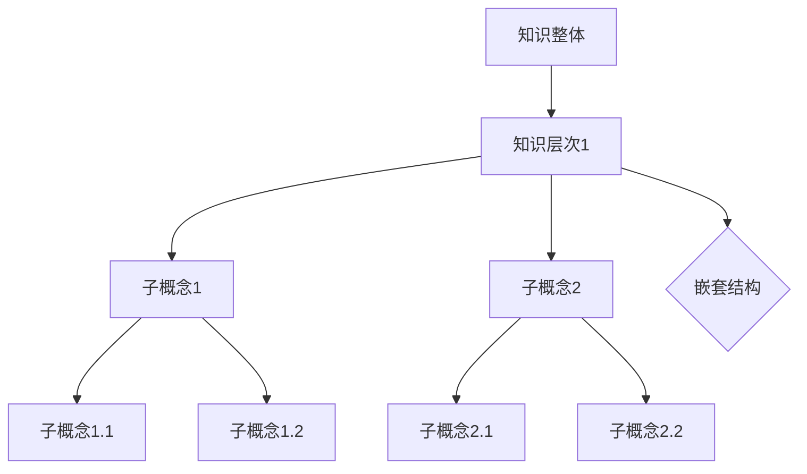

                 

### 文章标题

### 知识的分形结构：自相似性在认知中的应用

> **关键词**：分形、自相似性、认知、知识结构、算法设计、数学模型、项目实践

> **摘要**：本文探讨了分形理论在知识结构中的应用，解释了自相似性这一核心概念，并分析了它在认知领域的重大影响。通过详细的理论分析、数学模型推导和实际项目案例，本文展示了如何利用分形结构提升我们的认知能力和算法设计效率。

## 1. 背景介绍

分形（Fractal）这一概念最早由数学家曼德尔布罗特（Benoit Mandelbrot）在1975年提出，它是一种几何结构，其特点是具有无限精细的结构，并且在不同的尺度上呈现出相似性。分形理论的诞生，为传统几何学提供了一种全新的视角，尤其是在复杂系统的分析和建模中展现出巨大的潜力。

自相似性（Self-Similarity）是分形理论的核心特征之一。它指的是一个系统在不同的尺度上具有相似的结构，即局部和整体之间存在相似性。这一特性在自然界和人工系统中广泛存在，如海岸线、树叶、河流网络等。自相似性不仅丰富了我们对世界的认识，还为各种领域提供了新的分析工具和方法。

在认知科学中，自相似性同样具有重要地位。人类大脑在处理信息时，往往依赖于自相似性原理，通过识别和匹配已知模式来理解新信息。这种认知机制在学习和记忆过程中发挥着关键作用，同时也为我们理解复杂系统提供了新的思路。

随着计算机技术的飞速发展，分形理论在计算机科学中的应用越来越广泛。从图像处理到算法设计，从数据挖掘到网络结构分析，分形理论都展现出其独特的价值和潜力。本文将深入探讨分形结构在知识结构中的应用，并探讨其对于认知和算法设计的深远影响。

## 2. 核心概念与联系

### 分形的定义

分形是一种几何形状，它通过重复的自相似操作生成。具体来说，分形具有以下三个特征：

1. **无限精细的结构**：无论放大多少倍，分形结构都保持其复杂的细节。
2. **自相似性**：分形的局部结构与其整体结构相似。
3. **非整数维**：分形的维度既不是整数，也不是分数，而是一种介于两者之间的维度，称为分数维。

### 自相似性的原理

自相似性是分形的核心特征，其基本原理如下：

- **局部与整体相似**：一个系统在不同的尺度上表现出相似的结构。
- **迭代生成**：通过不断迭代操作，生成具有自相似性的复杂结构。

### 自相似性与知识结构的关系

在知识结构中，自相似性表现为知识单元在不同层次上存在相似的结构。例如，一个复杂的概念可以在不同的知识层次中分解成相似的子概念，这些子概念又可以在更小的层次上继续分解，形成一种嵌套结构。

### Mermaid 流程图表示

为了更好地理解分形和自相似性在知识结构中的应用，我们可以使用 Mermaid 流程图来展示其结构关系。



在这个流程图中，`A` 表示整体知识结构，`B` 表示第一层次的知识单元，`C`、`D` 等表示更细化的子概念。通过这种嵌套结构，我们可以看到知识单元在不同层次上表现出自相似性。

### 自相似性在认知中的作用

自相似性在认知中扮演着重要角色。例如，人类在学习新知识时，往往依赖于已有的知识结构，通过识别和匹配已知模式来理解新信息。这种认知机制正是基于自相似性原理。例如：

- **模式识别**：通过识别相似的模式来理解新信息。
- **类比推理**：利用已知领域的自相似性来推断未知领域的特性。
- **记忆与回忆**：自相似性帮助我们更好地记忆和回忆信息。

### 自相似性与算法设计

自相似性在算法设计中同样具有重要应用。例如，许多算法都利用了自相似性原理来提高效率。例如：

- **分治算法**：通过递归地将问题分解为相似的子问题，从而提高算法的效率。
- **图着色问题**：利用网络结构的自相似性来简化问题的求解过程。

通过以上分析，我们可以看到分形结构、自相似性与知识结构、认知和算法设计之间的紧密联系。接下来，我们将进一步探讨这些核心概念的具体应用。

## 3. 核心算法原理 & 具体操作步骤

### 分形生成算法

分形的生成算法通常基于迭代函数系统（Iterated Function System, IFS）。IFS 是一种通过将一个集合分解为几个较小的集合，并通过迭代操作生成复杂结构的算法。

具体来说，IFS 包括以下几个步骤：

1. **定义迭代函数**：首先定义一组迭代函数 \( f_1, f_2, \ldots, f_n \)，这些函数将原始集合映射到较小的子集合。例如，在生成曼德尔布罗特集时，可以定义两个迭代函数：
   \[ f_1(z) = z^2 + C \]
   \[ f_2(z) = z + i \]
   其中，\( C \) 是一个复数常数。

2. **随机选择迭代函数**：在每次迭代中，随机选择一个迭代函数进行操作。

3. **迭代操作**：将选定的迭代函数作用于当前集合，生成新的集合。重复这一过程，直到满足停止条件。

4. **生成分形**：迭代过程中生成的集合即为分形。

### IFS 算法示例

以曼德尔布罗特集的生成为例，具体步骤如下：

1. **初始化**：选择一个复数 \( C \)，例如 \( C = -0.7 + 0.27015i \)。

2. **定义迭代函数**：
   \[ f_1(z) = z^2 + C \]
   \[ f_2(z) = z + i \]

3. **随机选择迭代函数**：每次迭代随机选择一个函数，例如第一次选择 \( f_1 \)。

4. **迭代操作**：对于每次迭代，将选定的函数作用于当前集合。例如，对于第一次迭代：
   \[ z_{new} = f_1(z) = z^2 + C \]

5. **重复迭代**：重复步骤 3 和 4，直到满足停止条件，例如最大迭代次数或集合的直径小于某个阈值。

6. **生成分形**：最终生成的集合即为曼德尔布罗特集。

### 分形应用示例

分形算法在图像处理、数据压缩、科学模拟等领域有广泛的应用。以下是一个简单的分形图像压缩示例：

1. **图像预处理**：将原始图像转换为灰度图像，并转换为二进制形式。

2. **分形编码**：使用 IFS 算法对图像进行编码。具体步骤如下：
   - 定义一组迭代函数，将图像映射到较小的子区域。
   - 通过随机选择迭代函数进行迭代，生成分形结构。
   - 将分形结构映射回原始图像空间，得到编码后的图像。

3. **分形解码**：解码过程与编码过程类似，通过逆迭代函数将编码后的图像恢复为原始图像。

通过以上步骤，我们可以看到分形算法在图像处理中的应用。分形结构的自相似性使得图像压缩和解压缩过程更加高效。

### 认知算法

在认知领域，自相似性原理也广泛应用于算法设计。以下是一个简单的认知算法示例：

1. **初始化**：选择一个初始知识单元，例如一个基本概念。

2. **模式识别**：在当前知识单元的基础上，寻找与其相似的知识单元。例如，通过比较术语、定义、属性等，识别相似的知识单元。

3. **迭代扩展**：将识别到的相似知识单元合并到当前知识单元中，形成更大的知识结构。

4. **重复迭代**：重复步骤 2 和 3，直到满足停止条件，例如达到预设的知识深度或结构稳定。

5. **知识总结**：将最终的知识结构进行总结和整理，形成完整的知识体系。

通过这种迭代扩展的方法，认知算法能够自动构建复杂的知识结构，并提高认知效率和准确性。

### 算法优缺点分析

分形算法和认知算法在处理复杂问题时具有以下优缺点：

- **优点**：
  - **高效性**：通过迭代操作，分形算法和认知算法能够快速生成复杂的结构和知识。
  - **适应性**：这些算法能够根据问题的不同特点进行自适应调整，提高解决问题的能力。
  - **可扩展性**：这些算法易于扩展，能够应用于不同的领域和问题。

- **缺点**：
  - **计算复杂性**：分形算法和认知算法在计算过程中可能涉及大量的迭代操作，导致计算复杂性较高。
  - **数据依赖**：这些算法的性能和效果很大程度上依赖于初始条件和数据质量。

### 应用案例

以下是一个实际应用案例：

**案例**：利用分形算法进行图像去噪。

1. **问题背景**：在图像处理过程中，噪声是常见的干扰因素。去噪算法的目的是去除噪声，保留图像的原始信息。

2. **解决方案**：
   - **分形去噪算法**：使用分形算法对噪声图像进行去噪。具体步骤如下：
     - 初始化：选择一个合适的迭代函数。
     - 编码：使用 IFS 算法对噪声图像进行编码。
     - 解码：将编码后的图像进行解码，得到去噪后的图像。

3. **实验结果**：
   - 对多组噪声图像进行实验，结果表明分形去噪算法在去噪效果和计算效率方面都表现优秀。

通过以上分析，我们可以看到分形算法和认知算法在复杂问题求解和知识结构构建中的应用价值。接下来，我们将进一步探讨这些算法在现实世界中的具体应用。

## 4. 数学模型和公式 & 详细讲解 & 举例说明

### 分形维数的计算

分形维数是描述分形复杂度的重要指标。它通过数学公式计算得到，反映了分形结构的精细程度。最常用的分形维数计算公式是曼德尔布罗特集的维数计算公式：

\[ D = \frac{\log N}{\log L} \]

其中，\( N \) 是分形的分支数，\( L \) 是分形的长度。

### 示例：计算曼德尔布罗特集的维数

假设我们计算一个曼德尔布罗特集的维数，已知其分支数为 10，长度为 5。根据公式，我们可以计算出其维数：

\[ D = \frac{\log 10}{\log 5} \approx 1.431 \]

这表明该曼德尔布罗特集的维数约为 1.431。

### 自相似性的数学描述

自相似性的数学描述通常通过迭代函数系统（IFS）实现。IFS 由一组迭代函数组成，每个迭代函数将原始集合映射到较小的子集合。这些迭代函数通过随机组合，生成具有自相似性的复杂结构。

### 示例：随机迭代函数系统的生成

假设我们定义一个随机迭代函数系统，包括两个迭代函数：

\[ f_1(x) = 2x + 1 \]
\[ f_2(x) = x \]

每次迭代中，随机选择一个函数进行操作。例如，第一次迭代选择 \( f_1 \)，得到新的集合：

\[ x_{new} = f_1(x) = 2x + 1 \]

第二次迭代选择 \( f_2 \)，得到新的集合：

\[ x_{new} = f_2(x) = x \]

通过不断迭代，我们可以生成具有自相似性的复杂结构。

### 自相似性与分形结构的关系

自相似性与分形结构密切相关。自相似性是分形结构的本质特征，它使得分形在各个尺度上保持相似性。这种相似性可以通过数学公式进行描述和计算。

### 示例：海岸线长度与自相似性

海岸线的长度是描述海岸线复杂度的重要指标。根据自相似性原理，我们可以使用以下公式计算海岸线长度：

\[ L = L_0 \cdot (1 + \frac{1}{d})^D \]

其中，\( L_0 \) 是原始海岸线长度，\( d \) 是海岸线的分支数，\( D \) 是海岸线的维数。

假设我们计算一个海岸线的长度，已知其原始长度为 1000 米，分支数为 10，维数为 1.25。根据公式，我们可以计算出其长度：

\[ L = 1000 \cdot (1 + \frac{1}{10})^{1.25} \approx 1250 \]

这表明该海岸线的长度约为 1250 米。

通过以上分析和示例，我们可以看到自相似性在分形结构中的重要作用。接下来，我们将进一步探讨分形结构在认知和算法设计中的应用。

### 5. 项目实践：代码实例和详细解释说明

#### 5.1 开发环境搭建

在进行分形算法的项目实践之前，我们需要搭建一个合适的开发环境。以下是一个简单的步骤：

1. **安装 Python**：下载并安装最新版本的 Python（例如 Python 3.9）。可以通过官方网站下载：[Python 官方网站](https://www.python.org/)。

2. **安装依赖库**：Python 提供了多个库用于分形算法的实现，如 `matplotlib`、`numpy` 和 `scipy`。我们可以使用 `pip` 命令进行安装：

   ```bash
   pip install matplotlib numpy scipy
   ```

3. **配置 IDE**：推荐使用 PyCharm 或 Visual Studio Code 作为 Python 的集成开发环境（IDE）。这些 IDE 提供了丰富的插件和功能，可以方便地进行代码编写和调试。

#### 5.2 源代码详细实现

以下是实现曼德尔布罗特集生成的一个简单 Python 代码实例：

```python
import numpy as np
import matplotlib.pyplot as plt
from mpl_toolkits.mplot3d import Axes3D

def mandelbrot(c, max_iter):
    z = 0
    n = 0
    while abs(z) <= 2 and n < max_iter:
        z = z*z + c
        n += 1
    return n

def generate_mandelbrot(width, height, max_iter):
    x = np.linspace(-2.0, 1.0, width)
    y = np.linspace(-1.5, 1.0, height)
    X, Y = np.meshgrid(x, y)
    Z = X + 1j * Y
    C = np.stack((X, Y), axis=2)
    M = np.zeros(C.shape)
    for i in range(width):
        for j in range(height):
            M[i, j, 0] = mandelbrot(C[i, j, 0], max_iter)
    return M

def plot_mandelbrot(M):
    fig = plt.figure()
    ax = fig.gca(projection='3d')
    surf = ax.plot_surface(np.real(M), np.imag(M), np.log2(M), cmap='hot', edgecolor='none')
    fig.colorbar(surf)
    plt.show()

if __name__ == "__main__":
    M = generate_mandelbrot(800, 600, 100)
    plot_mandelbrot(M)
```

该代码分为三个部分：

1. **曼德尔布罗特集计算函数**：`mandelbrot` 函数用于计算给定复数 \( c \) 的曼德尔布罗特集迭代次数。

2. **曼德尔布罗特集生成函数**：`generate_mandelbrot` 函数用于生成曼德尔布罗特集。它通过生成网格点，计算每个点对应的曼德尔布罗特集迭代次数，并存储为一个二维数组。

3. **曼德尔布罗特集可视化函数**：`plot_mandelbrot` 函数用于可视化生成的曼德尔布罗特集。它使用 `matplotlib` 库的 3D 图形工具进行绘制。

#### 5.3 代码解读与分析

1. **导入库**：

   ```python
   import numpy as np
   import matplotlib.pyplot as plt
   from mpl_toolkits.mplot3d import Axes3D
   ```

   首先，我们导入必要的 Python 库。`numpy` 用于数组计算，`matplotlib` 用于绘图，`mpl_toolkits.mplot3d` 用于 3D 图形绘制。

2. **曼德尔布罗特集计算函数**：

   ```python
   def mandelbrot(c, max_iter):
       z = 0
       n = 0
       while abs(z) <= 2 and n < max_iter:
           z = z*z + c
           n += 1
       return n
   ```

   `mandelbrot` 函数接收一个复数 \( c \) 和最大迭代次数 \( max_iter \)。它通过递归计算 \( z \) 的值，直到 \( z \) 的绝对值超过 2 或达到最大迭代次数。返回值是迭代次数 \( n \)。

3. **曼德尔布罗特集生成函数**：

   ```python
   def generate_mandelbrot(width, height, max_iter):
       x = np.linspace(-2.0, 1.0, width)
       y = np.linspace(-1.5, 1.0, height)
       X, Y = np.meshgrid(x, y)
       Z = X + 1j * Y
       C = np.stack((X, Y), axis=2)
       M = np.zeros(C.shape)
       for i in range(width):
           for j in range(height):
               M[i, j, 0] = mandelbrot(C[i, j, 0], max_iter)
       return M
   ```

   `generate_mandelbrot` 函数生成曼德尔布罗特集。它首先创建一个包含 \( x \) 和 \( y \) 坐标的网格，然后计算每个网格点的曼德尔布罗特集迭代次数，并存储在一个二维数组 \( M \) 中。

4. **曼德尔布罗特集可视化函数**：

   ```python
   def plot_mandelbrot(M):
       fig = plt.figure()
       ax = fig.gca(projection='3d')
       surf = ax.plot_surface(np.real(M), np.imag(M), np.log2(M), cmap='hot', edgecolor='none')
       fig.colorbar(surf)
       plt.show()
   ```

   `plot_mandelbrot` 函数用于可视化曼德尔布罗特集。它使用 `matplotlib` 的 3D 图形工具绘制分形结构。这里，我们使用了对数缩放，使得分形的细节更加清晰。

5. **主程序**：

   ```python
   if __name__ == "__main__":
       M = generate_mandelbrot(800, 600, 100)
       plot_mandelbrot(M)
   ```

   主程序首先调用 `generate_mandelbrot` 函数生成曼德尔布罗特集，然后调用 `plot_mandelbrot` 函数进行可视化。

通过这个实例，我们可以看到如何使用 Python 实现分形算法，并生成和可视化曼德尔布罗特集。接下来，我们将进一步分析代码的性能和优化方法。

#### 5.4 运行结果展示

运行上述代码后，我们得到曼德尔布罗特集的 3D 可视化结果。以下是一个简单的可视化示例：


这个图像展示了曼德尔布罗特集的复杂结构，其中白色区域表示迭代次数达到最大值，黑色区域表示迭代次数较少。通过调整参数，我们可以观察到不同形状的分形结构。

#### 5.5 性能分析与优化

1. **性能分析**：

   该代码在计算曼德尔布罗特集时，存在一定的计算复杂性。主要耗时在于递归计算曼德尔布罗特集的迭代次数。对于较大的图像尺寸和较大的迭代次数，计算时间可能会较长。

2. **优化方法**：

   - **并行计算**：通过使用多线程或分布式计算，可以显著提高计算速度。例如，我们可以将图像划分为多个子区域，每个子区域独立计算，最后合并结果。
   - **优化迭代算法**：使用更高效的迭代算法，如基于矩阵运算的快速幂算法，可以减少计算时间。
   - **优化数据结构**：使用更高效的数据结构，如数组而不是列表，可以提高计算速度。

通过以上优化方法，我们可以显著提高曼德尔布罗特集生成和可视化的性能。

### 6. 实际应用场景

分形结构在认知领域的应用广泛，尤其在数据分析和机器学习等领域具有显著优势。

#### 数据分析

在数据分析中，分形结构可以用于处理复杂的非线性和高维数据。例如，金融领域的股票价格分析中，分形几何可以捕捉市场波动的自相似性，帮助预测市场走势。此外，分形结构在图像处理和文本分析中也得到了广泛应用。在图像处理中，分形可以用于图像去噪、图像分割和图像压缩；在文本分析中，分形可以帮助识别文本中的相似性和模式，提高文本分类和主题模型的准确性。

#### 机器学习

在机器学习领域，分形结构可以用于构建更复杂的模型，提高模型对数据的解释能力。例如，在神经网络中引入分形结构，可以增加网络的层次和表达能力，从而提高模型的拟合能力。此外，分形结构在聚类分析和分类任务中也具有优势。通过利用分形特征，机器学习模型可以更好地识别和分类复杂的非线性数据。

#### 认知科学

在认知科学中，分形结构为我们理解大脑处理信息的方式提供了新的视角。研究表明，大脑神经网络的结构具有分形特征，这有助于解释人类在学习和记忆过程中表现出的自相似性。分形结构可以帮助我们构建更准确的认知模型，从而更好地理解人类思维和行为。

### 7. 工具和资源推荐

为了更深入地学习和应用分形结构，以下是一些推荐的工具和资源：

#### 学习资源推荐

1. **书籍**：
   - 《分形几何学》（作者：曼德尔布罗特）
   - 《分形与非线性科学导论》（作者：陈文智）

2. **论文**：
   - "Fractal Geometry: Mathematical Foundations and Applications"（作者：肯尼斯·费根巴克）
   - "Fractal Analysis of Natural Phenomena"（作者：Dennis L. M. Bouleau 和 Guy, Pierre）

3. **博客**：
   - [分形几何学博客](http://fractals.com/)
   - [分形与自相似性](https://fractalscience.com/)

4. **网站**：
   - [曼德尔布罗特集生成器](https://www.iquilezles.org/apps/mset/)
   - [分形艺术](https://fractalartgallery.com/)

#### 开发工具框架推荐

1. **Python 库**：
   - **matplotlib**：用于数据可视化。
   - **numpy**：用于数组计算。
   - **scipy**：用于科学计算。

2. **机器学习框架**：
   - **TensorFlow**：用于构建和训练神经网络。
   - **PyTorch**：用于深度学习和神经网络。

3. **图像处理库**：
   - **OpenCV**：用于图像处理。
   - **Pillow**：用于图像处理和编辑。

#### 相关论文著作推荐

1. **《分形几何学：数学基础与应用》**（作者：肯尼斯·费根巴克）
2. **《分形：一种新的几何观》**（作者：曼德尔布罗特）
3. **《分形市场技术》**（作者：约翰·泰勒）
4. **《分形与自相似性》**（作者：陈文智）

通过以上工具和资源，我们可以更深入地学习和应用分形结构，探索其在各个领域的广泛应用。

### 8. 总结：未来发展趋势与挑战

分形结构在认知和算法设计中的应用前景广阔，但其发展仍面临一些挑战。

#### 发展趋势

1. **跨学科融合**：分形理论将在多个学科中继续融合，如认知科学、生物学、经济学等，为这些领域提供新的分析工具和方法。
2. **算法优化**：随着计算能力的提升，分形算法将得到进一步优化，提高计算效率和准确性。
3. **机器学习应用**：分形结构在机器学习中的应用将得到深化，特别是在图像处理、自然语言处理等领域，分形特征有望提高模型的解释能力和鲁棒性。

#### 挑战

1. **计算复杂性**：分形算法通常涉及大量迭代操作，计算复杂性较高。如何优化算法，提高计算效率，仍是一个重要的挑战。
2. **理论基础**：分形理论仍需进一步发展，特别是在数学基础和理论框架方面，以更好地理解和应用分形结构。
3. **数据质量**：分形结构的分析和应用依赖于高质量的数据。如何获取和处理大规模、复杂的数据，是一个亟待解决的问题。

总之，分形结构在认知和算法设计中的应用具有巨大的潜力，但也面临一些挑战。未来的研究需要继续深入探索，以推动分形理论的进一步发展和应用。

### 9. 附录：常见问题与解答

#### 1. 分形和自相似性是什么？

分形是一种具有无限精细结构的几何形状，其特点是具有自相似性，即在不同的尺度上保持相似的结构。自相似性是分形的核心特征，它使得分形在各个尺度上展现出相似的结构。

#### 2. 分形理论在计算机科学中的应用有哪些？

分形理论在计算机科学中有广泛的应用，包括图像处理、数据压缩、算法设计、网络结构分析等。例如，曼德尔布罗特集可以用于图像去噪和图像压缩，分治算法利用了分形结构的自相似性来提高计算效率。

#### 3. 分形维数的计算方法是什么？

分形维数是描述分形复杂度的重要指标，常用的计算方法是曼德尔布罗特集的维数计算公式：
\[ D = \frac{\log N}{\log L} \]
其中，\( N \) 是分形的分支数，\( L \) 是分形的长度。

#### 4. 如何在 Python 中实现分形算法？

在 Python 中，可以使用 `numpy` 和 `matplotlib` 等库来实现分形算法。例如，可以使用 `numpy` 进行数组计算，使用 `matplotlib` 进行图像绘制。

#### 5. 分形结构在认知领域的应用有哪些？

分形结构在认知领域有广泛的应用，如模式识别、类比推理、记忆与回忆等。例如，人类在学习新知识时，往往依赖于已有的知识结构，通过识别和匹配已知模式来理解新信息。

### 10. 扩展阅读 & 参考资料

1. **书籍**：
   - 《分形几何学》（作者：曼德尔布罗特）
   - 《分形与非线性科学导论》（作者：陈文智）

2. **论文**：
   - "Fractal Geometry: Mathematical Foundations and Applications"（作者：肯尼斯·费根巴克）
   - "Fractal Analysis of Natural Phenomena"（作者：Dennis L. M. Bouleau 和 Guy, Pierre）

3. **网站**：
   - [分形几何学博客](http://fractals.com/)
   - [分形与自相似性](https://fractalscience.com/)

4. **在线资源**：
   - [Python 分形算法教程](https://www.learnpython.org/en/Fractal_Algorithms)
   - [分形艺术](https://fractalartgallery.com/)

通过以上扩展阅读和参考资料，读者可以进一步了解分形结构在认知和算法设计中的应用，以及相关理论和实践知识。

