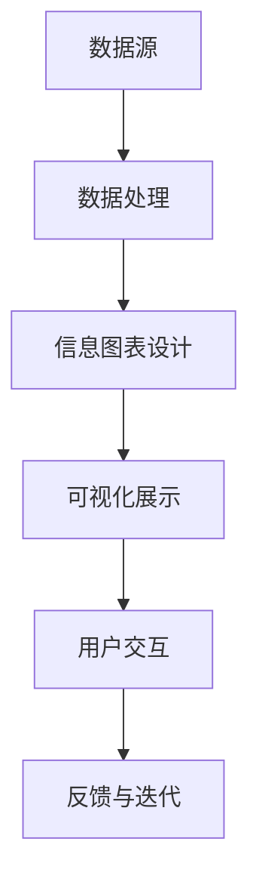

                 

### 知识的可视化工具：信息图表的力量

> **关键词**：信息图表、知识可视化、数据处理、沟通效率、设计原则

> **摘要**：本文旨在探讨信息图表在知识可视化中的重要性，分析其设计原则和核心概念，并通过具体案例展示其应用效果。本文将帮助读者了解如何利用信息图表提高数据处理和沟通效率，以及在未来可能面临的挑战和发展趋势。

### 1. 背景介绍

在信息爆炸的时代，数据量和信息量呈现出指数级增长。对于个人和企业来说，如何快速、准确地获取和处理信息，成为了一项关键能力。传统的文本和表格虽然在某种程度上能够传达信息，但往往难以直观地展示数据之间的复杂关系。这时，信息图表作为一种知识可视化工具，应运而生。

信息图表，也称为数据可视化图表，是利用图形、符号和颜色等视觉元素，将数据、信息和知识以直观、易懂的方式呈现。其目的在于帮助人们快速理解、分析和分享复杂的信息。信息图表在各个领域都有广泛的应用，如商业分析、科学研究、教育传播、公共政策等。

近年来，随着计算机技术和大数据分析的发展，信息图表的应用场景和设计工具也得到了极大的拓展和提升。越来越多的企业和组织开始重视信息图表的作用，将其作为数据分析和沟通的重要工具。

### 2. 核心概念与联系

要深入了解信息图表，我们首先需要了解其中的核心概念和设计原则。以下是一个用于说明信息图表核心概念的 Mermaid 流程图：



**2.1 数据源**

数据源是信息图表的基础。它可以是结构化的数据，如数据库、电子表格，也可以是非结构化的数据，如图像、文本和音频。数据的质量和完整性直接影响信息图表的可信度和有效性。

**2.2 数据处理**

数据处理是对数据源进行清洗、转换和整合的过程。这一步骤旨在提取有用的信息，去除冗余和无用的数据，以便于后续的设计和展示。数据处理通常涉及统计分析、机器学习等技术。

**2.3 信息图表设计**

信息图表设计是信息图表的核心。它涉及选择合适的图表类型、颜色、布局和标注，以最大限度地提高图表的易读性和吸引力。设计原则包括一致性、简洁性、对比性和可视化性。

**2.4 可视化展示**

可视化展示是将设计好的信息图表通过图形界面展示给用户。展示的形式可以是静态的图像，也可以是动态的动画，甚至可以是交互式的Web应用。

**2.5 用户交互**

用户交互是指用户与信息图表之间的互动。通过交互，用户可以探索数据、发现问题，甚至对数据进行分析和预测。交互性使得信息图表不仅是一种信息展示工具，更是一种数据分析和决策支持系统。

**2.6 反馈与迭代**

反馈与迭代是信息图表设计过程中不可或缺的一环。通过用户反馈，设计者可以不断优化信息图表，提高其易用性和准确性。迭代过程使得信息图表能够适应不断变化的数据需求和用户习惯。

### 3. 核心算法原理 & 具体操作步骤

**3.1 数据预处理**

数据预处理是信息图表设计的第一步。它通常包括以下操作：

- 数据清洗：去除重复、错误和缺失的数据。
- 数据转换：将数据转换成适合可视化展示的格式，如CSV、JSON等。
- 数据聚合：对大量数据进行分组和汇总，以减少数据的复杂度。

**3.2 图表类型选择**

根据数据的性质和展示需求，选择合适的图表类型。常见的图表类型包括：

- 条形图：用于比较不同类别的数据。
- 饼图：用于展示各类别数据在总体中的占比。
- 折线图：用于展示数据的变化趋势。
- 散点图：用于展示数据之间的关系。

**3.3 设计原则**

在设计信息图表时，应遵循以下原则：

- **一致性**：保持图表的颜色、字体和布局的一致性，以提高可读性。
- **简洁性**：避免使用过多的元素和细节，以减少用户的认知负担。
- **对比性**：通过颜色、大小、形状等对比元素，突出数据的重要信息。
- **可视化性**：使用图形和符号，使数据直观、易懂。

**3.4 可视化实现**

使用可视化库（如D3.js、ECharts、Plotly等）将设计好的信息图表实现为Web应用或静态图像。以下是一个使用ECharts实现条形图的简单示例：

```javascript
// 基于准备好的dom，初始化echarts实例
var myChart = echarts.init(document.getElementById('main'));

// 指定图表的配置项和数据
var option = {
  title: {
    text: '条形图示例'
  },
  tooltip: {},
  legend: {
    data:['销量']
  },
  xAxis: {
    data: ["衬衫","羊毛衫","雪纺衫","裤子","高跟鞋","袜子"]
  },
  yAxis: {},
  series: [{
    name: '销量',
    type: 'bar',
    data: [5, 20, 36, 10, 10, 20]
  }]
};

// 使用刚指定的配置项和数据显示图表。
myChart.setOption(option);
```

### 4. 数学模型和公式 & 详细讲解 & 举例说明

**4.1 数据聚合**

在数据预处理阶段，数据聚合是一个重要的步骤。数据聚合的目标是将大量的原始数据转换成易于理解的汇总数据。常用的数据聚合方法包括：

- 平均值（Average）：计算一组数据的平均值。
- 中位数（Median）：计算一组数据的中位数。
- 众数（Mode）：计算一组数据中出现次数最多的值。
- 标准差（Standard Deviation）：计算一组数据的离散程度。

**4.2 趋势分析**

趋势分析是信息图表设计中的重要环节。常用的趋势分析方法包括：

- 线性回归（Linear Regression）：通过拟合一条直线来预测数据的变化趋势。
- 多项式回归（Polynomial Regression）：通过拟合一条多项式曲线来预测数据的变化趋势。
- 移动平均（Moving Average）：通过计算一定时间窗口内的平均值来平滑数据波动。

**4.3 例子：线性回归**

假设我们有一组数据点（x1, y1），（x2, y2），...，（xn, yn），我们希望通过线性回归模型预测一个新的数据点（x', y'）。线性回归模型的公式如下：

$$
y' = b_0 + b_1 \cdot x'
$$

其中，$b_0$ 和 $b_1$ 分别是模型的截距和斜率。通过最小二乘法（Least Squares Method），我们可以计算出 $b_0$ 和 $b_1$ 的值。

**4.3.1 计算步骤**

1. 计算各个数据点的斜率和截距：
   $$
   b_1 = \frac{\sum_{i=1}^{n} (x_i - \bar{x})(y_i - \bar{y})}{\sum_{i=1}^{n} (x_i - \bar{x})^2}
   $$
   $$
   b_0 = \bar{y} - b_1 \cdot \bar{x}
   $$

2. 使用计算出的 $b_0$ 和 $b_1$ 预测新的数据点：
   $$
   y' = b_0 + b_1 \cdot x'
   $$

**4.3.2 例子**

假设我们有以下数据点：

| x | y |
|---|---|
| 1 | 2 |
| 2 | 4 |
| 3 | 6 |
| 4 | 8 |

我们希望预测 x = 5 时的 y 值。

1. 计算斜率和截距：
   $$
   \bar{x} = \frac{1 + 2 + 3 + 4}{4} = 2.5
   $$
   $$
   \bar{y} = \frac{2 + 4 + 6 + 8}{4} = 5
   $$
   $$
   b_1 = \frac{(1 - 2.5)(2 - 5) + (2 - 2.5)(4 - 5) + (3 - 2.5)(6 - 5) + (4 - 2.5)(8 - 5)}{(1 - 2.5)^2 + (2 - 2.5)^2 + (3 - 2.5)^2 + (4 - 2.5)^2} = 2
   $$
   $$
   b_0 = 5 - 2 \cdot 2.5 = 0
   $$

2. 预测 y'：
   $$
   y' = 0 + 2 \cdot 5 = 10
   $$

因此，当 x = 5 时，预测的 y 值为 10。

### 5. 项目实践：代码实例和详细解释说明

**5.1 开发环境搭建**

为了便于演示，我们使用 Python 作为编程语言，并结合 Matplotlib 库实现信息图表的生成。以下是搭建开发环境所需的步骤：

1. 安装 Python：从 [Python 官网](https://www.python.org/) 下载并安装最新版本的 Python。
2. 安装 Matplotlib：在终端或命令提示符中运行以下命令：
   ```
   pip install matplotlib
   ```

**5.2 源代码详细实现**

以下是一个使用 Matplotlib 生成条形图的项目示例：

```python
import matplotlib.pyplot as plt

# 数据
x = ["衬衫", "羊毛衫", "雪纺衫", "裤子", "高跟鞋", "袜子"]
y = [5, 20, 36, 10, 10, 20]

# 创建图表
plt.figure(figsize=(10, 6))

# 绘制条形图
plt.bar(x, y, color=['r', 'g', 'b', 'y', 'c', 'm'])

# 添加标题和标签
plt.title('商品销量统计')
plt.xlabel('商品')
plt.ylabel('销量')

# 显示图表
plt.show()
```

**5.3 代码解读与分析**

上述代码首先导入了 matplotlib.pyplot 库，然后定义了数据集 x 和 y。接下来，使用 figure() 函数创建了一个图表，并设置了图表的大小。然后，使用 bar() 函数绘制了条形图，并设置了颜色。接着，添加了标题、标签和坐标轴。最后，使用 show() 函数显示了图表。

**5.4 运行结果展示**

运行上述代码后，将显示一个包含六种商品销量的条形图。图表中的红色、绿色、蓝色等颜色表示不同商品的销量。用户可以通过图表直观地了解各商品的销量情况。

### 6. 实际应用场景

**6.1 商业分析**

商业分析中，信息图表被广泛用于展示销售数据、市场份额、客户行为等。通过信息图表，企业可以快速了解业务状况，发现潜在问题和机会。

**6.2 科学研究**

科学研究领域，信息图表被用于展示实验数据、统计结果、模型预测等。信息图表使得复杂的科学数据变得易于理解和分析，有助于研究人员进行决策和发现新知识。

**6.3 教育传播**

在教育传播中，信息图表被用于展示知识点、学习路径、考试分数等。信息图表使得知识结构更加清晰，有助于学生提高学习效果。

**6.4 公共政策**

公共政策领域，信息图表被用于展示社会问题、政策效果、公众意见等。信息图表使得政策制定者能够更好地理解社会需求和问题，从而制定出更有效的政策。

### 7. 工具和资源推荐

**7.1 学习资源推荐**

- **书籍**：
  - 《数据可视化：从图表到互动展示》（Data Visualization: A Success Guide）
  - 《信息图表设计实战》（Information Graphics: A Visual Overview of 100 Charts, Diagrams, and Maps）
- **论文**：
  - "Visualization of Hierarchical Data with Fractals" by Ivan Selesnick
  - "Visual Analytics of Time-Oriented Data" by Hans-Peter Seidel and Michael A. Weber
- **博客**：
  - [ECharts 官方博客](https://echarts.apache.org/zh/tutorial.html)
  - [D3.js 官方博客](https://d3js.org/)
- **网站**：
  - [Matplotlib 官方网站](https://matplotlib.org/)

**7.2 开发工具框架推荐**

- **Python**：适用于数据处理和可视化开发的强大编程语言。
- **Matplotlib**：Python 中的可视化库，适用于生成静态图表。
- **D3.js**：JavaScript 库，适用于 Web 应用中的动态和交互式可视化。
- **ECharts**：适用于 Web 应用中的高性能可视化库。

**7.3 相关论文著作推荐**

- **《信息图表的设计原则和方法》**：介绍了信息图表的设计原则和方法，对实际设计工作具有指导意义。
- **《数据可视化技术与应用》**：系统介绍了数据可视化技术的理论、方法和应用，对科研、教育和商业等领域具有参考价值。

### 8. 总结：未来发展趋势与挑战

随着人工智能和大数据技术的发展，信息图表的应用前景将更加广阔。未来，信息图表将朝着以下方向发展：

- **智能化**：利用人工智能技术，自动生成和优化信息图表，提高设计效率和准确性。
- **交互性**：增强信息图表的交互性，使用户能够更加灵活地探索数据，进行实时分析和决策。
- **定制化**：提供个性化信息图表服务，根据用户的需求和习惯，生成定制化的图表。

然而，信息图表也面临一些挑战：

- **数据隐私**：在大数据时代，数据隐私保护成为一大挑战。如何在不泄露用户隐私的前提下，有效利用数据，是一个亟待解决的问题。
- **可视化能力**：随着数据复杂度的增加，如何设计出易于理解和使用的可视化图表，成为信息图表面临的挑战。

### 9. 附录：常见问题与解答

**Q1. 如何选择合适的图表类型？**

选择图表类型时，应考虑数据的性质和展示需求。例如，对于趋势分析，折线图和趋势线图是较好的选择；对于比较不同类别的数据，条形图和饼图是常用的图表类型。

**Q2. 如何提高信息图表的可读性？**

提高信息图表的可读性可以通过以下方法实现：

- 保持图表的一致性，使用相同的颜色、字体和布局。
- 使用清晰的标题和标签，帮助用户理解图表内容。
- 避免使用过多的细节和元素，保持图表的简洁性。
- 使用对比性强的元素，突出数据的重要信息。

**Q3. 信息图表设计中的常见错误有哪些？**

信息图表设计中的常见错误包括：

- 使用过多的颜色和元素，导致图表过于复杂。
- 没有使用清晰的标题和标签，导致用户难以理解图表内容。
- 图表布局不合理，导致数据之间的联系不明显。
- 没有充分考虑用户的认知习惯和阅读顺序。

**Q4. 如何评估信息图表的有效性？**

评估信息图表的有效性可以从以下几个方面进行：

- **准确性**：图表是否准确地反映了数据本身。
- **易读性**：用户是否能够快速理解图表内容。
- **交互性**：图表是否提供了有效的交互功能，帮助用户探索数据。
- **实用性**：图表是否能够满足用户的需求，为数据分析和决策提供支持。

### 10. 扩展阅读 & 参考资料

- **《可视化大数据：从数据到洞察》**：系统介绍了大数据可视化的理论、方法和实践，对大数据领域的研究和实践具有指导意义。
- **《信息图表设计指南》**：详细介绍了信息图表的设计原则和方法，包括图表类型选择、设计技巧和案例分析等。
- **《数据可视化实战》**：通过实际案例，展示了数据可视化的应用场景和实现方法，对实际工作具有参考价值。

### 后记

本文旨在探讨信息图表在知识可视化中的重要性，分析其设计原则和核心概念，并通过具体案例展示其应用效果。随着技术的不断进步，信息图表将发挥越来越重要的作用，为个人、企业和组织提供强大的数据分析和沟通工具。希望本文能够帮助读者更好地理解信息图表的力量，并在实际工作中运用这一工具提高数据处理和沟通效率。作者：禅与计算机程序设计艺术 / Zen and the Art of Computer Programming

