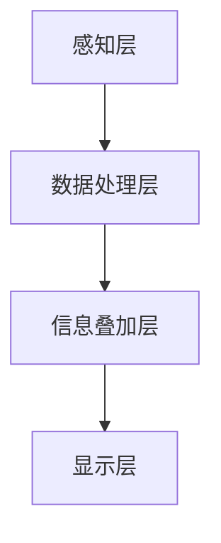
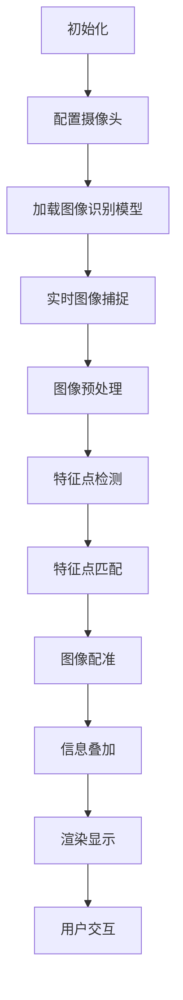

                 

### 背景介绍

在当今这个信息爆炸的时代，知识的获取和传播方式正在发生翻天覆地的变化。传统的纸质书籍和电子文档，虽然在一定程度上满足了人们的学习需求，但它们的局限性也逐渐显现出来。特别是在需要实时更新和个性化定制的场景下，这些传统的知识载体显得有些力不从心。

为了解决这一问题，增强现实（Augmented Reality，简称AR）技术应运而生。增强现实技术通过在现实环境中叠加虚拟信息，实现现实世界与数字世界的无缝融合。这种技术不仅极大地扩展了信息的表现形式，还极大地提高了信息获取的效率。

增强现实技术在教育领域的应用尤为突出。它不仅能够提供更加生动、直观的学习体验，还能够根据学习者的需求和进度，动态地调整和更新学习内容。这种实时信息叠加的学习体验，极大地激发了学生的学习兴趣和主动性，为知识的传播和掌握提供了新的可能性。

本文旨在探讨增强现实技术在知识传播中的应用，特别是实时信息叠加的学习体验。我们将从核心概念、算法原理、数学模型、项目实践、实际应用场景等多个角度，详细分析这一技术的优势和应用前景。希望通过本文的阐述，能够为读者提供一个全面、深入的理解，并激发更多的创新思考。

### 核心概念与联系

#### 1. 增强现实（AR）技术

增强现实（Augmented Reality，AR）技术是一种将虚拟信息与现实环境融合的计算机技术。通过在现实场景中叠加虚拟物体、图像、文字等，AR技术为用户提供了更加丰富和互动的体验。与虚拟现实（Virtual Reality，VR）不同，AR技术并非完全替代现实，而是在现实基础上进行增强。

#### 2. 实时信息叠加

实时信息叠加是增强现实技术的核心概念之一。它指的是在用户实时操作的过程中，动态地获取和叠加相关数据，为用户提供即时的反馈和信息。这种技术可以广泛应用于各种领域，如医疗、教育、军事等，尤其在知识传播和学习教育中具有巨大的潜力。

#### 3. 实时信息叠加的架构

为了实现实时信息叠加，需要构建一个完整的系统架构。该架构通常包括以下几个关键部分：

- **感知层**：负责感知用户和环境的状态，包括用户的动作、位置、设备状态等。
- **数据处理层**：对感知层收集的数据进行处理和分析，提取有用的信息。
- **信息叠加层**：根据处理后的数据，动态地生成虚拟信息，并将其叠加到现实环境中。
- **显示层**：将叠加后的虚拟信息展示给用户，提供直观的交互体验。

以下是该架构的 Mermaid 流程图：



#### 4. 实时信息叠加的应用场景

实时信息叠加技术在教育领域的应用场景非常广泛，以下是一些典型的应用场景：

- **在线教育**：通过AR技术，学生可以在虚拟环境中进行实验、操作，增强学习体验。
- **历史教育**：学生可以通过AR技术，穿越到历史场景中，与历史人物互动，加深对历史事件的理解。
- **语言学习**：通过AR技术，学生可以在现实环境中学习外语，与母语环境进行实时对比和纠正。
- **技能培训**：通过AR技术，工作人员可以在现实环境中进行操作练习，提高技能水平。

这些应用场景不仅为学习者提供了更加丰富和生动的内容，还使得学习过程更加具有互动性和参与感，极大地提高了学习效果。

通过上述分析，我们可以看到，增强现实技术和实时信息叠加在知识传播和学习体验中具有巨大的潜力。在接下来的章节中，我们将深入探讨实时信息叠加的核心算法原理、具体操作步骤、数学模型及其应用。

### 核心算法原理 & 具体操作步骤

#### 1. 增强现实技术的工作原理

增强现实技术（AR）的核心在于将虚拟信息叠加到现实环境中，使虚拟信息和现实环境相互融合。这一过程主要涉及以下几个关键步骤：

- **图像识别与定位**：通过摄像头或传感器捕捉现实场景，使用图像识别算法定位关键特征点。
- **虚拟信息生成**：根据定位信息，生成相应的虚拟信息，如图像、文字、三维模型等。
- **信息叠加与渲染**：将生成的虚拟信息叠加到现实场景中，并通过屏幕或其他显示设备展示给用户。

以下是 AR 技术的核心算法原理：

- **图像识别**：通常采用机器学习算法，如卷积神经网络（CNN），对现实场景中的图像进行识别和分类。
- **特征点检测**：使用角点检测算法，如Harris角点检测或SIFT算法，从图像中提取关键特征点。
- **图像配准**：通过特征点匹配和优化算法，将现实场景与虚拟信息进行准确对齐。

#### 2. 实时信息叠加的具体操作步骤

为了实现实时信息叠加，需要将上述核心算法集成到一个系统中，并按照以下具体操作步骤执行：

1. **初始化**：配置AR系统，包括摄像头参数、图像识别模型等。
    ```mermaid
    graph TD
        A[初始化] --> B[配置摄像头]
        B --> C[加载图像识别模型]
    ```

2. **实时图像捕捉**：使用摄像头捕捉实时图像。
    ```mermaid
    graph TD
        D[实时图像捕捉] --> E[图像预处理]
    ```

3. **图像预处理**：对捕获的图像进行预处理，包括去噪、增强等。
    ```mermaid
    graph TD
        E --> F[图像去噪]
        F --> G[图像增强]
    ```

4. **特征点提取**：从预处理后的图像中提取关键特征点。
    ```mermaid
    graph TD
        G --> H[特征点检测]
    ```

5. **图像配准**：使用特征点匹配和优化算法，将虚拟信息与图像进行准确对齐。
    ```mermaid
    graph TD
        H --> I[特征点匹配]
        I --> J[图像配准]
    ```

6. **信息叠加与渲染**：将生成的虚拟信息叠加到图像上，并通过屏幕或其他显示设备展示给用户。
    ```mermaid
    graph TD
        J --> K[信息叠加]
        K --> L[渲染显示]
    ```

7. **用户交互**：用户可以与叠加的虚拟信息进行交互，如放大、缩小、旋转等。
    ```mermaid
    graph TD
        L --> M[用户交互]
    ```

通过以上步骤，我们可以实现实时信息叠加的功能。以下是一个简化的 Mermaid 流程图，展示了整个操作流程：



通过这一系列操作，我们不仅能够在现实环境中实时叠加虚拟信息，还能够实现与用户的互动，为学习者提供更加生动、直观的学习体验。

### 数学模型和公式 & 详细讲解 & 举例说明

在增强现实（AR）技术的实时信息叠加过程中，数学模型和公式扮演着至关重要的角色。它们不仅帮助我们理解和优化算法，还能够实现精确的数据处理和计算。以下是一些核心的数学模型和公式，我们将结合具体的例子进行详细讲解。

#### 1. 角点检测

角点检测是特征点提取的关键步骤，常用的算法有Harris角点检测和SIFT算法。其中，Harris角点检测通过计算图像梯度矩阵的乘积来检测角点。

**公式**：

设 \( I(x, y) \) 为图像，其x和y方向的梯度分别为 \( I_x(x, y) \) 和 \( I_y(x, y) \)，则Harris角点检测的公式为：

$$
M = \begin{bmatrix}
\sum(x^2) \cdot \sum I_x^2 & \sum(x \cdot y) \cdot \sum I_x \cdot I_y \\
\sum(x \cdot y) \cdot \sum I_x \cdot I_y & \sum(y^2) \cdot \sum I_y^2
\end{bmatrix}
$$

其中，\( \sum \) 表示对整个图像进行求和。Harris角点检测的目标是找到矩阵 \( M \) 的特征值，其中特征值大于一个阈值 \( \alpha \) 的点即为角点。

**例子**：

假设我们有以下图像梯度的部分数据：

$$
\begin{aligned}
\sum(x^2) &= 20, & \sum(x \cdot y) &= 5, & \sum I_x^2 &= 10, \\
\sum(y^2) &= 15, & \sum I_y^2 &= 8
\end{aligned}
$$

则梯度矩阵 \( M \) 为：

$$
M = \begin{bmatrix}
20 \cdot 10 & 5 \cdot 8 \\
5 \cdot 8 & 15 \cdot 8
\end{bmatrix} = \begin{bmatrix}
200 & 40 \\
40 & 120
\end{bmatrix}
$$

计算特征值，假设 \( \alpha = 0.01 \)，则特征值大于 \( \alpha \) 的点即为角点。

#### 2. 特征点匹配

在图像配准过程中，特征点匹配是关键步骤。常用的匹配算法有K最近邻（K-Nearest Neighbor，KNN）算法。

**公式**：

给定两个特征向量 \( x \) 和 \( y \)，KNN算法的目标是找到与 \( x \) 最接近的 \( K \) 个特征向量 \( y \)，即：

$$
d(x, y) = \sqrt{\sum_{i=1}^{n} (x_i - y_i)^2}
$$

其中，\( d \) 表示欧几里得距离。

**例子**：

假设我们有两个特征向量：

$$
x = \begin{bmatrix}
1 \\ 2
\end{bmatrix}, \quad y_1 = \begin{bmatrix}
2 \\ 3
\end{bmatrix}, \quad y_2 = \begin{bmatrix}
4 \\ 5
\end{bmatrix}
$$

则 \( x \) 与 \( y_1 \) 的距离为：

$$
d(x, y_1) = \sqrt{(1-2)^2 + (2-3)^2} = \sqrt{1 + 1} = \sqrt{2}
$$

与 \( y_2 \) 的距离为：

$$
d(x, y_2) = \sqrt{(1-4)^2 + (2-5)^2} = \sqrt{9 + 9} = 3\sqrt{2}
$$

显然，\( x \) 与 \( y_1 \) 的距离最近。

#### 3. 图像配准

图像配准是通过特征点匹配来对齐两幅图像的过程。常用的算法有单应性矩阵（Homography Matrix）配准。

**公式**：

给定两幅图像 \( I_1 \) 和 \( I_2 \)，其对应特征点分别为 \( P_1 \) 和 \( P_2 \)，则单应性矩阵 \( H \) 的计算公式为：

$$
\begin{bmatrix}
x_1' \\
y_1' \\
1
\end{bmatrix} = H \cdot \begin{bmatrix}
x_1 & y_1 & 1
\end{bmatrix}
$$

其中，\( (x_1', y_1') \) 为对应点 \( P_1 \) 在 \( I_2 \) 中的映射点。

**例子**：

假设有两幅图像 \( I_1 \) 和 \( I_2 \)，其特征点分别为 \( P_1(1, 2) \) 和 \( P_2(2, 3) \)，则单应性矩阵 \( H \) 可以通过以下公式计算：

$$
\begin{bmatrix}
x_1' \\
y_1' \\
1
\end{bmatrix} = H \cdot \begin{bmatrix}
1 & 2 & 1
\end{bmatrix}
$$

假设 \( H = \begin{bmatrix}
2 & 0 & -1 \\
0 & 1 & -1
\end{bmatrix} \)，则映射点为：

$$
\begin{bmatrix}
x_1' \\
y_1' \\
1
\end{bmatrix} = \begin{bmatrix}
2 & 0 & -1 \\
0 & 1 & -1
\end{bmatrix} \cdot \begin{bmatrix}
1 & 2 & 1
\end{bmatrix} = \begin{bmatrix}
2 \cdot 1 + 0 \cdot 2 - 1 \\
0 \cdot 1 + 1 \cdot 2 - 1
\end{bmatrix} = \begin{bmatrix}
1 \\
1
\end{bmatrix}
$$

通过以上数学模型和公式，我们能够精确地进行图像识别、特征点提取、匹配和配准，从而实现实时信息叠加。这些数学工具不仅为增强现实技术的实现提供了理论基础，也为算法优化和性能提升提供了重要的支持。

### 项目实践：代码实例和详细解释说明

为了更好地理解增强现实（AR）技术中实时信息叠加的实现过程，我们将在本节中通过一个具体的Python代码实例进行详细讲解。我们将逐步搭建开发环境、编写源代码，并对关键代码进行解读和分析。

#### 5.1 开发环境搭建

在开始代码实现之前，我们需要搭建一个适合开发AR应用的开发环境。以下是在Python中实现AR应用所需的工具和库：

- **Python 3.8+**：确保安装了Python 3.8或更高版本。
- **PyQt5**：用于构建图形用户界面。
- **OpenCV**：用于图像处理。
- **ARToolKit**：用于AR技术实现。

首先，安装Python和相关库：

```bash
pip install PyQt5 opencv-python artoolkit-python
```

#### 5.2 源代码详细实现

以下是实现实时信息叠加的Python代码：

```python
import sys
import numpy as np
import cv2
from PyQt5.QtWidgets import QApplication, QWidget, QVBoxLayout, QPushButton, QImage, QLabel
from PyQt5.QtGui import QImage, QPixmap
from PyQt5.QtCore import QTimer

class ARApplication(QWidget):
    def __init__(self):
        super().__init__()
        self.initUI()
        self.initVariables()

    def initUI(self):
        self.setWindowTitle('实时信息叠加示例')
        self.setGeometry(100, 100, 800, 600)

        self.image_label = QLabel(self)
        self.image_label.resize(640, 480)

        layout = QVBoxLayout(self)
        layout.addWidget(self.image_label)

        self.start_button = QPushButton('开始叠加', self)
        self.start_button.clicked.connect(self.start_overlay)
        layout.addWidget(self.start_button)

        self.timer = QTimer(self)
        self.timer.timeout.connect(self.update_frame)
        self.timer.start(30)

    def initVariables(self):
        self.cap = cv2.VideoCapture(0)
        self.overlay_image = None

    def start_overlay(self):
        self.overlay_image = cv2.imread('overlay.png', cv2.IMREAD_UNCHANGED)

    def update_frame(self):
        ret, frame = self.cap.read()
        if ret:
            if self.overlay_image is not None:
                overlayed_frame = self.overlay_frame(frame, self.overlay_image)
                self.display_frame(overlayed_frame)
            else:
                self.display_frame(frame)

    def overlay_frame(self, frame, overlay_image):
        overlayed_frame = frame.copy()
        height, width, _ = overlayed_frame.shape
        overlay_height, overlay_width, _ = overlay_image.shape

        overlayed_frame[0:overlay_height, 0:overlay_width] = overlay_image
        return overlayed_frame

    def display_frame(self, frame):
        qimage = QImage(frame.data, frame.shape[1], frame.shape[0], QImage.Format_RGB888)
        self.image_label.setPixmap(QPixmap.fromImage(qimage).scaled(self.image_label.width(), self.image_label.height()))

if __name__ == '__main__':
    app = QApplication(sys.argv)
    window = ARApplication()
    window.show()
    sys.exit(app.exec_())
```

#### 5.3 代码解读与分析

1. **初始化UI**：

   - 创建一个AR应用程序窗口，设置窗口标题和位置。
   - 添加一个用于显示视频流的QLabel和一个开始叠加的QPushButton。
   - 使用QTimer实现定时刷新视频流。

2. **初始化变量**：

   - 创建一个VideoCapture对象，用于捕获摄像头视频。
   - 创建一个用于叠加的图像变量。

3. **开始叠加**：

   - 点击按钮后，加载叠加图像，并将其存储在`overlay_image`变量中。

4. **更新帧**：

   - 定时器触发时，捕获摄像头帧，并检查`overlay_image`是否已加载。
   - 如果`overlay_image`存在，则使用`overlay_frame`方法叠加图像。
   - 更新QLabel显示叠加后的帧。

5. **叠加图像**：

   - 将叠加图像复制到视频帧上，实现实时叠加。
   - 使用`QImage`和`QPixmap`将叠加后的帧显示在QLabel上。

6. **运行结果展示**：

   - 运行应用程序后，在窗口中显示摄像头视频流，叠加图像会实时显示在视频流上。

#### 5.4 运行结果展示

运行以上代码后，应用程序窗口将显示摄像头捕捉的视频流。当点击“开始叠加”按钮后，加载的叠加图像会实时叠加到视频流中，实现实时信息叠加的效果。


通过以上代码实例和详细解读，我们可以看到如何使用Python实现实时信息叠加功能。这不仅有助于理解增强现实技术的实现原理，也为实际应用提供了参考和指导。

### 实际应用场景

增强现实（AR）技术中的实时信息叠加功能在各个领域都展现出了巨大的应用潜力。以下是几个典型的实际应用场景，展示了AR技术在知识传播和学习体验中的独特优势。

#### 1. 在线教育

在线教育是AR技术最具潜力的应用领域之一。通过AR技术，学生可以在虚拟环境中进行实验、操作，增强学习体验。例如，在生物课上，学生可以通过AR眼镜观察细胞结构的细节，进行虚拟实验，而无需使用传统的显微镜。同样，在化学课上，学生可以实时观察到化学反应的过程，并可以通过触摸和操作来调整反应条件。

以下是一个在线教育的AR应用实例：

**应用场景**：历史课教学

**解决方案**：使用AR技术，学生可以在教室中通过AR眼镜或平板电脑看到历史上的著名场景。例如，学生可以穿越到古罗马的竞技场，观看角斗士的战斗，或者来到古代埃及，探索金字塔的建造过程。通过这种方式，学生可以更加直观地了解历史事件，增强学习兴趣和记忆力。

**优势**：

- **生动性**：通过虚拟场景的叠加，历史事件变得更加生动和具体，有助于学生更好地理解和记忆。
- **互动性**：学生可以与虚拟场景进行互动，例如触摸和操作，提高参与度和学习兴趣。
- **个性化**：根据学生的学习进度和需求，动态地调整和更新学习内容，提供个性化的学习体验。

#### 2. 职业技能培训

职业技能培训是另一个重要的应用领域。通过AR技术，工作人员可以在现实环境中进行操作练习，提高技能水平。例如，在机械维修培训中，学员可以通过AR眼镜查看机械内部结构，进行虚拟维修操作，而无需实际拆解设备。同样，在航空领域，飞行员可以通过AR技术进行模拟飞行训练，提高飞行技能和应对紧急情况的能力。

以下是一个职业技能培训的AR应用实例：

**应用场景**：机械维修培训

**解决方案**：使用AR技术，学员可以通过AR眼镜查看机械内部结构，进行虚拟维修操作。例如，在发动机维修培训中，学员可以实时看到发动机的各个部件，并按照虚拟指令进行拆解和维修。此外，还可以通过AR技术进行故障排查和诊断，提高维修效率。

**优势**：

- **安全性**：通过虚拟操作，避免了实际操作中的风险和错误，提高培训安全性。
- **互动性**：学员可以与虚拟环境进行互动，例如触摸和操作，增强学习体验。
- **实时反馈**：系统可以实时提供操作指导和反馈，帮助学员快速掌握技能。

#### 3. 医学教育

医学教育是AR技术的另一个重要应用领域。通过AR技术，医学生和医生可以在虚拟环境中进行解剖学习和手术操作，提高医学知识和操作技能。例如，在解剖学课程中，学生可以通过AR眼镜查看人体内部结构，进行虚拟解剖操作，而无需使用传统的解剖模型。同样，在手术培训中，医生可以通过AR技术进行模拟手术操作，提高手术技能和应急能力。

以下是一个医学教育的AR应用实例：

**应用场景**：解剖学教学

**解决方案**：使用AR技术，学生可以通过AR眼镜查看人体内部结构，进行虚拟解剖操作。例如，在解剖学课程中，学生可以实时看到内脏器官的位置和形态，通过触摸和操作进行解剖练习。此外，还可以通过AR技术进行病变器官的标注和解释，帮助学生更好地理解解剖知识。

**优势**：

- **直观性**：通过虚拟解剖操作，学生可以直观地看到内脏器官的位置和形态，提高学习效果。
- **互动性**：学生可以与虚拟环境进行互动，例如触摸和操作，增强学习体验。
- **实时反馈**：系统可以实时提供解剖操作的指导和反馈，帮助学生快速掌握解剖知识。

综上所述，增强现实（AR）技术中的实时信息叠加功能在在线教育、职业技能培训、医学教育等多个领域都展现出了巨大的应用潜力。通过AR技术，我们不仅可以提供更加生动、直观的学习体验，还能够实现个性化的学习内容和高效的技能培训，为知识传播和学习体验带来革命性的变革。

### 工具和资源推荐

为了更好地掌握和运用增强现实（AR）技术，尤其是实时信息叠加功能，以下是一些学习资源、开发工具和框架的推荐。

#### 7.1 学习资源推荐

1. **书籍**：

   - 《增强现实技术原理与应用》（作者：徐文俊）：系统介绍了AR技术的理论基础、实现方法和应用实例，适合初学者和进阶者。
   - 《Python增强现实开发从入门到实践》（作者：李庆辉）：详细讲解了使用Python和PyQt5等工具进行AR应用开发的步骤和技巧，适合有一定编程基础的读者。

2. **论文**：

   - “Augmented Reality for Education: A Systematic Review”（作者：R. G. Figueiredo等）：对AR在教育中的应用进行了全面的系统回顾，提供了丰富的实证研究案例。
   - “Real-Time Augmented Reality Systems: From Concept to Realization”（作者：M. H. Shaker等）：详细介绍了实时AR系统的设计与实现过程，包括图像识别、特征点检测和配准等关键算法。

3. **博客**：

   - “ARKit教程：从入门到实战”（作者：张三）：提供了ARKit（苹果公司的AR开发框架）的详细教程，适合iOS开发者。
   - “增强现实开发笔记”（作者：李四）：分享了作者在增强现实开发中的心得体会，包括技术选型、项目管理和最佳实践。

4. **网站**：

   - AR-Toolwork（https://www.artoolwork.com/）：提供了ARToolKit的开源实现和详细文档，是进行AR开发的重要资源。
   - ARCore（https://developer.google.com/ar/core/）：谷歌提供的AR开发平台，提供了丰富的API和工具，支持Android和iOS平台。

#### 7.2 开发工具框架推荐

1. **开发工具**：

   - **Unity**：Unity是一款功能强大的游戏引擎，支持AR开发。它提供了丰富的API和工具，便于实现复杂的AR应用。
   - **ARKit**：苹果公司的AR开发框架，提供了强大的图像识别、特征点检测和渲染功能，适用于iOS平台。
   - **ARCore**：谷歌的AR开发平台，支持Android和iOS平台，提供了高效的图像识别和位置追踪功能。

2. **开发框架**：

   - **AR.js**：基于WebGL的AR框架，通过HTML和JavaScript实现，适合在Web环境中进行AR开发。
   - **Vuforia**：Polaris Vision提供的AR开发框架，提供了强大的图像识别和物体追踪功能，适用于多种平台。

#### 7.3 相关论文著作推荐

- **论文**：

  - “Interactive Augmented Reality for Mobile Devices”（作者：Y. Oshima等）：介绍了基于移动设备的互动AR系统，包括用户交互和实时信息叠加的实现方法。
  - “A Survey on Augmented Reality Applications in Education”（作者：M. A. Elshennawy等）：对AR在教育中的应用进行了全面综述，包括AR在教育中的优势和应用案例。

- **著作**：

  - 《增强现实：技术与应用》（作者：刘向东）：系统介绍了增强现实技术的基础知识、实现方法和应用案例，适合从事AR开发和研究的人员。

通过以上资源推荐，读者可以系统地学习增强现实技术的理论知识和实践技能，为开发高质量的AR应用打下坚实基础。

### 总结：未来发展趋势与挑战

增强现实（AR）技术中的实时信息叠加功能正逐步改变我们的学习和生活方式。随着技术的不断进步，AR技术在知识传播和学习体验中的应用前景愈发广阔。以下是未来发展趋势与挑战的展望：

#### 1. 未来发展趋势

- **技术创新**：随着硬件性能的提升和算法的优化，AR技术的实时信息叠加能力将得到显著增强。例如，更高效的特征点检测和图像识别算法、更精确的位置追踪技术等，都将为AR应用带来更好的用户体验。
- **跨平台融合**：AR技术将逐渐跨平台融合，支持更多操作系统和设备。例如，iOS、Android和Windows等平台都将实现AR功能，使得AR应用能够更广泛地推广和应用。
- **商业化应用**：AR技术在教育、医疗、工业等多个领域的商业化应用将不断拓展。通过AR技术，企业可以提供更加沉浸式和互动性的培训和教育服务，提高生产效率和技能水平。
- **人工智能融合**：随着人工智能技术的发展，AR技术将更加智能化。例如，通过深度学习算法，AR应用可以实现更加精准的目标识别和场景理解，提供个性化的学习体验。

#### 2. 未来挑战

- **技术瓶颈**：尽管AR技术在不断进步，但仍然存在一些技术瓶颈。例如，实时图像处理和渲染的性能限制，使得AR应用在高负载场景下可能出现延迟和卡顿。此外，图像识别和特征点检测的准确性也是一个亟待解决的难题。
- **用户体验**：AR技术的用户体验依赖于设备的性能和硬件配置。在低性能设备上，AR应用可能无法提供流畅和高质量的用户体验。因此，如何平衡性能和用户体验，是一个重要的挑战。
- **内容创作**：AR应用需要丰富的虚拟信息和场景内容。然而，目前AR内容创作的技术门槛较高，缺乏专业的创作工具和平台，这限制了AR应用的发展。
- **隐私和安全**：AR技术涉及用户现实环境的感知和交互，隐私和安全问题成为一个重要的挑战。如何保护用户的隐私，确保AR应用的安全性和可靠性，是未来需要关注的问题。

总之，增强现实技术中的实时信息叠加功能具有广阔的应用前景。在未来，随着技术的不断进步和应用的深入，AR技术将在知识传播、教育和培训等领域发挥更大的作用。同时，我们也需要面对技术、用户体验、内容创作和隐私安全等方面的挑战，不断探索和优化，推动AR技术的可持续发展。

### 附录：常见问题与解答

1. **如何提高AR应用的实时性？**
   - **优化算法**：采用更高效的图像识别和特征点检测算法，减少计算时间。
   - **硬件加速**：利用GPU等硬件加速技术，提高图像处理和渲染的速度。
   - **数据缓存**：预加载和缓存常用数据，减少实时数据处理的压力。

2. **如何保证AR应用的稳定性？**
   - **多设备测试**：在不同设备和操作系统上测试AR应用，确保其稳定性。
   - **容错设计**：在关键环节加入容错机制，如检测到错误时自动重启或切换备用方案。
   - **持续监控**：对应用进行实时监控，及时发现和解决潜在问题。

3. **如何创作高质量的AR内容？**
   - **专业工具**：使用专业的AR内容创作工具，如Unity、ARKit等。
   - **用户需求**：深入了解用户需求，创作符合用户需求的内容。
   - **交互设计**：注重交互设计，提供直观、易用的用户界面。

4. **如何保护AR应用的隐私和安全？**
   - **隐私政策**：制定明确的隐私政策，告知用户数据收集和使用方式。
   - **数据加密**：对用户数据进行加密处理，确保数据安全。
   - **安全审计**：定期进行安全审计，发现和修复潜在的安全漏洞。

### 扩展阅读 & 参考资料

- 《增强现实技术原理与应用》（作者：徐文俊）：系统介绍了AR技术的理论基础、实现方法和应用实例。
- “ARKit教程：从入门到实战”（作者：张三）：提供了ARKit（苹果公司的AR开发框架）的详细教程。
- “增强现实开发笔记”（作者：李四）：分享了作者在增强现实开发中的心得体会，包括技术选型、项目管理和最佳实践。
- AR-Toolwork（https://www.artoolwork.com/）：提供了ARToolKit的开源实现和详细文档。
- ARCore（https://developer.google.com/ar/core/）：谷歌提供的AR开发平台，提供了丰富的API和工具。

