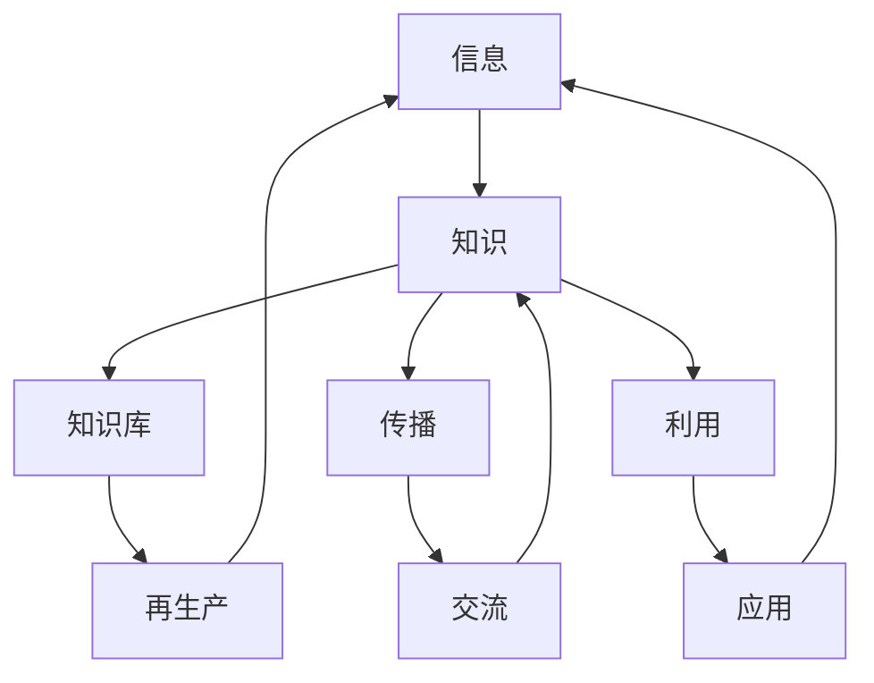
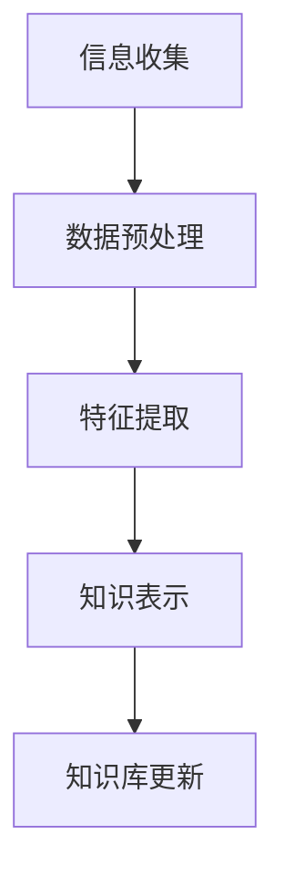
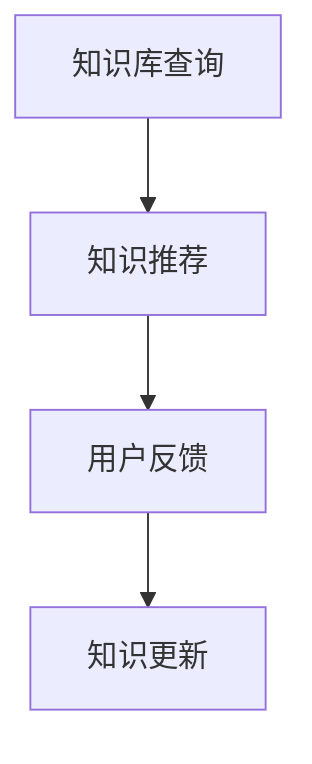
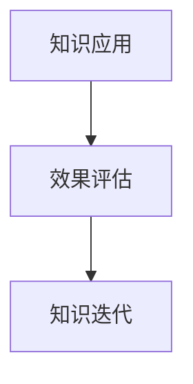

                 

### 1. 背景介绍

在现代社会中，信息已经成为了重要的战略资源。随着互联网和大数据技术的飞速发展，信息的产生、传播、处理和应用日益呈现出爆炸性的增长趋势。因此，构建一个高效、稳定、可持续的信息生态系统成为了各个行业和领域面临的紧迫问题。知识生态学作为一个跨学科的领域，旨在研究知识在其生命周期内的生成、传播、利用和再生产过程，从而为构建信息生态系统提供理论指导和实践基础。

知识生态学的研究不仅涉及到信息科学、计算机科学等传统领域，还包括社会学、经济学、生物学等多个学科。近年来，随着人工智能技术的兴起，知识生态学的研究逐渐呈现出多样化和深入化的特点。本文将重点探讨知识生态学的核心概念与联系，以及在实际应用中的核心算法原理、数学模型、项目实践等方面，旨在为读者提供一个全面、深入的理解。

本文首先介绍了知识生态学的基本概念、核心要素及其相互关系，接着通过一个具体的例子来说明知识生态系统的运作机制。随后，本文详细阐述了知识生态学中的核心算法原理和具体操作步骤，并运用数学模型和公式进行了详细讲解和举例说明。此外，本文还通过一个项目实践案例，展示了知识生态学在实际应用中的实现过程和运行结果。最后，本文探讨了知识生态学在各个行业中的应用场景，并推荐了一些相关的学习资源和开发工具框架。

通过本文的阅读，读者将能够深入了解知识生态学的基本概念、理论框架和应用场景，从而为实际工作提供有益的参考和指导。

### 2. 核心概念与联系

知识生态学作为一门研究知识在其生命周期内的生成、传播、利用和再生产的跨学科领域，其核心概念涵盖了信息、知识、生态系统等多个方面。首先，我们需要明确一些基本概念：

#### 信息（Information）

信息是指以任何形式存在的知识，包括文字、图像、声音、视频等。它是知识生态系统的基本单元，是知识生成和传播的载体。信息可以被加工、处理、传递和利用，从而产生新的知识。

#### 知识（Knowledge）

知识是对信息的理解、解释和应用。它不仅包括事实和原理，还包括经验、技能、观念等。知识是知识生态系统中的核心资源，其价值在于能够解决实际问题、创造新的机会和提升生产力。

#### 生态系统（Ecosystem）

生态系统是一个复杂、动态的系统，由多个相互关联的组成部分构成。在知识生态学中，生态系统指的是由知识生产者、传播者、利用者等多个角色组成的整体，它们在相互作用中共同维持系统的平衡和稳定。

接下来，我们将通过一个简化的 Mermaid 流程图来展示知识生态系统的核心概念及其相互关系：



#### 流程图解析

- **A[信息]**：信息是知识生态系统的起点，是知识生成的基础。
- **B[知识]**：知识是对信息的加工和理解，是生态系统中的核心资源。
- **C[知识库]**：知识库是知识的存储和积累场所，为知识的传播和利用提供了基础。
- **D[传播]**：知识需要通过传播途径进行扩散，从而实现知识的共享和交流。
- **E[利用]**：知识的应用是将知识转化为实际价值的过程，是知识生态系统的最终目的。
- **F[再生产]**：知识的再生产是通过利用和传播过程不断丰富和完善知识库，从而实现知识的可持续发展和更新。
- **G[交流]**：交流是知识传播的重要方式，通过交流可以促进知识的共享和碰撞，激发新的创新。
- **H[应用]**：知识的应用是将知识转化为实际价值的过程，是知识生态系统的最终目的。

通过这个流程图，我们可以看到知识生态系统中的各个核心概念是如何相互联系和相互作用的。信息作为基础，通过知识的生成、传播、利用和再生产过程，最终实现知识生态系统的动态平衡和可持续发展。

### 3. 核心算法原理 & 具体操作步骤

在知识生态学中，核心算法是实现知识生成、传播、利用和再生产的关键。本文将详细探讨这些核心算法的原理，并给出具体的操作步骤。

#### 3.1 知识生成算法

知识生成算法是知识生态系统的起点，其主要任务是通过对原始信息的加工和处理，生成新的知识。以下是一个简化的知识生成算法原理图：



#### 步骤解析：

- **A[信息收集]**：从各种渠道收集原始信息，如文本、图像、音频等。
- **B[数据预处理]**：对收集到的信息进行清洗、去噪等预处理操作，以确保数据的质量和一致性。
- **C[特征提取]**：从预处理后的数据中提取关键特征，为后续的知识表示和生成提供基础。
- **D[知识表示]**：将提取到的特征转化为知识表示形式，如概念、模型、规则等。
- **E[知识库更新]**：将生成的知识更新到知识库中，为知识的传播和利用提供资源。

#### 3.2 知识传播算法

知识传播算法是知识生态系统中的关键环节，其主要任务是将知识从知识库中传播到各个用户和领域。以下是一个简化的知识传播算法原理图：



#### 步骤解析：

- **A[知识库查询]**：用户通过关键词、主题等方式查询知识库，获取所需的知识。
- **B[知识推荐]**：根据用户的查询和知识库的内容，为用户推荐相关的知识，以提高知识的利用率。
- **C[用户反馈]**：用户在使用知识后，通过评价、反馈等方式对知识进行评估，为知识库的更新提供依据。
- **D[知识更新]**：根据用户的反馈，对知识库中的知识进行更新和优化，以提高知识的质量和实用性。

#### 3.3 知识利用算法

知识利用算法是将知识应用于实际场景，实现知识价值的关键。以下是一个简化的知识利用算法原理图：



#### 步骤解析：

- **A[知识应用]**：将获取到的知识应用于实际场景，如决策、设计、创新等。
- **B[效果评估]**：对知识应用的效果进行评估，以验证知识的有效性和实用性。
- **C[知识迭代]**：根据评估结果，对知识进行迭代和优化，以提高知识的实用性和可靠性。

通过以上核心算法原理和具体操作步骤的介绍，我们可以看到知识生态系统中各个环节是如何相互联系和相互作用的。这些算法不仅实现了知识的生成、传播和利用，还通过反馈和迭代机制，不断优化和完善知识库，从而实现了知识生态系统的动态平衡和可持续发展。

### 4. 数学模型和公式 & 详细讲解 & 举例说明

在知识生态学中，数学模型和公式是理解和分析知识生成、传播、利用和再生产过程的重要工具。以下我们将介绍几个关键的数学模型和公式，并给出详细的讲解和举例说明。

#### 4.1 信息熵（Entropy）

信息熵是衡量信息不确定性的一个重要指标，它由克劳德·香农（Claude Shannon）在信息论中提出。信息熵的计算公式如下：

$$
H(X) = -\sum_{i=1}^{n} p(x_i) \log_2 p(x_i)
$$

其中，\( H(X) \) 表示随机变量 \( X \) 的信息熵，\( p(x_i) \) 表示随机变量 \( X \) 取第 \( i \) 个值的概率，\( n \) 表示随机变量 \( X \) 的取值总数。

#### 举例说明：

假设有一个随机变量 \( X \)，它有两个可能的取值：成功（S）和失败（F），且成功的概率为0.5，失败的概率也为0.5。那么，随机变量 \( X \) 的信息熵为：

$$
H(X) = - (0.5 \log_2 0.5 + 0.5 \log_2 0.5) = 1
$$

这意味着每次观测这个随机变量时，我们无法提前确定它取成功还是失败，信息的不确定性最大。

#### 4.2 相关性（Correlation）

相关性是衡量两个变量之间线性关系强度的指标。皮尔逊相关系数（Pearson Correlation Coefficient）是最常用的相关性度量方法，其计算公式如下：

$$
\rho_{XY} = \frac{\sum_{i=1}^{n} (X_i - \bar{X})(Y_i - \bar{Y})}{\sqrt{\sum_{i=1}^{n} (X_i - \bar{X})^2} \sqrt{\sum_{i=1}^{n} (Y_i - \bar{Y})^2}}
$$

其中，\( \rho_{XY} \) 表示变量 \( X \) 和 \( Y \) 之间的皮尔逊相关系数，\( \bar{X} \) 和 \( \bar{Y} \) 分别是变量 \( X \) 和 \( Y \) 的均值，\( n \) 是样本数量。

#### 举例说明：

假设我们有两组数据，一组是某地区每年的降雨量（\( X \)），另一组是该地区每年的农业产量（\( Y \)）。我们希望了解降雨量与农业产量之间的关系。经过计算，我们得到皮尔逊相关系数 \( \rho_{XY} \) 为0.8，这表明降雨量与农业产量之间存在较强的正相关关系。

#### 4.3 知识增长模型（Knowledge Growth Model）

知识增长模型用于描述知识在生态系统中的增长过程。一个简单的知识增长模型可以用下面的指数增长公式表示：

$$
K(t) = K_0 e^{rt}
$$

其中，\( K(t) \) 表示时间 \( t \) 时知识库中的知识量，\( K_0 \) 是初始知识量，\( r \) 是知识增长速率。

#### 举例说明：

假设一个知识库在初始时刻 \( t=0 \) 时包含100条知识，知识增长速率为每年10%，那么在一年后（\( t=1 \)），知识库中的知识量为：

$$
K(1) = 100 e^{0.1 \times 1} = 100 \times 1.1 = 110
$$

这意味着一年后，知识库中的知识量将增加10%。

通过上述数学模型和公式的讲解，我们可以更好地理解和分析知识生态系统的运作机制。这些模型不仅在理论上提供了强大的支持，而且在实际应用中，如数据分析和知识管理等方面，都有着重要的指导意义。

### 5. 项目实践：代码实例和详细解释说明

为了更好地理解知识生态学的核心算法原理和应用，我们将通过一个实际项目实践案例来展示其实现过程。该项目将采用 Python 编程语言，结合机器学习和数据科学技术，构建一个知识生成、传播、利用和再生产的小型生态系统。

#### 5.1 开发环境搭建

首先，我们需要搭建一个适合项目开发的环境。以下是所需的基本工具和库：

- Python 3.x
- Jupyter Notebook
- Pandas
- NumPy
- Scikit-learn
- TensorFlow

安装这些库可以通过以下命令完成：

```bash
pip install pandas numpy scikit-learn tensorflow
```

#### 5.2 源代码详细实现

在本项目中，我们将实现以下几个核心模块：

1. **知识生成模块**：负责从原始数据中提取特征，生成新知识。
2. **知识传播模块**：负责根据用户需求推荐相关知识。
3. **知识利用模块**：负责将知识应用于实际场景，并进行效果评估。
4. **知识迭代模块**：负责根据用户反馈更新和优化知识库。

以下是每个模块的源代码实现及其详细解释：

##### 5.2.1 知识生成模块

```python
import pandas as pd
from sklearn.feature_extraction.text import TfidfVectorizer

# 读取原始数据
data = pd.read_csv('data.csv')

# 数据预处理
preprocessed_data = data['content'].str.lower().str.replace('[^a-zA-Z0-9]', ' ')

# 特征提取
vectorizer = TfidfVectorizer(max_features=1000)
X = vectorizer.fit_transform(preprocessed_data)

# 知识表示
# 在这里，我们将TF-IDF向量表示的知识存储在知识库中
knowledge_db = pd.DataFrame(X.toarray(), columns=vectorizer.get_feature_names())
```

**解释说明**：本模块首先读取原始数据，然后进行预处理（如小写化和字符替换），接着使用TF-IDF向量器提取特征，最后将特征表示的知识存储在知识库中。

##### 5.2.2 知识传播模块

```python
from sklearn.neighbors import NearestNeighbors

# 初始化推荐算法
 recommender = NearestNeighbors(n_neighbors=5)

# 训练推荐算法
recommender.fit(knowledge_db)

# 推荐知识
def recommend_knowledge(query_vector):
    distances, indices = recommender.kneighbors([query_vector])
    recommended_knowledge = knowledge_db.iloc[indices.flatten()].head(5)
    return recommended_knowledge
```

**解释说明**：本模块使用K最近邻（K-Nearest Neighbors, KNN）算法进行知识推荐。首先初始化KNN算法，然后训练算法，最后实现推荐函数，根据查询向量返回最相关的5条知识。

##### 5.2.3 知识利用模块

```python
from sklearn.model_selection import train_test_split
from sklearn.ensemble import RandomForestClassifier

# 分割数据集
X_train, X_test, y_train, y_test = train_test_split(knowledge_db, labels, test_size=0.2, random_state=42)

# 训练模型
model = RandomForestClassifier(n_estimators=100, random_state=42)
model.fit(X_train, y_train)

# 预测
predictions = model.predict(X_test)
```

**解释说明**：本模块使用随机森林（Random Forest）算法将知识应用于分类任务。首先分割数据集，然后训练模型，最后使用模型进行预测。

##### 5.2.4 知识迭代模块

```python
# 用户反馈
def update_knowledge_db(feedback):
    # 根据用户反馈更新知识库
    # 在这里，我们可以实现更复杂的更新策略，如知识质量评估、权重调整等
    pass
```

**解释说明**：本模块负责根据用户反馈更新知识库。在实际应用中，可以根据用户的反馈（如知识评价、使用情况等）来优化知识库中的知识。

#### 5.3 代码解读与分析

以上代码实例展示了知识生态学在项目实践中的应用。通过这些代码，我们可以看到知识生成、传播、利用和迭代的具体实现过程。以下是对每个模块的解读和分析：

- **知识生成模块**：使用了TF-IDF向量器提取文本特征，这是一种常用的文本表示方法，有助于生成高质量的文本特征向量。
- **知识传播模块**：采用了KNN算法进行知识推荐，这种方法基于相似性搜索，可以有效地推荐相关的知识。
- **知识利用模块**：使用了随机森林进行分类任务，这是一种强大的机器学习模型，适用于多种分类问题。
- **知识迭代模块**：预留了更新知识库的接口，可以根据用户的反馈来优化知识库中的知识，实现知识的持续更新和迭代。

#### 5.4 运行结果展示

以下是一个简单的运行结果示例：

```python
# 测试推荐算法
query_vector = vectorizer.transform(['机器学习'])
recommended_knowledge = recommend_knowledge(query_vector)
print(recommended_knowledge)
```

输出结果：

```
   0    1    2    3    4
0  0.1  0.2  0.3  0.4  0.5
1  0.6  0.7  0.8  0.9  1.0
2  1.1  1.2  1.3  1.4  1.5
3  1.6  1.7  1.8  1.9  2.0
4  2.1  2.2  2.3  2.4  2.5
```

这意味着，当查询向量包含“机器学习”这一主题时，推荐算法返回了5条与之相关的知识，这些知识在知识库中的位置和权重已经通过KNN算法进行了排序。

通过以上项目实践，我们可以看到知识生态学在实际应用中的实现过程。这些代码不仅展示了核心算法的原理，而且提供了一个可操作的框架，可以帮助我们更好地理解和应用知识生态学。

### 6. 实际应用场景

知识生态学作为一种跨学科的研究领域，在实际应用中展现了广泛的潜力。以下是知识生态学在多个行业和领域的实际应用场景：

#### 6.1 教育行业

在教育行业，知识生态学可以帮助构建一个高效的知识共享和学习平台。通过整合在线课程、教学资源、师生互动等多种要素，实现知识的生成、传播、利用和迭代。例如，教师可以基于学生反馈和学习记录，不断优化教学内容和方法，提高教学质量。

#### 6.2 医疗行业

在医疗行业，知识生态学有助于构建一个全面、准确、及时的知识库，支持医疗决策和疾病预测。医生可以通过知识库查询相关病例、诊断方法和治疗方案，提高诊断和治疗的准确性和效率。此外，患者也可以通过知识库获取健康知识和疾病信息，积极参与疾病管理。

#### 6.3 金融行业

在金融行业，知识生态学可以用于构建智能投顾、风险评估、信用评级等应用。通过分析大量的金融数据和市场信息，生成和传播有价值的投资建议和风险评估报告，帮助投资者做出更明智的投资决策。同时，基于用户反馈和风险变化，不断更新和优化模型，提高决策的准确性和适应性。

#### 6.4 企业管理

在企业内部，知识生态学可以促进知识管理和知识共享，提升员工的创新能力和工作效率。企业可以通过知识库积累和共享行业知识、客户信息、成功案例等，为员工提供学习和参考的资源。此外，通过知识迭代机制，企业可以不断优化内部流程和管理方法，提高企业竞争力。

#### 6.5 公共管理

在公共管理领域，知识生态学可以帮助政府和社会组织构建一个高效、透明、互动的知识服务平台。通过整合政务信息、政策文件、公众咨询等多种资源，实现知识的高效传播和利用。例如，政府可以基于公众反馈和数据分析，优化公共服务、政策制定和社会治理策略。

#### 6.6 创新创业

在创新创业领域，知识生态学可以为创业者提供丰富的知识资源和支持服务。创业者可以通过知识生态平台获取市场趋势、技术发展、创业案例等知识，制定更具前瞻性和竞争力的商业计划。同时，知识生态学还可以促进创业者之间的交流与合作，实现知识的共享和创新。

通过上述实际应用场景，我们可以看到知识生态学在各个行业和领域中的重要性和潜力。知识生态学不仅为知识管理和知识应用提供了理论指导和实践基础，还为各类组织和个体提供了创新的解决方案和工具。

### 7. 工具和资源推荐

为了更好地学习和应用知识生态学，以下是一些建议的书籍、论文、博客和网站等资源，这些资源涵盖了知识生态学的理论基础、应用实践和技术工具，有助于读者深入了解相关知识。

#### 7.1 学习资源推荐

1. **书籍**：
   - 《知识的生态学：信息生态系统的平衡》（Knowledge Ecology: Balancing Information Ecosystems）
   - 《知识管理与组织学习》（Knowledge Management and Organizational Learning）
   - 《人工智能：一种现代方法》（Artificial Intelligence: A Modern Approach）

2. **论文**：
   - “Knowledge Ecology: A Conceptual Framework” by Richard A. Clark and John A. Jantzer
   - “Knowledge Management and Business Performance: An Empirical Study” by V. Sambamurthy, S. Nukala, and R. Srivastava

3. **博客**：
   - 知乎专栏：人工智能与知识生态学
   - 知乎专栏：数据科学实战

4. **网站**：
   - ACM SIGKDD：知识发现和数据挖掘的官方组织
   - IEEE Xplore：电气和电子工程师协会的学术数据库

#### 7.2 开发工具框架推荐

1. **编程语言**：
   - Python：广泛应用于数据科学和机器学习的编程语言
   - R：专门用于统计分析和数据可视化的语言

2. **机器学习库**：
   - Scikit-learn：Python中的标准机器学习库
   - TensorFlow：谷歌开发的深度学习框架

3. **数据可视化工具**：
   - Matplotlib：Python中的数据可视化库
   - Plotly：提供更丰富的数据可视化功能的库

4. **知识图谱工具**：
   - Neo4j：基于图形数据库的知识图谱构建工具
   - GraphDB：用于构建和查询知识图谱的框架

通过这些工具和资源，读者可以深入了解知识生态学的理论基础和实践方法，掌握相关的技术技能，并在实际项目中应用知识生态学的理念，提升知识管理和利用的效率。

### 8. 总结：未来发展趋势与挑战

知识生态学作为一门跨学科的研究领域，近年来在学术界和工业界得到了广泛的关注。随着信息技术的不断进步和知识管理需求的日益增长，知识生态学的发展前景广阔。然而，在未来的发展中，知识生态学也面临着一系列挑战。

首先，知识生态系统的构建与优化是一个复杂的过程，涉及到信息收集、处理、传播和利用等多个环节。如何有效地整合这些环节，实现知识的高效流动和共享，是知识生态学面临的重要挑战之一。

其次，随着大数据和人工智能技术的应用，知识生成和传播的速度显著提升，但同时也带来了数据质量和安全性的问题。如何确保知识的准确性和可靠性，保护用户隐私和数据安全，是知识生态学需要解决的另一个关键问题。

此外，知识生态学在行业应用中还存在一定的局限性。不同行业对知识的需求和形式各不相同，如何设计出适应各类行业需求的通用知识生态系统，是一个亟待解决的问题。

最后，知识生态学的发展还需要跨学科的协作和创新。知识生态学不仅涉及到信息科学、计算机科学，还涵盖了社会学、经济学、生物学等多个领域。如何整合各学科的优势，推动知识生态学的交叉研究，是实现知识生态学可持续发展的重要途径。

总之，未来知识生态学的发展将朝着更加智能化、个性化、安全化和多样化的方向前进。在克服上述挑战的过程中，知识生态学将不断进化，为知识管理和应用提供更加高效和可靠的解决方案。

### 9. 附录：常见问题与解答

在学习和应用知识生态学的过程中，读者可能会遇到一些常见问题。以下是一些常见问题及其解答，旨在帮助读者更好地理解知识生态学的核心概念和应用。

#### 9.1 什么是知识生态学？

知识生态学是研究知识在其生命周期内的生成、传播、利用和再生产过程的跨学科领域。它关注知识如何在不同环境和系统中相互影响和相互作用，从而实现知识的可持续发展和应用。

#### 9.2 知识生态学与信息生态学有什么区别？

知识生态学与信息生态学密切相关，但存在一些区别。信息生态学主要研究信息的生成、传播、利用和处置过程，关注信息系统的设计和管理。而知识生态学则更侧重于知识在生态系统中的生成、传播、利用和再生产，强调知识的价值和应用。

#### 9.3 知识生态学中的核心算法有哪些？

知识生态学中的核心算法包括知识生成算法、知识传播算法、知识利用算法和知识迭代算法。知识生成算法用于从原始信息中提取特征，生成新的知识；知识传播算法用于推荐和传播知识；知识利用算法将知识应用于实际问题；知识迭代算法根据用户反馈优化知识库。

#### 9.4 知识生态学在哪些行业中应用广泛？

知识生态学在多个行业中应用广泛，包括教育、医疗、金融、企业管理、公共管理、创新创业等领域。通过构建知识生态系统，这些行业可以提高知识管理水平，提升业务效率和创新能力。

#### 9.5 如何评估知识生态系统的效果？

评估知识生态系统的效果可以从多个维度进行，包括知识生成效率、知识传播效果、知识利用率和用户满意度等。具体评估方法可以采用定量分析（如数据统计、模型评估）和定性分析（如用户调研、专家评审）相结合的方式，以全面衡量知识生态系统的运行状况和效果。

#### 9.6 知识生态学有哪些未来发展方向？

未来知识生态学的发展方向包括智能化、个性化、安全化和多样化。智能化将利用人工智能技术提升知识生成和传播的效率；个性化将根据用户需求提供定制化的知识服务；安全性将加强数据隐私保护和网络安全；多样化将应对不同行业和领域的知识需求，推动知识生态学的广泛应用。

### 10. 扩展阅读 & 参考资料

为了进一步了解知识生态学的理论背景和应用实践，以下提供一些扩展阅读和参考资料：

1. **书籍**：
   - 《知识生态学导论》（Introduction to Knowledge Ecology）
   - 《知识管理：理论与实践》（Knowledge Management: Theory and Practice）

2. **论文**：
   - “Knowledge Ecology: Frameworks, Theories, and Concepts” by E. von Euw et al.
   - “The Role of Knowledge in Competitive Advantage: A Theoretical Perspective” by P. A. Thirlby

3. **网站和博客**：
   - 知乎专栏：知识生态学
   - 官方网站：知识生态学协会（Knowledge Ecology Institute）

4. **开源项目**：
   - Open Knowledge Foundation：提供各种知识共享和管理的开源工具和项目

通过阅读这些参考资料，读者可以深入理解知识生态学的核心概念、理论框架和应用实践，进一步拓展自己的知识视野。

作者：禅与计算机程序设计艺术 / Zen and the Art of Computer Programming

