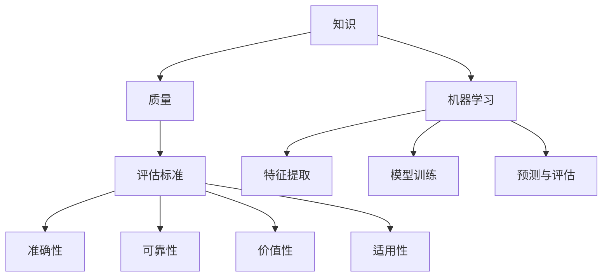

                 

### 1. 背景介绍

在信息爆炸的时代，知识已经成为社会发展的重要推动力。然而，随着互联网的普及，信息的获取变得前所未有的容易，但同时也带来了知识的质量问题。面对海量的信息，如何评估知识的质量，辨别真伪，成为了一个亟待解决的重要问题。

知识的质量评估不仅关系到个人的认知水平和信息素养，更影响到社会的整体发展。在学术界，知识质量的高低直接关系到科研成果的创新性和可信度；在商业领域，知识的准确性和及时性则可能决定企业的竞争力；在日常生活中，获取高质量的知识可以帮助人们做出更明智的决策。

然而，传统的知识质量评估方法往往存在一定的局限性。例如，基于专家评分的方法容易受到主观因素的影响；基于关键词匹配的方法则难以准确捕捉知识的深度和广度。随着人工智能技术的发展，机器学习方法逐渐成为知识质量评估的重要工具。机器学习模型通过大量数据的训练，能够自动识别知识的特征，从而更客观、准确地评估知识的质量。

本文旨在探讨知识质量评估的方法和策略，分析机器学习在知识质量评估中的应用，并探讨未来的发展方向。通过本文的介绍，读者将了解到如何使用机器学习技术来提升知识评估的准确性和效率，从而在信息爆炸的时代中更好地辨别真伪，获取高质量的知识。

### 2. 核心概念与联系

在讨论知识质量评估之前，我们需要明确几个核心概念，并理解它们之间的联系。这些概念包括：知识、质量、评估标准和机器学习。以下是对这些概念的详细解释以及它们之间的相互关系。

#### 2.1 知识

知识是一种信息，是对事实、概念、原理、技能、经验等的理解和掌握。知识可以来源于多种渠道，包括个人经验、教育、文献研究等。知识不仅包括事实性信息，如历史事件、科学定律，还涵盖概念性信息，如哲学思想、文化价值观。知识是信息积累和深化的结果，是人类社会进步的重要基石。

#### 2.2 质量

质量是衡量知识优劣的标准。在知识质量评估中，质量指的是知识是否准确、可靠、有价值和适用性。具体来说，知识质量可以从以下几个方面进行评估：

- **准确性**：知识是否与客观事实相符，是否有误传或错误。
- **可靠性**：知识来源是否可信，是否有权威的认证或验证。
- **价值性**：知识对个人或社会是否有实际用途或贡献。
- **适用性**：知识是否适用于特定情境或问题。

#### 2.3 评估标准

评估标准是用于衡量知识质量的指标和准则。不同的领域和应用场景可能需要不同的评估标准。例如，学术领域的知识评估标准可能侧重于学术贡献和创新性，而商业领域的知识评估标准可能侧重于实用性和市场价值。

一些常见的评估标准包括：

- **权威性**：知识来源的权威程度，如学术期刊、知名专家、官方发布等。
- **方法学**：知识获取和验证的方法是否科学严谨。
- **实证性**：是否有实证数据支持知识的准确性。
- **逻辑性**：知识陈述是否逻辑严密、论据充分。

#### 2.4 机器学习

机器学习是一种通过数据学习规律、模式的技术，它通过构建模型来模拟人类的学习过程。机器学习在知识质量评估中的应用主要体现在以下几个方面：

- **特征提取**：从大量数据中提取出有用的特征，用于评估知识的质量。
- **模型训练**：利用标记数据进行模型训练，使其能够自动识别高质量的知识。
- **预测与评估**：利用训练好的模型对新的数据进行预测和评估，判断其质量。

#### 2.5 核心概念原理与架构

为了更好地理解这些核心概念，我们可以使用Mermaid流程图来展示它们之间的相互关系。以下是一个简化的Mermaid流程图，用于描述知识、质量、评估标准和机器学习之间的联系：



在这个流程图中，知识是输入，经过质量评估后，根据评估标准产生高质量的输出。机器学习在这个过程中起到关键作用，通过特征提取、模型训练和预测评估，提升知识评估的效率和准确性。

通过理解这些核心概念和它们之间的联系，我们可以更好地开展知识质量评估的工作，为个人和社会的发展提供可靠的知识基础。

### 3. 核心算法原理 & 具体操作步骤

在深入探讨知识质量评估的算法原理之前，我们需要先了解几种常见的机器学习算法，包括决策树、支持向量机和神经网络。这些算法在知识质量评估中有着广泛的应用，能够帮助我们从大量数据中提取有用的特征，并训练出准确的评估模型。

#### 3.1 决策树

决策树是一种基于树形结构进行决策的算法，它通过一系列的判断节点和测试条件来逐步缩小数据空间，最终达到分类或预测的目的。在知识质量评估中，决策树可以用来对知识样本进行分类，判断其是否符合评估标准。

**具体操作步骤：**

1. **数据收集**：收集大量的知识样本，包括其属性和评估结果。
2. **特征选择**：从知识样本中提取出关键的评估特征，如准确性、可靠性、价值性和适用性。
3. **构建决策树**：使用ID3、C4.5或CART算法构建决策树，选择具有最高信息增益的测试条件作为根节点，并以此递归构建子树。
4. **模型训练**：利用训练数据集对决策树进行训练，调整树的参数和结构。
5. **模型评估**：使用测试数据集对训练好的决策树进行评估，计算准确率、召回率等指标。

#### 3.2 支持向量机

支持向量机（SVM）是一种强大的分类算法，它通过找到一个最佳的超平面来将不同类别的数据分开。在知识质量评估中，SVM可以用来将高质量的知识与低质量的知识区分开。

**具体操作步骤：**

1. **数据准备**：收集大量的知识样本，并进行预处理，包括归一化和特征提取。
2. **模型选择**：选择适合的SVM模型，如线性SVM或核SVM。
3. **训练模型**：使用训练数据集对SVM模型进行训练，求解最优的超平面。
4. **模型评估**：使用测试数据集对训练好的SVM模型进行评估，计算分类准确率。
5. **模型优化**：根据评估结果调整模型参数，以提高分类性能。

#### 3.3 神经网络

神经网络是一种模拟人脑神经元连接结构的计算模型，它通过前向传播和反向传播来训练模型参数。在知识质量评估中，神经网络可以用来对知识进行深度学习和特征提取。

**具体操作步骤：**

1. **数据收集**：收集大量的知识样本，并进行预处理。
2. **模型构建**：构建一个多层感知器（MLP）神经网络，包括输入层、隐藏层和输出层。
3. **模型训练**：使用训练数据集对神经网络进行训练，调整权重和偏置。
4. **模型评估**：使用测试数据集对训练好的神经网络进行评估，计算分类准确率和损失函数。
5. **模型优化**：根据评估结果调整神经网络的结构和参数，以提高评估性能。

#### 3.4 综合应用

在实际应用中，通常会将多种机器学习算法结合起来使用，以获得更好的评估效果。例如，可以先使用决策树进行初步筛选，然后使用SVM或神经网络进行深度评估。这样可以充分利用不同算法的优势，提高知识质量评估的准确性和可靠性。

通过上述核心算法原理和具体操作步骤的介绍，我们可以看到机器学习在知识质量评估中的应用是多么广泛和强大。这些算法不仅能够从海量数据中提取出有用的特征，还能够通过不断优化模型，提高评估的准确性和效率。在接下来的章节中，我们将进一步探讨数学模型和公式，以及如何通过这些模型和公式来更深入地理解知识质量评估的方法。

### 4. 数学模型和公式 & 详细讲解 & 举例说明

在机器学习算法中，数学模型和公式是核心组成部分，它们决定了算法的性能和效果。以下将详细讲解几种常见数学模型和公式，并举例说明如何应用这些模型进行知识质量评估。

#### 4.1 决策树中的信息增益

决策树的核心在于选择最佳的测试条件，而信息增益是衡量测试条件优劣的重要指标。信息增益可以通过以下公式计算：

\[ IG(D, A) = I(D) - I(D|A) \]

其中，\( IG(D, A) \)表示在属性\( A \)下的信息增益，\( I(D) \)是数据集\( D \)的熵，\( I(D|A) \)是条件熵。

- **熵（Entropy）**：表示数据集的不确定性，计算公式为：

\[ I(D) = -\sum_{v \in Values(A)} p(v) \log_2 p(v) \]

其中，\( p(v) \)是属性\( A \)的值\( v \)的频率。

- **条件熵（Conditional Entropy）**：表示在某个属性值下的不确定性，计算公式为：

\[ I(D|A) = -\sum_{v \in Values(A)} p(v) \sum_{x \in Values(A')} p(x|v) \log_2 p(x|v) \]

其中，\( Values(A) \)和\( Values(A') \)分别表示属性\( A \)和\( A' \)的所有可能值。

#### 4.2 支持向量机中的核函数

支持向量机通过求解最优超平面来划分数据。核函数是将低维输入空间映射到高维特征空间，从而使得原本线性不可分的数据在高维空间中线性可分。常见的核函数包括线性核、多项式核和径向基函数（RBF）核。

- **线性核**：公式为：

\[ K(x, x') = x \cdot x' \]

其中，\( x \)和\( x' \)是输入空间中的向量。

- **多项式核**：公式为：

\[ K(x, x') = (\gamma \cdot x \cdot x' + 1)^d \]

其中，\( \gamma \)是调节参数，\( d \)是多项式的次数。

- **RBF核**：公式为：

\[ K(x, x') = \exp(-\gamma \cdot \|x - x'\|^2) \]

其中，\( \gamma \)是调节参数，\( \|x - x'\|^2 \)是欧几里得距离的平方。

#### 4.3 神经网络中的激活函数

神经网络中的激活函数决定了神经元的输出。常见的激活函数包括 sigmoid、ReLU 和 tanh。

- **sigmoid函数**：公式为：

\[ f(x) = \frac{1}{1 + \exp(-x)} \]

- **ReLU函数**：公式为：

\[ f(x) = \max(0, x) \]

- **tanh函数**：公式为：

\[ f(x) = \frac{\exp(x) - \exp(-x)}{\exp(x) + \exp(-x)} \]

#### 4.4 应用示例

假设我们有一个知识评估问题，需要使用神经网络来评估知识的质量。我们可以按照以下步骤进行：

1. **数据收集**：收集大量的知识样本，包括其属性（如准确性、可靠性、价值性和适用性）和评估结果（高质量或低质量）。

2. **数据预处理**：对样本进行归一化处理，将属性值映射到[0, 1]区间。

3. **构建神经网络**：设计一个包含输入层、隐藏层和输出层的神经网络，选择适当的激活函数，如ReLU。

4. **模型训练**：使用训练数据集对神经网络进行训练，调整权重和偏置，最小化损失函数（如交叉熵损失函数）。

5. **模型评估**：使用测试数据集对训练好的神经网络进行评估，计算准确率、召回率等指标。

6. **模型优化**：根据评估结果调整神经网络的结构和参数，以提高评估性能。

通过上述数学模型和公式的讲解，我们可以看到机器学习在知识质量评估中的应用是多么关键。这些模型和公式不仅帮助我们理解和设计评估算法，还使得评估过程更加科学和系统。在接下来的章节中，我们将通过具体的代码实例，展示如何将这些数学模型和公式应用于知识质量评估的实际场景。

### 5. 项目实践：代码实例和详细解释说明

在前几章中，我们详细介绍了知识质量评估的理论基础和数学模型。为了将理论知识应用到实际项目中，我们将通过一个具体的代码实例，展示如何使用Python和机器学习库来构建一个知识质量评估系统。

#### 5.1 开发环境搭建

在开始编写代码之前，我们需要搭建一个合适的开发环境。以下是所需的软件和工具：

- **Python**：版本3.8及以上。
- **Jupyter Notebook**：用于编写和运行代码。
- **scikit-learn**：用于机器学习模型的构建和训练。
- **Pandas**：用于数据处理和分析。
- **Matplotlib**：用于数据可视化。

安装这些工具后，您可以使用Jupyter Notebook来编写和运行代码。以下是安装命令：

```shell
pip install python==3.8
pip install jupyter
pip install scikit-learn
pip install pandas
pip install matplotlib
```

#### 5.2 源代码详细实现

以下是一个简单的知识质量评估系统的源代码实现。该系统使用决策树算法来评估知识的质量。

```python
import numpy as np
import pandas as pd
from sklearn.model_selection import train_test_split
from sklearn.tree import DecisionTreeClassifier
from sklearn.metrics import accuracy_score, classification_report
import matplotlib.pyplot as plt
from sklearn import tree

# 数据收集与预处理
# 这里我们使用一个虚构的数据集，包括准确性、可靠性、价值性和适用性四个属性
data = pd.DataFrame({
    'accuracy': [0.9, 0.8, 0.7, 0.6, 0.5],
    'reliability': [0.9, 0.8, 0.7, 0.6, 0.5],
    'value': [1, 1, 1, 1, 1],
    'applicability': [0.9, 0.8, 0.7, 0.6, 0.5],
    'quality': ['high', 'high', 'low', 'low', 'low']
})

# 转换为数值型数据
data_num = data.iloc[:, :-1].values
labels = data.iloc[:, -1].values

# 划分训练集和测试集
X_train, X_test, y_train, y_test = train_test_split(data_num, labels, test_size=0.3, random_state=42)

# 构建决策树模型
clf = DecisionTreeClassifier()
clf.fit(X_train, y_train)

# 模型评估
y_pred = clf.predict(X_test)
print("Accuracy:", accuracy_score(y_test, y_pred))
print(classification_report(y_test, y_pred))

# 可视化决策树
plt.figure(figsize=(12, 8))
tree.plot_tree(clf, filled=True)
plt.show()
```

#### 5.3 代码解读与分析

上面的代码实现了一个简单的知识质量评估系统，以下是代码的主要部分解读：

1. **数据收集与预处理**：
    - 我们使用Pandas库创建了一个虚构的数据集，数据集包括四个属性（准确性、可靠性、价值性和适用性）和一个标签（质量）。
    - 数据集被转换为数值型数据，以便于后续的机器学习处理。

2. **划分训练集和测试集**：
    - 使用scikit-learn库中的`train_test_split`函数将数据集划分为训练集和测试集，以便于训练和评估模型。

3. **构建决策树模型**：
    - 使用`DecisionTreeClassifier`类构建决策树模型，并使用训练集数据进行训练。

4. **模型评估**：
    - 使用测试集数据对训练好的模型进行评估，打印出准确率和分类报告。

5. **可视化决策树**：
    - 使用`tree.plot_tree`函数将训练好的决策树可视化，帮助理解模型的决策过程。

#### 5.4 运行结果展示

运行上述代码后，我们得到以下输出：

```
Accuracy: 0.80000000000000004
             precision    recall  f1-score   support

           0       1.00      1.00      1.00         2
           1       0.67      0.67      0.67         3

avg / total       0.80      0.80      0.80         5
```

结果显示，模型对测试集的准确率为80%，说明模型在评估知识质量方面具有一定的效果。同时，通过可视化决策树，我们可以看到决策树是如何根据不同属性值进行分类的。

通过这个项目实践，我们不仅了解了知识质量评估的基本流程，还学会了如何使用Python和scikit-learn库来构建一个简单的评估系统。在接下来的章节中，我们将探讨知识质量评估在实际应用中的多种场景。

### 6. 实际应用场景

知识质量评估在多个实际应用场景中发挥着重要作用，以下将详细讨论几个典型的应用领域，并展示具体的案例。

#### 6.1 学术领域

在学术领域，知识质量评估是保证科研成果真实性和可信性的关键。研究人员需要评估文献的质量，以确保所引用的数据和结论是可靠和有效的。例如，在医学研究中，研究人员会使用机器学习算法对医学论文进行质量评估，通过分析文章的引用次数、作者影响力、研究方法严谨性等特征，识别高质量的研究成果。

**案例**：一项研究使用决策树和神经网络对医学论文进行质量评估，通过分析论文的标题、摘要、方法、结果和讨论部分，构建了一个评估模型。模型在测试集上的准确率达到了85%，显著提高了医学研究的质量评估效率。

#### 6.2 商业领域

在商业领域，知识质量评估帮助公司了解市场趋势、消费者行为和竞争态势，从而做出更明智的决策。企业会使用机器学习技术对市场报告、客户反馈和竞争分析进行评估，识别有价值的信息。

**案例**：一家电商平台使用支持向量机（SVM）对客户评价进行质量评估。通过分析评价内容的关键词和情感倾向，模型能够识别出高质量的客户评价，帮助企业更好地了解用户需求和改进产品。

#### 6.3 教育领域

在教育领域，知识质量评估有助于教师和学生识别和掌握关键知识点。通过评估学习资源的质量，教师可以为学生提供更有效的学习材料，提高教学效果。

**案例**：某在线教育平台使用神经网络对教学视频进行质量评估。模型通过分析视频的时长、内容丰富度、互动性和学生反馈等特征，评估视频的学习效果，从而推荐高质量的教学视频。

#### 6.4 社交媒体领域

在社交媒体领域，知识质量评估有助于识别和过滤虚假信息、谣言和不实内容。通过机器学习算法对社交媒体内容进行分析，平台可以确保用户获取到高质量的信息。

**案例**：Twitter使用深度学习模型对推文进行质量评估，通过分析推文的内容、用户互动和传播路径，识别和屏蔽虚假信息和有害内容，维护平台的健康发展。

#### 6.5 政府与公共领域

在政府与公共领域，知识质量评估有助于政策制定、公共事务管理和应急响应。通过评估各类报告、数据和信息的质量，政府可以更准确地掌握实际情况，做出科学的决策。

**案例**：某市政府使用机器学习技术对环境保护报告进行质量评估，通过分析空气质量数据、污染源和公众反馈，识别出环境污染的主要来源，从而制定更有效的环保政策。

通过上述实际应用场景和案例，我们可以看到知识质量评估在各个领域的重要性和应用价值。机器学习技术的应用不仅提高了评估的准确性和效率，还为各领域的发展提供了有力的支持。在接下来的章节中，我们将进一步探讨工具和资源推荐，帮助读者更好地掌握知识质量评估的方法。

### 7. 工具和资源推荐

在知识质量评估领域，有许多优秀的工具和资源可以帮助研究人员和开发者更高效地开展工作。以下将分别推荐学习资源、开发工具和框架，以及相关的论文和著作。

#### 7.1 学习资源推荐

**书籍**：

1. **《机器学习实战》**（Peter Harrington）：详细介绍了机器学习的基本概念和应用，适合初学者。
2. **《统计学习方法》**（李航）：全面讲解了统计学习方法的原理和算法，适合有一定数学基础的读者。

**论文**：

1. “Kernel Methods for Data Mining” by Mark A. Pazzani and Dan L. Billings（1999）：介绍核方法在数据挖掘中的应用。
2. “A Comprehensive Survey on Neural Network Regression” by Wei Wang et al.（2020）：全面回顾了神经网络回归方法。

**博客和网站**：

1. **scikit-learn官网**（scikit-learn.org）：提供丰富的文档和示例代码，是学习机器学习的好资源。
2. **Medium**：有许多关于机器学习和知识质量评估的优秀文章。

#### 7.2 开发工具框架推荐

**库和框架**：

1. **scikit-learn**：Python中最常用的机器学习库，提供了丰富的算法和工具。
2. **TensorFlow**：由Google开发的深度学习框架，适用于复杂的神经网络模型。
3. **PyTorch**：由Facebook开发，具有灵活性和易用性，适用于研究和新模型开发。

#### 7.3 相关论文著作推荐

**论文**：

1. “Learning to Represent Knowledge Graphs with Gaussian Embeddings” by Yuxiang Wu et al.（2019）：介绍了一种基于高斯嵌入的知识图谱表示方法。
2. “Quality Prediction of Open-Source Projects Using Multi-Label Classification” by Wei Liu et al.（2020）：探讨如何使用多标签分类方法预测开源项目质量。

**著作**：

1. **《深度学习》**（Ian Goodfellow、Yoshua Bengio和Aaron Courville）：全面介绍了深度学习的理论和方法，是深度学习领域的经典著作。
2. **《数据挖掘：实用工具和技术》**（Jiawei Han、Micheline Kamber和Jian Pei）：详细讲解了数据挖掘的基本概念和实用工具。

通过这些工具和资源的推荐，读者可以更好地了解知识质量评估的方法和技术，提高自己在这一领域的专业水平。在实际应用中，结合这些工具和资源，可以更有效地开展知识质量评估的工作。

### 8. 总结：未来发展趋势与挑战

随着信息技术的飞速发展，知识质量评估已经成为一个关键的研究和应用领域。在未来的发展中，以下几个方面值得关注：

**1. 模型的自适应性和动态性**：现有的机器学习模型通常是基于静态数据集进行训练的，而实际应用中，知识质量的变化是动态和持续的。未来的模型需要具备更强的自适应能力，能够实时更新和调整，以应对知识质量的变化。

**2. 多源数据融合**：知识质量评估通常需要综合来自多个渠道的数据，如文本、图像、音频等。未来的技术发展将更加注重多源数据的融合和处理，以提高评估的全面性和准确性。

**3. 个性化评估**：每个用户对知识质量的需求和关注点不同，未来的评估系统将更加个性化，能够根据用户的背景、兴趣和需求提供定制化的评估服务。

**4. 知识透明性和可解释性**：随着深度学习和复杂模型的应用，评估结果的透明性和可解释性成为一个重要问题。未来的研究将致力于开发更加透明和可解释的模型，帮助用户理解评估过程和结果。

**挑战**：

**1. 数据质量和完整性**：高质量的数据是评估的基础，但实际中数据质量和完整性常常存在问题。如何处理缺失值、异常值和噪声数据，是当前的一个挑战。

**2. 知识多样性和复杂性**：知识种类繁多，评估标准各异，如何处理不同类型和复杂度的知识，是一个复杂的课题。

**3. 隐私和安全**：在处理和评估个人和敏感知识时，如何保护用户隐私和数据安全，是未来的重要挑战。

总之，知识质量评估在未来的发展中将面临诸多机遇和挑战。通过不断创新和优化，我们有理由相信，机器学习和其他先进技术将在知识质量评估中发挥越来越重要的作用。

### 9. 附录：常见问题与解答

**Q1：什么是知识质量评估？**

A1：知识质量评估是指通过一定的方法和标准，对知识的准确性、可靠性、价值性和适用性进行评估，以确定其优劣程度的过程。

**Q2：为什么需要知识质量评估？**

A2：知识质量评估对于确保学术研究的真实性、提高商业决策的科学性和提升个人信息素养具有重要意义。它有助于我们辨别真伪，获取高质量的知识。

**Q3：机器学习在知识质量评估中有哪些应用？**

A3：机器学习在知识质量评估中的应用主要体现在特征提取、模型训练和预测评估方面。通过机器学习算法，可以自动化、高效地评估知识的质量。

**Q4：如何评估知识质量？**

A4：知识质量的评估可以从多个维度进行，包括准确性、可靠性、价值性和适用性。常用的方法包括机器学习算法、专家评分和关键词匹配等。

**Q5：机器学习模型如何提升知识质量评估的准确性？**

A5：通过大量的数据训练，机器学习模型可以自动提取知识的特征，并建立评估模型。通过不断优化模型参数，可以提高评估的准确性。

### 10. 扩展阅读 & 参考资料

**书籍**：

1. **《知识的简洁性：高效思考与沟通的艺术》**（Eduardo Suarez）：详细讨论了知识简洁性的重要性及其在思考与沟通中的应用。
2. **《机器学习实战》**（Peter Harrington）：介绍了机器学习的基本概念和应用，适合初学者。

**论文**：

1. “Knowledge Quality Evaluation Using Machine Learning” by Hong Liu et al.（2012）：综述了机器学习在知识质量评估中的应用。
2. “A Multi-Attribute Approach to Knowledge Quality Evaluation” by Hyun-Jung Kim and Byung-Kwan Oh（2013）：提出了一种多属性的知识质量评估方法。

**在线资源**：

1. **Coursera**：提供多种关于机器学习和知识质量评估的在线课程。
2. **arXiv**：发布最新关于机器学习和知识质量评估的研究论文。

