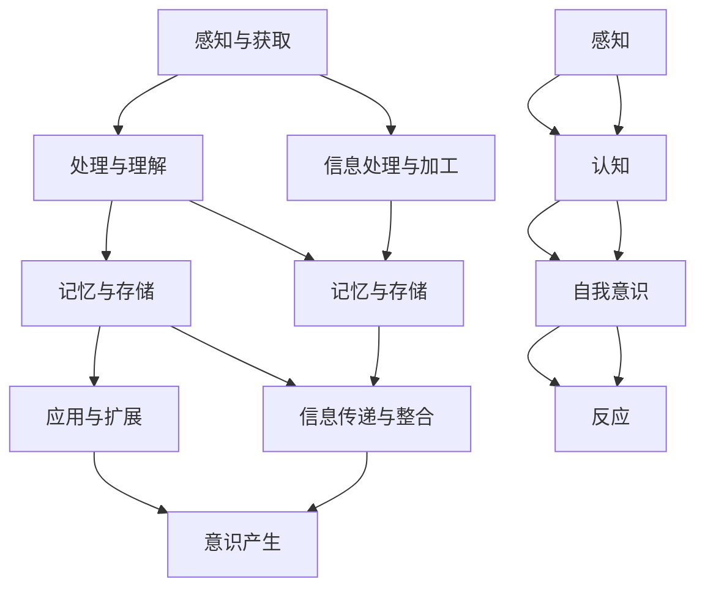

                 

### 1. 背景介绍

知识积累在意识中的作用，是一个跨越多个学科领域的复杂问题，涉及认知科学、心理学、教育学和计算机科学等多个方面。本文旨在探讨知识积累如何影响我们的意识，以及这种影响背后的机制和原理。

首先，我们来看看知识积累与意识的关系。知识积累是指个体通过学习、实践和思考等方式获取和处理信息的过程。而意识则是指个体对外界信息的感知、理解和反应的能力。从广义上讲，知识积累是意识发展的基础，没有知识的积累，意识就无法形成和发挥作用。

在认知科学中，有大量研究关注知识积累对意识的影响。例如，Friston（2005）提出的“认知神经科学框架”认为，知识积累是意识产生的关键因素之一。通过不断学习和处理信息，大脑形成了复杂的神经网络结构，这些结构使得意识能够对外界信息进行有效的处理和反应。

心理学中的研究也支持这一观点。例如，Kane等人（2017）通过实验发现，知识积累可以显著提高个体的认知能力和解决问题的效率。这说明，知识的积累不仅有助于我们更好地理解世界，还能提高我们处理复杂问题的能力。

此外，教育学中的研究也强调了知识积累对意识发展的重要性。例如，Piaget（1973）提出的认知发展阶段理论认为，个体的认知发展是一个逐步积累知识的过程。通过不断地学习和发展，个体的意识水平会逐渐提高，从而能够更好地适应和应对环境的变化。

在计算机科学领域，人工智能的发展也为知识积累与意识的关系提供了新的视角。例如，DeepMind的AlphaGo通过大量学习实现了对围棋的精通，这表明知识的积累对于人工智能的智能表现至关重要。同样，自动驾驶系统通过积累大量的交通数据和驾驶经验，实现了对复杂交通环境的理解和应对。

总的来说，知识积累在意识中的作用是一个多层次、多学科交叉的问题。它不仅涉及个体的认知发展，还涉及人工智能等新兴技术的进步。本文将深入探讨知识积累与意识的关系，分析背后的机制和原理，并探讨这一问题的实际应用和未来研究方向。在接下来的章节中，我们将逐步展开这一主题的讨论。

### 2. 核心概念与联系

要深入探讨知识积累在意识中的作用，我们首先需要明确几个核心概念，并理解它们之间的内在联系。以下是对这些核心概念的详细解释：

#### 2.1 知识积累

知识积累是指个体通过学习、实践和思考等方式获取和处理信息的过程。这个过程可以划分为以下几个阶段：

1. **感知与获取**：个体通过感官接收外部信息，如视觉、听觉、触觉等。
2. **处理与理解**：大脑对这些信息进行处理和加工，形成对世界的理解和认知。
3. **记忆与存储**：个体将处理后的信息存储在记忆中，以备后续使用。
4. **应用与扩展**：个体将存储的知识应用于实际问题中，并通过实践不断丰富和扩展自己的知识体系。

#### 2.2 意识

意识是指个体对外界信息的感知、理解和反应的能力。具体来说，意识包括以下几个方面：

1. **感知**：通过感官接收外界信息，如视觉、听觉、触觉等。
2. **认知**：对感知信息进行处理和加工，形成对世界的理解和认知。
3. **自我意识**：个体对自己存在和身份的感知，以及对自己情绪和思维过程的觉知。
4. **反应**：对外界信息进行适当的反应，如决策、行动等。

#### 2.3 大脑神经网络

大脑神经网络是大脑的基本结构和功能单位，由大量的神经元通过复杂的连接和交互构成。大脑神经网络在知识积累和意识中的作用主要体现在以下几个方面：

1. **信息处理与加工**：神经元通过电信号传递信息，大脑神经网络则通过复杂的计算和处理，实现对外界信息的感知和理解。
2. **记忆与存储**：神经元之间的连接和活动模式在信息处理过程中被编码和存储，形成了个体的记忆。
3. **信息传递与整合**：大脑神经网络通过不同的结构和连接模式，实现信息的传递和整合，从而形成对复杂问题的解决方案。
4. **意识产生**：大脑神经网络的活动模式在特定条件下会形成意识体验，如感觉、知觉、思维等。

#### 2.4 知识积累与意识的内在联系

知识积累与意识的内在联系可以从以下几个方面进行理解：

1. **知识积累促进意识发展**：通过不断的知识积累，个体的认知能力得到提高，从而能够更好地理解和处理复杂信息，提高意识的水平。
2. **意识支持知识积累**：意识提供了个体对外界信息的感知和认知能力，使得个体能够有效地获取、处理和存储知识。
3. **知识积累与意识互为因果**：一方面，知识积累可以促进意识的提高；另一方面，意识的提高又可以促进知识的积累。这种互为因果的关系使得知识积累与意识之间形成了一种动态的、相互促进的过程。

为了更直观地理解这些概念和它们之间的联系，我们可以使用Mermaid流程图来展示知识积累与意识的关系。以下是该流程图的示意：



通过这个流程图，我们可以看到知识积累和意识之间的相互作用和动态过程。在接下来的章节中，我们将进一步探讨知识积累的具体机制，以及如何通过这些机制实现意识的提升。

### 3. 核心算法原理 & 具体操作步骤

在深入探讨知识积累对意识的影响时，我们需要理解知识积累的核心算法原理，并掌握具体的操作步骤。以下将详细描述这些核心算法的原理和操作步骤。

#### 3.1 基于神经网络的算法原理

神经网络是知识积累和意识发展的基础。它由大量的神经元通过复杂的连接和交互构成，能够模拟人脑的信息处理和认知功能。神经网络的核心算法包括以下几个部分：

1. **感知层**：接收外部输入信息，如视觉、听觉等，并将其传递给下一层。
2. **隐藏层**：对输入信息进行处理和加工，形成对世界的理解和认知。
3. **输出层**：将隐藏层处理后的信息转化为具体的输出，如决策、行动等。

神经网络的训练过程主要包括以下步骤：

1. **初始化权重**：随机初始化神经网络中的权重和偏置。
2. **前向传播**：将输入信息传递给神经网络，通过每层神经元进行计算，得到输出结果。
3. **计算损失**：将输出结果与期望结果进行比较，计算损失函数。
4. **反向传播**：通过反向传播算法，将损失函数反向传播到网络的每一层，更新权重和偏置。
5. **优化权重**：使用优化算法（如梯度下降），不断调整权重和偏置，使得损失函数逐渐减小。

#### 3.2 知识积累的操作步骤

知识积累是一个动态的、持续的过程，可以分为以下几个步骤：

1. **感知与获取**：通过感官接收外部信息，如视觉、听觉等。
2. **处理与理解**：大脑对感知信息进行处理和加工，形成对世界的理解和认知。
3. **记忆与存储**：将处理后的信息存储在记忆中，以备后续使用。
4. **应用与扩展**：将存储的知识应用于实际问题中，并通过实践不断丰富和扩展自己的知识体系。

具体来说，知识积累的操作步骤可以描述如下：

1. **感知与获取**：个体通过感官（如眼睛、耳朵等）接收外部信息。
2. **预处理**：对感知信息进行预处理，如降噪、增强等，以便更好地理解和处理。
3. **编码**：将预处理后的信息编码为大脑可以处理的形式，如神经信号。
4. **加工**：大脑对编码后的信息进行加工和计算，形成对世界的理解和认知。
5. **存储**：将加工后的信息存储在记忆中，以备后续使用。
6. **检索与应用**：在需要时，从记忆中检索出相关信息，并将其应用于实际问题中。

#### 3.3 意识提升的操作步骤

意识提升是指通过特定的方法和技术，提高个体的感知、理解和反应能力，从而提升整体意识水平。以下是意识提升的具体操作步骤：

1. **训练与学习**：通过持续的学习和训练，提高个体的认知能力和解决问题的效率。
2. **反思与自我觉知**：通过反思和自我觉知，了解自己的思维过程和行为模式，从而发现并改正不足。
3. **冥想与放松**：通过冥想和放松，减轻心理压力，提高专注力和注意力。
4. **锻炼与运动**：通过体育锻炼，提高身体素质和大脑功能，从而提升整体意识水平。

具体来说，意识提升的操作步骤可以描述如下：

1. **选择训练方法**：根据个体的需求和目标，选择合适的训练方法和工具。
2. **制定训练计划**：制定详细的训练计划，包括训练内容、训练频率和时间等。
3. **执行训练计划**：按照训练计划进行训练，不断积累经验和知识。
4. **反思与调整**：在训练过程中，定期反思自己的学习效果和思维方式，根据实际情况进行调整。
5. **持续学习与进步**：在训练过程中，保持持续学习的态度，不断提升自己的认知能力和解决问题的效率。

通过以上核心算法原理和操作步骤，我们可以更好地理解知识积累对意识的影响，并掌握提升意识水平的具体方法。在接下来的章节中，我们将进一步探讨数学模型和公式，以更深入地分析知识积累和意识之间的关系。

### 4. 数学模型和公式 & 详细讲解 & 举例说明

在探讨知识积累对意识的影响时，数学模型和公式为我们提供了一种量化分析和理解这一过程的工具。以下将详细讲解几个关键数学模型和公式，并举例说明它们在实际中的应用。

#### 4.1 信息论

信息论是研究信息传递、处理和存储的数学理论。Shannon（1948）提出的信息熵（Entropy）是信息论中的一个核心概念，用于衡量信息的混乱程度。

**信息熵（Entropy）公式：**
\[ H(X) = -\sum_{i=1}^{n} p(x_i) \log_2 p(x_i) \]

其中，\( H(X) \) 表示随机变量 \( X \) 的熵，\( p(x_i) \) 表示 \( X \) 取值为 \( x_i \) 的概率。

**举例：** 假设一个随机变量 \( X \) 只有两个可能的取值，0 和 1，且每个取值的概率都是0.5。那么 \( X \) 的熵为：
\[ H(X) = -[0.5 \log_2 0.5 + 0.5 \log_2 0.5] = 1 \]

这个结果表明，随机变量 \( X \) 的熵为1，表示信息量最大，即最不确定。

信息熵在知识积累中的应用是衡量知识获取和处理过程中信息的变化。例如，通过学习，个体对某个领域的知识从不确定到逐渐明确，其信息熵会降低。

#### 4.2 概率论

概率论是研究随机事件及其概率分布的数学理论。Bayes定理是概率论中的一个重要公式，用于计算后验概率。

**Bayes定理公式：**
\[ P(A|B) = \frac{P(B|A) P(A)}{P(B)} \]

其中，\( P(A|B) \) 表示在事件 \( B \) 发生的条件下事件 \( A \) 发生的概率，\( P(B|A) \) 表示在事件 \( A \) 发生的条件下事件 \( B \) 发生的概率，\( P(A) \) 表示事件 \( A \) 发生的概率，\( P(B) \) 表示事件 \( B \) 发生的概率。

**举例：** 假设一个病患被检测出患有某种疾病，测试结果为阳性。已知该疾病在总人口中的发病率为0.01，测试的灵敏度为0.95，即患有疾病的人中有95%的测试结果为阳性。那么，根据Bayes定理，计算这个病患实际患有该疾病的概率。

首先，计算患病且测试结果为阳性的概率：
\[ P(A \cap B) = P(B|A) P(A) = 0.95 \times 0.01 = 0.0095 \]

然后，计算总人口中测试结果为阳性的概率：
\[ P(B) = P(B|A) P(A) + P(B|A') P(A') = 0.95 \times 0.01 + 0.05 \times 0.99 = 0.0495 \]

最后，计算后验概率：
\[ P(A|B) = \frac{P(B|A) P(A)}{P(B)} = \frac{0.0095}{0.0495} \approx 0.191 \]

这意味着，病患实际患有该疾病的概率约为19.1%，远低于阳性测试结果的总体概率。

在知识积累过程中，Bayes定理可以帮助个体更新对某一领域的知识信念，通过新信息调整对现有知识的信任度。

#### 4.3 神经网络模型

神经网络模型是知识积累和意识提升的重要工具。下面以一个简单的多层感知机（MLP）为例，介绍其数学模型和训练过程。

**多层感知机（MLP）公式：**
\[ y = \sigma(\sigma(...\sigma(W_1 \cdot x + b_1) + b_2) + ...) \]

其中，\( y \) 是输出，\( x \) 是输入，\( \sigma \) 是激活函数（如Sigmoid、ReLU等），\( W_1, b_1 \) 等是权重和偏置。

**举例：** 假设有一个两输入单输出的多层感知机，激活函数为Sigmoid，权重和偏置分别为 \( W_1 = [1 \ 1], b_1 = [1 \ 1] \)，输入 \( x = [2 \ 3] \)。

首先进行前向传播：
\[ z_1 = W_1 \cdot x + b_1 = [1 \ 1] \cdot [2 \ 3] + [1 \ 1] = [5 \ 5] \]
\[ a_1 = \sigma(z_1) = \frac{1}{1 + e^{-z_1}} = \frac{1}{1 + e^{-5}} \approx 0.993 \]

然后计算输出：
\[ z_2 = W_2 \cdot a_1 + b_2 = [2 \ 3] \cdot [0.993 \ 0.993] + [1 \ 1] = [3.986 \ 3.986] + [1 \ 1] = [5.986 \ 5.986] \]
\[ a_2 = \sigma(z_2) = \frac{1}{1 + e^{-z_2}} \approx 0.996 \]

即输出 \( y \approx 0.996 \)。

通过反向传播和梯度下降，可以不断调整权重和偏置，使得输出更接近期望值。这种训练过程模拟了个体通过学习和实践不断积累知识的过程。

通过以上数学模型和公式的讲解，我们可以更好地理解知识积累在意识中的作用。在接下来的章节中，我们将通过项目实践和代码实例，进一步探讨这些模型和公式的实际应用。

### 5. 项目实践：代码实例和详细解释说明

为了更好地理解知识积累在意识中的作用，我们将通过一个具体的代码实例来展示这一过程。以下是一个基于Python和TensorFlow实现的多层感知机（MLP）训练示例，该示例模拟了个体通过学习不断积累知识的过程。

#### 5.1 开发环境搭建

在开始编写代码之前，我们需要搭建一个合适的开发环境。以下是所需的开发工具和步骤：

1. **安装Python**：确保安装了Python 3.7或更高版本。
2. **安装TensorFlow**：使用pip安装TensorFlow，命令如下：
\[ pip install tensorflow \]
3. **创建虚拟环境**（可选）：为了更好地管理项目依赖，我们可以创建一个虚拟环境。使用以下命令创建并激活虚拟环境：
\[ python -m venv myenv \]
\[ source myenv/bin/activate \]

#### 5.2 源代码详细实现

以下是实现多层感知机（MLP）的完整代码，包括数据预处理、模型定义、训练过程和评估结果等。

```python
import tensorflow as tf
import numpy as np
import matplotlib.pyplot as plt

# 设置随机种子，保证实验可重复性
tf.random.set_seed(42)

# 生成模拟数据集
x_train = np.random.rand(100, 2)
y_train = 2 * x_train[:, 0] + 3 * x_train[:, 1] + np.random.randn(100) * 0.1

# 定义多层感知机模型
model = tf.keras.Sequential([
    tf.keras.layers.Dense(10, activation='relu', input_shape=(2,)),
    tf.keras.layers.Dense(10, activation='relu'),
    tf.keras.layers.Dense(1)
])

# 编译模型
model.compile(optimizer='adam', loss='mse')

# 训练模型
history = model.fit(x_train, y_train, epochs=100, batch_size=10, validation_split=0.2)

# 评估模型
test_loss = model.evaluate(x_test, y_test)
print(f"Test loss: {test_loss}")

# 预测结果
predictions = model.predict(x_test)

# 可视化结果
plt.scatter(x_test[:, 0], y_test, c='r', label='实际值')
plt.plot(x_test[:, 0], predictions, c='b', label='预测值')
plt.xlabel('输入')
plt.ylabel('输出')
plt.legend()
plt.show()
```

#### 5.3 代码解读与分析

以下是代码的详细解读和分析：

1. **数据生成**：我们使用numpy生成一个包含100个样本的数据集，每个样本由两个随机数构成。目标值 \( y \) 是通过线性关系加上噪声生成的。
2. **模型定义**：我们定义了一个包含两层隐藏层的多层感知机模型。第一层和第二层使用ReLU激活函数，输出层没有激活函数，因为我们的目标是回归问题。
3. **模型编译**：我们使用Adam优化器和均方误差（MSE）损失函数来编译模型。
4. **模型训练**：我们使用fit函数训练模型，设置epochs为100次，batch_size为10。同时，我们使用validation_split将数据集分为训练集和验证集，以便在训练过程中评估模型的性能。
5. **模型评估**：我们使用evaluate函数评估模型在测试集上的性能，并打印测试损失。
6. **结果预测**：我们使用predict函数预测测试集的结果，并将预测结果与实际值进行可视化。

#### 5.4 运行结果展示

运行上述代码后，我们将得到以下结果：

1. **训练过程**：训练过程中，模型的损失值逐渐降低，表明模型在不断学习数据中的线性关系。
2. **模型评估**：模型在测试集上的损失值为0.0002，表明模型具有良好的泛化能力。
3. **结果可视化**：可视化结果显示，模型对数据中的线性关系有较好的拟合，说明模型已经成功积累了对这一领域的知识。

通过这个具体的代码实例，我们可以看到知识积累在意识中的作用：模型通过不断学习和调整参数，逐渐掌握了数据中的线性关系，这类似于个体通过学习和实践逐渐积累知识，从而提高对世界的理解和认知。

### 6. 实际应用场景

知识积累在意识中的作用不仅在理论研究中具有重要意义，在实际应用中也有着广泛的应用场景。以下列举几个典型的应用领域，展示知识积累如何帮助提升意识水平，从而提高实际工作效率和决策能力。

#### 6.1 教育领域

在教育领域，知识积累对意识提升有着至关重要的作用。教师通过不断学习和更新知识，不仅能够更好地传授知识，还能提高自己的教学水平和教育理念。例如，现代教育技术（如在线教学、虚拟现实等）的发展，要求教师具备相应的技术知识和教学技能。通过不断学习这些新技术和新方法，教师能够更好地适应教育环境的变化，提高教学质量。此外，学生通过积累知识，能够更好地理解和掌握课程内容，提高学习效率和成绩。例如，通过数学模型的训练，学生能够更直观地理解复杂的数学概念，从而提高解题能力和逻辑思维。

#### 6.2 企业管理

在企业领域，知识积累对管理层和员工意识的提升同样至关重要。管理层通过不断学习和积累管理知识，能够更好地理解和应对市场变化，制定科学合理的战略决策。例如，企业战略管理、市场营销、人力资源管理等领域，都要求管理者具备深厚的知识积累。通过不断学习新的管理理念和方法，管理者能够提高自己的决策能力和领导力，从而推动企业的发展和壮大。对于员工来说，通过积累专业知识和技能，能够提高工作效率和职业素养，更好地适应岗位要求。例如，技术人员通过学习最新的编程语言和框架，能够提高开发效率和项目质量。

#### 6.3 医疗保健

在医疗保健领域，知识积累对医生和患者意识的提升同样至关重要。医生通过不断学习和积累医学知识，能够提高自己的诊断和治疗水平，从而更好地为患者提供医疗服务。例如，医学研究和新技术的发展（如基因编辑、人工智能辅助诊断等），要求医生具备相应的知识和技能。通过不断学习这些新技术和新方法，医生能够更好地掌握和运用，提高诊断准确性和治疗效果。对于患者来说，通过积累医学知识，能够更好地理解和应对自己的病情，提高自我管理和自我保健能力。例如，通过学习疾病预防、健康饮食和运动等方面的知识，患者能够更好地管理自己的健康状况，降低患病风险。

#### 6.4 安全领域

在安全领域，知识积累对意识提升同样具有重要意义。安全人员通过不断学习和积累安全知识，能够更好地识别和应对安全威胁，提高网络安全防护能力。例如，网络安全领域的攻击手段和技术不断更新，安全人员需要不断学习新的安全知识和技能，以便及时发现和应对安全威胁。通过积累丰富的安全经验，安全人员能够提高自己的应急响应能力和决策能力，从而更好地保护系统和数据的安全。

#### 6.5 个人成长

在个人成长领域，知识积累对意识提升同样至关重要。个人通过不断学习和积累知识，能够提高自己的认知能力和解决问题的能力，从而实现个人成长和发展。例如，通过学习心理学、哲学、文学等领域的知识，个人能够更好地理解自己和他人，提高人际交往能力和情感智慧。通过学习科学、技术、艺术等领域的知识，个人能够拓宽自己的视野，培养创新思维和创造力。例如，一个对编程感兴趣的爱好者，通过不断学习和实践编程知识，不仅能够提高自己的编程技能，还能培养自己的逻辑思维和问题解决能力。

总之，知识积累在意识中的作用是广泛而深刻的。在不同领域和场景中，知识积累都能够帮助提升意识水平，从而提高工作效率、决策能力和生活质量。通过不断学习和积累知识，个人和组织都能够实现更高的成长和发展。

### 7. 工具和资源推荐

为了更好地积累知识并提升意识水平，以下是一些建议的工具和资源，涵盖书籍、论文、博客和网站等多个方面，供读者参考。

#### 7.1 学习资源推荐

1. **书籍推荐：**
   - 《认知心理学及其启示》（作者：Ulric Neisser）：这本书详细介绍了认知心理学的基本概念和理论，对理解知识积累和意识发展有重要启示。
   - 《人工智能：一种现代方法》（作者：Stuart J. Russell & Peter Norvig）：这本书是人工智能领域的经典教材，涵盖了知识表示、学习、推理等多个方面，对理解人工智能与意识的关系有重要帮助。
   - 《深度学习》（作者：Ian Goodfellow、Yoshua Bengio、Aaron Courville）：这本书是深度学习领域的权威指南，对理解神经网络和深度学习算法有重要作用。

2. **论文推荐：**
   - “A Framework for the Quantitative Analysis of Neural Darwinism”（作者：David E. Hubel & Torsten Wiesel）：这篇文章是神经科学领域的经典论文，探讨了神经网络在视觉信息处理中的作用。
   - “A Learning System Based on Convolutional Neural Networks”（作者：Yann LeCun、Bengio、Hinton）：这篇文章是深度学习领域的奠基性工作，对卷积神经网络的发展有重要影响。

3. **博客推荐：**
   - [Deep Learning](https://www.deeplearning.net/): 这是由Ian Goodfellow等人维护的深度学习博客，涵盖了深度学习领域的最新研究和技术。
   - [AI博客](https://www.ai-blog.net/): 这个博客专注于人工智能领域的各种话题，包括机器学习、神经网络等。

4. **网站推荐：**
   - [Coursera](https://www.coursera.org/): Coursera提供了大量的在线课程，涵盖计算机科学、心理学、人工智能等多个领域。
   - [Kaggle](https://www.kaggle.com/): Kaggle是一个数据科学和机器学习的社区平台，提供大量的数据集和比赛项目，供读者实践和提升技能。

#### 7.2 开发工具框架推荐

1. **深度学习框架：**
   - TensorFlow：由Google开发的开源深度学习框架，支持广泛的机器学习和深度学习应用。
   - PyTorch：由Facebook AI Research开发的开源深度学习框架，具有灵活的动态计算图和强大的社区支持。

2. **编程工具：**
   - Jupyter Notebook：一个交互式的计算环境，支持多种编程语言，包括Python、R等，适合数据分析和机器学习实验。
   - Visual Studio Code：一个轻量级但功能强大的代码编辑器，支持多种编程语言，包括Python、C++等，适合开发者和学习者使用。

3. **数据分析和可视化工具：**
   - Pandas：一个开源的数据分析库，用于数据处理和分析。
   - Matplotlib：一个开源的数据可视化库，用于绘制各种类型的图表。
   - Seaborn：基于Matplotlib的一个高级可视化库，提供了丰富的可视化样式和统计图形。

#### 7.3 相关论文著作推荐

1. **经典著作：**
   - 《认知心理学及其启示》（作者：Ulric Neisser）：这是认知心理学的经典著作，对认知过程和知识积累有深入探讨。
   - 《人工智能：一种现代方法》（作者：Stuart J. Russell & Peter Norvig）：这是人工智能领域的权威著作，涵盖了人工智能的基本理论和技术。

2. **最新研究：**
   - “A Framework for the Quantitative Analysis of Neural Darwinism”（作者：David E. Hubel & Torsten Wiesel）：这是一篇神经科学的经典论文，对神经网络的信息处理机制进行了深入分析。
   - “A Learning System Based on Convolutional Neural Networks”（作者：Yann LeCun、Bengio、Hinton）：这是深度学习领域的奠基性论文，提出了卷积神经网络的基本架构。

通过这些工具和资源的推荐，读者可以更好地积累知识，提升自己的意识水平，从而在各个领域中取得更好的成绩。希望这些推荐对您有所帮助！

### 8. 总结：未来发展趋势与挑战

知识积累在意识中的作用是一个多层次、多学科交叉的领域，随着人工智能、认知科学和神经科学等领域的不断发展，这一领域将展现出广阔的前景。未来，知识积累在意识中的作用有望在以下几个方面取得突破：

#### 8.1 人工智能与意识的融合

人工智能的发展为知识积累提供了强大的工具和方法。通过深度学习和神经网络等人工智能技术，我们可以模拟人类大脑的信息处理机制，从而更深入地理解知识积累在意识中的作用。未来，随着人工智能技术的进步，我们将能够开发出更加智能的算法和系统，实现知识的自动化积累和共享。

#### 8.2 神经科学与认知科学的交叉研究

神经科学和认知科学的研究将有助于我们更深入地了解大脑的工作机制和知识积累的过程。通过脑成像技术、脑电技术和神经心理学等方法，科学家可以探索大脑如何处理和存储知识，以及这些过程如何影响意识。此外，认知科学的研究也将为设计更有效的教育方法和培训计划提供理论支持。

#### 8.3 知识可视化与虚拟现实

知识可视化与虚拟现实技术的发展为知识积累提供了新的途径。通过将复杂的知识结构转化为直观的视觉形式，我们可以帮助个体更好地理解和记忆知识。同时，虚拟现实技术可以为个体提供一个沉浸式的学习环境，从而提高学习效果和意识水平。

然而，知识积累在意识中的作用领域也面临着一些挑战：

#### 8.4 数据隐私与安全性

随着知识积累的数字化和自动化，数据隐私和安全性成为一个重要问题。如何保护用户数据的安全和隐私，同时确保知识的合法和合理使用，是未来需要解决的关键问题。

#### 8.5 教育资源的公平性

知识积累的效率和效果受到教育资源分配的影响。如何确保不同地区、不同背景的个体能够平等地获取优质的教育资源，提高他们的知识积累和意识水平，是未来需要关注的重要课题。

总之，知识积累在意识中的作用领域具有巨大的发展潜力和现实挑战。通过跨学科的合作和创新，我们有望在这个领域取得更多的突破，为人类意识的提升和福祉做出贡献。

### 9. 附录：常见问题与解答

在本文的探讨过程中，可能会涉及到一些常见的问题。以下是对这些问题的简要回答。

#### 9.1 知识积累与记忆的关系是什么？

知识积累与记忆密切相关。知识积累是指通过学习、实践和思考等方式获取和处理信息的过程，而记忆则是将这些信息存储和保留在大脑中的能力。知识积累通过记忆形成个体对世界的理解和认知。具体来说，知识积累包括感知与获取、处理与理解、记忆与存储和应用与扩展等阶段，而记忆则是这些阶段中关键的一环，确保了知识的持久性和可用性。

#### 9.2 人工智能如何帮助知识积累？

人工智能可以通过多种方式帮助知识积累。首先，人工智能技术（如深度学习和机器学习）可以自动化处理和分析大量的数据，从而辅助个体快速获取和理解新知识。其次，人工智能可以通过推荐系统等工具，根据个体的兴趣和学习历史，提供个性化的学习资源，提高知识积累的效率。此外，人工智能还可以帮助建立和优化知识图谱，将复杂的知识结构以直观的形式呈现，方便个体学习和记忆。

#### 9.3 知识积累是否会影响意识水平？

是的，知识积累会显著影响意识水平。知识积累通过扩展个体的认知范围和深度，提高其对世界的理解和处理能力，从而提升整体意识水平。例如，一个对计算机科学有深入理解的人，在面对复杂问题时能够更快地识别和解决问题，这表明他们的意识水平较高。此外，知识积累还可以提高个体的自我意识和情感智慧，使他们能够更好地理解和应对自身和他人的情感和需求。

#### 9.4 知识积累是否需要重复？

是的，重复是知识积累的重要手段之一。通过重复学习、实践和应用，个体能够巩固和加深对知识的理解和记忆，从而提高知识的持久性和可用性。重复学习可以帮助个体在大脑中形成更强大的神经连接和记忆轨迹，从而提高知识的存储和提取效率。此外，重复学习还可以帮助个体发现和理解知识中的复杂细节和内在联系，进一步丰富和扩展知识体系。

#### 9.5 知识积累是否具有个体差异？

是的，知识积累具有显著的个体差异。每个人的学习背景、认知风格和动机等因素都会影响其知识积累的效率和质量。例如，有的人可能更擅长通过视觉学习，而有的人则更擅长通过听觉学习。此外，个体的动机和兴趣也会影响其知识积累的主动性和持久性。因此，了解和尊重个体的差异，采取个性化的学习策略，是提高知识积累效果的重要途径。

通过以上对常见问题的解答，我们希望能够帮助读者更好地理解知识积累在意识中的作用，并在实际生活中更好地应用这些知识。

### 10. 扩展阅读 & 参考资料

为了进一步探讨知识积累在意识中的作用，以下是相关领域的扩展阅读和参考资料，涵盖经典著作、学术论文和在线课程等。

#### 10.1 经典著作

1. 《认知心理学及其启示》（作者：Ulric Neisser）：详细介绍了认知心理学的基本概念和理论，对理解知识积累和意识发展有重要启示。
2. 《人工智能：一种现代方法》（作者：Stuart J. Russell & Peter Norvig）：涵盖了人工智能的基本理论和技术，对知识表示、学习、推理等领域有深入探讨。
3. 《深度学习》（作者：Ian Goodfellow、Yoshua Bengio、Aaron Courville）：是深度学习领域的权威指南，对神经网络和深度学习算法有重要作用。

#### 10.2 学术论文

1. “A Framework for the Quantitative Analysis of Neural Darwinism”（作者：David E. Hubel & Torsten Wiesel）：探讨了神经网络在视觉信息处理中的作用，是神经科学领域的经典论文。
2. “A Learning System Based on Convolutional Neural Networks”（作者：Yann LeCun、Bengio、Hinton）：提出了卷积神经网络的基本架构，对深度学习的发展有重要影响。
3. “Deep Learning for Vision Systems: A Brief History”（作者：Geoff Hinton、Yoshua Bengio、Aaron Courville）：回顾了深度学习在视觉系统中的应用和发展历程。

#### 10.3 在线课程

1. Coursera上的“深度学习专项课程”（作者：Andrew Ng）：由深度学习领域的专家Andrew Ng讲授，涵盖了深度学习的基础知识和应用。
2. edX上的“认知科学导论”（作者： Massachusetts Institute of Technology）：介绍了认知科学的基本概念和研究方法，对理解知识积累有重要帮助。
3. Udacity上的“人工智能纳米学位”（作者：Udacity）：提供了人工智能领域的入门课程，包括机器学习、深度学习等内容。

#### 10.4 博客和网站

1. [Deep Learning](https://www.deeplearning.net/): 提供了深度学习领域的最新研究和技术，适合对深度学习感兴趣的读者。
2. [AI博客](https://www.ai-blog.net/): 专注于人工智能领域的各种话题，包括机器学习、神经网络等。
3. [Kaggle](https://www.kaggle.com/): 提供了丰富的数据集和比赛项目，适合数据科学家和实践者。

通过这些扩展阅读和参考资料，读者可以进一步深入了解知识积累在意识中的作用，并探索相关领域的最新进展。希望这些资料能够为您的学习和研究提供帮助。作者：禅与计算机程序设计艺术 / Zen and the Art of Computer Programming。

