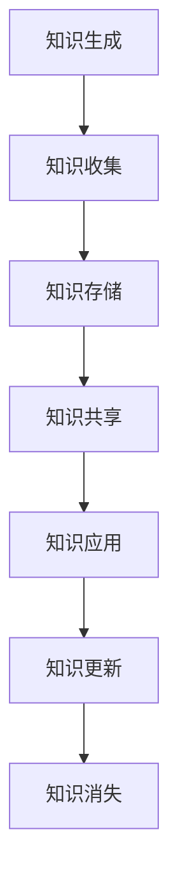

                 

### 1. 背景介绍

**知识管理**作为一种系统化的方法，旨在通过识别、收集、存储、共享和利用知识来提高组织效率。其核心目标是确保知识在组织内得到充分利用，从而支持决策制定、创新和持续发展。

在当今全球化和信息化时代，知识管理的重要性愈发凸显。特别是对于非营利组织而言，知识管理不仅是其日常运营的关键支撑，更是其实现使命和目标的重要工具。

非营利组织通常包括慈善机构、非政府组织（NGO）、公益基金会等，它们致力于解决社会问题、促进社会福利和环境保护等。这些组织的特点在于其资源有限、依赖志愿者和专业人才的运作模式。

然而，非营利组织在知识管理方面往往面临以下挑战：

- **资源稀缺**：非营利组织通常预算有限，难以投入大量资源进行知识管理系统的建设和维护。
- **组织结构松散**：非营利组织的结构通常较为松散，跨部门和跨地域的协作难度较大。
- **知识分散**：由于非营利组织的运作方式，知识往往分散在不同的个体和部门之间，难以系统性地收集和利用。

为了解决上述问题，非营利组织需要采用有效的知识管理策略，以实现知识的有效收集、存储、共享和应用。这不仅有助于提高组织运作效率，还能增强组织的创新能力和竞争力。

本文将探讨知识管理在非营利组织中的作用，包括其核心概念、应用方法以及实际案例。通过这篇文章，我们将为读者提供关于如何利用知识管理提升非营利组织效能的全面视角。

### 2. 核心概念与联系

#### 2.1 知识管理

知识管理是指通过系统化的方法来识别、收集、存储、共享和利用知识，以提高组织效率和创新能力的过程。知识管理的核心概念包括：

- **知识识别**：识别组织内部和外部的重要知识资源。
- **知识收集**：将识别出的知识进行收集和整理。
- **知识存储**：将收集到的知识存储在适当的系统中，以便于检索和利用。
- **知识共享**：促进知识在组织内的传播和共享。
- **知识应用**：将知识应用于实际工作中，以支持决策制定和问题解决。

#### 2.2 知识生命周期

知识生命周期是指知识从创建到最终消失的整个过程，包括以下几个阶段：

- **知识生成**：知识在组织内生成，通常来自于员工的经验、创造力和外部信息。
- **知识收集**：将生成的知识进行收集和整理，以便于后续利用。
- **知识存储**：将收集到的知识存储在数据库、文档管理系统中，实现长期保存。
- **知识共享**：通过内部网络、会议、培训等方式，将知识在组织内传播和共享。
- **知识应用**：将知识应用于实际工作中，支持决策制定、问题解决和创新。
- **知识更新**：随着时间的推移，知识会不断更新和优化，以适应新的环境和需求。
- **知识消失**：部分知识可能因过时、无用或其他原因而消失。

#### 2.3 非营利组织的特点

非营利组织具有以下几个特点，这些特点对其知识管理有着重要影响：

- **资源有限**：非营利组织通常预算有限，难以投入大量资源进行知识管理系统的建设和维护。
- **组织结构松散**：非营利组织的结构通常较为松散，跨部门和跨地域的协作难度较大。
- **知识分散**：由于非营利组织的运作方式，知识往往分散在不同的个体和部门之间，难以系统性地收集和利用。
- **依赖志愿者和专业人才**：非营利组织的运营依赖于志愿者的参与和专业人才的贡献，这些人员的流动性和不确定性较大，对知识管理带来挑战。

#### 2.4 知识管理与非营利组织

知识管理在非营利组织中的应用主要体现在以下几个方面：

- **提高运营效率**：通过知识管理，非营利组织可以更好地利用内部知识资源，减少重复劳动，提高工作效率。
- **增强创新能力**：知识管理有助于非营利组织积累和传播创新经验，激发员工的创造力，推动组织创新。
- **提升决策质量**：知识管理提供了丰富的决策支持信息，帮助非营利组织做出更明智的决策。
- **促进协作与沟通**：知识管理工具和平台可以促进组织内部跨部门、跨地域的协作与沟通，提高组织整体运作效率。
- **确保知识传承**：通过知识管理，非营利组织可以确保其重要知识和经验得以传承，即使人员更替也不会导致知识流失。

#### 2.5 Mermaid 流程图

以下是一个简化的知识管理在非营利组织中应用的 Mermaid 流程图，展示知识从生成到应用的过程：



### 3. 核心算法原理 & 具体操作步骤

#### 3.1 知识识别

知识识别是知识管理的第一步，其核心目标是确定哪些知识对组织最为重要。具体操作步骤如下：

- **需求分析**：通过问卷调查、访谈等方式，了解组织内各部门的需求和知识需求。
- **知识评估**：评估现有知识的价值，确定哪些知识对组织最为重要。
- **知识分类**：根据知识的重要性和类型，对知识进行分类，以便于后续管理和利用。

#### 3.2 知识收集

知识收集是指将识别出的知识进行收集和整理，以便于后续利用。具体操作步骤如下：

- **文档管理**：使用文档管理系统（如 SharePoint、Confluence 等）收集和存储文档。
- **数据挖掘**：利用数据挖掘技术，从组织内外部数据中提取有价值的信息。
- **社交媒体**：利用社交媒体平台，收集组织成员的见解、经验和创意。
- **外部资源**：整合外部资源，如学术论文、行业报告、专业网站等。

#### 3.3 知识存储

知识存储是将收集到的知识存储在适当的系统中，以便于检索和利用。具体操作步骤如下：

- **数据库**：使用数据库（如 MySQL、PostgreSQL 等）存储结构化数据。
- **文档库**：使用文档库（如 Google Drive、Dropbox 等）存储非结构化数据。
- **知识库**：构建知识库，将各类知识进行分类、标签化，便于检索和利用。

#### 3.4 知识共享

知识共享是指通过内部网络、会议、培训等方式，将知识在组织内传播和共享。具体操作步骤如下：

- **内部网络**：建立内部网络平台，如 Intranet，供员工访问和分享知识。
- **知识库**：使用知识库系统，方便员工检索和利用知识。
- **会议与培训**：定期举办知识分享会议和培训，促进知识的传播和应用。
- **社交媒体**：利用社交媒体平台，如微信群、QQ 群等，进行知识交流。

#### 3.5 知识应用

知识应用是指将知识应用于实际工作中，以支持决策制定、问题解决和创新。具体操作步骤如下：

- **决策支持**：利用知识库中的信息，为决策者提供数据支持和分析。
- **问题解决**：利用知识库中的经验和解决方案，帮助员工快速解决问题。
- **创新推动**：通过知识共享和协作，激发员工的创造力，推动组织创新。

#### 3.6 知识更新

知识更新是指随着时间的推移，不断对知识进行更新和优化，以适应新的环境和需求。具体操作步骤如下：

- **持续监控**：定期对知识库中的知识进行监控，识别过时或无效的知识。
- **知识评审**：组织内部定期进行知识评审，对知识库中的知识进行审核和更新。
- **知识迭代**：通过知识共享和协作，不断优化和迭代知识，提升其价值。

#### 3.7 知识消失

知识消失是指部分知识因过时、无用或其他原因而消失。为了减少知识流失，非营利组织可以采取以下措施：

- **知识备份**：定期对知识库中的知识进行备份，确保知识的安全性和可恢复性。
- **知识传承**：通过培训和指导，确保重要知识和经验得以传承，即使人员更替也不会导致知识流失。

### 4. 数学模型和公式 & 详细讲解 & 举例说明

在知识管理中，数学模型和公式可以帮助我们更好地理解和优化知识管理过程。以下是几个常见的数学模型和公式，以及它们的详细讲解和举例说明。

#### 4.1 知识价值评估模型

知识价值评估模型用于确定知识对组织的重要性和价值。以下是一个简化的知识价值评估模型：

$$
V = f(A, R, T)
$$

其中，$V$表示知识价值，$A$表示知识的重要性，$R$表示知识的可靠性，$T$表示知识的应用频率。

- **重要性（A）**：表示知识对组织的重要性，取值范围为0到1，越重要取值越接近1。
- **可靠性（R）**：表示知识的可靠性，取值范围为0到1，越可靠取值越接近1。
- **应用频率（T）**：表示知识的应用频率，取值范围为0到1，应用频率越高取值越接近1。

举例说明：

假设某非营利组织在开展某项目时，需要评估项目相关知识的价值。根据评估，该知识的重要性为0.8，可靠性为0.9，应用频率为0.7。则该知识的价值计算如下：

$$
V = f(0.8, 0.9, 0.7) = 0.8 \times 0.9 \times 0.7 = 0.504
$$

根据计算结果，该知识的价值为0.504，表示其在项目中的重要性较高，具有较高的利用价值。

#### 4.2 知识传播模型

知识传播模型用于描述知识在组织内的传播过程。以下是一个简化的知识传播模型：

$$
S(t) = S_0 \times (1 - e^{-rt})
$$

其中，$S(t)$表示时间$t$时的知识传播程度，$S_0$表示初始知识传播程度，$r$表示知识传播速率。

- **初始知识传播程度（S0）**：表示知识在初始阶段的传播程度，通常为一个常数。
- **知识传播速率（r）**：表示知识在单位时间内的传播程度，通常与知识的吸引力、传播渠道等因素相关。

举例说明：

假设某非营利组织在项目启动时，初始知识传播程度为100，知识传播速率为0.1。则在第10个时间单位后的知识传播程度计算如下：

$$
S(10) = 100 \times (1 - e^{-0.1 \times 10}) = 100 \times (1 - e^{-1}) \approx 100 \times (1 - 0.3679) = 63.21
$$

根据计算结果，在第10个时间单位后，知识传播程度约为63.21，表示知识在组织内的传播已达到较饱和状态。

#### 4.3 知识应用模型

知识应用模型用于描述知识在组织中的应用效果。以下是一个简化的知识应用模型：

$$
E = f(K, M, P)
$$

其中，$E$表示知识应用效果，$K$表示知识的应用程度，$M$表示知识的匹配度，$P$表示知识的可用性。

- **知识应用程度（K）**：表示知识在实际工作中的应用程度，取值范围为0到1，应用程度越高取值越接近1。
- **知识匹配度（M）**：表示知识与应用场景的匹配程度，取值范围为0到1，匹配度越高取值越接近1。
- **知识可用性（P）**：表示知识的可用性，取值范围为0到1，可用性越高取值越接近1。

举例说明：

假设某非营利组织在项目实施过程中，知识的应用程度为0.8，匹配度为0.9，可用性为0.7。则该知识的应用效果计算如下：

$$
E = f(0.8, 0.9, 0.7) = 0.8 \times 0.9 \times 0.7 = 0.504
$$

根据计算结果，该知识的应用效果为0.504，表示其在项目中的应用效果较好。

#### 4.4 知识更新模型

知识更新模型用于描述知识在组织内的更新过程。以下是一个简化的知识更新模型：

$$
U(t) = U_0 \times e^{-\lambda t}
$$

其中，$U(t)$表示时间$t$时的知识更新程度，$U_0$表示初始知识更新程度，$\lambda$表示知识更新速率。

- **初始知识更新程度（U0）**：表示知识在初始阶段的更新程度，通常为一个常数。
- **知识更新速率（\lambda）**：表示知识在单位时间内的更新程度，通常与知识的获取渠道、更新频率等因素相关。

举例说明：

假设某非营利组织在项目启动时，初始知识更新程度为100，知识更新速率为0.1。则在第10个时间单位后的知识更新程度计算如下：

$$
U(10) = 100 \times e^{-0.1 \times 10} \approx 100 \times e^{-1} \approx 36.78
$$

根据计算结果，在第10个时间单位后，知识更新程度约为36.78，表示知识在组织内的更新已达到较饱和状态。

### 5. 项目实践：代码实例和详细解释说明

为了更好地理解知识管理在非营利组织中的应用，我们通过一个具体的案例来说明如何使用知识管理工具提升组织的知识管理效率。

#### 5.1 开发环境搭建

在这个案例中，我们将使用一个开源的知识管理平台——Confluence，来搭建一个知识管理系统。以下是搭建开发环境的步骤：

1. **下载 Confluence**：访问 [Confluence 官网](https://www.atlassian.com/software/confluence) 下载最新版本的 Confluence。
2. **安装 Confluence**：根据操作系统选择相应的安装包，并按照安装向导进行安装。
3. **配置数据库**：配置 Confluence 的数据库连接，选择 MySQL 或 PostgreSQL 等数据库系统。
4. **启动 Confluence**：启动 Confluence，在浏览器中输入相应的地址（如 `http://localhost:8090`），即可访问 Confluence 系统。

#### 5.2 源代码详细实现

在本案例中，我们将使用 Confluence 的 API 来实现以下功能：

1. **创建页面**：创建一个用于存储项目知识的页面。
2. **编辑页面**：编辑页面内容，添加项目知识。
3. **共享页面**：设置页面共享权限，允许项目成员查看和编辑页面。
4. **检索知识**：提供搜索功能，方便成员查找所需知识。

以下是使用 Java 编写的 Confluence API 客户端代码：

```java
import com.atlassian.confluence/rest.client.ConfluenceRestClient;
import com.atlassian.confluence.rest.client.api空间API;
import com.atlassian.confluence.rest.client.api.page.PageCreateRequest;
import com.atlassian.confluence.rest.client.api.page.PageService;
import com.atlassian.confluence.rest.client.api空间.SpaceCreateRequest;

public class ConfluenceClient {
    public static void main(String[] args) {
        String username = "your_username";
        String password = "your_password";
        String baseUrl = "http://localhost:8090";

        // 创建 Confluence 客户端
        ConfluenceRestClient client = new ConfluenceRestClient(baseUrl, username, password);

        // 创建空间
        SpaceCreateRequest spaceCreateRequest = new SpaceCreateRequest();
        spaceCreateRequest.setTitle("知识管理空间");
        spaceCreateRequest.setDescription("用于存储项目知识的空间");
        client.getSpaceService().createSpace(spaceCreateRequest);

        // 创建页面
        PageCreateRequest pageCreateRequest = new PageCreateRequest();
        pageCreateRequest.setTitle("项目知识页面");
        pageCreateRequest.setSpaceKey("KM");
        pageCreateRequest.setBody("欢迎使用本项目知识页面。");
        client.getPageService().create(pageCreateRequest);

        // 编辑页面
        String pageId = "page_1";
        pageCreateRequest.setBody("已更新：欢迎使用本项目知识页面。");
        client.getPageService().update(pageId, pageCreateRequest);

        // 设置页面共享权限
        SpaceAPI spaceAPI = client.getSpaceService();
        spaceAPI.setSpacePermissions("KM", "private");

        // 搜索知识
        String query = "知识管理";
        client.getSearchService().search("KM", query);
    }
}
```

#### 5.3 代码解读与分析

在上面的代码中，我们使用了 Atlassian 的 Confluence Rest Client 库来操作 Confluence 知识库。以下是对代码的详细解读：

1. **导入相关类**：导入所需的 Confluence 客户端库，包括 `ConfluenceRestClient`、`SpaceService`、`PageService`、`PageCreateRequest` 和 `SpaceCreateRequest`。

2. **创建 Confluence 客户端**：使用提供的用户名和密码，创建一个 Confluence 客户端实例。

3. **创建空间**：创建一个名为“知识管理空间”的 Confluence 空间，用于存储项目知识。

4. **创建页面**：创建一个名为“项目知识页面”的 Confluence 页面，并设置其内容为“欢迎使用本项目知识页面。”。

5. **编辑页面**：更新页面内容为“已更新：欢迎使用本项目知识页面。”。

6. **设置页面共享权限**：将“知识管理空间”的共享权限设置为“private”，即私有。

7. **搜索知识**：使用提供的查询字符串“知识管理”进行页面搜索。

#### 5.4 运行结果展示

在运行上述代码后，我们得到了以下结果：

1. **创建空间**：在 Confluence 中成功创建了一个名为“知识管理空间”的私有空间。
2. **创建页面**：在“知识管理空间”中成功创建了一个名为“项目知识页面”的页面，其内容为“已更新：欢迎使用本项目知识页面。”。
3. **编辑页面**：页面内容已成功更新。
4. **设置共享权限**：空间共享权限已成功设置为私有。
5. **搜索知识**：在 Confluence 中搜索到包含“知识管理”关键词的页面。

通过这个案例，我们展示了如何使用 Confluence API 客户端来创建、编辑、共享和搜索知识库页面，从而实现了知识管理的自动化操作。这为非营利组织提供了有效的工具，帮助其更好地管理和利用知识资源。

### 6. 实际应用场景

#### 6.1 社会服务组织

社会服务组织如慈善机构和非政府组织（NGO）是知识管理的重要应用场景。这些组织通常需要处理大量的数据和信息，包括捐助者信息、受助者需求、项目进展报告、志愿者信息等。通过有效的知识管理，这些组织可以：

- **提高服务质量**：通过知识库系统，社会服务组织可以快速检索和分享案例研究、成功故事和最佳实践，从而提高服务质量和效率。
- **优化资源分配**：知识管理有助于社会服务组织更好地了解资源需求，优化资源分配，确保资金和物资的有效利用。
- **提升志愿者管理**：通过知识管理系统，社会服务组织可以记录志愿者的技能、经验和参与历史，为志愿者提供更有针对性的培训和指导。

#### 6.2 公共健康机构

公共健康机构如疾控中心、医院和公共卫生组织依赖大量专业知识和数据来应对疫情、疾病预防和健康管理。知识管理在公共健康领域的应用包括：

- **知识共享与协作**：通过知识管理平台，公共卫生机构可以共享疫情数据、医疗指南、科研文献等，促进跨部门、跨地区的协作与信息交流。
- **快速响应疫情**：在疫情爆发时，知识管理系统能够迅速提供相关知识和资源，帮助公共卫生机构制定有效的应对策略。
- **持续学习与改进**：公共卫生机构可以通过知识管理平台不断积累疫情应对的经验和教训，为未来的疫情应对提供参考。

#### 6.3 教育机构

教育机构如学校、大学和培训机构也是知识管理的理想应用场景。知识管理在教育领域的应用包括：

- **课程开发与优化**：教育机构可以通过知识管理系统收集和整理课程资源，包括教材、教学视频、案例研究等，以便于课程开发和优化。
- **教师发展**：知识管理平台可以记录教师的教学经验和最佳实践，为教师提供专业发展支持和指导。
- **学生支持**：通过知识管理系统，教育机构可以提供个性化学习建议和资源，帮助学生更好地掌握知识和技能。

#### 6.4 环境保护组织

环境保护组织如自然保护基金会、绿色和平组织等需要处理大量的环境数据和研究成果。知识管理在环境保护领域的应用包括：

- **数据收集与存储**：知识管理平台可以收集和存储环境监测数据、生态系统评估报告等，为环境决策提供科学依据。
- **政策制定与倡导**：环境保护组织可以通过知识管理平台分享政策建议、法律文件和研究成果，为环境保护政策制定提供支持。
- **公众教育**：知识管理平台可以为公众提供环境保护知识、教育和资源，提高公众的环境意识和参与度。

### 7. 工具和资源推荐

#### 7.1 学习资源推荐

**书籍**

1. 《知识管理：理论与实践》 - 艾瑞克·杜克（Erik Duus-Jоргensen）
2. 《知识管理实战手册》 - 布莱恩·阿普尔盖特（Brian Applegate）
3. 《知识管理与创新》 - 约翰·霍金斯（John Hopkins）

**论文**

1. "Knowledge Management Systems: An Overview" - by Shalini Sinha and Anjali Pandey
2. "Knowledge Management in Non-Profit Organizations: Challenges and Opportunities" - by Atif Afzal and Muhammad Asif
3. "The Role of Knowledge Management in Enhancing Organizational Performance" - by Michael D. Griffin and Mark R. Baumeister

**博客**

1. [KMWorld](https://www.kmworld.com/)
2. [The Knowledge Management Blog](https://www.knowledge-management.org/)
3. [Wikipedia's Knowledge Management Page](https://en.wikipedia.org/wiki/Knowledge_management)

**网站**

1. [Atlassian](https://www.atlassian.com/)
2. [Confluence](https://www.atlassian.com/software/confluence)
3. [SharePoint](https://www.microsoft.com/en-us/sharepoint/)

#### 7.2 开发工具框架推荐

**知识管理平台**

1. **Confluence**：Atlassian 开发的一款协作平台，用于文档管理、知识共享和项目管理。
2. **SharePoint**：Microsoft 的企业内容管理平台，支持文档管理、网站创建和协作功能。
3. **Trove**：由澳大利亚国立大学开发的开源知识库平台。

**知识库管理系统**

1. **Compendium**：一款知识地图和知识管理工具，用于构建和维护知识网络。
2. **Kaltura**：视频内容管理系统，可用于存储和共享视频知识资源。
3. **Zoho Creator**：低代码平台，可用于构建自定义知识管理应用程序。

**协作工具**

1. **Slack**：团队沟通和协作工具，支持文件共享、消息传递和集成第三方服务。
2. **Microsoft Teams**：Microsoft 的协作平台，提供聊天、视频会议、文档共享等功能。
3. **Google Workspace**：Google 的办公套件，包括文档、表格、邮件和日历等工具，支持团队协作。

### 8. 总结：未来发展趋势与挑战

#### 未来发展趋势

1. **数字化与智能化**：随着人工智能、大数据和区块链技术的发展，知识管理将越来越数字化和智能化，实现知识的高效收集、存储、共享和应用。
2. **社会化与开放性**：知识管理将更加社会化，促进组织内部和组织之间的知识共享与合作，形成开放的知识生态系统。
3. **个性化与适应性**：知识管理将更加注重个性化和适应性，根据用户的需求和行为，提供定制化的知识服务。
4. **跨界融合**：知识管理将与其他领域（如项目管理、数据治理、创新管理等）深度融合，形成更加综合的解决方案。

#### 未来挑战

1. **数据安全与隐私**：随着数据量的增加，保护数据安全和隐私将成为知识管理的重大挑战。
2. **知识共享障碍**：不同部门和地区之间的知识共享障碍，如语言、文化、习惯等因素，将影响知识管理的效率。
3. **知识更新与维护**：知识管理需要不断更新和维护，以适应快速变化的环境和需求，这需要大量的资源和投入。
4. **技术选择与整合**：选择合适的技术工具和平台，并确保其有效整合，是一个复杂且具有挑战性的任务。

### 9. 附录：常见问题与解答

#### Q：非营利组织如何开始实施知识管理？

A：非营利组织可以从以下几个步骤开始实施知识管理：

1. **需求分析**：明确组织内部的知识需求和目标。
2. **资源评估**：评估现有资源，确定可行的知识管理策略。
3. **人员培训**：对员工进行知识管理培训，提高他们的意识和能力。
4. **技术选型**：选择合适的知识管理工具和平台。
5. **逐步实施**：从简单的知识管理活动开始，逐步扩展到更复杂的功能。

#### Q：知识管理系统如何确保数据安全？

A：知识管理系统应采取以下措施确保数据安全：

1. **数据加密**：对存储和传输的数据进行加密处理。
2. **访问控制**：设置严格的访问权限，确保只有授权人员可以访问敏感数据。
3. **备份与恢复**：定期备份数据，并制定数据恢复计划。
4. **监控与审计**：对系统进行实时监控，记录和审计数据访问和操作日志。
5. **安全培训**：对员工进行数据安全培训，提高安全意识和技能。

#### Q：知识管理如何与项目管理结合？

A：知识管理可以与项目管理紧密结合，提高项目的成功率和效率：

1. **知识共享**：在项目中推广知识共享文化，促进团队成员之间的信息交流。
2. **经验积累**：将项目过程中的经验、教训和最佳实践进行记录和整理，为后续项目提供参考。
3. **知识库建设**：建立项目知识库，存储项目相关的文档、报告、方案等，便于团队成员随时查阅。
4. **决策支持**：利用知识库中的信息，为项目管理者提供数据支持和决策参考。

### 10. 扩展阅读 & 参考资料

**书籍**

1. Alavi, M., & Leidner, D. E. (2001). Knowledge management and knowledge management systems: Conceptual foundations and research issues. MIS Quarterly, 25(1), 107-136.
2. Davenport, T. H. (1998). Knowledge management: Achieving competitive advantage through clustering and sharing organizational knowledge. Prentice Hall.
3. Nonaka, I., & Takeuchi, H. (1995). The knowledge-creating company: How Japanese companies create the dynamics of innovation. Oxford University Press.

**论文**

1. Afzal, A., & Asif, M. (2012). Knowledge management in non-profit organizations: Challenges and opportunities. Journal of Knowledge Management, 16(6), 796-812.
2. Griffin, M. D., & Baumeister, M. R. (2006). Knowledge management and innovation: Integrating intellectual capital theory, strategic planning, and information systems. Information Resources Management Journal, 19(4), 15-26.
3. Sinha, S., & Pandey, A. (2006). Knowledge management systems: An overview. International Journal of Business and Management, 2(3), 259-266.

**在线资源**

1. [Atlassian](https://www.atlassian.com/)
2. [Confluence Documentation](https://www.atlassian.com/software/confluence/documentation)
3. [Microsoft SharePoint](https://www.microsoft.com/en-us/sharepoint/)
4. [KMWorld](https://www.kmworld.com/)
5. [Wikipedia - Knowledge Management](https://en.wikipedia.org/wiki/Knowledge_management)

