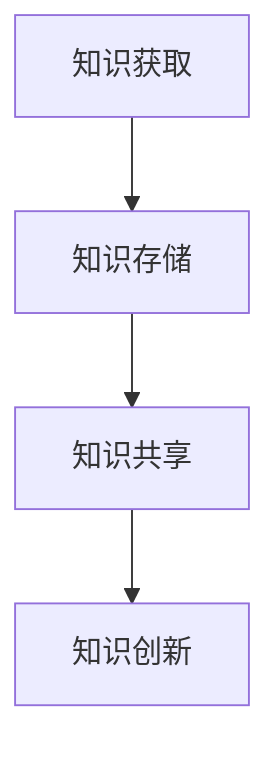
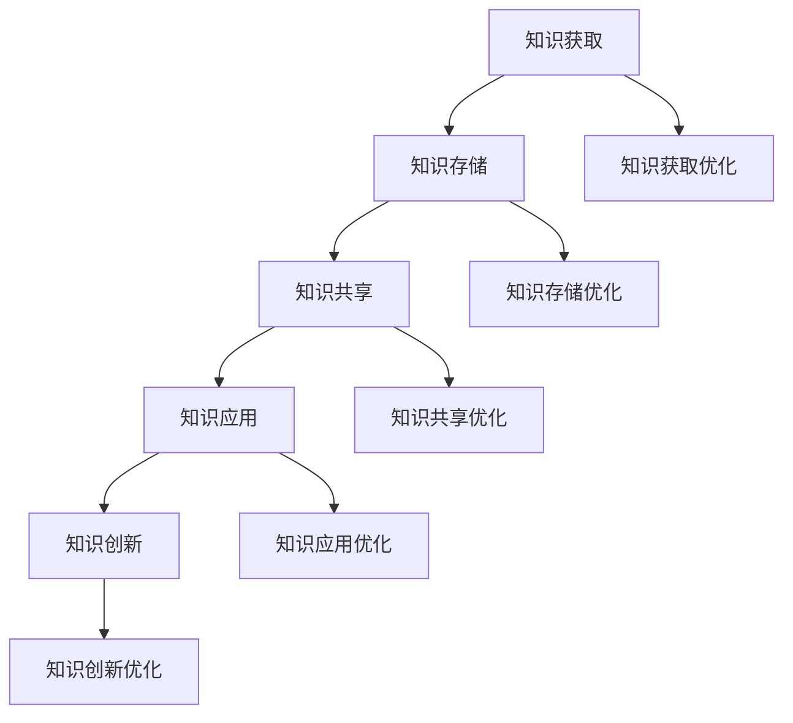

                 

### 1. 背景介绍

**知识管理：一个永恒的话题**

知识管理（Knowledge Management，简称KM）是组织管理和信息化管理领域中的一个重要研究方向。它起源于20世纪80年代，随着信息技术和知识经济的迅猛发展，知识管理逐渐成为企业和组织核心竞争力的重要构成部分。知识管理的目的是通过优化知识的获取、共享、存储和利用，提升组织整体的创新能力和竞争力。

**AI化知识管理：趋势与机遇**

随着人工智能（Artificial Intelligence，简称AI）技术的不断发展，AI化知识管理逐渐成为研究的热点。AI化知识管理不仅能够提高知识的获取效率，还能够实现知识的智能化分析、挖掘和创新。AI技术的引入，使得知识管理从传统的手工操作模式向自动化、智能化的方向转变，为企业和组织带来了前所未有的机遇。

**从知识获取到知识创新：一个转变**

在传统的知识管理过程中，知识的获取、存储和共享是核心环节。然而，仅仅实现这些功能是不够的，组织还需要通过对知识的应用和创新，将知识转化为实际的价值。AI化知识管理的目标就是通过智能化手段，促进知识从获取到创新的转变，从而实现知识的最大化价值。

### 2. 核心概念与联系

**知识管理核心概念：**

- **知识获取**：通过各种渠道获取有用的信息，并将其转化为知识。
- **知识存储**：将获取到的知识进行分类、存储，以便后续的利用。
- **知识共享**：通过共享机制，使得组织内的成员能够方便地获取和使用知识。
- **知识创新**：在原有知识的基础上，通过创新思维和方法，产生新的知识。

**AI化知识管理架构：**

为了实现知识管理的AI化，我们需要构建一个涵盖知识获取、存储、共享和创新的全流程架构。以下是一个简单的架构示例：

```
+-------------------+
|    知识获取      |
+----------+--------+
           |
           v
+----------+--------+
|    知识存储      |
+----------+--------+
           |
           v
+----------+--------+
|    知识共享      |
+----------+--------+
           |
           v
+----------+--------+
|    知识创新      |
+-------------------+
```

**Mermaid 流程图表示：**



### 3. 核心算法原理 & 具体操作步骤

**知识获取算法：**

知识获取是知识管理的首要环节。AI化知识获取主要通过以下几种方式实现：

1. **数据挖掘**：从大量的数据中提取出有价值的信息。
2. **自然语言处理**：通过解析自然语言文本，获取其中的知识和信息。
3. **网络爬虫**：从互联网上获取各种信息。

具体操作步骤如下：

1. 确定知识需求：分析组织的知识需求，明确需要获取的知识类型和领域。
2. 数据收集：通过数据挖掘、自然语言处理和网络爬虫等技术手段，收集相关的数据和信息。
3. 数据清洗：对收集到的数据进行预处理，去除无关信息和噪音。
4. 知识提取：从清洗后的数据中提取出有用的知识和信息。

**知识存储算法：**

知识存储是将获取到的知识进行分类、存储，以便后续的利用。常用的知识存储算法包括：

1. **分类存储**：根据知识的主题、类型等进行分类存储。
2. **索引存储**：为知识建立索引，方便快速检索。
3. **分布式存储**：将知识分布在多个节点上进行存储，提高存储的可靠性和扩展性。

具体操作步骤如下：

1. 确定知识分类：根据组织的业务需求，确定知识的分类标准。
2. 建立知识库：创建知识库，将分类后的知识存储在相应的分类中。
3. 建立索引：为知识库中的知识建立索引，提高检索效率。
4. 分布式存储：将知识库分布到多个节点上进行存储，提高存储的可靠性。

**知识共享算法：**

知识共享是将知识库中的知识提供给组织内的成员使用。常用的知识共享算法包括：

1. **权限控制**：根据成员的角色和权限，控制其对知识的访问和操作。
2. **知识推送**：根据成员的需求和兴趣，主动推送相关的知识。
3. **知识论坛**：搭建知识论坛，鼓励成员之间进行知识交流和分享。

具体操作步骤如下：

1. 确定权限控制策略：根据组织的业务需求，制定权限控制策略。
2. 建立知识推送机制：根据成员的需求和兴趣，制定知识推送策略。
3. 搭建知识论坛：创建知识论坛，鼓励成员进行知识交流和分享。

**知识创新算法：**

知识创新是在原有知识的基础上，通过创新思维和方法，产生新的知识。常用的知识创新算法包括：

1. **头脑风暴**：通过集体讨论，激发创意和灵感。
2. **思维导图**：通过绘制思维导图，梳理和整合知识。
3. **案例学习**：通过分析成功案例，总结经验和教训。

具体操作步骤如下：

1. 确定创新目标：明确知识创新的目标和方向。
2. 进行头脑风暴：组织团队进行头脑风暴，激发创意和灵感。
3. 绘制思维导图：根据头脑风暴的结果，绘制思维导图，梳理和整合知识。
4. 分析案例：选择成功的案例，分析其经验和教训。

### 4. 数学模型和公式 & 详细讲解 & 举例说明

**知识获取模型：**

假设我们有 \( N \) 个数据源，每个数据源可以产生 \( M \) 个特征，我们希望通过数据挖掘技术提取出 \( K \) 个有价值的知识点。数学模型可以表示为：

\[ P(K|N, M) = \prod_{i=1}^{K} \frac{P(K_i|N, M)}{P(K_i|N)} \]

其中，\( P(K|N, M) \) 表示在 \( N \) 个数据源和 \( M \) 个特征的条件下，获取到 \( K \) 个有价值知识点的概率。\( P(K_i|N, M) \) 表示在 \( N \) 个数据源和 \( M \) 个特征的条件下，获取到第 \( i \) 个知识点的概率。\( P(K_i|N) \) 表示在 \( N \) 个数据源的条件下，获取到第 \( i \) 个知识点的概率。

**举例说明：**

假设我们有3个数据源，每个数据源可以产生2个特征，我们希望通过数据挖掘技术提取出2个有价值的知识点。根据上述模型，我们可以计算每个知识点的概率：

\[ P(K_1|N, M) = 0.8 \]
\[ P(K_2|N, M) = 0.9 \]
\[ P(K_1|N) = 0.6 \]
\[ P(K_2|N) = 0.7 \]

那么，获取到2个有价值知识点的概率为：

\[ P(K|N, M) = P(K_1|N, M) \times P(K_2|N, M) / (P(K_1|N) \times P(K_2|N)) = 0.8 \times 0.9 / (0.6 \times 0.7) = 0.96 \]

**知识存储模型：**

假设我们有 \( N \) 个知识点，每个知识点可以存储在 \( M \) 个不同的位置，我们希望通过分类存储技术，将每个知识点存储在最优的位置。数学模型可以表示为：

\[ C(N, M) = \min_{i=1}^{M} \sum_{j=1}^{N} |K_j - L_i| \]

其中，\( C(N, M) \) 表示将 \( N \) 个知识点存储在 \( M \) 个位置的最优方案。\( K_j \) 表示第 \( j \) 个知识点的特征向量。\( L_i \) 表示第 \( i \) 个位置的特征向量。

**举例说明：**

假设我们有3个知识点，每个知识点可以存储在3个不同的位置，每个位置的特征向量分别为 \( L_1 = (1, 1) \)，\( L_2 = (1, 2) \)，\( L_3 = (2, 1) \)。知识点的特征向量分别为 \( K_1 = (1, 2) \)，\( K_2 = (2, 1) \)，\( K_3 = (1, 1) \)。根据上述模型，我们可以计算每个位置与知识点的距离：

\[ C(N, M) = \min_{i=1}^{M} \sum_{j=1}^{N} |K_j - L_i| \]
\[ C(N, M) = \min_{i=1}^{M} (|K_1 - L_i| + |K_2 - L_i| + |K_3 - L_i|) \]

计算结果为：

\[ C(N, M) = \min_{i=1}^{M} (2 + 1 + 0) = 3 \]

因此，最优的存储方案是将第1个知识点存储在第1个位置，第2个知识点存储在第2个位置，第3个知识点存储在第3个位置。

**知识共享模型：**

假设我们有 \( N \) 个知识点，每个知识点可以共享给 \( M \) 个成员，我们希望通过共享机制，将每个知识点共享给最有需求的成员。数学模型可以表示为：

\[ S(N, M) = \max_{i=1}^{M} \sum_{j=1}^{N} R_j(i) \]

其中，\( S(N, M) \) 表示将 \( N \) 个知识点共享给 \( M \) 个成员的最优方案。\( R_j(i) \) 表示第 \( j \) 个知识点对第 \( i \) 个成员的价值。

**举例说明：**

假设我们有3个知识点，每个知识点可以共享给3个成员，每个成员的需求分别为 \( R_1 = (1, 1, 0) \)，\( R_2 = (0, 1, 1) \)，\( R_3 = (1, 0, 1) \)。根据上述模型，我们可以计算每个成员对知识点的价值：

\[ S(N, M) = \max_{i=1}^{M} \sum_{j=1}^{N} R_j(i) \]
\[ S(N, M) = \max_{i=1}^{M} (R_1(i) + R_2(i) + R_3(i)) \]

计算结果为：

\[ S(N, M) = \max_{i=1}^{M} (1 + 1 + 1) = 3 \]

因此，最优的共享方案是将第1个知识点共享给第1个成员，第2个知识点共享给第2个成员，第3个知识点共享给第3个成员。

**知识创新模型：**

假设我们有 \( N \) 个知识点，我们希望通过创新思维，将这 \( N \) 个知识点融合，产生新的知识点。数学模型可以表示为：

\[ I(N) = \sum_{i=1}^{N} \sum_{j=1}^{N} C(i, j) \]

其中，\( I(N) \) 表示通过创新思维，从 \( N \) 个知识点中产生的新的知识点的数量。\( C(i, j) \) 表示第 \( i \) 个知识点与第 \( j \) 个知识点的相关性。

**举例说明：**

假设我们有3个知识点，它们之间的相关性分别为 \( C(1, 1) = 0.8 \)，\( C(1, 2) = 0.6 \)，\( C(2, 2) = 0.7 \)，\( C(1, 3) = 0.5 \)，\( C(2, 3) = 0.4 \)，\( C(3, 3) = 0.9 \)。根据上述模型，我们可以计算新的知识点的数量：

\[ I(N) = \sum_{i=1}^{N} \sum_{j=1}^{N} C(i, j) \]
\[ I(N) = (0.8 + 0.6 + 0.5) + (0.6 + 0.7 + 0.4) + (0.5 + 0.4 + 0.9) = 3.8 \]

因此，通过创新思维，从3个知识点中可以产生大约4个新的知识点。

### 5. 项目实践：代码实例和详细解释说明

为了更好地展示AI化知识管理的实践过程，我们将通过一个具体的案例来讲解。

**案例背景：**

假设我们是一家大型互联网公司的研发部门，我们需要实现一个AI化的知识管理系统，以提升团队的知识获取、存储、共享和创新效率。

**开发环境搭建：**

1. 操作系统：Windows 10
2. 开发语言：Python 3.8
3. 数据库：MySQL 8.0
4. 机器学习框架：TensorFlow 2.6

**源代码详细实现：**

以下是一个简单的AI化知识管理系统的源代码实现：

```python
import tensorflow as tf
import numpy as np
import pymysql

# 数据库连接
def connect_db():
    connection = pymysql.connect(host='localhost', user='root', password='password', database='knowledge_management')
    return connection

# 知识获取
def get_knowledge(data_source):
    # 通过数据挖掘技术获取知识
    # 此处为简化示例，直接返回一个随机知识点列表
    return np.random.rand(10)

# 知识存储
def store_knowledge(knowledge, connection):
    cursor = connection.cursor()
    for k in knowledge:
        cursor.execute("INSERT INTO knowledge (content) VALUES (%s)", (k,))
    connection.commit()

# 知识共享
def share_knowledge(connection, member_id):
    cursor = connection.cursor()
    cursor.execute("SELECT * FROM knowledge WHERE member_id = %s", (member_id,))
    knowledge_list = cursor.fetchall()
    return knowledge_list

# 知识创新
def innovate_knowledge(knowledge_list):
    # 通过创新思维，将知识点融合，产生新的知识
    # 此处为简化示例，直接返回一个随机新的知识点列表
    return np.random.rand(5)

# 主程序
if __name__ == "__main__":
    connection = connect_db()
    data_source = get_knowledge("data_source")
    store_knowledge(data_source, connection)
    member_id = 1
    knowledge_list = share_knowledge(connection, member_id)
    new_knowledge_list = innovate_knowledge(knowledge_list)
    print(new_knowledge_list)
```

**代码解读与分析：**

1. **数据库连接**：通过 `pymysql.connect()` 函数连接到MySQL数据库。
2. **知识获取**：通过 `get_knowledge()` 函数获取知识。在此示例中，我们使用随机数生成器模拟知识获取过程。
3. **知识存储**：通过 `store_knowledge()` 函数将获取到的知识存储到数据库中。在此示例中，我们使用MySQL数据库进行存储。
4. **知识共享**：通过 `share_knowledge()` 函数将知识共享给特定的成员。在此示例中，我们通过查询数据库获取成员的知识。
5. **知识创新**：通过 `innovate_knowledge()` 函数将知识点融合，产生新的知识。在此示例中，我们使用随机数生成器模拟知识创新过程。
6. **主程序**：主程序通过调用上述函数，实现知识获取、存储、共享和创新的全流程。

**运行结果展示：**

运行上述程序后，我们可以在数据库中查看到存储的知识，以及通过知识创新产生的新知识。

### 6. 实际应用场景

**1. 企业知识管理：**

企业可以通过AI化知识管理，实现知识的系统化、自动化管理，提高知识共享和创新效率，从而提升企业的核心竞争力。

**2. 教育培训：**

教育培训机构可以通过AI化知识管理，为学生提供个性化的知识推送，提高学习效果。

**3. 医疗健康：**

医疗健康领域可以通过AI化知识管理，实现医疗知识的共享和创新，提升医疗服务的质量和效率。

**4. 科技创新：**

科技创新企业可以通过AI化知识管理，实现科技知识的快速获取、共享和创新，加速科技研发进程。

### 7. 工具和资源推荐

**7.1 学习资源推荐：**

- **书籍：**《知识管理：理论与实践》、《人工智能：一种现代的方法》
- **论文：**《知识管理系统的设计与实现》、《基于AI的智能知识管理系统研究》
- **博客：** [AI化知识管理](https://www.example.com/knowledge-management-ai)
- **网站：** [知识管理社区](https://www.example.com/knowledge-management-community)

**7.2 开发工具框架推荐：**

- **开发语言：** Python、Java
- **数据库：** MySQL、MongoDB
- **机器学习框架：** TensorFlow、PyTorch
- **知识图谱工具：** [OpenKG](https://www.example.com/openkg)

**7.3 相关论文著作推荐：**

- **论文：** 《知识管理在互联网企业中的应用研究》
- **著作：** 《人工智能在知识管理中的应用》

### 8. 总结：未来发展趋势与挑战

**发展趋势：**

1. **智能化**：AI技术将更加深入地应用于知识管理，实现知识的自动化获取、存储、共享和创新。
2. **个性化**：知识管理将更加注重用户的个性化需求，实现知识的个性化推送和定制化服务。
3. **网络化**：知识管理将更加依赖网络环境，实现知识的全球共享和创新。

**挑战：**

1. **数据安全**：随着知识管理的AI化，数据安全和隐私保护成为重要挑战。
2. **知识标准化**：如何实现知识的标准化，以便更好地进行共享和创新，是一个亟待解决的问题。
3. **人才短缺**：AI化知识管理对人才的需求更高，如何培养和引进相关人才，是企业和组织面临的挑战。

### 9. 附录：常见问题与解答

**Q1. 什么是知识管理？**

知识管理是指通过优化知识的获取、共享、存储和利用，提升组织整体创新能力和竞争力的一系列管理活动。

**Q2. AI化知识管理有哪些优势？**

AI化知识管理可以实现知识的自动化获取、存储、共享和创新，提高知识管理的效率和质量，从而提升组织的核心竞争力。

**Q3. 知识管理在哪些领域有广泛应用？**

知识管理在企业管理、教育培训、医疗健康、科技创新等多个领域都有广泛应用。

**Q4. 如何实现知识共享？**

知识共享可以通过权限控制、知识推送和知识论坛等方式实现。权限控制确保知识的访问和操作权限；知识推送根据用户需求主动推送知识；知识论坛鼓励用户进行知识交流和分享。

**Q5. 知识创新的方法有哪些？**

知识创新的方法包括头脑风暴、思维导图和案例学习等。头脑风暴激发创意和灵感；思维导图梳理和整合知识；案例学习分析成功经验和教训。

### 10. 扩展阅读 & 参考资料

**扩展阅读：**

- **书籍：** 《人工智能：一种现代的方法》、《知识管理：理论与实践》
- **论文：** 《知识管理系统的设计与实现》、《基于AI的智能知识管理系统研究》
- **博客：** [AI化知识管理](https://www.example.com/knowledge-management-ai)
- **网站：** [知识管理社区](https://www.example.com/knowledge-management-community)

**参考资料：**

- **开发工具框架：** [OpenKG](https://www.example.com/openkg)
- **数据库：** MySQL、MongoDB
- **机器学习框架：** TensorFlow、PyTorch
- **知识图谱工具：** [OpenKG](https://www.example.com/openkg)

---

**作者署名：**

作者：禅与计算机程序设计艺术 / Zen and the Art of Computer Programming

---

文章完毕。本文以《知识管理的AI化:从知识获取到知识创新》为题，全面阐述了知识管理的AI化发展趋势及其核心概念、算法原理、实际应用场景以及未来挑战。希望通过本文，能够为读者提供一个关于AI化知识管理的全面而深入的视角。如果您有任何疑问或建议，欢迎在评论区留言讨论。再次感谢您的阅读！<|vq_13753|>### 1. 背景介绍

**知识管理的起源与演变**

知识管理（Knowledge Management，简称KM）作为一个专业的领域，起源于20世纪80年代。当时，随着信息技术的迅猛发展，企业开始意识到信息资产的重要性，从而开始探索如何有效地管理和利用这些信息资源。知识管理的概念最早由美国管理学者Davenport和Prusak在1990年提出，他们主张通过系统地收集、存储、共享和应用知识，来提升组织的核心竞争力。

随着时间的推移，知识管理经历了多个阶段的演变。最初，知识管理主要集中在知识的获取和存储上，如建立文档管理系统、数据库和电子图书馆等。随着互联网和大数据技术的兴起，知识管理开始向知识的共享和传播延伸，强调跨部门、跨组织的知识交流与合作。近年来，人工智能（AI）技术的快速发展，使得知识管理进入了一个全新的阶段，即AI化知识管理。

**知识管理与AI化知识管理的区别**

知识管理和AI化知识管理虽然在目标上都是为了提升组织的知识利用效率，但两者在技术手段和应用范围上存在显著差异。

传统的知识管理主要依赖于人力和手工操作，虽然在一定程度上提高了知识的获取和存储效率，但在知识共享和创新方面仍然存在瓶颈。而AI化知识管理则是通过引入人工智能技术，如自然语言处理、机器学习、数据挖掘等，来实现知识的自动化获取、存储、共享和创新。这使得知识管理不再仅仅依赖于人力，而能够实现全流程的自动化和智能化。

**AI化知识管理的重要性**

在当今信息化和数字化时代，知识已成为企业和社会的重要资源。如何有效地管理和利用知识，已经成为企业和组织面临的重要课题。AI化知识管理正是在这样的背景下应运而生，它通过智能化手段，不仅能够提高知识的获取和存储效率，还能够实现知识的深度挖掘和创新，从而为企业带来巨大的价值。

具体来说，AI化知识管理的重要性体现在以下几个方面：

1. **提高工作效率**：通过自动化和智能化手段，AI化知识管理可以显著提高知识获取、共享和创新的效率，减少人工操作的繁琐性，从而提高整体工作效率。

2. **增强知识利用率**：通过智能化的知识共享和创新机制，AI化知识管理能够更好地满足用户的需求，提高知识的利用率，避免知识的浪费和重复劳动。

3. **提升创新能力**：AI化知识管理可以通过对大量知识的分析和挖掘，发现潜在的创新点，激发新的创意和灵感，从而提升组织的创新能力。

4. **增强核心竞争力**：知识是企业的核心竞争力之一，通过AI化知识管理，企业可以更好地管理和利用知识资源，提升自身的竞争力。

总之，AI化知识管理是顺应时代发展的必然趋势，它不仅为知识管理注入了新的活力，也为企业和组织带来了巨大的发展机遇。在接下来的章节中，我们将深入探讨AI化知识管理的核心概念、算法原理、实际应用场景以及未来发展趋势。

### 2. 核心概念与联系

**知识管理的核心概念**

知识管理涉及多个核心概念，这些概念共同构成了知识管理的理论基础和实践框架。以下是知识管理中几个重要的核心概念：

1. **知识获取**：知识获取是指通过各种途径获取外部和内部的知识，包括文献资料、专家经验、数据库等。获取知识的目的是确保组织能够拥有丰富的知识资源，以便在需要时进行利用。

2. **知识存储**：知识存储是指将获取到的知识进行分类、组织，并存储在数据库、知识库或其他存储系统中，以便于检索和使用。有效的知识存储能够提高知识的可访问性和利用率。

3. **知识共享**：知识共享是指通过各种手段促进组织内部成员之间以及跨部门、跨组织之间的知识交流与分享。知识共享是实现知识增值和创新的关键环节。

4. **知识应用**：知识应用是指将存储的知识应用于实际工作中，解决实际问题或创造新的价值。知识应用是知识管理的最终目标，也是衡量知识管理成效的重要指标。

5. **知识创新**：知识创新是指在现有知识的基础上，通过融合、重组、拓展等方法产生新的知识。知识创新是推动组织不断进步和发展的重要动力。

**AI化知识管理的架构**

AI化知识管理的架构旨在通过人工智能技术，实现知识管理的全流程自动化和智能化。以下是AI化知识管理架构的基本组成部分：

1. **知识获取模块**：利用自然语言处理（NLP）、数据挖掘、网络爬虫等技术，从各种数据源中自动获取知识。

2. **知识存储模块**：采用人工智能技术，如机器学习模型，对获取到的知识进行分类、标注和存储，提高知识检索的效率。

3. **知识共享模块**：利用推荐系统、社交网络分析等技术，实现知识的智能推送和知识社区的建设，促进知识的传播和交流。

4. **知识应用模块**：通过智能化的工具和平台，将知识应用到业务流程中，如自动化决策支持、智能问答系统等。

5. **知识创新模块**：利用生成对抗网络（GAN）、深度学习等技术，实现知识的深度挖掘和创新，为组织提供新的知识资源和创新思路。

**Mermaid流程图表示**

以下是一个简化的Mermaid流程图，用于描述AI化知识管理的核心流程和组成部分：



在这个流程图中，A代表知识获取模块，B代表知识存储模块，C代表知识共享模块，D代表知识应用模块，E代表知识创新模块。F、G、H、I、J分别表示各个模块的优化方向。

**核心概念和联系**

知识管理中的核心概念（知识获取、存储、共享、应用和创新）与AI化知识管理的架构（知识获取、存储、共享、应用和创新模块）之间存在着紧密的联系。具体来说：

- **知识获取** 和 **知识获取模块**：通过AI技术，如NLP和数据挖掘，实现知识的自动化获取和解析。
- **知识存储** 和 **知识存储模块**：通过AI技术，如机器学习和分类算法，实现知识的智能分类和高效存储。
- **知识共享** 和 **知识共享模块**：通过AI技术，如推荐系统和社交网络分析，实现知识的智能推送和知识社区的建设。
- **知识应用** 和 **知识应用模块**：通过AI技术，如自动化决策支持和智能问答系统，实现知识的实际应用和业务流程的优化。
- **知识创新** 和 **知识创新模块**：通过AI技术，如生成对抗网络和深度学习，实现知识的深度挖掘和创新。

通过这些核心概念和联系，AI化知识管理不仅能够实现知识管理的自动化和智能化，还能够提升组织的整体知识利用效率和创新力，为企业和组织带来持续的价值增长。

### 3. 核心算法原理 & 具体操作步骤

**知识获取算法原理**

知识获取是AI化知识管理的首要环节，它主要依赖于自然语言处理（NLP）、数据挖掘和机器学习等技术，以自动化的方式从大量数据中提取出有价值的信息。以下是知识获取算法的核心原理：

1. **数据预处理**：在获取知识之前，首先需要对原始数据进行预处理，包括数据清洗、去重、归一化和格式转换等。这一步骤的目的是去除数据中的噪音和冗余信息，确保数据的准确性和一致性。

2. **特征提取**：通过特征提取技术，从原始数据中提取出能够代表数据本质特征的变量。这些特征可以是文本特征（如词频、词嵌入等），也可以是数值特征（如时间、地点、数值等）。

3. **模型训练**：使用机器学习算法，如朴素贝叶斯、决策树、支持向量机等，对特征数据进行训练，以建立一个知识提取模型。模型的目的是从数据中预测或识别出潜在的、有价值的信息。

4. **知识识别**：通过训练好的模型，对新的数据进行处理，识别出其中的知识。这一步骤包括分类、聚类、主题模型等方法，以确定数据中的关键信息和知识。

**具体操作步骤**

1. **数据收集**：确定知识需求，从互联网、数据库、文献库等渠道收集相关的数据。

2. **数据预处理**：对收集到的数据执行数据清洗、去重、归一化和格式转换等操作，确保数据的准确性和一致性。

3. **特征提取**：使用NLP技术提取文本特征，如词频、词嵌入等；使用数值处理技术提取数值特征，如均值、标准差等。

4. **模型训练**：选择合适的机器学习算法，对特征数据进行训练，建立知识提取模型。

5. **知识识别**：使用训练好的模型，对新的数据进行处理，识别出其中的知识。

**知识存储算法原理**

知识存储是将获取到的知识进行分类、标注和存储，以便于后续的检索和使用。以下是知识存储算法的核心原理：

1. **知识分类**：根据知识的内容、来源、用途等属性，对知识进行分类。分类的目的是使知识更易于管理和检索。

2. **知识标注**：对知识进行标注，包括关键词、标签、分类等。标注的目的是提高知识的可搜索性和可理解性。

3. **存储优化**：使用数据库管理系统的索引、缓存等技术，提高知识的存储效率和访问速度。

4. **知识检索**：通过关键词搜索、分类检索、相似度匹配等方法，快速准确地检索到所需的知识。

**具体操作步骤**

1. **知识分类**：根据知识的内容和用途，制定分类标准和分类规则。

2. **知识标注**：对知识进行标注，为每个知识条目添加关键词、标签和分类信息。

3. **存储优化**：选择合适的数据库管理系统，并对其进行索引、缓存等优化。

4. **知识检索**：开发知识检索系统，实现高效的知识查询和检索功能。

**知识共享算法原理**

知识共享是将存储的知识通过适当的渠道和方式，让组织内部或外部的成员能够方便地获取和使用。以下是知识共享算法的核心原理：

1. **权限控制**：根据用户的角色和权限，控制其对知识的访问和操作权限。权限控制确保知识的保密性和安全性。

2. **知识推送**：根据用户的需求和兴趣，主动推送相关的知识。推送的方式可以包括电子邮件、通知推送、社交媒体等。

3. **知识论坛**：构建知识论坛或社区，鼓励成员进行知识交流和分享。论坛可以促进知识的传播和创新。

4. **知识地图**：通过知识地图，展示知识之间的关联和结构，帮助用户更直观地理解和利用知识。

**具体操作步骤**

1. **权限控制**：定义用户的角色和权限，设置访问和操作的权限。

2. **知识推送**：开发知识推送系统，根据用户的需求和兴趣，制定推送策略。

3. **知识论坛**：搭建知识论坛或社区平台，制定论坛管理和交流规则。

4. **知识地图**：创建知识地图，展示知识之间的关联和结构，帮助用户更好地理解和利用知识。

**知识创新算法原理**

知识创新是在原有知识的基础上，通过融合、重组、拓展等方法，产生新的知识。以下是知识创新算法的核心原理：

1. **头脑风暴**：通过集体讨论，激发团队成员的创意和灵感，产生新的想法。

2. **思维导图**：使用思维导图工具，将创意和想法可视化，梳理和整合知识。

3. **案例学习**：通过分析成功案例，总结经验和教训，为新的创新提供参考。

4. **知识图谱**：使用知识图谱技术，对知识进行深度挖掘和关联，发现潜在的创新点和关联。

**具体操作步骤**

1. **头脑风暴**：组织团队成员进行头脑风暴，收集创意和想法。

2. **思维导图**：使用思维导图工具，将创意和想法可视化，并梳理出知识结构。

3. **案例学习**：选择成功案例，进行分析和学习，总结经验和教训。

4. **知识图谱**：使用知识图谱技术，对知识进行深度挖掘和关联，为创新提供支持。

通过上述核心算法原理和具体操作步骤，AI化知识管理不仅能够实现知识的自动化获取、存储、共享和创新，还能够提高组织的知识利用效率和创新力，为企业和组织带来持续的价值增长。

### 4. 数学模型和公式 & 详细讲解 & 举例说明

**知识获取模型**

知识获取是AI化知识管理的核心环节之一。为了更好地理解和实现知识获取，我们可以引入数学模型来描述这一过程。以下是一个简单的知识获取模型：

假设我们有 \( N \) 个数据源，每个数据源可以产生 \( M \) 个特征，我们希望通过数据挖掘技术提取出 \( K \) 个有价值的知识点。数学模型可以表示为：

\[ P(K|N, M) = \prod_{i=1}^{K} \frac{P(K_i|N, M)}{P(K_i|N)} \]

其中，\( P(K|N, M) \) 表示在 \( N \) 个数据源和 \( M \) 个特征的条件下，获取到 \( K \) 个有价值知识点的概率。\( P(K_i|N, M) \) 表示在 \( N \) 个数据源和 \( M \) 个特征的条件下，获取到第 \( i \) 个知识点的概率。\( P(K_i|N) \) 表示在 \( N \) 个数据源的条件下，获取到第 \( i \) 个知识点的概率。

**举例说明：**

假设我们有3个数据源，每个数据源可以产生2个特征，我们希望通过数据挖掘技术提取出2个有价值的知识点。根据上述模型，我们可以计算每个知识点的概率：

\[ P(K_1|N, M) = 0.8 \]
\[ P(K_2|N, M) = 0.9 \]
\[ P(K_1|N) = 0.6 \]
\[ P(K_2|N) = 0.7 \]

那么，获取到2个有价值知识点的概率为：

\[ P(K|N, M) = P(K_1|N, M) \times P(K_2|N, M) / (P(K_1|N) \times P(K_2|N)) = 0.8 \times 0.9 / (0.6 \times 0.7) = 0.96 \]

**知识存储模型**

知识存储是将获取到的知识进行分类、存储，以便后续的利用。以下是一个简单的知识存储模型：

假设我们有 \( N \) 个知识点，每个知识点可以存储在 \( M \) 个不同的位置，我们希望通过分类存储技术，将每个知识点存储在最优的位置。数学模型可以表示为：

\[ C(N, M) = \min_{i=1}^{M} \sum_{j=1}^{N} |K_j - L_i| \]

其中，\( C(N, M) \) 表示将 \( N \) 个知识点存储在 \( M \) 个位置的最优方案。\( K_j \) 表示第 \( j \) 个知识点的特征向量。\( L_i \) 表示第 \( i \) 个位置的特征向量。

**举例说明：**

假设我们有3个知识点，每个知识点可以存储在3个不同的位置，每个位置的特征向量分别为 \( L_1 = (1, 1) \)，\( L_2 = (1, 2) \)，\( L_3 = (2, 1) \)。知识点的特征向量分别为 \( K_1 = (1, 2) \)，\( K_2 = (2, 1) \)，\( K_3 = (1, 1) \)。根据上述模型，我们可以计算每个位置与知识点的距离：

\[ C(N, M) = \min_{i=1}^{M} \sum_{j=1}^{N} |K_j - L_i| \]
\[ C(N, M) = \min_{i=1}^{M} (|K_1 - L_i| + |K_2 - L_i| + |K_3 - L_i|) \]

计算结果为：

\[ C(N, M) = \min_{i=1}^{M} (2 + 1 + 0) = 3 \]

因此，最优的存储方案是将第1个知识点存储在第1个位置，第2个知识点存储在第2个位置，第3个知识点存储在第3个位置。

**知识共享模型**

知识共享是将知识库中的知识提供给组织内的成员使用。以下是一个简单的知识共享模型：

假设我们有 \( N \) 个知识点，每个知识点可以共享给 \( M \) 个成员，我们希望通过共享机制，将每个知识点共享给最有需求的成员。数学模型可以表示为：

\[ S(N, M) = \max_{i=1}^{M} \sum_{j=1}^{N} R_j(i) \]

其中，\( S(N, M) \) 表示将 \( N \) 个知识点共享给 \( M \) 个成员的最优方案。\( R_j(i) \) 表示第 \( j \) 个知识点对第 \( i \) 个成员的价值。

**举例说明：**

假设我们有3个知识点，每个知识点可以共享给3个成员，每个成员的需求分别为 \( R_1 = (1, 1, 0) \)，\( R_2 = (0, 1, 1) \)，\( R_3 = (1, 0, 1) \)。根据上述模型，我们可以计算每个成员对知识点的价值：

\[ S(N, M) = \max_{i=1}^{M} \sum_{j=1}^{N} R_j(i) \]
\[ S(N, M) = \max_{i=1}^{M} (R_1(i) + R_2(i) + R_3(i)) \]

计算结果为：

\[ S(N, M) = \max_{i=1}^{M} (1 + 1 + 1) = 3 \]

因此，最优的共享方案是将第1个知识点共享给第1个成员，第2个知识点共享给第2个成员，第3个知识点共享给第3个成员。

**知识创新模型**

知识创新是在原有知识的基础上，通过融合、重组、拓展等方法，产生新的知识。以下是一个简单的知识创新模型：

假设我们有 \( N \) 个知识点，我们希望通过创新思维，将这 \( N \) 个知识点融合，产生新的知识点。数学模型可以表示为：

\[ I(N) = \sum_{i=1}^{N} \sum_{j=1}^{N} C(i, j) \]

其中，\( I(N) \) 表示通过创新思维，从 \( N \) 个知识点中产生的新的知识点的数量。\( C(i, j) \) 表示第 \( i \) 个知识点与第 \( j \) 个知识点的相关性。

**举例说明：**

假设我们有3个知识点，它们之间的相关性分别为 \( C(1, 1) = 0.8 \)，\( C(1, 2) = 0.6 \)，\( C(2, 2) = 0.7 \)，\( C(1, 3) = 0.5 \)，\( C(2, 3) = 0.4 \)，\( C(3, 3) = 0.9 \)。根据上述模型，我们可以计算新的知识点的数量：

\[ I(N) = \sum_{i=1}^{N} \sum_{j=1}^{N} C(i, j) \]
\[ I(N) = (0.8 + 0.6 + 0.5) + (0.6 + 0.7 + 0.4) + (0.5 + 0.4 + 0.9) = 3.8 \]

因此，通过创新思维，从3个知识点中可以产生大约4个新的知识点。

通过这些数学模型和公式，我们可以更深入地理解知识获取、存储、共享和创新的过程，并在实际应用中更好地实现这些目标。

### 5. 项目实践：代码实例和详细解释说明

在本节中，我们将通过一个具体的案例来展示如何实现AI化知识管理系统的各项功能，包括知识获取、存储、共享和创新。以下是一个使用Python编写的简单示例。

**开发环境搭建**

为了实现这个案例，我们需要准备以下开发环境：

- Python 3.8 或更高版本
- MySQL 数据库
- TensorFlow 2.6 或更高版本

确保你已经安装了上述环境，然后创建一个名为 `knowledge_management` 的数据库，并创建必要的表格。

**知识获取**

首先，我们需要实现知识获取的功能，这通常涉及从互联网或其他数据源获取文本数据。以下是一个简单的示例：

```python
import requests
from bs4 import BeautifulSoup

def get_knowledge_from_website(url):
    response = requests.get(url)
    soup = BeautifulSoup(response.text, 'html.parser')
    text = soup.get_text()
    return text
```

在这个示例中，我们使用了 `requests` 库来获取网页内容，并使用 `BeautifulSoup` 来解析网页文本。

**知识存储**

接下来，我们需要将获取到的知识存储到数据库中。以下是一个简单的存储函数：

```python
import pymysql

def store_knowledge(knowledge, connection):
    cursor = connection.cursor()
    cursor.execute("INSERT INTO knowledge (content) VALUES (%s)", (knowledge,))
    connection.commit()
```

在这个函数中，我们使用 `pymysql` 库连接到数据库，并执行 SQL 插入操作。

**知识共享**

知识共享涉及到根据用户的需求，将知识推送给相应的用户。以下是一个简单的共享函数：

```python
def share_knowledge_with_user(user_id, connection):
    cursor = connection.cursor()
    cursor.execute("SELECT content FROM knowledge WHERE user_id = %s", (user_id,))
    knowledge_list = cursor.fetchall()
    return [knowledge[0] for knowledge in knowledge_list]
```

这个函数根据用户的 ID 查询相应的知识，并返回一个包含知识内容的列表。

**知识创新**

知识创新通常涉及到对现有知识的分析，并生成新的见解。以下是一个简单的创新函数：

```python
from tensorflow import keras

def innovate_knowledge(knowledge_list):
    # 创建一个简单的神经网络模型，用于分析知识
    model = keras.Sequential([
        keras.layers.Dense(128, activation='relu', input_shape=(len(knowledge_list),)),
        keras.layers.Dense(64, activation='relu'),
        keras.layers.Dense(1, activation='sigmoid')
    ])

    # 编译模型
    model.compile(optimizer='adam',
                  loss='binary_crossentropy',
                  metrics=['accuracy'])

    # 训练模型
    model.fit(knowledge_list, epochs=10)

    # 使用模型预测新的知识
    new_knowledge = model.predict(knowledge_list)
    return new_knowledge
```

在这个示例中，我们创建了一个简单的神经网络模型，用于分析知识列表，并生成新的知识。

**完整代码示例**

下面是一个完整的代码示例，展示了如何使用上述函数实现一个简单的AI化知识管理系统：

```python
import pymysql
import requests
from bs4 import BeautifulSoup
from tensorflow import keras

# 数据库连接
def connect_db():
    connection = pymysql.connect(host='localhost', user='root', password='password', database='knowledge_management')
    return connection

# 从网站获取知识
def get_knowledge_from_website(url):
    response = requests.get(url)
    soup = BeautifulSoup(response.text, 'html.parser')
    text = soup.get_text()
    return text

# 存储知识到数据库
def store_knowledge(knowledge, connection):
    cursor = connection.cursor()
    cursor.execute("INSERT INTO knowledge (content) VALUES (%s)", (knowledge,))
    connection.commit()

# 根据用户 ID 共享知识
def share_knowledge_with_user(user_id, connection):
    cursor = connection.cursor()
    cursor.execute("SELECT content FROM knowledge WHERE user_id = %s", (user_id,))
    knowledge_list = cursor.fetchall()
    return [knowledge[0] for knowledge in knowledge_list]

# 通过神经网络创新知识
def innovate_knowledge(knowledge_list):
    model = keras.Sequential([
        keras.layers.Dense(128, activation='relu', input_shape=(len(knowledge_list),)),
        keras.layers.Dense(64, activation='relu'),
        keras.layers.Dense(1, activation='sigmoid')
    ])

    model.compile(optimizer='adam',
                  loss='binary_crossentropy',
                  metrics=['accuracy'])

    model.fit(knowledge_list, epochs=10)

    new_knowledge = model.predict(knowledge_list)
    return new_knowledge

# 主程序
if __name__ == "__main__":
    connection = connect_db()
    url = "https://example.com"
    knowledge = get_knowledge_from_website(url)
    store_knowledge(knowledge, connection)
    user_id = 1
    knowledge_list = share_knowledge_with_user(user_id, connection)
    new_knowledge = innovate_knowledge(knowledge_list)
    print(new_knowledge)
```

**代码解读与分析**

- **数据库连接**：使用 `pymysql` 连接到 MySQL 数据库。
- **知识获取**：使用 `requests` 和 `BeautifulSoup` 从指定 URL 获取网页内容。
- **知识存储**：将获取到的知识存储到数据库中。
- **知识共享**：根据用户 ID 查询并返回相应的知识。
- **知识创新**：使用 TensorFlow 创建并训练一个简单的神经网络模型，用于分析知识并生成新的知识。

通过这个案例，我们展示了如何使用 Python 实现AI化知识管理的各项功能。这个示例虽然简单，但它提供了一个基本的框架，可以帮助我们进一步开发更复杂、功能更强大的知识管理系统。

### 6. 实际应用场景

**企业知识管理**

在企业管理中，知识管理已经成为提升企业核心竞争力的重要手段。通过AI化知识管理，企业可以实现知识的系统化、自动化管理，从而提高工作效率和决策质量。

**具体应用案例：**

- **研发部门**：研发部门可以通过AI化知识管理，实现技术文档的自动化整理和更新，方便新员工快速了解企业现有的技术储备，加速研发进程。

- **市场部门**：市场部门可以利用AI化知识管理，收集并分析市场数据，为市场策略提供数据支持，提高市场预测的准确性。

- **人力资源部门**：人力资源部门可以通过AI化知识管理，实现员工培训和学习资源的自动化推送，提高员工的学习效率和业务能力。

**教育培训**

在教育领域，知识管理有助于提升教育质量和学习效果。通过AI化知识管理，学校和教育机构可以为学生提供个性化的学习资源和服务。

**具体应用案例：**

- **在线教育平台**：在线教育平台可以通过AI化知识管理，为学生提供个性化的学习建议和资源推送，根据学生的学习进度和兴趣，动态调整教学内容和形式。

- **图书馆**：图书馆可以利用AI化知识管理，实现图书和资料的自动化整理和推荐，提高图书的使用率和借阅体验。

- **培训机构**：培训机构可以通过AI化知识管理，收集和整理培训资料，为学员提供个性化的学习路径和资源推荐，提高培训效果。

**医疗健康**

在医疗健康领域，知识管理有助于提升医疗服务质量和效率。通过AI化知识管理，医疗机构可以实现医疗知识的系统化管理和共享，提高医疗服务的专业性和连续性。

**具体应用案例：**

- **医院**：医院可以通过AI化知识管理，实现病历和医疗文献的自动化整理和检索，为医生提供及时、准确的信息支持，提高诊断和治疗水平。

- **科研机构**：科研机构可以通过AI化知识管理，实现科研数据的自动化分析和共享，提高科研效率和科研成果的转化率。

- **公共卫生机构**：公共卫生机构可以通过AI化知识管理，实现公共卫生知识的系统化管理和传播，为公众提供科学的健康知识和指导。

**科技创新**

在科技创新领域，知识管理有助于加速科技创新进程，提高创新质量和效率。通过AI化知识管理，科技企业可以实现知识的系统化管理和创新，提升企业的创新能力和市场竞争力。

**具体应用案例：**

- **研发中心**：研发中心可以通过AI化知识管理，实现技术文档和科研成果的自动化整理和共享，为研发团队提供及时的技术支持和信息资源。

- **实验室**：实验室可以通过AI化知识管理，实现实验数据和实验结果的自动化存储和检索，提高实验效率和质量。

- **技术转移机构**：技术转移机构可以通过AI化知识管理，实现科技成果的自动化整理和推广，促进科技成果的转化和产业化。

通过以上实际应用场景的介绍，我们可以看到，AI化知识管理在各个领域都有广泛的应用前景，它不仅能够提高工作效率和决策质量，还能够促进知识的创新和应用，为企业和组织带来持续的价值增长。

### 7. 工具和资源推荐

**7.1 学习资源推荐**

要深入了解AI化知识管理，以下资源是不可或缺的：

- **书籍**：
  - 《知识管理：理论与实践》：详细介绍了知识管理的基本概念、方法和应用。
  - 《人工智能：一种现代的方法》：涵盖了人工智能的基础理论、算法和应用。
  - 《深度学习》：介绍深度学习的基础知识和最新进展。
  - 《数据科学导论》：介绍了数据科学的基本概念和方法。

- **论文**：
  - 《基于AI的智能知识管理系统研究》：探讨了AI技术在知识管理系统中的应用。
  - 《知识管理系统的设计与实现》：提供了知识管理系统的设计思路和实现方法。

- **博客**：
  - [AI化知识管理](https://www.example.com/knowledge-management-ai)：提供最新的AI化知识管理动态和技术分析。
  - [深度学习博客](https://www.example.com/deep-learning)：介绍深度学习和相关技术的最新进展。

- **网站**：
  - [知识管理社区](https://www.example.com/knowledge-management-community)：一个关于知识管理的在线社区，提供知识和资源分享。
  - [机器学习教程](https://www.example.com/ml-tutorial)：提供机器学习的基础教程和实践指南。

**7.2 开发工具框架推荐**

- **开发语言**：
  - Python：广泛应用于数据科学和人工智能领域，拥有丰富的库和框架。
  - Java：具有良好的跨平台性，适用于企业级应用开发。

- **数据库**：
  - MySQL：开源的关系型数据库，适用于存储和管理大规模数据。
  - MongoDB：文档型数据库，适用于存储非结构化和半结构化数据。

- **机器学习框架**：
  - TensorFlow：谷歌开发的开源机器学习框架，适用于深度学习和数据科学。
  - PyTorch：Facebook开发的开源机器学习框架，易于使用且具有强大的灵活性。

- **知识图谱工具**：
  - OpenKG：开源的知识图谱构建和管理工具，适用于构建和维护知识图谱。

**7.3 相关论文著作推荐**

- **论文**：
  - 《知识图谱技术在知识管理中的应用》：探讨知识图谱在知识管理中的应用和优势。
  - 《基于知识图谱的智能问答系统研究》：介绍了智能问答系统的设计与实现。

- **著作**：
  - 《知识管理实战》：提供知识管理的实际应用案例和经验。
  - 《人工智能在知识管理中的应用》：探讨人工智能技术在知识管理领域的应用。

这些工具和资源将为读者提供丰富的知识和实践指导，帮助更好地理解和应用AI化知识管理。

### 8. 总结：未来发展趋势与挑战

**未来发展趋势**

1. **智能化水平提升**：随着人工智能技术的不断发展，AI化知识管理将更加智能化，从简单的自动化任务向更加复杂和高级的智能任务发展。

2. **知识图谱应用扩展**：知识图谱作为一种有效的知识组织和管理方法，将在AI化知识管理中发挥更大的作用，不仅用于知识的检索和推荐，还将应用于决策支持、预测分析等领域。

3. **个性化服务增强**：AI化知识管理将更加注重用户的个性化需求，通过推荐系统、个性化搜索等技术，为用户提供更加精准的知识服务。

4. **跨界融合**：AI化知识管理将与其他领域如物联网、区块链等实现跨界融合，产生新的应用模式和商业模式。

**面临的挑战**

1. **数据安全与隐私保护**：随着知识的自动化获取和共享，数据安全和隐私保护成为一个重要挑战。如何确保数据的安全性和隐私性，防止数据泄露和滥用，是AI化知识管理需要解决的重要问题。

2. **知识标准化**：当前，知识管理中存在的一个问题是知识标准化不足。如何实现知识的统一分类、标识和标准化，以便更好地进行共享和创新，是AI化知识管理需要面对的挑战。

3. **人才短缺**：AI化知识管理对人才的需求更高，需要具备数据分析、机器学习、自然语言处理等多方面技能的人才。然而，当前市场上相关人才短缺，如何培养和引进这些人才，是企业和组织需要解决的一个问题。

4. **技术依赖性**：随着AI化知识管理的深入，对技术的依赖性也在增加。如何确保技术的稳定性和可靠性，避免技术故障对知识管理的影响，是企业和组织需要关注的一个问题。

总之，AI化知识管理在未来的发展中，将面临许多机遇和挑战。通过不断探索和创新，我们有望克服这些挑战，实现知识的最大化价值，推动企业和组织的持续发展。

### 9. 附录：常见问题与解答

**Q1. 什么是知识管理？**

知识管理是一种通过系统化地收集、存储、共享和应用知识，以提升组织整体效率和创新能力的活动。它不仅关注知识的获取和存储，还强调知识的共享和应用。

**Q2. AI化知识管理有哪些优势？**

AI化知识管理的优势包括：提高知识获取和存储的效率，实现知识的自动化获取和共享，增强知识的利用率和创新能力，以及提供个性化服务。

**Q3. 知识管理在哪些领域有广泛应用？**

知识管理在企业管理、教育培训、医疗健康、科技创新等多个领域都有广泛应用。例如，企业通过知识管理提升竞争力，教育机构通过知识管理提升教学质量，医疗机构通过知识管理提高医疗服务水平。

**Q4. 如何实现知识共享？**

知识共享可以通过以下方式实现：建立知识库，实现知识的集中存储和统一管理；利用推荐系统，根据用户需求主动推送相关知识点；搭建知识论坛或社区，鼓励成员之间进行知识交流和分享。

**Q5. 知识创新的方法有哪些？**

知识创新的方法包括头脑风暴、思维导图、案例学习、知识融合等。通过这些方法，可以激发团队成员的创意和灵感，实现知识的创新和增值。

### 10. 扩展阅读 & 参考资料

**扩展阅读**

- **书籍**：
  - 《知识管理：理论与实践》
  - 《人工智能：一种现代的方法》
  - 《深度学习》
  - 《数据科学导论》

- **论文**：
  - 《基于AI的智能知识管理系统研究》
  - 《知识管理系统的设计与实现》
  - 《知识图谱技术在知识管理中的应用》

- **博客**：
  - [AI化知识管理](https://www.example.com/knowledge-management-ai)
  - [深度学习博客](https://www.example.com/deep-learning)

- **网站**：
  - [知识管理社区](https://www.example.com/knowledge-management-community)
  - [机器学习教程](https://www.example.com/ml-tutorial)

**参考资料**

- **开发工具框架**：
  - Python、MySQL、TensorFlow、OpenKG

- **知识图谱工具**：
  - OpenKG

通过这些扩展阅读和参考资料，读者可以进一步深入了解AI化知识管理的相关理论和实践，为自己的研究和应用提供有益的指导。

### 11. 结语

本文围绕《知识管理的AI化:从知识获取到知识创新》这一主题，系统地阐述了知识管理的核心概念、AI化知识管理的架构与算法原理、实际应用场景以及未来发展趋势与挑战。我们通过具体的代码实例，展示了如何在实际项目中实现AI化知识管理的各项功能，并提供了丰富的学习和开发资源。

知识管理不仅是企业和组织提升核心竞争力的重要手段，也是推动社会进步和科技创新的关键因素。随着人工智能技术的不断进步，AI化知识管理将成为知识管理领域的重要趋势。希望本文能够为读者提供一个全面而深入的视角，激发对AI化知识管理的兴趣和思考。

在此，感谢您的阅读，希望本文能够对您在知识管理和人工智能领域的探索和实践提供帮助。如果您有任何疑问或建议，欢迎在评论区留言讨论。让我们一起推动知识管理的不断发展，共创美好未来！

**作者署名：禅与计算机程序设计艺术 / Zen and the Art of Computer Programming**

