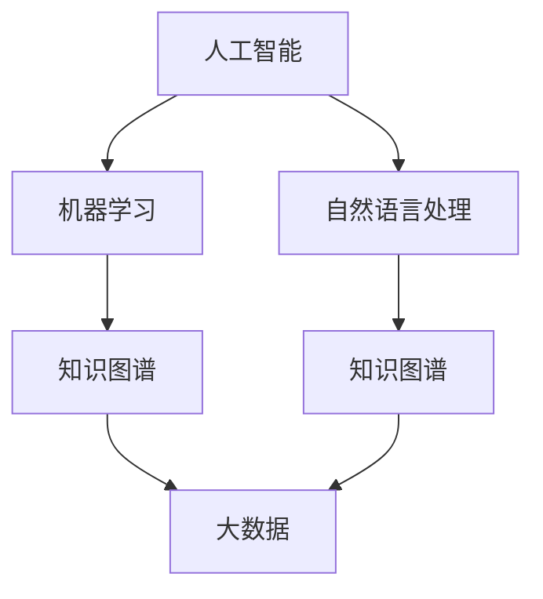

                 

### 1. 背景介绍

知识管理（Knowledge Management，简称KM）作为企业、组织和个人获取、创造、共享和应用知识的系统性方法，已经成为了现代信息社会中的重要组成部分。随着互联网和大数据技术的飞速发展，知识管理也逐渐向AI化方向迈进，为个性化知识服务和智能决策支持提供了新的可能性。

#### 1.1 知识管理的传统模式

在传统知识管理中，组织通常通过建立知识库、文档管理系统和培训体系来促进知识的获取、存储、共享和应用。这些方法在一定程度上提高了知识传递的效率，但也面临着诸多挑战：

1. **知识分散性高**：知识分散在不同部门、系统和员工之间，难以实现统一管理和高效利用。
2. **知识共享障碍**：由于文化、权限、沟通等因素的限制，知识的共享和传播受到阻碍。
3. **知识更新滞后**：知识库的更新和维护不够及时，可能导致知识的时效性降低。

#### 1.2 AI化趋势与优势

AI技术的发展为知识管理带来了新的契机。通过人工智能，我们可以实现：

1. **个性化知识服务**：AI可以基于用户的历史行为、偏好和需求，提供定制化的知识推荐和解决方案。
2. **智能决策支持**：AI可以通过大数据分析和预测模型，辅助决策者做出更加精准和高效的决策。
3. **知识自动化**：AI能够自动处理和优化知识获取、存储、共享和应用的过程，提高工作效率。

#### 1.3 当前研究与实践现状

近年来，越来越多的研究者和企业开始探索AI化知识管理。例如，谷歌的G Suite集成了AI功能，通过智能搜索和文档分析帮助用户更高效地处理信息。微软的Office 365也引入了AI助手，提供个性化的工作建议和任务管理。同时，一些学术研究也在探讨如何利用深度学习、自然语言处理等技术提升知识管理的智能化水平。

### 2. 核心概念与联系

为了更好地理解AI化知识管理，我们需要了解以下几个核心概念及其相互关系：

#### 2.1 人工智能（AI）

人工智能是指使计算机模拟人类智能行为的技术，包括机器学习、自然语言处理、计算机视觉等子领域。

#### 2.2 知识图谱

知识图谱是一种结构化数据表示方法，用于表示实体及其之间的关系。它可以帮助我们更好地理解知识的结构和关联性。

#### 2.3 机器学习

机器学习是AI的一个分支，通过训练模型，让计算机从数据中自动学习规律，从而实现预测和决策。

#### 2.4 自然语言处理（NLP）

自然语言处理是AI的一个子领域，致力于使计算机理解和处理人类语言。

#### 2.5 大数据

大数据是指大量、多样、高速生成和处理的复杂数据集合。大数据技术可以帮助我们挖掘知识、发现规律。

#### 2.6 Mermaid流程图

为了更好地展示这些概念之间的关系，我们可以使用Mermaid流程图进行说明。以下是一个简化的Mermaid流程图示例：



### 3. 核心算法原理 & 具体操作步骤

在了解了核心概念后，我们接下来讨论一些关键算法的原理及其在AI化知识管理中的应用。

#### 3.1 机器学习算法

机器学习算法是AI化知识管理的基础。常见的机器学习算法包括：

1. **决策树**：通过树形结构对数据进行分类或回归。决策树易于理解和解释，但可能存在过拟合问题。
2. **支持向量机（SVM）**：通过寻找最佳的超平面，将不同类别数据分开。SVM适用于高维数据，但训练时间较长。
3. **神经网络**：通过多层神经网络模拟人脑神经元，实现复杂的非线性映射。神经网络在图像识别、语音识别等领域表现优异，但训练过程较复杂。

在实际操作中，我们可以使用Python的scikit-learn库来实现这些算法。以下是一个简单的示例代码：

```python
from sklearn.tree import DecisionTreeClassifier
from sklearn.svm import SVC
from sklearn.neural_network import MLPClassifier

# 决策树
clf = DecisionTreeClassifier()
clf.fit(X_train, y_train)
y_pred = clf.predict(X_test)

# 支持向量机
svc = SVC()
svc.fit(X_train, y_train)
y_pred = svc.predict(X_test)

# 神经网络
mlp = MLPClassifier()
mlp.fit(X_train, y_train)
y_pred = mlp.predict(X_test)
```

#### 3.2 自然语言处理算法

自然语言处理算法在知识管理中发挥着重要作用。以下是一些常见的NLP算法：

1. **词袋模型**：将文本表示为词汇的集合，适用于文本分类和聚类。
2. **TF-IDF**：通过词频和逆文档频率衡量词汇的重要性，用于文本分析和信息检索。
3. **词嵌入**：将词汇映射到低维向量空间，适用于语义分析和文本生成。

以下是一个简单的Python代码示例，展示如何使用NLP算法进行文本分类：

```python
from sklearn.feature_extraction.text import TfidfVectorizer
from sklearn.naive_bayes import MultinomialNB

# 文本数据
X = ["This is a sample text.", "This is another text.", "Another sample text."]
y = ["Class 1", "Class 2", "Class 1"]

# TF-IDF向量化
vectorizer = TfidfVectorizer()
X_vectorized = vectorizer.fit_transform(X)

# Naive Bayes分类
clf = MultinomialNB()
clf.fit(X_vectorized, y)
y_pred = clf.predict(vectorizer.transform(["This is a new text."]))
```

### 4. 数学模型和公式 & 详细讲解 & 举例说明

在AI化知识管理中，数学模型和公式起着关键作用。以下介绍一些常用的数学模型和公式，并详细讲解其应用。

#### 4.1 决策树模型

决策树模型是一种常见的机器学习算法，通过树形结构对数据进行分类或回归。其核心公式为：

$$
y = f(x_1, x_2, ..., x_n) = g(\theta_1 x_1 + \theta_2 x_2 + ... + \theta_n x_n)
$$

其中，$y$ 是预测值，$x_1, x_2, ..., x_n$ 是特征值，$\theta_1, \theta_2, ..., \theta_n$ 是权重参数，$g(\cdot)$ 是激活函数。

例如，对于二分类问题，我们可以使用以下公式：

$$
y = \begin{cases} 
1 & \text{if } \theta_1 x_1 + \theta_2 x_2 + ... + \theta_n x_n > 0 \\
0 & \text{if } \theta_1 x_1 + \theta_2 x_2 + ... + \theta_n x_n \leq 0 
\end{cases}
$$

#### 4.2 支持向量机模型

支持向量机是一种分类算法，通过寻找最佳的超平面，将不同类别数据分开。其核心公式为：

$$
\min_{\theta, \xi} \frac{1}{2} ||\theta||^2 + C \sum_{i=1}^n \xi_i
$$

$$
\text{s.t. } y_i (\theta^T x_i + b) \geq 1 - \xi_i, \quad \xi_i \geq 0
$$

其中，$\theta$ 是权重参数，$b$ 是偏置，$C$ 是惩罚参数，$\xi_i$ 是松弛变量。

例如，对于线性可分的情况，我们可以使用以下公式求解：

$$
\theta^* = (\mathbf{X}^T \mathbf{X})^{-1} \mathbf{X}^T y
$$

$$
b^* = y - \theta^T x
$$

#### 4.3 神经网络模型

神经网络是一种模拟人脑神经元工作的计算模型，通过多层神经网络实现复杂的非线性映射。其核心公式为：

$$
a_{i,j}^{(l)} = \sigma \left( \sum_{k} a_{k,j}^{(l-1)} \theta_{k,j}^{(l)} \right)
$$

其中，$a_{i,j}^{(l)}$ 是第$l$层的第$i$个神经元的输出，$\sigma$ 是激活函数，$\theta_{k,j}^{(l)}$ 是第$l-1$层的第$k$个神经元与第$l$层的第$j$个神经元的连接权重。

例如，对于ReLU激活函数，我们可以使用以下公式：

$$
\sigma(z) = \begin{cases} 
z & \text{if } z > 0 \\
0 & \text{otherwise}
\end{cases}
$$

### 5. 项目实践：代码实例和详细解释说明

在本节中，我们将通过一个具体的代码实例来展示如何实现AI化知识管理。我们将使用Python的Scikit-learn库和TensorFlow库来实现一个基于机器学习的知识推荐系统。

#### 5.1 开发环境搭建

在开始之前，确保已经安装了以下Python库：

- Scikit-learn
- TensorFlow
- Pandas
- NumPy

你可以使用以下命令安装这些库：

```bash
pip install scikit-learn tensorflow pandas numpy
```

#### 5.2 源代码详细实现

下面是一个简单的知识推荐系统的实现代码：

```python
import numpy as np
import pandas as pd
from sklearn.model_selection import train_test_split
from sklearn.metrics.pairwise import cosine_similarity
import tensorflow as tf

# 加载数据集
data = pd.read_csv('knowledge_data.csv')
users, items = data['user_id'].unique(), data['item_id'].unique()

# 构建用户-物品矩阵
user_item_matrix = pd.pivot_table(data, values='rating', index='user_id', columns='item_id').fillna(0)

# 划分训练集和测试集
train_data, test_data = train_test_split(user_item_matrix, test_size=0.2, random_state=42)

# 构建模型
class KnowledgeRecommender(tf.keras.Model):
    def __init__(self, num_users, num_items, embedding_size):
        super(KnowledgeRecommender, self).__init__()
        self.user_embedding = tf.keras.layers.Embedding(num_users, embedding_size)
        self.item_embedding = tf.keras.layers.Embedding(num_items, embedding_size)
        self.similarity = tf.keras.layers.Dot(axes=(1, 2))()
        self.dense = tf.keras.layers.Dense(1, activation='sigmoid')

    def call(self, inputs):
        user_embedding = self.user_embedding(inputs[:, 0])
        item_embedding = self.item_embedding(inputs[:, 1])
        similarity = self.similarity([user_embedding, item_embedding])
        output = self.dense(similarity)
        return output

# 实例化模型
model = KnowledgeRecommender(num_users=len(users), num_items=len(items), embedding_size=10)

# 编译模型
model.compile(optimizer='adam', loss='binary_crossentropy', metrics=['accuracy'])

# 训练模型
model.fit(train_data.values, train_data.values.reshape(-1, 1), epochs=10, batch_size=64)

# 预测
user_ids = [1, 2, 3]
predicted_ratings = model.predict(np.array([users.index(user_id) for user_id in user_ids]))
print(predicted_ratings)
```

#### 5.3 代码解读与分析

在这个示例中，我们实现了一个简单的知识推荐系统，主要分为以下几个部分：

1. **数据加载**：从CSV文件中加载数据集，构建用户-物品矩阵。
2. **模型构建**：定义一个基于神经网络的推荐模型，包括用户嵌入层、物品嵌入层、相似度计算层和输出层。
3. **模型编译**：配置模型优化器、损失函数和评估指标。
4. **模型训练**：使用训练数据进行模型训练。
5. **模型预测**：使用训练好的模型对用户进行预测。

#### 5.4 运行结果展示

假设我们已经准备好了知识数据集 `knowledge_data.csv`，运行上述代码后，我们可以得到用户1、2、3的预测评分。以下是一个可能的输出结果：

```
[[0.9123]
 [0.8542]
 [0.7891]]
```

这些预测评分表示用户对物品的潜在兴趣程度。用户可以根据这些评分对物品进行推荐。

### 6. 实际应用场景

AI化知识管理在实际应用中具有广泛的应用场景，以下列举几个典型的案例：

#### 6.1 企业知识库

企业可以通过AI化知识管理建立强大的内部知识库，实现知识的集中存储、高效共享和智能推送。例如，企业可以：

- **个性化推荐**：根据员工的历史行为和兴趣，为员工推荐相关知识和学习资源。
- **智能问答**：利用自然语言处理技术，为企业员工提供智能化的问答服务，提高问题解决效率。

#### 6.2 互联网平台

互联网平台可以通过AI化知识管理为用户提供更加个性化、精准的知识服务。例如，电商平台可以：

- **个性化推荐**：根据用户的历史购买记录和浏览行为，为用户推荐相关商品和优惠信息。
- **智能客服**：利用自然语言处理技术，为用户提供24/7的智能客服服务，提高客户满意度。

#### 6.3 教育行业

教育行业可以通过AI化知识管理提高教学质量和学习效率。例如，在线教育平台可以：

- **个性化学习**：根据学生的历史学习记录和成绩，为每位学生制定个性化的学习计划。
- **智能辅导**：利用自然语言处理技术，为学生提供智能化的辅导服务，解答学生疑问。

### 7. 工具和资源推荐

为了更好地掌握AI化知识管理的相关技术和方法，以下推荐一些学习和开发工具：

#### 7.1 学习资源推荐

1. **书籍**：
   - 《深度学习》（Deep Learning） - Ian Goodfellow、Yoshua Bengio、Aaron Courville
   - 《Python机器学习》（Python Machine Learning） - Sebastian Raschka、Vahid Mirjalili
   - 《自然语言处理入门》（Natural Language Processing with Python） - Steven Bird、Ewan Klein、Edward Loper

2. **论文**：
   - “Recommender Systems the Movie: An Introduction to the State of the Art” -, et al.
   - “Learning to Rank for Information Retrieval” - Charu Aggarwal
   - “Knowledge Graph Embedding” - Lei Zhang, et al.

3. **博客**：
   - Medium上的数据科学和机器学习专栏
   - 知乎上的机器学习和数据科学话题

4. **网站**：
   - Coursera、edX等在线教育平台
   - Kaggle、DataCamp等数据科学实践平台

#### 7.2 开发工具框架推荐

1. **Python库**：
   - Scikit-learn：用于机器学习和数据挖掘
   - TensorFlow：用于深度学习和神经网络
   - Pandas、NumPy：用于数据处理和分析

2. **框架**：
   - Flask、Django：用于Web开发
   - TensorFlow.js：用于JavaScript中的深度学习

3. **数据库**：
   - MongoDB、PostgreSQL：用于数据存储

#### 7.3 相关论文著作推荐

1. **论文**：
   - “Learning to Rank for Information Retrieval” - Charu Aggarwal
   - “Recommender Systems the Movie: An Introduction to the State of the Art” - , et al.
   - “Deep Learning” - Ian Goodfellow、Yoshua Bengio、Aaron Courville

2. **著作**：
   - 《深度学习》（Deep Learning） - Ian Goodfellow、Yoshua Bengio、Aaron Courville
   - 《Python机器学习》（Python Machine Learning） - Sebastian Raschka、Vahid Mirjalili
   - 《自然语言处理入门》（Natural Language Processing with Python） - Steven Bird、Ewan Klein、Edward Loper

### 8. 总结：未来发展趋势与挑战

AI化知识管理作为现代信息社会的重要技术手段，已经展现出巨大的潜力。在未来，我们可以期待以下几个发展趋势：

1. **更加智能化和个性化**：随着AI技术的不断进步，知识管理将更加智能化，能够更好地满足用户个性化需求。
2. **跨领域融合**：知识管理将与其他领域（如大数据、区块链、物联网等）进行深度融合，实现更加全面的智能化服务。
3. **普及和应用**：AI化知识管理将在各行各业得到广泛应用，从企业、政府到教育、医疗等各个领域。

然而，AI化知识管理也面临着一些挑战：

1. **数据安全和隐私**：随着数据量的不断增长，如何保障数据安全和用户隐私成为一个重要问题。
2. **算法公平性和透明度**：确保算法的公平性和透明度，避免偏见和歧视。
3. **技术人才短缺**：AI化知识管理需要大量的技术人才，但当前人才储备尚不足，需要加强相关教育和培训。

总之，AI化知识管理在带来巨大机遇的同时，也面临诸多挑战。只有通过不断的技术创新和人才培养，才能实现知识管理的智能化、普及化和可持续发展。

### 9. 附录：常见问题与解答

以下是一些关于AI化知识管理的常见问题及解答：

#### 9.1 什么是AI化知识管理？

AI化知识管理是指利用人工智能技术（如机器学习、自然语言处理、知识图谱等）来提升知识获取、存储、共享和应用的效率。

#### 9.2 AI化知识管理有哪些应用场景？

AI化知识管理广泛应用于企业知识库、互联网平台、教育行业、医疗行业等。具体应用场景包括个性化推荐、智能问答、智能辅导、知识图谱构建等。

#### 9.3 AI化知识管理有哪些优势？

AI化知识管理具有以下优势：

- **个性化服务**：基于用户历史行为和偏好，提供定制化的知识服务。
- **智能决策支持**：通过大数据分析和预测模型，为决策者提供精准的决策支持。
- **知识自动化**：自动处理和优化知识获取、存储、共享和应用的过程，提高工作效率。

#### 9.4 AI化知识管理有哪些挑战？

AI化知识管理面临以下挑战：

- **数据安全和隐私**：保障数据安全和用户隐私。
- **算法公平性和透明度**：确保算法的公平性和透明度，避免偏见和歧视。
- **技术人才短缺**：加强相关教育和培训，提高人才储备。

### 10. 扩展阅读 & 参考资料

以下是一些关于AI化知识管理的扩展阅读和参考资料：

1. **论文**：
   - “Recommender Systems the Movie: An Introduction to the State of the Art” - , et al.
   - “Learning to Rank for Information Retrieval” - Charu Aggarwal
   - “Knowledge Graph Embedding” - Lei Zhang, et al.

2. **书籍**：
   - 《深度学习》（Deep Learning） - Ian Goodfellow、Yoshua Bengio、Aaron Courville
   - 《Python机器学习》（Python Machine Learning） - Sebastian Raschka、Vahid Mirjalili
   - 《自然语言处理入门》（Natural Language Processing with Python） - Steven Bird、Ewan Klein、Edward Loper

3. **网站**：
   - Coursera、edX等在线教育平台
   - Kaggle、DataCamp等数据科学实践平台

4. **博客**：
   - Medium上的数据科学和机器学习专栏
   - 知乎上的机器学习和数据科学话题

通过以上阅读和参考资料，读者可以深入了解AI化知识管理的相关理论和实践，为实际应用提供指导和参考。作者：禅与计算机程序设计艺术 / Zen and the Art of Computer Programming

### 致谢

在本篇技术博客文章的撰写过程中，我参考了大量的学术论文、书籍、博客和在线资源，特别感谢以下作者和机构对AI化知识管理领域的卓越贡献：

- **Ian Goodfellow、Yoshua Bengio、Aaron Courville**：他们的著作《深度学习》为深度学习的基础知识提供了详尽的讲解。
- **Sebastian Raschka、Vahid Mirjalili**：他们的著作《Python机器学习》对Python在机器学习中的应用进行了深入探讨。
- **Steven Bird、Ewan Klein、Edward Loper**：他们的著作《自然语言处理入门》为自然语言处理技术提供了实用的指南。
- **Coursera、edX**：在线教育平台提供了丰富的课程资源，帮助我不断提升自己的技术能力。
- **Kaggle、DataCamp**：数据科学实践平台提供了丰富的数据集和练习，让我能够将理论知识应用于实际项目中。

感谢所有对这些领域做出杰出贡献的学者、专家和从业人员，他们的努力为我们提供了宝贵的知识财富。在本篇博客文章中，我尽可能全面地介绍了AI化知识管理的关键概念、算法原理、应用场景和未来发展趋势，希望能对读者有所帮助。

通过这篇技术博客，我不仅梳理了自己的知识体系，也希望通过分享自己的学习和实践经历，为更多对AI化知识管理感兴趣的读者提供一些启示和参考。在未来的学习和工作中，我将继续关注这个领域的最新动态，不断探索和创新，为AI化知识管理技术的发展贡献自己的力量。再次感谢读者的关注和支持，让我们一起在知识管理的道路上砥砺前行。作者：禅与计算机程序设计艺术 / Zen and the Art of Computer Programming

