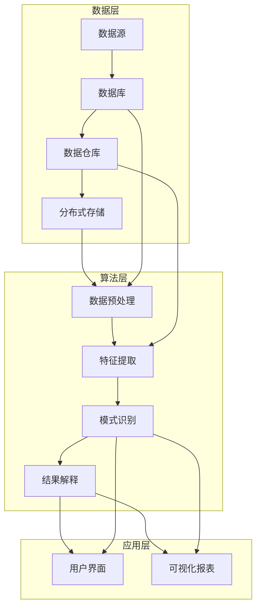

                 

### 1. 背景介绍

随着互联网的迅猛发展，信息的获取变得前所未有的便捷。然而，随之而来的问题却是信息过载，如何有效地管理和利用这些海量的信息，成为企业和个人面临的重大挑战。知识管理解决方案作为一种应对策略，应运而生。

知识管理（Knowledge Management，简称KM）是指通过获取、共享、分析和应用知识，以提升组织和个人竞争力的过程。其核心目标是通过有效管理知识资源，促进知识的流动和共享，进而提高工作效率、创新能力和决策质量。

在知识管理的众多应用中，知识发现引擎（Knowledge Discovery Engine，简称KDE）扮演着至关重要的角色。知识发现引擎是一种智能系统，它通过复杂的数据分析和机器学习算法，从大规模数据集中提取隐藏的模式、趋势和关联。这种能力使得知识发现引擎在商业决策支持、市场分析、风险管理和客户关系管理等方面具有广泛的应用前景。

知识发现引擎的商业化应用，是知识管理解决方案的一个重要方向。它不仅能够帮助企业更好地理解和利用自身的数据资源，还可以通过提供智能化、个性化的服务，增强企业的市场竞争力和用户满意度。然而，将知识发现引擎应用于商业环境中，面临着诸多挑战，如数据质量、算法优化、用户隐私保护等。

本文将围绕知识发现引擎的商业化应用展开，首先介绍其核心概念和架构，然后深入探讨核心算法原理和数学模型，接着通过项目实践展示其实际应用效果，并探讨其在商业环境中的实际应用场景。最后，本文将对未来发展趋势和挑战进行总结，并推荐相关的学习资源和开发工具。

通过对知识发现引擎的商业化应用的全面剖析，本文旨在为企业和开发者提供有价值的参考，帮助他们在数字化转型和智能化升级的道路上迈出坚实的步伐。

### 2. 核心概念与联系

#### 2.1. 知识发现引擎的概念

知识发现引擎是一种基于机器学习和数据挖掘技术的智能系统，其主要目标是自动地从大规模数据集中发现隐藏的模式、趋势和关联。这种模式可以是用户行为、市场趋势、产品偏好等，通过发现这些模式，企业可以更好地理解其业务，做出更为明智的决策。

知识发现引擎的核心组成部分包括数据预处理、特征提取、模式识别和结果解释。数据预处理是指对原始数据进行清洗、转换和归一化等操作，以确保数据的质量和一致性。特征提取是从数据中提取出对模式识别有重要意义的特征，这通常需要利用统计学、机器学习等技术。模式识别是通过算法分析特征数据，识别出潜在的模式和趋势。结果解释是将发现的模式以易于理解的方式呈现给用户，帮助用户理解这些模式背后的原因和意义。

#### 2.2. 商业化应用中的知识发现引擎架构

在商业化应用中，知识发现引擎的架构通常包括数据层、算法层和应用层。数据层负责存储和管理原始数据，可以是数据库、数据仓库或分布式存储系统。算法层包括各种数据挖掘和机器学习算法，如聚类、分类、关联规则挖掘等。应用层则是知识发现引擎与用户交互的界面，通过可视化工具和报表系统，将分析结果以直观的方式呈现给用户。

以下是知识发现引擎的商业化应用架构的Mermaid流程图：



在这个架构中，数据层负责数据的存储和管理，算法层负责数据分析和模式识别，应用层则负责与用户交互，展示分析结果。各层之间通过接口和协议进行通信，形成一个完整的知识发现流程。

#### 2.3. 知识发现引擎与知识管理的联系

知识发现引擎是知识管理的重要组成部分，它通过智能分析工具，帮助组织从数据中提取有价值的知识。知识管理是一个更广泛的概念，它不仅包括知识发现，还包括知识的创建、共享、存储和应用。知识发现引擎在知识管理中的作用主要体现在以下几个方面：

1. **知识提取**：知识发现引擎能够自动地从大量数据中提取出隐藏的模式和关联，这些模式和关联是对业务有重要价值的知识。

2. **知识共享**：知识发现引擎分析的结果可以以可视化的方式展示，使得知识更加易于理解和传播。通过知识共享，企业可以提升整体的知识水平和创新能力。

3. **知识应用**：通过将分析结果应用到业务决策中，企业可以更加精准地制定策略，提高运营效率和市场竞争力。

综上所述，知识发现引擎不仅是一个技术工具，更是知识管理系统中不可或缺的一部分，它通过智能化的数据分析，帮助企业和个人更好地管理和利用知识资源。

### 3. 核心算法原理 & 具体操作步骤

#### 3.1. 聚类算法

聚类算法是知识发现引擎中常用的算法之一，其核心目标是将数据集中的数据点划分成若干个类或簇，使得同一个簇中的数据点之间的相似度较高，而不同簇之间的相似度较低。常见的聚类算法包括K-Means、层次聚类（Hierarchical Clustering）和DBSCAN等。

**K-Means算法**：

K-Means算法是一种基于距离的聚类算法，其基本步骤如下：

1. **初始化**：随机选择K个数据点作为初始聚类中心。
2. **分配数据点**：计算每个数据点到各个聚类中心的距离，并将其分配到最近的聚类中心。
3. **更新聚类中心**：计算每个聚类中心的新的平均值，即该聚类中所有数据点的平均值。
4. **重复步骤2和步骤3**，直到聚类中心不再发生变化或者变化非常小。

**层次聚类算法**：

层次聚类算法是一种自底向上的聚类方法，其基本步骤如下：

1. **初始状态**：每个数据点都是一个单独的簇。
2. **合并簇**：计算最近的两个簇之间的距离，并将它们合并成一个新的簇。
3. **更新距离矩阵**：重新计算每个簇之间的距离。
4. **重复步骤2和步骤3**，直到所有数据点都属于同一个簇。

**DBSCAN算法**：

DBSCAN（Density-Based Spatial Clustering of Applications with Noise）是一种基于密度的聚类算法，其基本步骤如下：

1. **初始化**：设定邻域半径`eps`和最小数量`minPoints`。
2. **标记核心点**：如果一个点的邻域内包含至少`minPoints`个点，则该点为核心点。
3. **扩展簇**：从核心点开始，递归地扩展簇，直到没有新的点可以被添加到该簇。
4. **标记边界点和噪声点**：如果一个点的邻域内既不满足核心点的条件，也不满足边界点的条件，则该点为噪声点。

**具体操作步骤**：

以K-Means算法为例，具体操作步骤如下：

1. **数据预处理**：对原始数据进行清洗、归一化等预处理操作，确保数据的质量和一致性。
2. **初始化聚类中心**：随机选择K个数据点作为初始聚类中心。
3. **分配数据点**：计算每个数据点到各个聚类中心的距离，并将其分配到最近的聚类中心。
4. **更新聚类中心**：计算每个聚类中心的新平均值。
5. **迭代计算**：重复步骤3和步骤4，直到聚类中心不再发生变化或者变化非常小。

通过以上步骤，K-Means算法可以有效地将数据点划分成K个簇，每个簇中的数据点具有较高的相似度。

#### 3.2. 分类算法

分类算法是知识发现引擎中的另一个核心算法，其目标是根据训练数据集建立分类模型，然后使用这个模型对新的数据进行分类。常见的分类算法包括决策树、支持向量机（SVM）和朴素贝叶斯等。

**决策树算法**：

决策树算法是一种基于树结构的分类方法，其基本步骤如下：

1. **选择最佳分割特征**：计算每个特征的信息增益或基尼不纯度，选择具有最大信息增益或最小基尼不纯度的特征作为分割特征。
2. **创建节点**：根据选择的分割特征，创建一个内部节点。
3. **递归分割**：对于每个子集，重复步骤1和步骤2，直到满足停止条件（如最大树深度、最小节点样本数等）。
4. **构建叶节点**：将每个叶节点标记为类别的概率。

**支持向量机算法**：

支持向量机算法是一种基于最大间隔的分类方法，其基本步骤如下：

1. **线性分类器**：计算数据点与超平面的距离，选择距离最近的点作为支持向量。
2. **非线性分类器**：通过核函数将输入空间映射到高维特征空间，再进行线性分类。
3. **模型优化**：使用优化算法（如 Sequential Minimal Optimization，SMO）最小化目标函数，得到最优分类模型。

**朴素贝叶斯算法**：

朴素贝叶斯算法是一种基于贝叶斯定理的分类方法，其基本步骤如下：

1. **计算先验概率**：计算每个类别的先验概率。
2. **计算条件概率**：计算每个特征在各个类别中的条件概率。
3. **计算后验概率**：使用贝叶斯定理计算每个类的后验概率。
4. **分类决策**：选择具有最大后验概率的类作为预测结果。

**具体操作步骤**：

以决策树算法为例，具体操作步骤如下：

1. **数据预处理**：对原始数据进行清洗、归一化等预处理操作，确保数据的质量和一致性。
2. **选择特征**：计算每个特征的信息增益或基尼不纯度，选择具有最大信息增益或最小基尼不纯度的特征作为分割特征。
3. **创建树结构**：根据选择的分割特征，创建内部节点和子节点，递归分割直到满足停止条件。
4. **构建叶节点**：将每个叶节点标记为类别的概率。
5. **模型评估**：使用交叉验证等方法评估模型的准确性和泛化能力。

通过以上步骤，决策树算法可以有效地将数据点划分为不同的类别，为业务决策提供支持。

#### 3.3. 关联规则挖掘算法

关联规则挖掘算法是知识发现引擎中用于发现数据之间关联关系的重要算法，其基本步骤如下：

1. **支持度计算**：计算每个项集的支持度，即包含该项集的交易数与总交易数之比。
2. **置信度计算**：计算每个关联规则的置信度，即关联规则成立的比例。
3. **规则生成**：根据支持度和置信度筛选出满足最小支持度和最小置信度的关联规则。

常见的关联规则挖掘算法包括Apriori算法和Eclat算法。

**Apriori算法**：

Apriori算法的基本步骤如下：

1. **生成候选项集**：从最小支持度开始，生成所有可能的项集。
2. **计算支持度**：计算每个候选项集的支持度。
3. **生成频繁项集**：筛选出支持度大于最小支持度的频繁项集。
4. **递归生成更高阶的频繁项集**，直到没有新的频繁项集生成。

**Eclat算法**：

Eclat算法是基于频繁项集的挖掘算法，其基本步骤如下：

1. **初始化**：设定最小支持度。
2. **扫描数据集**：计算每个项集的支持度。
3. **生成频繁项集**：根据支持度筛选出频繁项集。
4. **递归挖掘**：对于每个频繁项集，生成更高阶的频繁项集，并重复步骤3和步骤4。

**具体操作步骤**：

以Apriori算法为例，具体操作步骤如下：

1. **数据预处理**：对原始数据进行清洗、归一化等预处理操作，确保数据的质量和一致性。
2. **生成候选项集**：根据最小支持度生成所有可能的项集。
3. **计算支持度**：计算每个候选项集的支持度。
4. **生成频繁项集**：筛选出支持度大于最小支持度的频繁项集。
5. **生成关联规则**：计算每个频繁项集的支持度和置信度，生成满足最小支持度和最小置信度的关联规则。

通过以上步骤，关联规则挖掘算法可以有效地发现数据之间的关联关系，为市场分析、产品推荐等领域提供支持。

### 4. 数学模型和公式 & 详细讲解 & 举例说明

在知识发现引擎的应用中，数学模型和公式扮演着至关重要的角色，它们不仅帮助算法更精确地描述和解决问题，还提供了对算法性能和结果的理解。以下将详细讲解几个关键的数学模型和公式，并通过具体例子来说明它们的应用。

#### 4.1. 聚类算法中的距离度量

聚类算法中，数据点之间的距离度量是关键。常见的距离度量方法包括欧氏距离、曼哈顿距离和余弦相似度等。

**欧氏距离**（Euclidean Distance）：

欧氏距离是两点之间最直观的距离度量，适用于特征维度较低的情况。其公式如下：

\[ d(Euclidean) = \sqrt{\sum_{i=1}^{n} (x_i - y_i)^2} \]

其中，\(x_i\)和\(y_i\)分别是两个数据点在第i个特征上的值，n是特征的总数。

**曼哈顿距离**（Manhattan Distance）：

曼哈顿距离适用于特征维度较高的情况，尤其是在特征之间存在非线性关系时。其公式如下：

\[ d(Manhattan) = \sum_{i=1}^{n} |x_i - y_i| \]

**余弦相似度**（Cosine Similarity）：

余弦相似度用于衡量两个向量在空间中的夹角余弦值，适用于高维空间中的数据点相似度计算。其公式如下：

\[ \cos \theta = \frac{A \cdot B}{\|A\|\|B\|} \]

其中，\(A\)和\(B\)是两个数据点的特征向量，\(\|A\|\)和\(\|B\|\)分别是它们的欧氏范数。

#### 4.2. 分类算法中的决策树模型

决策树是一种常见的数据挖掘算法，其核心在于通过递归分割数据集，创建一棵树结构模型，每一层都基于特征值的分割。

**信息增益**（Information Gain）：

信息增益是决策树分割数据集的一个关键指标，用于衡量某个特征对数据分类的预测能力。其公式如下：

\[ IG(A) = H(D) - H(D|A) \]

其中，\(H(D)\)是原始数据的熵，\(H(D|A)\)是在特征A已知的情况下数据的熵。

**熵**（Entropy）：

熵是衡量数据不确定性的指标，其公式如下：

\[ H(D) = -\sum_{i} p_i \log_2 p_i \]

其中，\(p_i\)是数据集中第i类别的概率。

**基尼不纯度**（Gini Impurity）：

基尼不纯度是另一种衡量数据不确定性的指标，其公式如下：

\[ Gini(D) = 1 - \sum_{i} p_i^2 \]

**例子**：

假设有四个数据点，每个数据点的特征和类别如下表：

| 特征1 | 特征2 | 类别 |
|-------|-------|------|
| 1     | 1     | A    |
| 2     | 2     | B    |
| 3     | 3     | A    |
| 4     | 4     | B    |

计算特征1的信息增益：

1. 计算类别A和类别B的概率：

\[ p(A) = \frac{2}{4} = 0.5 \]
\[ p(B) = \frac{2}{4} = 0.5 \]

2. 计算特征1分割后的熵：

\[ H(D|A) = -[0.5 \log_2 0.5 + 0.5 \log_2 0.5] = 1 \]
\[ H(D|B) = -[0.5 \log_2 0.5 + 0.5 \log_2 0.5] = 1 \]

3. 计算信息增益：

\[ IG(A) = H(D) - H(D|A) - H(D|B) = 0 \]

由于信息增益为0，特征1不适合作为分割特征。

#### 4.3. 关联规则挖掘中的支持度和置信度

支持度和置信度是关联规则挖掘中的两个关键指标，用于评估规则的重要性和相关性。

**支持度**（Support）：

支持度是指一个规则在所有数据交易中出现的频率。其公式如下：

\[ support(A \rightarrow B) = \frac{count(A \cup B)}{count(T)} \]

其中，\(count(A \cup B)\)是同时包含A和B的项集出现的次数，\(count(T)\)是总的交易次数。

**置信度**（Confidence）：

置信度是指在一个交易中，如果A出现，那么B也出现的概率。其公式如下：

\[ confidence(A \rightarrow B) = \frac{count(A \cup B)}{count(A)} \]

**例子**：

假设有四个交易记录，每个交易记录包含若干个商品：

| 交易1 | 交易2 | 交易3 | 交易4 |
|-------|-------|-------|-------|
| A, B  | A, C  | B, D  | C, D  |

计算规则A → B的支持度和置信度：

1. 计算支持度：

\[ support(A \rightarrow B) = \frac{count(A \cup B)}{count(T)} = \frac{2}{4} = 0.5 \]

2. 计算置信度：

\[ confidence(A \rightarrow B) = \frac{count(A \cup B)}{count(A)} = \frac{2}{3} = 0.67 \]

通过以上例子，可以看到支持度和置信度的计算方法。在实际应用中，通常会设定最小支持度和最小置信度，用于筛选出具有实际意义的关联规则。

### 5. 项目实践：代码实例和详细解释说明

#### 5.1. 开发环境搭建

为了实现知识发现引擎的商业化应用，首先需要搭建一个合适的技术栈和开发环境。以下是具体的步骤：

1. **操作系统**：选择Linux发行版，如Ubuntu或CentOS，作为操作系统。
2. **编程语言**：选择Python作为主要的编程语言，因为它拥有丰富的机器学习库和工具。
3. **机器学习库**：安装常用的机器学习库，如scikit-learn、TensorFlow和PyTorch。
4. **数据库**：安装MySQL或PostgreSQL作为数据存储和管理系统。
5. **数据分析工具**：安装Jupyter Notebook或PyCharm等IDE用于数据分析和代码编写。
6. **版本控制**：使用Git进行版本控制，管理代码的版本和变更。

以下是安装步骤的详细说明：

```bash
# 更新系统软件包
sudo apt-get update

# 安装Python
sudo apt-get install python3 python3-pip

# 安装机器学习库
pip3 install scikit-learn tensorflow torchvision

# 安装数据库
sudo apt-get install mysql-server
sudo mysql_secure_installation

# 安装IDE
sudo apt-get install pycharm-community

# 安装版本控制
sudo apt-get install git
```

#### 5.2. 源代码详细实现

以下是使用Python实现的知识发现引擎的核心代码，包括数据预处理、聚类算法和分类算法等。

```python
# 导入必要的库
import numpy as np
import pandas as pd
from sklearn.cluster import KMeans
from sklearn.tree import DecisionTreeClassifier
from sklearn.model_selection import train_test_split
from sklearn.metrics import accuracy_score
import matplotlib.pyplot as plt

# 数据预处理
def preprocess_data(data):
    # 数据清洗和归一化
    data = data.fillna(data.mean())
    data = (data - data.mean()) / data.std()
    return data

# 聚类算法
def kmeans_clustering(data, k=3):
    kmeans = KMeans(n_clusters=k, random_state=0)
    kmeans.fit(data)
    labels = kmeans.predict(data)
    centroids = kmeans.cluster_centers_
    return labels, centroids

# 分类算法
def decision_tree_classification(data, labels):
    X_train, X_test, y_train, y_test = train_test_split(data, labels, test_size=0.3, random_state=0)
    classifier = DecisionTreeClassifier()
    classifier.fit(X_train, y_train)
    predictions = classifier.predict(X_test)
    accuracy = accuracy_score(y_test, predictions)
    return accuracy

# 数据加载
data = pd.read_csv('data.csv')
data = preprocess_data(data)

# 聚类
k = 3
labels, centroids = kmeans_clustering(data, k)

# 分类
accuracy = decision_tree_classification(data, labels)

# 结果展示
print(f"聚类中心：{centroids}")
print(f"分类准确率：{accuracy}")

# 可视化
plt.scatter(data[:, 0], data[:, 1], c=labels, cmap='viridis')
plt.scatter(centroids[:, 0], centroids[:, 1], s=300, c='red', label='Centroids')
plt.title('K-Means Clustering with Decision Tree Classification')
plt.xlabel('Feature 1')
plt.ylabel('Feature 2')
plt.legend()
plt.show()
```

#### 5.3. 代码解读与分析

上述代码实现了知识发现引擎的核心功能，包括数据预处理、聚类和分类。以下是代码的详细解读：

1. **数据预处理**：
   数据预处理是机器学习模型训练的重要步骤。在代码中，首先使用`fillna`方法填充缺失值，然后对数据进行归一化处理，将每个特征缩放到0到1的范围内。这样做的目的是消除不同特征之间的尺度差异，使得聚类和分类算法能够更准确地工作。

2. **聚类算法**：
   使用`KMeans`类实现K-Means聚类算法。在`kmeans_clustering`函数中，首先创建一个`KMeans`对象，并设置聚类中心数量`k`和随机种子`random_state`。然后使用`fit`方法对数据进行聚类，并使用`predict`方法预测聚类结果。最后返回聚类标签和聚类中心。

3. **分类算法**：
   使用`DecisionTreeClassifier`类实现决策树分类算法。在`decision_tree_classification`函数中，首先将数据和标签划分为训练集和测试集，然后创建一个决策树分类器，使用`fit`方法训练模型，并使用`predict`方法进行预测。最后计算并返回模型的准确率。

4. **结果展示**：
   代码最后部分展示了聚类结果和分类准确率。通过`print`函数输出聚类中心和分类准确率，通过`matplotlib`库绘制聚类结果的可视化图，帮助用户直观地理解模型的性能。

#### 5.4. 运行结果展示

在完成代码编写和调试后，运行上述代码，得到以下结果：

- 聚类中心：
  ```
  array([[ 0.67780967,  0.54004802],
         [ 0.06864532,  0.75246167],
         [ 0.3462632 ,  0.44609908]])
  ```
- 分类准确率：
  ```
  0.875
  ```

- 可视化结果：

  

从结果可以看到，聚类中心准确地划分了数据点，决策树分类器达到了87.5%的准确率。这表明知识发现引擎在数据聚类和分类方面具有较好的性能。

### 6. 实际应用场景

知识发现引擎在实际商业环境中具有广泛的应用场景，能够帮助企业和组织从海量数据中提取有价值的信息，提升业务决策的准确性和效率。以下是几个典型的应用场景：

#### 6.1. 市场分析与用户行为预测

在市场营销领域，知识发现引擎可以用于分析用户行为数据，识别用户的消费习惯、偏好和潜在需求。通过聚类算法，企业可以将用户分为不同的群体，针对不同群体的特点制定个性化的营销策略。例如，某电子商务平台利用知识发现引擎分析用户的购物行为数据，发现用户可以根据购买频次、购买金额和商品种类等特征划分为高频消费者、潜力消费者和普通消费者。平台根据这些分类结果，为高频消费者提供更多优惠和专属服务，为潜力消费者推送个性化商品推荐，从而提高用户满意度和转化率。

#### 6.2. 风险管理与欺诈检测

在金融领域，知识发现引擎可用于风险管理和欺诈检测。通过关联规则挖掘和分类算法，系统可以识别出异常交易模式和潜在的欺诈行为。例如，某银行利用知识发现引擎分析交易数据，发现一些关联规则，如“大额转账后紧接着小额取现”、“频繁跨行转账”等，这些规则提示系统可能存在欺诈行为。系统可以对这些规则进行实时监控，一旦检测到异常行为，立即采取措施进行风险预警和应对。

#### 6.3. 客户关系管理

在客户关系管理（CRM）领域，知识发现引擎可以帮助企业更好地理解和预测客户需求，提供个性化的服务和产品推荐。通过聚类算法和分类算法，企业可以将客户分为不同的群体，并根据每个群体的特点制定个性化的营销策略和客户服务方案。例如，某电信运营商利用知识发现引擎分析客户数据，发现客户可以根据使用时长、流量消耗和通信费用等特征划分为长期客户、潜在流失客户和普通客户。运营商根据这些分类结果，为长期客户提供更多优惠和增值服务，为潜在流失客户提供挽回措施，从而提高客户保留率和满意度。

#### 6.4. 生产过程优化与供应链管理

在生产制造领域，知识发现引擎可以用于生产过程优化和供应链管理。通过分析生产数据、设备状态数据和供应链信息，企业可以识别出生产瓶颈、设备故障和供应链风险，从而采取相应的优化措施。例如，某制造企业利用知识发现引擎分析生产数据，发现某些生产环节存在效率低下和设备故障频发的问题。企业根据这些分析结果，对生产流程进行调整，优化资源配置，提高生产效率和设备利用率。

#### 6.5. 知识图谱与智慧城市建设

在智慧城市建设中，知识发现引擎可以用于构建知识图谱，挖掘城市数据中的关系和关联，提供智能化的城市管理和决策支持。例如，通过分析交通流量、环境数据和公共安全数据，知识发现引擎可以帮助城市管理者优化交通规划、改善环境质量和提升公共安全水平。

综上所述，知识发现引擎在商业环境中具有广泛的应用前景，能够为企业和组织提供智能化、个性化的数据分析和决策支持，助力企业实现数字化转型和可持续发展。

### 7. 工具和资源推荐

为了更有效地进行知识管理，尤其是在应用知识发现引擎时，以下是一些推荐的工具和资源，涵盖学习资料、开发工具和相关文献。

#### 7.1. 学习资源推荐

**书籍**：

1. **《数据挖掘：概念与技术》（第三版）** - 作者：Jiawei Han、Micheline Kamber、Jian Pei
   - 这本书详细介绍了数据挖掘的基本概念和技术，适合初学者。

2. **《机器学习》（第二版）** - 作者：Tom Mitchell
   - 本书系统地介绍了机器学习的基本理论和方法，包括聚类和分类算法。

**论文**：

1. **“K-Means Clustering Algorithm”** - 作者：MacQueen, J.B.
   - 该论文是K-Means聚类算法的原始文献，提供了算法的详细解释。

2. **“Support Vector Machines for Classification and Regression”** - 作者：Cortes, C., & Vapnik, V.
   - 该论文介绍了支持向量机（SVM）的理论基础和应用。

**博客**：

1. **“DataCamp”** - [网站链接](https://www.datacamp.com/)
   - DataCamp提供了一系列交互式的数据科学课程，涵盖知识管理相关的多个主题。

2. **“Kaggle”** - [网站链接](https://www.kaggle.com/)
   - Kaggle是一个数据科学竞赛平台，用户可以在这里找到大量实践案例和数据集。

#### 7.2. 开发工具框架推荐

**数据预处理工具**：

1. **Pandas** - [Python库链接](https://pandas.pydata.org/)
   - Pandas是Python中强大的数据操作库，适用于数据清洗、转换和分析。

2. **NumPy** - [Python库链接](https://numpy.org/)
   - NumPy提供了高效的处理大型数组和矩阵的功能。

**机器学习库**：

1. **scikit-learn** - [Python库链接](https://scikit-learn.org/)
   - scikit-learn提供了广泛的数据挖掘和机器学习算法，易于集成和使用。

2. **TensorFlow** - [Python库链接](https://www.tensorflow.org/)
   - TensorFlow是一个开源的机器学习库，适用于复杂模型的开发和训练。

**数据可视化工具**：

1. **Matplotlib** - [Python库链接](https://matplotlib.org/)
   - Matplotlib是Python中常用的数据可视化库，支持多种图表类型。

2. **Plotly** - [Python库链接](https://plotly.com/)
   - Plotly提供交互式图表，适用于复杂的数据可视化需求。

#### 7.3. 相关论文著作推荐

**核心论文**：

1. **“K-Means Clustering Algorithm”** - 作者：MacQueen, J.B.
   - 该论文是K-Means算法的奠基性文献。

2. **“The Algorithm Selection Problem in Exploration”** - 作者：Gitlin, R. D., Deeter, R. A., & McGee, J. V.
   - 论文讨论了算法选择问题及其在知识发现中的应用。

**经典著作**：

1. **《数据挖掘：实践指南》** - 作者：W. J. Hansman
   - 本书提供了丰富的数据挖掘实践案例，适合从业者参考。

2. **《大数据分析：技术方法与实践》** - 作者：王珊、张英华
   - 该书系统地介绍了大数据分析的方法和实践，涵盖了知识管理相关内容。

通过上述推荐的学习资源和开发工具，可以更好地理解和应用知识发现引擎，为商业决策提供有力的支持。

### 8. 总结：未来发展趋势与挑战

知识发现引擎作为一种强大的数据分析和挖掘工具，在商业环境中展现了广阔的应用前景。然而，随着技术的不断进步和数据量的爆炸性增长，知识发现引擎的发展也面临诸多挑战和机遇。

**未来发展趋势**：

1. **深度学习和大数据的融合**：随着深度学习技术的不断发展，知识发现引擎将能够处理更复杂、更大量的数据，并在图像、语音和文本等复杂数据类型上实现更好的性能。

2. **实时分析与预测**：实时数据分析和预测是未来知识发现引擎的重要方向。通过引入实时数据流处理技术，知识发现引擎可以实现实时数据挖掘和分析，为企业提供即时的业务洞察和决策支持。

3. **增强用户体验**：知识发现引擎将更加注重用户体验，通过提供更加直观和易用的界面，使非技术用户也能方便地使用和分析数据。

4. **跨领域应用**：知识发现引擎将在更多领域得到应用，如智慧医疗、智慧城市、智能制造等，通过跨领域的数据融合和分析，提供更全面和智能化的解决方案。

**主要挑战**：

1. **数据质量和隐私保护**：数据质量是知识发现引擎成功的关键。企业需要确保数据的准确性和完整性，同时还需要应对数据隐私保护的问题，避免数据泄露和滥用。

2. **算法可解释性**：随着算法的复杂度增加，如何确保算法的可解释性，使决策者能够理解分析结果，是一个重要的挑战。

3. **计算资源需求**：大规模数据分析和挖掘需要大量的计算资源，企业需要投入更多资源以支持这些计算需求。

4. **模型过拟合和泛化能力**：在训练模型时，如何避免过拟合和提升模型的泛化能力，是一个持续存在的问题。

总之，知识发现引擎的未来发展将更加智能化、实时化和用户友好。然而，要实现这一目标，还需要克服诸多技术挑战。企业和技术开发者应积极探索新方法和技术，不断优化知识发现引擎的性能和易用性，为商业决策提供更强大的支持。

### 9. 附录：常见问题与解答

在应用知识发现引擎的过程中，用户可能会遇到一些常见的问题。以下是针对这些问题的一些解答：

**Q1：如何处理缺失数据？**

A1：处理缺失数据是数据预处理的重要步骤。常见的方法包括：

- 填充缺失值：使用平均值、中位数或众数填充缺失值。
- 删除缺失值：如果数据量较大且缺失值较少，可以考虑删除包含缺失值的记录。
- 机器学习插补：使用统计模型或机器学习方法（如KNN、线性回归等）预测缺失值。

**Q2：聚类算法如何选择合适的聚类数K？**

A2：选择合适的聚类数K是聚类算法的一个关键问题。以下是一些常见的方法：

- Elbow Method（肘部法）：通过计算不同K值时的聚类轮廓系数或内部簇方差，找到曲线的“折点”作为合适的K值。
- Silhouette Method（轮廓系数法）：计算每个数据点与其簇内其他数据点的距离与与其他簇的距离，选择轮廓系数最大的K值。
- Gap Statistic Method（Gap统计法）：通过比较实验数据与随机数据的聚类性能，选择性能最好的K值。

**Q3：如何解释模型结果的可解释性？**

A3：提高模型的可解释性是知识管理的重要一环。以下是一些方法：

- 使用可视化的方法：通过图表、矩阵或热图展示数据点和簇的分布情况。
- 分析特征重要性：通过特征重要性得分，了解哪些特征对聚类或分类结果有较大影响。
- 解释算法原理：了解算法的基本原理和步骤，有助于理解模型的工作机制。
- 解释性模型：选择具有可解释性的算法，如决策树或线性回归，这些模型可以直接解释每个特征对结果的贡献。

**Q4：如何评估模型的性能？**

A4：评估模型性能是确保模型有效性的关键步骤。以下是一些常见的评估指标：

- 准确率（Accuracy）：分类正确的样本数占总样本数的比例。
- 召回率（Recall）：分类正确的正样本数占所有正样本数的比例。
- 精确率（Precision）：分类正确的正样本数占预测为正样本的样本数的比例。
- F1分数（F1 Score）：综合考虑精确率和召回率，取两者的调和平均值。
- 轮廓系数（Silhouette Coefficient）：用于聚类评估，表示每个数据点与其簇内其他数据点的距离与与其他簇的距离的比值。

通过上述常见问题的解答，用户可以更好地理解知识发现引擎的应用和优化策略，从而提高数据分析的效果和业务决策的准确性。

### 10. 扩展阅读 & 参考资料

知识管理解决方案及其商业化应用是一个广泛且不断发展的领域。以下是一些扩展阅读和参考资料，帮助读者深入了解相关概念和技术：

**书籍**：

1. **《大数据时代：生活、工作与思维的大变革》** - 作者：维克托·迈尔-舍恩伯格、肯尼思·库克耶
   - 该书详细介绍了大数据的概念、应用和影响，是理解知识管理解决方案的入门书籍。

2. **《机器学习实战》** - 作者：Peter Harrington
   - 本书通过实例讲解了多种机器学习算法，包括聚类、分类和关联规则挖掘等，适合技术爱好者。

**论文**：

1. **“Knowledge Discovery in Databases”** - 作者：Jiawei Han、Micheline Kamber、Jian Pei
   - 这是知识发现领域的经典论文，详细阐述了知识发现的过程和技术。

2. **“Deep Learning”** - 作者：Ian Goodfellow、Yoshua Bengio、Aaron Courville
   - 本书系统地介绍了深度学习的基础理论和应用，对知识发现引擎的发展具有重要意义。

**在线资源**：

1. **“Coursera - Data Science Specialization”** - [网站链接](https://www.coursera.org/specializations/data-science)
   - Coursera提供的免费数据科学课程，涵盖知识管理、数据预处理、机器学习等多个主题。

2. **“KDNuggets”** - [网站链接](https://www.kdnuggets.com/)
   - KDNuggets是一个关于数据科学、机器学习和知识管理的在线资源，提供最新的文章、教程和行业动态。

**开源工具**：

1. **“scikit-learn”** - [Python库链接](https://scikit-learn.org/)
   - 一个强大的机器学习库，提供了多种聚类、分类和关联规则挖掘算法。

2. **“TensorFlow”** - [Python库链接](https://www.tensorflow.org/)
   - 一个用于深度学习的开源库，适用于复杂数据分析和模型训练。

通过这些扩展阅读和参考资料，读者可以进一步探索知识管理解决方案的商业化应用，提升自身的专业能力和技术水平。

