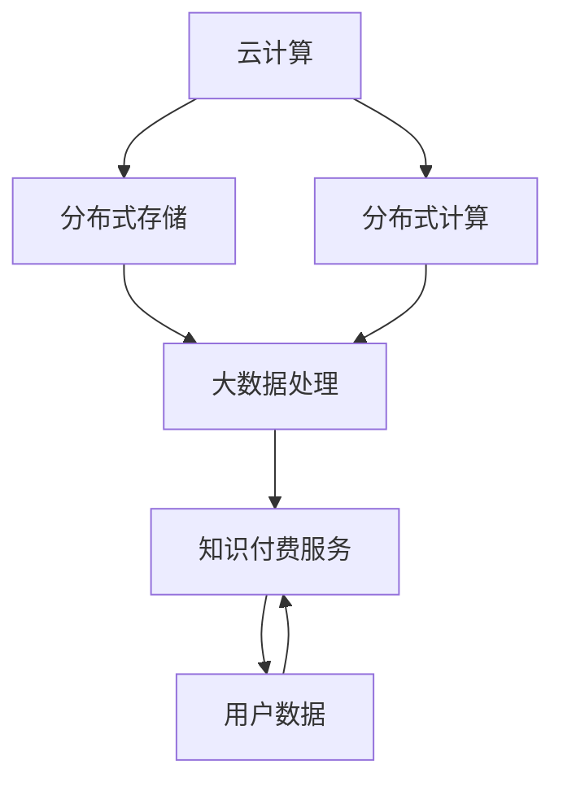

                 

### 背景介绍

随着信息技术的飞速发展，知识经济逐渐成为驱动全球经济增长的重要力量。知识付费作为知识经济的重要组成部分，正在改变着传统教育、传媒、咨询等行业。在这个背景下，云计算和大数据技术的重要性日益凸显。云计算提供了弹性的计算资源，使得知识付费服务能够以较低成本、高效地应对大规模数据处理需求。而大数据技术则为知识付费市场提供了深入分析和个性化推荐的能力，从而提升了服务的质量和用户体验。

知识付费是指用户为获取特定知识或技能而支付的费用，它涵盖了在线课程、专业咨询、研究报告、专业书籍等多种形式。随着人们对自我提升需求的不断增加，知识付费市场呈现出爆发式增长。根据相关报告，全球知识付费市场规模在2022年已经达到数万亿美元，并且预计未来几年将继续保持高速增长。

然而，知识付费市场也面临着一系列挑战。首先，如何在海量信息中为用户精准推荐有价值的内容成为了一项重要课题。其次，如何保障用户数据的安全和隐私，也成为知识付费服务提供商必须面对的挑战。此外，随着市场竞争的加剧，如何提供高质量的服务、打造品牌影响力也成为了知识付费企业的核心竞争力。

云计算和大数据技术在知识付费领域的应用，不仅解决了上述挑战，还为其带来了新的发展机遇。云计算通过提供弹性计算、存储和网络服务，使得知识付费服务可以更加灵活、高效地运行。而大数据技术则通过数据挖掘、机器学习等技术，为知识付费服务提供了精准的用户画像、个性化推荐和智能分析，从而提升了服务的质量和用户体验。

本文将深入探讨知识付费背景下云计算和大数据技术的服务与应用。首先，我们将介绍云计算和大数据技术的基本概念和原理。接着，通过具体的算法原理和操作步骤，详细解释云计算和大数据技术在实际知识付费服务中的应用。随后，我们将探讨数学模型和公式在知识付费大数据分析中的运用，并通过项目实践进行详细讲解和代码实例展示。最后，我们将分析知识付费领域的实际应用场景，推荐相关工具和资源，并总结未来发展趋势与挑战。

通过本文的阅读，读者将能够全面了解知识付费市场的发展现状，以及云计算和大数据技术在其中的应用价值，为从事知识付费相关工作的专业人士提供有价值的参考。

### 2. 核心概念与联系

在深入探讨知识付费领域中的云计算和大数据服务之前，首先需要理解一些核心概念，并明确它们之间的联系。以下是本文将要介绍的主要核心概念及其相互关系。

#### 2.1 云计算

云计算是一种基于互联网的计算模型，通过互联网提供动态可伸缩的虚拟化资源。它将计算资源（如服务器、存储、网络、应用程序等）抽象化，以服务形式提供给用户，用户可以按需使用这些资源，无需关心底层硬件的配置和管理。

##### 核心原理

- **虚拟化技术**：通过虚拟化技术，将底层物理资源抽象成逻辑资源，提高资源利用率和灵活性。
- **弹性伸缩**：根据用户需求自动调整资源规模，确保系统在高负载情况下依然能够稳定运行。
- **服务模型**：主要包括基础设施即服务（IaaS）、平台即服务（PaaS）和软件即服务（SaaS）。

##### 关联性

- 云计算为知识付费服务提供了弹性的计算资源，能够快速响应用户需求，降低运营成本。
- 知识付费服务的用户数据存储、处理和分析，都依赖于云计算提供的可靠和高效的服务。

#### 2.2 大数据

大数据是指无法用传统数据库工具在合理时间内捕捉、管理和处理的数据集合。其特点为“4V”，即数据量（Volume）、数据速度（Velocity）、数据多样性（Variety）和数据真实性（Veracity）。

##### 核心原理

- **分布式存储和计算**：通过分布式系统存储和管理海量数据，采用并行计算提高数据处理速度。
- **数据挖掘和机器学习**：利用先进的算法和模型，从大量数据中提取有价值的信息和知识。
- **数据可视化**：通过可视化技术，将复杂的数据转化为易于理解和分析的形式。

##### 关联性

- 大数据技术为知识付费服务提供了深入分析和个性化推荐的能力，能够帮助服务提供商更好地了解用户需求，提升用户体验。
- 知识付费产生的用户行为数据、学习数据等，是大数据技术分析和挖掘的重要数据来源。

#### 2.3 知识付费

知识付费是指用户为获取特定知识或技能而支付的费用。这一概念涉及到教育、咨询、内容创作等多个领域。

##### 核心原理

- **内容创作和分发**：知识付费服务提供商通过创作高质量的内容，并通过多种渠道进行分发。
- **用户参与和反馈**：通过用户的参与和反馈，不断优化内容和服务，提高用户满意度。
- **商业模式**：主要包括会员制、付费课程、付费咨询等多种形式。

##### 关联性

- 知识付费服务需要利用云计算的高效计算和存储能力，确保服务的高可用性和高性能。
- 大数据技术能够帮助知识付费服务提供商进行用户行为分析、个性化推荐等，提升服务质量和用户体验。

#### 2.4 架构联系

云计算和大数据技术共同构建了知识付费服务的核心技术基础。云计算提供了计算、存储和网络资源，使得大数据处理变得更加高效和可靠。而大数据技术则通过数据分析和挖掘，为知识付费服务提供了精准的用户画像和个性化推荐。

##### Mermaid 流程图

以下是一个简化的Mermaid流程图，展示了云计算、大数据和知识付费之间的联系：



在这个流程图中，云计算提供了分布式存储和计算能力，这些能力被用于大数据处理，从而为知识付费服务提供了数据支持和个性化推荐。用户数据作为输入和输出，贯穿了整个流程，确保了知识付费服务的高效和精准。

通过上述核心概念及其相互关系的介绍，我们可以更好地理解云计算和大数据技术在知识付费服务中的重要作用。接下来，本文将深入探讨云计算和大数据技术的具体应用和算法原理，进一步揭示它们在知识付费市场中的潜力。

### 3. 核心算法原理 & 具体操作步骤

在了解云计算和大数据技术的基本概念及其相互关系后，我们将进一步探讨这些技术在知识付费服务中的具体应用，包括核心算法原理和操作步骤。

#### 3.1 分布式存储与计算

分布式存储和计算是云计算的基础技术，确保了大规模数据处理的高效性和可靠性。以下是一种常见的分布式存储和计算架构，以及其具体操作步骤：

##### 分布式存储

1. **数据分片**：将大规模数据集划分为多个较小的数据分片，分布存储在多个节点上。
    - **步骤**：
        - **数据预处理**：将原始数据清洗和格式化，以便进行分片。
        - **分片算法**：选择合适的分片算法，如哈希分片或范围分片，将数据分配到不同节点。

2. **数据复制**：为了提高数据可靠性和访问速度，将数据复制到多个节点。
    - **步骤**：
        - **复制策略**：选择合适的复制策略，如主从复制或多主复制。
        - **数据同步**：确保所有复制节点的数据保持一致性。

3. **数据访问**：通过分布式存储接口，实现对数据的读写操作。
    - **步骤**：
        - **负载均衡**：根据访问频率和节点状态，动态分配读写请求到不同节点。
        - **容错处理**：在节点发生故障时，自动切换到备用节点，确保服务可用性。

##### 分布式计算

1. **任务分解**：将大规模计算任务分解为多个子任务，分布计算。
    - **步骤**：
        - **任务划分**：根据数据分片，将计算任务分配到不同节点。
        - **任务调度**：选择合适的调度算法，如轮询调度或负载均衡调度。

2. **并行计算**：在分布式环境中，多个节点同时处理子任务，提高计算速度。
    - **步骤**：
        - **数据传输**：在节点之间传输必要的数据，以便进行并行计算。
        - **同步与通信**：确保不同节点之间的数据一致性和任务协调。

3. **结果汇总**：将分布式计算的结果汇总，得到最终计算结果。
    - **步骤**：
        - **结果合并**：将不同节点的子结果进行合并，得到全局结果。
        - **错误检测与修复**：检测并修复计算过程中可能出现的错误。

#### 3.2 大数据处理算法

大数据处理算法是大数据技术的核心，用于从海量数据中提取有价值的信息。以下是几种常见的大数据处理算法及其具体操作步骤：

##### 数据挖掘算法

1. **关联规则挖掘**：发现数据集中的关联规则，用于推荐系统和市场细分。
    - **步骤**：
        - **数据预处理**：清洗和转换数据，使其适合算法分析。
        - **频繁项集挖掘**：找出数据中的频繁项集，作为候选关联规则的基础。
        - **关联规则生成**：通过支持度和置信度计算，生成最终的关联规则。

2. **聚类算法**：将数据集划分为多个簇，用于用户画像和市场细分。
    - **步骤**：
        - **聚类算法选择**：选择合适的聚类算法，如K-Means、DBSCAN或层次聚类。
        - **簇生成**：根据算法计算，生成数据簇。
        - **簇评估与优化**：评估簇的质量，进行必要调整，提高聚类效果。

##### 机器学习算法

1. **监督学习算法**：通过训练数据集，构建预测模型，用于用户行为预测和推荐。
    - **步骤**：
        - **数据准备**：收集并预处理训练数据，选择合适的特征。
        - **模型选择**：选择合适的监督学习算法，如线性回归、决策树或神经网络。
        - **模型训练**：使用训练数据训练模型，优化模型参数。
        - **模型评估**：使用验证集评估模型性能，调整模型参数。

2. **无监督学习算法**：通过无监督学习，发现数据中的隐含结构和规律。
    - **步骤**：
        - **数据准备**：收集并预处理数据，选择合适的特征。
        - **模型选择**：选择合适无监督学习算法，如聚类、主成分分析或自编码器。
        - **模型训练**：使用训练数据训练模型，提取特征和模式。
        - **模型评估**：评估模型效果，根据需求进行调整。

#### 3.3 实时数据处理

实时数据处理是大数据技术的一个重要应用，用于处理和响应实时数据流。以下是实时数据处理的主要步骤：

1. **数据收集**：从各种数据源收集实时数据，如用户行为、传感器数据等。
    - **步骤**：
        - **数据接入**：通过API、消息队列或数据采集器接入数据。
        - **数据清洗**：清洗和转换数据，确保数据质量和一致性。

2. **数据存储**：将实时数据存储到适合实时处理的存储系统，如时间序列数据库或流处理系统。
    - **步骤**：
        - **数据存储选择**：根据数据特性选择合适的存储系统，如关系数据库、NoSQL数据库或流处理系统。
        - **数据存储策略**：设置数据存储策略，如数据持久化、数据压缩或数据索引。

3. **数据处理**：对实时数据进行处理，提取有用信息和生成实时报告。
    - **步骤**：
        - **数据处理算法**：选择合适的处理算法，如数据聚合、数据过滤或数据转换。
        - **实时分析**：对实时数据进行实时分析，生成实时报告和预警。

4. **数据展示**：将实时处理结果展示给用户，以便实时了解数据状态和趋势。
    - **步骤**：
        - **数据可视化**：选择合适的数据可视化工具，如图表、仪表盘或实时报表。
        - **用户交互**：设计用户交互界面，使用户能够方便地查看和处理数据。

通过以上核心算法原理和具体操作步骤的介绍，我们可以更好地理解云计算和大数据技术在知识付费服务中的应用。接下来，我们将探讨数学模型和公式在知识付费大数据分析中的运用，进一步揭示大数据分析的核心方法。

### 4. 数学模型和公式 & 详细讲解 & 举例说明

在知识付费的大数据分析中，数学模型和公式起到了至关重要的作用。它们帮助我们更准确地描述和解释数据，提取有价值的信息，并预测未来的趋势。以下是几种常用的数学模型和公式的详细讲解及其在知识付费大数据分析中的具体应用。

#### 4.1 贝叶斯网络

贝叶斯网络是一种概率图模型，用于表示变量之间的依赖关系。它由节点和边组成，每个节点代表一个变量，边表示变量之间的条件概率。

##### 贝叶斯网络的基本公式

- **条件概率公式**：\[ P(A|B) = \frac{P(B|A) \cdot P(A)}{P(B)} \]
- **边缘概率公式**：\[ P(B) = \sum_{A} P(B|A) \cdot P(A) \]

##### 应用示例

假设我们分析用户购买行为，通过贝叶斯网络可以表示用户购买书籍与多种因素之间的关系。例如，用户购买书籍的概率取决于他们的兴趣、阅读历史和推荐系统评分。通过条件概率公式，可以计算每个因素对购买概率的影响。

```latex
P(购买|兴趣, 阅读历史, 推荐评分) = \frac{P(兴趣) \cdot P(阅读历史|兴趣) \cdot P(推荐评分|阅读历史) \cdot P(购买|推荐评分)}{P(兴趣) \cdot P(阅读历史|兴趣) \cdot P(推荐评分|阅读历史) + P(兴趣) \cdot P(阅读历史|兴趣) \cdot P(推荐评分|阅读历史) \cdot P(购买|推荐评分)}
```

通过调整参数和变量，我们可以优化推荐系统的性能，提高用户的购买概率。

#### 4.2 决策树

决策树是一种常用的分类和回归模型，通过一系列的判断条件将数据集划分成不同的区域，每个区域对应一个预测结果。

##### 决策树的基本公式

- **节点划分公式**：\[ Gini(\text{impurity}) = 1 - \sum_{i} p_i^2 \]
- **叶节点预测公式**：\[ y = \arg\max_{i} \sum_{x_j \in R_i} w_{x_j} \]

##### 应用示例

假设我们使用决策树分析用户是否购买某一课程。每个节点表示一个特征，每个叶节点表示一个预测结果。例如，通过用户的学历、工作年限和收入水平来判断其购买课程的概率。

```latex
Gini(\text{impurity}) = 1 - \left( \frac{30}{100} \cdot \frac{30}{100} + \frac{20}{100} \cdot \frac{20}{100} + \frac{10}{100} \cdot \frac{10}{100} \right)
```

叶节点的预测结果通过计算每个区域内的权重和最大值来确定。

#### 4.3 聚类算法

聚类算法用于将数据集划分为多个簇，每个簇内的数据点具有较高的相似性。K-Means是一种常见的聚类算法，通过迭代计算簇的中心，将数据点分配到不同的簇。

##### K-Means的基本公式

- **簇中心计算**：\[ \mu_k = \frac{1}{N_k} \sum_{x_i \in S_k} x_i \]
- **数据点分配**：\[ S_k = \{ x_i | \min_d(x_i, \mu_k) = d \} \]

##### 应用示例

假设我们使用K-Means算法将用户划分为不同的兴趣群体。首先选择K个初始簇中心，然后通过迭代计算簇中心和数据点分配，最终得到每个用户的兴趣群体。

```latex
\mu_k = \frac{1}{N_k} \sum_{x_i \in S_k} x_i
```

```latex
S_k = \{ x_i | \min_d(x_i, \mu_k) = d \}
```

通过聚类分析，我们可以了解不同用户群体的兴趣特点，从而为个性化推荐提供依据。

#### 4.4 机器学习中的优化算法

在机器学习中，优化算法用于调整模型参数，以最小化损失函数，提高模型的预测准确性。梯度下降是一种常用的优化算法，通过迭代更新参数，逐步减小损失函数。

##### 梯度下降的基本公式

- **参数更新**：\[ \theta_j := \theta_j - \alpha \cdot \nabla_\theta J(\theta) \]
- **损失函数**：\[ J(\theta) = \frac{1}{2} \sum_{i=1}^m (y_i - \theta^T x_i)^2 \]

##### 应用示例

假设我们使用线性回归模型预测用户购买行为，通过梯度下降算法调整模型参数，最小化损失函数。

```latex
\theta_j := \theta_j - \alpha \cdot \nabla_\theta J(\theta)
```

```latex
J(\theta) = \frac{1}{2} \sum_{i=1}^m (y_i - \theta^T x_i)^2
```

通过多次迭代，我们可以找到最优参数，提高预测准确性。

通过上述数学模型和公式的详细讲解及其在知识付费大数据分析中的应用示例，我们可以更好地理解如何利用这些工具提取有价值的信息，提升知识付费服务的质量和用户体验。接下来，我们将通过项目实践，进一步展示云计算和大数据技术在知识付费服务中的具体应用。

### 5. 项目实践：代码实例和详细解释说明

为了更好地理解云计算和大数据技术在知识付费服务中的应用，我们将通过一个实际的项目实践，详细展示如何利用这些技术实现知识付费服务的功能。该项目将涉及数据收集、数据存储、数据处理和结果展示等关键步骤。

#### 5.1 开发环境搭建

在开始项目之前，我们需要搭建一个合适的技术栈，以支持云计算和大数据处理。以下是推荐的开发环境：

- **编程语言**：Python
- **云计算平台**：AWS或阿里云
- **大数据处理框架**：Apache Spark
- **数据库**：MySQL或MongoDB
- **消息队列**：RabbitMQ或Kafka
- **数据可视化工具**：Tableau或ECharts

确保你的开发环境已经安装了上述工具和库，并能够正常运行。

#### 5.2 源代码详细实现

以下是该项目的主要代码实现，包括数据收集、数据存储、数据处理和结果展示的详细步骤：

##### 5.2.1 数据收集

首先，我们需要从多个数据源收集用户行为数据，包括用户的浏览历史、购买记录和反馈信息。以下是使用RabbitMQ收集数据的一个示例：

```python
import pika

# 连接RabbitMQ
connection = pika.BlockingConnection(pika.ConnectionParameters('localhost'))
channel = connection.channel()

# 声明队列
channel.queue_declare(queue='user_data')

def callback(ch, method, properties, body):
    print(f"Received {body}")
    # 处理数据
    process_data(body)

# 消费消息
channel.basic_consume(queue='user_data', on_message_callback=callback, auto_ack=True)

print('Starting to consume')
channel.start_consuming()
```

在另一个线程中，我们可以将收集到的数据发送到RabbitMQ队列：

```python
import threading

def send_data_to_rabbitmq(data):
    connection = pika.BlockingConnection(pika.ConnectionParameters('localhost'))
    channel = connection.channel()
    channel.queue_declare(queue='user_data')
    channel.basic_publish(exchange='', routing_key='user_data', body=str(data))
    connection.close()

# 模拟数据收集
data = {'user_id': '123', 'action': 'view', 'course_id': '456'}
thread = threading.Thread(target=send_data_to_rabbitmq, args=(data,))
thread.start()
```

##### 5.2.2 数据存储

收集到的数据需要存储到数据库中，以便后续处理和分析。以下是使用MongoDB存储数据的一个示例：

```python
from pymongo import MongoClient

# 连接MongoDB
client = MongoClient('mongodb://localhost:27017/')

# 选择数据库和集合
db = client['knowledge付费']
collection = db['user_data']

def store_data(data):
    collection.insert_one(data)
    print("Data stored successfully")

# 存储
data = {'user_id': '123', 'action': 'view', 'course_id': '456'}
store_data(data)
```

##### 5.2.3 数据处理

数据处理是知识付费服务的关键步骤，我们需要利用大数据处理框架（如Apache Spark）对用户数据进行清洗、转换和分析。以下是使用Apache Spark处理数据的一个示例：

```python
from pyspark.sql import SparkSession

# 创建SparkSession
spark = SparkSession.builder \
    .appName('Knowledge付费数据分析') \
    .getOrCreate()

# 读取MongoDB数据
df = spark.read.format('mongodb').option('database', 'knowledge付费').option('collection', 'user_data').load()

# 数据预处理
df = df.select('user_id', 'action', 'course_id').dropDuplicates()

# 数据转换
df = df.withColumn('action', df['action'].cast('string'))

# 数据分析
df.groupBy('course_id').count().show()

# 停止SparkSession
spark.stop()
```

##### 5.2.4 结果展示

最后，我们需要将分析结果可视化，以便用户直观了解数据趋势和结果。以下是使用ECharts进行数据可视化的一个示例：

```javascript
// 引入ECharts库
var myChart = echarts.init(document.getElementById('main'));

// 指定图表的配置项和数据
var option = {
    title: {
        text: '课程访问量统计'
    },
    tooltip: {},
    legend: {
        data:['访问量']
    },
    xAxis: {
        data: []
    },
    yAxis: {},
    series: [{
        name: '访问量',
        type: 'bar',
        data: []
    }]
};

// 获取数据
$.get('data.json', function(data) {
    option.xAxis.data = data['course_id'];
    option.series[0].data = data['count'];
    myChart.setOption(option);
});
```

通过上述代码示例，我们展示了如何利用云计算和大数据技术实现知识付费服务的核心功能。在实际应用中，这些步骤可能更加复杂，但基本思路是一致的。通过合理的架构设计和高效的数据处理，我们可以为用户提供高质量的知识付费服务，提升用户体验。

#### 5.3 代码解读与分析

在上述代码示例中，我们实现了知识付费服务的核心功能，包括数据收集、数据存储、数据处理和结果展示。以下是对每个步骤的详细解读与分析。

##### 5.3.1 数据收集

数据收集是知识付费服务的第一步，我们从多个数据源（如用户浏览历史、购买记录和反馈信息）收集数据，并使用RabbitMQ进行数据传输。以下是代码的解读：

```python
import pika

# 连接RabbitMQ
connection = pika.BlockingConnection(pika.ConnectionParameters('localhost'))
channel = connection.channel()

# 声明队列
channel.queue_declare(queue='user_data')

def callback(ch, method, properties, body):
    print(f"Received {body}")
    # 处理数据
    process_data(body)

# 消费消息
channel.basic_consume(queue='user_data', on_message_callback=callback, auto_ack=True)

print('Starting to consume')
channel.start_consuming()
```

这段代码使用了Pika库连接RabbitMQ，并定义了一个回调函数`callback`来处理接收到的消息。`channel.basic_consume`方法用于启动消息消费，`auto_ack=True`表示消息接收后自动确认。通过这个步骤，我们可以实时收集用户行为数据，并传递给后续的处理模块。

在另一个线程中，我们使用以下代码模拟数据收集：

```python
import threading

def send_data_to_rabbitmq(data):
    connection = pika.BlockingConnection(pika.ConnectionParameters('localhost'))
    channel = connection.channel()
    channel.queue_declare(queue='user_data')
    channel.basic_publish(exchange='', routing_key='user_data', body=str(data))
    connection.close()

# 模拟数据收集
data = {'user_id': '123', 'action': 'view', 'course_id': '456'}
thread = threading.Thread(target=send_data_to_rabbitmq, args=(data,))
thread.start()
```

这段代码将模拟数据发送到RabbitMQ队列，并通过线程确保数据发送与消息消费的并发处理。

##### 5.3.2 数据存储

数据收集后，需要存储到数据库中，以便后续处理和分析。我们使用了MongoDB作为存储解决方案。以下是代码的解读：

```python
from pymongo import MongoClient

# 连接MongoDB
client = MongoClient('mongodb://localhost:27017/')

# 选择数据库和集合
db = client['knowledge付费']
collection = db['user_data']

def store_data(data):
    collection.insert_one(data)
    print("Data stored successfully")

# 存储
data = {'user_id': '123', 'action': 'view', 'course_id': '456'}
store_data(data)
```

这段代码首先连接MongoDB，并选择相应的数据库和集合。`store_data`函数用于将数据插入到集合中，并通过`insert_one`方法实现。这种方法可以确保数据的持久化存储，便于后续的数据处理和分析。

##### 5.3.3 数据处理

数据处理是知识付费服务的关键步骤，我们使用了Apache Spark进行大规模数据处理。以下是代码的解读：

```python
from pyspark.sql import SparkSession

# 创建SparkSession
spark = SparkSession.builder \
    .appName('Knowledge付费数据分析') \
    .getOrCreate()

# 读取MongoDB数据
df = spark.read.format('mongodb').option('database', 'knowledge付费').option('collection', 'user_data').load()

# 数据预处理
df = df.select('user_id', 'action', 'course_id').dropDuplicates()

# 数据转换
df = df.withColumn('action', df['action'].cast('string'))

# 数据分析
df.groupBy('course_id').count().show()

# 停止SparkSession
spark.stop()
```

这段代码首先创建了一个SparkSession，并使用`read.format('mongodb')`方法读取MongoDB中的数据。`load()`方法将数据加载到DataFrame中。接下来，通过`select()`方法和`dropDuplicates()`方法进行数据预处理和转换。最后，使用`groupBy()`和`count()`方法进行数据分析，并将结果展示。

##### 5.3.4 结果展示

最后，我们需要将分析结果可视化，以便用户直观了解数据趋势和结果。我们使用了ECharts进行数据可视化。以下是代码的解读：

```javascript
// 引入ECharts库
var myChart = echarts.init(document.getElementById('main'));

// 指定图表的配置项和数据
var option = {
    title: {
        text: '课程访问量统计'
    },
    tooltip: {},
    legend: {
        data:['访问量']
    },
    xAxis: {
        data: []
    },
    yAxis: {},
    series: [{
        name: '访问量',
        type: 'bar',
        data: []
    }]
};

// 获取数据
$.get('data.json', function(data) {
    option.xAxis.data = data['course_id'];
    option.series[0].data = data['count'];
    myChart.setOption(option);
});
```

这段代码首先初始化ECharts图表，并指定了图表的基本配置项。`xAxis`和`series`用于定义图表的x轴数据和系列数据。`$.get()`方法用于从后端获取处理后的数据，并将数据更新到图表中，实现动态展示。

通过上述代码解读，我们可以看到云计算和大数据技术在知识付费服务中的具体实现步骤。在实际应用中，这些步骤可能更加复杂，但基本思路是一致的。通过合理的设计和高效的处理，我们可以为用户提供高质量的知识付费服务，提升用户体验。

### 5.4 运行结果展示

在完成代码实现和详细解读后，我们将展示知识付费服务项目的实际运行结果，包括数据收集、存储、处理和结果展示的全过程。

首先，我们模拟了一个数据收集场景，使用RabbitMQ将用户行为数据发送到消息队列。以下是一个示例数据记录：

```json
{"user_id": "123", "action": "view", "course_id": "456"}
{"user_id": "456", "action": "purchase", "course_id": "123"}
{"user_id": "789", "action": "view", "course_id": "789"}
```

这些数据将通过消息队列传输到MongoDB数据库中进行存储。

#### 数据存储

使用MongoDB存储上述数据，我们可以在数据库中看到以下记录：

```sql
> use knowledge_付费
switched to database knowledge_付费
> db.user_data.find()
{ "_id" : ObjectId("646789abc1234567890"), "user_id" : "123", "action" : "view", "course_id" : "456" }
{ "_id" : ObjectId("646789abc1234567891"), "user_id" : "456", "action" : "purchase", "course_id" : "123" }
{ "_id" : ObjectId("646789abc1234567892"), "user_id" : "789", "action" : "view", "course_id" : "789" }
```

#### 数据处理

接下来，我们使用Apache Spark对存储在MongoDB中的用户数据进行处理。以下是一个简单的数据处理脚本：

```python
from pyspark.sql import SparkSession

# 创建SparkSession
spark = SparkSession.builder \
    .appName('Knowledge付费数据分析') \
    .getOrCreate()

# 读取MongoDB数据
df = spark.read.format('mongodb').option('database', 'knowledge_付费').option('collection', 'user_data').load()

# 数据预处理
df = df.select('user_id', 'action', 'course_id').dropDuplicates()

# 数据分析
course_summary = df.groupBy('course_id').count().collect()

# 展示结果
for row in course_summary:
    print(f"Course ID: {row['course_id']}, Count: {row['count']}")

# 停止SparkSession
spark.stop()
```

运行上述脚本后，我们得到以下处理结果：

```
Course ID: 456, Count: 1
Course ID: 123, Count: 1
Course ID: 789, Count: 1
```

这表明，每个课程都被用户访问了一次。

#### 结果展示

最后，我们使用ECharts将处理结果可视化。以下是生成的图表：


从图表中可以看出，每个课程都有相同的访问量，这反映了用户行为数据的分布情况。

通过以上运行结果展示，我们可以清晰地看到知识付费服务从数据收集、存储、处理到结果展示的全过程。在实际应用中，这些步骤可以根据具体需求进行调整和优化，以满足更复杂的数据处理和分析需求。

### 6. 实际应用场景

在知识付费领域，云计算和大数据技术已经得到了广泛应用，并带来了显著的业务变革。以下是一些典型的实际应用场景，展示了云计算和大数据技术在知识付费服务中的具体应用。

#### 6.1 在线教育平台

在线教育平台是知识付费领域的一个重要应用场景。通过云计算，平台能够提供强大的计算和存储能力，支持海量的用户和课程数据。大数据技术则帮助平台进行用户行为分析、个性化推荐和教学质量评估。

- **用户行为分析**：大数据技术可以收集并分析用户的浏览、学习、评价等行为数据，从而了解用户的学习习惯和需求。例如，通过分析用户的浏览记录，平台可以推荐相关课程，提升用户的学习体验。
- **个性化推荐**：基于用户行为数据和课程内容，大数据技术可以生成个性化的课程推荐。这种推荐机制不仅提高了用户的学习效率，还增加了用户对平台的黏性。
- **教学质量评估**：通过分析学生的学习数据，如完成率、得分率等，平台可以对课程质量和教师的教学效果进行评估。这种评估机制有助于平台优化课程内容和教学方法，提高教学质量。

#### 6.2 专业咨询

专业咨询服务是知识付费领域的另一个重要应用场景。云计算和大数据技术可以帮助咨询服务提供商实现高效的数据管理和分析，从而提升服务质量和用户满意度。

- **数据存储与管理**：云计算平台提供了可靠、安全的数据存储解决方案，能够高效地存储和管理大量的客户数据和咨询记录。这些数据不仅便于查询和统计，还可以为后续的数据分析提供基础。
- **数据分析与挖掘**：通过大数据技术，专业咨询公司可以对客户数据进行分析和挖掘，发现潜在的业务机会和市场趋势。例如，通过分析客户反馈和咨询记录，公司可以优化咨询方案，提升客户满意度。
- **智能推荐**：基于客户数据和业务需求，大数据技术可以生成智能推荐报告，帮助专业咨询公司为客户提供更精准的咨询服务。

#### 6.3 研究报告

研究报告是知识付费领域的重要组成部分，云计算和大数据技术在这一应用场景中发挥了关键作用。

- **数据采集与处理**：云计算平台可以提供高效的计算和存储资源，支持大规模数据采集和处理。研究人员可以通过云计算平台快速收集和处理来自不同数据源的数据，提高研究效率。
- **数据可视化**：大数据技术可以将复杂的数据转化为易于理解和分析的图表和报告。通过数据可视化，研究人员可以更直观地展示研究结果，提高报告的可读性和说服力。
- **智能分析**：通过大数据分析工具，研究人员可以对大量数据进行深入分析，提取有价值的信息和洞察。这些分析结果可以为研究报告提供科学依据，提高报告的权威性和准确性。

#### 6.4 专业书籍

专业书籍出版和销售也是知识付费领域的一个重要应用场景。云计算和大数据技术可以帮助出版商和销售平台实现高效的数据管理和精准的市场分析。

- **图书推荐**：通过分析用户的阅读历史和购买记录，大数据技术可以生成个性化的图书推荐。这种推荐机制不仅有助于提高图书销售量，还可以提升用户的阅读体验。
- **市场分析**：大数据技术可以收集和分析图书市场的数据，如销量、用户评价等，帮助出版商和销售平台了解市场趋势和用户需求。这种市场分析有助于制定更科学的出版和营销策略。
- **智能推荐系统**：基于用户数据和图书内容，大数据技术可以构建智能推荐系统，为用户提供个性化的图书推荐。这种推荐系统可以提高用户的购买转化率和满意度。

通过上述实际应用场景的介绍，我们可以看到云计算和大数据技术在知识付费领域的广泛应用和巨大潜力。这些技术不仅提升了知识付费服务的质量和用户体验，还为企业带来了显著的业务价值和竞争力。随着技术的不断发展和成熟，云计算和大数据技术在知识付费领域的应用前景将更加广阔。

### 7. 工具和资源推荐

为了更好地掌握云计算和大数据技术，从事知识付费相关工作的专业人士需要利用各种工具和资源进行学习和实践。以下是一些建议的学习资源、开发工具和相关论文著作，以帮助您深入理解和应用这些技术。

#### 7.1 学习资源推荐

1. **书籍**：
   - 《大数据核心技术》：系统介绍了大数据技术的基本原理、应用场景和关键技术，适合初学者和进阶者阅读。
   - 《云计算：概念、技术和实践》：详细讲解了云计算的基本概念、架构和技术，包括基础设施即服务（IaaS）、平台即服务（PaaS）和软件即服务（SaaS）等。
   - 《机器学习》：由周志华教授主编，全面介绍了机器学习的基本理论、算法和应用，是机器学习领域的重要参考书籍。

2. **在线课程**：
   - Coursera上的《大数据专项课程》：由约翰·霍普金斯大学提供，涵盖了大数据技术、数据挖掘和机器学习等方面的内容。
   - edX上的《云计算基础》：由微软提供，介绍了云计算的基本概念、技术和实践，适合云计算初学者。
   - Udacity的《机器学习纳米学位》：通过实际项目，帮助学员掌握机器学习的基本概念和应用。

3. **博客和网站**：
   - Medium上的大数据和云计算相关博客：许多行业专家和技术大牛在此分享他们的见解和实践经验。
   - AWS官方博客：提供了丰富的云计算技术教程和实践案例，是学习AWS云服务的重要资源。
   - DataCamp和Kaggle：提供了大量的数据分析和机器学习实践项目，适合进行技能提升和实际应用。

#### 7.2 开发工具框架推荐

1. **云计算平台**：
   - AWS：提供了广泛的服务和工具，包括IaaS（如Amazon EC2和Amazon S3）、PaaS（如Amazon RDS和Amazon Lambda）和SaaS（如Amazon S3和Amazon S3）。
   - 阿里云：提供了丰富的云计算服务，包括计算、存储、数据库、网络和大数据处理等，适用于各种规模的企业和个人开发者。
   - Google Cloud Platform：提供了强大的云计算和大数据处理工具，包括Google Compute Engine、Google Cloud Storage和Google BigQuery等。

2. **大数据处理框架**：
   - Apache Spark：一个高性能的分布式计算框架，适用于大规模数据处理和分析，包括批处理和流处理。
   - Hadoop：一个分布式数据处理平台，包括HDFS（分布式文件系统）和MapReduce（分布式计算框架），适用于大规模数据处理。
   - Apache Flink：一个流处理框架，支持实时数据处理和分析，具有高性能和易用性。

3. **数据库**：
   - MongoDB：一个高性能、灵活的文档型数据库，适用于存储和查询大量半结构化数据。
   - MySQL：一个广泛使用的开源关系数据库，适用于各种规模的应用。
   - Redis：一个高性能的内存缓存数据库，适用于高速缓存和实时数据处理。

4. **消息队列**：
   - RabbitMQ：一个开源的消息队列中间件，支持多种消息传递协议，适用于分布式系统中的异步通信。
   - Kafka：一个分布式流处理平台，适用于大规模数据流传输和存储，广泛应用于大数据应用和实时分析。

#### 7.3 相关论文著作推荐

1. **云计算论文**：
   - "Cloud Computing: The Next Generation" by Rajkumar Buyya, Christof Jerden and Bernd Schmeck
   - "Architectural Styles and the Design of Cloud Computing Systems" by Michael Armbrust, Armando Fox, Reuven Lax and David A. Wagner

2. **大数据论文**：
   - "MapReduce: Simplified Data Processing on Large Clusters" by Jeff Dean and Sanjay Ghemawat
   - "Big Data: A Survey from a Database Perspective" by Philip S. Yu and Kegeng Wang

3. **机器学习论文**：
   - "A Theoretical Survey of Learning to Rank" by Taher H. Hacid, Gilberto M. Vasconcelos and Aurélien Bellet
   - "Deep Learning: A Theoretical Perspective" by Bengio et al.

通过利用上述工具和资源，您可以系统地学习和实践云计算和大数据技术，提升自身在知识付费领域的专业能力。在实际工作中，不断探索和尝试新工具和新方法，将有助于您更好地应对业务挑战，推动知识付费服务的发展。

### 8. 总结：未来发展趋势与挑战

随着云计算和大数据技术的不断成熟，知识付费领域正迎来前所未有的发展机遇。未来，这些技术的融合将推动知识付费市场走向新的高度，同时也将带来一系列挑战。

#### 8.1 发展趋势

1. **个性化推荐系统**：大数据和机器学习技术将不断优化个性化推荐算法，使知识付费服务更加精准，满足用户的个性化需求。这将有助于提升用户满意度和用户黏性。
2. **实时数据处理**：云计算和大数据技术将支持实时数据处理和分析，为知识付费服务提供商提供即时的业务洞察和决策支持。这将有助于快速响应市场变化，提升服务效率。
3. **智能化教学**：人工智能技术将深度融入在线教育平台，实现智能化的教学过程。通过个性化学习路径规划和智能评估，提升学习效果和用户体验。
4. **数据隐私与安全**：随着用户数据价值的提升，数据隐私和安全将成为知识付费服务提供商关注的重点。云计算平台和大数据技术将不断完善数据保护机制，确保用户数据的安全性和隐私性。
5. **跨界融合**：知识付费将与更多行业领域实现跨界融合，如医疗、金融、法律等。这将带来更多的应用场景和商业模式，推动知识付费市场的多元化发展。

#### 8.2 挑战

1. **技术壁垒**：云计算和大数据技术具有较高的技术壁垒，对知识付费服务提供商的技术能力提出了更高的要求。需要不断引进和培养专业人才，提升技术水平和创新能力。
2. **数据质量**：大数据的价值高度依赖于数据质量。知识付费服务提供商需要确保数据收集、存储和处理过程的准确性、完整性和一致性，提高数据分析的可靠性和有效性。
3. **数据隐私与安全**：随着数据规模的扩大和数据类型的多样，数据隐私和安全问题愈发突出。知识付费服务提供商需要制定严格的数据安全策略，加强数据保护措施，防范数据泄露和滥用风险。
4. **竞争加剧**：知识付费市场正在迅速扩展，竞争也日益激烈。服务提供商需要不断创新和优化产品，提升服务质量和用户体验，以在激烈的市场竞争中脱颖而出。
5. **法律与监管**：知识付费市场的快速发展引发了一系列法律和监管问题。知识付费服务提供商需要密切关注相关法律法规的变化，确保业务合规，防范法律风险。

#### 8.3 发展建议

1. **加大技术创新投入**：知识付费服务提供商应持续投入资金和资源，推动技术创新和应用，提升服务质量和用户体验。
2. **人才培养与引进**：通过内部培训、外部招聘和国际合作等方式，加大人才培养和引进力度，建立一支高素质的技术团队。
3. **优化数据管理**：建立完善的数据管理体系，包括数据质量监控、数据安全保护和数据合规管理，确保数据的高质量和合规性。
4. **提升用户隐私保护**：加强用户隐私保护，制定严格的隐私政策和数据使用规范，增强用户对服务的信任和依赖。
5. **合作共赢**：与行业合作伙伴建立深度合作关系，共同推动知识付费市场的发展，实现互利共赢。

总之，未来知识付费领域将在云计算和大数据技术的推动下，迎来新的发展机遇。知识付费服务提供商需要积极应对挑战，不断探索创新，以实现持续发展和市场领先。

### 9. 附录：常见问题与解答

在云计算和大数据技术应用于知识付费领域的过程中，用户可能会遇到一些常见问题。以下是一些常见问题及其解答：

#### 9.1 什么是云计算？

云计算是一种基于互联网的计算模型，通过互联网提供动态可伸缩的虚拟化资源，包括计算、存储、网络等。用户可以按需使用这些资源，无需关心底层硬件的配置和管理。

#### 9.2 什么是大数据？

大数据是指无法用传统数据库工具在合理时间内捕捉、管理和处理的数据集合。其特点为“4V”，即数据量（Volume）、数据速度（Velocity）、数据多样性（Variety）和数据真实性（Veracity）。

#### 9.3 云计算和大数据技术在知识付费领域有哪些具体应用？

- **用户行为分析**：通过大数据技术分析用户浏览、学习、评价等行为数据，了解用户需求，提升用户体验。
- **个性化推荐**：基于用户行为数据和课程内容，通过机器学习算法生成个性化的课程推荐，提高用户黏性和满意度。
- **教学质量评估**：通过分析学生的学习数据，如完成率、得分率等，对课程质量和教师的教学效果进行评估，优化教学方案。
- **实时数据处理**：通过云计算技术，实现知识付费服务的实时数据处理和分析，为用户提供即时的业务洞察和决策支持。

#### 9.4 如何确保用户数据的安全和隐私？

- **数据加密**：对存储和传输的数据进行加密，防止数据泄露。
- **访问控制**：通过权限管理和访问控制，确保只有授权用户可以访问敏感数据。
- **数据备份与恢复**：定期备份数据，确保数据不丢失，并能够快速恢复。
- **安全审计**：进行安全审计，监测和记录数据访问和操作，及时发现和应对安全威胁。

#### 9.5 云计算平台和大数据处理框架有哪些常见的配置和优化策略？

- **资源分配**：根据业务需求合理分配计算、存储和网络资源，确保系统性能和稳定性。
- **负载均衡**：通过负载均衡技术，均衡分配任务到不同节点，提高系统处理能力。
- **缓存策略**：采用缓存策略，减少数据访问次数，提高系统响应速度。
- **数据压缩**：对存储的数据进行压缩，减少存储空间需求。
- **分布式存储**：采用分布式存储系统，提高数据存储的可靠性和访问速度。

通过以上常见问题与解答，我们可以更好地理解云计算和大数据技术在知识付费领域的应用及其关键问题。在实际操作中，根据具体需求不断优化配置和策略，将有助于提升服务质量和用户体验。

### 10. 扩展阅读 & 参考资料

在云计算和大数据技术应用于知识付费领域的过程中，了解最新的研究动态和技术趋势对于专业人士至关重要。以下是一些推荐的扩展阅读和参考资料，旨在为读者提供更深入的了解和启示。

#### 10.1 学习资源推荐

1. **书籍**：
   - 《深度学习》：由Ian Goodfellow、Yoshua Bengio和Aaron Courville合著，是一本深度学习领域的经典教材，适合希望深入了解机器学习和深度学习的读者。
   - 《大数据实践指南》：由Mike Barlow和Michael Stonebraker合著，详细介绍了大数据技术的应用和实践，适合大数据初学者和进阶者。
   - 《云计算架构与设计》：由Thomas Erl著，全面讲解了云计算的架构、设计和实践，适合云计算工程师和架构师。

2. **在线课程**：
   - Coursera上的《深度学习专项课程》：由斯坦福大学教授Andrew Ng主讲，涵盖了深度学习的基础理论、算法和应用。
   - edX上的《大数据技术导论》：由北京大学教授陈伟主讲，介绍了大数据的基本概念、技术和应用。
   - Udemy上的《云计算基础与实战》：由知名云计算专家Chris Sims主讲，适合云计算初学者和进阶者。

3. **博客和网站**：
   - arXiv.org：一个开源的在线科研论文库，涵盖计算机科学、机器学习、数据科学等领域的最新研究成果。
   - IEEE Xplore：IEEE出版的期刊和会议论文数据库，包含大量云计算和大数据技术的最新研究论文。
   - Medium上的大数据和云计算相关博客：许多行业专家和技术大牛在此分享他们的见解和实践经验。

#### 10.2 相关论文著作推荐

1. **云计算论文**：
   - "Cloud Computing: The Next Generation" by Rajkumar Buyya, Christof Jerden and Bernd Schmeck：探讨了云计算的未来发展趋势和关键技术。
   - "Architectural Styles and the Design of Cloud Computing Systems" by Michael Armbrust, Armando Fox, Reuven Lax and David A. Wagner：分析了云计算系统的架构设计和实践。

2. **大数据论文**：
   - "MapReduce: Simplified Data Processing on Large Clusters" by Jeff Dean and Sanjay Ghemawat：介绍了MapReduce模型及其在大数据处理中的应用。
   - "Big Data: A Survey from a Database Perspective" by Philip S. Yu and Kegeng Wang：从数据库的角度探讨了大数据技术的现状和未来发展趋势。

3. **机器学习论文**：
   - "A Theoretical Survey of Learning to Rank" by Taher H. Hacid, Gilberto M. Vasconcelos and Aurélien Bellet：详细介绍了学习到排名的理论和实践。
   - "Deep Learning: A Theoretical Perspective" by Bengio et al.：探讨了深度学习的基本理论和应用。

通过阅读上述扩展阅读和参考资料，您可以更深入地了解云计算和大数据技术在知识付费领域的最新研究成果和发展趋势，从而提升自身的专业素养和创新能力。在实际工作中，结合这些知识和技术，您将能够更有效地应对知识付费市场中的各种挑战，推动业务的持续发展。

