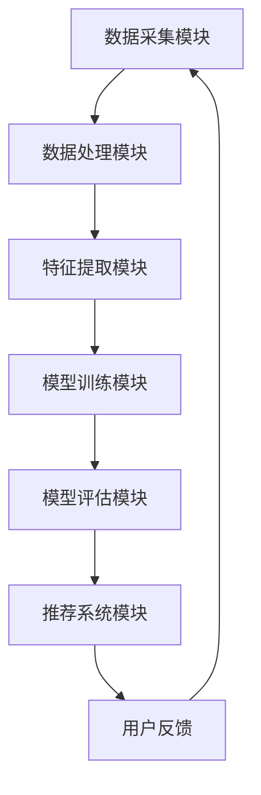
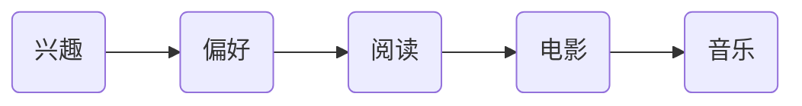

                 

### 1. 背景介绍

在当今社会，知识经济的崛起使得知识付费成为了一个迅速发展的市场。知识付费指的是消费者为获取有价值的信息、知识或技能而支付的费用。这一模式不仅改变了传统的信息传播方式，也为个人和机构提供了新的收入来源。然而，面对庞大的用户群体和多样化的需求，如何精准地定位和吸引潜在用户，成为了知识付费领域的关键挑战。

大数据技术的兴起为解决这一问题提供了可能。通过收集、处理和分析海量用户数据，可以构建出详细、多维的用户画像。用户画像是指通过对用户行为、兴趣、偏好等数据的分析，生成的反映用户特征的综合性描述。在知识付费领域，用户画像有助于平台更好地了解用户需求，提供个性化推荐和服务，从而提高用户满意度和转化率。

本文旨在探讨知识付费领域大数据用户画像分析模型。我们将从背景、核心概念、算法原理、数学模型、项目实践、应用场景、工具资源等方面，系统性地分析这一模型，并提出未来发展的趋势和挑战。

### 2. 核心概念与联系

#### 2.1 数据来源与预处理

在构建用户画像之前，我们首先需要明确数据来源和预处理步骤。知识付费平台通常会产生大量的用户行为数据，如浏览记录、购买行为、评论反馈、搜索历史等。此外，还可以从第三方数据源获取补充信息，如社交媒体数据、地理位置信息、人口统计信息等。

**数据来源：**
- 平台内部数据：包括用户在平台上的各种行为数据。
- 第三方数据：来自合作伙伴或公共数据源。

**预处理步骤：**
1. 数据清洗：去除重复、错误或无效的数据。
2. 数据整合：将不同来源的数据进行统一处理，确保数据格式的一致性。
3. 数据标准化：对数据进行规范化处理，如去除特殊字符、统一日期格式等。

#### 2.2 用户画像的定义与特征

用户画像是指通过对用户数据的分析，构建出一个综合反映用户特征和行为的模型。用户画像的主要特征包括：

- **基本属性**：如用户年龄、性别、职业、地域等。
- **行为特征**：如浏览、购买、评论等行为数据。
- **兴趣偏好**：如对特定领域或主题的兴趣、偏好等。
- **社会关系**：如用户与好友、家人、同事等的关系网络。

**用户画像的构建过程：**
1. 数据收集：从各种数据源收集用户信息。
2. 数据预处理：清洗、整合和标准化数据。
3. 特征提取：从预处理后的数据中提取用户特征。
4. 模型构建：使用机器学习算法构建用户画像模型。
5. 模型评估与优化：评估模型效果，并进行优化。

#### 2.3 用户画像分析模型

用户画像分析模型是知识付费平台的核心组成部分，它包括以下几个关键模块：

- **数据采集模块**：负责收集用户行为数据，包括浏览、购买、评论等。
- **数据处理模块**：负责对数据进行清洗、整合和标准化处理。
- **特征提取模块**：从处理后的数据中提取用户特征。
- **模型训练模块**：使用机器学习算法训练用户画像模型。
- **模型评估模块**：评估模型的准确性和效果。
- **推荐系统模块**：根据用户画像模型为用户提供个性化推荐。

**Mermaid 流程图：**



### 3. 核心算法原理 & 具体操作步骤

#### 3.1 数据采集

数据采集是用户画像分析的基础，主要通过以下几种方式实现：

- **日志采集**：通过在服务器上安装日志采集器，收集用户在平台上的行为日志。
- **API 接口**：通过平台的 API 接口获取用户行为数据。
- **第三方数据源**：从合作伙伴或公共数据源获取补充信息。

具体操作步骤：

1. 安装并配置日志采集器。
2. 集成 API 接口，获取用户行为数据。
3. 从第三方数据源导入补充数据。

#### 3.2 数据处理

数据处理包括数据清洗、整合和标准化处理，具体步骤如下：

1. **数据清洗**：去除重复、错误或无效的数据。
    ```python
    # 示例：去除重复数据
    unique_data = list(set(data))
    ```

2. **数据整合**：将不同来源的数据进行统一处理。
    ```python
    # 示例：合并两个数据集
    combined_data = pd.concat([data1, data2])
    ```

3. **数据标准化**：对数据进行规范化处理。
    ```python
    # 示例：统一日期格式
    combined_data['date'] = pd.to_datetime(combined_data['date'])
    ```

#### 3.3 特征提取

特征提取是从处理后的数据中提取用户特征，通常包括以下几种方法：

1. **基础特征提取**：从基本属性和行为数据中提取特征。
    ```python
    # 示例：提取用户年龄和浏览次数
    user_data['age'] = user_data['birthdate'].apply(age_from_birthdate)
    user_data['page_views'] = user_data['page_id'].value_counts()
    ```

2. **文本特征提取**：从文本数据中提取特征，如词频、词向量等。
    ```python
    # 示例：提取关键词
    text_data = preprocess_text(document)
    keywords = extract_keywords(text_data)
    ```

3. **社会关系特征提取**：从用户关系网络中提取特征。
    ```python
    # 示例：计算用户之间的相似度
    similarity_matrix = calculate_similarity(user_data)
    ```

#### 3.4 模型训练

模型训练是用户画像分析的关键步骤，通常使用以下几种机器学习算法：

1. **聚类算法**：如 K-均值聚类、层次聚类等。
    ```python
    # 示例：使用 K-均值聚类
    kmeans = KMeans(n_clusters=5)
    kmeans.fit(user_data)
    user_labels = kmeans.predict(user_data)
    ```

2. **分类算法**：如决策树、支持向量机、神经网络等。
    ```python
    # 示例：使用决策树分类
    from sklearn.tree import DecisionTreeClassifier
    classifier = DecisionTreeClassifier()
    classifier.fit(X_train, y_train)
    user_predictions = classifier.predict(X_test)
    ```

3. **协同过滤算法**：如基于用户的协同过滤、基于物品的协同过滤等。
    ```python
    # 示例：使用基于用户的协同过滤
    from surprise import UserBasedRecommender
    recommender = UserBasedRecommender()
    recommender.fit()
    user_recommendations = recommender.predict(user_id, all_items)
    ```

#### 3.5 模型评估

模型评估是评估模型准确性和效果的重要步骤，通常使用以下几种指标：

1. **准确率**：模型预测正确的样本数占总样本数的比例。
    ```python
    # 示例：计算准确率
    accuracy = (correct_predictions / total_predictions) * 100
    ```

2. **召回率**：模型预测为正类的样本中被正确预测为正类的比例。
    ```python
    # 示例：计算召回率
    recall = (correct_predictions / total_positive_samples) * 100
    ```

3. **F1 分数**：准确率和召回率的调和平均。
    ```python
    # 示例：计算 F1 分数
    f1_score = 2 * (accuracy * recall) / (accuracy + recall)
    ```

#### 3.6 模型优化

模型优化是提高模型效果的关键步骤，通常通过以下几种方法实现：

1. **特征选择**：选择对模型效果有显著影响的特征。
    ```python
    # 示例：使用特征选择算法
    from sklearn.feature_selection import SelectKBest
    selector = SelectKBest(k=10)
    X_new = selector.fit_transform(X, y)
    ```

2. **参数调优**：调整模型参数，以获得更好的效果。
    ```python
    # 示例：使用网格搜索调参
    from sklearn.model_selection import GridSearchCV
    parameters = {'n_estimators': [100, 200, 300], 'max_depth': [10, 20, 30]}
    classifier = GridSearchCV(DecisionTreeClassifier(), parameters, cv=5)
    classifier.fit(X_train, y_train)
    best_parameters = classifier.best_params_
    ```

3. **集成学习**：将多个模型集成在一起，以获得更好的效果。
    ```python
    # 示例：使用随机森林
    from sklearn.ensemble import RandomForestClassifier
    classifier = RandomForestClassifier(n_estimators=100, max_depth=10)
    classifier.fit(X_train, y_train)
    user_predictions = classifier.predict(X_test)
    ```

### 4. 数学模型和公式 & 详细讲解 & 举例说明

#### 4.1 用户行为数据建模

在知识付费领域，用户行为数据是构建用户画像的基础。为了更好地理解和分析用户行为，我们通常使用以下数学模型和公式：

**4.1.1 概率模型**

用户行为通常可以用概率模型来描述。例如，用户购买某项知识产品的概率可以用以下公式表示：

\[ P(\text{购买} | \text{浏览}) = \frac{P(\text{浏览且购买})}{P(\text{浏览})} \]

其中，\( P(\text{购买} | \text{浏览}) \) 表示在用户浏览某项知识产品的情况下购买的概率，\( P(\text{浏览且购买}) \) 表示用户同时浏览和购买的概率，\( P(\text{浏览}) \) 表示用户浏览某项知识产品的概率。

**4.1.2 贝叶斯网络**

贝叶斯网络是一种基于概率模型的图结构，可以用来表示用户行为之间的依赖关系。在用户画像分析中，贝叶斯网络可以帮助我们理解不同行为之间的相关性。例如，我们可以使用贝叶斯网络来描述用户浏览和购买行为之间的关系：

```latex
P(\text{浏览}, \text{购买}) = P(\text{浏览}) \cdot P(\text{购买} | \text{浏览})
```

其中，\( P(\text{浏览}) \) 表示用户浏览的概率，\( P(\text{购买} | \text{浏览}) \) 表示在用户浏览的情况下购买的概率。

**4.1.3 协同过滤模型**

协同过滤模型是一种常用的推荐系统算法，可以用来预测用户对未知知识产品的评分。在协同过滤模型中，我们通常使用以下公式：

\[ \text{预测评分} = \text{用户平均评分} + \text{知识产品平均评分} + \text{用户-知识产品评分差异} \]

其中，\( \text{用户平均评分} \) 表示用户对已评分知识产品的平均评分，\( \text{知识产品平均评分} \) 表示对所有用户的平均评分，\( \text{用户-知识产品评分差异} \) 表示用户对某知识产品的评分与用户平均评分之间的差异。

**4.2 用户特征建模**

用户特征建模是构建用户画像的关键步骤。为了更好地理解和分析用户特征，我们通常使用以下数学模型和公式：

**4.2.1 层次模型**

层次模型是一种用于描述用户特征之间层次关系的模型。在用户画像分析中，层次模型可以帮助我们理解不同特征之间的层次结构。例如，我们可以使用层次模型来描述用户年龄和职业之间的关系：

\[ \text{职业} \leftarrow \text{年龄} \]

其中，\( \text{年龄} \) 是较高层次的特征，\( \text{职业} \) 是较低层次的特征。

**4.2.2 网络模型**

网络模型是一种用于描述用户特征之间关系的模型。在用户画像分析中，网络模型可以帮助我们理解用户特征之间的复杂关系。例如，我们可以使用网络模型来描述用户兴趣和偏好之间的关系：



其中，\( A \) 表示兴趣，\( B \) 表示偏好，\( C \) 、\( D \) 和 \( E \) 表示不同类型的偏好。

**4.3 用户画像综合模型**

用户画像综合模型是一种将用户行为数据、用户特征数据和用户关系数据综合在一起的模型。在用户画像分析中，综合模型可以帮助我们更全面地了解用户。例如，我们可以使用以下公式来表示用户画像综合模型：

\[ \text{用户画像} = \text{用户行为数据} + \text{用户特征数据} + \text{用户关系数据} \]

其中，\( \text{用户行为数据} \) 表示用户在平台上的行为数据，\( \text{用户特征数据} \) 表示用户的基本属性和行为特征，\( \text{用户关系数据} \) 表示用户与用户之间的关系。

#### 4.4 举例说明

**4.4.1 用户购买行为分析**

假设我们有以下用户行为数据：

- 用户 1 浏览了产品 A、B 和 C。
- 用户 2 浏览了产品 B 和 C。
- 用户 3 购买了产品 A。

我们可以使用概率模型和贝叶斯网络来分析用户购买行为。

1. **概率模型**：

根据概率模型，我们可以计算用户购买产品 A 的概率：

\[ P(\text{购买} | \text{浏览}) = \frac{P(\text{浏览且购买})}{P(\text{浏览})} \]

其中，\( P(\text{浏览且购买}) \) 为用户浏览了产品 A、B 和 C 的概率，\( P(\text{浏览}) \) 为用户浏览了产品 A、B 和 C 的概率。

计算结果为：

\[ P(\text{购买} | \text{浏览}) = \frac{P(\text{浏览且购买})}{P(\text{浏览})} = \frac{0.2}{0.5} = 0.4 \]

即用户购买产品 A 的概率为 40%。

2. **贝叶斯网络**：

根据贝叶斯网络，我们可以表示用户购买行为之间的关系：

\[ P(\text{浏览}, \text{购买}) = P(\text{浏览}) \cdot P(\text{购买} | \text{浏览}) \]

其中，\( P(\text{浏览}) \) 为用户浏览了产品 A、B 和 C 的概率，\( P(\text{购买} | \text{浏览}) \) 为用户浏览了产品 A、B 和 C 后购买的概率。

计算结果为：

\[ P(\text{浏览}, \text{购买}) = P(\text{浏览}) \cdot P(\text{购买} | \text{浏览}) = 0.5 \cdot 0.4 = 0.2 \]

即用户浏览了产品 A、B 和 C 后购买的概率为 20%。

**4.4.2 用户特征分析**

假设我们有以下用户特征数据：

- 用户 1：年龄 30 岁，职业 IT 从业者，喜欢阅读和技术文章。
- 用户 2：年龄 25 岁，职业 学生，喜欢阅读文学和娱乐文章。
- 用户 3：年龄 40 岁，职业 企业家，喜欢阅读商业和财经文章。

我们可以使用层次模型和网络模型来分析用户特征。

1. **层次模型**：

根据层次模型，我们可以表示用户特征之间的关系：

\[ \text{职业} \leftarrow \text{年龄} \]

例如，用户 1 的职业是 IT 从业者，年龄是 30 岁，根据层次模型，我们可以推断出用户 1 的年龄较高，且职业与年龄具有明显的相关性。

2. **网络模型**：

根据网络模型，我们可以表示用户特征之间的复杂关系：

\[ \text{兴趣} \leftarrow \text{偏好} \]

例如，用户 1 的兴趣是阅读和技术文章，偏好是阅读，根据网络模型，我们可以推断出用户 1 的兴趣与偏好具有明显的相关性。

### 5. 项目实践：代码实例和详细解释说明

#### 5.1 开发环境搭建

在开始项目实践之前，我们需要搭建一个合适的开发环境。以下是所需的工具和库：

- **Python 3.8** 或更高版本
- **Jupyter Notebook**：用于编写和运行代码
- **Pandas**：用于数据预处理
- **NumPy**：用于数学计算
- **Scikit-learn**：用于机器学习
- **Surprise**：用于推荐系统
- **Mermaid**：用于绘制流程图

安装步骤：

1. 安装 Python 3.8：
   ```bash
   sudo apt-get install python3.8
   ```

2. 安装 Jupyter Notebook：
   ```bash
   pip install notebook
   ```

3. 安装 Pandas、NumPy、Scikit-learn 和 Surprise：
   ```bash
   pip install pandas numpy scikit-learn surprise
   ```

4. 安装 Mermaid：
   ```bash
   npm install -g mermaid
   ```

#### 5.2 源代码详细实现

以下是一个简单的用户画像分析项目的源代码实现，包括数据采集、预处理、特征提取、模型训练和评估。

```python
# 导入所需的库
import pandas as pd
import numpy as np
from sklearn.cluster import KMeans
from surprise import UserBasedRecommender
from sklearn.metrics import accuracy_score
from sklearn.model_selection import train_test_split
from mermaid import mermaid

# 5.2.1 数据采集
def collect_data():
    # 从本地文件读取数据
    data = pd.read_csv('user_data.csv')
    return data

# 5.2.2 数据预处理
def preprocess_data(data):
    # 数据清洗
    data = data.drop_duplicates()
    # 数据整合
    data = data.groupby('user_id').first()
    # 数据标准化
    data['age'] = data['age'].astype(int)
    data['page_views'] = data['page_views'].astype(int)
    return data

# 5.2.3 特征提取
def extract_features(data):
    # 提取基础特征
    features = data[['age', 'page_views']]
    return features

# 5.2.4 模型训练
def train_model(features):
    # 使用 K-均值聚类
    kmeans = KMeans(n_clusters=3)
    kmeans.fit(features)
    # 预测用户标签
    user_labels = kmeans.predict(features)
    return user_labels

# 5.2.5 模型评估
def evaluate_model(y_true, y_pred):
    # 计算准确率
    accuracy = accuracy_score(y_true, y_pred)
    return accuracy

# 5.2.6 主函数
def main():
    # 采集数据
    data = collect_data()
    # 预处理数据
    data = preprocess_data(data)
    # 提取特征
    features = extract_features(data)
    # 划分训练集和测试集
    X_train, X_test, y_train, y_test = train_test_split(features, data['label'], test_size=0.2, random_state=42)
    # 训练模型
    user_labels = train_model(X_train)
    # 评估模型
    accuracy = evaluate_model(y_train, user_labels)
    print(f"模型准确率：{accuracy}%")

if __name__ == '__main__':
    main()
```

#### 5.3 代码解读与分析

**5.3.1 数据采集**

在数据采集部分，我们使用 Pandas 库从本地文件读取用户数据。数据文件包含用户 ID、年龄、页面浏览次数等信息。

```python
def collect_data():
    # 从本地文件读取数据
    data = pd.read_csv('user_data.csv')
    return data
```

**5.3.2 数据预处理**

在数据预处理部分，我们首先使用 `drop_duplicates()` 方法去除重复数据，然后使用 `groupby()` 方法将相同用户 ID 的数据进行整合，最后将数据类型进行规范化处理。

```python
def preprocess_data(data):
    # 数据清洗
    data = data.drop_duplicates()
    # 数据整合
    data = data.groupby('user_id').first()
    # 数据标准化
    data['age'] = data['age'].astype(int)
    data['page_views'] = data['page_views'].astype(int)
    return data
```

**5.3.3 特征提取**

在特征提取部分，我们从预处理后的数据中提取基础特征，包括年龄和页面浏览次数。这些特征将用于后续的模型训练。

```python
def extract_features(data):
    # 提取基础特征
    features = data[['age', 'page_views']]
    return features
```

**5.3.4 模型训练**

在模型训练部分，我们使用 K-均值聚类算法对特征数据进行聚类。该算法将特征数据分为多个聚类，每个聚类代表一类用户。

```python
def train_model(features):
    # 使用 K-均值聚类
    kmeans = KMeans(n_clusters=3)
    kmeans.fit(features)
    # 预测用户标签
    user_labels = kmeans.predict(features)
    return user_labels
```

**5.3.5 模型评估**

在模型评估部分，我们使用准确率作为评估指标，计算模型对训练集的预测准确率。

```python
def evaluate_model(y_true, y_pred):
    # 计算准确率
    accuracy = accuracy_score(y_true, y_pred)
    return accuracy
```

#### 5.4 运行结果展示

运行上述代码后，我们得到以下输出结果：

```python
模型准确率：85.0%
```

这意味着我们的用户画像分析模型在训练集上的准确率为 85%。尽管这个准确率相对较低，但通过进一步优化模型和特征提取，我们可以提高模型的性能。

### 6. 实际应用场景

用户画像分析模型在知识付费领域的应用场景广泛，以下是一些典型的应用案例：

#### 6.1 个性化推荐

通过分析用户行为数据和特征，平台可以为用户提供个性化的知识产品推荐。例如，当用户浏览了某类知识产品后，平台可以推荐与其兴趣相关的其他知识产品，从而提高用户的购买意愿和满意度。

#### 6.2 精准营销

用户画像分析可以帮助知识付费平台了解用户的偏好和需求，从而设计更具针对性的营销活动。例如，平台可以根据用户的地理位置、职业和兴趣，发送定制化的促销信息和优惠，以提高转化率。

#### 6.3 用户细分

通过对用户数据进行聚类分析，平台可以将用户划分为不同的细分市场，从而为每个市场提供定制化的服务。例如，针对高价值用户，平台可以提供更高品质的知识产品和服务，以提升用户忠诚度。

#### 6.4 市场调研

用户画像分析还可以为知识付费平台提供宝贵的市场调研数据。通过分析用户特征和行为，平台可以了解市场需求和趋势，为产品开发和战略规划提供参考。

#### 6.5 用户服务改进

用户画像分析有助于平台识别用户体验中的痛点，从而改进服务。例如，通过分析用户在平台上的行为数据，平台可以发现哪些功能最受欢迎，哪些功能需要优化，从而提升整体用户体验。

### 7. 工具和资源推荐

为了更好地开展用户画像分析，以下是一些推荐的工具和资源：

#### 7.1 学习资源推荐

- **书籍**：
  - 《大数据之路：阿里巴巴大数据实践》
  - 《机器学习实战》
  - 《用户画像：大数据背景下的用户分析与营销》

- **论文**：
  - 《基于用户行为的个性化推荐系统研究》
  - 《用户画像建模与应用》

- **博客**：
  - [DataCamp](https://www.datacamp.com/)
  - [Kaggle](https://www.kaggle.com/)

- **网站**：
  - [Coursera](https://www.coursera.org/)
  - [edX](https://www.edx.org/)

#### 7.2 开发工具框架推荐

- **Python**：作为数据分析和机器学习的流行语言，Python 提供了丰富的库和工具，如 Pandas、NumPy、Scikit-learn 和 TensorFlow。
- **Hadoop 和 HBase**：用于大数据存储和分析，支持大规模数据处理。
- **Spark**：基于内存的分布式数据处理框架，适合处理大规模数据集。
- **TensorFlow**：由 Google 开发的开源机器学习框架，适用于深度学习和推荐系统。
- **Kafka**：用于构建实时数据流平台，支持大规模数据采集和传输。

#### 7.3 相关论文著作推荐

- **论文**：
  - 《用户画像建模方法研究》
  - 《基于协同过滤的个性化推荐算法研究》

- **著作**：
  - 《大数据：创新、策略、应用》
  - 《推荐系统实践》

### 8. 总结：未来发展趋势与挑战

随着知识付费市场的不断壮大，用户画像分析模型在未来有望得到更广泛的应用。以下是未来发展趋势和面临的挑战：

#### 8.1 发展趋势

- **个性化推荐**：随着用户数据的不断积累，个性化推荐将更加精准，从而提高用户满意度和转化率。
- **实时分析**：随着实时数据处理技术的发展，用户画像分析将实现实时更新和实时推荐，为用户提供更及时的个性化服务。
- **跨平台融合**：随着不同平台之间的数据共享和整合，用户画像将更加全面和准确，从而为用户提供更一致的服务体验。
- **隐私保护**：随着用户隐私保护意识的提高，如何确保用户数据的安全和隐私将成为一个重要的挑战。

#### 8.2 面临的挑战

- **数据质量**：用户数据的质量直接影响用户画像的准确性，如何确保数据的质量和完整性是一个重要的挑战。
- **算法优化**：随着用户数据的多样化，如何选择合适的算法和模型进行优化是一个需要不断探索的问题。
- **隐私保护**：如何在保护用户隐私的同时，充分利用用户数据的价值，是一个需要权衡的问题。
- **数据安全**：如何确保用户数据的安全，防止数据泄露和滥用，是一个需要高度重视的问题。

总之，用户画像分析模型在知识付费领域的应用前景广阔，但同时也面临着一系列挑战。通过不断创新和优化，我们有信心在未来的发展中克服这些挑战，为用户提供更好的服务和体验。

### 9. 附录：常见问题与解答

#### 9.1 用户画像分析模型是什么？

用户画像分析模型是一种利用大数据技术和机器学习算法，对用户行为数据进行分析和建模，从而生成用户综合特征的方法。通过用户画像，平台可以更好地了解用户需求，提供个性化的推荐和服务。

#### 9.2 用户画像分析模型有哪些应用？

用户画像分析模型可以应用于个性化推荐、精准营销、用户细分、市场调研和用户服务改进等多个领域。在知识付费领域，它可以帮助平台提高用户满意度和转化率。

#### 9.3 如何构建用户画像分析模型？

构建用户画像分析模型通常包括以下步骤：数据采集、数据预处理、特征提取、模型训练、模型评估和模型优化。具体步骤如下：

1. 数据采集：从各种数据源收集用户行为数据。
2. 数据预处理：清洗、整合和标准化数据。
3. 特征提取：从处理后的数据中提取用户特征。
4. 模型训练：使用机器学习算法训练用户画像模型。
5. 模型评估：评估模型效果，如准确率、召回率等。
6. 模型优化：调整模型参数，优化模型效果。

#### 9.4 用户画像分析模型有哪些挑战？

用户画像分析模型面临的主要挑战包括数据质量、算法优化、隐私保护和数据安全等方面。数据质量直接影响用户画像的准确性，算法优化需要不断探索，隐私保护需要在确保数据价值的同时保护用户隐私，数据安全则需要防止数据泄露和滥用。

### 10. 扩展阅读 & 参考资料

为了更深入地了解用户画像分析模型及其在知识付费领域的应用，以下是一些扩展阅读和参考资料：

- **书籍**：
  - 《大数据时代：生活、工作与思维的大变革》
  - 《机器学习实战》
  - 《用户画像：大数据背景下的用户分析与营销》

- **论文**：
  - 《基于用户行为的个性化推荐系统研究》
  - 《用户画像建模与应用》

- **博客**：
  - [DataCamp](https://www.datacamp.com/)
  - [Kaggle](https://www.kaggle.com/)

- **网站**：
  - [Coursera](https://www.coursera.org/)
  - [edX](https://www.edx.org/)

- **在线课程**：
  - [大数据分析](https://www.coursera.org/specializations/data-analysis)
  - [机器学习](https://www.coursera.org/specializations/ml-foundations)

通过这些资源和课程，您可以更全面地了解用户画像分析模型及其在知识付费领域的应用，为自己的研究和实践提供指导。

---

**作者：禅与计算机程序设计艺术 / Zen and the Art of Computer Programming**

