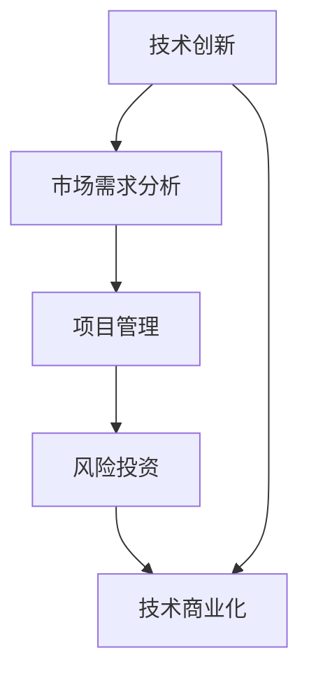

                 

### 知识经济下程序员的创业思路

#### 关键词
- 知识经济
- 程序员
- 创业
- 技术创新
- 项目管理
- 风险投资
- 市场分析
- 产品开发
- 技术商业化

#### 摘要
本文旨在探讨知识经济时代下，程序员如何运用自身的专业技能和创新能力，进行创业实践。文章首先回顾了知识经济的兴起及其对程序员职业发展的影响，随后分析了程序员创业的优势与挑战。通过结合实际案例，本文提出了程序员创业的可行思路和关键成功因素，包括技术创新、市场需求分析、项目管理以及风险投资等方面的内容。最后，文章总结了程序员在知识经济背景下创业的未来发展趋势与机遇，并提出了相应的策略建议。

## 1. 背景介绍

知识经济是指以知识为基础，通过知识的生产、分配和使用来推动经济增长的一种经济形态。与传统经济模式相比，知识经济具有以下几个显著特点：

1. **知识的生产和传播**：知识经济强调知识的创新和传播，通过不断研发新技术、新产品和新服务，推动经济的高质量发展。
2. **信息技术的发展**：信息技术是知识经济的核心支撑，互联网、大数据、云计算等新兴技术正在深刻改变传统的生产、流通和消费方式。
3. **人力资源的重要性**：知识经济时代，人才成为企业最宝贵的资源，特别是具备创新能力的高素质程序员。
4. **全球化**：知识经济促进了全球范围内的知识交流和合作，跨国企业间的竞争日益激烈。

程序员作为知识经济时代的重要职业群体，其角色和职责也在不断演变。过去，程序员主要从事软件开发和维护工作，而现在，他们更多地参与技术创新、项目管理和产品开发等核心业务。随着技术的不断进步和市场的变化，程序员的创业机会也在不断增加。

### 1.1 程序员创业的优势

程序员在创业过程中具有以下几方面的优势：

1. **技能和经验**：程序员具备扎实的编程技能和项目经验，这是创业项目成功的关键因素。
2. **技术敏感性**：程序员对新兴技术和市场动态有较强的敏感度，能够快速把握行业趋势。
3. **创新能力**：程序员善于创新，能够将新技术应用于产品开发，提供独特的解决方案。
4. **团队协作**：程序员通常具备良好的团队协作能力，这对于创业团队的建设至关重要。

### 1.2 程序员创业的挑战

尽管程序员在创业方面具有诸多优势，但他们也面临着一系列挑战：

1. **资金压力**：创业初期，程序员通常需要投入大量资金用于研发、市场推广和团队建设。
2. **项目管理**：程序员需要承担项目管理职责，这对于很多初创业者来说是一个全新的挑战。
3. **市场不确定性**：市场需求变化迅速，程序员需要具备快速应对市场变化的能力。
4. **法律和法规**：创业过程中，程序员需要遵守各种法律法规，特别是在知识产权保护方面。

## 2. 核心概念与联系

在知识经济下，程序员创业需要理解一系列核心概念和它们之间的相互联系。以下是这些核心概念及其在创业中的重要性：

### 2.1 技术创新

技术创新是程序员创业的核心驱动力。技术创新包括但不限于以下几个方面：

1. **新兴技术掌握**：程序员需要不断学习新兴技术，如人工智能、区块链、物联网等，并将其应用于创业项目中。
2. **技术集成**：将多种技术集成到产品中，提供综合解决方案。
3. **定制化开发**：根据客户需求，定制开发特定功能和技术解决方案。

### 2.2 市场需求分析

市场需求分析是程序员创业的重要环节。通过市场需求分析，程序员可以：

1. **识别机会**：发现市场中的潜在需求和机会。
2. **产品定位**：明确产品在市场中的定位和目标用户群体。
3. **竞争分析**：了解竞争对手的产品和策略，制定差异化竞争策略。

### 2.3 项目管理

项目管理是确保创业项目顺利推进的关键。程序员在项目管理中需要：

1. **制定计划**：明确项目目标、时间和资源分配。
2. **团队协作**：有效协调团队成员的工作，确保项目按时完成。
3. **风险控制**：识别和管理项目风险，确保项目顺利进行。

### 2.4 风险投资

风险投资是程序员创业的重要资金来源。程序员需要：

1. **编写商业计划书**：清晰展示项目愿景、市场需求、竞争优势和财务预测。
2. **寻找投资人**：通过多种渠道寻找合适的投资人，包括风险投资机构、天使投资人等。
3. **谈判与融资**：与投资人进行谈判，争取获得最优的投资条件和资金支持。

### 2.5 技术商业化

技术商业化是将技术创新转化为商业价值的过程。程序员在技术商业化中需要：

1. **市场推广**：制定有效的市场推广策略，提高产品的市场知名度。
2. **知识产权保护**：申请专利、商标等知识产权，保护公司的核心技术和产品。
3. **商业模式创新**：探索创新的商业模式，实现技术价值的最大化。

### 2.6 Mermaid 流程图

以下是一个简化的Mermaid流程图，展示程序员创业的主要环节和核心概念之间的联系：



## 3. 核心算法原理 & 具体操作步骤

### 3.1 核心算法原理

在程序员创业过程中，核心算法原理至关重要。以下是一些常见且重要的算法原理及其在创业中的应用：

#### 3.1.1 机器学习算法

**机器学习算法**是利用计算机模拟人类学习过程的算法，包括监督学习、无监督学习和强化学习等。在创业中，机器学习算法可用于：

1. **数据挖掘**：从大量数据中提取有价值的信息。
2. **预测分析**：基于历史数据预测未来趋势。
3. **推荐系统**：根据用户行为和偏好提供个性化推荐。

#### 3.1.2 算法优化

**算法优化**是提高程序运行效率和性能的关键。常见的算法优化方法包括：

1. **时间复杂度优化**：减少算法的时间复杂度，提高处理速度。
2. **空间复杂度优化**：减少算法的空间复杂度，节省内存资源。
3. **并行计算**：利用多核处理器和分布式计算，提高计算效率。

#### 3.1.3 加密算法

**加密算法**是确保数据安全的重要手段，包括对称加密和非对称加密等。在创业项目中，加密算法可用于：

1. **数据传输安全**：确保数据在传输过程中的安全性。
2. **身份认证**：通过加密算法验证用户身份。
3. **数字签名**：确保数据完整性和不可否认性。

### 3.2 具体操作步骤

以下是一个简化的创业项目开发流程，展示如何将核心算法原理应用于实际操作：

#### 3.2.1 需求分析

1. **收集需求**：通过与潜在客户沟通，收集产品需求。
2. **分析需求**：对收集到的需求进行分类和优先级排序。

#### 3.2.2 技术选型

1. **确定技术方向**：根据需求分析结果，选择合适的技术方向。
2. **评估技术方案**：评估各种技术方案的优缺点，选择最佳方案。

#### 3.2.3 算法设计

1. **算法框架设计**：根据技术选型结果，设计算法框架。
2. **算法实现**：编写算法代码，并进行调试和优化。

#### 3.2.4 项目开发

1. **需求文档编写**：根据需求分析结果，编写详细的需求文档。
2. **代码开发**：按照需求文档进行代码开发。
3. **测试与调试**：对开发出的代码进行测试和调试，确保其正确性和性能。

#### 3.2.5 产品发布

1. **发布前准备**：完成产品功能开发和测试，准备好发布文档。
2. **发布产品**：将产品发布到市场，进行推广和运营。

## 4. 数学模型和公式 & 详细讲解 & 举例说明

### 4.1 数学模型和公式

在程序员创业过程中，数学模型和公式可以帮助分析和解决实际问题。以下是一些常见的数学模型和公式：

#### 4.1.1 投资回报率（ROI）

投资回报率是评估投资项目收益的重要指标，计算公式如下：

$$
ROI = \frac{（收入 - 成本）}{成本} \times 100\%
$$

其中，收入为项目运营期间的总收入，成本为项目的总投入。

#### 4.1.2 顾客终身价值（CLV）

顾客终身价值是预测客户为企业带来的总收益，计算公式如下：

$$
CLV = （\text{平均订单价值} \times \text{购买频率} \times \text{顾客生命周期）} - （\text{获取成本} + \text{运营成本}）
$$

其中，平均订单价值为每个订单的平均金额，购买频率为顾客的平均购买频率，顾客生命周期为顾客从首次购买到不再购买的时间段。

#### 4.1.3 线性回归模型

线性回归模型是一种常用的数据分析方法，用于预测因变量与自变量之间的线性关系。其公式如下：

$$
y = \beta_0 + \beta_1 \cdot x
$$

其中，$y$ 为因变量，$x$ 为自变量，$\beta_0$ 为截距，$\beta_1$ 为斜率。

### 4.2 详细讲解 & 举例说明

#### 4.2.1 投资回报率（ROI）讲解

投资回报率（ROI）是衡量投资项目收益的重要指标，能够帮助企业评估投资的可行性。以下是一个具体的例子：

假设一家初创公司投入 100 万元用于研发新产品，预计运营 3 年。产品成功后，预计每年收入 200 万元，成本为 100 万元。则该项目的 ROI 计算如下：

$$
ROI = \frac{（200 \times 3 - 100）}{100} \times 100\% = 300\%
$$

这意味着该投资在 3 年内实现了 3 倍的收益，具有较高的投资回报率。

#### 4.2.2 顾客终身价值（CLV）讲解

顾客终身价值（CLV）是预测客户为企业带来的总收益，帮助企业制定营销策略。以下是一个具体的例子：

假设一家电商平台，每个订单的平均价值为 100 元，顾客平均购买频率为每月一次，顾客生命周期为 2 年。则该平台的 CLV 计算如下：

$$
CLV = （100 \times 1 \times 2） - （10 + 5）= 180 \text{ 元}
$$

这意味着一个顾客在 2 年内预计为企业带来 180 元的收益，这对于企业制定针对高价值客户的营销策略具有重要参考价值。

#### 4.2.3 线性回归模型讲解

线性回归模型是一种常用的数据分析方法，用于预测因变量与自变量之间的线性关系。以下是一个具体的例子：

假设一家电商公司通过分析用户购买行为，发现用户年龄（$x$）与购买金额（$y$）之间存在线性关系。通过对历史数据进行回归分析，得出以下模型：

$$
y = 100 + 20 \cdot x
$$

其中，$y$ 为购买金额，$x$ 为用户年龄。根据这个模型，可以预测一个 30 岁用户的购买金额为：

$$
y = 100 + 20 \cdot 30 = 700 \text{ 元}
$$

这意味着，根据用户年龄，公司可以预测其购买金额，从而制定个性化的营销策略。

## 5. 项目实践：代码实例和详细解释说明

### 5.1 开发环境搭建

在开始一个编程项目之前，搭建合适的开发环境是非常重要的。以下是一个基于Python的Web应用程序开发环境的搭建步骤：

#### 5.1.1 安装Python

1. 访问Python官方网站（https://www.python.org/）下载最新版本的Python安装包。
2. 双击安装程序，按照提示完成安装。

#### 5.1.2 安装PyCharm

1. 访问PyCharm官方网站（https://www.jetbrains.com/pycharm/）下载社区版安装包。
2. 双击安装程序，按照提示完成安装。

#### 5.1.3 安装相关库

在PyCharm中，可以通过`pip`工具安装所需的库。以下是一个安装Flask框架的示例：

1. 打开PyCharm，创建一个新的Python项目。
2. 在终端中执行以下命令：

```bash
pip install flask
```

### 5.2 源代码详细实现

以下是一个简单的Flask Web应用程序的源代码示例，用于处理HTTP请求并返回响应：

```python
from flask import Flask, request, jsonify

app = Flask(__name__)

@app.route('/', methods=['GET'])
def hello():
    return "Hello, World!"

@app.route('/api/data', methods=['POST'])
def receive_data():
    data = request.get_json()
    print("Received data:", data)
    return jsonify({"status": "success", "data": data})

if __name__ == '__main__':
    app.run(debug=True)
```

#### 5.2.1 功能说明

- `hello()`函数：处理根路径（'/'）的GET请求，返回"Hello, World!"字符串。
- `receive_data()`函数：处理`/api/data`路径的POST请求，接收JSON格式的数据，并将其打印到控制台。然后，返回一个包含状态信息和接收到的数据的JSON响应。

### 5.3 代码解读与分析

#### 5.3.1 Flask应用概述

Flask是一个轻量级的Web框架，用于构建Web应用程序和后端API。它提供了路由、模板和数据库接口等功能。

#### 5.3.2 HTTP请求处理

- `@app.route('/')`：装饰器用于定义处理特定URL路径的函数。在这个例子中，`hello()`函数处理根路径的GET请求。
- `@app.route('/api/data', methods=['POST'])`：装饰器用于定义处理特定URL路径和HTTP方法的函数。在这个例子中，`receive_data()`函数处理`/api/data`路径的POST请求。

#### 5.3.3 JSON数据处理

- `request.get_json()`：该方法从请求对象中获取JSON格式的数据，并将其解析为Python字典。
- `jsonify()`：该方法将Python对象转换为JSON格式的响应。

### 5.4 运行结果展示

1. 启动Web应用程序：

```bash
python app.py
```

2. 访问`http://localhost:5000/`，浏览器显示"Hello, World!"。

3. 使用Postman或curl发送一个POST请求到`http://localhost:5000/api/data`，包含以下JSON数据：

```json
{
    "name": "John Doe",
    "age": 30
}
```

4. 返回的JSON响应：

```json
{
    "status": "success",
    "data": {
        "name": "John Doe",
        "age": 30
    }
}
```

### 5.5 问题与解答

#### 问题 1：如何处理错误的HTTP请求？

解答：在`receive_data()`函数中，可以添加错误处理逻辑，例如：

```python
@app.route('/api/data', methods=['POST'])
def receive_data():
    try:
        data = request.get_json()
        if not data:
            return jsonify({"status": "error", "message": "Invalid JSON data"}), 400
        print("Received data:", data)
        return jsonify({"status": "success", "data": data})
    except Exception as e:
        return jsonify({"status": "error", "message": str(e)}), 500
```

#### 问题 2：如何配置数据库连接？

解答：在Flask中，可以使用SQLAlchemy库来配置数据库连接。以下是一个示例：

```python
from flask_sqlalchemy import SQLAlchemy

app = Flask(__name__)
app.config['SQLALCHEMY_DATABASE_URI'] = 'sqlite:///mydatabase.db'
db = SQLAlchemy(app)

class User(db.Model):
    id = db.Column(db.Integer, primary_key=True)
    name = db.Column(db.String(50))
    age = db.Column(db.Integer)
```

## 6. 实际应用场景

程序员在知识经济下创业的实际应用场景非常广泛，以下是一些典型的应用领域：

### 6.1 人工智能与大数据

**人工智能**和**大数据**技术为程序员提供了丰富的创业机会。例如，开发基于深度学习的图像识别系统、自然语言处理平台或智能推荐系统，帮助企业实现智能化运营和个性化服务。

**应用实例**：某公司开发了一款智能客服系统，通过深度学习和自然语言处理技术，为用户提供实时、精准的在线服务。该系统在上线后，显著提高了客户满意度和运营效率，为公司带来了可观的商业价值。

### 6.2 区块链技术

**区块链**技术具有去中心化、透明和不可篡改的特点，为程序员创业提供了新的方向。例如，开发基于区块链的供应链管理平台、数字货币交易系统或去中心化应用（DApps）。

**应用实例**：某公司利用区块链技术打造了一个去中心化的供应链管理平台，通过智能合约实现供应链环节的透明化和数据共享。该平台在帮助客户降低成本、提高效率的同时，也提升了企业的核心竞争力。

### 6.3 物联网（IoT）

**物联网**技术将物理设备和互联网连接起来，为程序员提供了丰富的创新空间。例如，开发智能家居控制系统、智能农业管理系统或智能交通系统。

**应用实例**：某公司开发了一款智能农业管理系统，通过物联网技术和大数据分析，帮助农民实时监控作物生长情况，优化灌溉和施肥策略。该系统在提高农业生产效率的同时，也为公司带来了稳定的客户群体和商业收入。

### 6.4 云计算与大数据分析

**云计算**和**大数据分析**技术为程序员提供了强大的计算能力和数据支持，使得创业者能够快速搭建高效、可扩展的应用系统。例如，开发基于云计算的云存储服务、数据分析平台或云计算服务提供商。

**应用实例**：某公司开发了一款云存储服务，通过分布式存储技术和大数据分析，为客户提供安全、高效、可扩展的数据存储解决方案。该服务在上线后，受到了广大用户的欢迎，为公司带来了持续的增长动力。

## 7. 工具和资源推荐

### 7.1 学习资源推荐

**书籍**：
1. 《深度学习》（Deep Learning） - Goodfellow, I., Bengio, Y., & Courville, A.
2. 《编程珠玑》（The Art of Computer Programming） - Knuth, D. E.
3. 《区块链：从数字货币到智能合约》 - 安德烈亚斯·安东诺普洛斯（Andreas M. Antonopoulos）

**论文**：
1. "A Learning Algorithm for Continually Running Fully Recurrent Neural Networks" - Williams, R. J.
2. "Bitcoin: A Peer-to-Peer Electronic Cash System" - Satoshi Nakamoto

**博客**：
1. Medium（https://medium.com/）
2. HackerRank（https://www.hackerrank.com/）
3. A List Apart（https://alistapart.com/）

**网站**：
1. Python官方网站（https://www.python.org/）
2. Flask官方文档（https://flask.palletsprojects.com/）
3. TensorFlow官方网站（https://www.tensorflow.org/）

### 7.2 开发工具框架推荐

**开发工具**：
1. PyCharm（https://www.jetbrains.com/pycharm/）
2. Visual Studio Code（https://code.visualstudio.com/）
3. Postman（https://www.postman.com/）

**框架**：
1. Flask（https://flask.palletsprojects.com/）
2. Django（https://www.djangoproject.com/）
3. React（https://reactjs.org/）

### 7.3 相关论文著作推荐

**论文**：
1. "Structure and Interpretation of Computer Programs" - Abelson, H. & Sussman, G. J.
2. "Learning to Learn: Twenty Years of Research on Learning in Organizations" - Argote, L., & Ingram, P.

**著作**：
1. 《人工智能：一种现代方法》（Artificial Intelligence: A Modern Approach） - Stuart J. Russell & Peter Norvig
2. 《软件工程：实践者的研究方法》（Software Engineering: A Practitioner's Approach） - Roger S. Pressman

## 8. 总结：未来发展趋势与挑战

### 8.1 未来发展趋势

1. **技术创新**：随着人工智能、区块链、物联网等新兴技术的不断发展，程序员在创业中将更多地运用这些技术，为用户提供更智能、更便捷、更安全的服务。
2. **数字化转型**：越来越多的企业将数字化转型作为战略重点，这为程序员创业提供了广阔的市场空间。
3. **平台经济**：平台经济正成为经济发展的重要驱动力，程序员可以通过构建平台型应用，实现资源共享和业务协同。
4. **全球化合作**：全球化进程加快，程序员可以通过国际合作，借鉴先进技术和市场经验，提升自身竞争力。

### 8.2 未来挑战

1. **技术更新速度快**：程序员需要不断学习新知识、新技术，以适应快速变化的市场环境。
2. **市场竞争激烈**：随着越来越多的创业者进入市场，竞争将越来越激烈，程序员需要提升自身创新能力，提供独特的产品和服务。
3. **资金和资源压力**：创业初期，程序员可能面临资金和资源的压力，需要通过有效的资金管理和资源优化，确保项目顺利推进。
4. **法律和法规风险**：程序员需要遵守各种法律法规，特别是在知识产权保护方面，以避免法律风险。

## 9. 附录：常见问题与解答

### 9.1 常见问题

**Q1**：程序员创业需要具备哪些技能和素质？

**A1**：程序员创业需要具备扎实的编程技能、项目管理能力、市场需求分析能力、创新能力、沟通能力和团队协作精神。

**Q2**：程序员创业应该如何选择项目方向？

**A2**：程序员在选择项目方向时，应关注市场需求、自身优势和行业趋势。可以从以下几个方面考虑：

- 自己感兴趣的领域
- 有市场需求且尚未被充分满足的领域
- 自己具备相关技能和经验的领域
- 行业趋势和未来发展方向

**Q3**：程序员创业初期应该如何筹集资金？

**A3**：程序员创业初期可以通过以下途径筹集资金：

- 自有资金
- 天使投资
- 风险投资
- 政府扶持资金
- 借贷

### 9.2 解答示例

**Q4**：程序员如何提升自己的创新能力？

**A4**：以下是几个提升创新能力的建议：

- **持续学习**：关注新兴技术、行业动态和市场需求，不断提升自己的知识储备。
- **跨学科学习**：学习不同领域的知识，拓宽视野，为创新提供灵感。
- **实践**：通过实际项目经验，锻炼解决问题的能力。
- **团队合作**：与不同背景的团队成员合作，激发创新思维。
- **思维训练**：通过思维导图、头脑风暴等方法，培养创新思维。

## 10. 扩展阅读 & 参考资料

**扩展阅读**：

1. 《创新者的窘境》 - 克莱顿·克里斯坦森
2. 《精益创业》 - 埃里克·莱斯

**参考资料**：

1. 中国人工智能产业发展年鉴（2021）
2. 国家知识产权局官网（https://www.sipo.gov.cn/）
3. 腾讯云开发者社区（https://cloud.tencent.com/developer/）

### 结语

知识经济时代，程序员凭借自身的专业技能和创新思维，在创业领域具有广阔的发展前景。通过本文的探讨，我们了解了程序员创业的优势与挑战，以及如何运用技术创新、市场需求分析、项目管理和风险投资等核心概念，实现创业梦想。希望本文能为程序员创业者提供有价值的参考和启示。作者：禅与计算机程序设计艺术 / Zen and the Art of Computer Programming。

