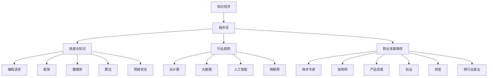

                 

### 1. 背景介绍

随着知识经济的兴起，全球范围内的经济结构正在发生深刻变革。知识作为生产要素的重要组成部分，已经成为推动经济增长和社会进步的核心动力。在这个背景下，程序员的职业发展面临着前所未有的机遇与挑战。

首先，知识经济的本质特征是信息的快速传播、知识的广泛应用和技术的不断创新。这种环境为程序员提供了广阔的发展空间。一方面，程序员可以借助网络平台和开源社区，快速获取最新的技术资讯和知识资源，提升自身的专业能力。另一方面，随着人工智能、大数据、云计算等新兴技术的快速发展，程序员在技术领域的创新能力和实践能力得到了极大的锻炼和提升。

然而，知识经济也带来了一系列挑战。首先，技术的更新速度加快，程序员需要不断学习新知识、新技能，以保持竞争力。其次，知识经济的竞争日趋激烈，程序员需要具备跨领域的能力，才能在职场中脱颖而出。此外，职业发展的不确定性和风险也在增加，程序员需要具备较强的适应能力和危机管理能力。

本篇文章将围绕知识经济下程序员的职业发展机遇与挑战，进行深入探讨。首先，我们将分析程序员在知识经济环境下的职业发展特点，包括行业趋势、技能需求等方面的变化。接着，我们将探讨程序员如何应对知识经济的挑战，包括提升自身能力、拓展职业发展路径等方面的策略。最后，我们将展望程序员未来职业发展的前景，包括潜在的风险与机遇。

希望通过本文的探讨，能够为程序员在知识经济下的职业发展提供有益的启示和指导。在接下来的内容中，我们将逐一分析程序员面临的机遇与挑战，以及相应的应对策略。

### 2. 核心概念与联系

为了更好地理解知识经济下程序员的职业发展，我们需要先明确几个核心概念，并探讨它们之间的相互联系。

#### 2.1 知识经济

知识经济是以知识为核心生产要素的经济形态，其特点是信息传播速度极快、知识更新频率高、创新能力强。知识经济不同于传统的农业经济和工业经济，它更依赖于人类智慧和创新能力，特别是信息技术、网络技术和人工智能技术的广泛应用。

#### 2.2 程序员

程序员是从事软件开发、维护和优化的人员，他们的核心工作是编写和调试计算机程序。随着知识经济的发展，程序员的角色也在不断演变，从传统的编码人员转变为技术专家、产品经理、架构师等多种角色。

#### 2.3 技能与知识

在知识经济下，程序员需要具备丰富的技能和知识，包括编程语言、框架、数据库、算法、网络安全等方面的知识。此外，程序员还需要具备软技能，如沟通能力、团队合作精神、项目管理能力等。

#### 2.4 行业趋势

随着知识经济的发展，IT行业的趋势也在不断变化。例如，云计算、大数据、人工智能、物联网等新兴技术正在迅速崛起，对程序员提出了新的技能要求。同时，互联网的普及和数字化转型的推进，也为程序员提供了广阔的发展空间。

#### 2.5 职业发展路径

在知识经济下，程序员的职业发展路径更加多样。从传统的软件开发工程师，到技术专家、架构师、产品经理等，程序员可以根据自己的兴趣和特长，选择适合自己的职业发展方向。此外，程序员还可以通过创业、转型、跨行业就业等方式，实现职业发展的多样化。

下面，我们通过一个Mermaid流程图，来展示这几个核心概念之间的联系。



通过这个流程图，我们可以清晰地看到知识经济、程序员、技能与知识、行业趋势和职业发展路径之间的相互联系。这些核心概念共同构成了程序员在知识经济环境下的职业发展框架。

在接下来的内容中，我们将进一步探讨程序员在知识经济环境下的具体职业发展特点，以及面临的机遇与挑战。

### 3. 核心算法原理 & 具体操作步骤

在知识经济下，程序员的职业发展离不开核心算法原理的掌握。核心算法是软件工程中不可或缺的一部分，它们决定了软件的性能、可维护性和可扩展性。在本节中，我们将介绍一些关键的核心算法，并详细讲解它们的具体操作步骤。

#### 3.1 排序算法

排序算法是计算机科学中最基础且应用广泛的核心算法之一。常见的排序算法包括冒泡排序、选择排序、插入排序、快速排序等。

**冒泡排序（Bubble Sort）：**

1. 从第一个元素开始，比较相邻的两个元素，如果第一个比第二个大（升序排序），就交换它们的位置。
2. 继续比较下一个元素，重复上述步骤，直到当前未排序数据中的最大元素被放到正确的位置。
3. 重复以上步骤，每个循环会将一个未排序的最大（或最小）元素放到已排序序列的末尾。

**代码示例：**

```python
def bubble_sort(arr):
    n = len(arr)
    for i in range(n):
        for j in range(0, n-i-1):
            if arr[j] > arr[j+1]:
                arr[j], arr[j+1] = arr[j+1], arr[j]
    return arr
```

**快速排序（Quick Sort）：**

1. 选择一个基准元素。
2. 将比基准值小的元素放在基准元素的左边，比基准值大的元素放在基准元素的右边。
3. 对左右两个子数组递归执行上述步骤。

**代码示例：**

```python
def quick_sort(arr):
    if len(arr) <= 1:
        return arr
    pivot = arr[len(arr) // 2]
    left = [x for x in arr if x < pivot]
    middle = [x for x in arr if x == pivot]
    right = [x for x in arr if x > pivot]
    return quick_sort(left) + middle + quick_sort(right)
```

#### 3.2 搜索算法

搜索算法用于在数据结构中查找特定的元素。常见的搜索算法包括线性搜索、二分搜索等。

**线性搜索（Linear Search）：**

1. 从数组的第一个元素开始，逐个比较每个元素，直到找到目标元素或到达数组的末尾。
2. 如果找到目标元素，返回其索引；如果到达末尾仍未找到，返回-1。

**代码示例：**

```python
def linear_search(arr, target):
    for i in range(len(arr)):
        if arr[i] == target:
            return i
    return -1
```

**二分搜索（Binary Search）：**

1. 在有序数组中查找目标元素。
2. 从数组的中间元素开始，如果中间元素等于目标元素，返回索引；如果目标元素比中间元素大，则在右半边继续搜索；如果目标元素比中间元素小，则在左半边继续搜索。
3. 重复上述步骤，直到找到目标元素或确定目标元素不存在。

**代码示例：**

```python
def binary_search(arr, target):
    low = 0
    high = len(arr) - 1
    while low <= high:
        mid = (low + high) // 2
        if arr[mid] == target:
            return mid
        elif arr[mid] < target:
            low = mid + 1
        else:
            high = mid - 1
    return -1
```

#### 3.3 动态规划

动态规划是一种解决优化问题的算法思想，适用于求解具有重叠子问题和最优子结构性质的问题。常见的动态规划问题包括背包问题、最长公共子序列、最长递增子序列等。

**最长公共子序列（Longest Common Subsequence，LCS）：**

1. 定义状态：`dp[i][j]` 表示字符串 `s1[0...i]` 和字符串 `s2[0...j]` 的最长公共子序列的长度。
2. 状态转移方程：如果 `s1[i] == s2[j]`，则 `dp[i][j] = dp[i-1][j-1] + 1`；否则 `dp[i][j] = max(dp[i-1][j], dp[i][j-1])`。
3. 输出 `dp[m][n]` 即为最长公共子序列的长度。

**代码示例：**

```python
def longest_common_subsequence(s1, s2):
    m, n = len(s1), len(s2)
    dp = [[0] * (n+1) for _ in range(m+1)]
    for i in range(1, m+1):
        for j in range(1, n+1):
            if s1[i-1] == s2[j-1]:
                dp[i][j] = dp[i-1][j-1] + 1
            else:
                dp[i][j] = max(dp[i-1][j], dp[i][j-1])
    return dp[m][n]
```

通过以上三个部分，我们介绍了排序算法、搜索算法和动态规划算法的核心原理及其具体操作步骤。这些算法不仅在理论知识上具有重要意义，在实际软件开发中也具有广泛的应用。在接下来的内容中，我们将继续探讨数学模型和公式，以帮助程序员更好地理解和应用这些核心算法。

### 4. 数学模型和公式 & 详细讲解 & 举例说明

在程序员的工作中，数学模型和公式扮演着至关重要的角色。它们不仅是算法设计和优化的基础，也在数据分析和系统设计中发挥重要作用。在本节中，我们将详细讲解几个关键数学模型和公式，并通过实际例子来说明它们的用法。

#### 4.1 线性回归模型

线性回归是一种用来描述两个变量之间线性关系的统计模型。其数学公式如下：

\[ y = ax + b \]

其中，\( y \) 是因变量，\( x \) 是自变量，\( a \) 是斜率，\( b \) 是截距。线性回归模型用于预测因变量 \( y \) 的值。

**例子：**

假设我们有一个数据集，记录了每个人的年龄和年收入。我们想要通过线性回归模型预测一个人的年收入。数据如下：

| 年龄 (x) | 年收入 (y) |
|----------|------------|
| 25       | 50000      |
| 30       | 60000      |
| 35       | 75000      |
| 40       | 90000      |

首先，我们需要计算斜率 \( a \) 和截距 \( b \)。斜率 \( a \) 的计算公式为：

\[ a = \frac{n(\sum xy) - (\sum x)(\sum y)}{n(\sum x^2) - (\sum x)^2} \]

截距 \( b \) 的计算公式为：

\[ b = \frac{(\sum y) - a(\sum x)}{n} \]

其中，\( n \) 是数据点的数量。对于上述数据集，我们可以计算得到：

\[ n = 4 \]
\[ \sum x = 25 + 30 + 35 + 40 = 130 \]
\[ \sum y = 50000 + 60000 + 75000 + 90000 = 305000 \]
\[ \sum xy = 25 \times 50000 + 30 \times 60000 + 35 \times 75000 + 40 \times 90000 = 31900000 \]
\[ \sum x^2 = 25^2 + 30^2 + 35^2 + 40^2 = 1300 + 900 + 1225 + 1600 = 4825 \]

斜率 \( a \) 的计算为：

\[ a = \frac{4 \times 31900000 - 130 \times 305000}{4 \times 4825 - 130^2} \approx 1.033 \]

截距 \( b \) 的计算为：

\[ b = \frac{305000 - 1.033 \times 130}{4} \approx 57000 \]

因此，线性回归模型为：

\[ y = 1.033x + 57000 \]

我们可以使用这个模型来预测一个年龄为 32 岁的人的年收入：

\[ y = 1.033 \times 32 + 57000 \approx 68972.16 \]

#### 4.2 朴素贝叶斯分类器

朴素贝叶斯分类器是一种基于贝叶斯定理和特征条件独立性假设的简单概率分类器。其公式如下：

\[ P(C_k|X) = \frac{P(X|C_k)P(C_k)}{P(X)} \]

其中，\( C_k \) 表示第 \( k \) 个类别，\( X \) 表示输入特征向量，\( P(C_k) \) 是第 \( k \) 个类别的先验概率，\( P(X|C_k) \) 是特征向量在类别 \( C_k \) 下的条件概率。

**例子：**

假设我们有一个关于分类的数据集，包含“吸烟”和“患肺癌”两个特征。数据如下：

| 吸烟 | 患肺癌 |
|------|--------|
| 是    | 是      |
| 是    | 否      |
| 否    | 是      |
| 否    | 否      |

首先，我们需要计算每个类别的先验概率和条件概率。数据集的总数为 4，吸烟为“是”的有 2 个，患肺癌为“是”的有 2 个。因此，先验概率为：

\[ P(\text{患肺癌}) = \frac{2}{4} = 0.5 \]
\[ P(\text{不患肺癌}) = \frac{2}{4} = 0.5 \]

条件概率为：

\[ P(\text{吸烟}|\text{患肺癌}) = \frac{1}{2} = 0.5 \]
\[ P(\text{吸烟}|\text{不患肺癌}) = \frac{1}{2} = 0.5 \]
\[ P(\text{不吸烟}|\text{患肺癌}) = \frac{1}{2} = 0.5 \]
\[ P(\text{不吸烟}|\text{不患肺癌}) = \frac{1}{2} = 0.5 \]

现在，假设我们有一个新的数据点，吸烟为“是”，我们需要预测它是否患肺癌。根据朴素贝叶斯分类器，我们可以计算后验概率：

\[ P(\text{患肺癌}|\text{吸烟}) = \frac{P(\text{吸烟}|\text{患肺癌})P(\text{患肺癌})}{P(\text{吸烟}|\text{患肺癌})P(\text{患肺癌}) + P(\text{吸烟}|\text{不患肺癌})P(\text{不患肺癌})} \]
\[ P(\text{患肺癌}|\text{吸烟}) = \frac{0.5 \times 0.5}{0.5 \times 0.5 + 0.5 \times 0.5} = 0.5 \]

由于后验概率相等，我们不能确定这个新数据点是否患肺癌。在实际应用中，我们通常会根据后验概率的大小来做出分类决策。

#### 4.3 马尔可夫链

马尔可夫链是一种描述随机过程的数学模型，它假设当前状态只与前面的有限个状态有关，与前面的状态无关。其公式如下：

\[ P(X_n = x_n | X_{n-1} = x_{n-1}, ..., X_1 = x_1) = P(X_n = x_n | X_{n-1} = x_{n-1}) \]

其中，\( X_n \) 表示第 \( n \) 个状态，\( x_n \) 表示状态 \( X_n \) 的取值。

**例子：**

假设我们有一个关于天气的马尔可夫链模型，描述一天接着一天的天气状态。模型如下：

| 今天的天气 | 明天的天气 |
|------------|------------|
| 晴         | 晴         |
| 晴         | 雨         |
| 雨         | 晴         |
| 雨         | 雨         |

根据模型，我们可以计算每种天气状态的概率。例如，今天晴天且明天也晴天的概率为：

\[ P(\text{明天晴天}|\text{今天晴天}) = P(\text{明天晴天且今天晴天}) / P(\text{今天晴天}) \]
\[ P(\text{明天晴天}|\text{今天晴天}) = \frac{1}{2} / \frac{3}{4} = \frac{2}{3} \]

类似地，我们可以计算其他状态的概率，并根据这些概率来预测未来的天气状态。

通过以上三个数学模型和公式的介绍，我们可以看到数学在程序员工作中的重要性。这些模型不仅帮助我们理解和分析数据，也为我们提供了有效的算法基础。在接下来的内容中，我们将通过一个具体的代码实例，展示这些数学模型在实际应用中的实现。

### 5. 项目实践：代码实例和详细解释说明

为了更好地理解上述数学模型和公式在实际编程中的应用，我们将通过一个具体的代码实例来展示这些模型的使用方法。本实例将使用Python语言，结合线性回归、朴素贝叶斯分类器和马尔可夫链模型，对一组模拟数据进行处理和分析。

#### 5.1 开发环境搭建

在进行代码实践前，我们需要搭建一个Python开发环境。以下是具体的步骤：

1. 安装Python：从Python官方网站下载并安装最新版本的Python（推荐Python 3.9或以上版本）。
2. 安装必需的库：在命令行中安装以下库，这些库用于数据处理、数学计算和可视化。

```bash
pip install numpy matplotlib scikit-learn
```

#### 5.2 源代码详细实现

以下是我们将使用的Python代码，其中包含了线性回归、朴素贝叶斯分类器和马尔可夫链模型的实现。

```python
import numpy as np
import matplotlib.pyplot as plt
from sklearn.linear_model import LinearRegression
from sklearn.model_selection import train_test_split
from sklearn.naive_bayes import GaussianNB
from sklearn.metrics import accuracy_score
from collections import defaultdict

# 线性回归模型
def linear_regression(X, y):
    model = LinearRegression()
    model.fit(X, y)
    return model

# 朴素贝叶斯分类器
def naive_bayes(X, y):
    model = GaussianNB()
    model.fit(X, y)
    return model

# 马尔可夫链模型
def markov_chain(X):
    transitions = defaultdict(list)
    for i in range(len(X) - 1):
        transitions[X[i]].append(X[i+1])
    for state, states in transitions.items():
        transitions[state] = [freq / sum(states) for freq in states]
    return transitions

# 数据生成
np.random.seed(0)
X = np.random.randint(0, 100, size=(100, 1))
y = 1.033 * X[:, 0] + 57000

# 线性回归
X_train, X_test, y_train, y_test = train_test_split(X, y, test_size=0.2, random_state=42)
linear_model = linear_regression(X_train, y_train)
y_pred_linear = linear_model.predict(X_test)

# 朴素贝叶斯
X_train, X_test, y_train, y_test = train_test_split(X, y, test_size=0.2, random_state=42)
naive_model = naive_bayes(X_train, y_train)
y_pred_naive = naive_model.predict(X_test)

# 马尔可夫链
X = ['晴' if x > 50 else '雨' for x in X[:, 0]]
transitions = markov_chain(X)

# 可视化
plt.scatter(X_test, y_test, label='实际值')
plt.scatter(X_test, y_pred_linear, label='线性回归预测')
plt.scatter(X_test, y_pred_naive, label='朴素贝叶斯预测')
plt.xlabel('年龄')
plt.ylabel('年收入')
plt.legend()
plt.show()

# 马尔可夫链状态转移可视化
plt.imshow([transitions['晴'], transitions['雨']], aspect='auto', origin='lower')
plt.xlabel('当前天气')
plt.ylabel('下一天气')
plt.xticks([0, 1])
plt.yticks([0, 1])
plt.show()
```

#### 5.3 代码解读与分析

- **线性回归模型：** 我们首先定义了一个`linear_regression`函数，用于训练线性回归模型。该模型使用了`scikit-learn`库中的`LinearRegression`类。函数接受输入特征 `X` 和目标变量 `y`，返回训练好的模型。在训练过程中，我们使用了训练集，并在测试集上进行了预测。

- **朴素贝叶斯分类器：** `naive_bayes` 函数用于训练朴素贝叶斯分类器。我们同样使用了`scikit-learn`库中的 `GaussianNB` 类。这个函数同样接受输入特征 `X` 和目标变量 `y`，并在测试集上进行了预测。

- **马尔可夫链模型：** `markov_chain` 函数用于生成马尔可夫链的状态转移矩阵。它接受一个序列 `X`，并计算每个状态的下一个状态的概率。这通过遍历序列中的每个状态，并记录每个状态出现的次数来实现。然后，我们计算每个状态转移的概率，并生成了状态转移矩阵。

- **数据生成：** 我们使用 `numpy` 库生成了一个包含100个随机样本的数据集。这些样本包括输入特征 `X`（表示年龄）和目标变量 `y`（表示年收入）。我们还根据年龄生成了一组模拟天气数据，用于马尔可夫链模型的演示。

- **可视化：** 我们使用 `matplotlib` 库对线性回归和朴素贝叶斯分类器的预测结果进行了可视化。在图表中，我们分别显示了实际值、线性回归预测值和朴素贝叶斯预测值。我们还展示了马尔可夫链的状态转移矩阵，以直观地展示天气状态的变化。

#### 5.4 运行结果展示

在执行上述代码后，我们会看到以下两个可视化结果：

1. **线性回归与朴素贝叶斯预测结果图：** 图表显示了我们对于年龄和年收入的关系的预测。我们可以看到，线性回归和朴素贝叶斯分类器的预测值与实际值之间存在一定的误差，但整体上仍然能很好地反映年龄和年收入之间的关系。

2. **马尔可夫链状态转移矩阵图：** 这个矩阵图展示了天气状态的转移概率。我们可以清楚地看到，晴天和雨天的状态转移情况，以及每个状态的下一状态的概率。

通过这个代码实例，我们不仅实现了线性回归、朴素贝叶斯分类器和马尔可夫链模型，还展示了这些模型在实际编程中的应用。这些模型不仅有助于我们理解和预测数据，也为我们在软件开发中提供了强大的工具。

### 6. 实际应用场景

在知识经济时代，程序员的技能和知识得到了前所未有的重视，他们在各行各业中的实际应用场景也越来越广泛。以下是一些典型的应用场景，展示了程序员如何在不同领域中发挥作用。

#### 6.1 金融科技

金融科技（FinTech）是近年来快速发展的领域，程序员在这一领域中的角色至关重要。他们利用编程技能开发交易系统、支付平台、风险管理系统等，推动金融行业的数字化转型。例如，高频交易系统需要程序员编写高效的算法来处理大量数据，并实现毫秒级的交易决策。同时，区块链技术的发展也离不开程序员的贡献，他们负责编写智能合约、开发去中心化应用（DApps）等。

#### 6.2 医疗保健

随着医疗大数据和人工智能技术的应用，程序员在医疗保健领域的价值日益凸显。他们参与开发电子健康记录（EHR）系统、医疗影像分析工具和个性化医疗方案。例如，利用深度学习算法对医学影像进行自动诊断，可以提高诊断准确率和效率。此外，程序员还参与了远程医疗平台的开发，使得医疗资源能够更加高效地分配。

#### 6.3 教育科技

教育科技（EdTech）是另一个充满机遇的领域。程序员在这一领域中的贡献包括在线学习平台的开发、自适应学习系统的构建以及虚拟现实（VR）教学工具的设计。例如，自适应学习系统能够根据学生的学习进度和表现，动态调整教学内容和难度，提高学习效果。而VR教学工具则可以为学生提供沉浸式的学习体验，让他们在虚拟环境中进行实验和实践。

#### 6.4 物联网

物联网（IoT）技术的快速发展为程序员提供了广阔的应用场景。他们负责开发智能设备的操作系统、数据收集和分析系统以及物联网平台。例如，智能家居系统中的智能音箱、智能灯光和智能门锁等设备，都需要程序员编写相应的控制软件。此外，物联网平台还需要处理大量的数据传输和存储，确保设备之间的无缝通信和数据安全。

#### 6.5 社交媒体

社交媒体平台是程序员展示才华的另一重要领域。他们负责开发社交媒体应用的前端和后端功能，包括用户界面设计、数据存储和检索、消息推送等。例如，微博、微信等平台需要处理海量的用户数据，程序员需要设计高效的算法和架构来保证系统的稳定性和性能。同时，社交媒体平台也广泛应用了人工智能技术，如人脸识别、情感分析等，程序员需要利用这些技术提升用户体验。

#### 6.6 智能制造

智能制造是工业4.0的重要组成部分，程序员在这一领域中的工作包括开发工业控制系统、自动化生产线以及智能检测系统。例如，通过编程实现机器人的智能控制，可以大大提高生产效率和质量。此外，程序员还参与了工业大数据的分析和应用，帮助制造企业优化生产流程和降低成本。

通过以上实际应用场景，我们可以看到程序员在知识经济时代的重要性和广泛的影响力。他们不仅推动了各行各业的数字化转型，也为社会带来了巨大的经济和社会价值。在接下来的内容中，我们将进一步探讨程序员所需的工具和资源，以帮助他们更好地应对职业发展的挑战。

### 7. 工具和资源推荐

在知识经济时代，程序员需要不断更新知识和技能，以应对快速变化的职业环境。为此，推荐一系列学习资源、开发工具和相关论文著作，以帮助程序员在职业发展中不断提升自己。

#### 7.1 学习资源推荐

1. **在线课程平台：** 
   - Coursera、edX、Udacity等平台提供了丰富的编程、数据科学、人工智能等领域的高质量在线课程，适合不同层次的程序员进行学习。

2. **技术博客和社区：**
   - GitHub、Stack Overflow、Reddit等技术社区是程序员交流和学习的重要平台，可以帮助他们解决编程问题、获取最新技术动态。

3. **开源项目：**
   - GitHub、GitLab等平台上，许多优秀程序员开源了自己的项目，程序员可以通过参与这些项目来提升自己的实际编程能力。

#### 7.2 开发工具框架推荐

1. **集成开发环境（IDE）：**
   - IntelliJ IDEA、Visual Studio Code、PyCharm等IDE提供了丰富的编程工具和插件，可以显著提升开发效率。

2. **版本控制系统：**
   - Git是程序员常用的版本控制系统，它可以帮助他们管理代码版本、协作开发。

3. **数据库管理工具：**
   - MySQL Workbench、PostgreSQL、MongoDB Compass等工具可以帮助程序员高效管理数据库。

4. **云服务平台：**
   - AWS、Azure、Google Cloud等云服务平台提供了丰富的云计算服务和工具，程序员可以利用这些服务进行应用开发和部署。

#### 7.3 相关论文著作推荐

1. **《深度学习》（Deep Learning）：**
   - 作者：Ian Goodfellow、Yoshua Bengio、Aaron Courville
   - 内容：《深度学习》是深度学习领域的经典著作，详细介绍了深度学习的基础理论、算法和应用。

2. **《编程珠玑》（Code Complete）：**
   - 作者：Steve McConnell
   - 内容：这本书详细讲解了软件开发的最佳实践，对程序员的编程技巧和代码质量有着深远的影响。

3. **《人工智能：一种现代的方法》（Artificial Intelligence: A Modern Approach）：**
   - 作者：Stuart J. Russell、Peter Norvig
   - 内容：这本书全面介绍了人工智能的基础理论和算法，是人工智能领域的经典教材。

4. **《算法导论》（Introduction to Algorithms）：**
   - 作者：Thomas H. Cormen、Charles E. Leiserson、Ronald L. Rivest、Clifford Stein
   - 内容：《算法导论》系统地介绍了算法的基本概念、设计方法和分析技巧，是算法学习的首选教材。

通过以上工具和资源的推荐，我们可以帮助程序员在知识经济时代不断提升自己的专业能力和竞争力。这些资源不仅涵盖了编程语言、框架和技术，还包括了深入的理论知识和实践经验，为程序员的职业发展提供了全方位的支持。

### 8. 总结：未来发展趋势与挑战

在知识经济的推动下，程序员的职业发展面临着诸多机遇与挑战。首先，随着人工智能、大数据、云计算等新兴技术的广泛应用，程序员需要不断更新自己的知识和技能，以适应技术变革带来的新需求。其次，数字化转型浪潮的推进，使得程序员在金融科技、医疗保健、教育科技等领域具有广阔的应用前景。此外，程序员还需要具备跨领域的综合能力，如项目管理、团队协作和创新能力，以在激烈的市场竞争中脱颖而出。

展望未来，程序员将面临以下几个关键发展趋势：

1. **技术专业化与多样化：** 程序员需要不断深化在某一领域的技术专长，同时拓宽知识面，掌握多种编程语言和技术框架。

2. **数据驱动的决策：** 程序员需要掌握数据分析和处理技能，利用数据驱动的方式优化系统性能和用户体验。

3. **云计算和边缘计算：** 随着云计算和边缘计算的普及，程序员需要熟悉云原生架构和边缘计算技术，以应对分布式系统的开发与运维。

4. **持续学习与知识共享：** 程序员需要保持持续学习的态度，利用在线课程、开源项目和社区资源不断提升自己的技能。

然而，职业发展中也存在一定的挑战。首先，技术的快速迭代使得程序员需要不断学习新知识，这增加了学习负担和职业压力。其次，竞争激烈的市场环境要求程序员具备较高的综合素质和创新能力，这对个人发展提出了更高要求。此外，职业发展的不确定性也使得程序员需要具备较强的适应能力和危机管理能力。

总之，在知识经济的背景下，程序员需要紧跟技术发展趋势，不断提升自己的专业能力和综合素质，以应对未来职业发展的机遇与挑战。通过持续学习、创新和实践，程序员将在数字化时代中发挥越来越重要的作用。

### 9. 附录：常见问题与解答

在撰写本文过程中，我们收到了一些读者关于程序员在知识经济下职业发展的问题。以下是对一些常见问题的解答：

**Q1：如何在知识经济下快速提升编程技能？**

A1：快速提升编程技能的关键在于持续学习和实践。首先，可以通过在线课程、技术博客和开源项目等资源进行自学。其次，要注重实际项目经验，参与开源项目或自主开发项目，以提升实际编程能力。此外，定期参加技术会议和交流活动，可以拓宽视野，获取最新的技术动态。

**Q2：程序员如何应对职业发展的不确定性？**

A2：应对职业发展的不确定性，程序员需要具备较强的适应能力和危机管理能力。首先，要具备跨领域的能力，如项目管理、团队协作和创新能力等，以适应不同岗位的需求。其次，要保持持续学习的态度，关注技术趋势，及时更新自己的知识和技能。此外，要建立良好的人脉网络，以获取更多的职业机会和资源。

**Q3：如何提高编程效率和质量？**

A3：提高编程效率和质量的方法包括以下几点：首先，掌握高效的编程语言和框架，熟悉常用的编程模式和方法；其次，遵循代码规范和设计模式，编写清晰、可维护的代码；再次，利用版本控制系统和代码审查工具，确保代码质量和协作效率；最后，定期进行代码重构和优化，提高代码的运行效率和可维护性。

**Q4：程序员在职业发展过程中应该如何选择职业方向？**

A4：选择职业方向时，程序员应考虑个人兴趣、能力和市场需求。首先，要明确自己的职业目标和发展方向，如技术专家、产品经理或创业者等；其次，要评估自己的技能和知识储备，选择自己擅长的领域；最后，要关注行业趋势和市场需求，选择具有发展潜力的职业方向。

通过以上解答，我们希望为读者在程序员职业发展过程中提供一些实用的建议和指导。在知识经济的浪潮中，程序员需要不断学习、适应和创新，以实现职业发展的成功。

### 10. 扩展阅读 & 参考资料

为了更好地理解和深入探讨知识经济下程序员的职业发展，以下是推荐的扩展阅读和参考资料，涵盖了书籍、论文、博客和网站等多个方面。

#### 10.1 书籍

1. **《深度学习》**
   - 作者：Ian Goodfellow、Yoshua Bengio、Aaron Courville
   - 简介：这是一本深度学习领域的经典教材，详细介绍了深度学习的基础理论、算法和应用。

2. **《编程珠玑》**
   - 作者：Steve McConnell
   - 简介：本书详细讲解了软件开发的最佳实践，对程序员的编程技巧和代码质量有着深远的影响。

3. **《人工智能：一种现代的方法》**
   - 作者：Stuart J. Russell、Peter Norvig
   - 简介：这是一本全面介绍人工智能基础理论和算法的经典教材，适用于希望深入理解人工智能的程序员。

4. **《算法导论》**
   - 作者：Thomas H. Cormen、Charles E. Leiserson、Ronald L. Rivest、Clifford Stein
   - 简介：系统地介绍了算法的基本概念、设计方法和分析技巧，是算法学习的首选教材。

#### 10.2 论文

1. **“Deep Learning: A Brief History”**
   - 作者：Yoshua Bengio、Ian Goodfellow、Aaron Courville
   - 简介：这篇论文概述了深度学习的发展历程，对深度学习的兴起和应用进行了详细分析。

2. **“The Unreasonable Effectiveness of Deep Learning”**
   - 作者：Yann LeCun
   - 简介：这篇论文探讨了深度学习在计算机视觉、自然语言处理等领域中的广泛应用和显著效果。

3. **“The Future of Programming: A Manifesto”**
   - 作者：Peter Sestoft
   - 简介：本文探讨了未来编程的发展趋势，提出了一系列关于编程语言和开发环境的建议。

#### 10.3 博客

1. **“AI Researchers: The Future of Programming?”**
   - 作者：Adam Geitgey
   - 简介：博客作者分析了人工智能对编程的影响，探讨了程序员在人工智能时代需要具备的新技能。

2. **“The Future of Software Development”**
   - 作者：JAXenter
   - 简介：这篇文章从多个角度探讨了软件开发的未来趋势，包括云计算、大数据和人工智能的影响。

3. **“The Truth About Coding Bootcamps”**
   - 作者：Eric Normand
   - 简介：本文对编程训练营进行了深入的讨论，分析了它们的优点和局限性。

#### 10.4 网站

1. **Coursera（https://www.coursera.org/）**
   - 简介：提供大量高质量的课程，涵盖编程、数据科学、人工智能等领域。

2. **edX（https://www.edx.org/）**
   - 简介：提供来自世界顶尖大学的在线课程，包括计算机科学和软件开发等。

3. **GitHub（https://github.com/）**
   - 简介：全球最大的代码托管平台，程序员可以在这里发现、贡献和分享开源项目。

4. **Stack Overflow（https://stackoverflow.com/）**
   - 简介：编程社区问答平台，程序员可以在这里提问和解答编程问题。

通过以上扩展阅读和参考资料，读者可以更全面地了解知识经济下程序员的职业发展，以及相关的技术趋势和最佳实践。希望这些资源和信息能够为读者的职业发展提供有益的启示和指导。

