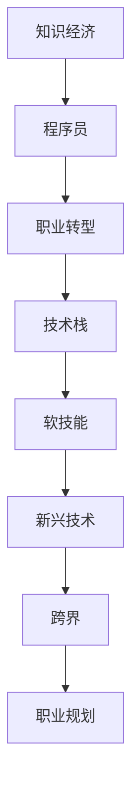

                 

### 1. 背景介绍

在知识经济时代，信息技术的迅猛发展带动了整个社会的进步，同时也对各个行业产生了深远的影响。作为信息技术领域的重要组成部分，程序员的职业转型策略成为了当前热议的话题。程序员的职业转型不仅仅是为了适应技术的快速迭代，更是为了提升自身的核心竞争力，实现个人价值的最大化。

从历史角度看，程序员的职业发展经历了多个阶段。最初，程序员主要从事编码工作，随着软件工程的发展，他们逐渐参与到需求分析、系统设计等更广泛的领域。如今，随着人工智能、大数据、云计算等新兴技术的兴起，程序员面临着新的职业转型挑战。这不仅要求程序员具备扎实的编程技能，还需要具备创新思维和跨学科知识，以应对不断变化的技术需求。

在全球范围内，知识经济的崛起使得知识成为了推动经济增长的核心动力。这种背景下，程序员的职业转型显得尤为重要。传统的编程工作逐渐被自动化工具所取代，程序员需要通过转型来适应新的技术环境，寻找新的职业发展方向。例如，从单一的编码角色向软件开发、系统架构、人工智能应用等领域扩展，甚至跨界到管理、教育等领域，实现职业的多元化和职业价值的提升。

在我国，随着“互联网+”战略的深入推进，信息技术产业得到了前所未有的发展，这也为程序员提供了广阔的职业转型空间。然而，面对激烈的市场竞争和快速变化的技术环境，程序员的职业转型并非易事。如何在新形势下实现个人职业的持续发展，成为了每一个程序员都必须面对的重要问题。

总的来说，知识经济的兴起为程序员的职业转型带来了新的机遇和挑战。本文将深入探讨程序员在知识经济背景下的职业转型策略，帮助程序员应对技术变革，实现职业发展的新突破。通过对程序员职业转型的背景、核心概念、算法原理、数学模型、项目实践、实际应用场景等方面的详细分析，本文旨在为程序员提供一套切实可行的职业转型指南，助力他们在知识经济时代脱颖而出。

### 2. 核心概念与联系

在探讨程序员的职业转型策略之前，我们需要明确一些核心概念，并理解这些概念之间的内在联系。以下是本文中将会用到的一些关键术语和定义：

**知识经济**：知识经济是一种以知识和信息为核心的经济形态，其价值创造主要依赖于知识和信息的生产、分配和使用。与传统的资源驱动型经济相比，知识经济更强调创新、技术和人才。

**程序员**：程序员是从事软件设计和开发的专业人员，他们通过编写代码来构建计算机程序和软件系统。

**职业转型**：职业转型是指一个人在职业生涯中从一种职业向另一种职业转变的过程，这通常涉及技能、知识和角色的重大变化。

**技术栈**：技术栈是指一个人在特定领域内所掌握的各种技术和工具的组合。一个丰富多样的技术栈可以帮助程序员更好地适应不同的工作需求。

**软技能**：软技能包括沟通能力、团队合作、领导力、解决问题的能力等，这些技能在职业转型中同样重要，尤其是在管理和教育等领域。

**新兴技术**：新兴技术包括人工智能、大数据、云计算、区块链等，这些技术正在深刻地改变着各行各业的运作方式，也为程序员的职业转型提供了新的方向。

**跨界**：跨界是指从一个领域跨到另一个完全不同的领域，这种转型需要强大的适应能力和跨学科的知识。

**职业规划**：职业规划是指个人根据自身的兴趣、能力和市场需求，制定长期和短期的职业发展计划。

#### Mermaid 流程图

为了更直观地展示这些核心概念之间的联系，我们使用Mermaid流程图进行描述：



#### 核心概念原理和架构

**知识经济**：知识经济依赖于信息技术的快速发展，使得数据成为新的生产要素。在这个经济体系中，知识和信息的生产、传播和应用是推动经济增长的关键。程序员作为知识经济的践行者，需要不断更新自己的知识体系，以适应技术发展的需求。

**程序员**：程序员是知识经济的核心力量，他们的工作直接关联到技术的创新和应用的落地。程序员的职业转型往往意味着从传统的编码工作向更高层次的软件开发、系统架构等领域转变。

**职业转型**：职业转型不仅是技能的更新，更是一种角色的转变。在这个过程中，程序员需要考虑自身的长远发展，重新定位自己的职业方向。

**技术栈**：技术栈是程序员职业转型的基石。一个多样化的技术栈可以帮助程序员在转型过程中更好地适应新的工作需求，提高工作效率。

**软技能**：软技能在职业转型中起着至关重要的作用。特别是在管理和教育领域，沟通能力、团队合作和领导力等软技能是不可或缺的。

**新兴技术**：随着人工智能、大数据等新兴技术的快速发展，程序员需要具备对这些技术的理解和应用能力，以在新兴领域中找到新的职业机会。

**跨界**：跨界是程序员职业转型的另一种形式。通过跨学科的知识和技能，程序员可以在完全不同的领域中获得成功。

**职业规划**：职业规划是程序员实现职业转型的关键。一个明确的职业规划可以帮助程序员更好地规划自己的发展路径，实现职业目标。

通过上述核心概念的分析和Mermaid流程图的展示，我们可以看到这些概念之间的紧密联系，这为程序员在知识经济背景下的职业转型提供了理论依据和操作指南。

### 3. 核心算法原理 & 具体操作步骤

在探讨程序员的职业转型策略时，我们需要深入理解核心算法的原理，并将其应用于实际操作步骤中。以下是几个关键算法及其原理，我们将详细探讨这些算法在程序员职业转型中的具体应用。

#### 1. 马尔可夫决策过程（MDP）

马尔可夫决策过程是一种用于优化决策问题的数学模型，它描述了系统在不同状态之间转移的概率，并基于这些概率来选择最佳动作。对于程序员来说，掌握MDP原理可以帮助他们在职业转型过程中做出更加科学的决策。

**算法原理**：

- **状态（State）**：指程序员当前的职业状态，如初级程序员、中级程序员、高级程序员等。
- **动作（Action）**：指程序员可以采取的职业行动，如学习新技能、参与项目实践、进行职业规划等。
- **奖励（Reward）**：指采取某种动作后带来的收益，如技能提升、工作经验积累、职业发展等。

**具体操作步骤**：

1. **定义状态和动作**：根据程序员的职业现状，明确当前的状态和可能的动作。
2. **建立转移概率矩阵**：分析每个状态转移到其他状态的概率。
3. **计算期望奖励**：为每个动作计算其在不同状态下的期望奖励。
4. **选择最佳动作**：根据期望奖励选择能够最大化总奖励的动作。

**应用实例**：

假设一个程序员当前状态为“中级程序员”，他需要决定是否学习大数据技术。通过建立转移概率矩阵和计算期望奖励，他可以科学地评估学习大数据技术带来的收益，并做出相应的决策。

#### 2. 支持向量机（SVM）

支持向量机是一种用于分类和回归分析的机器学习算法，它通过寻找最优决策边界来最大化分类的准确率。在职业转型中，SVM可以帮助程序员识别出最适合自己发展的方向。

**算法原理**：

- **特征空间**：指程序员的技能、经验、教育背景等特征构成的集合。
- **决策边界**：指能够将不同职业发展方向（如软件开发、系统架构、人工智能等）区分开的边界。
- **支持向量**：指位于决策边界上的样本点，对分类决策起着关键作用。

**具体操作步骤**：

1. **数据收集**：收集程序员的技能、经验、教育背景等数据。
2. **特征提取**：将数据转换为适合输入到SVM模型的特征向量。
3. **训练SVM模型**：使用已标记的职业发展方向数据训练SVM模型。
4. **预测职业方向**：将程序员的特征向量输入到训练好的SVM模型中，预测其最适合的职业方向。

**应用实例**：

一个程序员可以通过输入自己的技能、经验和教育背景等特征向量，使用SVM模型预测自己最适合的职业方向，从而为职业转型提供科学依据。

#### 3. 贝叶斯网络

贝叶斯网络是一种用于表示不确定性关系的图形模型，它通过节点和边来表示变量之间的概率依赖关系。在职业转型过程中，贝叶斯网络可以帮助程序员评估不同转型路径的风险和收益。

**算法原理**：

- **节点**：表示程序员的技能、经验、职业方向等变量。
- **边**：表示变量之间的条件依赖关系，如学习新技能对职业发展的影响等。
- **概率分布**：表示每个节点在给定其他节点条件下的概率分布。

**具体操作步骤**：

1. **建立贝叶斯网络**：根据程序员的职业转型需求，建立包含技能、经验、职业方向等变量的贝叶斯网络。
2. **设定先验概率**：根据程序员的初始状态，设定各变量的先验概率。
3. **更新概率分布**：使用贝叶斯法则更新每个变量的后验概率分布。
4. **评估转型路径**：根据后验概率分布评估不同转型路径的收益和风险。

**应用实例**：

一个程序员可以通过建立贝叶斯网络，评估学习新技能、参与项目实践等转型路径的收益和风险，从而做出更为科学的职业转型决策。

#### 总结

通过上述核心算法原理和具体操作步骤的探讨，我们可以看到这些算法在程序员职业转型中的应用潜力。掌握这些算法不仅可以帮助程序员在职业转型过程中做出更为科学的决策，还可以提升他们的职业竞争力。在实际操作中，程序员可以根据自己的具体情况，选择合适的算法进行应用，实现个人职业发展的新突破。

### 4. 数学模型和公式 & 详细讲解 & 举例说明

在探讨程序员的职业转型过程中，数学模型和公式发挥着关键作用。以下我们将详细讲解两个重要的数学模型——动态规划模型和线性规划模型，并通过实际例子说明其应用。

#### 1. 动态规划模型

动态规划是一种解决多阶段决策问题的高效算法。在程序员的职业转型中，动态规划模型可以帮助程序员在多个阶段中做出最优决策。

**数学模型原理**：

动态规划模型通常包含以下几个基本要素：

- **阶段**：表示程序员职业发展的不同阶段，如初级、中级、高级等。
- **状态**：表示程序员在某个阶段的状态，如掌握的技能、经验等。
- **决策**：表示程序员在某个状态下可以采取的行动，如学习新技能、参与项目实践等。
- **收益**：表示每个决策带来的收益，如技能提升、工作经验积累等。

**模型公式**：

动态规划的核心是递推关系，即状态转移方程。假设状态为`s`，决策为`a`，下一个状态为`s'`，收益为`r`，则动态规划模型可以表示为：

\[ V(s) = \max_a [r(s, a) + V(s')] \]

其中，\( V(s) \) 表示在状态`s`下的最大收益，\( r(s, a) \) 表示在状态`s`下采取决策`a`的收益。

**应用实例**：

假设一个程序员在职业发展的初级阶段，需要决定是否学习大数据技术。我们可以建立如下动态规划模型：

- **状态**：初级程序员
- **决策**：学习大数据技术、不学习大数据技术
- **收益**：学习大数据技术可以提升技能和职业竞争力，假设收益为10；不学习大数据技术可以专注于当前项目，假设收益为5。

根据递推关系，我们可以计算出在初级阶段的最大收益：

\[ V(初级程序员) = \max [10 + V(中级程序员), 5 + V(中级程序员)] \]

假设在下一个阶段（中级程序员）的最大收益为15，则：

\[ V(初级程序员) = \max [10 + 15, 5 + 15] = 20 \]

这意味着，学习大数据技术在这个例子中是一个最优决策。

#### 2. 线性规划模型

线性规划是一种用于优化线性目标函数的数学模型，它广泛应用于资源分配、成本控制等问题。在程序员的职业转型中，线性规划模型可以帮助程序员在有限的资源下做出最优决策。

**数学模型原理**：

线性规划模型包含以下几个基本要素：

- **目标函数**：表示程序员希望优化的目标，如最大化收益、最小化成本等。
- **约束条件**：表示程序员在职业转型过程中需要满足的限制，如时间、技能要求等。
- **变量**：表示程序员的决策变量，如学习的新技能、参与的项目等。

**模型公式**：

线性规划的一般形式为：

\[ \min\ c^T x \]

\[ s.t. \ A x \leq b \]

其中，\( c \) 是目标函数的系数向量，\( x \) 是决策变量向量，\( A \) 是约束条件的系数矩阵，\( b \) 是约束条件的常数向量。

**应用实例**：

假设一个程序员需要在有限的时间内决定学习哪些新技能，以最大化其职业收益。我们可以建立如下线性规划模型：

- **目标函数**：最大化技能提升的收益
- **约束条件**：时间限制、学习成本限制等

假设学习某项新技能的收益为5，时间为2周，学习成本为1000元；而学习另一项新技能的收益为3，时间为1周，学习成本为500元。我们可以设置以下线性规划模型：

\[ \min \ 1000x_1 + 500x_2 \]

\[ s.t. \ 2x_1 + x_2 \leq 8 \] （时间约束）

\[ x_1 + x_2 \leq 2 \] （学习成本约束）

\[ x_1, x_2 \geq 0 \] （非负约束）

通过求解这个线性规划模型，我们可以得到最优解，即在学习时间和成本有限的条件下，应优先学习哪项新技能以最大化职业收益。

#### 总结

通过动态规划模型和线性规划模型的讲解，我们可以看到数学模型在程序员职业转型中的重要作用。动态规划模型可以帮助程序员在多阶段决策中找到最优路径，而线性规划模型则可以帮助程序员在有限资源下做出最优的资源配置决策。在实际应用中，程序员可以根据自身情况选择合适的数学模型，以实现职业发展的最佳效果。

### 5. 项目实践：代码实例和详细解释说明

为了更好地理解程序员的职业转型策略，我们将通过一个实际项目——基于人工智能的客户细分项目，来展示具体的代码实现和详细解释说明。这个项目将帮助程序员掌握如何将职业转型策略应用于实际工作中，提高项目实战能力。

#### 5.1 开发环境搭建

在进行项目实践之前，我们需要搭建一个合适的开发环境。以下是所需的工具和步骤：

1. **开发工具**：Python 3.x版本（推荐使用Anaconda环境管理器）
2. **数据预处理工具**：pandas、numpy
3. **机器学习库**：scikit-learn、tensorflow或PyTorch
4. **数据可视化工具**：matplotlib、seaborn

安装步骤：

```bash
# 安装Anaconda
conda create -n myenv python=3.8
conda activate myenv

# 安装所需库
conda install pandas numpy scikit-learn tensorflow matplotlib seaborn
```

#### 5.2 源代码详细实现

以下是一个简单的基于K-Means聚类算法的客户细分项目的代码实现：

```python
import pandas as pd
import numpy as np
from sklearn.cluster import KMeans
import matplotlib.pyplot as plt

# 数据读取与预处理
data = pd.read_csv('customer_data.csv')
# 假设数据包括客户的年龄、收入、消费金额等特征

# 数据标准化
from sklearn.preprocessing import StandardScaler
scaler = StandardScaler()
data_scaled = scaler.fit_transform(data)

# K-Means聚类
kmeans = KMeans(n_clusters=3, random_state=0).fit(data_scaled)
labels = kmeans.labels_

# 客户细分结果
data['cluster'] = labels

# 可视化展示
plt.figure(figsize=(10, 6))
plt.scatter(data['age'], data['income'], c=labels, cmap='viridis')
plt.xlabel('年龄')
plt.ylabel('收入')
plt.title('客户细分结果')
plt.show()

# 分析不同客户群体的特征
for i in range(3):
    cluster_data = data[data['cluster'] == i]
    print(f"客户群体{i+1}的特征：")
    print(cluster_data.describe())
```

#### 5.3 代码解读与分析

**数据读取与预处理**：
首先，我们使用pandas库读取客户数据。由于数据包含多个特征，我们需要对这些特征进行标准化处理，以便于聚类算法的计算。

**K-Means聚类**：
我们使用scikit-learn库中的KMeans类进行聚类。这里我们选择3个簇（cluster），随机种子设置为0以保证结果的稳定性。聚类结果通过`labels_`属性获得。

**客户细分结果**：
我们将聚类结果添加到原始数据中，并通过matplotlib库的可视化功能展示每个客户群体在年龄和收入上的分布情况。

**分析不同客户群体的特征**：
最后，我们通过描述统计（`describe()`方法）来分析每个客户群体的特征，以便更好地了解他们的需求和偏好。

#### 5.4 运行结果展示

运行上述代码后，我们将看到以下结果：

1. **可视化展示**：
   屏幕上会出现一个散点图，展示不同客户群体在年龄和收入上的分布。每个颜色代表一个簇。
   
2. **描述统计**：
   控制台将输出每个客户群体的描述统计信息，包括均值、标准差等。这些信息有助于我们了解各个客户群体的特征。

#### 总结

通过这个项目，我们不仅掌握了客户细分的基本流程，还了解了如何将程序员的职业转型策略应用于实际工作中。这个过程可以帮助程序员在实际项目中提高自己的技能和经验，为未来的职业发展打下坚实基础。

### 6. 实际应用场景

程序员的职业转型策略在实际应用中具有广泛的场景和深远的影响。以下是一些典型的应用场景，以及在这些场景中如何运用职业转型策略。

#### 1. 创业

随着互联网和新兴技术的快速发展，许多程序员选择创业，将技术转化为实际的产品和服务。职业转型策略在这里尤为重要，程序员需要从单一的编码角色向产品经理、创业者等角色转型。

**应用**：

- **产品规划**：程序员需要学习产品规划、用户体验设计等跨学科知识，以更好地理解市场需求和用户需求。
- **市场分析**：掌握市场分析和商业模式的构建，帮助产品在市场中脱颖而出。
- **团队管理**：培养领导力和团队管理能力，带领团队实现产品目标。

#### 2. 大数据与人工智能

大数据和人工智能是当前技术发展的热点，许多程序员在这个领域寻找新的职业机会。转型策略需要强调跨学科知识和实际操作能力。

**应用**：

- **数据处理**：学习数据处理和存储技术，如Hadoop、Spark等，以应对大规模数据处理的挑战。
- **机器学习**：掌握机器学习算法和深度学习技术，应用于图像识别、自然语言处理等领域。
- **业务应用**：结合业务需求，将大数据和人工智能技术应用于实际业务场景，提升企业竞争力。

#### 3. 云计算与DevOps

云计算和DevOps的兴起改变了软件开发的模式，程序员需要掌握云服务和持续集成、持续部署等技能。

**应用**：

- **云计算架构**：学习云服务架构和部署，如AWS、Azure、Google Cloud等。
- **DevOps文化**：理解DevOps文化，掌握自动化工具，如Jenkins、Docker等，提升开发效率。
- **运维技能**：了解运维知识，实现开发与运维的无缝协作。

#### 4. 跨界合作

跨界合作是程序员实现职业转型的另一种形式，通过与不同领域的专家合作，开拓新的职业机会。

**应用**：

- **医疗健康**：结合医疗知识和编程技能，开发医疗信息系统、健康监测设备等。
- **教育技术**：将教育理念和编程技术结合，开发在线教育平台、智能辅导系统等。
- **金融科技**：利用金融知识和技术，开发金融应用、风险控制系统等。

#### 总结

程序员的职业转型策略在各个实际应用场景中都发挥了重要作用。通过灵活运用转型策略，程序员不仅能够提升自身的职业竞争力，还能够实现个人职业价值的最大化。在创业、大数据与人工智能、云计算与DevOps、跨界合作等场景中，程序员需要不断学习新技能，适应新技术，以实现职业发展的新突破。

### 7. 工具和资源推荐

为了帮助程序员更好地实现职业转型，我们推荐了一系列学习资源和开发工具，这些工具和资源涵盖了从基础知识到高级技术的各个方面。

#### 7.1 学习资源推荐

1. **书籍**：

   - 《深度学习》（Goodfellow, Bengio, Courville）：全面介绍深度学习的基本概念和技术。
   - 《Python编程：从入门到实践》（Mark Lutz）：Python编程的入门书籍，适合初学者。
   - 《代码大全》（Steve McConnell）：软件开发最佳实践的指南。
   - 《设计模式：可复用面向对象软件的基础》（Gamma, Helm, Johnson, Vlissides）：介绍设计模式和软件架构。

2. **在线课程**：

   - Coursera：提供大量计算机科学和人工智能相关的课程，包括斯坦福大学的《机器学习》等。
   - edX：由哈佛大学和麻省理工学院联合提供，包括《云计算基础》等课程。
   - Udemy：涵盖广泛的主题，包括编程、数据分析、机器学习等。

3. **论文和文献**：

   - ArXiv：计算机科学和人工智能领域的前沿论文。
   - ACM Digital Library：计算机科学领域的权威出版物。

4. **博客和社区**：

   - Medium：有许多技术博客，涵盖多个领域。
   - Stack Overflow：编程问题解答社区。
   - GitHub：代码托管平台，可以学习开源项目。

#### 7.2 开发工具框架推荐

1. **编程工具**：

   - Visual Studio Code：功能强大的代码编辑器。
   - IntelliJ IDEA：智能编程环境，适合Java和Python开发。
   - PyCharm：Python开发的专业IDE。

2. **开发框架**：

   - Flask：Python的轻量级Web框架。
   - Django：Python的全栈Web框架。
   - React：用于构建用户界面的JavaScript库。
   - Angular：用于构建动态Web应用的框架。
   - Spring Boot：Java的微服务开发框架。

3. **云服务**：

   - AWS：提供全面的云计算服务，包括Amazon S3、EC2等。
   - Azure：微软的云服务，包括Azure Blob Storage、Azure Functions等。
   - Google Cloud：提供Google Cloud Platform的多种服务，如Google Compute Engine、Google Cloud Storage等。

4. **数据工具**：

   - Hadoop：大数据处理框架。
   - Spark：快速的大数据处理引擎。
   - TensorFlow：开源机器学习库。
   - PyTorch：用于机器学习和深度学习的Python库。

#### 7.3 相关论文著作推荐

1. **论文**：

   - "Deep Learning" by Yoshua Bengio, Aaron Courville, and Pascal Vincent
   - "Big Data: A Revolution That Will Transform How We Live, Work, and Think" by Viktor Mayer-Schönberger and Kenneth Cukier
   - "The Future of Employment: How Smart Machines Are Creating the New Work Revolution" by Andrew M. McAfee and Erik Brynjolfsson

2. **著作**：

   - "The Innovator's Dilemma" by Clayton M. Christensen
   - "The Lean Startup" by Eric Ries
   - "The Second Machine Age: Work, Progress, and Prosperity in a Time of Brilliant Technologies" by M. I. T. Press

通过这些工具和资源的支持，程序员可以全面提升自己的技能，实现职业转型。无论是学习基础知识，还是进行实际项目开发，这些推荐的学习资源和开发工具都将为程序员的职业发展提供有力支持。

### 8. 总结：未来发展趋势与挑战

在知识经济时代，程序员的职业转型策略显得尤为重要。未来，随着人工智能、大数据、云计算等新兴技术的不断进步，程序员的职业发展将面临新的机遇和挑战。

**发展趋势**：

1. **技术融合**：多种技术将在未来不断融合，程序员需要具备跨学科的知识和技能，以适应这种技术融合的趋势。

2. **职业多元**：程序员不再局限于传统的编码工作，越来越多的程序员将转型为产品经理、数据科学家、AI工程师等多元角色。

3. **终身学习**：技术的快速迭代要求程序员具备持续学习的能力，终身学习将成为程序员职业发展的关键。

4. **跨界合作**：跨界合作将成为未来程序员职业发展的新趋势，通过与不同领域的专家合作，程序员可以开拓新的职业机会。

**挑战**：

1. **技术更新**：新技术层出不穷，程序员需要不断更新自己的知识体系，以适应快速变化的技术环境。

2. **职业规划**：在职业转型过程中，程序员需要科学地规划自己的职业道路，避免盲目跟风。

3. **技能提升**：在多元职业发展的背景下，程序员需要不断提升自己的软技能，如沟通能力、团队合作和领导力等。

4. **资源分配**：在资源有限的条件下，程序员需要合理分配时间和精力，实现个人职业和生活的平衡。

总的来说，未来程序员的职业转型将是一个充满机遇和挑战的过程。通过灵活运用职业转型策略，程序员可以应对技术变革，实现个人职业的持续发展。

### 9. 附录：常见问题与解答

在探讨程序员的职业转型策略过程中，许多读者可能会有一些疑问。以下是针对一些常见问题的解答，希望对大家有所帮助。

**Q1：程序员需要掌握哪些核心技能才能实现职业转型？**

A1：程序员需要掌握的核心技能包括编程语言（如Python、Java等）、算法和数据结构、数据库和SQL、版本控制工具（如Git）、容器化和虚拟化技术（如Docker和Kubernetes）以及云计算服务（如AWS、Azure和Google Cloud）。此外，跨学科知识（如产品管理、数据分析、机器学习等）和软技能（如沟通能力、团队合作、领导力等）也是非常重要的。

**Q2：如何进行职业规划以实现职业转型？**

A2：职业规划是职业转型的重要一步。首先，程序员需要明确自己的职业目标和兴趣方向。其次，制定一个具体的职业发展计划，包括短期和长期目标，并确定实现这些目标所需的技能和资源。同时，不断评估和调整职业规划，以适应技术和市场环境的变化。

**Q3：如何平衡职业发展和个人生活？**

A3：平衡职业发展和个人生活对于程序员来说尤为重要。建议采取以下策略：首先，设定合理的工作时间，避免长时间加班；其次，培养良好的时间管理习惯，提高工作效率；最后，积极参加体育锻炼和社交活动，保持身心健康。

**Q4：转型过程中遇到困难怎么办？**

A4：在转型过程中遇到困难是正常的。首先，不要害怕失败，要敢于尝试和挑战；其次，寻求专业指导和资源支持，如参加线上课程、社区讨论和专业会议；最后，保持积极的心态，不断学习和提升自己的技能。

**Q5：有哪些适合程序员的转型方向？**

A5：适合程序员的转型方向包括产品管理、数据科学、人工智能、云计算、DevOps和项目管理等。每个方向都有不同的技能要求和职业发展路径，程序员可以根据自己的兴趣和实际情况选择合适的方向。

通过上述解答，希望能帮助读者更好地理解程序员的职业转型策略，并在实际操作中取得成功。

### 10. 扩展阅读 & 参考资料

为了进一步了解程序员的职业转型策略，读者可以参考以下扩展阅读和参考资料：

1. **书籍**：

   - 《人工智能：一种现代的方法》（第二版）作者：Stuart J. Russell & Peter Norvig
   - 《大数据实践：技术、方法和案例分析》作者：陈恩红、李艳辉
   - 《软件架构设计：架构、架构风格与模式》作者：Martin Fowler

2. **论文**：

   - "The Future of Employment: How Smart Machines Are Creating the New Work Revolution" by Andrew M. McAfee and Erik Brynjolfsson
   - "Deep Learning: Methods and Applications" by Yutaka Takiuchi, Naoki Higuchi, and Shinichi Makino
   - "A Theory of the Learning Curve" by W. Edwards Deming

3. **在线课程**：

   - "Introduction to Artificial Intelligence" on Coursera by David J. C. MacKay
   - "Data Science Specialization" on Coursera by Johns Hopkins University
   - "Cloud Computing Specialization" on Coursera by AT&T

4. **网站和社区**：

   - [GitHub](https://github.com/)
   - [Stack Overflow](https://stackoverflow.com/)
   - [Medium](https://medium.com/)
   - [Reddit](https://www.reddit.com/r/learnprogramming/)

5. **博客和文章**：

   - "The Age of Smart Machines: The Future of Employment" on LinkedIn by Andrew M. McAfee
   - "How to Get a Job in AI" on Medium by Shreyansh Poddar
   - "Career Paths for Programmers in the Age of AI" on HackerRank Blog

通过这些扩展阅读和参考资料，读者可以更深入地了解程序员的职业转型策略，从而在实际工作中取得更好的成果。

