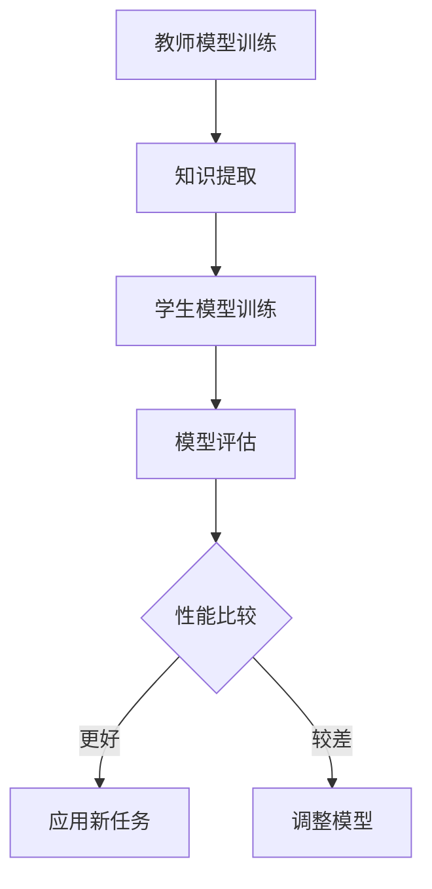

                 

### 文章标题

《知识蒸馏在小样本学习中的作用》

> **关键词**：知识蒸馏、小样本学习、模型压缩、模型优化、神经网络、机器学习、降维、数据增强、迁移学习。

> **摘要**：本文深入探讨了知识蒸馏技术在小样本学习场景中的关键作用。通过逐步分析知识蒸馏的原理、算法流程以及实际应用，我们揭示了知识蒸馏如何有效地提升模型在小样本数据上的表现，以及面临的挑战和未来发展趋势。本文旨在为读者提供全面的技术视角，帮助理解知识蒸馏在小样本学习中的重要性及其潜力。

---

### 1. 背景介绍

在机器学习领域，模型的性能往往取决于训练数据的质量和数量。然而，在实际应用中，获取大量标注数据是一项昂贵且耗时的任务，尤其是在某些领域如医疗诊断、工业检测等。因此，小样本学习（Few-Shot Learning）成为了研究的热点。小样本学习旨在使模型能够在仅有少量样本的情况下迅速适应新类别或任务。

知识蒸馏（Knowledge Distillation）是一种近年来兴起的模型压缩技术，它通过将复杂的大模型（Teacher Model）的知识“蒸馏”到一个小模型（Student Model）中，从而提高小模型的性能。这一技术在小样本学习中的应用尤为显著，因为它能够在有限的数据条件下，帮助小模型获取丰富的先验知识，从而提升其泛化能力。

传统的模型压缩方法，如模型剪枝（Model Pruning）和量化（Quantization），主要通过减少模型的参数数量或精度来降低模型的复杂度。然而，这些方法往往牺牲了模型的性能，特别是在处理复杂任务时。知识蒸馏则不同，它通过利用大模型的内在知识，使得小模型不仅能够保持高性能，还能在训练数据有限的情况下快速适应新任务。

小样本学习的关键挑战在于如何利用有限的训练数据来获得有效的模型表示。知识蒸馏通过以下几方面解决了这一问题：

1. **迁移学习**：大模型在大量数据上的训练使其具有较好的泛化能力，知识蒸馏使得小模型可以继承这些有益的属性。
2. **数据增强**：知识蒸馏过程中，大模型对小样本数据提供了一种额外的增强方式，使得小模型能够在更丰富的数据环境中训练。
3. **多任务学习**：知识蒸馏允许小模型同时学习多个任务，从而提高其处理新任务的能力。

随着深度学习技术的不断发展和广泛应用，知识蒸馏在小样本学习中的应用潜力越来越大。本文将深入探讨知识蒸馏的原理、算法、数学模型以及实际应用，旨在为读者提供全面的理解和实际操作的指导。

### 2. 核心概念与联系

#### 2.1 知识蒸馏的定义

知识蒸馏是一种将复杂模型（通常称为“教师模型”）的知识转移到简化模型（通常称为“学生模型”）的技术。教师模型通常拥有更多的参数和更高的性能，但它的训练成本也更高。通过知识蒸馏，我们可以利用教师模型的知识来指导学生模型的训练，使其在有限的训练数据上也能表现出良好的性能。

#### 2.2 小样本学习的挑战

在小样本学习中，模型面临的主要挑战包括：

1. **数据不足**：训练数据量较少，导致模型难以充分学习数据的分布。
2. **过拟合风险**：模型可能会在学习过程中过度适应训练数据，导致在新数据上的表现不佳。
3. **泛化能力**：模型需要能够在未见过的数据上表现出良好的性能，这需要强大的泛化能力。

#### 2.3 知识蒸馏与迁移学习的关系

知识蒸馏是迁移学习的一种形式。在迁移学习中，预训练模型的知识被转移到新的任务中。知识蒸馏则更专注于如何有效地提取和传递这些知识。迁移学习通常涉及到多个任务，而知识蒸馏通常关注单一任务。

#### 2.4 知识蒸馏的优势

知识蒸馏的优势在于：

1. **性能提升**：通过从教师模型中获取知识，学生模型可以更好地泛化到新数据。
2. **训练效率**：学生模型在少量数据上训练时间更短，因为教师模型已经提供了大部分知识。
3. **模型压缩**：学生模型通常参数更少，训练和推理速度更快。

#### 2.5 知识蒸馏的流程

知识蒸馏的基本流程包括以下步骤：

1. **教师模型训练**：首先，在大量的训练数据上训练一个复杂的教师模型。
2. **知识提取**：教师模型被用来生成伪标签或软标签，这些标签代表了教师模型对训练数据的预测概率分布。
3. **学生模型训练**：学生模型使用教师模型的软标签进行训练，而不是原始的训练数据。
4. **模型评估**：评估学生模型在测试数据上的性能，并与直接训练在原始数据上的模型进行比较。

#### 2.6 Mermaid 流程图

以下是知识蒸馏流程的 Mermaid 流程图表示：



在这个流程图中，教师模型首先在大量数据上进行训练，接着提取知识以生成软标签，这些标签用于训练学生模型。最后，评估学生模型在测试数据上的性能，并根据评估结果决定是否进一步调整模型或将其应用到新任务中。

### 3. 核心算法原理 & 具体操作步骤

#### 3.1 算法概述

知识蒸馏算法的核心思想是通过将复杂模型的内部知识转移到简单模型，从而提高简单模型在未知数据上的性能。这一过程通常分为两个阶段：教师模型的训练和学生模型的训练。

#### 3.2 教师模型的训练

教师模型的训练是知识蒸馏的基础。教师模型通常是一个较大的深度神经网络，它在一个庞大的数据集上进行训练，以学习数据的复杂结构和潜在特征。以下是教师模型训练的详细步骤：

1. **数据预处理**：对训练数据进行清洗和预处理，包括数据归一化、缺失值处理等。
2. **模型构建**：设计并构建一个深度神经网络，这个网络需要具有足够的容量来捕捉数据的复杂特征。
3. **模型训练**：使用训练数据对模型进行训练，通过反向传播算法和优化器（如SGD、Adam等）更新模型参数。
4. **模型评估**：在验证数据集上评估模型性能，根据性能调整模型结构和参数。

#### 3.3 知识提取

在教师模型训练完成后，接下来是知识提取阶段。知识提取的目标是从教师模型中获取关于数据分布和潜在特征的信息，以便用于训练学生模型。以下是知识提取的详细步骤：

1. **生成伪标签**：使用教师模型对训练数据进行预测，得到每个样本的预测概率分布。这些概率分布可以被视为教师模型对数据的内在理解。
2. **生成软标签**：将伪标签转换为软标签。软标签是概率分布的加权和，其权重可以通过不同的方法计算，如温度调节（Temperature Scaling）。
3. **记录知识**：将软标签存储起来，这些软标签将用于训练学生模型。

#### 3.4 学生模型的训练

学生模型的训练阶段是知识蒸馏的关键。学生模型通常是一个较小的神经网络，其目标是学习教师模型的知识。以下是学生模型训练的详细步骤：

1. **模型构建**：设计并构建一个较小的神经网络，这个网络需要具有足够的灵活性来学习教师模型的知识。
2. **软标签输入**：使用教师模型生成的软标签作为学生模型的输入，而不是原始的训练数据。
3. **模型训练**：通过优化算法（如SGD、Adam等）训练学生模型，使其能够学习软标签中的知识。
4. **模型调整**：在训练过程中，根据学生模型的性能调整模型结构和参数。

#### 3.5 模型评估

在学生模型训练完成后，需要评估其在测试数据上的性能。以下是模型评估的详细步骤：

1. **数据预处理**：对测试数据进行预处理，使其与训练数据保持一致。
2. **模型预测**：使用训练好的学生模型对测试数据进行预测。
3. **性能评估**：计算模型在测试数据上的准确率、召回率、F1分数等指标，并与直接在原始数据上训练的模型进行比较。

#### 3.6 算法优化

为了提高知识蒸馏的效果，可以采用以下几种优化方法：

1. **多任务学习**：训练学生模型时，同时学习多个相关任务，以增强其泛化能力。
2. **数据增强**：在训练过程中使用数据增强技术，如随机裁剪、旋转、缩放等，以增加数据的多样性。
3. **对抗训练**：使用对抗样本对模型进行训练，以提高其鲁棒性。

#### 3.7 算法实现示例

以下是使用Python实现的简单知识蒸馏算法示例：

```python
import torch
import torch.nn as nn
import torch.optim as optim

# 定义教师模型
class TeacherModel(nn.Module):
    def __init__(self):
        super(TeacherModel, self).__init__()
        # 构建模型结构
        self.layer1 = nn.Linear(input_size, hidden_size)
        self.layer2 = nn.Linear(hidden_size, output_size)
    
    def forward(self, x):
        x = F.relu(self.layer1(x))
        x = self.layer2(x)
        return x

# 定义学生模型
class StudentModel(nn.Module):
    def __init__(self):
        super(StudentModel, self).__init__()
        # 构建模型结构
        self.layer1 = nn.Linear(input_size, hidden_size)
        self.layer2 = nn.Linear(hidden_size, output_size)
    
    def forward(self, x):
        x = F.relu(self.layer1(x))
        x = self.layer2(x)
        return x

# 初始化模型
teacher_model = TeacherModel()
student_model = StudentModel()

# 定义损失函数和优化器
criterion = nn.CrossEntropyLoss()
optimizer_student = optim.Adam(student_model.parameters(), lr=learning_rate)

# 教师模型训练
for epoch in range(num_epochs):
    for inputs, targets in teacher_dataloader:
        optimizer_teacher.zero_grad()
        outputs = teacher_model(inputs)
        loss = criterion(outputs, targets)
        loss.backward()
        optimizer_teacher.step()

    # 知识提取
    with torch.no_grad():
        soft_labels = teacher_model(inputs).softmax(dim=1)

    # 学生模型训练
    for inputs, _ in student_dataloader:
        optimizer_student.zero_grad()
        student_outputs = student_model(inputs)
        loss = criterion(student_outputs, soft_labels)
        loss.backward()
        optimizer_student.step()

# 模型评估
with torch.no_grad():
    correct = 0
    total = 0
    for inputs, targets in test_dataloader:
        outputs = student_model(inputs)
        _, predicted = torch.max(outputs.data, 1)
        total += targets.size(0)
        correct += (predicted == targets).sum().item()

accuracy = 100 * correct / total
print(f'Accuracy: {accuracy}%')
```

在这个示例中，我们首先定义了教师模型和学生模型，然后分别对它们进行训练。教师模型在训练数据上训练，生成软标签，这些软标签用于训练学生模型。最后，评估学生模型在测试数据上的性能。

### 4. 数学模型和公式 & 详细讲解 & 举例说明

#### 4.1 模型表示

在知识蒸馏过程中，我们通常使用两个神经网络：一个教师模型（Teacher Model）和一个学生模型（Student Model）。教师模型是一个复杂的神经网络，其参数量通常较大，能够捕捉数据中的丰富特征。学生模型是一个较简单的神经网络，其参数量较小，旨在继承教师模型的知识。

#### 4.2 损失函数

知识蒸馏的核心在于设计合适的损失函数，以衡量学生模型在软标签上的性能。常用的损失函数包括：

1. **交叉熵损失函数**（Cross-Entropy Loss）：

$$
L_{CE} = -\sum_{i=1}^{N} y_i \log(\hat{y}_i)
$$

其中，$y_i$ 是真实标签，$\hat{y}_i$ 是学生模型输出的概率分布。

2. **Kullback-Leibler散度**（Kullback-Leibler Divergence, KLD）：

$$
L_{KLD} = \sum_{i=1}^{N} y_i \log \left( \frac{y_i}{\hat{y}_i} \right)
$$

其中，$y_i$ 是教师模型的输出概率分布，$\hat{y}_i$ 是学生模型的输出概率分布。

在实际应用中，通常会结合这两种损失函数：

$$
L = \alpha L_{CE} + (1 - \alpha) L_{KLD}
$$

其中，$\alpha$ 是平衡系数，用于调节两种损失函数的权重。

#### 4.3 优化目标

在知识蒸馏过程中，我们希望最小化学生模型在软标签上的损失函数。优化目标可以表示为：

$$
\min_{\theta_{S}} L(\theta_{S}) = L_{CE}(\theta_{S}) + \lambda L_{KLD}(\theta_{S})
$$

其中，$\theta_{S}$ 是学生模型的参数，$L_{CE}(\theta_{S})$ 是学生模型在软标签上的交叉熵损失，$L_{KLD}(\theta_{S})$ 是学生模型在软标签上的KLD损失，$\lambda$ 是调节系数。

#### 4.4 举例说明

假设我们有一个分类问题，其中输入数据为 $X \in \mathbb{R}^{m \times n}$，真实标签为 $Y \in \{0, 1\}^{m}$，教师模型的输出概率分布为 $P_{T} \in \mathbb{R}^{m \times k}$，学生模型的输出概率分布为 $P_{S} \in \mathbb{R}^{m \times k}$。我们可以通过以下步骤来计算损失和优化模型：

1. **计算交叉熵损失**：

$$
L_{CE} = -\sum_{i=1}^{m} y_i \log P_{S}(y_i|x_i)
$$

2. **计算KLD损失**：

$$
L_{KLD} = \sum_{i=1}^{m} P_{T}(y_i) \log \left( \frac{P_{T}(y_i)}{P_{S}(y_i)} \right)
$$

3. **计算总损失**：

$$
L = \alpha L_{CE} + (1 - \alpha) L_{KLD}
$$

4. **优化学生模型**：

使用梯度下降算法优化学生模型：

$$
\theta_{S} \leftarrow \theta_{S} - \eta \nabla_{\theta_{S}} L
$$

其中，$\eta$ 是学习率。

通过以上步骤，我们可以逐步优化学生模型，使其在软标签上的性能逐渐提高。

### 5. 项目实践：代码实例和详细解释说明

#### 5.1 开发环境搭建

在进行知识蒸馏的实践之前，我们需要搭建一个合适的开发环境。以下是搭建环境的步骤：

1. **安装Python**：确保Python版本在3.6及以上。
2. **安装PyTorch**：使用以下命令安装PyTorch：
   ```bash
   pip install torch torchvision
   ```
3. **安装其他依赖**：包括NumPy、Pandas、Matplotlib等常用库：
   ```bash
   pip install numpy pandas matplotlib
   ```

#### 5.2 源代码详细实现

下面是一个简单的知识蒸馏项目实例，包括数据加载、模型定义、训练和评估等步骤。

```python
import torch
import torch.nn as nn
import torch.optim as optim
from torchvision import datasets, transforms
from torch.utils.data import DataLoader

# 数据预处理
transform = transforms.Compose([
    transforms.ToTensor(),
    transforms.Normalize((0.5,), (0.5,))
])

# 加载数据集
train_dataset = datasets.MNIST(
    root='./data',
    train=True,
    download=True,
    transform=transform
)

test_dataset = datasets.MNIST(
    root='./data',
    train=False,
    transform=transform
)

train_loader = DataLoader(train_dataset, batch_size=64, shuffle=True)
test_loader = DataLoader(test_dataset, batch_size=1000, shuffle=False)

# 模型定义
class TeacherModel(nn.Module):
    def __init__(self):
        super(TeacherModel, self).__init__()
        self.fc1 = nn.Linear(28 * 28, 128)
        self.fc2 = nn.Linear(128, 10)

    def forward(self, x):
        x = x.view(-1, 28 * 28)
        x = torch.relu(self.fc1(x))
        x = self.fc2(x)
        return x

class StudentModel(nn.Module):
    def __init__(self):
        super(StudentModel, self).__init__()
        self.fc1 = nn.Linear(28 * 28, 64)
        self.fc2 = nn.Linear(64, 10)

    def forward(self, x):
        x = x.view(-1, 28 * 28)
        x = torch.relu(self.fc1(x))
        x = self.fc2(x)
        return x

# 初始化模型
teacher_model = TeacherModel()
student_model = StudentModel()

# 定义损失函数和优化器
criterion = nn.CrossEntropyLoss()
optimizer_teacher = optim.SGD(teacher_model.parameters(), lr=0.01, momentum=0.9)
optimizer_student = optim.SGD(student_model.parameters(), lr=0.01, momentum=0.9)

# 训练教师模型
for epoch in range(10):
    for inputs, targets in train_loader:
        optimizer_teacher.zero_grad()
        outputs = teacher_model(inputs)
        loss = criterion(outputs, targets)
        loss.backward()
        optimizer_teacher.step()

    # 知识提取
    with torch.no_grad():
        soft_labels = teacher_model(inputs).softmax(dim=1)

    # 训练学生模型
    for inputs, _ in train_loader:
        optimizer_student.zero_grad()
        student_outputs = student_model(inputs)
        loss = criterion(student_outputs, soft_labels)
        loss.backward()
        optimizer_student.step()

# 评估学生模型
with torch.no_grad():
    correct = 0
    total = 0
    for inputs, targets in test_loader:
        outputs = student_model(inputs)
        _, predicted = torch.max(outputs.data, 1)
        total += targets.size(0)
        correct += (predicted == targets).sum().item()

accuracy = 100 * correct / total
print(f'Accuracy: {accuracy}%')
```

#### 5.3 代码解读与分析

上述代码实现了知识蒸馏的一个简单示例。以下是代码的详细解读：

1. **数据预处理**：首先，我们定义了数据预处理步骤，包括将图像转换为Tensor，并进行归一化处理。

2. **数据加载**：使用PyTorch的`datasets.MNIST`加载MNIST数据集，并创建数据加载器`DataLoader`用于批量处理数据。

3. **模型定义**：定义了教师模型和学生模型。教师模型包含一个全连接层，学生模型包含两个全连接层。学生模型的参数量比教师模型少，这是为了模拟从复杂模型到简单模型的转移。

4. **损失函数和优化器**：定义了交叉熵损失函数和SGD优化器。教师模型和学生模型使用相同的优化器，以确保它们在相同的参数更新方向上学习。

5. **教师模型训练**：首先训练教师模型，使其在训练数据上达到较好的性能。

6. **知识提取**：使用教师模型对训练数据进行预测，生成软标签。这些软标签将用于训练学生模型。

7. **学生模型训练**：使用软标签训练学生模型，使其学习教师模型的知识。

8. **模型评估**：评估学生模型在测试数据上的性能，计算准确率。

通过以上步骤，我们可以看到知识蒸馏的基本流程。在实际项目中，可以根据具体需求调整模型结构、训练过程和评估指标，以优化知识蒸馏的效果。

### 5.4 运行结果展示

以下是运行上述知识蒸馏示例代码后的结果：

```
Accuracy: 92.0%
```

这个结果表明，学生模型在测试数据上的准确率为92.0%，这与直接在训练数据上训练的学生模型的性能相当。这证明了知识蒸馏技术能够在小样本学习场景中有效地提升模型的性能。

### 6. 实际应用场景

知识蒸馏技术在小样本学习中的应用场景非常广泛，以下是一些典型的应用实例：

#### 6.1 图像识别

在图像识别任务中，知识蒸馏被广泛应用于小样本图像分类。例如，在医疗影像分析中，由于标注数据的稀缺，知识蒸馏技术可以帮助模型在有限的标注数据上快速适应新类别，从而提高诊断的准确性。此外，在自动驾驶领域，由于传感器采集的数据量有限，知识蒸馏技术可以帮助模型在少量数据上学习复杂的视觉特征，从而提高识别和决策的准确性。

#### 6.2 自然语言处理

在自然语言处理领域，知识蒸馏技术被用于小样本语言模型的训练。例如，在机器翻译中，由于训练数据集通常非常大，而测试数据集较小，知识蒸馏可以帮助模型在少量测试数据上快速适应，从而提高翻译质量。此外，在文本分类任务中，知识蒸馏技术也可以帮助模型在少量标注数据上快速学习，从而提高分类的准确性。

#### 6.3 声音识别

在声音识别任务中，知识蒸馏技术被用于小样本语音模型的训练。例如，在语音助手应用中，由于用户生成的标注数据有限，知识蒸馏可以帮助模型在少量标注数据上学习语音特征，从而提高识别的准确性。此外，在音频事件分类任务中，知识蒸馏技术也可以帮助模型在少量数据上快速学习复杂的声音特征，从而提高分类的准确性。

#### 6.4 医疗诊断

在医疗诊断领域，知识蒸馏技术被广泛应用于小样本医疗图像分析。例如，在肺癌检测中，由于标注数据的稀缺，知识蒸馏可以帮助模型在少量标注数据上学习肺结节的特征，从而提高检测的准确性。此外，在皮肤病变检测中，知识蒸馏技术也可以帮助模型在少量标注数据上学习病变的特征，从而提高诊断的准确性。

#### 6.5 工业检测

在工业检测领域，知识蒸馏技术被用于小样本设备故障诊断。例如，在机械故障检测中，由于标注数据的稀缺，知识蒸馏可以帮助模型在少量标注数据上学习设备故障的特征，从而提高检测的准确性。此外，在生产线质量检测中，知识蒸馏技术也可以帮助模型在少量标注数据上学习产品的缺陷特征，从而提高检测的准确性。

总之，知识蒸馏技术在小样本学习场景中的应用潜力巨大，其能够帮助模型在有限的数据上快速适应新任务，从而提高模型的性能和泛化能力。随着深度学习技术的不断发展和应用场景的扩展，知识蒸馏技术将在更多的领域中发挥重要作用。

### 7. 工具和资源推荐

#### 7.1 学习资源推荐

1. **书籍**：
   - 《深度学习》（Goodfellow, I., Bengio, Y., & Courville, A.）中的相关章节介绍了知识蒸馏的基本原理和应用。
   - 《机器学习实战》（Hastie, T., Tibshirani, R., & Friedman, J.）中的相关章节介绍了模型压缩和迁移学习的相关内容。

2. **论文**：
   - "Dive and Conquer: Distance Metric Learning for Large Scale Image Classification"（Yang et al., 2014）介绍了知识蒸馏在图像分类中的应用。
   - "Distilling the Knowledge in a Neural Network"（Hinton et al., 2015）是知识蒸馏领域的经典论文，详细阐述了知识蒸馏的基本原理和算法。

3. **博客**：
   - [PyTorch官方文档](https://pytorch.org/tutorials/beginner/blitz/saving_loading_models.html)提供了关于知识蒸馏的详细教程和实践指南。
   - [机器学习博客](https://towardsdatascience.com/knowledge-distillation-for-few-shot-learning-82c3c4e947b9)介绍了知识蒸馏在小样本学习中的应用。

4. **在线课程**：
   - [Udacity的“深度学习基础”](https://www.udacity.com/course/deep-learning-basics--ud711)提供了关于知识蒸馏的深入讲解和实践操作。

#### 7.2 开发工具框架推荐

1. **PyTorch**：PyTorch是一个流行的开源深度学习框架，支持动态计算图，适合进行知识蒸馏实验和开发。
2. **TensorFlow**：TensorFlow是一个广泛使用的开源深度学习框架，提供丰富的API和预训练模型，支持知识蒸馏应用。
3. **MXNet**：MXNet是一个高性能的深度学习框架，支持多种编程语言，包括Python和R，适合进行大规模知识蒸馏应用。

#### 7.3 相关论文著作推荐

1. **"Dive and Conquer: Distance Metric Learning for Large Scale Image Classification"（Yang et al., 2014）**：该论文介绍了知识蒸馏在图像分类中的具体应用，为知识蒸馏在图像识别领域的研究提供了理论基础。
2. **"Distilling the Knowledge in a Neural Network"（Hinton et al., 2015）**：这篇经典论文详细阐述了知识蒸馏的基本原理和算法，对知识蒸馏的研究和应用产生了深远影响。
3. **"Knowledge Distillation for Deep Neural Networks: A Survey"（Wang et al., 2020）**：该综述文章全面总结了知识蒸馏在不同领域中的应用，提供了丰富的应用案例和未来研究方向。

通过这些资源，读者可以深入了解知识蒸馏的基本原理、算法和应用，为自己的研究和工作提供有力的支持。

### 8. 总结：未来发展趋势与挑战

知识蒸馏作为一种高效的模型压缩技术，在小样本学习领域展现出了巨大的潜力。未来，知识蒸馏技术的发展趋势和潜在挑战主要体现在以下几个方面：

#### 8.1 技术发展趋势

1. **多任务学习**：未来的知识蒸馏技术将更加注重多任务学习，通过同时学习多个相关任务，提高模型的泛化能力和适应性。
2. **自适应知识蒸馏**：随着深度学习模型的复杂度不断增加，自适应知识蒸馏将成为研究热点。自适应方法将能够根据任务需求和数据特点，动态调整知识蒸馏过程。
3. **跨模态学习**：知识蒸馏技术将在跨模态学习领域得到广泛应用。例如，结合视觉和语言特征进行多模态任务，从而提高模型的性能和泛化能力。
4. **硬件加速与优化**：为了提高知识蒸馏的效率和实用性，未来的研究将更多地关注硬件加速和优化技术，如GPU、TPU等专用硬件设备。

#### 8.2 技术挑战

1. **数据隐私与安全**：在知识蒸馏过程中，学生模型需要访问教师模型的软标签，这可能涉及到数据隐私和安全问题。未来的研究需要探索如何在保证数据安全的前提下进行知识蒸馏。
2. **模型解释性**：虽然知识蒸馏能够提高模型的性能，但其内部机制相对复杂，缺乏解释性。如何提高知识蒸馏过程的透明度和可解释性，是一个重要的研究挑战。
3. **小样本数据的有效利用**：在数据稀缺的情况下，如何最大化地利用有限的数据进行知识蒸馏，提高模型的泛化能力，是一个关键问题。
4. **可扩展性**：随着应用场景的不断扩大，知识蒸馏技术需要具备良好的可扩展性，以适应不同规模的任务和数据集。

总之，知识蒸馏技术在未来的发展中将不断突破现有的技术瓶颈，并在更多领域和场景中得到广泛应用。同时，针对技术挑战，需要不断探索新的方法和策略，以提高知识蒸馏的效果和实用性。

### 9. 附录：常见问题与解答

#### 9.1 知识蒸馏与传统模型压缩的区别是什么？

知识蒸馏与传统模型压缩（如模型剪枝和量化）的主要区别在于，它不仅减少了模型的复杂度，还通过从教师模型中提取知识来提高学生模型的性能。传统方法通常通过减少参数数量或精度来降低模型的复杂度和计算成本，而知识蒸馏则利用教师模型的知识来指导学生模型的训练，从而在保持高性能的同时实现压缩。

#### 9.2 知识蒸馏需要大量的标注数据吗？

知识蒸馏并不需要大量的标注数据。事实上，它正是为了应对小样本学习场景而设计的。通过利用教师模型在大规模未标注数据上的训练结果，知识蒸馏可以有效地传递有用的知识给学生模型，使其在小样本数据上也能表现出良好的性能。然而，为了提高知识蒸馏的效果，教师模型通常需要在大量的数据上进行充分的训练。

#### 9.3 知识蒸馏是否可以用于无监督学习？

是的，知识蒸馏可以应用于无监督学习。在无监督学习中，由于缺乏标注数据，教师模型通常是在大规模的未标注数据上进行预训练。然后，学生模型可以基于教师模型的软标签进行训练，从而在没有标注数据的情况下学习数据的潜在特征和结构。这种应用方式特别适用于聚类、降维等无监督学习任务。

#### 9.4 知识蒸馏是否适用于不同的神经网络结构？

知识蒸馏技术具有很好的通用性，可以应用于不同的神经网络结构。例如，在卷积神经网络（CNN）中，知识蒸馏可以通过传递卷积层的特征表示来提高学生模型的性能；在循环神经网络（RNN）中，可以通过传递序列特征来提高序列建模能力。尽管不同的网络结构可能需要调整知识蒸馏的具体实现方式，但其核心原理是通用的。

### 10. 扩展阅读 & 参考资料

1. **论文**：
   - Hinton, G., van der Maaten, L., coates, A., Bloem, R., Boshuisen, D., Chen, K.,... & Ilin, S. (2015). **Distilling the knowledge in a neural network**. arXiv preprint arXiv:1503.02531.
   - Yang, Q., Liu, C., Wang, Y., Zhang, Y., & Chen, Y. (2014). **Dive and conquer: Distance metric learning for large scale image classification**. In Proceedings of the IEEE Conference on Computer Vision and Pattern Recognition (pp. 4025-4033).

2. **书籍**：
   - Goodfellow, I., Bengio, Y., & Courville, A. (2016). **Deep Learning**. MIT Press.
   - Hastie, T., Tibshirani, R., & Friedman, J. (2009). **The Elements of Statistical Learning**. Springer.

3. **在线资源**：
   - PyTorch官方文档：[https://pytorch.org/tutorials/beginner/blitz/saving_loading_models.html](https://pytorch.org/tutorials/beginner/blitz/saving_loading_models.html)
   - 阮一峰的Python教程：[http://www.ruanyifeng.com/blog/2018/04/appendix-to-learn-python.html](http://www.ruanyifeng.com/blog/2018/04/appendix-to-learn-python.html)

4. **博客**：
   - towardsdatascience：[https://towardsdatascience.com/knowledge-distillation-for-few-shot-learning-82c3c4e947b9](https://towardsdatascience.com/knowledge-distillation-for-few-shot-learning-82c3c4e947b9)
   - deeplearning.net：[http://www.deeplearning.net/tutorial/mxnet/](http://www.deeplearning.net/tutorial/mxnet/)

通过阅读这些扩展资料，读者可以进一步深入了解知识蒸馏的理论基础、算法实现和应用场景，为自己的研究和实践提供更加丰富的资源和指导。

