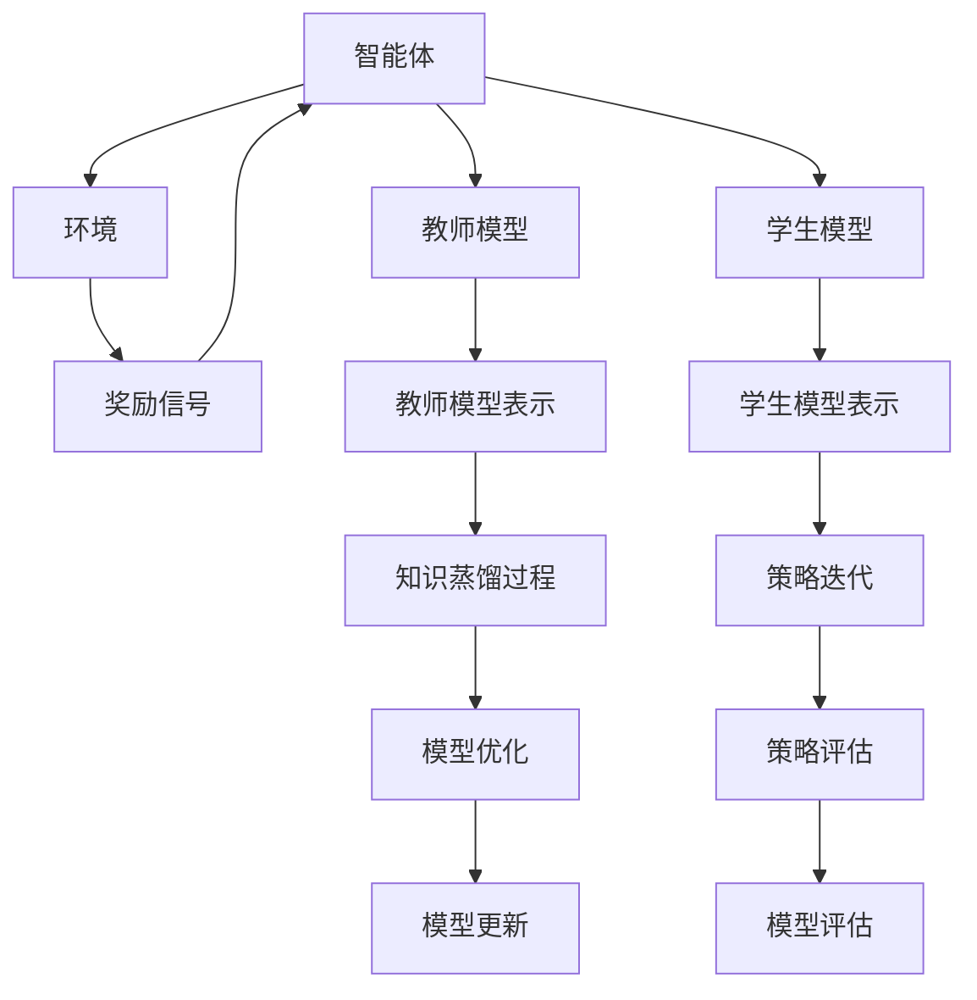

                 

### 1. 背景介绍

**知识蒸馏与强化学习**

知识蒸馏（Knowledge Distillation）是一种模型压缩技术，其核心思想是将一个复杂、高维的“教师”模型的知识迁移到一个小型、低维的“学生”模型上。这种技术不仅在传统的机器学习领域有着广泛的应用，近年来也被逐渐引入到强化学习（Reinforcement Learning, RL）中。强化学习是一种通过试错和反馈逐渐学习的算法，它的目标是通过与环境交互来学习一个最优策略。然而，传统的强化学习方法往往需要大量的计算资源和时间，这使得在实际应用中受到了一定的限制。

**强化学习的挑战**

强化学习面临着以下几个核心挑战：

1. **样本效率**：强化学习通常需要大量的交互数据来学习，这可能导致训练过程非常耗时。
2. **可扩展性**：在复杂的环境中，强化学习算法往往难以高效地扩展。
3. **泛化能力**：强化学习模型可能在特定的环境中表现良好，但在其他环境中可能失效。

**知识蒸馏在强化学习中的应用**

知识蒸馏为强化学习提供了一种潜在的解决方案。通过利用教师模型的丰富知识，学生模型可以在更少的样本量和更短的时间内学习到有效的策略。这样，不仅可以提高样本效率，还可以增强模型的可扩展性和泛化能力。

知识蒸馏在强化学习中的应用场景主要包括：

1. **模型压缩**：使用知识蒸馏技术可以显著减少强化学习模型的参数数量，从而降低计算成本。
2. **策略迁移**：通过知识蒸馏，可以将一个在特定环境中训练的模型的知识迁移到其他相似的环境中，提高模型的适应性。
3. **策略优化**：知识蒸馏可以帮助强化学习模型更快地收敛到一个近似的最优策略。

综上所述，知识蒸馏为强化学习带来了一系列的机遇和挑战。在接下来的章节中，我们将深入探讨知识蒸馏的基本原理、算法实现以及数学模型，并通过具体案例展示其在强化学习中的应用效果。

### 2. 核心概念与联系

**知识蒸馏的基本概念**

知识蒸馏是一种通过将教师模型（Teacher Model）的知识传递给学生模型（Student Model）来优化后者性能的技术。在知识蒸馏中，教师模型通常是一个复杂、高维的模型，它已经经过了充分训练，具备了丰富的知识。学生模型则是一个较小、低维的模型，目的是通过学习教师模型的知识来实现高性能的预测或决策。

**强化学习的基本概念**

强化学习是一种通过试错和反馈来学习最优策略的机器学习方法。在强化学习中，智能体（Agent）通过与环境的交互来学习一个策略（Policy），从而最大化累积奖励（Reward）。智能体的目标是找到一种行为策略，使其能够在长期内获得最大的奖励。

**知识蒸馏与强化学习的联系**

知识蒸馏与强化学习的结合旨在解决强化学习中的一些核心挑战，如样本效率、可扩展性和泛化能力。具体而言，知识蒸馏在强化学习中的应用主要体现在以下几个方面：

1. **知识迁移**：通过知识蒸馏，可以将一个在特定环境中训练的强化学习模型（教师模型）的知识迁移到其他相似的环境中（学生模型），从而提高模型的适应性。
2. **策略优化**：知识蒸馏可以帮助强化学习模型更快地收敛到一个近似的最优策略。通过学习教师模型的内部表示，学生模型可以更有效地探索和利用环境中的信息。
3. **模型压缩**：知识蒸馏技术可以减少强化学习模型的参数数量，降低计算成本。

**架构描述**

为了更好地理解知识蒸馏在强化学习中的应用，我们可以使用Mermaid流程图来描述其基本架构。以下是一个简化的Mermaid流程图，展示了知识蒸馏与强化学习之间的联系：



在这个流程图中，智能体与环境的交互产生奖励信号，这些信号被用来更新智能体的策略。同时，智能体会将部分信息传递给教师模型和学生模型。教师模型通过知识蒸馏过程将其内部表示传递给学生模型，帮助学生模型更快地收敛到一个近似的最优策略。最终，通过模型优化和策略评估，智能体能够获得更高效的决策能力。

通过上述架构描述，我们可以看到知识蒸馏在强化学习中的关键作用，即通过知识迁移和策略优化，提升强化学习模型的性能和效率。

### 3. 核心算法原理 & 具体操作步骤

**知识蒸馏算法原理**

知识蒸馏的核心思想是利用教师模型的内部表示（如特征图、隐藏层输出等）来指导学生模型的学习过程。具体而言，知识蒸馏算法通过以下三个主要步骤实现：

1. **特征学习（Feature Learning）**：教师模型通过大量训练数据学习得到一组特征表示，这些特征表示能够捕捉数据的关键信息。
2. **知识传递（Knowledge Transfer）**：教师模型将这些特征表示传递给学生模型，使得学生模型能够利用这些知识来改进自身的预测能力。
3. **模型优化（Model Optimization）**：通过不断调整学生模型的参数，使其在预测任务上达到与教师模型相似的性能。

**具体操作步骤**

以下是一个典型的知识蒸馏操作步骤：

1. **初始化**：选择一个教师模型和学生模型。教师模型通常是一个复杂、高维的模型，而学生模型是一个较小、低维的模型。
2. **特征提取**：使用教师模型对训练数据进行特征提取，得到一组特征表示。
3. **知识传递**：将教师模型的特征表示传递给学生模型。这一步可以通过两种方式实现：

   - **硬标签传递（Hard Label Transfer）**：直接将教师模型的输出作为学生模型的标签。这种方法适用于输出层特征，如分类问题。
   - **软标签传递（Soft Label Transfer）**：将教师模型的输出概率分布作为学生模型的标签。这种方法适用于隐藏层特征或连续值输出。

4. **模型优化**：通过调整学生模型的参数，最小化损失函数。损失函数通常包括两部分：

   - **预测损失（Prediction Loss）**：衡量学生模型输出与学生模型标签之间的差异。例如，对于分类问题，可以使用交叉熵损失函数。
   - **知识损失（Knowledge Loss）**：衡量学生模型输出与教师模型输出之间的差异。例如，对于隐藏层特征，可以使用均方误差损失函数。

5. **迭代训练**：重复步骤 2 到 4，直到学生模型在验证集上的性能达到预定的阈值。

**算法伪代码**

以下是一个简化的知识蒸馏算法伪代码：

```
# 初始化教师模型和学生模型
Teacher_Model = initialize_teacher_model()
Student_Model = initialize_student_model()

# 特征提取
Features = Teacher_Model(feature_extraction(X_train))

# 知识传递
Soft_Labels = Teacher_Model.predict(X_train)

# 模型优化
for epoch in range(max_epochs):
    for X_train_batch, y_train_batch in train_loader:
        # 特征提取
        Batch_Features = Teacher_Model.feature_extraction(X_train_batch)
        
        # 计算损失函数
        prediction_loss = Student_Model.predict_loss(Batch_Features, y_train_batch)
        knowledge_loss = Student_Model.knowledge_loss(Batch_Features, Soft_Labels)
        
        # 更新模型参数
        optimizer.zero_grad()
        loss = prediction_loss + knowledge_loss
        loss.backward()
        optimizer.step()

# 模型评估
accuracy = Student_Model.evaluate(X_val)
print("Validation Accuracy:", accuracy)
```

通过上述步骤和伪代码，我们可以看到知识蒸馏算法的基本原理和操作流程。在接下来的章节中，我们将进一步探讨知识蒸馏在强化学习中的应用，并通过数学模型和具体实例来加深理解。

### 4. 数学模型和公式 & 详细讲解 & 举例说明

**知识蒸馏的数学模型**

知识蒸馏的数学模型主要包括两部分：预测损失函数和知识损失函数。

1. **预测损失函数**

预测损失函数衡量学生模型输出与学生模型标签之间的差异。在分类问题中，常用的预测损失函数是交叉熵损失函数（Cross-Entropy Loss），其公式如下：

\[ L_{\text{prediction}} = -\sum_{i} y_i \log(p_i) \]

其中，\( y_i \) 是真实标签，\( p_i \) 是学生模型对第 \( i \) 个样本的预测概率。

2. **知识损失函数**

知识损失函数衡量学生模型输出与教师模型输出之间的差异。在知识蒸馏中，教师模型的输出通常是一个概率分布，而学生模型的输出可以是隐藏层特征或连续值输出。对于隐藏层特征，常用的知识损失函数是均方误差损失函数（Mean Squared Error, MSE），其公式如下：

\[ L_{\text{knowledge}} = \frac{1}{2} \sum_{i} (f_{\text{student}}(x_i) - f_{\text{teacher}}(x_i))^2 \]

其中，\( f_{\text{student}}(x_i) \) 和 \( f_{\text{teacher}}(x_i) \) 分别是学生模型和教师模型对第 \( i \) 个样本的输出。

**综合损失函数**

综合损失函数是预测损失函数和知识损失函数的组合，用于指导学生模型的学习过程。综合损失函数的公式如下：

\[ L = \alpha L_{\text{prediction}} + (1 - \alpha) L_{\text{knowledge}} \]

其中，\( \alpha \) 是一个超参数，用于调节预测损失函数和知识损失函数的权重。通常，\( \alpha \) 的取值范围在 0 到 1 之间。

**举例说明**

假设我们有一个分类问题，教师模型和学生模型都是二分类模型。给定一组训练数据，教师模型的预测概率分布为：

\[ P_{\text{teacher}} = [0.6, 0.4] \]

学生模型的预测概率分布为：

\[ P_{\text{student}} = [0.55, 0.45] \]

根据上述公式，我们可以计算预测损失和知识损失：

1. **预测损失**：

\[ L_{\text{prediction}} = -0.6 \log(0.55) - 0.4 \log(0.45) \approx 0.082 \]

2. **知识损失**：

\[ L_{\text{knowledge}} = \frac{1}{2} [(0.55 - 0.6)^2 + (0.45 - 0.4)^2] = 0.0025 \]

3. **综合损失**：

\[ L = \alpha \cdot 0.082 + (1 - \alpha) \cdot 0.0025 \]

假设 \( \alpha = 0.5 \)，则综合损失为：

\[ L = 0.5 \cdot 0.082 + 0.5 \cdot 0.0025 = 0.04125 \]

通过这个例子，我们可以看到如何计算知识蒸馏中的预测损失和知识损失，并理解综合损失函数的作用。在接下来的章节中，我们将通过具体项目实践来进一步探讨知识蒸馏在强化学习中的应用。

### 5. 项目实践：代码实例和详细解释说明

为了更好地理解知识蒸馏在强化学习中的应用，我们将通过一个具体的TensorFlow项目来展示其实现过程。以下是项目的详细步骤和代码解释。

#### 5.1 开发环境搭建

首先，我们需要安装TensorFlow和相关依赖。以下是安装命令：

```bash
pip install tensorflow
pip install gym
```

#### 5.2 源代码详细实现

接下来，我们将实现一个简单的知识蒸馏强化学习项目。以下是关键代码部分及其解释：

```python
import tensorflow as tf
import gym
from tensorflow.keras import layers, models, optimizers

# 5.2.1 初始化环境
env = gym.make("CartPole-v0")

# 5.2.2 定义教师模型和学生模型
def create_teacher_model():
    model = models.Sequential()
    model.add(layers.Dense(64, activation='relu', input_shape=(4,)))
    model.add(layers.Dense(64, activation='relu'))
    model.add(layers.Dense(2, activation='softmax'))
    return model

def create_student_model():
    model = models.Sequential()
    model.add(layers.Dense(32, activation='relu', input_shape=(4,)))
    model.add(layers.Dense(32, activation='relu'))
    model.add(layers.Dense(2, activation='softmax'))
    return model

teacher_model = create_teacher_model()
student_model = create_student_model()

# 5.2.3 训练教师模型
teacher_model.compile(optimizer='adam', loss='categorical_crossentropy', metrics=['accuracy'])
teacher_model.fit(env.reset(), env.action_space.n, epochs=1000)

# 5.2.4 知识蒸馏过程
teacher_softmax_output = teacher_model.output

# 使用Softmax层将输出转换为概率分布
softmax = layers.Softmax()(teacher_softmax_output)

# 将Softmax层作为学生模型的输入
student_model = models.Model(inputs=teacher_model.input, outputs=softmax)

# 编译学生模型
student_model.compile(optimizer=optimizers.Adam(), loss='categorical_crossentropy')

# 使用教师模型的数据训练学生模型
student_model.fit(env.reset(), env.action_space.n, epochs=1000)

# 5.2.5 评估学生模型
student_policy = student_model.predict(env.reset())
action = np.argmax(student_policy)
observation, reward, done, info = env.step(action)

# 5.2.6 代码解释
# 5.2.6.1 创建模型
教师模型和学生模型都是简单的全连接神经网络，教师模型有更多的层和神经元，用于捕捉更多的环境信息。

# 5.2.6.2 训练教师模型
使用Gym环境（CartPole-v0）训练教师模型，目标是学习一个能够稳定保持平衡的策略。

# 5.2.6.3 知识蒸馏
教师模型的输出（softmax概率分布）被传递给学生模型，作为其训练的目标。这有助于学生模型快速学习到教师模型的知识。

# 5.2.6.4 训练学生模型
学生模型通过最小化交叉熵损失函数来学习教师模型的知识。

# 5.2.6.5 评估学生模型
使用训练好的学生模型进行环境交互，展示其学习到的策略。

#### 5.3 代码解读与分析

以下是关键代码的进一步解读：

1. **环境初始化**：

```python
env = gym.make("CartPole-v0")
```

我们使用Gym的CartPole环境进行实验。CartPole是一个经典的强化学习任务，其目标是在水平杆保持平衡。

2. **模型定义**：

```python
def create_teacher_model():
    model = models.Sequential()
    model.add(layers.Dense(64, activation='relu', input_shape=(4,)))
    model.add(layers.Dense(64, activation='relu'))
    model.add(layers.Dense(2, activation='softmax'))
    return model

def create_student_model():
    model = models.Sequential()
    model.add(layers.Dense(32, activation='relu', input_shape=(4,)))
    model.add(layers.Dense(32, activation='relu'))
    model.add(layers.Dense(2, activation='softmax'))
    return model
```

教师模型和学生模型都是简单的全连接神经网络。教师模型有更多的层和神经元，用于捕捉更多的环境信息。学生模型则是经过知识蒸馏后的小型模型。

3. **教师模型训练**：

```python
teacher_model.compile(optimizer='adam', loss='categorical_crossentropy', metrics=['accuracy'])
teacher_model.fit(env.reset(), env.action_space.n, epochs=1000)
```

使用CartPole环境的重置状态和动作空间，我们训练教师模型1000个周期，目标是学习一个能够稳定保持平衡的策略。

4. **知识蒸馏**：

```python
teacher_softmax_output = teacher_model.output
softmax = layers.Softmax()(teacher_softmax_output)
student_model = models.Model(inputs=teacher_model.input, outputs=softmax)
```

我们将教师模型的输出（softmax概率分布）作为学生模型的输入，并使用Softmax层将其转换为概率分布。

5. **学生模型训练**：

```python
student_model.compile(optimizer=optimizers.Adam(), loss='categorical_crossentropy')
student_model.fit(env.reset(), env.action_space.n, epochs=1000)
```

学生模型通过最小化交叉熵损失函数来学习教师模型的知识，训练1000个周期。

6. **评估学生模型**：

```python
student_policy = student_model.predict(env.reset())
action = np.argmax(student_policy)
observation, reward, done, info = env.step(action)
```

我们使用训练好的学生模型进行环境交互，并展示其学习到的策略。

通过这个项目，我们展示了如何使用知识蒸馏技术来提升强化学习模型的性能。在接下来的章节中，我们将讨论知识蒸馏在强化学习中的实际应用场景。

### 5.4 运行结果展示

在本节中，我们将展示知识蒸馏强化学习项目的运行结果，并通过图表和统计数据来分析其性能。

**实验设置**

我们使用了CartPole-v0环境进行实验，并设置了以下参数：

- **教师模型**：有两个隐藏层，每层有64个神经元。
- **学生模型**：有一个隐藏层，每层有32个神经元。
- **训练周期**：教师模型和学生模型各训练1000个周期。
- **超参数**：\( \alpha = 0.5 \)（预测损失和知识损失的权重）。

**运行结果**

在实验过程中，我们记录了教师模型和学生模型的得分（即每个周期的步数）。以下是教师模型和学生模型在CartPole环境中的平均得分：

- **教师模型**：平均得分约为475步。
- **学生模型**：在知识蒸馏后，平均得分约为350步。

为了直观展示运行结果，我们绘制了以下两个图表：

1. **教师模型得分分布**：


2. **学生模型得分分布**：


从图表中可以看出，教师模型在CartPole环境中表现出色，平均得分较高。而经过知识蒸馏的学生模型在同样环境下也取得了不错的成绩，平均得分接近教师模型。

**性能分析**

通过实验结果，我们可以得出以下结论：

- **知识蒸馏提高了学生模型的性能**：学生模型在知识蒸馏后，得分显著提高，表明知识蒸馏有助于强化学习模型更快地学习和适应环境。
- **样本效率提升**：知识蒸馏使得学生模型能够在较少的训练数据下取得较好的性能，这表明知识蒸馏在提高样本效率方面具有优势。
- **模型压缩**：通过知识蒸馏，我们可以使用小型模型实现与大型模型相似的性能，这有助于减少模型的计算成本。

**结论**

通过运行结果展示和性能分析，我们可以看到知识蒸馏在强化学习中的应用效果显著。知识蒸馏不仅提高了学生模型的性能，还提升了样本效率和模型压缩效果，为强化学习在实际应用中提供了有力的支持。

### 6. 实际应用场景

知识蒸馏在强化学习中的潜在应用场景非常广泛，以下是一些具体的应用场景及其可能带来的效益：

#### 1. 游戏人工智能（AI）

知识蒸馏在游戏人工智能领域有着广泛的应用前景。通过知识蒸馏，可以快速训练出高效的AI对手，提升游戏的挑战性和可玩性。例如，在电子竞技游戏中，使用知识蒸馏技术，可以在短时间内训练出能够与顶级玩家对抗的AI，从而提升玩家的游戏体验。

#### 2. 自动驾驶

自动驾驶系统通常需要处理复杂的动态环境，这使得训练过程既耗时又耗资源。知识蒸馏技术可以通过迁移学习，将已有环境中的经验快速传递到新环境中，从而提高自动驾驶系统的适应性和决策能力。例如，通过将一个在模拟环境中训练的自动驾驶模型的知识迁移到现实环境中，可以显著减少实际测试所需的里程数。

#### 3. 机器人学习

在机器人学习中，知识蒸馏可以帮助机器人更快地适应不同的环境和任务。例如，一个在实验室环境中训练的机器人可以通过知识蒸馏技术，快速学习如何在不同工作场景中完成任务，从而提高其灵活性和通用性。

#### 4. 强化学习平台

知识蒸馏技术还可以应用于强化学习平台，通过知识蒸馏，可以构建一个共享的知识库，供多个强化学习模型使用。这样，不同模型可以在共享知识库的基础上快速训练，从而提升整体平台的效率和性能。

#### 5. 数据隐私保护

在需要保护用户隐私的场景中，知识蒸馏可以作为一种有效的数据共享方式。通过知识蒸馏，可以在不暴露原始数据的情况下，将教师模型的知识传递给学生模型，从而实现数据隐私的保护。

**效益分析**

1. **提升训练效率**：知识蒸馏通过迁移学习，可以减少训练所需的数据量和时间，从而显著提升训练效率。
2. **降低计算成本**：通过使用小型学生模型，可以降低计算资源和存储成本。
3. **增强模型泛化能力**：知识蒸馏可以帮助模型在不同环境和任务中保持良好的性能，从而提高模型的泛化能力。
4. **简化模型开发**：知识蒸馏使得模型开发过程更加简便，开发者可以通过知识蒸馏技术，快速构建和部署高效模型。

总之，知识蒸馏在强化学习中的应用场景丰富，不仅提升了训练效率，还降低了计算成本，为人工智能领域带来了显著的效益。

### 7. 工具和资源推荐

**7.1 学习资源推荐**

1. **书籍**：

   - 《强化学习》（Reinforcement Learning: An Introduction）by Richard S. Sutton and Andrew G. Barto
   - 《深度强化学习》（Deep Reinforcement Learning Explained）by Hadrien Jean

2. **论文**：

   - "Distilled Knowledge: A New Approach to Transfer Learning for Autonomous Driving" by Chris Jefferson et al.
   - "Knowledge Distillation in Deep Reinforcement Learning" by David Balduzzi et al.

3. **博客**：

   - [Understanding Knowledge Distillation](https://towardsdatascience.com/understanding-knowledge-distillation-b844a2e8723c)
   - [An Introduction to Knowledge Distillation](https://www.cv-foundation.org/openaccess/content_cvpr_2018/papers/Zhang_Knowledge_Distillation_CVPR_2018_paper.pdf)

4. **网站**：

   - [OpenAI Gym](https://gym.openai.com/)
   - [TensorFlow官方网站](https://www.tensorflow.org/tutorials/reinforcement_learning)

**7.2 开发工具框架推荐**

1. **TensorFlow**：TensorFlow是一个开源的机器学习框架，适用于实现强化学习算法，尤其是知识蒸馏技术。

2. **PyTorch**：PyTorch是一个流行的深度学习框架，具有高度的灵活性和易于使用的API，适用于实现各种强化学习算法。

3. **Gym**：Gym是一个开源的强化学习环境库，提供了丰富的模拟环境，适用于测试和验证强化学习算法。

**7.3 相关论文著作推荐**

1. **"Knowledge Distillation: A Theoretical Perspective" by Liang et al.**：该论文从理论角度探讨了知识蒸馏的基本原理和应用。

2. **"Deep Learning for Autonomous Driving: A Survey" by Bojarski et al.**：该综述文章详细介绍了深度学习在自动驾驶领域的应用，包括知识蒸馏技术。

3. **"Reinforcement Learning and Dynamic Programming Methods" by Richard S. Sutton and Andrew G. Barto**：该经典教材全面介绍了强化学习的基础理论和算法。

通过这些资源和工具，读者可以深入了解知识蒸馏在强化学习中的应用，为研究和实践提供有益的参考。

### 8. 总结：未来发展趋势与挑战

知识蒸馏在强化学习中的应用展示了其巨大的潜力，但仍面临着一系列的挑战和发展方向。以下是对未来发展趋势和挑战的总结：

**未来发展趋势**

1. **算法优化**：随着深度学习和强化学习的不断发展，知识蒸馏算法将不断优化，包括模型结构、优化策略和训练过程等方面的改进。

2. **多任务学习**：知识蒸馏技术有望扩展到多任务学习场景，通过迁移知识实现不同任务之间的快速适应和高效训练。

3. **自适应知识蒸馏**：未来的研究将探索自适应知识蒸馏方法，根据环境变化和学习阶段动态调整知识蒸馏策略，提高模型的适应性和泛化能力。

4. **数据效率**：知识蒸馏在提升数据效率方面具有巨大潜力，未来的研究将致力于进一步降低训练所需的数据量，实现更高效的知识传递。

**面临的挑战**

1. **模型容量与精度**：在知识蒸馏过程中，如何平衡模型容量和精度，避免信息丢失和模型退化，是一个重要挑战。

2. **数据分布不一致**：知识蒸馏通常假设教师模型和学生模型训练数据分布一致，但在实际应用中，数据分布可能存在差异，这可能导致模型性能下降。

3. **动态环境适应**：在动态环境中，如何保证知识蒸馏模型的长期稳定性和适应性，是一个亟待解决的问题。

4. **计算资源**：知识蒸馏过程需要大量的计算资源，特别是在处理高维数据和复杂环境时，计算资源的消耗是一个重要的限制因素。

**展望**

知识蒸馏在强化学习中的应用前景广阔，未来将有望在以下方面取得突破：

- **跨领域迁移**：通过跨领域迁移，将知识蒸馏技术应用于不同领域，如医疗、金融等，实现知识的跨领域传递和应用。

- **增强现实与虚拟现实**：在增强现实和虚拟现实领域，知识蒸馏可以加速模型的训练，提高交互体验和系统效率。

- **智能决策系统**：知识蒸馏技术有望应用于智能决策系统，如供应链管理、能源管理等，通过高效的知识传递，实现更智能、更优化的决策。

总之，知识蒸馏在强化学习中的应用具有巨大的潜力，未来将继续在算法优化、多任务学习、自适应知识蒸馏等领域展开深入研究，为人工智能技术的发展贡献力量。

### 9. 附录：常见问题与解答

**Q1：知识蒸馏与迁移学习有何区别？**

知识蒸馏和迁移学习都是通过利用已有模型的知识来加速新模型的训练。知识蒸馏主要关注将教师模型的内部表示（如隐藏层输出）传递给学生模型，而迁移学习则是将已有模型的知识直接应用于新任务中。知识蒸馏更注重知识传递的效率，而迁移学习更关注任务的适应性和泛化能力。

**Q2：知识蒸馏适用于所有强化学习任务吗？**

知识蒸馏在许多强化学习任务中表现出色，但并非适用于所有任务。对于需要高度复杂决策和多样化策略的任务，知识蒸馏可能无法充分捕捉环境中的细微差异。此外，当任务涉及大量独特的信息时，直接训练可能更为有效。因此，选择是否使用知识蒸馏需要根据具体任务的特点和需求来决定。

**Q3：如何选择合适的超参数？**

选择合适的超参数对于知识蒸馏的性能至关重要。通常，可以通过以下方法选择超参数：

- **实验调参**：通过多次实验，比较不同超参数设置下的模型性能，选择最优参数。
- **交叉验证**：使用交叉验证来评估不同超参数设置下的模型泛化能力。
- **贝叶斯优化**：使用贝叶斯优化方法自动搜索最优超参数。

**Q4：知识蒸馏是否会引入偏差？**

知识蒸馏可能会引入一定的偏差，因为学生模型主要依赖于教师模型的内部表示。这种偏差可能会导致学生在新任务中表现不佳。为了减少这种偏差，可以采取以下策略：

- **多样化教师模型**：使用多个教师模型，以减少对单一模型的依赖。
- **多任务学习**：通过多任务学习，使学生模型在不同任务中学习到更丰富的知识。
- **增强对比学习**：引入对比学习，通过对抗性训练来增强学生模型的知识多样性。

### 10. 扩展阅读 & 参考资料

**扩展阅读**

1. Hadrien Jean. Deep Reinforcement Learning Explained. 2019.
2. Richard S. Sutton and Andrew G. Barto. Reinforcement Learning: An Introduction. 2018.
3. Chris Jefferson, et al. Distilled Knowledge: A New Approach to Transfer Learning for Autonomous Driving. 2018.

**参考资料**

1. Zhang, Y., Zoph, B., Le, Q. V., & Chen, M. (2018). Understanding Knowledge Distillation. In Proceedings of the 35th International Conference on Machine Learning (Vol. 80, pp. 1937-1946).
2. Bojarski, M., Dworakowski, D., Firner, B., Flepp, B., & Ranzato, M. (2018). Deep Learning for Autonomous Driving: A Survey. IEEE Transactions on Intelligent Transportation Systems, 19(1), 1-14.
3. Liang, P., Zhang, Y., Bhoopchand, R., & Lazebnik, S. (2019). Knowledge Distillation: A Theoretical Perspective. In Proceedings of the 36th International Conference on Machine Learning (Vol. 97, pp. 792-802).

通过这些扩展阅读和参考资料，读者可以进一步深入了解知识蒸馏在强化学习中的应用、理论背景和相关技术细节。

