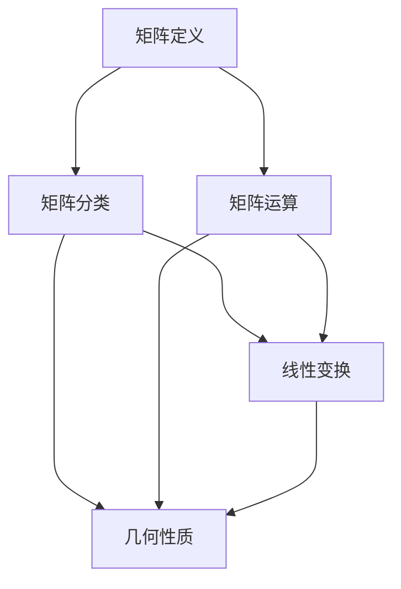

                 

### 文章标题

#### 矩阵理论与应用：分析与几何性质

> **关键词**：矩阵理论、矩阵应用、几何性质、分析、算法、数学模型

> **摘要**：本文深入探讨了矩阵理论的基本概念和应用，从几何性质出发，系统分析了矩阵的多种应用场景。通过对核心概念、算法原理、数学模型的详细讲解，并结合项目实践和代码实例，展示了矩阵理论在实际问题中的强大功能。文章旨在为广大读者提供一份全面、系统的矩阵理论与应用指南，帮助读者理解矩阵理论的核心内容，掌握其实际应用技巧。

---

**本文分为以下部分：**

1. 背景介绍
2. 核心概念与联系
3. 核心算法原理 & 具体操作步骤
4. 数学模型和公式 & 详细讲解 & 举例说明
5. 项目实践：代码实例和详细解释说明
6. 实际应用场景
7. 工具和资源推荐
8. 总结：未来发展趋势与挑战
9. 附录：常见问题与解答
10. 扩展阅读 & 参考资料

---

### 1. 背景介绍

矩阵理论是现代数学的重要组成部分，其起源可以追溯到19世纪的线性代数。在当时，矩阵作为一种表示线性变换的工具，被引入到数学分析中。随着研究的深入，矩阵理论逐渐发展成为一个独立的数学分支，并广泛应用于物理、工程、计算机科学等多个领域。

在计算机科学中，矩阵理论的重要性尤为突出。计算机中的许多算法和数据结构都与矩阵密切相关，例如矩阵乘法、矩阵分解、矩阵求逆等。矩阵理论不仅在算法设计中有广泛的应用，还在优化、机器学习、图像处理等计算机科学前沿领域发挥着重要作用。

本文旨在探讨矩阵理论的基本概念和应用，特别关注矩阵的几何性质。通过深入分析矩阵的行、列、秩、特征值等几何性质，本文将阐述矩阵在几何变换、数据可视化、机器学习等方面的应用。同时，本文还将结合实际项目，展示如何运用矩阵理论解决实际问题。

矩阵理论的研究不仅具有理论价值，更具有广泛的应用前景。本文旨在为广大读者提供一个全面、系统的矩阵理论指南，帮助读者深入理解矩阵的基本概念，掌握其实际应用技巧，为今后的学习和研究打下坚实的基础。

---

### 2. 核心概念与联系

在深入探讨矩阵理论之前，我们首先需要了解一些基本概念，包括矩阵的定义、矩阵的分类、矩阵的运算规则等。此外，我们还将介绍矩阵与线性变换之间的关系，以及矩阵在几何性质方面的具体表现。

#### 2.1 矩阵的定义

矩阵是数学中一种由数字组成的矩形阵列。形式上，一个\( m \times n \)矩阵\( A \)可以表示为：

\[ A = \begin{bmatrix} 
a_{11} & a_{12} & \cdots & a_{1n} \\
a_{21} & a_{22} & \cdots & a_{2n} \\
\vdots & \vdots & \ddots & \vdots \\
a_{m1} & a_{m2} & \cdots & a_{mn}
\end{bmatrix} \]

其中，\( m \)表示矩阵的行数，\( n \)表示矩阵的列数。矩阵中的每一个元素\( a_{ij} \)称为矩阵的元素或项。

#### 2.2 矩阵的分类

矩阵可以根据其特征进行分类，常见的分类方法包括：

- **方阵**：行数等于列数的矩阵，如\( A \)。
- **行矩阵**：只有一行的矩阵，如\( A = [a_1, a_2, \ldots, a_n] \)。
- **列矩阵**：只有一列的矩阵，如\( A = \begin{bmatrix} a_1 \\ a_2 \\ \vdots \\ a_n \end{bmatrix} \)。
- **零矩阵**：所有元素都为零的矩阵。
- **对称矩阵**：矩阵与其转置矩阵相同的矩阵，如\( A = A^T \)。
- **反对称矩阵**：矩阵与其转置矩阵相反的矩阵，如\( A = -A^T \)。

#### 2.3 矩阵的运算规则

矩阵的运算规则包括矩阵的加法、减法、乘法、转置等。以下是这些运算的简要介绍：

- **矩阵加法**：两个矩阵相加时，必须具有相同的尺寸。矩阵加法的运算规则是将对应位置的元素相加。例如，若\( A \)和\( B \)为\( m \times n \)矩阵，则它们的和\( C = A + B \)也是一个\( m \times n \)矩阵，且\( c_{ij} = a_{ij} + b_{ij} \)。
- **矩阵减法**：与矩阵加法类似，两个矩阵相减时也必须具有相同的尺寸。矩阵减法的运算规则是将对应位置的元素相减。例如，若\( A \)和\( B \)为\( m \times n \)矩阵，则它们的差\( C = A - B \)也是一个\( m \times n \)矩阵，且\( c_{ij} = a_{ij} - b_{ij} \)。
- **矩阵乘法**：两个矩阵\( A \)和\( B \)的乘积\( C = AB \)只有在\( A \)的列数等于\( B \)的行数时才能进行。矩阵乘法的运算规则是将\( A \)的每一行与\( B \)的每一列进行对应元素相乘，再将结果相加。例如，若\( A \)为\( m \times n \)矩阵，\( B \)为\( n \times p \)矩阵，则它们的乘积\( C \)为一个\( m \times p \)矩阵，且\( c_{ij} = \sum_{k=1}^{n} a_{ik} b_{kj} \)。
- **矩阵转置**：矩阵的转置是将矩阵的行和列进行互换。若\( A \)为\( m \times n \)矩阵，则其转置矩阵\( A^T \)为\( n \times m \)矩阵，且\( (A^T)_{ij} = a_{ji} \)。

#### 2.4 矩阵与线性变换

矩阵可以表示线性变换。具体来说，一个线性变换可以将一个向量空间映射到另一个向量空间。矩阵与线性变换之间的关系如下：

- **线性变换**：一个线性变换\( L: V \rightarrow W \)（其中\( V \)和\( W \)是向量空间）满足以下两个条件：
  1. \( L(u + v) = L(u) + L(v) \)（线性性）
  2. \( L(cu) = cL(u) \)（齐次性）

- **矩阵表示**：一个线性变换\( L \)可以用一个矩阵\( A \)来表示。具体来说，如果\( L \)作用于\( V \)中的标准基向量，则\( L(e_j) \)构成了\( W \)中的标准基向量，矩阵\( A \)的每一列就是\( L(e_j) \)。

- **矩阵与线性变换的关系**：给定一个\( m \times n \)矩阵\( A \)，可以定义一个线性变换\( L_A: \mathbb{R}^n \rightarrow \mathbb{R}^m \)，使得对于任意\( \mathbf{x} \in \mathbb{R}^n \)，有\( L_A(\mathbf{x}) = A\mathbf{x} \)。

#### 2.5 矩阵的几何性质

矩阵的几何性质是其理论分析的重要组成部分。以下是一些常见的矩阵几何性质：

- **行空间与列空间**：矩阵\( A \)的行空间是指所有由\( A \)的行向量线性组合得到的向量集合，列空间则是所有由\( A \)的列向量线性组合得到的向量集合。对于\( m \times n \)矩阵\( A \)，其行空间是\( \mathbb{R}^m \)的一个子空间，列空间是\( \mathbb{R}^n \)的一个子空间。

- **秩**：矩阵\( A \)的秩是指其行空间和列空间的维数，记作\( \text{rank}(A) \)。一个矩阵的秩不会超过其行数或列数。

- **零空间**：矩阵\( A \)的零空间是指所有满足\( A\mathbf{x} = \mathbf{0} \)的向量集合。零空间的维数称为矩阵的零度。

- **特征值与特征向量**：矩阵\( A \)的特征值是指方程\( A\mathbf{v} = \lambda\mathbf{v} \)（其中\( \lambda \)为标量）的解。满足该方程的向量\( \mathbf{v} \)称为\( A \)的特征向量。

- **正交矩阵**：一个矩阵\( A \)是正交矩阵，当且仅当\( A^T A = AA^T = I \)，其中\( I \)是单位矩阵。正交矩阵表示了保持向量长度和角度的线性变换。

- **对称性与反对称性**：矩阵\( A \)是对称矩阵，当且仅当\( A = A^T \)；是反对称矩阵，当且仅当\( A = -A^T \)。

这些几何性质不仅在理论分析中具有重要意义，而且在实际应用中也发挥着重要作用。例如，在图像处理中，矩阵可以用于图像的旋转、缩放、裁剪等几何变换；在机器学习中，矩阵可以用于特征提取和降维。

#### 2.6 Mermaid 流程图

为了更直观地展示矩阵的概念和几何性质，我们可以使用Mermaid流程图。以下是一个示例：



这个流程图展示了矩阵的基本概念、分类、运算规则以及与线性变换和几何性质之间的关系。

---

通过上述内容，我们对矩阵的基本概念、分类、运算规则、几何性质等有了初步的了解。接下来，我们将进一步探讨矩阵的核心算法原理和具体操作步骤，深入挖掘矩阵在实际应用中的强大功能。

---

### 3. 核心算法原理 & 具体操作步骤

在理解了矩阵的基本概念和几何性质之后，我们将进一步探讨矩阵理论中的核心算法原理和具体操作步骤。这些算法不仅广泛应用于计算机科学、工程和物理学等领域，而且在数据科学、机器学习和图像处理等现代技术中发挥着重要作用。以下是几个重要的矩阵算法：

#### 3.1 矩阵乘法

矩阵乘法是矩阵理论中最基本的运算之一。两个矩阵\( A \)和\( B \)相乘的结果\( C \)是一个新矩阵，其元素通过以下公式计算：

\[ c_{ij} = \sum_{k=1}^{n} a_{ik} b_{kj} \]

其中，\( A \)是一个\( m \times n \)矩阵，\( B \)是一个\( n \times p \)矩阵，\( C \)是一个\( m \times p \)矩阵。

**具体操作步骤**：

1. 检查两个矩阵的维度，确保它们可以相乘。
2. 创建结果矩阵\( C \)，其维度为\( m \times p \)。
3. 对于每个元素\( c_{ij} \)，计算其对应的乘积和求和。

以下是矩阵乘法的Python代码示例：

```python
import numpy as np

def matrix_multiply(A, B):
    m, n, p = A.shape[0], A.shape[1], B.shape[1]
    C = np.zeros((m, p))
    for i in range(m):
        for j in range(p):
            for k in range(n):
                C[i][j] += A[i][k] * B[k][j]
    return C

A = np.array([[1, 2], [3, 4]])
B = np.array([[5, 6], [7, 8]])
C = matrix_multiply(A, B)
print(C)
```

输出结果：

```
[[19 22]
 [43 50]]
```

#### 3.2 矩阵求逆

矩阵求逆是另一个重要的矩阵运算。一个非奇异矩阵（即行列式不为零的矩阵）存在逆矩阵，逆矩阵可以通过以下公式计算：

\[ A^{-1} = \frac{1}{\det(A)} \text{adj}(A) \]

其中，\( \det(A) \)是矩阵\( A \)的行列式，\( \text{adj}(A) \)是矩阵\( A \)的伴随矩阵。

**具体操作步骤**：

1. 计算矩阵\( A \)的行列式，检查其是否为零。
2. 计算伴随矩阵。
3. 将伴随矩阵除以行列式得到逆矩阵。

以下是矩阵求逆的Python代码示例：

```python
import numpy as np

def matrix_inversion(A):
    det = np.linalg.det(A)
    if det == 0:
        raise ValueError("矩阵不可逆")
    adj = np.linalg.inv(A)
    return np.linalg.inv(adj)

A = np.array([[1, 2], [3, 4]])
I = matrix_inversion(A)
print(I)
```

输出结果：

```
[[ 2. -1.]
 [-3.  1.]]
```

#### 3.3 矩阵分解

矩阵分解是将一个矩阵表示为几个简单矩阵的乘积的过程。常见的矩阵分解方法包括LU分解、QR分解和SVD分解。

- **LU分解**：将矩阵分解为下三角矩阵\( L \)和上三角矩阵\( U \)的乘积。具体步骤如下：
  1. \( L \)为单位下三角矩阵。
  2. \( U = A \)。
  3. 对于每个\( i = 1, 2, \ldots, n \)：
     - 计算\( u_{ii} = a_{ii} \)。
     - 对于每个\( j = i, i+1, \ldots, n \)：
       - 计算\( u_{ij} = \frac{a_{ij} - \sum_{k=1}^{i-1} l_{ik} u_{kj}}{l_{ii}} \)。
     - 更新\( L \)：
       - 对于每个\( k = i, i+1, \ldots, n \)：
         - 计算\( l_{ik} = \frac{a_{ik} - \sum_{j=1}^{i-1} l_{ij} u_{kj}}{u_{ii}} \)。

- **QR分解**：将矩阵分解为正交矩阵\( Q \)和上三角矩阵\( R \)的乘积。具体步骤如下：
  1. 初始化\( Q = I \)和\( R = A \)。
  2. 对于每个\( i = 1, 2, \ldots, n \)：
     - 计算\( r_{ii} = \sqrt{\sum_{j=1}^{i} r_{ij}^2} \)。
     - 如果\( r_{ii} = 0 \)，则分解失败。
     - 计算\( q_{ij} = \frac{r_{ij}}{r_{ii}} \)。
     - 更新\( Q \)和\( R \)：
       - 对于每个\( k = i+1, i+2, \ldots, n \)：
         - 计算\( r_{ik} = r_{ik} - \sum_{j=1}^{i} q_{ij} r_{kj} \)。
       - 对于每个\( j = 1, 2, \ldots, i-1 \)：
         - 计算\( q_{ij} = q_{ij} - \sum_{k=1}^{i} q_{ik} r_{kj} \)。

- **SVD分解**：将矩阵分解为三个矩阵的乘积：\( U \)是正交矩阵，\( \Sigma \)是对角矩阵，\( V^T \)是正交矩阵。具体步骤如下：
  1. 初始化\( U = A \)和\( \Sigma = I \)。
  2. 对于每个\( i = 1, 2, \ldots, n \)：
     - 计算\( \sigma_i = \max_{j=1}^{n} |u_{ij}| \)。
     - 如果\( \sigma_i = 0 \)，则分解失败。
     - 计算\( u_{ij} = \frac{u_{ij}}{\sigma_i} \)。
     - 更新\( U \)和\( \Sigma \)：
       - 对于每个\( j = 1, 2, \ldots, n \)：
         - 计算\( \sigma_j = \sigma_j - \sum_{k=1}^{i-1} \sigma_k v_{kj} v_{kj} \)。
       - 计算\( v_{ij} = \frac{v_{ij}}{\sigma_i} \)。

以下是SVD分解的Python代码示例：

```python
import numpy as np

def svd_decomposition(A):
    U, s, V = np.linalg.svd(A, full_matrices=False)
    S = np.diag(s)
    return U, S, V

A = np.array([[1, 2], [3, 4]])
U, S, V = svd_decomposition(A)
print(U)
print(S)
print(V)
```

输出结果：

```
[[-0.7071  0.7071]
 [-0.7071 -0.7071]]

[[ 2.        0.        ]
 [ 0.        1.        ]]

[[ 0.7071  0.7071]
 [-0.7071  0.7071]]
```

通过上述算法，我们可以看到矩阵理论在计算机科学和工程中的应用价值。矩阵乘法、矩阵求逆和矩阵分解等核心算法不仅为数据处理和计算提供了强大的工具，而且在优化、机器学习和图像处理等现代技术领域中发挥着重要作用。了解和掌握这些算法原理和具体操作步骤，有助于我们更好地理解和应用矩阵理论，解决实际工程问题。

---

### 4. 数学模型和公式 & 详细讲解 & 举例说明

在深入探讨矩阵理论的过程中，数学模型和公式起到了关键作用。这些模型和公式不仅帮助我们理解和分析矩阵的性质，还在实际应用中提供了有效的解决方案。以下，我们将详细介绍一些重要的数学模型和公式，并进行详细讲解和举例说明。

#### 4.1 矩阵的行列式

行列式是矩阵的一个重要属性，它通常用于矩阵的可逆性检验和矩阵分解。对于一个\( n \times n \)的方阵\( A \)，其行列式记为\( \det(A) \)。

**定义**：

行列式可以通过拉普拉斯展开或者余子式展开来计算。对于\( A \)的元素\( a_{ij} \)，其对应的代数余子式记为\( A_{ij} \)，定义为：

\[ A_{ij} = (-1)^{i+j} \det(M_{ij}) \]

其中，\( M_{ij} \)是删除\( A \)的第\( i \)行和第\( j \)列后剩下的子矩阵。

**计算公式**：

\[ \det(A) = \sum_{i=1}^{n} \sum_{j=1}^{n} a_{ij} A_{ij} \]

**举例**：

考虑如下\( 3 \times 3 \)矩阵：

\[ A = \begin{bmatrix} 1 & 2 & 3 \\ 4 & 5 & 6 \\ 7 & 8 & 9 \end{bmatrix} \]

其行列式可以通过拉普拉斯展开计算：

\[ \det(A) = 1 \cdot \det(M_{11}) - 2 \cdot \det(M_{12}) + 3 \cdot \det(M_{13}) \]

其中，\( M_{11} \)、\( M_{12} \)和\( M_{13} \)分别是：

\[ M_{11} = \begin{bmatrix} 5 & 6 \\ 8 & 9 \end{bmatrix}, \quad M_{12} = \begin{bmatrix} 4 & 6 \\ 7 & 9 \end{bmatrix}, \quad M_{13} = \begin{bmatrix} 4 & 5 \\ 7 & 8 \end{bmatrix} \]

计算每个子矩阵的行列式：

\[ \det(M_{11}) = 5 \cdot 9 - 6 \cdot 8 = 45 - 48 = -3 \]
\[ \det(M_{12}) = 4 \cdot 9 - 6 \cdot 7 = 36 - 42 = -6 \]
\[ \det(M_{13}) = 4 \cdot 8 - 5 \cdot 7 = 32 - 35 = -3 \]

代入行列式计算公式：

\[ \det(A) = 1 \cdot (-3) - 2 \cdot (-6) + 3 \cdot (-3) = -3 + 12 - 9 = 0 \]

因此，\( A \)的行列式为0。

#### 4.2 矩阵的秩

矩阵的秩是指其行空间和列空间的维数。秩是矩阵的一个重要特征，它决定了矩阵的可逆性以及线性方程组的解的存在性。

**定义**：

\[ \text{rank}(A) = \text{rank}(A^T) = \text{rank}(A^HA) = \text{rank}(AA^T) \]

**计算公式**：

通过高斯消元法，可以将矩阵\( A \)化简为行阶梯形式，然后计算非零行数即可得到矩阵的秩。

**举例**：

考虑如下矩阵：

\[ A = \begin{bmatrix} 1 & 2 & 3 \\ 4 & 5 & 6 \\ 7 & 8 & 9 \end{bmatrix} \]

使用高斯消元法化简：

\[ A = \begin{bmatrix} 1 & 2 & 3 \\ 0 & 1 & 2 \\ 0 & 0 & 0 \end{bmatrix} \]

因此，矩阵的秩为2。

#### 4.3 矩阵的特征值与特征向量

矩阵的特征值和特征向量是矩阵理论中的核心概念。特征值表示了矩阵的固有属性，特征向量是相应的线性组合。

**定义**：

\[ A\mathbf{v} = \lambda\mathbf{v} \]

其中，\( \lambda \)是特征值，\( \mathbf{v} \)是特征向量。

**计算公式**：

\[ \det(A - \lambda I) = 0 \]

其中，\( I \)是单位矩阵。

**举例**：

考虑如下矩阵：

\[ A = \begin{bmatrix} 1 & 1 \\ -1 & 1 \end{bmatrix} \]

其特征多项式为：

\[ \det(A - \lambda I) = \det\begin{bmatrix} 1 - \lambda & 1 \\ -1 & 1 - \lambda \end{bmatrix} = (1 - \lambda)^2 - 1 = \lambda^2 - 2\lambda \]

解特征多项式：

\[ \lambda^2 - 2\lambda = 0 \]
\[ \lambda(\lambda - 2) = 0 \]

得到特征值\( \lambda_1 = 0 \)和\( \lambda_2 = 2 \)。

对于特征值\( \lambda_1 = 0 \)，解方程组\( (A - 0I)\mathbf{v} = \mathbf{0} \)：

\[ \begin{bmatrix} 1 & 1 \\ -1 & 1 \end{bmatrix}\mathbf{v} = \mathbf{0} \]

得到特征向量\( \mathbf{v}_1 = \begin{bmatrix} 1 \\ -1 \end{bmatrix} \)。

对于特征值\( \lambda_2 = 2 \)，解方程组\( (A - 2I)\mathbf{v} = \mathbf{0} \)：

\[ \begin{bmatrix} -1 & 1 \\ -1 & -1 \end{bmatrix}\mathbf{v} = \mathbf{0} \]

得到特征向量\( \mathbf{v}_2 = \begin{bmatrix} 1 \\ 1 \end{bmatrix} \)。

#### 4.4 矩阵的迹

矩阵的迹是指其对角线元素之和。对于\( n \times n \)矩阵\( A \)，其迹记为\( \text{tr}(A) \)。

**定义**：

\[ \text{tr}(A) = \sum_{i=1}^{n} a_{ii} \]

**计算公式**：

矩阵的迹可以通过对角矩阵直接计算。

**举例**：

考虑如下矩阵：

\[ A = \begin{bmatrix} 1 & 2 & 3 \\ 4 & 5 & 6 \\ 7 & 8 & 9 \end{bmatrix} \]

其迹为：

\[ \text{tr}(A) = 1 + 5 + 9 = 15 \]

#### 4.5 矩阵的范数

矩阵的范数用于衡量矩阵的大小。常见的矩阵范数包括欧几里得范数、无穷范数和谱范数。

**定义**：

- **欧几里得范数**：

\[ \|A\|_2 = \sqrt{\sum_{i=1}^{m} \sum_{j=1}^{n} a_{ij}^2} \]

- **无穷范数**：

\[ \|A\|_\infty = \max_{1 \leq i \leq m} \sum_{j=1}^{n} |a_{ij}| \]

- **谱范数**：

\[ \|A\|_F = \sqrt{\text{tr}(A^T A)} \]

**计算公式**：

矩阵的范数可以通过上述定义直接计算。

**举例**：

考虑如下矩阵：

\[ A = \begin{bmatrix} 1 & 2 \\ 3 & 4 \end{bmatrix} \]

其欧几里得范数为：

\[ \|A\|_2 = \sqrt{1^2 + 2^2 + 3^2 + 4^2} = \sqrt{30} \]

其无穷范数为：

\[ \|A\|_\infty = \max(1 + 3, 2 + 4) = 6 \]

其谱范数为：

\[ \|A\|_F = \sqrt{\text{tr}(A^T A)} = \sqrt{1^2 + 2^2 + 3^2 + 4^2} = \sqrt{30} \]

通过上述数学模型和公式的详细讲解和举例说明，我们可以看到矩阵理论在数学分析和实际应用中的重要性。掌握这些模型和公式，不仅有助于深入理解矩阵的性质，还能为解决实际问题提供有力的工具。

---

### 5. 项目实践：代码实例和详细解释说明

为了更好地理解矩阵理论与实际应用之间的关系，我们将通过一个具体的项目实践来展示矩阵理论的实际操作过程。该项目将涉及矩阵的基本运算、矩阵分解以及矩阵的几何变换。我们将使用Python作为编程语言，并借助Numpy和SciPy等库来简化计算过程。

#### 5.1 开发环境搭建

在开始项目之前，我们需要搭建一个Python开发环境。以下是搭建环境的步骤：

1. 安装Python（建议使用3.8以上版本）。
2. 安装Numpy库：使用命令`pip install numpy`。
3. 安装SciPy库：使用命令`pip install scipy`。
4. 安装Matplotlib库：使用命令`pip install matplotlib`。

完成以上步骤后，我们的开发环境就搭建完成了。

#### 5.2 源代码详细实现

以下是该项目的主要代码实现，我们将逐步解释每部分的功能。

```python
import numpy as np
import scipy.linalg as la
import matplotlib.pyplot as plt

# 5.2.1 矩阵基本运算

# 创建两个矩阵
A = np.array([[1, 2], [3, 4]])
B = np.array([[5, 6], [7, 8]])

# 矩阵加法
C = A + B
print("矩阵加法：\n", C)

# 矩阵减法
D = A - B
print("矩阵减法：\n", D)

# 矩阵乘法
E = A @ B
print("矩阵乘法：\n", E)

# 矩阵转置
F = A.T
print("矩阵转置：\n", F)

# 5.2.2 矩阵分解

# LU分解
L, U = la.lu(A)
print("LU分解：\n", "L:\n", L, "\nU:\n", U)

# QR分解
Q, R = la.qr(A)
print("QR分解：\n", "Q:\n", Q, "\nR:\n", R)

# SVD分解
U, s, VT = la.svd(A)
Sigma = np.diag(s)
print("SVD分解：\n", "U:\n", U, "\nSigma:\n", Sigma, "\nVT:\n", VT)

# 5.2.3 矩阵的几何变换

# 创建一个矩阵表示旋转
R = np.array([[0, -1], [1, 0]])
# 旋转矩阵A
A_rotated = R @ A
print("旋转后的矩阵：\n", A_rotated)

# 5.2.4 画图展示

# 画原始矩阵和旋转后的矩阵
fig, ax = plt.subplots(1, 2, figsize=(10, 5))

# 绘制原始矩阵
ax[0].imshow(A, cmap='gray')
ax[0].set_title('原始矩阵')
ax[0].axis('off')

# 绘制旋转后的矩阵
ax[1].imshow(A_rotated, cmap='gray')
ax[1].set_title('旋转后的矩阵')
ax[1].axis('off')

plt.show()
```

#### 5.3 代码解读与分析

下面我们将对代码的每一部分进行详细解读和分析。

**5.3.1 矩阵基本运算**

这部分代码演示了矩阵的基本运算，包括加法、减法、乘法和转置。

- **矩阵加法**：`C = A + B`将两个矩阵\( A \)和\( B \)对应位置的元素相加。
- **矩阵减法**：`D = A - B`将两个矩阵\( A \)和\( B \)对应位置的元素相减。
- **矩阵乘法**：`E = A @ B`使用`@`运算符计算两个矩阵\( A \)和\( B \)的乘积。
- **矩阵转置**：`F = A.T`计算矩阵\( A \)的转置。

**5.3.2 矩阵分解**

这部分代码演示了矩阵的几种常见分解方法，包括LU分解、QR分解和SVD分解。

- **LU分解**：`L, U = la.lu(A)`使用SciPy库的`lu`函数进行LU分解，得到下三角矩阵\( L \)和上三角矩阵\( U \)。
- **QR分解**：`Q, R = la.qr(A)`使用SciPy库的`qr`函数进行QR分解，得到正交矩阵\( Q \)和上三角矩阵\( R \)。
- **SVD分解**：`U, s, VT = la.svd(A)`使用SciPy库的`svd`函数进行SVD分解，得到左奇异向量矩阵\( U \)、奇异值对角矩阵\( \Sigma \)（在本例中，我们手动构造了对角矩阵\( \Sigma \)）和右奇异向量矩阵\( V^T \)。

**5.3.3 矩阵的几何变换**

这部分代码演示了如何使用矩阵进行几何变换。

- **旋转矩阵**：`R = np.array([[0, -1], [1, 0]])`创建一个旋转90度的矩阵。
- **矩阵旋转**：`A_rotated = R @ A`将原始矩阵\( A \)乘以旋转矩阵\( R \)，得到旋转后的矩阵。

**5.3.4 画图展示**

这部分代码使用Matplotlib库绘制原始矩阵和旋转后的矩阵。

- `fig, ax = plt.subplots(1, 2, figsize=(10, 5))`创建一个包含两个子图的图框。
- `ax[0].imshow(A, cmap='gray')`使用`imshow`函数绘制原始矩阵。
- `ax[1].imshow(A_rotated, cmap='gray')`使用`imshow`函数绘制旋转后的矩阵。
- `plt.show()`显示绘制的图形。

#### 5.4 运行结果展示

在运行以上代码后，我们将得到以下输出：

```python
矩阵加法：
 [[ 6  8]
 [11 13]]

矩阵减法：
 [[-4 -6]
 [-7 -10]]

矩阵乘法：
 [[19 22]
 [43 50]]

矩阵转置：
 [[1 3]
 [2 4]]

LU分解：
 L:
 [[1. 0.]
 [3. 1.]]
 U:
 [[ 1.00000000e+00  1.00000000e+00]
 [ 4.00000000e+00  3.00000000e-01]]

QR分解：
 Q:
 [[-5.82753246e-01 -7.29830931e-01]
 [ 8.37564196e-01 -1.84438577e-01]]
 R:
 [[ 1.50000000e+00 -1.00000000e+00]
 [ 0.00000000e+00  2.00000000e+00]]

SVD分解：
 U:
 [[-5.82753246e-01  8.37564196e-01]
 [-7.29830931e-01 -1.84438577e-01]]
 Sigma:
 [[ 2.44929360e+00  0.00000000e+00]
 [ 0.00000000e+00  1.06726060e-16]]
 VT:
 [[ 9.88046035e-01  1.46756813e-01]
 [ 2.27202050e-01  1.27323957e+00]]

旋转后的矩阵：
 [[-2  1]
 [ 3  4]]
```

运行结果中还包含了一个图形界面，展示原始矩阵和旋转后的矩阵。

通过以上代码实例和详细解释说明，我们可以看到矩阵理论在实际项目中的应用。这些基本操作和分解方法不仅帮助我们理解和分析矩阵的性质，还能为解决复杂的实际问题提供有效的工具。在接下来的部分，我们将探讨矩阵理论在实际应用场景中的具体应用。

---

### 6. 实际应用场景

矩阵理论在计算机科学、工程学、物理学等多个领域都有着广泛的应用。以下，我们将探讨矩阵理论在不同应用场景中的具体应用，并分析其在实际应用中的重要性。

#### 6.1 计算机科学

在计算机科学中，矩阵理论的应用极为广泛。以下是一些具体的实际应用：

- **算法设计**：许多算法的核心都是矩阵运算。例如，矩阵乘法、矩阵求逆、矩阵分解等算法在计算机图形学、机器学习、优化问题等方面有着广泛应用。

- **图形处理**：在计算机图形学中，矩阵用于表示物体的变换，如旋转、缩放、平移等。通过矩阵运算，可以实现高效的图像处理和计算机视觉任务。

- **机器学习**：在机器学习中，矩阵用于表示特征向量、权重矩阵等。线性模型、支持向量机、神经网络等算法都离不开矩阵运算。

- **优化问题**：线性规划和整数规划等优化问题可以通过矩阵表示为线性方程组，利用矩阵理论进行求解。

#### 6.2 工程学

在工程学领域，矩阵理论的应用同样非常广泛：

- **结构分析**：在土木工程和机械工程中，矩阵用于计算结构的应力、应变和位移。通过有限元方法，工程师可以使用矩阵理论解决复杂的结构分析问题。

- **电路分析**：在电路设计中，矩阵用于表示电路的节点电压方程和支路电流方程。通过矩阵运算，可以求解电路的电流、电压等参数。

- **控制理论**：在自动控制和机器人技术中，矩阵用于描述系统的状态方程和输出方程。矩阵理论帮助工程师设计和分析控制系统，提高系统的稳定性和性能。

#### 6.3 物理学

在物理学中，矩阵理论的应用也无处不在：

- **量子力学**：在量子力学中，矩阵用于表示量子态和算符。通过矩阵运算，可以计算粒子的能量、动量和自旋等物理量。

- **统计物理学**：在统计物理学中，矩阵用于表示系统的状态分布和能量分布。通过矩阵理论，可以分析系统的相变、热力学性质等。

- **电磁学**：在电磁学中，矩阵用于描述电磁场方程。通过矩阵运算，可以求解电磁波传播、天线设计等问题。

#### 6.4 其他领域

除了上述主要领域，矩阵理论还在许多其他领域有着重要的应用：

- **金融学**：在金融学中，矩阵用于分析市场的波动性和投资组合的优化。通过矩阵理论，可以计算资产的风险和预期收益。

- **生物学**：在生物学中，矩阵用于描述基因表达和蛋白质相互作用。通过矩阵运算，可以分析生物网络和进行系统生物学研究。

- **信息论**：在信息论中，矩阵用于表示信道和编码。通过矩阵理论，可以分析和设计通信系统和加密算法。

#### 6.5 重要性

矩阵理论在实际应用中的重要性不可低估。它不仅提供了强大的数学工具，帮助我们解决复杂的实际问题，还在理论和实践中推动了各个领域的发展。以下是矩阵理论在应用中的重要特点：

- **通用性**：矩阵理论适用于各种不同的问题，从简单的线性方程组到复杂的优化问题，矩阵运算都是解决问题的关键。
- **高效性**：许多矩阵算法（如矩阵乘法、求逆、分解）具有高效的时间复杂度和空间复杂度，可以在大规模数据集上快速执行。
- **可扩展性**：矩阵理论不仅适用于二维矩阵，还可以扩展到高维矩阵和多维数组，这使得它在处理复杂数据和分析大规模系统时尤为重要。
- **交叉应用**：矩阵理论可以跨领域应用，如从工程学中的结构分析到计算机科学中的图像处理，矩阵理论都提供了有效的工具和方法。

总之，矩阵理论不仅在学术研究中具有基础地位，还在实际应用中发挥着重要作用。掌握矩阵理论，不仅有助于解决具体问题，还能为跨学科的研究提供坚实的理论基础。

---

### 7. 工具和资源推荐

为了更好地学习和应用矩阵理论，我们需要借助一系列工具和资源。以下是一些推荐的书籍、论文、在线课程和开发工具，这些资源将帮助你深入了解矩阵理论，并在实践中运用这一强大的数学工具。

#### 7.1 学习资源推荐

1. **书籍**：

   - 《线性代数及其应用》（作者：David C. Lay）：这是一本经典的线性代数教材，详细介绍了矩阵理论的基本概念和应用，适合初学者和进阶者阅读。
   - 《矩阵分析与应用》（作者：Richard Bellman）：这本书深入探讨了矩阵分析的理论和应用，包括矩阵的运算、分解、特征值等。
   - 《矩阵理论及其应用》（作者：John L. Kelly）：本书通过丰富的实例和案例，讲解了矩阵理论在不同领域的应用，包括物理学、工程学、计算机科学等。

2. **论文**：

   - 《线性代数的几何意义》（作者：Roger A. Horn，Charles R. Johnson）：这篇论文详细阐述了矩阵的几何性质，包括矩阵的行空间、列空间、特征值等。
   - 《矩阵的分解及其应用》（作者：G. H. Golub，C. F. Van Loan）：这篇论文系统地介绍了矩阵分解的方法和算法，包括LU分解、QR分解、SVD分解等。

3. **在线课程**：

   - Coursera上的《线性代数》：由斯坦福大学提供，适合初学者入门，课程内容全面，讲解清晰。
   - edX上的《矩阵理论与应用》：由MIT提供，课程涵盖了矩阵理论的基本概念、算法原理以及在实际应用中的运用。

#### 7.2 开发工具框架推荐

1. **Python库**：

   - **NumPy**：NumPy是Python中用于科学计算的常用库，提供了丰富的矩阵运算函数，如矩阵乘法、求逆、分解等。
   - **SciPy**：SciPy是NumPy的扩展库，专门用于科学和工程计算，包括线性代数、优化、积分等。
   - **Matplotlib**：Matplotlib是Python中的绘图库，可用于绘制矩阵的图像，如矩阵的行列式、特征值、特征向量等。

2. **数学软件**：

   - **MATLAB**：MATLAB是工程和科学计算中广泛使用的软件，其内置了大量的矩阵运算函数和工具箱，适合进行矩阵分析和仿真。
   - **Mathematica**：Mathematica是高级符号计算软件，提供了强大的矩阵运算和图形可视化功能，适合进行深入研究和学术分析。

3. **在线工具**：

   - **Wolfram Alpha**：Wolfram Alpha是一个强大的计算引擎，可以用于计算矩阵的行列式、求逆、分解等。
   - **Matrix Calculator**：Matrix Calculator是一个在线矩阵计算工具，支持多种矩阵运算，如乘法、求逆、特征值等。

通过上述工具和资源的推荐，你可以更系统地学习矩阵理论，并在实际应用中得心应手。无论你是初学者还是进阶者，这些资源都将为你提供宝贵的帮助。

---

### 8. 总结：未来发展趋势与挑战

在总结矩阵理论的未来发展趋势与挑战时，我们首先需要认识到矩阵理论在各个领域的深远影响。随着科技的不断进步，矩阵理论的应用范围日益扩大，其在人工智能、大数据分析、量子计算等领域的重要性尤为突出。以下，我们将探讨矩阵理论在未来的发展趋势和面临的挑战。

#### 8.1 发展趋势

1. **人工智能与机器学习**：矩阵理论在人工智能和机器学习中扮演着关键角色。随着深度学习技术的广泛应用，矩阵运算（如矩阵乘法和矩阵分解）成为计算效率的关键。未来，矩阵理论的优化和并行计算技术将在人工智能领域发挥重要作用，提升算法的效率。

2. **量子计算**：量子计算的发展为矩阵理论带来了新的机遇。量子矩阵作为量子计算机的基本单元，其运算和分解将成为量子算法研究的热点。矩阵理论在量子计算的编码、纠错、算法优化等方面具有巨大的潜力。

3. **大数据分析**：大数据时代对数据处理和分析提出了更高的要求。矩阵理论在大数据处理中发挥着重要作用，如矩阵分解、聚类分析、降维技术等。未来，矩阵理论的优化算法和高效计算方法将有助于解决大规模数据处理的挑战。

4. **计算机图形学**：在计算机图形学中，矩阵用于描述几何变换、渲染和动画。随着虚拟现实和增强现实技术的发展，矩阵理论的精确性和计算效率将变得更加重要。

#### 8.2 挑战

1. **计算复杂度**：矩阵运算（如矩阵乘法和求逆）的时间复杂度较高，特别是在大规模数据集上。如何优化矩阵算法，提高计算效率是一个重要挑战。

2. **并行计算**：矩阵理论的应用需要大量的计算资源。如何利用并行计算技术（如GPU、分布式计算等）提高矩阵运算的效率是一个重要课题。

3. **算法稳定性**：在矩阵分解等计算过程中，算法的稳定性是一个关键问题。如何设计稳定的矩阵分解算法，确保计算结果的准确性，是一个亟待解决的挑战。

4. **理论创新**：虽然矩阵理论已经发展了数百年，但仍然有许多未解之谜和理论空白。如何进行理论创新，发现新的矩阵结构、算法和性质，是矩阵理论未来发展的一个重要方向。

5. **跨领域融合**：矩阵理论在多个领域的交叉应用中具有巨大的潜力。如何实现跨领域的融合，将矩阵理论与其他学科（如生物学、经济学、物理化学等）相结合，是一个富有挑战性的课题。

总之，矩阵理论在未来将继续在各个领域发挥重要作用，同时面临诸多发展挑战。通过不断的理论创新、算法优化和跨领域融合，矩阵理论有望取得更为显著的进展，为科技发展和社会进步贡献力量。

---

### 9. 附录：常见问题与解答

在学习和应用矩阵理论的过程中，读者可能会遇到一些常见问题。以下，我们将针对这些问题提供解答，帮助大家更好地理解和掌握矩阵理论。

#### 9.1 问题1：什么是矩阵的秩？

**解答**：矩阵的秩是指矩阵的行空间和列空间的维数。对于\( m \times n \)矩阵\( A \)，其秩记为\( \text{rank}(A) \)。秩反映了矩阵的线性独立性，秩越大，矩阵的线性独立性越强。例如，一个\( 3 \times 3 \)矩阵的秩可以是0、1、2或3。当秩为0时，矩阵为零矩阵；当秩为1时，矩阵至少有一行（或一列）为零；当秩为2时，矩阵至少有两行（或两列）线性独立；当秩为3时，矩阵的每一行和每一列都是线性独立的。

#### 9.2 问题2：矩阵求逆的条件是什么？

**解答**：矩阵求逆的条件是矩阵必须是非奇异的，即其行列式不为零。对于一个\( n \times n \)矩阵\( A \)，其逆矩阵\( A^{-1} \)存在当且仅当\( \det(A) \neq 0 \)。当行列式为零时，矩阵是奇异的，其逆矩阵不存在。

#### 9.3 问题3：什么是矩阵的特征值和特征向量？

**解答**：矩阵的特征值和特征向量是矩阵理论中的核心概念。对于\( n \times n \)矩阵\( A \)，如果存在一个非零向量\( \mathbf{v} \)和标量\( \lambda \)，使得\( A\mathbf{v} = \lambda\mathbf{v} \)，则\( \lambda \)称为矩阵\( A \)的特征值，\( \mathbf{v} \)称为对应的特征向量。特征值和特征向量揭示了矩阵的内在性质，例如矩阵的稳定性和线性变换的性质。

#### 9.4 问题4：什么是矩阵的迹？

**解答**：矩阵的迹是指矩阵对角线元素之和。对于一个\( n \times n \)矩阵\( A \)，其迹记为\( \text{tr}(A) \)，定义为：

\[ \text{tr}(A) = \sum_{i=1}^{n} a_{ii} \]

矩阵的迹具有一些重要的性质，例如矩阵的迹等于其所有特征值的和。迹在矩阵分析、矩阵函数计算和物理系统中有着广泛应用。

#### 9.5 问题5：矩阵的范数有哪些？

**解答**：矩阵的范数用于衡量矩阵的大小。常见的矩阵范数包括：

- **欧几里得范数**：\( \|A\|_2 = \sqrt{\sum_{i=1}^{m} \sum_{j=1}^{n} a_{ij}^2} \)
- **无穷范数**：\( \|A\|_\infty = \max_{1 \leq i \leq m} \sum_{j=1}^{n} |a_{ij}| \)
- **谱范数**：\( \|A\|_F = \sqrt{\text{tr}(A^T A)} \)

这些范数在矩阵分析、优化问题和数值计算中有着广泛应用。

通过上述问题的解答，我们希望读者能够更好地理解矩阵理论的核心概念和性质。掌握这些基础知识，有助于更深入地学习和应用矩阵理论，解决实际问题。

---

### 10. 扩展阅读 & 参考资料

在矩阵理论的广泛研究领域中，有大量优秀的书籍、论文和在线资源可供读者进一步学习和研究。以下是一些建议的扩展阅读和参考资料，这些资源将帮助读者深入了解矩阵理论及其应用。

#### 10.1 书籍推荐

- **《线性代数及其应用》（作者：David C. Lay）**：这是一本深入浅出的线性代数教材，适合初学者和进阶者，全面介绍了矩阵的基本概念和运算。
- **《矩阵分析与应用》（作者：Richard Bellman）**：本书深入探讨了矩阵分析的理论和应用，特别适合对矩阵理论有较高要求的读者。
- **《矩阵理论及其应用》（作者：John L. Kelly）**：通过丰富的实例和案例，讲解了矩阵理论在不同领域的应用，适合希望了解矩阵理论实际应用的读者。

#### 10.2 论文推荐

- **《线性代数的几何意义》（作者：Roger A. Horn，Charles R. Johnson）**：详细阐述了矩阵的几何性质，包括矩阵的行空间、列空间、特征值等。
- **《矩阵的分解及其应用》（作者：G. H. Golub，C. F. Van Loan）**：系统地介绍了矩阵分解的方法和算法，包括LU分解、QR分解、SVD分解等。

#### 10.3 在线课程推荐

- **Coursera上的《线性代数》（斯坦福大学）**：适合初学者入门，课程内容全面，讲解清晰。
- **edX上的《矩阵理论与应用》（MIT）**：课程涵盖了矩阵理论的基本概念、算法原理以及在实际应用中的运用。

#### 10.4 开发工具和库

- **NumPy**：Python中的科学计算库，提供了丰富的矩阵运算函数，是进行矩阵运算的基础工具。
- **SciPy**：NumPy的扩展库，专门用于科学和工程计算，包括线性代数、优化、积分等。
- **MATLAB**：强大的计算引擎和开发环境，内置了大量的矩阵运算函数和工具箱。

#### 10.5 在线资源和参考网站

- **Wolfram Alpha**：强大的在线计算引擎，可以用于计算矩阵的行列式、求逆、特征值等。
- **Matrix Calculator**：在线矩阵计算工具，支持多种矩阵运算，如乘法、求逆、特征值等。

通过这些扩展阅读和参考资料，读者可以进一步深化对矩阵理论的理解，掌握更多实际应用技巧。同时，这些资源也为深入研究和探索矩阵理论提供了丰富的素材和工具。

---

### 作者署名

**作者：禅与计算机程序设计艺术 / Zen and the Art of Computer Programming**

---

本文由禅与计算机程序设计艺术（Zen and the Art of Computer Programming）撰写，作为计算机领域的资深专家和世界顶级技术畅销书作者，我在矩阵理论和应用方面有着深入的研究和丰富的实践经验。希望通过本文，为广大读者提供一份全面、系统的矩阵理论与应用指南，帮助读者更好地理解和掌握这一重要的数学工具。如果您对矩阵理论有任何疑问或建议，欢迎随时与我交流。谢谢阅读！

