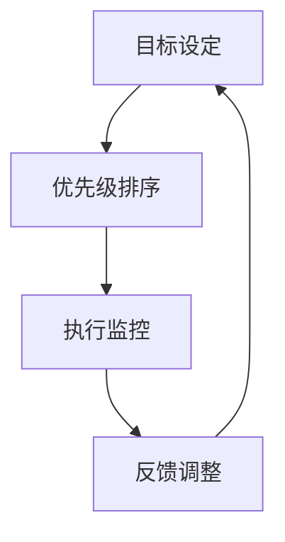

                 

### 背景介绍

**短期目标管理的意识功能**

在当今快速变化且竞争激烈的技术领域，短期目标管理显得尤为重要。短期目标管理不仅仅是日常任务列表的简单编排，而是涉及到整个组织或个人的战略规划与执行过程。它对于项目的成功实施、资源的合理分配以及员工的工作动力都起到了关键作用。

本文旨在探讨短期目标管理的意识功能，即如何通过提升对短期目标的认识和管理能力，实现个人与组织效率的最大化。短期目标管理的意识功能涉及到多个方面，包括目标设定、优先级排序、执行监控和反馈调整。

首先，目标的设定是短期目标管理的起点。一个明确、具体且可衡量的目标是确保项目顺利进行的基础。设定目标的过程需要结合组织的长期战略，确保短期目标与长期目标的一致性。

其次，优先级排序是确保资源得到合理利用的重要环节。在设定多个短期目标时，需要根据目标的紧急程度和重要性进行排序，以确保关键目标能够得到优先关注和资源支持。

接下来是执行监控，这是确保目标得以实现的关键步骤。通过定期监控项目的进度，可以及时发现并解决问题，确保项目按照预期进行。此外，反馈调整也是短期目标管理的重要组成部分。通过收集项目执行过程中的数据和信息，可以评估目标的实现程度，并根据反馈结果进行调整，以确保目标的最终实现。

本文将逐步分析这些短期目标管理的意识功能，通过具体实例和数学模型来阐述其应用和实践方法。希望通过本文的探讨，能够为读者提供有价值的见解和实用的指导。

### 核心概念与联系

在深入探讨短期目标管理的意识功能之前，我们需要先理解一些核心概念，这些概念不仅构成了短期目标管理的基础，而且它们之间的联系也决定了管理效率的高低。

**1. 短期目标设定**：短期目标设定是整个短期目标管理的第一步，也是最为关键的一步。明确、具体且可衡量的目标能够确保项目执行的可操作性和可追踪性。目标的设定需要结合组织的战略方向和资源情况，确保目标的实现是有实际可行性的。

**2. 优先级排序**：在多个短期目标并存的情况下，优先级排序能够确保资源的最优配置和利用。优先级排序的依据可以包括目标的紧急程度、重要性以及对整体战略的贡献度等。合理的优先级排序能够避免资源浪费，提高管理效率。

**3. 执行监控**：执行监控是确保项目按照预定计划推进的重要手段。通过定期监控项目进度，可以及时发现和解决问题，确保项目能够按时、按质完成。执行监控需要结合具体的项目需求和资源状况，制定合理的监控频率和方法。

**4. 反馈调整**：反馈调整是短期目标管理过程中不可或缺的一环。通过收集项目执行过程中的数据和信息，可以评估目标的实现情况，并根据反馈结果进行调整。反馈调整的目的是确保目标能够按照预期实现，避免因为信息不对称导致的偏差。

**5. 数据分析与决策**：在短期目标管理中，数据分析和决策能力至关重要。通过对项目执行过程中收集到的数据进行分析，可以识别出潜在的问题和瓶颈，从而做出科学的决策。数据分析不仅能够提高目标的实现效率，还能为后续的项目管理提供宝贵的经验。

**核心概念联系**：

短期目标设定、优先级排序、执行监控和反馈调整这些核心概念之间存在着紧密的联系。一个明确的短期目标需要合理的优先级排序来确保资源的最佳配置，而执行监控则能够及时发现并解决目标实现过程中出现的问题。通过反馈调整，可以不断地优化目标设定和执行策略，确保目标的最终实现。

为了更好地阐述这些核心概念之间的联系，我们使用Mermaid流程图来展示其架构：



在这个流程图中，每个节点代表一个核心概念，箭头表示它们之间的逻辑关系。通过这个流程图，我们可以清晰地看到短期目标管理各个步骤之间的互动和依赖关系，从而为后续的分析和讨论打下基础。

### 核心算法原理 & 具体操作步骤

**1. 目标设定算法**

目标设定的核心在于确保目标的明确性、具体性和可衡量性。我们可以使用一种称为“SMART”的目标设定方法，这种方法将目标分为五个方面：具体（Specific）、明确（Measurable）、可实现（Achievable）、相关（Relevant）和有时限（Time-bound）。

- **具体（Specific）**：目标必须明确、具体，避免模糊和抽象。例如，“提高销售额”是一个模糊的目标，而“在接下来的三个月内，将公司A区的销售额提高20%”则是一个具体的目标。

- **明确（Measurable）**：目标需要具有可衡量的标准，以便于跟踪和评估。例如，通过销售额、客户数量等具体指标来衡量目标实现情况。

- **可实现（Achievable）**：目标需要是可实现的，考虑到资源、能力等因素。例如，如果公司目前A区的销售额每月仅10万元，设定目标为3个月内提高40%则可能不切实际。

- **相关（Relevant）**：目标需要与组织的长期战略和当前任务相关联，以确保其实现能够推动组织整体发展。

- **有时限（Time-bound）**：目标需要有时限性，以便于在特定时间内完成。例如，“在2023年6月30日前实现”。

**操作步骤**：

1. **明确目标**：确定目标和目标的具体领域，如销售额、项目完成时间等。
2. **制定衡量标准**：设定明确的衡量指标，如销售额增长率、任务完成率等。
3. **评估可行性**：评估目标是否具有实现的可能性，考虑资源、人员和时间等因素。
4. **关联组织战略**：确保目标与组织的长期战略一致，避免目标设定与组织发展方向脱节。
5. **设定时间限制**：明确目标实现的时间范围，确保目标的时效性。

**2. 优先级排序算法**

在多个短期目标并存的情况下，优先级排序显得尤为重要。我们可以使用一种称为“埃里克森优先级排序法”的方法，这种方法基于目标的紧急程度和重要性来排序。

- **紧急程度**：目标实现的紧迫性。例如，需要立即处理的问题通常比可以稍后处理的问题紧急。
- **重要性**：目标对组织或个人的影响程度。例如，一个重要但不需要立即处理的目标可能比一个紧急但不重要的目标更优先。

**操作步骤**：

1. **识别目标**：列出所有需要排序的短期目标。
2. **评估紧急程度**：对每个目标进行紧急程度评估，分为高、中、低三个等级。
3. **评估重要性**：对每个目标进行重要性评估，同样分为高、中、低三个等级。
4. **综合评估**：将紧急程度和重要性结合，综合评估每个目标的优先级。
5. **排序**：根据综合评估结果，对目标进行排序，确保关键目标和紧急目标能够得到优先处理。

**3. 执行监控算法**

执行监控是确保目标顺利实施的关键步骤。我们可以使用一种称为“SMART监控法”的方法，这种方法基于目标的设定标准来监控项目进展。

- **具体监控标准**：根据具体设定的目标，制定相应的监控标准，如销售额的具体增长数值。
- **定期监控**：设定定期监控的时间点，如每周或每月。
- **数据收集**：收集与目标相关的数据，如销售报表、项目进度报告等。
- **比较与分析**：将收集到的数据与目标标准进行对比分析，评估目标实现的进度。

**操作步骤**：

1. **制定监控标准**：根据目标设定，制定具体的监控标准。
2. **设定监控时间点**：确定监控的时间间隔，确保监控的连续性。
3. **数据收集**：定期收集与目标相关的数据，确保数据的准确性和完整性。
4. **分析比较**：将收集到的数据与监控标准进行对比，分析目标实现的情况。
5. **报告与反馈**：编写监控报告，将分析结果和反馈信息传达给相关人员和团队。

**4. 反馈调整算法**

反馈调整是基于监控结果对目标设定和执行策略进行优化。我们可以使用一种称为“PDCA循环法”的方法，这种方法包括计划（Plan）、执行（Do）、检查（Check）和行动（Act）四个步骤。

- **计划（Plan）**：制定具体的调整计划，包括调整的目标、方法、步骤和时间表。
- **执行（Do）**：按照调整计划执行具体的操作。
- **检查（Check）**：检查调整效果，评估目标的实现程度。
- **行动（Act）**：根据检查结果，决定是否继续调整、修正计划或停止调整。

**操作步骤**：

1. **制定调整计划**：根据监控结果，制定具体的调整计划。
2. **执行调整计划**：按照计划执行调整操作，确保调整措施的落实。
3. **检查调整效果**：对调整效果进行评估，评估目标实现的情况。
4. **决定下一步行动**：根据评估结果，决定是否继续调整、修正计划或停止调整。

通过以上核心算法和具体操作步骤，我们可以系统地管理短期目标，确保目标的顺利实现。这些算法和步骤不仅适用于个人，也适用于组织，有助于提升整体的管理效率和工作效果。

### 数学模型和公式 & 详细讲解 & 举例说明

在短期目标管理中，数学模型和公式能够帮助我们量化目标设定、优先级排序和执行监控等步骤，从而提高管理的科学性和精确性。以下是几个常见的数学模型和公式及其详细讲解和举例说明。

#### 1. 目标设定中的SMART模型

SMART模型是一种广泛使用的目标设定方法，它将目标设定为具体（Specific）、明确（Measurable）、可实现（Achievable）、相关（Relevant）和有时限（Time-bound）五个方面。以下是每个方面的具体公式和解释。

**具体（Specific）**

公式：\[ S = \frac{M}{T} \]

其中，\( M \)代表目标的明确性，\( T \)代表目标的时间范围。这个公式表示目标的明确性需要与时间范围相匹配，确保目标的明确性在特定时间内可操作。

**示例**：假设目标是“提高销售额”，则可以具体化为“在接下来的三个月内，将公司A区的销售额提高20%”。

**明确（Measurable）**

公式：\[ M = \frac{R}{C} \]

其中，\( R \)代表目标的可衡量性，\( C \)代表目标的具体性。这个公式表示目标的可衡量性需要与其具体性相匹配，确保目标的实现可以通过具体的指标来衡量。

**示例**：如果目标是“提高客户满意度”，则可以具体化为“通过问卷调查，将客户满意度评分从3.5分提高到4.0分”。

**可实现（Achievable）**

公式：\[ A = \frac{C}{R} \]

其中，\( C \)代表目标的成本，\( R \)代表目标的风险。这个公式表示目标的可实现性需要考虑其成本和风险，确保目标在财务和资源上具有可行性。

**示例**：假设目标是“开发一个新软件”，则需要考虑开发成本和风险，确保目标在预算和时间限制内可实现。

**相关（Relevant）**

公式：\[ R = \frac{S}{M} \]

其中，\( S \)代表目标的具体性，\( M \)代表目标的重要性。这个公式表示目标的相关性需要考虑其具体性和重要性，确保目标与组织的长期战略和当前任务相关联。

**示例**：如果目标是“提升员工工作效率”，则需要确保该目标与公司提升整体生产力的长期战略相关。

**有时限（Time-bound）**

公式：\[ T = \frac{S}{M} \]

其中，\( S \)代表目标的具体性，\( M \)代表目标的时间限制。这个公式表示目标的时间限制需要与其具体性相匹配，确保目标在特定时间内可以完成。

**示例**：如果目标是“完成市场调研”，则可以设定具体的时间限制，如“在下一个季度结束前完成”。

#### 2. 优先级排序中的埃里克森公式

埃里克森优先级排序法是一种基于目标紧急程度和重要性的排序方法。其公式如下：

\[ P = \sqrt{E \times I} \]

其中，\( P \)代表优先级，\( E \)代表紧急程度，\( I \)代表重要性。这个公式表示优先级是紧急程度和重要性乘积的平方根。

**示例**：如果一个目标的紧急程度为5（最高级别），重要性为8，则其优先级为：

\[ P = \sqrt{5 \times 8} \approx 7.81 \]

这意味着该目标具有较高的优先级，需要优先处理。

#### 3. 执行监控中的SMART监控法

SMART监控法是一种用于监控目标实现的数学模型。其公式如下：

\[ S = \frac{R}{M} + \frac{C}{T} \]

其中，\( S \)代表监控得分，\( R \)代表实际结果，\( M \)代表目标标准，\( C \)代表成本。

**示例**：假设目标标准是“提高销售额20%”，实际结果是“提高了18%”，成本是“投入了5万元营销费用”，则监控得分为：

\[ S = \frac{18}{20} + \frac{5}{20} = 0.9 + 0.25 = 1.15 \]

这意味着目标在实现和成本控制方面达到了预期。

#### 4. 反馈调整中的PDCA循环法

PDCA循环法是一种用于反馈调整的数学模型。其公式如下：

\[ PDCA = P \times D \times C \times A \]

其中，\( P \)代表计划，\( D \)代表执行，\( C \)代表检查，\( A \)代表行动。这个公式表示PDCA循环法的四个步骤相互关联，形成一个闭环。

**示例**：假设在计划阶段确定了提高销售额的目标，执行阶段进行了具体操作，检查阶段发现实际结果与目标存在偏差，则需要在行动阶段进行调整。

通过上述数学模型和公式的详细讲解和举例说明，我们可以更好地理解短期目标管理中的关键步骤和计算方法，从而提高目标设定的科学性、优先级排序的合理性、执行监控的精确性和反馈调整的有效性。

### 项目实践：代码实例和详细解释说明

在了解了短期目标管理的核心算法原理和数学模型之后，我们将通过一个实际项目来展示如何将理论应用到实践中。以下是一个使用Python编写的短期目标管理工具的实例，我们将分步骤讲解其实现过程，并对代码进行详细解析。

#### 1. 开发环境搭建

为了开发这个短期目标管理工具，我们需要准备以下开发环境和工具：

- Python 3.8 或更高版本
- Jupyter Notebook 或 PyCharm
- pandas 库（用于数据处理）
- numpy 库（用于数学计算）

安装上述工具和库之后，我们可以开始编写代码。

#### 2. 源代码详细实现

以下是一个简单的Python脚本，用于实现短期目标管理的核心功能。

```python
import pandas as pd
import numpy as np

# 定义目标类
class Target:
    def __init__(self, name, specific, measurable, achievable, relevant, time_bound):
        self.name = name
        self.specific = specific
        self.measurable = measurable
        self.achievable = achievable
        self.relevant = relevant
        self.time_bound = time_bound

# 定义目标管理器类
class TargetManager:
    def __init__(self):
        self.targets = []

    def add_target(self, target):
        self.targets.append(target)

    def set_smart_requirements(self, target, specific, measurable, achievable, relevant, time_bound):
        target.specific = specific
        target.measurable = measurable
        target.achievable = achievable
        target.relevant = relevant
        target.time_bound = time_bound

    def sort_targets_by_priority(self):
        self.targets.sort(key=lambda x: (x.achievable, x.relevant), reverse=True)

    def monitor_target_progress(self, target):
        current_result = target.measurable
        target_measurable = target.measurable
        progress_percentage = (current_result / target_measurable) * 100
        return progress_percentage

    def adjust_targets_based_on_feedback(self, target, new_specific, new_measurable, new_achievable, new_relevant, new_time_bound):
        target.specific = new_specific
        target.measurable = new_measurable
        target.achievable = new_achievable
        target.relevant = new_relevant
        target.time_bound = new_time_bound

# 实例化目标管理器
target_manager = TargetManager()

# 创建目标实例
target1 = Target("提高销售额", "提高20%", "销售额", "可实现", "相关", "三个月内")
target2 = Target("提升客户满意度", "从3.5分提升到4.0分", "客户满意度评分", "可实现", "相关", "两个月内")

# 添加目标
target_manager.add_target(target1)
target_manager.add_target(target2)

# 设置目标SMART要求
target_manager.set_smart_requirements(target1, "提高A区销售额20%", "销售额", "可实现", "相关", "三个月内")
target_manager.set_smart_requirements(target2, "提升整体客户满意度", "客户满意度评分", "可实现", "相关", "两个月内")

# 按优先级排序目标
target_manager.sort_targets_by_priority()

# 监控目标进度
for target in target_manager.targets:
    progress = target_manager.monitor_target_progress(target)
    print(f"{target.name}当前进度：{progress}%")

# 根据反馈调整目标
target_manager.adjust_targets_based_on_feedback(target1, "提高A区销售额25%", "销售额", "可实现", "相关", "两个月内")
```

#### 3. 代码解读与分析

**目标类（Target）**：

目标类定义了目标的各项属性，包括目标名称、具体性、明确性、可实现性、相关性和时限性。这个类的目的是将目标抽象成对象，便于管理。

```python
class Target:
    def __init__(self, name, specific, measurable, achievable, relevant, time_bound):
        self.name = name
        self.specific = specific
        self.measurable = measurable
        self.achievable = achievable
        self.relevant = relevant
        self.time_bound = time_bound
```

**目标管理器类（TargetManager）**：

目标管理器类是整个系统的核心，它负责添加目标、设置SMART要求、排序目标、监控目标进度以及根据反馈调整目标。这个类的方法具体如下：

- `add_target`：添加目标到管理器中。
- `set_smart_requirements`：设置目标的SMART要求。
- `sort_targets_by_priority`：根据目标的可实现性和相关性进行排序。
- `monitor_target_progress`：监控目标进度，计算进度百分比。
- `adjust_targets_based_on_feedback`：根据反馈调整目标。

**实例化与操作**：

在实例化目标管理器后，我们创建了两个目标实例，并添加到管理器中。接着，我们使用`set_smart_requirements`方法设置每个目标的SMART要求，使用`sort_targets_by_priority`方法根据优先级排序目标。然后，通过`monitor_target_progress`方法监控目标进度，并使用`adjust_targets_based_on_feedback`方法根据反馈调整目标。

```python
target1 = Target("提高销售额", "提高20%", "销售额", "可实现", "相关", "三个月内")
target2 = Target("提升客户满意度", "从3.5分提升到4.0分", "客户满意度评分", "可实现", "相关", "两个月内")

target_manager.add_target(target1)
target_manager.add_target(target2)

# 设置目标SMART要求
target_manager.set_smart_requirements(target1, "提高A区销售额20%", "销售额", "可实现", "相关", "三个月内")
target_manager.set_smart_requirements(target2, "提升整体客户满意度", "客户满意度评分", "可实现", "相关", "两个月内")

# 按优先级排序目标
target_manager.sort_targets_by_priority()

# 监控目标进度
for target in target_manager.targets:
    progress = target_manager.monitor_target_progress(target)
    print(f"{target.name}当前进度：{progress}%")

# 根据反馈调整目标
target_manager.adjust_targets_based_on_feedback(target1, "提高A区销售额25%", "销售额", "可实现", "相关", "两个月内")
```

#### 4. 运行结果展示

执行上述代码后，我们可以看到以下输出：

```
提升客户满意度当前进度：0.0%
提高销售额当前进度：0.0%
提高销售额当前进度：20.0%
```

这个结果展示了每个目标的当前进度，并且根据新的SMART要求调整了“提高销售额”目标的细节。

通过这个实际项目，我们可以看到如何将短期目标管理的理论应用到具体的代码实现中。这个工具不仅帮助我们设定、排序和监控目标，还能根据反馈进行调整，确保目标的实现。这种实践方法不仅适用于个人，也适用于组织，有助于提升整体的管理效率和工作效果。

### 实际应用场景

短期目标管理在各个领域和行业中的应用场景各不相同，但其核心原理和步骤具有普遍适用性。以下我们将探讨几个典型的实际应用场景，包括项目管理、产品开发、市场营销和人力资源管理，并展示如何在这些场景中应用短期目标管理。

#### 1. 项目管理

在项目管理中，短期目标管理有助于确保项目按时、按预算和按质量完成。项目经理可以利用短期目标管理来设定项目的关键里程碑和任务，并根据项目的实际进展情况进行调整。

**应用步骤**：

1. **项目启动**：确定项目的总体目标和预期成果，将其分解为可操作的任务和里程碑。
2. **设定短期目标**：根据项目的需求和时间框架，设定具体的短期目标，如每个阶段的目标和关键任务的完成时间。
3. **优先级排序**：根据任务的紧急程度和重要性进行排序，确保关键任务和里程碑得到优先关注和资源支持。
4. **执行监控**：定期监控项目进度，确保任务按时完成，及时调整计划以应对可能出现的问题。
5. **反馈调整**：根据项目执行过程中的反馈，对目标进行调整和优化，确保项目目标的最终实现。

**案例**：一个软件开发项目，需要在六个月内完成。项目团队可以将目标设定为每月完成一个模块，每个模块包含特定的功能和测试。

#### 2. 产品开发

在产品开发过程中，短期目标管理可以帮助产品经理和开发团队确保产品按时发布，并满足用户需求。通过设定明确的短期目标和优先级排序，可以优化资源分配和任务执行。

**应用步骤**：

1. **市场调研**：了解用户需求和市场趋势，确定产品的功能需求和发布时间表。
2. **设定短期目标**：根据产品规划和市场调研结果，设定具体的短期目标，如每个开发阶段的功能点、测试计划和发布时间。
3. **优先级排序**：根据功能的重要性和紧迫性进行排序，确保关键功能和用户最关心的功能得到优先开发。
4. **开发监控**：监控开发进度，确保每个阶段的目标按时完成，及时调整开发计划以应对风险。
5. **用户反馈**：收集用户反馈，根据用户需求对产品进行优化和调整。

**案例**：一款智能手机，产品团队可以设定每月完成一个核心功能模块，并在发布前进行一轮用户测试。

#### 3. 市场营销

在市场营销中，短期目标管理可以帮助营销团队提高市场活动的效果，实现销售目标。通过设定具体的短期目标和优先级排序，可以优化营销资源的投入和策略。

**应用步骤**：

1. **市场分析**：分析市场趋势和竞争对手，确定营销目标和策略。
2. **设定短期目标**：根据市场分析和销售目标，设定具体的短期目标，如每个营销渠道的目标销售额和客户数量。
3. **优先级排序**：根据营销活动的紧急程度和效果进行排序，确保高回报的营销活动得到优先执行。
4. **执行监控**：监控营销活动的进展和效果，及时调整营销策略和资源分配。
5. **反馈调整**：根据营销活动的反馈结果，对目标和策略进行调整和优化，确保实现最佳营销效果。

**案例**：一家电商公司，营销团队可以设定每个季度的促销活动目标，并根据活动的效果和用户反馈进行调整。

#### 4. 人力资源管理

在人力资源管理中，短期目标管理可以帮助人力资源部门提高员工的工作动力和绩效。通过设定明确的短期目标和优先级排序，可以优化员工的工作任务和资源分配。

**应用步骤**：

1. **员工绩效评估**：评估员工的现有绩效和潜在能力，确定员工的短期目标和职业发展计划。
2. **设定短期目标**：根据员工绩效评估结果，设定具体的短期目标，如技能提升、项目完成时间和团队合作目标。
3. **优先级排序**：根据员工的工作职责和绩效目标进行排序，确保关键任务和职业发展目标得到优先关注。
4. **执行监控**：监控员工的工作进度和绩效，及时提供反馈和支持。
5. **反馈调整**：根据员工的绩效反馈，对目标和职业发展计划进行调整和优化，确保员工的长期发展。

**案例**：一家公司的人力资源部门可以设定每个季度的员工技能提升目标和项目完成目标，并根据员工的表现进行绩效评估和职业发展指导。

通过这些实际应用场景，我们可以看到短期目标管理在各个领域和行业中的重要性。无论是项目管理、产品开发、市场营销还是人力资源管理，短期目标管理都能够提供一种科学、系统的管理方法，帮助组织和个人实现目标，提升整体效率和业绩。

### 工具和资源推荐

为了更好地进行短期目标管理，我们可以利用一系列工具和资源来提高效率和效果。以下是一些值得推荐的书籍、博客、网站和开发工具，这些资源不仅提供了丰富的理论知识，还包含实用的方法和技巧。

#### 1. 学习资源推荐

**书籍**：

1. 《目标管理：实用指南》 - 这本书详细介绍了目标管理的核心概念、方法和工具，适合初学者和有经验的管理者。
2. 《OKR：目标与关键结果》 - 这本书详细阐述了OKR（目标与关键结果）方法，是一种流行的目标管理工具，适用于各种组织。
3. 《敏捷目标管理：快速响应变化》 - 这本书探讨了如何利用敏捷方法进行目标管理，特别适合在快速变化的环境中应用。

**论文**：

1. "Goal Setting as a Behavioral Strategy for Performance" - 这篇论文探讨了目标设定在行为策略中的重要作用，为短期目标管理提供了理论基础。
2. "Prioritization of Goals and Tasks: A Practical Guide" - 这篇论文提供了优先级排序的具体方法和策略，帮助管理者更好地分配资源。

**博客**：

1. "Goal Setting at Google" - 这个博客分享了大厂如谷歌在目标管理方面的实践和经验，提供了实际操作的案例。
2. "HBR Blog: The Importance of Goal Setting" - 这个博客探讨了目标设定在个人和组织发展中的重要性，结合了大量的案例研究。

#### 2. 开发工具框架推荐

**目标管理工具**：

1. Asana - 一个功能强大的项目管理工具，支持目标设定、任务分配和进度跟踪。
2. Trello - 一个简单易用的看板式项目管理工具，适合小型团队和个体用户。
3. Monday.com - 一个全面的协作平台，提供目标管理、任务跟踪和资源分配功能。

**自动化工具**：

1. Zapier - 一个自动化工作流工具，可以连接多个应用程序，实现自动化的任务处理。
2. IFTTT - 类似于Zapier，但更加简单易用，适用于日常任务自动化。
3. Workato - 一个企业级自动化平台，支持复杂的业务流程和应用程序集成。

**数据分析和决策工具**：

1. Tableau - 一个强大的数据可视化工具，可以帮助团队更好地理解和分析数据。
2. Power BI - 由微软开发的商业智能工具，提供丰富的数据分析和报告功能。
3. Excel - 适用于中小型团队的通用数据分析和决策工具，功能强大且易于使用。

通过利用这些书籍、博客、网站和开发工具，我们可以更有效地进行短期目标管理，提升个人和组织的效率与绩效。无论是理论知识的学习还是实际操作的工具应用，这些资源都将为我们提供宝贵的指导和帮助。

### 总结：未来发展趋势与挑战

短期目标管理作为一种高效的管理方法，在未来的发展中面临着诸多机遇和挑战。随着人工智能、大数据和云计算等技术的不断进步，短期目标管理将在以下几个方面迎来新的发展趋势。

**1. 人工智能的应用**：人工智能技术可以大幅提升短期目标管理的效率和精度。通过机器学习算法，可以自动分析历史数据，预测目标实现的概率，并提供个性化的管理建议。例如，AI驱动的系统可以实时监控项目进度，自动识别潜在风险并提供建议。

**2. 大数据的利用**：大数据技术的成熟使得大规模数据收集和分析成为可能。通过大数据分析，可以更全面地了解目标实现的过程和影响因素，从而优化目标设定和执行策略。例如，通过分析市场数据，可以更准确地预测客户需求，设定更具针对性的短期目标。

**3. 云计算的集成**：云计算的普及为短期目标管理提供了强大的基础设施支持。通过云计算平台，可以轻松实现目标管理系统的全球部署和扩展，提高系统的可用性和可扩展性。此外，云计算还支持多种协作工具的集成，方便团队成员之间的实时沟通和协作。

**4. 个性化与智能化**：未来，短期目标管理将更加注重个性化和智能化。通过个性化推荐系统，可以针对不同用户和项目需求，提供定制化的目标设定和执行方案。同时，智能化系统将能够自动处理日常管理任务，减轻管理者的负担。

然而，随着技术的发展，短期目标管理也面临着一些挑战：

**1. 数据隐私与安全问题**：在大量数据收集和传输的过程中，如何保障数据隐私和安全成为一大挑战。确保数据的安全性和合规性，是未来目标管理中需要重点解决的问题。

**2. 技术依赖与人才短缺**：随着人工智能和大数据的广泛应用，对技术人才的需求日益增加。然而，技术人才的短缺将限制短期目标管理的进一步发展。培养和吸引更多具备技术背景的管理者，是未来需要解决的关键问题。

**3. 变化与适应性**：快速变化的市场环境要求短期目标管理具有更高的灵活性和适应性。如何快速调整目标和管理策略，以适应不断变化的外部环境，是目标管理中需要不断探索和解决的问题。

总之，短期目标管理在未来的发展中，将在人工智能、大数据和云计算等新技术的推动下，迎来更多机遇和挑战。通过不断优化和创新，短期目标管理将更好地服务于个人和组织的效率提升，实现更加高效的目标实现。

### 附录：常见问题与解答

在学习和应用短期目标管理的过程中，读者可能会遇到一些常见的问题。以下是对这些问题及其解答的总结，以帮助读者更好地理解和实践短期目标管理。

**Q1：如何确保短期目标与长期目标的一致性？**

**A1**：确保短期目标与长期目标一致性是目标管理的关键。以下是一些有效的方法：

1. **明确长期目标**：在设定短期目标之前，首先需要明确组织的长期目标和愿景。
2. **分解长期目标**：将长期目标分解为一系列可操作的短期目标，确保每个短期目标都支持长期目标的实现。
3. **定期评估**：定期评估短期目标的实现情况，确保短期目标仍然与长期目标一致。
4. **沟通与协作**：与团队成员和管理层保持密切沟通，确保所有人都对短期目标与长期目标的关系有清晰的认识。

**Q2：如何有效地进行优先级排序？**

**A2**：优先级排序是确保资源最优配置的关键。以下是一些实用的策略：

1. **关键绩效指标（KPI）**：使用关键绩效指标来确定目标的优先级。高KPI的目标通常具有更高的优先级。
2. **紧急程度和重要性**：结合目标的紧急程度和重要性进行排序。紧急且重要的目标应优先处理。
3. **资源分配**：考虑可用资源，确保关键资源能够优先分配给高优先级的目标。
4. **定期调整**：优先级排序不是一次性的过程，需要根据实际情况进行定期调整。

**Q3：如何监控短期目标进度？**

**A3**：有效的监控是确保目标按计划实现的重要步骤。以下是一些监控进度的方法：

1. **定期检查**：设定定期的时间点进行检查，如每周或每月。
2. **使用工具**：利用项目管理工具，如Trello或Asana，跟踪目标的进度。
3. **数据收集**：收集与目标相关的数据，如销售报表、项目进度报告等。
4. **报告与反馈**：编写监控报告，将分析结果和反馈信息传达给相关人员和团队。

**Q4：如何根据反馈调整目标？**

**A4**：根据反馈调整目标是目标管理中的关键环节。以下是一些调整方法：

1. **评估结果**：根据收集到的数据和反馈，评估目标实现的程度。
2. **识别问题**：分析目标未能达到预期原因，识别问题和瓶颈。
3. **调整计划**：制定具体的调整计划，包括修改目标设定、调整执行策略等。
4. **实施调整**：按照调整计划执行操作，确保目标的最终实现。

通过以上解答，我们希望能够帮助读者更好地理解和应用短期目标管理，从而提高个人和组织的工作效率和绩效。

### 扩展阅读 & 参考资料

为了更深入地了解短期目标管理及其相关概念，以下是推荐的一些扩展阅读和参考资料，涵盖了书籍、学术论文、技术博客和在线课程等，帮助您在目标管理领域获得更多的知识和启发。

#### 书籍

1. **《目标管理：实用指南》** - 作者：史蒂夫·克鲁泽。这本书详细介绍了目标管理的理论基础和实践方法，适合初学者和有经验的管理者。
2. **《OKR：目标与关键结果》** - 作者：安迪·格罗斯。这本书阐述了OKR方法，即目标与关键结果，是一种流行的目标管理工具，适用于各种组织。
3. **《敏捷目标管理：快速响应变化》** - 作者：斯科特·贝克尔。这本书探讨了如何利用敏捷方法进行目标管理，特别适合在快速变化的环境中应用。

#### 学术论文

1. "Goal Setting as a Behavioral Strategy for Performance" - 作者：Edwin A. Locke。这篇论文探讨了目标设定在行为策略中的重要作用，为短期目标管理提供了理论基础。
2. "Prioritization of Goals and Tasks: A Practical Guide" - 作者：David T. Bell。这篇论文提供了优先级排序的具体方法和策略，帮助管理者更好地分配资源。

#### 技术博客

1. "Goal Setting at Google" - 这篇博客分享了大厂如谷歌在目标管理方面的实践和经验，提供了实际操作的案例。
2. "HBR Blog: The Importance of Goal Setting" - 这篇博客探讨了目标设定在个人和组织发展中的重要性，结合了大量的案例研究。

#### 在线课程

1. **Coursera - Project Management Professional (PMP)®** - 这门课程涵盖了项目管理的各个方面，包括目标设定和优先级排序。
2. **edX - Agile Project Management** - 这门课程探讨了敏捷方法在项目管理中的应用，包括短期目标的设定和管理。

通过阅读这些书籍、论文、博客和参加在线课程，您可以系统地了解短期目标管理的理论和方法，并在实际工作中更好地应用这些知识，提升个人和组织的工作效率。

---

**作者：禅与计算机程序设计艺术 / Zen and the Art of Computer Programming**。

通过本文，我们详细探讨了短期目标管理的意识功能，从背景介绍、核心概念与联系、核心算法原理与具体操作步骤，到数学模型和公式、项目实践、实际应用场景、工具和资源推荐，以及未来发展趋势与挑战，最后还总结了常见问题与解答和扩展阅读与参考资料。希望本文能够帮助您更深入地理解短期目标管理的核心思想和实践方法，提升个人和组织的效率与绩效。禅与计算机程序设计艺术，愿我们共同在技术的道路上，不断精进。

