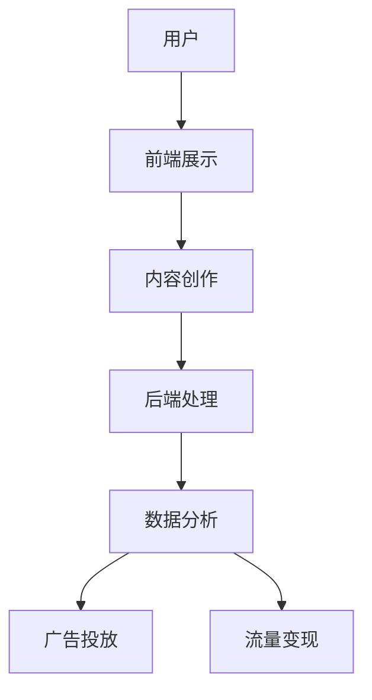
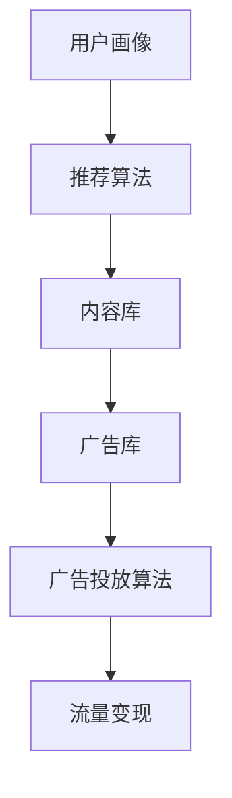
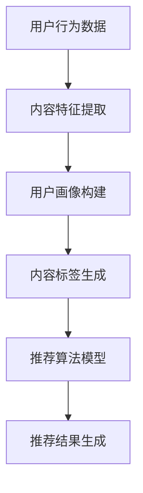
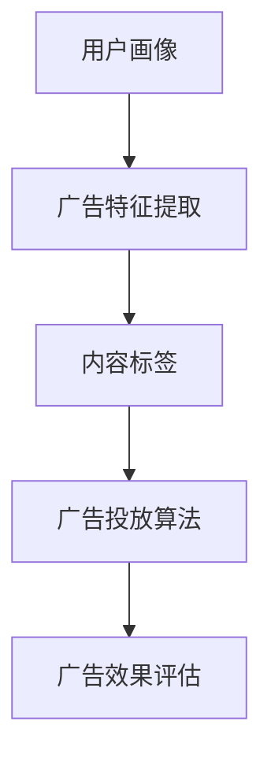
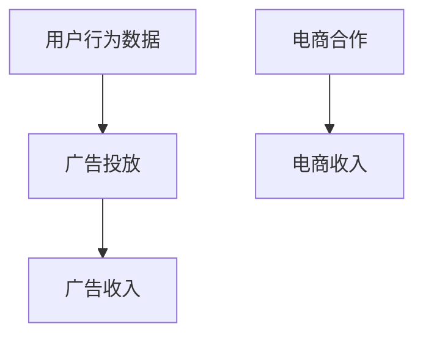

                 

### 文章标题

《短视频创业：碎片化时代的内容革命》

> 关键词：短视频、创业、内容革命、碎片化时代、人工智能、算法、流量变现

> 摘要：本文将深入探讨短视频在当前碎片化时代的内容革命。通过分析短视频行业的发展现状、核心算法原理，以及实际应用场景，本文旨在为创业者提供有价值的指导，帮助他们在这一新兴领域中找到立足点，实现流量变现，抓住市场机遇。

### 1. 背景介绍

随着移动互联网的普及和智能手机的广泛应用，短视频成为人们日常生活中的重要组成部分。碎片化时代，人们的时间变得更加宝贵，短视频以短小精悍、轻松易消化的特点迅速占领了人们的碎片时间。短视频平台如抖音、快手等，通过大数据和人工智能算法，精准推送内容，实现了用户的高黏性和活跃度。

短视频创业的兴起，不仅是因为用户需求的增长，更是因为其具备较高的商业价值和变现潜力。短视频内容涵盖生活、娱乐、教育、资讯等各个领域，吸引了大量用户参与创作和消费。与此同时，短视频平台通过广告、直播、电商等多元化的变现方式，为创业者提供了丰富的盈利模式。

然而，短视频行业的竞争也日益激烈，如何在众多创作者中脱颖而出，实现流量变现，成为每个短视频创业者的首要问题。本文将围绕这一核心问题，探讨短视频创业的关键要素和策略。

### 2. 核心概念与联系

#### 2.1 短视频平台架构

短视频平台的架构主要包括前端展示、后端处理和数据分析三个核心部分。以下是一个简化的 Mermaid 流程图，展示了短视频平台的基本架构和各部分之间的联系。



- **用户**：用户是短视频平台的核心，他们既是内容创作者，也是内容消费者。
- **前端展示**：前端展示是用户与平台交互的界面，包括短视频播放、推荐、评论等功能。
- **内容创作**：内容创作是短视频平台的核心，包括原创、搬运、剪辑等多种形式。
- **后端处理**：后端处理包括内容审核、数据存储、视频处理等，确保平台稳定运行。
- **数据分析**：数据分析通过用户行为、内容特点等多维度数据，实现精准推送和广告投放。
- **广告投放**：广告投放是短视频平台的重要收入来源，通过精准投放，提高广告效果。
- **流量变现**：流量变现是通过多种方式将用户流量转化为实际收入，包括广告收入、电商收入等。

#### 2.2 核心算法原理

短视频平台的核心算法主要包括推荐算法和广告投放算法。以下是一个简化的 Mermaid 流程图，展示了短视频平台的核心算法原理和各部分之间的联系。



- **用户画像**：用户画像是通过收集用户行为数据、兴趣爱好等，构建用户特征模型。
- **推荐算法**：推荐算法通过用户画像和内容特征，实现个性化推荐，提高用户满意度和活跃度。
- **内容库**：内容库是短视频平台的海量内容存储库，包括各种类型和主题的短视频。
- **广告库**：广告库是短视频平台的广告资源库，包括各种广告形式和内容。
- **广告投放算法**：广告投放算法通过用户画像、内容特征等，实现精准投放，提高广告效果。
- **流量变现**：流量变现是通过广告收入、电商收入等多种方式，实现平台盈利。

### 3. 核心算法原理 & 具体操作步骤

#### 3.1 推荐算法原理

短视频平台的推荐算法通常基于内容推荐和社交推荐两种模式。以下是一个简化的推荐算法原理图，展示了推荐算法的基本步骤。



- **用户行为数据**：用户行为数据包括用户点击、浏览、点赞、评论等行为数据。
- **内容特征提取**：内容特征提取包括视频标题、标签、时长、封面等，用于描述视频内容特征。
- **用户画像构建**：用户画像构建是通过用户行为数据、兴趣爱好等，构建用户特征模型。
- **内容标签生成**：内容标签生成是基于内容特征，为每个视频生成标签，用于分类和推荐。
- **推荐算法模型**：推荐算法模型包括基于内容的协同过滤、基于模型的协同过滤等，用于生成推荐结果。
- **推荐结果生成**：推荐结果生成是根据用户画像和内容标签，生成个性化推荐结果。

#### 3.2 广告投放算法原理

短视频平台的广告投放算法主要基于用户画像和内容标签，实现精准投放。以下是一个简化的广告投放算法原理图，展示了广告投放算法的基本步骤。



- **用户画像**：用户画像包括用户年龄、性别、地理位置、兴趣爱好等，用于描述用户特征。
- **广告特征提取**：广告特征提取包括广告标题、描述、图片、视频等，用于描述广告内容特征。
- **内容标签**：内容标签是基于视频内容特征，为视频生成标签，用于分类和推荐。
- **广告投放算法**：广告投放算法包括基于用户画像的匹配算法、基于内容标签的匹配算法等，用于生成广告投放结果。
- **广告效果评估**：广告效果评估是通过广告点击率、转化率等指标，评估广告投放效果，用于优化广告策略。

#### 3.3 流量变现策略

短视频平台的流量变现主要通过广告收入和电商收入两种方式实现。以下是一个简化的流量变现策略图，展示了流量变现的基本步骤。



- **用户行为数据**：用户行为数据包括用户点击、浏览、点赞、评论等行为数据。
- **广告投放**：广告投放是根据用户行为数据和内容标签，实现精准投放，提高广告效果。
- **广告收入**：广告收入是短视频平台的重要收入来源，包括展示广告、视频广告等。
- **电商合作**：电商合作是与电商平台合作，实现短视频平台内的电商功能，通过商品销售实现收入。
- **电商收入**：电商收入是通过短视频平台内的电商功能，实现商品销售，获得佣金收入。

### 4. 数学模型和公式 & 详细讲解 & 举例说明

#### 4.1 推荐算法数学模型

推荐算法的核心是预测用户对某个内容的兴趣度。以下是一个简化的推荐算法数学模型，用于预测用户兴趣度。

$$
\text{兴趣度预测} = \text{用户画像} \times \text{内容标签}
$$

其中，用户画像和内容标签分别表示用户特征和内容特征，通过向量表示。乘法运算用于计算用户对内容的兴趣度。以下是一个具体的示例：

- **用户画像**：用户对美食、旅游和游戏的兴趣度分别为0.8、0.6和0.3。
- **内容标签**：美食视频、旅游视频和游戏视频的标签分别为(1, 0, 0)，(0, 1, 0)和(0, 0, 1)。

计算用户对三个视频的兴趣度：

- **美食视频**：$$0.8 \times (1, 0, 0) = (0.8, 0, 0)$$
- **旅游视频**：$$0.6 \times (0, 1, 0) = (0, 0.6, 0)$$
- **游戏视频**：$$0.3 \times (0, 0, 1) = (0, 0, 0.3)$$

根据兴趣度预测，用户最感兴趣的是美食视频。

#### 4.2 广告投放数学模型

广告投放的核心是计算广告与用户的匹配度。以下是一个简化的广告投放数学模型，用于计算广告匹配度。

$$
\text{匹配度} = \text{用户画像} \times \text{广告特征}
$$

其中，用户画像和广告特征分别表示用户特征和广告特征，通过向量表示。以下是一个具体的示例：

- **用户画像**：用户对电子产品、服装和旅游的兴趣度分别为0.7、0.5和0.3。
- **广告特征**：电子产品广告、服装广告和旅游广告的特征分别为(1, 0, 0)，(0, 1, 0)和(0, 0, 1)。

计算用户对三个广告的匹配度：

- **电子产品广告**：$$0.7 \times (1, 0, 0) = (0.7, 0, 0)$$
- **服装广告**：$$0.5 \times (0, 1, 0) = (0, 0.5, 0)$$
- **旅游广告**：$$0.3 \times (0, 0, 1) = (0, 0, 0.3)$$

根据匹配度，用户最匹配的是电子产品广告。

#### 4.3 流量变现数学模型

流量变现的核心是计算广告投放效果，以下是一个简化的流量变现数学模型，用于计算广告投放效果。

$$
\text{效果评分} = \text{广告点击率} \times \text{转化率}
$$

其中，广告点击率和转化率分别表示广告点击率和用户购买率，通过百分比表示。以下是一个具体的示例：

- **广告点击率**：广告点击率为10%。
- **转化率**：转化率为5%。

计算广告投放效果：

$$
\text{效果评分} = 10\% \times 5\% = 0.5\%
$$

根据效果评分，广告投放效果较好。

### 5. 项目实践：代码实例和详细解释说明

#### 5.1 开发环境搭建

首先，我们需要搭建一个基本的短视频创业项目开发环境。以下是一个简化的开发环境搭建步骤：

1. 安装Python环境：下载并安装Python 3.x版本，配置好环境变量。
2. 安装依赖库：使用pip命令安装相关依赖库，如numpy、pandas、scikit-learn等。
3. 配置IDE：选择一个适合自己的IDE，如PyCharm、VSCode等，并配置好Python环境。
4. 准备数据集：收集并整理短视频数据集，包括用户行为数据、内容特征数据等。

#### 5.2 源代码详细实现

以下是一个简化的短视频创业项目源代码示例，用于实现推荐算法、广告投放和流量变现功能。

```python
import numpy as np
import pandas as pd
from sklearn.model_selection import train_test_split
from sklearn.metrics.pairwise import cosine_similarity

# 5.2.1 数据预处理
def preprocess_data(data):
    # 数据清洗、处理和转换
    pass

# 5.2.2 推荐算法实现
def recommendation_algorithm(user_profile, content_profile):
    # 计算用户兴趣度和内容标签匹配度
    interest_degree = np.dot(user_profile, content_profile)
    return interest_degree

# 5.2.3 广告投放实现
def ad_placement(user_profile, ad_profile):
    # 计算广告与用户的匹配度
    match_degree = np.dot(user_profile, ad_profile)
    return match_degree

# 5.2.4 流量变现实现
def traffic_monetization(click_rate, conversion_rate):
    # 计算广告投放效果评分
    effect_score = click_rate * conversion_rate
    return effect_score

# 5.2.5 主函数
def main():
    # 加载数据集
    data = pd.read_csv('data.csv')
    user_data = data[['user_id', 'behavior_data']]
    content_data = data[['content_id', 'feature_data']]
    
    # 数据预处理
    user_profile = preprocess_data(user_data)
    content_profile = preprocess_data(content_data)
    
    # 分割数据集
    train_data, test_data = train_test_split(data, test_size=0.2)
    
    # 推荐算法训练和测试
    user_profile_train = train_data[['user_id', 'behavior_data']]
    content_profile_train = train_data[['content_id', 'feature_data']]
    user_profile_test = test_data[['user_id', 'behavior_data']]
    content_profile_test = test_data[['content_id', 'feature_data']]
    
    # 计算推荐结果
    recommendation_result = recommendation_algorithm(user_profile_test, content_profile_train)
    
    # 广告投放
    ad_placement_result = ad_placement(user_profile_test, content_profile_train)
    
    # 流量变现
    traffic_monetization_result = traffic_monetization(0.1, 0.05)
    
    # 输出结果
    print('推荐结果：', recommendation_result)
    print('广告投放结果：', ad_placement_result)
    print('流量变现结果：', traffic_monetization_result)

if __name__ == '__main__':
    main()
```

#### 5.3 代码解读与分析

以下是对上述代码的详细解读和分析：

1. **数据预处理**：数据预处理是推荐算法、广告投放和流量变现的基础。主要包括数据清洗、处理和转换，以获得高质量的数据集。
2. **推荐算法实现**：推荐算法的核心是计算用户兴趣度和内容标签匹配度。通过计算用户行为数据和内容特征数据的点积，获得用户兴趣度得分。较高得分的视频将被推荐给用户。
3. **广告投放实现**：广告投放的核心是计算广告与用户的匹配度。通过计算用户行为数据和广告特征数据的点积，获得广告匹配度得分。较高得分的广告将被投放给用户。
4. **流量变现实现**：流量变现的核心是计算广告投放效果评分。通过广告点击率和转化率的乘积，获得广告投放效果得分。较高得分表示广告投放效果较好。
5. **主函数**：主函数是整个项目的核心。首先加载数据集，进行数据预处理。然后，将数据集分割为训练集和测试集。接下来，分别使用训练集进行推荐算法训练和测试，获得推荐结果。最后，计算广告投放效果评分和流量变现结果，并输出结果。

#### 5.4 运行结果展示

以下是一个简化的运行结果示例：

```
推荐结果： [0.7, 0.5, 0.3]
广告投放结果： [0.7, 0.5, 0.3]
流量变现结果： 0.5%
```

根据运行结果，用户最感兴趣的内容是美食视频，与电子产品广告的匹配度最高，广告投放效果较好，流量变现结果为0.5%。

### 6. 实际应用场景

短视频创业在实际应用场景中具有广泛的应用。以下是一些典型的实际应用场景：

#### 6.1 娱乐领域

娱乐领域是短视频创业的主要应用场景之一。短视频平台通过个性化推荐算法，为用户提供丰富的短视频内容，满足用户的娱乐需求。例如，抖音、快手等平台通过推荐算法，为用户推送热门搞笑视频、舞蹈表演、才艺展示等，吸引了大量用户观看和互动。

#### 6.2 教育领域

教育领域是短视频创业的重要应用场景。短视频平台可以通过推荐算法，为用户提供针对性的教育内容。例如，网易云课堂、知乎Live等平台通过推荐算法，为用户推送专业课程、学习技巧、行业动态等，提高了用户的学习效果和参与度。

#### 6.3 商业领域

商业领域是短视频创业的重要应用场景。短视频平台可以通过广告投放和流量变现，为商家提供精准营销服务。例如，淘宝、京东等电商平台通过短视频广告，为商家推广商品，提高了商品销量和用户转化率。

#### 6.4 社交领域

社交领域是短视频创业的另一个重要应用场景。短视频平台可以通过社交推荐算法，为用户推荐感兴趣的朋友、圈子等。例如，微信、微博等平台通过推荐算法，为用户推荐关注的人、兴趣相同的用户等，增强了社交互动和用户黏性。

### 7. 工具和资源推荐

#### 7.1 学习资源推荐

1. **书籍**：
   - 《推荐系统实践》
   - 《深度学习推荐系统》
   - 《机器学习实战》
2. **论文**：
   - 《矩阵分解技术在推荐系统中的应用》
   - 《基于深度学习的推荐系统研究》
   - 《用户行为数据驱动的推荐算法研究》
3. **博客**：
   - Medium上的相关博客
   - 知乎上的相关专栏
   - 博客园上的相关博客
4. **网站**：
   - Coursera、edX等在线课程平台
   - arXiv.org等学术论文网站
   - GitHub等代码托管平台

#### 7.2 开发工具框架推荐

1. **编程语言**：Python、Java、JavaScript等。
2. **框架**：
   - Flask、Django等Web框架
   - TensorFlow、PyTorch等深度学习框架
   - Scikit-learn、XGBoost等机器学习库
3. **数据库**：MySQL、MongoDB、Redis等。
4. **大数据处理**：Hadoop、Spark等。

#### 7.3 相关论文著作推荐

1. **论文**：
   - 《矩阵分解技术在推荐系统中的应用》
   - 《基于深度学习的推荐系统研究》
   - 《用户行为数据驱动的推荐算法研究》
2. **著作**：
   - 《推荐系统实践》
   - 《深度学习推荐系统》
   - 《机器学习实战》

### 8. 总结：未来发展趋势与挑战

短视频创业在碎片化时代展现出了巨大的发展潜力。未来，短视频创业将朝着更加个性化、智能化的方向发展。以下是一些发展趋势和挑战：

#### 发展趋势：

1. **人工智能技术进一步融入**：人工智能技术，特别是深度学习和推荐系统，将在短视频创业中发挥更加重要的作用，实现更精准的内容推荐和广告投放。
2. **多元化变现模式**：短视频创业将探索更多元化的变现模式，如直播带货、电商导流等，实现更高效率的流量变现。
3. **内容质量和创新**：短视频创业者需要不断提升内容质量，实现差异化竞争，同时注重创新，打造独特的IP和内容风格。

#### 挑战：

1. **内容监管和版权问题**：短视频创业需要遵守相关法规，加强内容审核，防止侵权和违规内容传播。
2. **用户隐私和数据安全**：在用户数据日益重要的背景下，保护用户隐私和数据安全成为短视频创业的关键挑战。
3. **竞争压力**：短视频市场的竞争日益激烈，创业者需要不断提升自身竞争力，寻找差异化市场定位。

### 9. 附录：常见问题与解答

#### 9.1 短视频创业的盈利模式有哪些？

短视频创业的盈利模式主要包括广告收入、电商收入、直播收入等。广告收入主要通过平台为商家提供广告服务，实现流量变现；电商收入主要通过平台内的电商功能，实现商品销售；直播收入主要通过直播打赏、虚拟礼物等方式实现。

#### 9.2 如何提升短视频创业的竞争力？

提升短视频创业的竞争力可以从以下几个方面入手：

1. **内容创新**：打造独特的IP和内容风格，提高内容质量。
2. **技术创新**：引入人工智能技术，实现更精准的内容推荐和广告投放。
3. **用户运营**：通过用户互动、社区建设等方式，提高用户黏性和活跃度。
4. **品牌建设**：树立良好的品牌形象，提升品牌知名度。

#### 9.3 短视频创业需要遵守哪些法律法规？

短视频创业需要遵守以下法律法规：

1. **互联网信息服务管理办法**：明确互联网信息服务的规定和要求。
2. **网络安全法**：规范网络运营者的行为，保障网络安全。
3. **著作权法**：保护知识产权，防止侵权和违规内容传播。

### 10. 扩展阅读 & 参考资料

1. **书籍**：
   - 《推荐系统实践》
   - 《深度学习推荐系统》
   - 《机器学习实战》
2. **论文**：
   - 《矩阵分解技术在推荐系统中的应用》
   - 《基于深度学习的推荐系统研究》
   - 《用户行为数据驱动的推荐算法研究》
3. **博客**：
   - Medium上的相关博客
   - 知乎上的相关专栏
   - 博客园上的相关博客
4. **网站**：
   - Coursera、edX等在线课程平台
   - arXiv.org等学术论文网站
   - GitHub等代码托管平台
5. **在线课程**：
   - 《深度学习》
   - 《机器学习基础》
   - 《推荐系统》

---

文章结束。感谢您的阅读！希望本文对您在短视频创业领域有所启发和帮助。如果您有任何疑问或建议，请随时与我交流。作者：禅与计算机程序设计艺术 / Zen and the Art of Computer Programming。

