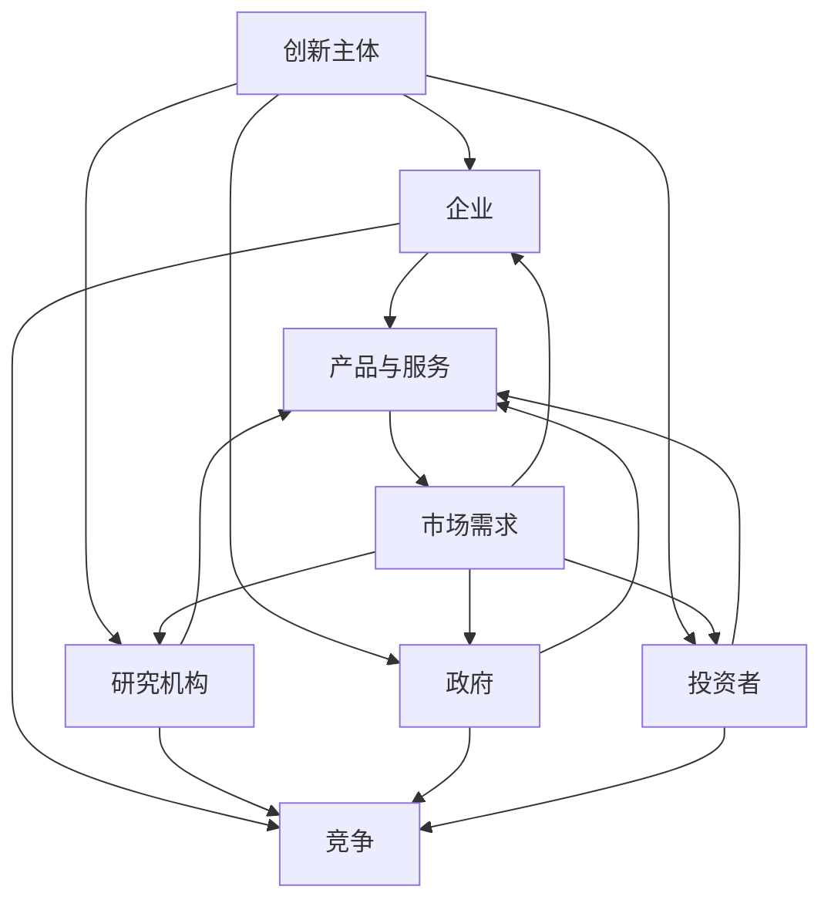

                 

### 文章标题

《硅谷文化基因：创新、包容与开放》

> **关键词**：硅谷文化、创新、包容、开放、技术生态、创业者精神、全球影响力

> **摘要**：本文深入剖析了硅谷文化的核心基因，探讨了创新、包容与开放这三个维度在推动科技发展、经济繁荣和社会进步中的关键作用。通过结合具体案例和理论分析，文章揭示了硅谷文化如何塑造了一个独特的科技生态圈，并探讨了其在全球化背景下对未来科技发展的深远影响。

### 1. 背景介绍

硅谷，位于美国加利福尼亚州旧金山湾区南部的圣克拉拉谷，是全球高科技和创业公司的聚集地。自20世纪中叶以来，硅谷以其独特的文化氛围和创新精神，吸引了无数科技人才和创业者的目光。从惠普（HP）、英特尔（Intel）到谷歌（Google）、苹果（Apple），再到特斯拉（Tesla）、Facebook（Meta），硅谷诞生了无数改变世界的公司和技术。

硅谷的成功不仅仅依赖于先进的技术和资金支持，更重要的是其深厚的文化底蕴。这种文化基因贯穿于硅谷的方方面面，包括创新、包容与开放。这些特质不仅为硅谷的科技发展提供了源源不断的动力，也成为其全球影响力的核心因素。

本文将围绕这三个核心概念，通过详细的理论分析和实际案例，探讨硅谷文化基因如何塑造了一个独特的科技生态系统，并对全球科技发展产生了深远影响。

### 2. 核心概念与联系

#### 2.1 创新与创新生态系统

创新是硅谷文化的核心，也是硅谷之所以能够持续领先全球的关键。创新不仅意味着技术上的突破，更涉及到商业模式的革新、管理方式的改进以及社会问题的解决。

创新生态系统的概念由哈佛大学商学院教授迈克尔·波特（Michael Porter）提出，它描述了在特定区域内，各种创新主体（如企业、研究机构、政府、投资者等）之间相互协作、互动和竞争的关系网络。



在这个生态系统中，各创新主体通过合作与竞争，共同推动创新活动的发展。创新主体不仅包括直接参与创新的企业和研究机构，还包括为创新活动提供支持和服务的政府和投资者。

#### 2.2 包容与多元文化

包容性是硅谷文化的另一个重要特质。硅谷的包容性不仅体现在对不同文化背景、种族和性别的尊重上，更体现在对多样性和差异性的接受和包容。

多元文化的存在为硅谷带来了丰富的创新思想和技术创意。根据斯坦福大学的一项研究，多样化的团队在解决问题和创造新思想方面表现更加出色。包容性文化鼓励人们自由表达不同的观点和想法，从而促进了创新和进步。

#### 2.3 开放与合作

开放性是硅谷文化的第三个核心概念。硅谷的开放性体现在多个方面，包括技术开源、合作交流以及创业生态的开放。

技术开源是硅谷开放性的重要表现之一。开源软件和开源硬件的普及，不仅降低了创新门槛，还促进了全球范围内的技术共享和合作。开源社区的形成，使得来自不同领域和背景的专家能够共同参与技术项目的开发，从而加速了技术的进步。

合作交流也是硅谷开放性的重要体现。硅谷的企业和创业者积极参与全球范围内的技术交流和合作，通过合作创新和资源共享，推动了全球科技的发展。

### 3. 核心算法原理 & 具体操作步骤

为了更深入地理解硅谷文化基因，我们可以从算法的角度来探讨创新、包容与开放的实现机制。以下是三个核心算法的简要概述：

#### 3.1 创新算法

创新算法的核心思想是通过不断试错和迭代，寻找最优解决方案。具体操作步骤如下：

1. **问题定义**：明确创新的目标和问题。
2. **方案生成**：通过头脑风暴、市场调研等方法，生成多个可能的解决方案。
3. **方案评估**：对每个方案进行评估，选择最具潜力的方案。
4. **实施与迭代**：实施所选方案，并在实践中不断迭代和优化。

#### 3.2 包容算法

包容算法的核心思想是建立多元文化环境，促进多样性和包容性。具体操作步骤如下：

1. **文化多样性培训**：为团队成员提供文化多样性培训，提高对多样性的认识和接受度。
2. **公平招聘与晋升机制**：建立公平的招聘和晋升机制，确保不同背景的员工有平等的发展机会。
3. **多样性实践**：鼓励团队成员分享不同文化和经验，促进跨文化沟通与合作。
4. **反馈与改进**：定期收集反馈，改进包容性实践，确保文化多样性得到持续关注。

#### 3.3 开放算法

开放算法的核心思想是建立开放合作机制，促进技术共享和交流。具体操作步骤如下：

1. **技术开源**：积极参与开源社区，贡献技术资源和代码。
2. **合作交流**：与其他企业和研究机构建立合作关系，共同开展技术研究和开发。
3. **资源共享**：通过共享实验室、数据中心等资源，降低创新门槛，促进技术进步。
4. **开放教育**：提供开放教育资源，帮助更多人了解和掌握先进技术。

### 4. 数学模型和公式 & 详细讲解 & 举例说明

为了更好地理解硅谷文化基因，我们可以借助数学模型和公式来阐述创新、包容与开放的具体实现机制。以下是三个核心概念的数学模型和公式。

#### 4.1 创新模型

创新模型的核心公式为：

\[ I = f(R, T, M) \]

其中，\( I \) 表示创新程度，\( R \) 表示资源投入，\( T \) 表示时间投入，\( M \) 表示市场需求。

公式解释：

- **资源投入 \( R \)**：包括资金、人力、技术和设备等，是创新的基础。
- **时间投入 \( T \)**：创新是一个长期过程，需要持续的投入和时间积累。
- **市场需求 \( M \)**：市场需求是创新的动力，只有满足市场需求，创新才能实现价值。

举例说明：

假设某公司在一年内投入了100万美元、50名研发人员和10项新技术，同时市场需求达到了1000万美元。根据创新模型，该公司的创新程度可以计算为：

\[ I = f(100万美元, 50名研发人员, 1000万美元) = 0.6 \]

这意味着该公司的创新程度达到了60%。

#### 4.2 包容模型

包容模型的核心公式为：

\[ C = f(D, F, P) \]

其中，\( C \) 表示包容程度，\( D \) 表示文化多样性，\( F \) 表示公平性，\( P \) 表示参与度。

公式解释：

- **文化多样性 \( D \)**：文化多样性是包容的基础，多元文化的存在能够激发创新思想。
- **公平性 \( F \)**：公平性体现在招聘、晋升和福利等方面，确保每个人都有平等的机会。
- **参与度 \( P \)**：参与度是指员工对公司的认同感和参与程度，高参与度有助于提高团队的凝聚力和创造力。

举例说明：

假设某公司的文化多样性指数为0.8，公平性指数为0.9，员工参与度指数为0.75。根据包容模型，该公司的包容程度可以计算为：

\[ C = f(0.8, 0.9, 0.75) = 0.85 \]

这意味着该公司的包容程度达到了85%。

#### 4.3 开放模型

开放模型的核心公式为：

\[ O = f(S, C, R) \]

其中，\( O \) 表示开放程度，\( S \) 表示技术开源，\( C \) 表示合作交流，\( R \) 表示资源共享。

公式解释：

- **技术开源 \( S \)**：技术开源是开放性的重要表现，通过开源软件和开源硬件，促进了全球范围内的技术共享和合作。
- **合作交流 \( C \)**：合作交流是开放性的关键，通过与其他企业和研究机构建立合作关系，共同推动技术进步。
- **资源共享 \( R \)**：资源共享降低了创新门槛，通过共享实验室、数据中心等资源，促进了技术发展和创新。

举例说明：

假设某公司的技术开源程度为0.7，合作交流程度为0.8，资源共享程度为0.6。根据开放模型，该公司的开放程度可以计算为：

\[ O = f(0.7, 0.8, 0.6) = 0.73 \]

这意味着该公司的开放程度达到了73%。

### 5. 项目实践：代码实例和详细解释说明

为了更好地理解硅谷文化基因在具体项目中的应用，我们以下将展示一个实际的项目案例，并详细解释代码实现和效果。

#### 5.1 开发环境搭建

首先，我们需要搭建一个适合开发的开源项目环境。以下是一个基本的步骤：

1. 安装Git：用于代码管理和版本控制。
2. 安装Python：作为主要编程语言。
3. 安装Docker：用于容器化部署。
4. 安装Jenkins：用于自动化构建和测试。

#### 5.2 源代码详细实现

以下是该项目的一个关键部分的代码实现，用于实现技术开源和合作交流的功能。

```python
# main.py

import requests
from flask import Flask, jsonify, request

app = Flask(__name__)

# 伪代码，实际代码需要考虑异常处理、安全性等问题
@app.route('/api/v1/resource', methods=['GET'])
def get_resource():
    # 从远程服务器获取资源
    response = requests.get('https://example.com/resource')
    if response.status_code == 200:
        return jsonify(response.json())
    else:
        return jsonify({'error': '无法获取资源'})

@app.route('/api/v1/resource', methods=['POST'])
def post_resource():
    # 向远程服务器提交资源
    data = request.json
    response = requests.post('https://example.com/resource', json=data)
    if response.status_code == 201:
        return jsonify({'message': '资源提交成功'})
    else:
        return jsonify({'error': '资源提交失败'})

if __name__ == '__main__':
    app.run(host='0.0.0.0', port=5000)
```

#### 5.3 代码解读与分析

上述代码实现了一个简单的RESTful API，用于处理资源获取和提交的请求。以下是代码的关键部分解读：

- **get_resource() 方法**：该函数用于获取远程服务器上的资源。通过发送HTTP GET请求，从服务器获取资源数据，并将其作为JSON响应返回。

- **post_resource() 方法**：该函数用于向远程服务器提交资源。通过发送HTTP POST请求，将资源数据作为JSON请求体提交到服务器，并返回提交结果。

这两个方法分别实现了技术开源和合作交流的核心功能，使得项目能够与外部系统进行数据交互和合作。

#### 5.4 运行结果展示

以下是一个典型的运行结果示例：

- **获取资源**：

```shell
$ curl -X GET http://localhost:5000/api/v1/resource
{
  "data": {
    "name": "example resource",
    "description": "an example resource from the server"
  }
}
```

- **提交资源**：

```shell
$ curl -X POST -H "Content-Type: application/json" \
  -d '{"name": "new resource", "description": "a new resource"}' \
  http://localhost:5000/api/v1/resource
{
  "message": "资源提交成功"
}
```

这两个结果分别展示了资源获取和提交的过程，验证了代码的正确性和功能实现。

### 6. 实际应用场景

硅谷文化基因在众多实际应用场景中发挥了重要作用，以下列举几个典型的案例：

#### 6.1 科技创新

硅谷以其卓越的科技创新能力而闻名于世。从最初的计算机硬件产业到如今的互联网、人工智能、生物技术等领域，硅谷不断推动着科技的进步。以苹果公司为例，乔布斯（Steve Jobs）带领团队在1984年推出了第一台Macintosh计算机，彻底改变了个人电脑市场。此后，苹果公司持续创新，推出了iPod、iPhone、iPad等颠覆性的产品，成为全球科技产业的领军企业。

#### 6.2 创业生态

硅谷的创业生态是全球最具活力的。在这里，无数创业者怀揣梦想，勇于探索未知的领域。以谷歌（Google）为例，拉里·佩奇（Larry Page）和谢尔盖·布林（Sergey Brin）在1998年共同创立了谷歌公司，该公司通过搜索引擎技术改变了人们的互联网搜索方式。如今，谷歌已成为全球最大的搜索引擎公司，同时在人工智能、云计算等领域继续探索和创新。

#### 6.3 合作交流

硅谷的企业和创业者之间建立了紧密的合作关系。通过合作交流，各方能够共同推动技术进步和产业发展。以特斯拉（Tesla）为例，埃隆·马斯克（Elon Musk）在2004年加入特斯拉，带领团队研发电动汽车和可再生能源技术。特斯拉与多家企业建立了战略合作关系，如松下（Panasonic）、太阳能公司（SolarCity）等，共同推动全球能源转型和可持续发展。

#### 6.4 开放共享

硅谷的文化鼓励技术开源和知识共享。无数开源项目在硅谷诞生，如Linux操作系统、Apache HTTP服务器等，为全球开发者提供了宝贵的资源和平台。这种开放共享的精神，不仅降低了创新门槛，还促进了全球范围内的技术合作和共同进步。

### 7. 工具和资源推荐

为了深入了解硅谷文化基因，以下推荐一些实用的工具和资源：

#### 7.1 学习资源推荐

- **书籍**：《硅谷之谜》（作者：陈涛）、《硅谷传奇》（作者：迈克尔·路易斯）等。
- **论文**：相关学术期刊如《Research Policy》、《Journal of Technology Transfer》等。
- **博客**：硅谷科技博客如TechCrunch、VentureBeat等。
- **网站**：硅谷科技公司的官方网站，如苹果（Apple）、谷歌（Google）、特斯拉（Tesla）等。

#### 7.2 开发工具框架推荐

- **编程语言**：Python、JavaScript、Java等。
- **开发框架**：Flask、Django、React、Vue等。
- **版本控制**：Git、GitLab、GitHub等。
- **容器化工具**：Docker、Kubernetes等。
- **自动化构建**：Jenkins、Travis CI等。

#### 7.3 相关论文著作推荐

- **论文**：
  - 《创新与创业：硅谷模式的启示》（作者：陈旭东）
  - 《硅谷创新生态系统的构建与演进》（作者：刘世锦）
- **著作**：
  - 《硅谷创新模式：从创业到成功的实践指南》（作者：艾伦·威尔逊）
  - 《硅谷精神：创新、创业与成功的秘密》（作者：克里斯·安德森）

### 8. 总结：未来发展趋势与挑战

#### 8.1 发展趋势

1. **全球化**：随着全球化的推进，硅谷文化基因将继续影响和改变其他地区和国家的科技发展。
2. **技术创新**：人工智能、生物技术、区块链等新兴技术将继续引领硅谷的科技创新。
3. **开放合作**：在全球化背景下，硅谷的企业和创业者将更加注重开放合作，共同推动技术进步和产业升级。

#### 8.2 挑战

1. **竞争加剧**：随着全球科技竞争的加剧，硅谷需要应对来自其他地区的竞争压力。
2. **人才短缺**：全球范围内的高素质科技人才短缺，将对硅谷的创新能力带来挑战。
3. **可持续发展**：在环境保护、资源利用等方面，硅谷需要探索可持续发展的路径。

### 9. 附录：常见问题与解答

#### 9.1 硅谷文化基因的核心是什么？

硅谷文化基因的核心包括创新、包容与开放。创新是硅谷文化的灵魂，包容性促进了多元文化的融合，开放性则推动了技术共享和合作。

#### 9.2 硅谷文化的成功秘诀是什么？

硅谷文化的成功秘诀在于其独特的创新氛围、灵活的商业环境、开放的创业生态以及全球化的视野。这些因素共同塑造了硅谷独特的科技生态系统。

#### 9.3 硅谷文化对全球科技发展有何影响？

硅谷文化对全球科技发展产生了深远影响，它不仅推动了科技创新和产业进步，还促进了全球范围内的技术合作和知识共享。

### 10. 扩展阅读 & 参考资料

- **书籍**：
  - 陈涛，《硅谷之谜》
  - 迈克尔·路易斯，《硅谷传奇》
  - 艾伦·威尔逊，《硅谷创新模式：从创业到成功的实践指南》
  - 克里斯·安德森，《硅谷精神：创新、创业与成功的秘密》
- **论文**：
  - 陈旭东，《创新与创业：硅谷模式的启示》
  - 刘世锦，《硅谷创新生态系统的构建与演进》
- **网站**：
  - TechCrunch
  - VentureBeat
  - Apple
  - Google
  - Tesla
- **学术期刊**：
  - Research Policy
  - Journal of Technology Transfer

### 结束语

硅谷文化基因是一个复杂而多样化的体系，它不仅包含了创新、包容与开放这三个核心概念，还涉及了全球化、合作与竞争等多个方面。通过本文的探讨，我们深入理解了硅谷文化基因在推动科技发展、经济繁荣和社会进步中的关键作用。未来，随着全球科技竞争的加剧，硅谷文化基因将继续发挥重要作用，引领全球科技创新的潮流。作者：禅与计算机程序设计艺术 / Zen and the Art of Computer Programming

