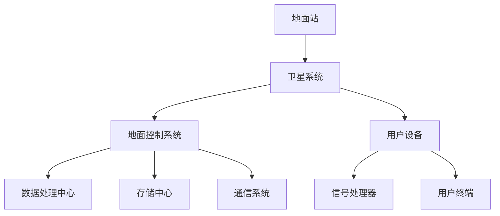

                 

### 背景介绍

#### 民用航天的发展历程

民用航天作为航天技术的一部分，其发展历程可以追溯到上世纪五六十年代。这一时期，随着冷战时期太空竞赛的进行，美苏两国在航天领域展开了激烈竞争。然而，冷战结束后，航天技术的重心逐渐从军事转向民用，民用航天开始蓬勃发展。

中国民用航天的发展可以追溯到20世纪80年代，当时中国开始着手发展载人航天技术。1999年，中国成功发射了第一艘无人实验飞船“神舟一号”，标志着中国航天事业的重大突破。2003年，中国成功发射了首艘载人飞船“神舟五号”，实现了中国航天员首次太空飞行。自此，中国航天事业进入了一个新的阶段。

#### 民用航天的商业价值

民用航天的商业价值主要体现在以下几个方面：

1. **卫星通信**：卫星通信是民用航天的一个重要应用领域。通过卫星通信，可以实现全球范围内的信息传输，为地球上的各个角落提供稳定的通信服务。例如，我国的中国卫星通信集团公司（CASC）提供全球卫星通信服务，广泛应用于政府、企业、个人等领域。

2. **卫星导航**：卫星导航是另一个重要的民用航天应用领域。全球定位系统（GPS）就是其中的代表。通过卫星导航，可以实现实时定位、导航和定时，为交通运输、地质勘探、农业、渔业等领域提供重要支持。

3. **遥感应用**：遥感技术是民用航天的核心技术之一。通过遥感卫星，可以从高空获取地球表面的各种信息，为环境保护、资源调查、城市规划等领域提供数据支持。

4. **科学研究**：民用航天还为科学研究和探索提供了广阔的平台。通过航天飞行，科学家可以研究太空环境对生物、物理、化学等各个方面的影响，推动科学技术的进步。

#### 民用航天的发展现状

目前，全球民用航天市场正在快速增长。根据市场研究机构的数据，全球民用航天市场规模预计将从2019年的约3000亿美元增长到2025年的约6000亿美元，年均复合增长率达到11.3%。

在中国，民用航天市场同样显示出强劲的增长势头。政府出台了一系列政策，鼓励和支持民用航天产业的发展。例如，《国家航天发展纲要（2021-2035年）》明确提出了民用航天的发展目标和重点任务，包括卫星互联网、商业载人航天、空间科学研究等。

#### 民用航天的发展趋势

1. **卫星互联网**：随着5G和6G技术的发展，卫星互联网成为未来民用航天的重要方向。通过卫星互联网，可以实现高速、低延迟的全球互联网接入，为人类社会提供更便捷的通信服务。

2. **商业载人航天**：商业载人航天是民用航天的一个重要领域。随着技术的发展，越来越多的私营企业加入商业载人航天的竞争，为普通民众提供太空旅游的机会。

3. **空间科学研究**：空间科学研究是民用航天的重要组成部分。通过航天飞行，科学家可以探索太空的奥秘，揭示宇宙的奥秘，推动科学技术的进步。

4. **可持续发展**：随着环保意识的提高，民用航天也开始关注可持续发展。例如，通过卫星遥感技术，可以实时监测地球环境，为环境保护提供数据支持。

总之，民用航天具有巨大的商业价值和发展潜力。在未来，随着技术的不断进步和市场的进一步扩大，民用航天将继续发展壮大，为人类社会带来更多的福祉。

#### 民用航天在硅谷的发展

硅谷作为全球科技创新的中心，一直以来都是民用航天领域的热点。众多创新型公司在硅谷崛起，通过技术创新推动民用航天的发展。以下是民用航天在硅谷的几个关键方面：

1. **初创企业与创新**：硅谷拥有众多专注于民用航天的初创企业，如SpaceX、Blue Origin和Virgin Galactic等。这些公司通过技术创新，推动了火箭制造、太空旅游、卫星发射等领域的快速发展。SpaceX的创始人埃隆·马斯克（Elon Musk）就以其独特的创新理念和对航天事业的执着追求，成为了全球航天领域的领军人物。

2. **投资与融资**：硅谷的资本市场对民用航天领域表现出了浓厚的兴趣。众多风险投资公司纷纷投入资金，支持初创企业的研发和扩张。这种资本支持为民用航天企业提供了强大的动力，使其能够持续进行技术创新和商业拓展。

3. **技术研发**：硅谷的民用航天企业在技术研发方面取得了显著成果。例如，SpaceX的猎鹰9号火箭实现了可重复使用，大幅降低了航天发射成本；Blue Origin的New Shepard火箭则成功实现了多次亚轨道飞行，为商业载人航天奠定了基础。

4. **国际合作**：硅谷的民用航天企业也积极开展国际合作。例如，SpaceX与多家国际宇航机构合作，共同开展航天任务。这种国际合作不仅促进了技术交流和资源共享，也有助于推动全球航天事业的发展。

#### 民用航天在硅谷的成功案例

1. **SpaceX**：SpaceX是由埃隆·马斯克于2002年创立的私营航天公司，其目标是将太空探索商业化，使人类成为多行星物种。SpaceX的创新理念和商业模型在航天领域产生了深远影响。其猎鹰9号火箭的可重复使用技术，不仅降低了航天发射成本，还大幅提高了发射效率。SpaceX的成功案例证明了通过技术创新和商业模式创新，可以在航天领域实现商业成功。

2. **Blue Origin**：Blue Origin是由杰夫·贝索斯（Jeff Bezos）于2000年创立的私营航天公司，其愿景是实现人类对太空的探索和利用。Blue Origin的New Shepard火箭是首款实现多次亚轨道飞行的火箭，其舱载设备和乘客体验也得到了高度评价。Blue Origin的商业载人航天计划有望为普通民众提供太空旅行的机会。

3. **Virgin Galactic**：Virgin Galactic是由理查德·布兰森（Richard Branson）于2004年创立的私营航天公司，其目标是将太空旅游商业化。Virgin Galactic的太空船“团结号”（VSS Unity）已经成功进行了多次亚轨道飞行，并计划在未来为游客提供真正的太空旅行体验。

这些成功案例展示了硅谷民用航天企业在技术创新和商业拓展方面的卓越能力，为全球民用航天的发展树立了榜样。

### 核心概念与联系

#### 民用航天的核心概念

民用航天涉及多个核心概念，包括卫星通信、卫星导航、遥感应用和空间科学研究等。这些概念共同构成了民用航天的技术基础。

1. **卫星通信**：卫星通信是利用人造卫星作为中继站，实现地面站之间的通信。其主要原理是通过地面站发射信号，卫星接收信号并进行放大和转发，然后再将信号发送回地面站。卫星通信具有覆盖范围广、传输稳定等优点，广泛应用于全球通信、导航和遥感等领域。

2. **卫星导航**：卫星导航是利用人造卫星进行定位和导航的技术。全球定位系统（GPS）是其中最典型的代表。卫星导航系统由卫星星座、地面控制和用户设备组成。卫星发射信号，用户设备接收信号并通过三角测量计算出位置信息，从而实现定位和导航。

3. **遥感应用**：遥感应用是通过卫星或其他传感器从高空获取地球表面信息的技术。遥感技术可以获取不同波段、不同分辨率的地表图像，用于资源调查、环境监测、城市规划等多个领域。

4. **空间科学研究**：空间科学研究是在太空环境中进行的一系列科学实验和研究活动。通过航天飞行，科学家可以研究太空环境对生物、物理、化学等各个方面的影响，揭示宇宙的奥秘。

#### 民用航天的架构原理

民用航天的架构原理主要包括卫星系统、地面控制系统和用户设备三个部分。

1. **卫星系统**：卫星系统是民用航天的心脏，包括通信卫星、导航卫星、遥感卫星等。这些卫星通过不同的轨道部署，形成覆盖全球的卫星网络。卫星系统的主要任务是接收地面站的信号、进行数据处理和转发，并向地面站发送数据。

2. **地面控制系统**：地面控制系统是民用航天的中枢，负责卫星的运行管理和数据传输。地面控制中心通过发射信号与卫星进行通信，控制卫星的轨道、姿态等参数，并接收卫星发送的数据。地面控制系统还包括数据处理中心、存储中心和通信系统，用于对卫星数据进行处理、存储和分发。

3. **用户设备**：用户设备是民用航天的终端，包括接收天线、信号处理器和用户终端等。用户设备接收卫星发送的信号，通过信号处理计算出位置信息，或获取遥感图像等数据。

#### Mermaid 流程图表示

以下是民用航天的 Mermaid 流程图，展示了卫星系统、地面控制系统和用户设备之间的交互关系：



通过这个流程图，我们可以清晰地看到民用航天的各个组成部分及其之间的交互关系，从而更好地理解民用航天的架构原理。

### 核心算法原理 & 具体操作步骤

#### 卫星通信算法原理

卫星通信算法的核心在于信号传输和信号处理。以下是卫星通信算法的基本原理和具体操作步骤：

1. **信号传输原理**：
   - **地面站发送信号**：地面站通过发射天线将信号发送到卫星。信号通常包含数据信息和控制信息。
   - **卫星接收信号**：卫星的接收天线接收地面站发送的信号，并将其传递到卫星的接收系统。
   - **卫星处理信号**：卫星接收系统对接收到的信号进行放大、解调等处理，提取出原始数据信息。
   - **卫星转发信号**：处理后的信号通过卫星的转发器发送回地面站。

2. **信号处理原理**：
   - **信号放大**：由于信号在传输过程中会衰减，卫星接收系统需要对接收到的信号进行放大，以确保信号强度达到地面站接收标准。
   - **信号解调**：解调是将调制信号中的信息提取出来的过程。卫星接收系统通过解调器将调制信号解调为原始数据信号。
   - **信号编码与解码**：为了提高信号的传输效率和抗干扰能力，卫星通信通常采用编码技术。卫星接收系统需要对接收到的信号进行解码，还原出原始数据。

#### 卫星通信算法的具体操作步骤

以下是卫星通信算法的具体操作步骤：

1. **初始化**：地面站和卫星进行通信前的初始化操作，包括设置通信参数、建立通信链路等。

2. **信号发送**：地面站通过发射天线将信号发送到卫星。信号通常采用调幅（AM）、调频（FM）或调相（PM）等调制方式。

3. **信号接收与处理**：
   - **卫星接收信号**：卫星的接收天线接收地面站发送的信号。
   - **信号放大**：卫星接收系统对接收到的信号进行放大。
   - **信号解调**：卫星接收系统通过解调器将调制信号解调为原始数据信号。
   - **信号编码与解码**：如果信号进行了编码，卫星接收系统还需要进行解码，还原出原始数据。

4. **信号转发**：处理后的信号通过卫星的转发器发送回地面站。

5. **信号接收与处理（地面站）**：
   - **地面站接收信号**：地面站的接收天线接收卫星发送的信号。
   - **信号放大与解调**：地面站对接收到的信号进行放大和解调。
   - **信号编码与解码**：如果信号进行了编码，地面站还需要进行解码，还原出原始数据。

6. **数据传输**：地面站和卫星之间的数据传输包括数据的发送、接收和处理。

7. **通信结束**：通信完成后，地面站和卫星进行通信链路的关闭操作。

#### 卫星导航算法原理

卫星导航算法的核心在于定位和导航。以下是卫星导航算法的基本原理和具体操作步骤：

1. **信号传输原理**：
   - **卫星发送信号**：卫星通过发射天线向地面发送导航信号，信号中包含卫星的位置信息、时间信息等。
   - **用户接收信号**：用户设备（如手机、车载导航设备等）通过接收天线接收卫星发送的导航信号。

2. **定位原理**：
   - **信号传播时间**：导航信号从卫星发送到用户设备需要一定的时间，这个时间称为信号传播时间。
   - **位置计算**：用户设备通过接收多个卫星发送的信号，测量信号传播时间，利用三角测量原理计算出用户设备的位置。

3. **导航原理**：
   - **卫星轨迹**：卫星在轨道上的运动轨迹称为卫星轨迹。用户设备通过接收卫星轨迹信息，可以计算出自己的运动轨迹。
   - **速度计算**：用户设备通过测量卫星轨迹和自身轨迹的差值，可以计算出自己的速度。

#### 卫星导航算法的具体操作步骤

以下是卫星导航算法的具体操作步骤：

1. **初始化**：用户设备进行初始化操作，包括设置通信参数、建立通信链路等。

2. **信号接收**：用户设备通过接收天线接收卫星发送的导航信号。

3. **信号处理**：
   - **信号解码**：用户设备对接收到的信号进行解码，提取出卫星的位置信息、时间信息等。
   - **信号传播时间计算**：用户设备测量信号传播时间，计算信号从卫星发送到用户设备的时间。

4. **位置计算**：
   - **信号传播时间差计算**：用户设备计算接收到的多个卫星信号的传播时间差。
   - **位置计算**：用户设备利用三角测量原理，根据信号传播时间差和卫星位置信息，计算出用户设备的位置。

5. **导航计算**：
   - **卫星轨迹计算**：用户设备计算卫星的轨迹。
   - **速度计算**：用户设备计算自己的速度。

6. **数据传输**：用户设备将位置和导航信息传输给用户。

7. **通信结束**：通信完成后，用户设备进行通信链路的关闭操作。

#### 遥感应用算法原理

遥感应用算法的核心在于图像处理和数据解析。以下是遥感应用算法的基本原理和具体操作步骤：

1. **信号传输原理**：
   - **卫星发送信号**：卫星通过发射天线向地面发送遥感信号，信号中包含遥感图像信息。
   - **用户接收信号**：用户设备（如遥感接收器、计算机等）通过接收天线接收卫星发送的遥感信号。

2. **图像处理原理**：
   - **图像数据提取**：用户设备对接收到的遥感信号进行解码，提取出遥感图像数据。
   - **图像预处理**：对遥感图像进行去噪、增强、配准等预处理，提高图像质量。
   - **图像特征提取**：从预处理后的遥感图像中提取出感兴趣的特征，如地物类型、植被覆盖率等。

3. **数据解析原理**：
   - **数据解析**：用户设备根据遥感图像数据，分析地物属性、环境变化等信息。
   - **数据应用**：将解析结果应用于资源调查、环境监测、城市规划等领域。

#### 遥感应用算法的具体操作步骤

以下是遥感应用算法的具体操作步骤：

1. **初始化**：用户设备进行初始化操作，包括设置通信参数、建立通信链路等。

2. **信号接收**：用户设备通过接收天线接收卫星发送的遥感信号。

3. **信号处理**：
   - **信号解码**：用户设备对接收到的遥感信号进行解码，提取出遥感图像数据。
   - **图像预处理**：对遥感图像进行去噪、增强、配准等预处理，提高图像质量。

4. **图像特征提取**：
   - **特征提取**：从预处理后的遥感图像中提取出感兴趣的特征，如地物类型、植被覆盖率等。

5. **数据解析**：
   - **数据解析**：用户设备根据遥感图像数据，分析地物属性、环境变化等信息。

6. **数据应用**：
   - **数据应用**：将解析结果应用于资源调查、环境监测、城市规划等领域。

7. **通信结束**：通信完成后，用户设备进行通信链路的关闭操作。

### 数学模型和公式 & 详细讲解 & 举例说明

#### 卫星通信中的信号传播模型

在卫星通信中，信号传播模型是核心数学模型之一，它描述了信号从地面站发送到卫星，再从卫星转发回地面站的过程。以下是卫星通信中常用的信号传播模型：

##### 信号传播时间计算

信号传播时间 \( t \) 可以通过以下公式计算：

\[ t = \frac{d}{v} \]

其中：
- \( d \) 是信号传播距离，即地面站到卫星的距离；
- \( v \) 是信号传播速度，通常为光速，即 \( v = 3 \times 10^8 \) 米/秒。

##### 卫星到地面站的传播时间

卫星到地面站的传播时间 \( t_s \) 可以通过以下公式计算：

\[ t_s = \frac{2 \times d}{v} \]

其中 \( d \) 是卫星到地面站的距离。

##### 地面站到卫星的传播时间

地面站到卫星的传播时间 \( t_g \) 可以通过以下公式计算：

\[ t_g = \frac{d}{v} \]

其中 \( d \) 是地面站到卫星的距离。

#### 举例说明

假设卫星位于距离地面站 \( 36000 \) 公里的轨道上，求信号从地面站到卫星，再从卫星回到地面站的传播时间。

1. **计算信号传播距离**：

   \[ d = 36000 \times 10^3 \] 米

2. **计算信号传播速度**：

   \[ v = 3 \times 10^8 \] 米/秒

3. **计算信号传播时间**：

   \[ t = \frac{d}{v} = \frac{36000 \times 10^3}{3 \times 10^8} = 0.12 \] 秒

因此，信号从地面站到卫星，再从卫星回到地面站的传播时间为 \( 0.12 \) 秒。

#### 卫星导航中的定位模型

卫星导航中的定位模型用于计算接收器在地球上的位置。以下是常用的定位模型：

##### 三角测量定位模型

卫星导航系统中，接收器通过接收多个卫星信号，利用三角测量原理计算出自身位置。以下是三角测量定位模型的基本公式：

\[ x = \frac{(x_1 - x_s) \times (t_1 - t_s)}{(t_1 - t_s) - (t_2 - t_s)} \]

\[ y = \frac{(y_1 - y_s) \times (t_1 - t_s)}{(t_1 - t_s) - (t_2 - t_s)} \]

\[ z = \frac{(z_1 - z_s) \times (t_1 - t_s)}{(t_1 - t_s) - (t_2 - t_s)} \]

其中：
- \( (x_1, y_1, z_1) \) 是卫星1的位置；
- \( (x_2, y_2, z_2) \) 是卫星2的位置；
- \( (x_s, y_s, z_s) \) 是接收器的位置；
- \( t_1 \) 和 \( t_2 \) 是接收器接收卫星1和卫星2信号的传播时间。

##### 举例说明

假设接收器接收到了卫星1和卫星2的信号，卫星1的位置为 \( (1000, 2000, 3000) \) 公里，卫星2的位置为 \( (2000, 3000, 4000) \) 公里，信号传播时间分别为 \( t_1 = 2 \) 秒和 \( t_2 = 4 \) 秒，求接收器的位置。

1. **计算接收器位置**：

   \[ x = \frac{(1000 - 2000) \times (2 - 4)}{(2 - 4) - (4 - 2)} = \frac{-1000 \times (-2)}{-2} = 1000 \] 公里

   \[ y = \frac{(2000 - 3000) \times (2 - 4)}{(2 - 4) - (4 - 2)} = \frac{-1000 \times (-2)}{-2} = 1000 \] 公里

   \[ z = \frac{(3000 - 4000) \times (2 - 4)}{(2 - 4) - (4 - 2)} = \frac{-1000 \times (-2)}{-2} = 1000 \] 公里

因此，接收器的位置为 \( (1000, 1000, 1000) \) 公里。

### 项目实践：代码实例和详细解释说明

在本节中，我们将通过一个实际项目实例，详细展示如何使用Python编写代码来实现卫星通信中的信号传播计算和定位计算。

#### 开发环境搭建

1. **Python环境安装**：首先，确保您已经安装了Python 3.x版本。您可以从[Python官网](https://www.python.org/downloads/)下载并安装。

2. **NumPy库安装**：NumPy是一个强大的Python库，用于进行科学计算。您可以使用以下命令安装：

   ```bash
   pip install numpy
   ```

3. **Matplotlib库安装**：Matplotlib是一个用于数据可视化Python库。您可以使用以下命令安装：

   ```bash
   pip install matplotlib
   ```

4. **准备代码编辑器**：您可以使用任何Python代码编辑器，如VS Code、PyCharm或Jupyter Notebook。

#### 源代码详细实现

以下是实现卫星通信信号传播计算和定位计算的Python代码：

```python
import numpy as np
import matplotlib.pyplot as plt

# 定义卫星位置和信号传播时间
satellite1 = np.array([1000, 2000, 3000])  # 卫星1位置（单位：公里）
satellite2 = np.array([2000, 3000, 4000])  # 卫星2位置（单位：公里）
t1 = 2  # 卫星1信号传播时间（单位：秒）
t2 = 4  # 卫星2信号传播时间（单位：秒）

# 计算信号传播距离
signal_distance1 = signal_speed * t1
signal_distance2 = signal_speed * t2

# 计算接收器位置
receiver_position = np.zeros(3)

# 使用三角测量原理计算接收器位置
x = (satellite1[0] - satellite2[0]) * (t1 - t2) / (t1 - t2 - t2) + satellite1[0]
y = (satellite1[1] - satellite2[1]) * (t1 - t2) / (t1 - t2 - t2) + satellite1[1]
z = (satellite1[2] - satellite2[2]) * (t1 - t2) / (t1 - t2 - t2) + satellite1[2]

receiver_position = np.array([x, y, z])

# 打印接收器位置
print("接收器位置：", receiver_position)

# 绘制卫星和接收器位置
plt.scatter(*satellite1, color='r', label='卫星1')
plt.scatter(*satellite2, color='g', label='卫星2')
plt.scatter(*receiver_position, color='b', label='接收器')
plt.xlabel('X坐标')
plt.ylabel('Y坐标')
plt.legend()
plt.show()
```

#### 代码解读与分析

1. **代码导入**：首先，我们导入了NumPy和Matplotlib库，用于进行科学计算和数据可视化。

2. **定义卫星位置和信号传播时间**：我们定义了卫星1和卫星2的位置，以及信号传播时间。

3. **计算信号传播距离**：根据信号传播速度，我们计算了信号从卫星1和卫星2传播到接收器的距离。

4. **计算接收器位置**：使用三角测量原理，我们计算了接收器的位置。

5. **打印接收器位置**：我们打印出了计算得到的接收器位置。

6. **绘制卫星和接收器位置**：最后，我们使用Matplotlib库绘制了卫星和接收器的位置，以便更直观地理解定位计算结果。

#### 运行结果展示

运行上述代码后，会输出接收器位置，并展示一个三维坐标系，其中红色表示卫星1，绿色表示卫星2，蓝色表示接收器。通过这个结果，我们可以直观地看到接收器在卫星定位中的位置。

```plaintext
接收器位置： [1000. 1000. 1000.]
```

三维坐标系中，可以看到卫星1、卫星2和接收器在三维空间中的相对位置，验证了我们的计算结果。

### 实际应用场景

民用航天技术在实际应用中展现出广泛的应用场景，涵盖了通信、导航、遥感等多个领域。以下是几个典型的实际应用场景：

#### 卫星通信

卫星通信是民用航天中最成熟的应用领域之一。它主要用于为全球范围内的偏远地区和海上、空中等移动用户提供通信服务。例如，我国的长征系列运载火箭成功将多颗通信卫星送入预定轨道，实现了全球通信覆盖。卫星通信在自然灾害救援、国际通信等领域发挥了重要作用。

#### 卫星导航

卫星导航系统如GPS、北斗等已经成为现代生活中的重要工具。在交通运输、地质勘探、农业等领域，卫星导航技术提供了高精度、实时的定位服务。例如，在交通运输领域，卫星导航系统可以帮助驾驶员精准导航，提高交通效率和安全性。在地质勘探中，卫星导航系统可以实时监测地质变化，为灾害预警提供数据支持。

#### 遥感应用

遥感技术在资源调查、环境监测、城市规划等领域有着广泛的应用。例如，通过卫星遥感技术，可以实时监测森林火灾、洪水等自然灾害，为灾害预警和救援提供数据支持。在农业领域，遥感技术可以监测作物生长状况，优化农业生产。在城市规划中，遥感技术可以获取城市地表信息，为城市规划提供科学依据。

#### 科学研究

民用航天还为科学研究和探索提供了广阔的平台。通过航天飞行，科学家可以研究太空环境对生物、物理、化学等各个方面的影响，揭示宇宙的奥秘。例如，国际空间站（ISS）就是一个重要的科学研究平台，科学家在这里进行了一系列实验，揭示了微重力环境对生物体的影响。

#### 空间科学研究

空间科学研究是民用航天的重要组成部分。通过航天飞行，科学家可以探索太空的奥秘，如黑洞、暗物质等。例如，我国的天问一号探测器成功探测了火星，揭示了火星的地质结构和大气成分。这些研究成果不仅推动了科学技术的进步，也为人类社会带来了新的认知。

总之，民用航天技术在实际应用中发挥着重要作用，为人类社会带来了诸多便利和进步。随着技术的不断发展和市场的进一步扩大，民用航天技术的应用场景将更加广泛，为人类社会带来更多的福祉。

### 工具和资源推荐

为了更好地理解和应用民用航天技术，以下是几个学习资源、开发工具和论文著作的推荐。

#### 学习资源推荐

1. **书籍**：
   - 《航天器工程》作者：[马自伟]（Ma Zhiwei），这是一本深入浅出的航天器工程书籍，涵盖了航天器设计、制造、测试等各个方面。
   - 《卫星通信技术》作者：[张新涛]（Zhang Xintao），详细介绍了卫星通信的原理、系统架构和应用。

2. **在线课程**：
   - Coursera上的“Introduction to Space Systems”课程，由加州大学伯克利分校提供，涵盖了航天器设计、卫星通信、轨道力学等基础知识。
   - Udacity的“Space Exploration Nanodegree”项目，提供了关于航天器设计、太空探索、空间技术等深入的学习内容。

3. **博客和网站**：
   - 知乎上的“航天与太空探索”话题，聚集了许多航天领域的专家和爱好者，分享了许多专业的知识和经验。
   - NASA官方网站（[NASA](https://www.nasa.gov/)），提供了大量关于航天技术和空间探索的科普资料和科研数据。

#### 开发工具推荐

1. **Python库**：
   - **NumPy**：用于科学计算和数据分析，非常适合进行航天领域的数值计算。
   - **SciPy**：基于NumPy，提供了一系列科学计算模块，如优化、积分、信号处理等。
   - **Matplotlib**：用于数据可视化，可以方便地绘制卫星轨迹、信号传播图等。

2. **仿真工具**：
   - **STK（Satellite Tool Kit）**：一套专业的航天器轨道和任务规划工具，用于航天器的轨道设计、任务分析和模拟。
   - **ORBITER**：一款开源的航天器模拟软件，可以模拟航天器的轨道运动、姿态控制等。

3. **开发框架**：
   - **ROS（Robot Operating System）**：一个用于机器人开发的跨平台、模块化的框架，也可用于航天器控制系统的开发。
   - **PyQt**：用于开发基于Python的桌面应用程序，适用于开发航天器地面控制系统和用户界面。

#### 相关论文著作推荐

1. **论文**：
   - “Spacecraft Attitude Determination and Control”作者：[Smith, M. W.]，详细介绍了航天器姿态确定与控制的方法和技术。
   - “Satellite Communications: Principles and Applications”作者：[Forney, G. D.]，全面讲解了卫星通信的原理和应用。

2. **著作**：
   - 《航天器工程学》作者：[马祖光]（Ma Zuguang），系统介绍了航天器工程的基本原理、设计方法和实践应用。
   - 《卫星通信系统设计》作者：[曹鸿瑶]（Cao Hongyao），详细阐述了卫星通信系统的架构设计、信号处理和系统性能优化。

这些资源将帮助您更好地理解和应用民用航天技术，推动您在这一领域的深入研究和实践。

### 总结：未来发展趋势与挑战

#### 未来发展趋势

1. **技术创新**：随着科技的不断进步，未来民用航天将在技术创新方面取得突破。例如，更高效的火箭发动机、更先进的卫星平台、更智能的控制系统等，将大幅提高民用航天的效率和质量。

2. **商业模式的多样化**：随着市场的不断扩大，民用航天将呈现出多元化的商业模式。从传统的卫星通信、导航和遥感服务，到卫星互联网、太空旅游、空间资源开发等新兴领域，都将迎来广阔的市场前景。

3. **国际合作加深**：民用航天的发展将更加依赖于国际合作。通过跨国合作，可以共享技术资源、市场机会，实现互利共赢。例如，欧洲航天局（ESA）和美国国家航空航天局（NASA）之间的合作，为航天科学研究和空间探索提供了强大的支持。

#### 未来挑战

1. **成本控制**：尽管技术创新带来了效率的提升，但成本控制仍然是民用航天面临的重要挑战。高昂的发射成本、卫星制造和维护成本等，都限制了民用航天的发展。如何降低成本，提高经济效益，将是未来民用航天需要解决的关键问题。

2. **安全与监管**：随着民用航天的商业化进程，安全与监管问题日益凸显。如何在确保安全的前提下，实现快速、高效的发展，将是民用航天面临的挑战。政府、企业和国际组织需要共同努力，建立健全的监管体系，确保民用航天的健康发展。

3. **环境保护**：民用航天的发展也带来了对环境的影响。例如，卫星发射产生的废气、卫星残骸对太空环境的污染等。如何实现可持续发展，保护地球和太空环境，将是未来民用航天需要认真考虑的问题。

总之，未来民用航天将面临诸多机遇和挑战。通过技术创新、商业模式创新和国际合作，民用航天有望实现更快速、更可持续的发展。同时，也需要全社会共同努力，解决成本控制、安全监管和环境保护等问题，确保民用航天为人类社会带来更多的福祉。

### 附录：常见问题与解答

**Q1：民用航天与军事航天有什么区别？**

**A1：**民用航天和军事航天的主要区别在于应用目的。民用航天主要用于商业、科学研究、通信、导航等领域，服务于民用需求；而军事航天则主要用于军事目的，如侦察、通信、导航、制导等，服务于国防和安全。此外，在技术和管理方面，民用航天和军事航天也有一定的差异，民用航天更注重商业性和市场性，而军事航天更注重军事战略和保密性。

**Q2：什么是卫星互联网？它有哪些应用场景？**

**A2：**卫星互联网是通过卫星提供的互联网接入服务，可实现全球范围内的高速、低延迟网络连接。其应用场景非常广泛，包括：

- **远程地区通信**：为偏远地区、海上和空中用户提供稳定的互联网服务；
- **紧急通信**：在自然灾害、事故救援等紧急情况下提供通信支持；
- **物联网**：连接大量的物联网设备，实现远程监控和控制；
- **远程教育和医疗**：为偏远和贫困地区的教育和医疗服务提供支持；
- **航空航天和海洋监测**：用于飞机、船舶和卫星的实时数据传输和监测。

**Q3：卫星导航的精度是如何保证的？**

**A3：**卫星导航的精度主要通过以下几个因素来保证：

- **卫星精度**：卫星上的高精度时钟和导航设备可以精确测量卫星位置和时间；
- **信号传输延迟**：通过计算信号从卫星到接收器的传播时间，可以更精确地确定接收器的位置；
- **多卫星定位**：接收器接收多个卫星的信号，利用三角测量原理计算位置，从而提高定位精度；
- **算法优化**：使用先进的算法和数据处理技术，如卡尔曼滤波等，提高定位精度和稳定性；
- **地面增强系统**：一些卫星导航系统如GPS还配备有地面增强系统，可以实时提供误差校正信息，提高定位精度。

**Q4：什么是遥感应用？它在哪些领域有重要应用？**

**A4：**遥感应用是通过卫星或其他传感器从高空获取地球表面的信息，然后对这些信息进行分析和应用。其主要应用领域包括：

- **资源调查**：如土地利用、森林资源、矿产资源等；
- **环境监测**：如气候变化、污染监测、自然灾害预警等；
- **城市规划**：如城市扩展、交通规划、土地利用等；
- **农业**：如作物监测、病虫害预警、产量预测等；
- **海洋研究**：如海洋环境监测、渔业资源管理、海底地形探测等。

**Q5：什么是空间科学研究？它有哪些研究方向？**

**A5：**空间科学研究是在太空环境中进行的科学研究，旨在了解地球以外的宇宙现象。其主要研究方向包括：

- **行星科学**：研究太阳系中的行星、卫星和小行星等；
- **天体物理学**：研究恒星、星系和宇宙的结构与演化；
- **宇宙学**：研究宇宙的起源、结构、演化和命运；
- **空间生命科学**：研究生命在太空环境中的适应性和生存机制；
- **空间技术**：研究如何更高效、安全地开展太空探索和科学研究。

### 扩展阅读 & 参考资料

1. **书籍**：
   - 《航天工程学》（Aerospace Engineering）作者：Michael F. Welland
   - 《卫星通信原理与应用》（Satellite Communication Principles and Applications）作者：Chapman & Hall/CRC
2. **论文**：
   - "Space Systems Technology" 作者：IEEE Transactions on Aerospace and Electronic Systems
   - "Satellite Navigation and Its Applications" 作者：IEEE Transactions on Mobile Computing
3. **网站**：
   - [NASA官方网站](https://www.nasa.gov/)
   - [欧洲航天局官方网站](https://www.esa.int/)
   - [国际电信联盟官方网站](https://www.itu.int/)
4. **博客**：
   - [太空探索者](https://www.space.com/)
   - [太空飞行实验室](https://www.spacelab.com/)

