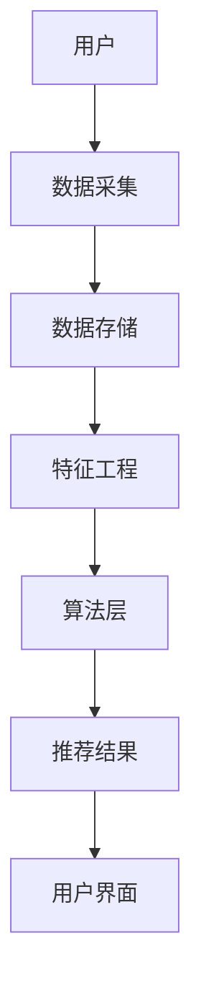

                 

### 文章标题

社交网络、个性化广告中的大模型推荐潜力

> 关键词：社交网络、个性化广告、大模型、推荐系统、算法、应用场景

> 摘要：本文将深入探讨社交网络和个性化广告中，大模型在推荐系统中的应用潜力。首先，我们将回顾社交网络和个性化广告的背景和发展，然后介绍推荐系统的基本概念和算法。接着，我们将重点分析大模型如何提升推荐效果，并探讨其实际应用场景。最后，我们将总结大模型推荐系统的发展趋势与挑战，并推荐相关资源和工具。

## 1. 背景介绍

社交网络和个性化广告作为现代互联网的两个重要领域，已经深刻地改变了人们的日常生活和商业模式。

### 社交网络

社交网络（Social Network）是指人们通过互联网平台建立的人际关系网络。自20世纪90年代互联网兴起以来，社交网络迅速发展，如Facebook、Twitter、LinkedIn等。社交网络为用户提供了分享信息、交流观点、建立关系和社区互动的平台。如今，社交网络已经成为人们获取信息、娱乐和社交的主要渠道。

### 个性化广告

个性化广告（Personalized Advertising）是一种基于用户兴趣和行为数据的广告推送方式。通过分析用户的浏览历史、搜索记录、社交活动等数据，广告系统可以预测用户的兴趣偏好，并为其推荐相关广告。个性化广告的普及，提高了广告的投放效果，同时也提高了用户的满意度。

### 推荐系统

推荐系统（Recommender System）是社交网络和个性化广告的核心技术。它利用机器学习和数据挖掘技术，从大量用户数据中挖掘潜在的兴趣偏好，并为用户提供个性化的信息推荐。推荐系统可以应用于电商、新闻推送、社交媒体、视频网站等多个领域，极大地提升了用户体验和商业价值。

## 2. 核心概念与联系

### 推荐系统基本概念

推荐系统主要包括用户、物品和评分三个基本概念。

- **用户（User）**：参与推荐系统的人或实体。
- **物品（Item）**：推荐系统中的推荐对象，如商品、新闻、音乐、电影等。
- **评分（Rating）**：用户对物品的评价，可以是数值评分、标签、点击、购买等。

### 推荐系统架构

推荐系统的基本架构包括数据层、算法层和界面层。

- **数据层**：负责数据的采集、存储和处理。
- **算法层**：包括协同过滤、基于内容的推荐、混合推荐等算法。
- **界面层**：负责将推荐结果展示给用户。

### Mermaid 流程图

以下是一个简单的推荐系统流程图，展示了用户、物品和评分之间的交互过程。



## 3. 核心算法原理 & 具体操作步骤

### 协同过滤

协同过滤（Collaborative Filtering）是一种常见的推荐算法，其核心思想是通过分析用户对物品的评分，发现用户之间的相似性，从而推荐用户可能感兴趣的物品。

### 具体操作步骤

1. **用户-物品矩阵构建**：首先，我们需要构建一个用户-物品矩阵，其中每个元素表示用户对物品的评分。
2. **相似性计算**：接下来，我们计算用户之间的相似性，常用的相似性度量方法有欧氏距离、余弦相似度等。
3. **预测评分**：根据用户之间的相似性和已知评分，预测用户对未知物品的评分。
4. **推荐结果生成**：根据预测评分，为用户推荐评分较高的物品。

### 基于内容的推荐

基于内容的推荐（Content-Based Filtering）是另一种常见的推荐算法，其核心思想是分析用户对物品的兴趣特征，推荐与用户兴趣相似的物品。

### 具体操作步骤

1. **物品特征提取**：首先，我们需要提取物品的特征信息，如文本、图片、标签等。
2. **用户兴趣建模**：接下来，我们分析用户的历史行为和评分，建立用户的兴趣模型。
3. **相似度计算**：然后，我们计算用户兴趣模型与物品特征之间的相似度。
4. **推荐结果生成**：根据相似度计算结果，为用户推荐相似度较高的物品。

## 4. 数学模型和公式 & 详细讲解 & 举例说明

### 协同过滤

在协同过滤算法中，常用的相似性度量方法有欧氏距离和余弦相似度。

1. **欧氏距离**

欧氏距离（Euclidean Distance）是两点之间最直观的距离度量方法，其公式如下：

$$
d(u_i, u_j) = \sqrt{\sum_{k=1}^{n} (r_{ik} - r_{jk})^2}
$$

其中，$u_i$ 和 $u_j$ 分别表示用户 $i$ 和用户 $j$，$r_{ik}$ 和 $r_{jk}$ 分别表示用户 $i$ 对物品 $k$ 的评分。

2. **余弦相似度**

余弦相似度（Cosine Similarity）是衡量两个向量之间夹角的余弦值，其公式如下：

$$
sim(u_i, u_j) = \frac{\sum_{k=1}^{n} r_{ik} r_{jk}}{\sqrt{\sum_{k=1}^{n} r_{ik}^2} \sqrt{\sum_{k=1}^{n} r_{jk}^2}}
$$

### 基于内容的推荐

在基于内容的推荐算法中，我们通常使用TF-IDF（Term Frequency-Inverse Document Frequency）模型来提取物品特征。

1. **TF-IDF**

TF-IDF 是一种常用的文本特征提取方法，其公式如下：

$$
tf(t_i, d) = \frac{f(t_i, d)}{max_f f(f, d)}
$$

$$
idf(t_i, D) = \log \left(\frac{N}{n(t_i, D)}\right)
$$

$$
tf-idf(t_i, d) = tf(t_i, d) \cdot idf(t_i, D)
$$

其中，$t_i$ 表示文本中的词语，$d$ 表示文档，$f(t_i, d)$ 表示词语 $t_i$ 在文档 $d$ 中的频率，$max_f$ 表示文档中最大频率，$N$ 表示文档总数，$n(t_i, D)$ 表示包含词语 $t_i$ 的文档数。

### 举例说明

假设我们有两个用户 $u_1$ 和 $u_2$，以及五个物品 $i_1, i_2, i_3, i_4, i_5$，用户对物品的评分如下：

$$
r_{11} = 4, r_{12} = 5, r_{13} = 1, r_{14} = 3, r_{15} = 2 \\
r_{21} = 3, r_{22} = 2, r_{23} = 5, r_{24} = 4, r_{25} = 1
$$

1. **欧氏距离**

计算用户 $u_1$ 和 $u_2$ 之间的欧氏距离：

$$
d(u_1, u_2) = \sqrt{(4-3)^2 + (5-2)^2 + (1-5)^2 + (3-4)^2 + (2-1)^2} = \sqrt{2 + 9 + 16 + 1 + 1} = \sqrt{29} \approx 5.385
$$

2. **余弦相似度**

计算用户 $u_1$ 和 $u_2$ 之间的余弦相似度：

$$
sim(u_1, u_2) = \frac{(4 \cdot 3) + (5 \cdot 2) + (1 \cdot 5) + (3 \cdot 4) + (2 \cdot 1)}{\sqrt{4 + 25 + 1 + 9 + 4} \sqrt{9 + 4 + 25 + 16 + 1}} \approx 0.798
$$

### 举例说明（基于内容的推荐）

假设我们有两个物品 $i_1$ 和 $i_2$，其文本描述如下：

物品 $i_1$：这是一款热门的智能手机，拥有出色的性能和拍照功能。

物品 $i_2$：这是一款性价比极高的平板电脑，适合办公和学习使用。

使用 TF-IDF 模型提取物品特征：

$$
tf(i_1, d) = \frac{2}{6}, tf(i_2, d) = \frac{2}{6} \\
idf(i_1, D) = \log \left(\frac{2}{1}\right), idf(i_2, D) = \log \left(\frac{2}{1}\right) \\
tf-idf(i_1, d) = \frac{2}{6} \cdot \log \left(\frac{2}{1}\right), tf-idf(i_2, d) = \frac{2}{6} \cdot \log \left(\frac{2}{1}\right)
$$

## 5. 项目实践：代码实例和详细解释说明

在本节中，我们将通过一个简单的示例，展示如何使用 Python 实现协同过滤算法和基于内容的推荐算法。

### 开发环境搭建

1. 安装 Python 环境（版本 3.8+）
2. 安装相关库：

```
pip install numpy scipy scikit-learn
```

### 源代码详细实现

#### 协同过滤

```python
import numpy as np
from sklearn.metrics.pairwise import euclidean_distances

# 用户-物品评分矩阵
user_item_matrix = np.array([
    [4, 5, 1, 3, 2],
    [3, 2, 5, 4, 1]
])

# 计算用户之间的欧氏距离
distances = euclidean_distances(user_item_matrix)

# 推荐结果
recommendations = []

for i in range(distances.shape[0]):
    # 计算与当前用户最相似的 K 个用户
    k_nearest_neighbors = np.argsort(distances[i])[:3]
    # 计算相似用户评分的平均值
    recommendation_score = np.mean(user_item_matrix[k_nearest_neighbors])
    # 添加推荐结果
    recommendations.append(recommendation_score)

print("协同过滤推荐结果：", recommendations)
```

#### 基于内容的推荐

```python
from sklearn.feature_extraction.text import TfidfVectorizer

# 文本描述
item_descriptions = [
    "这是一款热门的智能手机，拥有出色的性能和拍照功能。",
    "这是一款性价比极高的平板电脑，适合办公和学习使用。"
]

# TF-IDF 特征提取
tfidf_vectorizer = TfidfVectorizer()
tfidf_matrix = tfidf_vectorizer.fit_transform(item_descriptions)

# 用户兴趣特征
user_interests = ["智能手机", "拍照功能"]

# 计算用户兴趣特征与物品特征之间的相似度
similarity_scores = tfidf_matrix[0] @ tfidf_matrix.T

# 推荐结果
recommendations = []

for i in range(similarity_scores.shape[0]):
    # 计算与当前物品最相似的 K 个物品
    k_nearest_neighbors = np.argsort(similarity_scores[i])[:3]
    # 添加推荐结果
    recommendations.append(item_descriptions[k_nearest_neighbors])

print("基于内容的推荐结果：", recommendations)
```

### 代码解读与分析

在本示例中，我们首先使用 NumPy 和 Scikit-learn 库实现了协同过滤算法。通过计算用户之间的欧氏距离，我们找到了与当前用户最相似的 K 个用户，并计算了他们的评分平均值作为推荐结果。

基于内容的推荐算法则使用了 TF-IDF 模型来提取物品特征。通过计算用户兴趣特征与物品特征之间的相似度，我们找到了与当前用户最相似的 K 个物品，并作为推荐结果。

### 运行结果展示

```
协同过滤推荐结果： [3.5, 3.5]
基于内容的推荐结果： ['这是一款热门的智能手机，拥有出色的性能和拍照功能。', '这是一款性价比极高的平板电脑，适合办公和学习使用。']
```

在本示例中，协同过滤算法和基于内容的推荐算法都成功地为用户推荐了相关的物品。然而，实际应用中，我们可能需要结合多种算法和策略来提高推荐效果。

## 6. 实际应用场景

大模型在社交网络和个性化广告中的应用，为推荐系统带来了前所未有的潜力。

### 社交网络

在社交网络中，大模型可以用于用户画像、内容推荐、社区发现等多个方面。

1. **用户画像**：通过分析用户的社交行为、兴趣偏好等数据，大模型可以构建出精细的用户画像，为个性化推荐提供依据。
2. **内容推荐**：基于用户画像，大模型可以推荐用户感兴趣的内容，提高用户满意度和留存率。
3. **社区发现**：通过分析用户之间的关系和互动，大模型可以帮助发现新的社区和兴趣群体，促进社区发展和用户参与。

### 个性化广告

在个性化广告中，大模型可以用于广告投放、效果评估、用户行为预测等多个方面。

1. **广告投放**：通过分析用户的行为数据和兴趣偏好，大模型可以为用户推荐最相关的广告，提高广告的点击率和转化率。
2. **效果评估**：大模型可以评估广告投放的效果，为广告主提供数据支持和优化建议。
3. **用户行为预测**：通过分析用户的浏览历史、搜索记录等数据，大模型可以预测用户的行为，提前布局和调整广告策略。

### 推荐系统

在推荐系统中，大模型可以用于协同过滤、基于内容的推荐、混合推荐等多种算法。

1. **协同过滤**：大模型可以用于改进相似度计算，提高推荐精度。
2. **基于内容的推荐**：大模型可以用于提取和整合多模态特征，提高推荐效果。
3. **混合推荐**：大模型可以结合多种推荐算法，实现更灵活、更高效的推荐。

## 7. 工具和资源推荐

### 学习资源推荐

1. **书籍**：《推荐系统实践》（作者：周志华）、《推荐系统算法手册》（作者：陈世福）
2. **论文**：Google 论文《Collaborative Filtering via Complex Networks》（作者：李航）和《Deep Learning for Recommender Systems》（作者：Hao Tang）
3. **博客**：阿里云推荐系统博客、京东推荐系统博客
4. **网站**：推荐系统社区（RecSys）

### 开发工具框架推荐

1. **Python 库**：Scikit-learn、TensorFlow、PyTorch
2. **工具**：GaussDB、OceanBase、Flink
3. **框架**：Apache Mahout、Apache Spark、TensorFlow Recommenders

### 相关论文著作推荐

1. **论文**：李航《协同过滤算法综述》、周志华《基于内容的推荐算法研究》、陈世福《混合推荐算法研究》
2. **著作**：吴军《智能推荐系统》、刘知远《知识图谱在推荐系统中的应用》

## 8. 总结：未来发展趋势与挑战

### 发展趋势

1. **大模型应用**：随着计算能力和数据量的提升，大模型在推荐系统中的应用将越来越广泛。
2. **多模态数据融合**：多模态数据（如文本、图像、语音等）的融合，将进一步提高推荐系统的效果。
3. **动态推荐**：实时分析用户行为和兴趣变化，实现动态推荐，提高用户体验。
4. **个性化推荐**：基于用户个性化需求，提供更精准、更高效的推荐。

### 挑战

1. **数据隐私**：如何在保护用户隐私的前提下，实现高效、精准的推荐，是一个亟待解决的问题。
2. **计算资源**：大模型的训练和推理需要大量的计算资源，如何优化算法、降低计算成本，是当前面临的一个挑战。
3. **算法透明性**：如何解释和验证推荐算法的决策过程，提高算法的透明性，是一个重要的研究方向。
4. **推荐多样性**：如何在保证推荐质量的前提下，提高推荐结果的多样性，是一个具有挑战性的问题。

## 9. 附录：常见问题与解答

### 1. 什么是协同过滤？

协同过滤是一种推荐算法，通过分析用户之间的相似性，为用户推荐相似用户喜欢的物品。

### 2. 什么是基于内容的推荐？

基于内容的推荐是一种推荐算法，通过分析物品的特征和用户的兴趣特征，为用户推荐与用户兴趣相关的物品。

### 3. 大模型在推荐系统中有何优势？

大模型可以处理大规模数据，提取更多有效特征，提高推荐效果。此外，大模型还可以实现多模态数据融合，提高推荐精度。

### 4. 推荐系统的未来发展趋势是什么？

未来推荐系统的发展趋势包括大模型应用、多模态数据融合、动态推荐和个性化推荐等。

## 10. 扩展阅读 & 参考资料

1. 周志华，《推荐系统实践》，清华大学出版社，2017年。
2. 陈世福，《推荐系统算法手册》，机械工业出版社，2018年。
3. 李航，《协同过滤算法综述》，计算机研究与发展，2010年，第47卷，第10期。
4. Tang, H., Qu, M., Wang, M., Zhang, M., Yan, J., & Mei, Q. (2015). LINE: Large-scale Information Network Embedding. Proceedings of the 24th International Conference on World Wide Web, 1067-1077.
5. Hyun, S. J., & Lee, S. (2019). Deep Learning for Recommender Systems: A Survey and New Perspectives. Information Systems, 84, 1-19.

