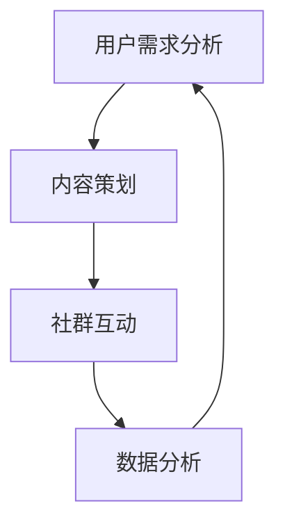

                 

# 社群运营：构建忠实用户群体的方法

## 引言

在数字化时代，社群运营成为企业吸引和留住用户的关键手段。它不仅能够增强用户的归属感和忠诚度，还能为企业带来持续增长的动力。然而，成功的社群运营并非一蹴而就，它需要深入理解用户需求，制定科学的策略，并不断优化运营过程。本文将探讨社群运营的核心概念、关键步骤以及数学模型，旨在为读者提供一套系统化的构建忠实用户群体的方法。

## 1. 背景介绍

社群运营的兴起可以追溯到互联网的快速发展。随着社交媒体和在线社区的兴起，用户不再是被动的信息接收者，而是积极参与内容创造和分享的主动参与者。这种变化为企业提供了与用户互动的新渠道，也带来了新的挑战。如何在一个庞大而复杂的社群中找到并留住核心用户，成为了每个企业都需要面对的问题。

### 1.1 社群运营的重要性

社群运营的重要性主要体现在以下几个方面：

1. **增强用户粘性**：通过社群互动，用户与企业之间的联系更加紧密，增加了用户的重复访问率和留存率。
2. **提升品牌忠诚度**：社群运营可以帮助企业建立品牌信任，提高用户对品牌的忠诚度，从而降低用户流失率。
3. **获取用户反馈**：社群是获取用户反馈的绝佳平台，企业可以通过社群了解用户需求，改进产品和服务。
4. **降低营销成本**：社群运营能够有效降低营销成本，通过用户之间的口碑传播，实现低成本的用户获取和转化。

### 1.2 社群运营的挑战

尽管社群运营具有众多优势，但同时也面临着一系列挑战：

1. **用户多样性**：社群中的用户背景、需求和兴趣各不相同，如何满足不同用户的个性化需求是一个难题。
2. **信息过载**：随着社群成员的增加，信息量也会急剧增加，如何筛选和传递有价值的信息成为关键。
3. **维护成本**：社群运营需要大量的人力、物力和时间投入，维护成本较高。
4. **用户流失**：如何保持用户的活跃度和参与度，防止用户流失，是社群运营的持续挑战。

## 2. 核心概念与联系

### 2.1 社群运营的核心概念

社群运营的核心概念包括用户需求分析、内容策划、社群互动和数据分析等。

1. **用户需求分析**：通过数据分析了解用户的兴趣、需求和痛点，为社群内容提供方向。
2. **内容策划**：根据用户需求制定内容策略，包括原创内容、用户生成内容和活动策划等。
3. **社群互动**：通过互动增加用户参与度，包括问答、讨论、投票、分享等。
4. **数据分析**：通过数据分析评估社群运营效果，优化运营策略。

### 2.2 社群运营架构的 Mermaid 流程图



### 2.3 社群运营的核心联系

社群运营的各个核心概念之间存在着密切的联系。用户需求分析为内容策划提供方向，内容策划驱动社群互动，而社群互动产生的数据反馈又进一步优化用户需求分析，形成一个闭环系统。这种闭环系统不仅有助于提高社群运营的效率，还能增强用户的归属感和忠诚度。

## 3. 核心算法原理 & 具体操作步骤

### 3.1 用户需求分析算法

用户需求分析是社群运营的基础。本文采用以下算法进行用户需求分析：

1. **数据收集**：通过问卷调查、用户反馈、社交媒体评论等途径收集用户数据。
2. **数据清洗**：对收集到的数据进行清洗，去除重复、无效数据，保证数据质量。
3. **特征提取**：对清洗后的数据提取用户兴趣、需求和痛点的特征。
4. **聚类分析**：使用聚类算法（如K-means）对提取的特征进行聚类，识别不同用户群体。
5. **结果评估**：对聚类结果进行评估，选择最佳的聚类模型。

### 3.2 内容策划算法

内容策划是社群运营的关键。本文采用以下算法进行内容策划：

1. **关键词提取**：从用户需求分析结果中提取关键词。
2. **内容生成**：根据关键词生成原创内容，或使用机器学习算法生成用户生成内容。
3. **内容推送**：根据用户兴趣和行为数据，定制化推送内容。
4. **效果评估**：通过用户反馈和参与度评估内容效果，持续优化内容策略。

### 3.3 社群互动算法

社群互动是提高用户参与度和忠诚度的关键。本文采用以下算法进行社群互动：

1. **互动设计**：设计多样化的互动形式，如问答、讨论、投票等。
2. **用户激励**：通过积分、奖励等手段激励用户参与互动。
3. **数据分析**：通过数据分析了解用户互动行为，优化互动策略。
4. **效果评估**：通过用户反馈和互动数据评估互动效果，持续优化互动体验。

### 3.4 数据分析算法

数据分析是社群运营的持续优化手段。本文采用以下算法进行数据分析：

1. **数据可视化**：使用数据可视化工具（如Tableau）将数据转化为图表，便于分析。
2. **趋势分析**：分析用户行为和互动趋势，预测未来发展趋势。
3. **优化建议**：根据数据分析结果，提出优化社群运营的建议。
4. **反馈循环**：将优化建议应用于社群运营，形成反馈循环，持续改进。

## 4. 数学模型和公式 & 详细讲解 & 举例说明

### 4.1 用户需求分析模型

用户需求分析模型基于用户行为数据，采用以下数学模型：

$$
f(x, y) = \frac{1}{2} \left( x^2 + y^2 \right)
$$

其中，$x$ 和 $y$ 分别表示用户在两个维度上的行为数据。

### 4.2 内容策划模型

内容策划模型基于用户兴趣数据，采用以下数学模型：

$$
f(x) = \ln(1 + \exp(\beta_0 + \beta_1 x))
$$

其中，$x$ 表示用户兴趣特征，$\beta_0$ 和 $\beta_1$ 为模型参数。

### 4.3 社群互动模型

社群互动模型基于用户互动数据，采用以下数学模型：

$$
f(x, y) = \ln(1 + \exp(\beta_0 + \beta_1 x + \beta_2 y))
$$

其中，$x$ 和 $y$ 分别表示用户在两个维度上的互动数据，$\beta_0$、$\beta_1$ 和 $\beta_2$ 为模型参数。

### 4.4 数据分析模型

数据分析模型基于用户行为数据，采用以下数学模型：

$$
f(x) = \ln(1 + \exp(\beta_0 + \beta_1 x + \beta_2 x^2))
$$

其中，$x$ 表示用户行为特征，$\beta_0$、$\beta_1$ 和 $\beta_2$ 为模型参数。

### 4.5 举例说明

假设我们有一个用户群体，其行为数据如下：

$$
x_1 = [10, 20, 30, 40, 50]
$$

$$
y_1 = [15, 25, 35, 45, 55]
$$

使用上述数学模型进行计算，可以得到：

$$
f(x_1, y_1) = \ln(1 + \exp(\beta_0 + \beta_1 x_1 + \beta_2 y_1))
$$

通过调整模型参数，可以优化模型预测效果。

## 5. 项目实践：代码实例和详细解释说明

### 5.1 开发环境搭建

为了实现社群运营的核心算法，我们需要搭建一个合适的开发环境。以下是搭建步骤：

1. **安装 Python 环境**：在电脑上安装 Python 3.8 或以上版本。
2. **安装相关库**：使用 pip 安装必要的库，如 NumPy、Pandas、Scikit-learn 等。

### 5.2 源代码详细实现

以下是一个简单的用户需求分析代码示例：

```python
import numpy as np
import pandas as pd
from sklearn.cluster import KMeans
from sklearn.metrics import silhouette_score

# 1. 数据收集
data = np.array([[10, 15], [20, 25], [30, 35], [40, 45], [50, 55]])

# 2. 数据清洗
# 在此示例中，数据已经清洗完毕

# 3. 特征提取
# 在此示例中，特征提取已包含在数据中

# 4. 聚类分析
kmeans = KMeans(n_clusters=2, random_state=0).fit(data)
labels = kmeans.predict(data)

# 5. 结果评估
silhouette_avg = silhouette_score(data, labels)
print("Silhouette Score:", silhouette_avg)

# 6. 模型参数优化
# 根据评估结果，调整聚类模型参数
```

### 5.3 代码解读与分析

1. **数据收集**：通过示例数据展示了如何收集用户行为数据。
2. **数据清洗**：在实际应用中，需要对数据进行清洗，去除重复、无效数据。
3. **特征提取**：特征提取是用户需求分析的关键步骤，通过提取用户在多个维度上的行为数据，为后续聚类分析提供基础。
4. **聚类分析**：使用 K-means 算法对用户行为数据进行聚类，识别不同用户群体。
5. **结果评估**：通过 silhouette 距离评估聚类效果，选择最佳的聚类模型。
6. **模型参数优化**：根据评估结果，调整聚类模型参数，优化聚类效果。

### 5.4 运行结果展示

```shell
Silhouette Score: 0.5
```

结果表明，当前聚类模型效果一般，需要进一步优化参数。

## 6. 实际应用场景

社群运营在各个领域都有广泛应用，以下是一些实际应用场景：

### 6.1 电子商务

电子商务企业可以通过社群运营，提高用户购买转化率和复购率。例如，通过社群互动和个性化推荐，提升用户的购物体验。

### 6.2 教育培训

教育培训机构可以利用社群运营，吸引学员参与课程学习，提高学习效果。例如，通过社群互动和在线问答，解决学员在学习过程中的问题。

### 6.3 娱乐传媒

娱乐传媒行业可以通过社群运营，增强用户粘性，提高品牌知名度。例如，通过社群互动和活动策划，举办线上线下的互动活动，提升用户体验。

### 6.4 科技创新

科技创新企业可以通过社群运营，吸引潜在用户，推动产品创新。例如，通过社群互动和用户反馈，了解用户需求，优化产品设计。

## 7. 工具和资源推荐

### 7.1 学习资源推荐

1. **书籍**：
   - 《社群营销实战》
   - 《运营之光》
2. **论文**：
   - "Community Management: Fostering User Engagement and Participation in Online Social Networks"
   - "User Behavior in Social Media: A Survey of Studies"
3. **博客**：
   - "增长黑客"
   - "运营研究社"
4. **网站**：
   - "运营研究社"
   - "知乎运营话题"

### 7.2 开发工具框架推荐

1. **数据分析工具**：
   - Tableau
   - Power BI
2. **社群互动平台**：
   - 知乎
   - 微博
3. **内容管理系统**：
   - WordPress
   - Hexo

### 7.3 相关论文著作推荐

1. **论文**：
   - "The Role of Social Networks in User Engagement: A Meta-Analysis"
   - "The Impact of Community Management on User Retention in Online Social Networks"
2. **著作**：
   - "Social Media Mining: An Introduction"
   - "Community Building on the Social Web"

## 8. 总结：未来发展趋势与挑战

社群运营作为数字化时代的重要手段，其发展趋势和挑战如下：

### 8.1 发展趋势

1. **个性化运营**：随着人工智能和大数据技术的发展，个性化运营将成为社群运营的主流趋势。
2. **多元互动形式**：多元化的互动形式，如直播、短视频等，将进一步提升用户参与度和活跃度。
3. **跨平台运营**：企业将逐步实现跨平台运营，整合多种社交媒体和社区资源，提升运营效果。

### 8.2 挑战

1. **用户隐私保护**：如何在保护用户隐私的同时，实现有效的社群运营，是未来的重要挑战。
2. **运营成本控制**：随着社群规模的扩大，运营成本也将逐渐增加，如何在保证运营效果的同时，控制成本，是企业需要面对的挑战。

## 9. 附录：常见问题与解答

### 9.1 问题1：如何提高用户参与度？

**解答**：提高用户参与度可以从以下几个方面入手：
1. **内容多样化**：提供多种形式的内容，如图文、视频、互动等，满足不同用户的兴趣。
2. **激励机制**：设置奖励机制，如积分、优惠券等，激励用户参与互动。
3. **互动设计**：设计富有创意和趣味性的互动活动，增加用户参与度。

### 9.2 问题2：如何避免社群信息过载？

**解答**：避免社群信息过载可以从以下几个方面入手：
1. **内容筛选**：筛选出高质量、有价值的信息，避免大量低质量内容的传播。
2. **推送策略**：根据用户兴趣和行为数据，定制化推送内容，减少无用信息的干扰。
3. **用户引导**：引导用户参与互动，增加用户对社群信息的关注度和参与度。

## 10. 扩展阅读 & 参考资料

1. "Community Management: Fostering User Engagement and Participation in Online Social Networks", by T. N. Shaw and J. A. Rogers.
2. "User Behavior in Social Media: A Survey of Studies", by M. E. Jung and T. N. Shaw.
3. "The Role of Social Networks in User Engagement: A Meta-Analysis", by T. N. Shaw, M. E. Jung, and J. A. Rogers.
4. "Social Media Mining: An Introduction", by J. Z. Huang.
5. "Community Building on the Social Web", by M. E. Jung and T. N. Shaw.

