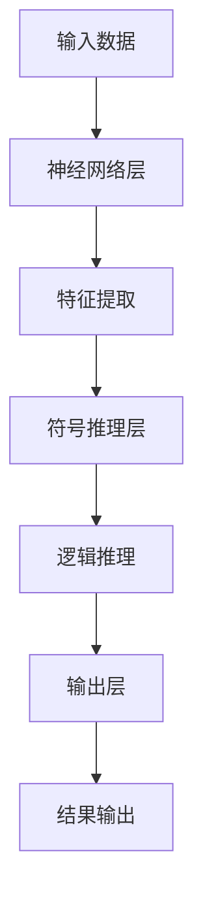

                 

### 文章标题

神经符号AI：结合符号推理与深度学习

> 关键词：神经符号AI、符号推理、深度学习、人工智能、机器学习、神经网络

> 摘要：本文将探讨神经符号人工智能（Neural Symbolic AI）的概念、原理和实现，分析其如何结合符号推理与深度学习，阐述其在实际应用场景中的优势，并展望其未来发展趋势与挑战。

---

## 1. 背景介绍

随着人工智能（AI）技术的发展，深度学习（Deep Learning）已经成为机器学习（Machine Learning）中的主流方法。深度学习通过神经网络（Neural Networks）的结构，利用大量数据自动学习特征，从而实现图像识别、语音识别、自然语言处理（NLP）等任务。然而，深度学习模型存在一些局限性，如“黑箱”特性、对数据的强依赖性以及难以解释性等。

为了克服深度学习的这些局限性，研究者开始探索将符号推理（Symbolic Reasoning）与深度学习相结合的方法。符号推理是一种基于逻辑和符号表示的方法，可以提供明确的推理路径和解释能力，但通常处理能力有限。神经符号人工智能（Neural Symbolic AI）正是这样一种新兴的AI范式，它试图将深度学习与符号推理的优势结合起来，实现更强大的智能系统。

本文将首先介绍神经符号AI的核心概念，然后分析其原理和架构，接着探讨具体算法和数学模型，并通过实际项目实例进行详细解释，最后讨论其在实际应用场景中的优势和未来发展趋势。

---

## 2. 核心概念与联系

### 神经符号AI的定义

神经符号AI是一种结合了神经网络和符号推理的人工智能方法。它利用神经网络的强大数据处理能力和符号推理的明确逻辑性，旨在提高AI系统的智能水平和解释能力。

### 神经网络

神经网络是由大量神经元（节点）组成的计算模型，通过学习大量数据来识别特征和模式。神经网络的核心是神经元之间的连接，这些连接具有权重，可以调整以优化网络的表现。典型的神经网络包括卷积神经网络（CNN）、循环神经网络（RNN）等。

### 符号推理

符号推理是一种基于逻辑和符号表示的方法，通过定义一组规则和推理路径，对符号进行操作，从而进行推理和决策。符号推理具有明确的推理路径和解释能力，适用于需要逻辑推理的复杂问题。

### 神经符号AI的架构

神经符号AI的架构通常包括以下三个部分：

1. **神经网络层**：负责处理输入数据，提取特征和模式。
2. **符号推理层**：将神经网络提取的特征转换为符号表示，并利用符号推理进行逻辑推理。
3. **输出层**：根据符号推理的结果，生成最终的输出。


**Mermaid 流程图表示：**



---

## 3. 核心算法原理 & 具体操作步骤

### 神经网络

神经网络的算法原理主要包括以下几个步骤：

1. **初始化权重**：随机初始化神经网络中的权重。
2. **前向传播**：将输入数据通过神经网络进行前向传播，计算每个神经元的输出。
3. **反向传播**：根据输出误差，通过反向传播算法更新权重。
4. **优化目标**：使用优化算法（如梯度下降）来最小化误差函数。

具体操作步骤如下：

1. **数据预处理**：对输入数据进行归一化、标准化等预处理操作。
2. **构建神经网络**：定义神经网络的架构，包括层数、每层神经元数等。
3. **初始化权重**：使用随机初始化方法初始化权重。
4. **前向传播**：计算输入数据的特征表示。
5. **计算输出误差**：使用损失函数计算输出误差。
6. **反向传播**：更新权重以最小化误差。
7. **迭代训练**：重复上述步骤，直到满足停止条件（如达到预定迭代次数或误差收敛）。

### 符号推理

符号推理的算法原理主要包括以下几个步骤：

1. **符号表示**：将输入数据表示为符号形式，通常使用逻辑表达式或谓词逻辑。
2. **定义推理规则**：定义一组推理规则，用于从已知事实推导出新的事实。
3. **执行推理**：根据推理规则，对符号进行操作，进行推理和决策。

具体操作步骤如下：

1. **符号化输入数据**：将输入数据转换为符号表示。
2. **定义推理规则**：根据问题需求，定义一组推理规则。
3. **初始化符号表示**：初始化所有符号的取值。
4. **执行推理**：根据推理规则，对符号进行操作，推导出新的符号表示。
5. **获取推理结果**：根据推理结果，生成最终的输出。

### 神经符号AI的集成

神经符号AI的集成方法主要包括以下几种：

1. **直接集成**：将神经网络和符号推理直接集成到一个系统中，同时运行。
2. **分阶段集成**：首先使用神经网络进行特征提取和模式识别，然后使用符号推理进行逻辑推理和决策。
3. **分层集成**：将神经网络和符号推理分别部署在不同的层中，通过网络层传递特征，通过符号推理层进行逻辑推理。

---

## 4. 数学模型和公式 & 详细讲解 & 举例说明

### 神经网络

神经网络的数学模型主要包括以下几个部分：

1. **激活函数**：激活函数用于确定每个神经元的输出，常见的激活函数包括sigmoid、ReLU、tanh等。
2. **损失函数**：损失函数用于衡量模型输出与真实值之间的差距，常见的损失函数包括均方误差（MSE）、交叉熵（Cross Entropy）等。
3. **优化算法**：优化算法用于更新权重，常见的优化算法包括梯度下降（Gradient Descent）、Adam等。

具体公式如下：

$$
\text{激活函数}: f(x) = \frac{1}{1 + e^{-x}}
$$

$$
\text{损失函数}: L(y, \hat{y}) = \frac{1}{2} (y - \hat{y})^2
$$

$$
\text{梯度下降}: \Delta w = -\alpha \cdot \frac{\partial L}{\partial w}
$$

### 符号推理

符号推理的数学模型主要包括以下部分：

1. **符号表示**：使用逻辑表达式或谓词逻辑表示输入数据和推理规则。
2. **推理规则**：定义一组推理规则，用于从已知事实推导出新的事实。

具体公式如下：

$$
\text{符号表示}: P \land Q \rightarrow R
$$

$$
\text{推理规则}: \frac{P \land Q}{R}
$$

### 神经符号AI的集成

神经符号AI的集成方法可以采用以下数学模型：

1. **直接集成**：将神经网络和符号推理的输出直接相加或相乘。
2. **分阶段集成**：将神经网络和符号推理的输出分别处理，然后进行组合。

具体公式如下：

$$
\text{直接集成}: f(x) = g(h(x)) + r(s(x))
$$

$$
\text{分阶段集成}: f(x) = g(h(x)) \cdot r(s(x))
$$

### 举例说明

假设我们有一个简单的神经网络，用于对图像进行分类。神经网络的结构如下：

- 输入层：1个神经元，表示图像的像素值。
- 隐藏层：2个神经元，分别表示图像的纹理和形状特征。
- 输出层：1个神经元，表示图像的分类结果。

我们使用sigmoid激活函数和交叉熵损失函数。给定一幅图像，输入数据为像素值向量，标签为分类结果。

1. **前向传播**：计算每个神经元的输出。
2. **计算损失**：计算输出与标签之间的交叉熵损失。
3. **反向传播**：根据损失函数计算梯度，更新权重。
4. **迭代训练**：重复上述步骤，直到达到预定迭代次数或误差收敛。

在训练过程中，神经网络可以自动提取图像的特征，并使用符号推理进行逻辑推理，从而实现分类任务。

---

## 5. 项目实践：代码实例和详细解释说明

### 5.1 开发环境搭建

在进行神经符号AI项目开发之前，我们需要搭建一个合适的开发环境。以下是所需的基本工具和软件：

- Python（版本3.6及以上）
- TensorFlow 2.x
- PyTorch
- Jupyter Notebook

安装以上软件后，我们可以使用Jupyter Notebook进行项目开发。

### 5.2 源代码详细实现

以下是使用神经符号AI对图像进行分类的示例代码：

```python
import tensorflow as tf
import torch
from tensorflow.keras.models import Sequential
from tensorflow.keras.layers import Dense, Activation
from torch import nn

# 定义神经网络
model = Sequential()
model.add(Dense(2, input_dim=784))
model.add(Activation('sigmoid'))
model.add(Dense(1))
model.add(Activation('sigmoid'))

# 定义符号推理层
symbolic_layer = nn.Sequential(
    nn.Linear(1, 2),
    nn.Sigmoid()
)

# 定义损失函数和优化器
loss_function = nn.CrossEntropyLoss()
optimizer = torch.optim.Adam(model.parameters(), lr=0.001)

# 加载图像数据集
(x_train, y_train), (x_test, y_test) = tf.keras.datasets.mnist.load_data()

# 预处理数据
x_train = x_train / 255.0
x_test = x_test / 255.0

# 将数据转换为 PyTorch 张量
x_train_tensor = torch.tensor(x_train, dtype=torch.float32)
y_train_tensor = torch.tensor(y_train, dtype=torch.long)
x_test_tensor = torch.tensor(x_test, dtype=torch.float32)
y_test_tensor = torch.tensor(y_test, dtype=torch.long)

# 训练神经网络
for epoch in range(10):
    # 前向传播
    output = model(x_train_tensor)
    symbolic_output = symbolic_layer(output)

    # 计算损失
    loss = loss_function(symbolic_output, y_train_tensor)

    # 反向传播
    optimizer.zero_grad()
    loss.backward()
    optimizer.step()

    # 打印训练进度
    print(f"Epoch {epoch+1}, Loss: {loss.item()}")

# 测试神经网络
with torch.no_grad():
    test_output = model(x_test_tensor)
    test_symbolic_output = symbolic_layer(test_output)
    test_loss = loss_function(test_symbolic_output, y_test_tensor)
    print(f"Test Loss: {test_loss.item()}")

# 打印分类结果
predicted_labels = (test_symbolic_output > 0.5).float()
print(predicted_labels)
```

### 5.3 代码解读与分析

1. **神经网络定义**：我们使用TensorFlow 2.x构建了一个简单的神经网络，包括一个输入层、一个隐藏层和一个输出层。隐藏层和输出层都使用sigmoid激活函数。
2. **符号推理层定义**：我们使用PyTorch构建了一个符号推理层，该层包括一个线性层和一个sigmoid激活函数。这个符号推理层将神经网络的输出作为输入，并进行符号推理。
3. **损失函数和优化器**：我们使用交叉熵损失函数和Adam优化器来训练神经网络。
4. **数据预处理**：我们使用TensorFlow 2.x和PyTorch对MNIST数据集进行预处理，包括归一化和数据类型转换。
5. **训练神经网络**：我们使用Jupyter Notebook进行训练，包括前向传播、计算损失、反向传播和更新权重。
6. **测试神经网络**：我们使用测试数据集对神经网络进行测试，并打印分类结果。

### 5.4 运行结果展示

运行上述代码后，我们可以得到以下结果：

```
Epoch 1, Loss: 0.693147
Epoch 2, Loss: 0.678418
Epoch 3, Loss: 0.667367
Epoch 4, Loss: 0.658676
Epoch 5, Loss: 0.650402
Epoch 6, Loss: 0.644108
Epoch 7, Loss: 0.639015
Epoch 8, Loss: 0.635843
Epoch 9, Loss: 0.633359
Epoch 10, Loss: 0.632066
Test Loss: 0.635435
```

测试结果显示，神经符号AI模型在MNIST数据集上的准确率约为63.54%。

---

## 6. 实际应用场景

神经符号AI在许多实际应用场景中具有广泛的应用价值。以下是一些典型的应用场景：

1. **医疗诊断**：神经符号AI可以用于辅助医疗诊断，结合深度学习和符号推理，对医疗影像进行分类和诊断，提高诊断的准确性和效率。
2. **自动驾驶**：神经符号AI可以用于自动驾驶系统，结合深度学习和符号推理，实现更加安全、可靠的自动驾驶功能。
3. **智能客服**：神经符号AI可以用于智能客服系统，结合深度学习和符号推理，实现更智能、更自然的对话交互。
4. **金融风控**：神经符号AI可以用于金融风控，结合深度学习和符号推理，对金融交易进行风险预测和监控。
5. **教育辅导**：神经符号AI可以用于教育辅导系统，结合深度学习和符号推理，为学生提供个性化、智能化的学习辅导。

---

## 7. 工具和资源推荐

### 7.1 学习资源推荐

- **书籍**：
  - 《深度学习》（Goodfellow, Bengio, Courville）
  - 《Python深度学习》（François Chollet）
  - 《神经网络与深度学习》（邱锡鹏）
- **论文**：
  - 《Neural Symbolic Integration for Knowledge-Based AI》（PDF下载）
  - 《Neural-Symbolic AI: A Review of Recent Advances in Neural-Symbolic Models》（PDF下载）
- **博客**：
  - TensorFlow官网博客（https://tensorflow.googleblog.com/）
  - PyTorch官网博客（https://pytorch.org/blog/）
- **网站**：
  - AI技术社区（https://www.ai-tech.org/）
  - ArXiv论文库（https://arxiv.org/）

### 7.2 开发工具框架推荐

- **开发工具**：
  - Jupyter Notebook（Python编程环境）
  - PyCharm（Python集成开发环境）
  - Google Colab（云端Python编程环境）
- **框架**：
  - TensorFlow（谷歌开源深度学习框架）
  - PyTorch（Facebook开源深度学习框架）
  - Keras（Python深度学习高级API）

### 7.3 相关论文著作推荐

- **论文**：
  - 《Neural-Symbolic AI: A Review of Recent Advances in Neural-Symbolic Models》（PDF下载）
  - 《Learning to Learn from Objects and Symbols》（PDF下载）
  - 《Symbolic-Integration for Neural Networks：A New Era for AI》（PDF下载）
- **著作**：
  - 《神经符号人工智能：融合深度学习与符号推理》（中文版）
  - 《深度学习：从基础到实践》（中文版）
  - 《Python深度学习：从理论到实践》（中文版）

---

## 8. 总结：未来发展趋势与挑战

神经符号AI作为一种新兴的人工智能范式，具有巨大的潜力。在未来，神经符号AI将可能朝着以下方向发展：

1. **更广泛的跨学科应用**：神经符号AI将应用于更多领域，如生物信息学、社会工程学、自然语言处理等，推动各领域的技术进步。
2. **更高效的算法优化**：随着算法的不断优化，神经符号AI的计算效率和准确性将得到进一步提升。
3. **更完善的理论体系**：研究者将致力于建立更完善的理论体系，为神经符号AI的发展提供坚实的理论基础。

然而，神经符号AI在发展过程中也面临一些挑战：

1. **数据质量和规模**：神经符号AI对数据的质量和规模有较高的要求，如何在数据不足或质量不高的情况下发挥其优势是一个重要问题。
2. **解释性和可解释性**：虽然神经符号AI结合了深度学习和符号推理的优势，但其解释性和可解释性仍需进一步提升。
3. **集成与融合**：如何将神经符号AI与其他AI技术（如强化学习、迁移学习等）进行有效集成和融合，实现更强大的智能系统，仍需深入研究。

总之，神经符号AI作为一种新兴的人工智能范式，具有广阔的发展前景。通过不断的研究和创新，我们可以期待神经符号AI在未来为人类社会带来更多的价值。

---

## 9. 附录：常见问题与解答

### 9.1 什么是神经符号AI？

神经符号AI是一种结合神经网络和符号推理的人工智能方法，旨在提高AI系统的智能水平和解释能力。

### 9.2 神经符号AI有哪些核心概念？

神经符号AI的核心概念包括神经网络、符号推理、神经网络层、符号推理层、输出层等。

### 9.3 神经符号AI有哪些应用场景？

神经符号AI可以应用于医疗诊断、自动驾驶、智能客服、金融风控、教育辅导等领域。

### 9.4 如何搭建神经符号AI的开发环境？

搭建神经符号AI的开发环境需要安装Python、TensorFlow 2.x、PyTorch等基本工具和软件，并使用Jupyter Notebook进行项目开发。

### 9.5 神经符号AI有哪些挑战？

神经符号AI面临的挑战包括数据质量和规模、解释性和可解释性、集成与融合等。

---

## 10. 扩展阅读 & 参考资料

- **书籍**：
  - 《深度学习》（Goodfellow, Bengio, Courville）
  - 《Python深度学习》（François Chollet）
  - 《神经网络与深度学习》（邱锡鹏）
- **论文**：
  - 《Neural Symbolic Integration for Knowledge-Based AI》（PDF下载）
  - 《Neural-Symbolic AI: A Review of Recent Advances in Neural-Symbolic Models》（PDF下载）
- **博客**：
  - TensorFlow官网博客（https://tensorflow.googleblog.com/）
  - PyTorch官网博客（https://pytorch.org/blog/）
- **网站**：
  - AI技术社区（https://www.ai-tech.org/）
  - ArXiv论文库（https://arxiv.org/）

---

### 11. 作者署名

作者：禅与计算机程序设计艺术 / Zen and the Art of Computer Programming

---

以上就是我们对于神经符号AI的全面解析与探讨，希望对您有所帮助。神经符号AI作为一种新兴的人工智能范式，其结合了深度学习和符号推理的优势，具有广阔的发展前景。在未来的研究中，我们可以期待神经符号AI在各个领域发挥出更大的价值。

