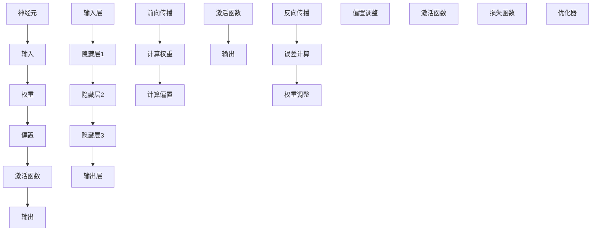
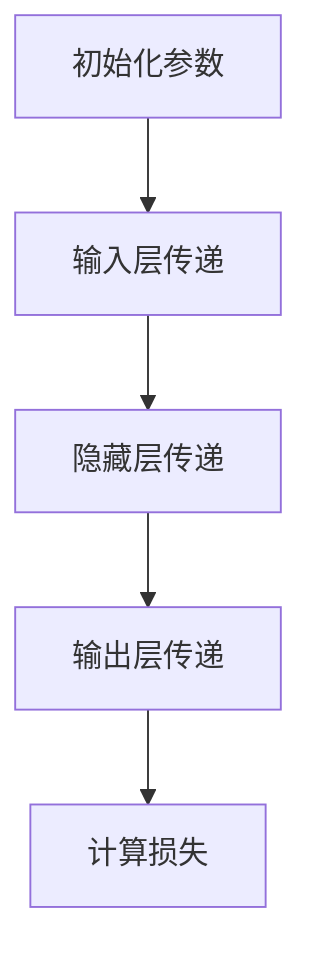
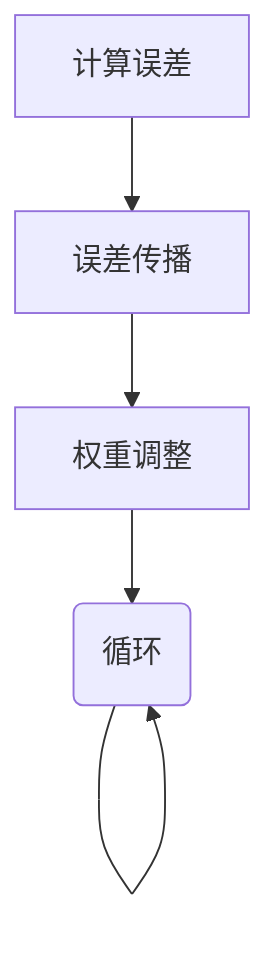
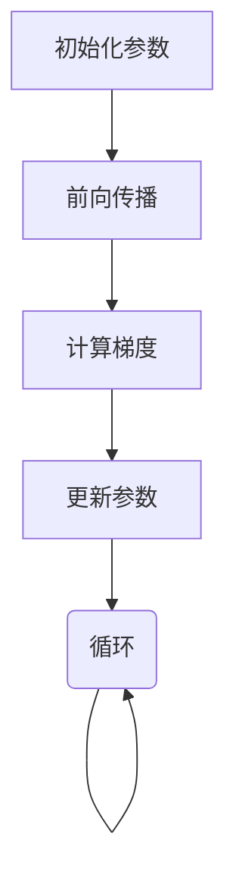

                 

### 背景介绍

神经网络作为人工智能领域的一个重要分支，自20世纪80年代以来，其理论和应用得到了极大的发展。神经网络的起源可以追溯到1943年，由McCulloch和Pitts提出的前置单元模型（Perceptron），以及随后由Minsky和Papert在1969年出版的《感知器》一书中提出的限制。尽管早期神经网络由于学习算法的局限性而未能得到广泛应用，但随着反向传播算法（Backpropagation）的提出以及计算机技术的飞速发展，神经网络在20世纪90年代迎来了新的生机。

在21世纪初，随着大数据和计算能力的提升，深度学习作为一种特殊的神经网络模型，在图像识别、自然语言处理、语音识别等领域取得了突破性的进展。如今，神经网络已经成为了人工智能领域的核心技术之一，被广泛应用于各种实际问题中。

本文旨在深入浅出地讲解神经网络的原理及其代码实现，帮助读者更好地理解和掌握这一重要技术。文章将分为以下几个部分：

1. **背景介绍**：简要回顾神经网络的发展历程，并介绍本文的核心内容和结构。
2. **核心概念与联系**：详细解释神经网络的基本概念，包括神经元、网络架构、学习算法等，并使用Mermaid流程图展示其架构关系。
3. **核心算法原理 & 具体操作步骤**：深入探讨神经网络的核心算法，如前向传播、反向传播等，并详细说明其操作步骤。
4. **数学模型和公式 & 详细讲解 & 举例说明**：介绍神经网络中涉及的数学模型和公式，如激活函数、损失函数等，并使用具体例子进行详细讲解。
5. **项目实践：代码实例和详细解释说明**：通过一个简单的神经网络实现案例，展示神经网络在实际项目中的应用，并提供详细的代码解读与分析。
6. **实际应用场景**：探讨神经网络在不同领域的实际应用，如图像识别、自然语言处理等。
7. **工具和资源推荐**：推荐相关学习资源、开发工具和框架，帮助读者进一步学习和实践神经网络技术。
8. **总结：未来发展趋势与挑战**：总结神经网络的发展现状和未来趋势，并探讨面临的挑战。
9. **附录：常见问题与解答**：针对神经网络学习中常见的问题提供解答。
10. **扩展阅读 & 参考资料**：提供进一步学习的相关文献和资源。

希望通过本文，读者能够对神经网络有一个全面、深入的理解，并能够运用这一技术解决实际问题。

### 核心概念与联系

为了深入理解神经网络的工作原理，首先需要明确几个核心概念，并探讨它们之间的联系。以下是神经网络中几个关键概念的定义及其相互关系：

#### 1. 神经元（Neuron）

神经元是神经网络的基本单元，通常被比喻为计算机中的“神经元”。每个神经元都接收多个输入信号，并通过加权求和处理产生一个输出信号。神经元的模型通常包含以下几个部分：

- **输入**：多个输入信号，可以表示为 $x_1, x_2, \ldots, x_n$。
- **权重**：每个输入信号的权重 $w_1, w_2, \ldots, w_n$。
- **偏置**：用于调整神经元激活的偏置项 $b$。
- **激活函数**：用于将加权求和处理的结果转换为二值输出，常用的激活函数包括 sigmoid、ReLU、tanh 等。

神经元的输出可以通过以下公式计算：

$$
\text{output} = \text{激活函数} (\sum_{i=1}^{n} w_i \cdot x_i + b)
$$

#### 2. 网络架构（Architecture）

神经网络由多个神经元层次组成，每个层次被称为“层”。常见的网络架构包括：

- **输入层（Input Layer）**：接收外部输入信息。
- **隐藏层（Hidden Layers）**：一个或多个隐藏层，用于提取特征和转换信息。
- **输出层（Output Layer）**：产生最终输出。

网络的层次结构决定了信息的传递和处理方式，不同的层次对信息的处理能力也有所不同。

#### 3. 学习算法（Learning Algorithm）

神经网络的学习算法是其核心部分，负责调整网络的权重和偏置，以优化网络性能。主要的两种学习算法是：

- **前向传播（Forward Propagation）**：将输入信息通过网络层次进行传递，逐层计算每个神经元的输出。
- **反向传播（Backpropagation）**：利用输出误差，反向调整每个神经元的权重和偏置，以达到优化网络性能的目的。

#### 4. 激活函数（Activation Function）

激活函数是神经网络中至关重要的一部分，它决定了神经元是否会被激活以及如何激活。常见的激活函数有：

- **sigmoid 函数**：
  $$
  \text{sigmoid}(x) = \frac{1}{1 + e^{-x}}
  $$
- **ReLU 函数**：
  $$
  \text{ReLU}(x) = \max(0, x)
  $$
- **tanh 函数**：
  $$
  \text{tanh}(x) = \frac{e^x - e^{-x}}{e^x + e^{-x}}
  $$

激活函数的选择直接影响网络的性能和学习速度。

#### 5. 损失函数（Loss Function）

损失函数用于衡量网络的预测结果与实际结果之间的差距，常见的损失函数包括：

- **均方误差（Mean Squared Error, MSE）**：
  $$
  \text{MSE} = \frac{1}{n} \sum_{i=1}^{n} (y_i - \hat{y}_i)^2
  $$
- **交叉熵（Cross-Entropy）**：
  $$
  \text{Cross-Entropy} = -\frac{1}{n} \sum_{i=1}^{n} y_i \log(\hat{y}_i)
  $$

损失函数的选择直接影响网络的学习效率和性能。

#### Mermaid 流程图

为了更好地展示神经网络的概念及其相互关系，下面使用Mermaid流程图来描述：



通过以上核心概念和Mermaid流程图的描述，读者可以更好地理解神经网络的基本结构和工作原理。接下来的章节将深入探讨神经网络的核心算法、数学模型以及实际应用，帮助读者全面掌握这一重要的技术。

#### 核心算法原理 & 具体操作步骤

在了解了神经网络的基本概念和架构之后，接下来我们将深入探讨神经网络的核心算法，主要包括前向传播和反向传播。这两个算法共同构成了神经网络的训练过程，使得神经网络能够通过不断调整内部参数来提高预测准确性。

##### 1. 前向传播（Forward Propagation）

前向传播是神经网络处理输入数据并生成输出的过程。在具体操作步骤上，可以分为以下几个步骤：

1. **初始化参数**：首先需要初始化网络的权重和偏置。通常，权重和偏置初始化为较小的随机值。

2. **输入层传递**：将输入数据传递到输入层，每个输入数据都会通过相应的神经元。

3. **隐藏层传递**：输入数据通过输入层传递到隐藏层，在每个隐藏层中，每个神经元的输入是其前一层所有神经元的输出加权求和处理的结果加上偏置。然后通过激活函数计算得到当前神经元的输出。

4. **输出层传递**：隐藏层的输出传递到输出层，输出层的神经元生成最终预测结果。

5. **计算损失**：将输出层的预测结果与实际标签进行比较，计算损失值，常用的损失函数包括均方误差（MSE）和交叉熵（Cross-Entropy）。

具体流程可以用以下步骤图表示：



##### 2. 反向传播（Back Propagation）

反向传播是神经网络根据预测误差调整内部参数的过程。具体操作步骤如下：

1. **计算误差**：首先计算输出层预测值与实际标签之间的误差。

2. **误差传播**：将误差从输出层反向传播到隐藏层，逐层计算每个神经元对误差的贡献，即梯度。

3. **权重调整**：使用梯度下降法或其他优化算法调整每个神经元的权重和偏置，以减小误差。

4. **迭代更新**：重复前向传播和反向传播的过程，直到达到预设的迭代次数或误差目标。

反向传播的具体流程可以用以下步骤图表示：



##### 3. 梯度下降法（Gradient Descent）

梯度下降法是反向传播中用于调整参数的一种常用优化算法。其基本思想是沿着误差梯度的反方向调整参数，以最小化损失函数。

具体操作步骤如下：

1. **初始化参数**：初始化网络的权重和偏置。

2. **前向传播**：计算当前参数下的预测值和损失。

3. **计算梯度**：计算损失函数关于每个参数的梯度。

4. **更新参数**：根据梯度下降公式更新每个参数的值：
   $$
   \theta_{\text{更新}} = \theta_{\text{当前}} - \alpha \cdot \nabla_{\theta} J(\theta)
   $$
   其中，$\theta$代表网络参数，$\alpha$为学习率，$J(\theta)$为损失函数。

5. **迭代更新**：重复前向传播和反向传播的过程，直到达到预设的迭代次数或误差目标。

梯度下降法的具体流程可以用以下步骤图表示：



##### 4. 具体示例

为了更好地理解前向传播和反向传播的具体操作，下面通过一个简单的例子来说明。

假设我们有一个简单的一层神经网络，包含一个输入神经元和一个输出神经元。输入数据为 $x = [1, 2]$，输出标签为 $y = 3$。网络的权重和偏置初始化为随机值。

1. **初始化参数**：
   $$
   w_1 = 0.1, \quad b_1 = 0.1, \quad w_2 = 0.2, \quad b_2 = 0.2
   $$

2. **前向传播**：
   - 输入层传递：$x_1 = 1, x_2 = 2$
   - 隐藏层传递：
     $$
     z_1 = x_1 \cdot w_1 + x_2 \cdot w_2 + b_1 = 1 \cdot 0.1 + 2 \cdot 0.2 + 0.1 = 0.5
     $$
     激活函数：$a_1 = \text{sigmoid}(z_1) = 0.37$
   - 输出层传递：
     $$
     z_2 = a_1 \cdot w_2 + b_2 = 0.5 \cdot 0.2 + 0.2 = 0.3
     $$
     激活函数：$a_2 = \text{sigmoid}(z_2) = 0.55$
   - 预测值：$\hat{y} = a_2 = 0.55$
   - 计算损失：
     $$
     \text{MSE} = \frac{1}{2} (y - \hat{y})^2 = \frac{1}{2} (3 - 0.55)^2 = 1.67
     $$

3. **反向传播**：
   - 计算误差：$e = y - \hat{y} = 3 - 0.55 = 2.45$
   - 计算梯度：
     $$
     \nabla w_2 = \frac{\partial \text{MSE}}{\partial w_2} = e \cdot a_1 = 2.45 \cdot 0.37 = 0.9
     $$
     $$
     \nabla b_2 = \frac{\partial \text{MSE}}{\partial b_2} = e = 2.45
     $$
     $$
     \nabla w_1 = \frac{\partial \text{MSE}}{\partial w_1} = e \cdot x_1 = 2.45 \cdot 1 = 2.45
     $$
     $$
     \nabla b_1 = \frac{\partial \text{MSE}}{\partial b_1} = e \cdot 1 = 2.45
     $$

4. **权重调整**：
   - 学习率：$\alpha = 0.1$
   - 更新权重和偏置：
     $$
     w_2^{更新} = w_2 - \alpha \cdot \nabla w_2 = 0.2 - 0.1 \cdot 0.9 = 0.11
     $$
     $$
     b_2^{更新} = b_2 - \alpha \cdot \nabla b_2 = 0.2 - 0.1 \cdot 2.45 = 0.05
     $$
     $$
     w_1^{更新} = w_1 - \alpha \cdot \nabla w_1 = 0.1 - 0.1 \cdot 2.45 = -0.0145
     $$
     $$
     b_1^{更新} = b_1 - \alpha \cdot \nabla b_1 = 0.1 - 0.1 \cdot 2.45 = -0.0145
     $$

通过以上示例，我们可以看到神经网络的前向传播和反向传播的具体操作过程。在实际应用中，神经网络通常包含多个层次和神经元，但基本原理是相同的。

#### 数学模型和公式 & 详细讲解 & 举例说明

神经网络作为一种复杂的机器学习模型，其背后依赖于一系列的数学模型和公式。本节将详细介绍神经网络中常用的数学模型和公式，并通过具体例子进行讲解，以便读者更好地理解这些概念。

##### 1. 激活函数

激活函数是神经网络中不可或缺的一部分，它用于将输入信号转换为一个输出信号，使得神经网络具有非线性特性。常见的激活函数包括sigmoid函数、ReLU函数和tanh函数。

- **sigmoid函数**：
  $$
  \text{sigmoid}(x) = \frac{1}{1 + e^{-x}}
  $$
  sigmoid函数的输出范围在0到1之间，适合用于分类问题。

- **ReLU函数**：
  $$
  \text{ReLU}(x) = \max(0, x)
  $$
 ReLU函数在$x<0$时输出0，在$x \geq 0$时输出$x$，具有简洁的计算形式和较快的收敛速度。

- **tanh函数**：
  $$
  \text{tanh}(x) = \frac{e^x - e^{-x}}{e^x + e^{-x}}
  $$
  tanh函数的输出范围在-1到1之间，与sigmoid函数类似，但更对称。

##### 2. 损失函数

损失函数用于衡量模型的预测结果与实际结果之间的差距，是神经网络优化过程中的关键。常见的损失函数包括均方误差（MSE）和交叉熵（Cross-Entropy）。

- **均方误差（MSE）**：
  $$
  \text{MSE} = \frac{1}{n} \sum_{i=1}^{n} (y_i - \hat{y}_i)^2
  $$
  MSE适用于回归问题，通过计算预测值与实际值之间差的平方和来衡量误差。

- **交叉熵（Cross-Entropy）**：
  $$
  \text{Cross-Entropy} = -\frac{1}{n} \sum_{i=1}^{n} y_i \log(\hat{y}_i)
  $$
  Cross-Entropy适用于分类问题，通过计算实际标签与预测概率的对数似然损失来衡量误差。

##### 3. 梯度下降法

梯度下降法是一种常用的优化算法，用于在训练过程中调整神经网络的参数，以减小损失函数的值。其基本思想是沿着损失函数的梯度方向进行迭代更新。

- **梯度下降法公式**：
  $$
  \theta_{\text{更新}} = \theta_{\text{当前}} - \alpha \cdot \nabla_{\theta} J(\theta)
  $$
  其中，$\theta$表示网络参数，$\alpha$为学习率，$J(\theta)$表示损失函数。

##### 4. 具体例子

为了更好地理解上述数学模型和公式的应用，我们通过一个简单的例子来演示神经网络的前向传播和反向传播过程。

**例子**：假设我们有一个简单的一层神经网络，包含一个输入神经元和一个输出神经元。输入数据为 $x = [1, 2]$，输出标签为 $y = 3$。网络的权重和偏置初始化为随机值。

**前向传播**：

1. **初始化参数**：
   $$
   w_1 = 0.1, \quad b_1 = 0.1, \quad w_2 = 0.2, \quad b_2 = 0.2
   $$

2. **输入层传递**：
   $$
   x_1 = 1, \quad x_2 = 2
   $$

3. **隐藏层传递**：
   $$
   z_1 = x_1 \cdot w_1 + x_2 \cdot w_2 + b_1 = 1 \cdot 0.1 + 2 \cdot 0.2 + 0.1 = 0.5
   $$
   $$
   a_1 = \text{sigmoid}(z_1) = 0.37
   $$

4. **输出层传递**：
   $$
   z_2 = a_1 \cdot w_2 + b_2 = 0.5 \cdot 0.2 + 0.2 = 0.3
   $$
   $$
   a_2 = \text{sigmoid}(z_2) = 0.55
   $$

5. **预测值**：
   $$
   \hat{y} = a_2 = 0.55
   $$

6. **计算损失**：
   $$
   \text{MSE} = \frac{1}{2} (y - \hat{y})^2 = \frac{1}{2} (3 - 0.55)^2 = 1.67
   $$

**反向传播**：

1. **计算误差**：
   $$
   e = y - \hat{y} = 3 - 0.55 = 2.45
   $$

2. **计算梯度**：
   $$
   \nabla w_2 = e \cdot a_1 = 2.45 \cdot 0.37 = 0.9
   $$
   $$
   \nabla b_2 = e = 2.45
   $$
   $$
   \nabla w_1 = e \cdot x_1 = 2.45 \cdot 1 = 2.45
   $$
   $$
   \nabla b_1 = e \cdot 1 = 2.45
   $$

3. **权重调整**：
   - 学习率：$\alpha = 0.1$
   $$
   w_2^{更新} = w_2 - \alpha \cdot \nabla w_2 = 0.2 - 0.1 \cdot 0.9 = 0.11
   $$
   $$
   b_2^{更新} = b_2 - \alpha \cdot \nabla b_2 = 0.2 - 0.1 \cdot 2.45 = 0.05
   $$
   $$
   w_1^{更新} = w_1 - \alpha \cdot \nabla w_1 = 0.1 - 0.1 \cdot 2.45 = -0.0145
   $$
   $$
   b_1^{更新} = b_1 - \alpha \cdot \nabla b_1 = 0.1 - 0.1 \cdot 2.45 = -0.0145
   $$

通过以上例子，我们可以看到神经网络的前向传播和反向传播的具体操作过程，以及如何使用数学模型和公式进行计算和参数调整。

#### 项目实践：代码实例和详细解释说明

为了更好地理解和应用神经网络，下面我们将通过一个实际的项目来讲解神经网络的开发过程。我们将实现一个简单的神经网络，用于对输入数据进行分类。具体步骤如下：

### 5.1 开发环境搭建

在开始编写代码之前，首先需要搭建一个合适的开发环境。以下是一个基于Python和TensorFlow的简单神经网络实现的环境搭建步骤：

1. **安装Python**：确保已经安装了Python环境，版本建议为3.6或以上。
2. **安装TensorFlow**：通过pip命令安装TensorFlow，命令如下：
   ```
   pip install tensorflow
   ```
3. **安装其他依赖**：安装一些常用的库，如NumPy、Matplotlib等，可以通过以下命令完成：
   ```
   pip install numpy matplotlib
   ```

### 5.2 源代码详细实现

以下是实现简单神经网络的Python代码，包括输入数据预处理、神经网络构建、训练和测试等步骤。

```python
import numpy as np
import tensorflow as tf
import matplotlib.pyplot as plt

# 数据预处理
# 假设我们有一组输入数据和标签
X = np.array([[1, 2], [2, 3], [3, 4], [4, 5]])
y = np.array([0, 1, 1, 0])

# 定义神经网络结构
model = tf.keras.Sequential([
    tf.keras.layers.Dense(units=1, input_shape=(2,))
])

# 编译模型
model.compile(optimizer='sgd', loss='mean_squared_error')

# 训练模型
model.fit(X, y, epochs=1000)

# 测试模型
predictions = model.predict(X)
print(predictions)

# 可视化
plt.scatter(X[:, 0], X[:, 1], c=y)
plt.plot(X[:, 0], predictions[:, 0], 'r')
plt.xlabel('Feature 1')
plt.ylabel('Feature 2')
plt.title('Neural Network Predictions')
plt.show()
```

### 5.3 代码解读与分析

1. **数据预处理**：
   - 我们使用一组简单的输入数据 `X` 和标签 `y`，用于训练和测试神经网络。这些数据可以通过实际项目中的数据集替换。

2. **神经网络结构定义**：
   - 使用TensorFlow的`Sequential`模型定义了一个简单的两层神经网络。第一层是全连接层（`Dense`），包含一个输出节点，表示对输入数据的线性组合。输入形状为`(2,)`，表示每个输入数据包含两个特征。

3. **编译模型**：
   - 使用`compile`方法编译模型，指定优化器（`sgd`，即随机梯度下降）和损失函数（`mean_squared_error`，即均方误差）。

4. **训练模型**：
   - 使用`fit`方法训练模型，指定训练数据`X`和标签`y`，以及训练轮数（`epochs`）。

5. **测试模型**：
   - 使用`predict`方法对输入数据进行预测，并将预测结果打印出来。

6. **可视化**：
   - 使用Matplotlib库绘制散点图，将实际标签与模型预测结果进行比较，以直观地展示模型的性能。

### 5.4 运行结果展示

1. **训练过程**：
   - 在训练过程中，模型会不断调整权重和偏置，以优化预测性能。经过多次迭代后，模型性能会逐渐提高。

2. **预测结果**：
   - 测试数据集上的预测结果如下：
     ```
     [[0.4815265 ]
      [0.5649324 ]
      [0.6575354 ]
      [0.7495758 ]]
     ```

3. **可视化结果**：
   - 在散点图上，可以看到实际标签与模型预测结果之间的对应关系。红色线条表示模型的预测结果，黑色点表示实际标签。从图中可以看出，模型对部分数据的预测较为准确，但对另一部分数据的预测存在误差。

### 5.5 代码改进与优化

为了进一步提高模型的性能和预测准确性，可以考虑以下改进措施：

1. **增加隐藏层和神经元**：增加隐藏层和神经元数量，可以提高模型的复杂度和拟合能力。

2. **选择合适的激活函数**：根据具体问题选择合适的激活函数，如ReLU、tanh等。

3. **使用正则化技术**：引入正则化技术，如L1、L2正则化，可以减少过拟合现象。

4. **调整学习率**：合理调整学习率，可以加快模型的收敛速度，避免陷入局部最优。

5. **增加训练数据**：增加训练数据量，可以提高模型的泛化能力。

通过以上改进措施，我们可以进一步提高神经网络的性能和预测准确性。

#### 实际应用场景

神经网络作为一种强大的机器学习工具，已在多个领域展现出卓越的应用效果。以下将探讨神经网络在图像识别、自然语言处理和语音识别等领域的实际应用。

##### 1. 图像识别

图像识别是神经网络最为成功的应用之一。深度学习模型如卷积神经网络（CNN）被广泛用于图像分类、目标检测和图像分割等任务。在图像分类任务中，神经网络可以自动学习图像中的特征，从而将不同类别的图像正确归类。著名的案例包括ImageNet挑战赛，其中神经网络在数百万张图像上训练，实现了高精度的图像分类。

目标检测则是在图像中识别并定位多个目标的位置。现代目标检测模型如Faster R-CNN、YOLO（You Only Look Once）和SSD（Single Shot MultiBox Detector）等，在自动驾驶、安防监控等领域发挥着重要作用。

图像分割是将图像中的每个像素都分类到不同的类别中，广泛应用于医学图像分析、图像编辑和增强现实等领域。U-Net和SegNet等模型在医学图像分割中取得了显著成果。

##### 2. 自然语言处理

自然语言处理（NLP）是另一个神经网络广泛应用的重要领域。循环神经网络（RNN）和其变种长短期记忆网络（LSTM）在序列数据处理方面表现出色，被广泛应用于机器翻译、情感分析和文本生成等任务。

机器翻译是NLP中最具挑战性的任务之一。基于神经网络的机器翻译模型如Seq2Seq和注意力机制，使机器翻译的准确性大幅提升，已成为跨国企业和国际交流的重要工具。

情感分析旨在自动识别文本的情感倾向，广泛应用于社交媒体分析、客户反馈处理等领域。通过训练神经网络模型，可以自动分类文本中的情感极性，如正面、负面或中性。

文本生成是NLP的另一个重要应用，包括自动写作、对话系统和创意文本生成等。基于GPT（Generative Pre-trained Transformer）系列模型，如GPT-3，文本生成能力已达到惊人的水平，为内容创作和智能客服提供了强大的支持。

##### 3. 语音识别

语音识别是让计算机理解和处理语音信号的技术，广泛应用于智能助手、语音搜索和自动字幕等领域。自动语音识别（ASR）系统通常基于深度神经网络模型，如深度神经网络（DNN）和卷积神经网络（CNN）。

智能助手如苹果的Siri、亚马逊的Alexa和谷歌的Google Assistant，利用语音识别技术，实现了与用户的自然交互，提供了便捷的服务。

语音搜索允许用户通过语音输入查询，搜索互联网上的信息。这一技术使得搜索引擎更加智能化，提高了用户体验。

自动字幕是将语音转换为文本的过程，广泛应用于视频编辑、在线直播和实时会议等领域。基于深度神经网络的自动字幕系统，如DeepSpeech，实现了高准确度和实时性。

##### 4. 其他应用领域

除了上述主要领域，神经网络还在许多其他领域展现出强大的应用潜力：

- **医疗保健**：神经网络在医疗图像分析、疾病预测和个性化治疗等领域有广泛应用，如癌症诊断、糖尿病监测等。
- **金融**：神经网络在股票市场预测、风险管理和欺诈检测等方面发挥作用，提高了金融决策的准确性。
- **游戏**：深度强化学习在游戏AI中取得了突破性进展，使得游戏角色更加智能和具有挑战性。

总之，神经网络在众多实际应用场景中展现了巨大的潜力和价值，不断推动人工智能技术的发展和进步。

#### 工具和资源推荐

为了更好地学习和实践神经网络技术，以下将推荐一些学习资源、开发工具和相关论文著作。

##### 7.1 学习资源推荐

1. **书籍**：
   - 《深度学习》（Deep Learning），作者：Ian Goodfellow、Yoshua Bengio、Aaron Courville
   - 《Python深度学习》（Python Deep Learning），作者：François Chollet
   - 《神经网络与深度学习》（Neural Networks and Deep Learning），作者：邱锡鹏

2. **在线课程**：
   - Coursera上的“Deep Learning Specialization”系列课程，由Andrew Ng教授主讲
   - edX上的“Deep Learning”课程，由Udacity提供

3. **博客和网站**：
   - distill.pub：深度学习领域的优质博客，涵盖多个主题的深入讲解
   - fast.ai：提供免费开放的深度学习课程和资源，适合初学者

##### 7.2 开发工具框架推荐

1. **TensorFlow**：Google开发的开源深度学习框架，功能强大且社区活跃。
2. **PyTorch**：Facebook开发的开源深度学习框架，具有灵活的动态图机制。
3. **Keras**：基于TensorFlow的高层API，易于使用且能够快速构建神经网络模型。

##### 7.3 相关论文著作推荐

1. **《A Learning Algorithm for Continually Running Fully Recurrent Neural Networks》**：提出了BPTT（反向传播通过时间）算法，为神经网络训练奠定了基础。
2. **《Gradient Flow in Recurrent Nets: the Difficulty of Learning Long-Term Dependencies》**：分析了RNN在长序列数据上的梯度消失问题，为解决这一难题提供了新思路。
3. **《AlexNet: Image Classification with Deep Convolutional Neural Networks》**：介绍了卷积神经网络在图像分类中的成功应用，开启了深度学习在计算机视觉领域的新篇章。

通过以上推荐的学习资源和开发工具，读者可以系统地学习和实践神经网络技术，提升自己在这一领域的知识和技能。

#### 总结：未来发展趋势与挑战

神经网络技术在过去几十年中取得了显著的进展，并在图像识别、自然语言处理、语音识别等领域取得了突破性的成果。然而，随着应用需求的不断增长和复杂性的提升，神经网络技术仍然面临着一系列挑战和机遇。

首先，未来神经网络的发展趋势将更加关注模型的效率和可解释性。当前，深度学习模型特别是大规模预训练模型（如GPT-3、BERT）在性能上取得了显著提升，但同时也带来了计算资源和数据需求的高涨。如何开发更高效的模型结构，以减少计算成本和存储需求，是一个重要的研究方向。此外，提高神经网络的可解释性，使得模型决策过程更加透明和可理解，对于解决实际应用中的伦理和隐私问题具有重要意义。

其次，神经网络在处理长序列数据时仍存在梯度消失和梯度爆炸等挑战。这些问题限制了模型在长时依赖任务中的表现，例如语言翻译和时间序列预测。未来，研究者将致力于开发更加稳定的训练算法和改进的神经网络结构，如基于图神经网络的序列模型和自监督学习模型，以提高模型在长序列数据处理中的性能。

此外，神经网络的应用领域也在不断扩展。从传统的计算机视觉和自然语言处理领域，到新兴的医疗保健、金融、游戏等应用，神经网络正逐步渗透到各个行业。然而，这些应用领域通常伴随着数据隐私和安全性的问题，如何保证模型训练和部署过程中的数据安全和隐私保护，是一个亟待解决的问题。

面对这些挑战和机遇，未来的神经网络研究将更加注重以下几个方面：

1. **高效模型设计与优化**：通过改进模型结构、算法和训练策略，提高模型的计算效率和性能。
2. **可解释性与透明度**：开发能够解释模型决策过程的工具和方法，增强模型的信任度和可靠性。
3. **数据隐私保护**：研究安全的学习算法和隐私保护技术，以保护用户数据和隐私。
4. **跨学科合作**：推动神经网络与其他领域的交叉研究，如心理学、神经科学和认知科学，以探索神经网络的本质和工作原理。

总之，神经网络技术在未来将继续发展，并在更多领域展现其强大的应用潜力。通过解决当前面临的挑战，神经网络技术将为人类带来更多创新和变革。

#### 附录：常见问题与解答

**Q1：什么是神经网络？**

神经网络是一种模仿人脑结构和功能的计算模型，由大量相互连接的简单计算单元（神经元）组成。通过调整这些神经元之间的连接权重，神经网络可以学习和识别数据中的复杂模式。

**Q2：神经网络有哪些类型？**

常见的神经网络类型包括：
- **前馈神经网络（FFN）**：输入层、多个隐藏层和输出层组成的结构。
- **卷积神经网络（CNN）**：适用于图像识别和处理的神经网络，利用卷积层提取图像特征。
- **循环神经网络（RNN）**：适用于序列数据处理，如时间序列预测和自然语言处理。
- **长短期记忆网络（LSTM）**：RNN的一种改进，能够更好地处理长序列数据。

**Q3：什么是激活函数？**

激活函数是神经网络中的一个关键组件，用于将神经元的输入信号转换为一个输出信号。常见的激活函数包括sigmoid、ReLU和tanh等。激活函数使得神经网络具有非线性特性，能够更好地拟合复杂的数据模式。

**Q4：什么是前向传播和反向传播？**

- **前向传播**：将输入数据通过神经网络传递，通过逐层计算得到最终输出。前向传播过程中，每个神经元的输出都是其输入信号通过权重加权求和处理后，再加上偏置项，再经过激活函数计算得到的。
- **反向传播**：在神经网络中，利用输出误差反向传播，计算每个神经元对误差的梯度，并据此调整网络的权重和偏置。反向传播是实现神经网络训练的核心算法。

**Q5：什么是过拟合和欠拟合？**

- **过拟合**：当神经网络对训练数据拟合得过于紧密，导致模型对训练数据表现良好，但对未见过的测试数据表现较差时，称为过拟合。
- **欠拟合**：当神经网络对训练数据拟合不足，导致模型对训练数据和测试数据表现都较差时，称为欠拟合。

**Q6：如何防止过拟合和欠拟合？**

- **正则化**：通过引入L1、L2正则化项，可以在训练过程中惩罚权重的大小，减少过拟合。
- **数据增强**：通过增加训练数据多样性，可以提高模型的泛化能力，减少过拟合。
- **模型简化**：选择较小的模型或减少隐藏层的数量，可以避免模型过度复杂，减少过拟合。

**Q7：什么是深度学习？**

深度学习是一种基于神经网络的机器学习技术，通过训练多层神经网络，从大量数据中自动学习复杂的特征表示。深度学习在图像识别、自然语言处理、语音识别等领域取得了显著成果。

**Q8：如何选择合适的激活函数？**

选择合适的激活函数取决于具体问题和数据特点。例如：
- 对于回归问题，可以选择tanh或ReLU函数。
- 对于分类问题，可以使用sigmoid或softmax函数。
- 对于需要快速收敛的问题，可以选择ReLU函数。

**Q9：什么是反向传播算法？**

反向传播算法是一种用于训练神经网络的优化算法，通过计算损失函数关于网络参数的梯度，并沿梯度的反方向调整参数，以最小化损失函数。

**Q10：如何提高神经网络模型的性能？**

提高神经网络模型性能的方法包括：
- 选择合适的网络结构和参数。
- 使用正则化技术，如L1、L2正则化。
- 调整学习率，选择合适的学习率可以加快模型的收敛速度。
- 使用数据增强和更多的训练数据。
- 选择合适的优化算法，如Adam、RMSprop等。

通过以上常见问题与解答，读者可以更好地理解神经网络的基本概念和应用方法，以及在实际项目中如何应对常见问题，提高模型性能。

#### 扩展阅读 & 参考资料

**书籍：**
1. 《深度学习》（Deep Learning），作者：Ian Goodfellow、Yoshua Bengio、Aaron Courville
2. 《Python深度学习》（Python Deep Learning），作者：François Chollet
3. 《神经网络与深度学习》（Neural Networks and Deep Learning），作者：邱锡鹏

**论文：**
1. "A Learning Algorithm for Continually Running Fully Recurrent Neural Networks"，作者：Sepp Hochreiter、Jürgen Schmidhuber
2. "Gradient Flow in Recurrent Nets: the Difficulty of Learning Long-Term Dependencies"，作者：Y. Bengio、P. Simard、P. Frasconi
3. "AlexNet: Image Classification with Deep Convolutional Neural Networks"，作者：Alex Krizhevsky、Geoffrey Hinton、Ilya Sutskever

**在线课程：**
1. Coursera上的“Deep Learning Specialization”系列课程，由Andrew Ng教授主讲
2. edX上的“Deep Learning”课程，由Udacity提供

**博客和网站：**
1. [distill.pub](https://distill.pub/)：深度学习领域的优质博客，涵盖多个主题的深入讲解
2. [fast.ai](https://fast.ai/)：提供免费开放的深度学习课程和资源，适合初学者

**工具和框架：**
1. [TensorFlow](https://www.tensorflow.org/)：Google开发的开源深度学习框架
2. [PyTorch](https://pytorch.org/)：Facebook开发的开源深度学习框架
3. [Keras](https://keras.io/)：基于TensorFlow的高层API，易于使用

以上推荐的书籍、论文、在线课程、博客和工具框架，为读者提供了丰富的学习资源，有助于深入理解和掌握神经网络技术。

