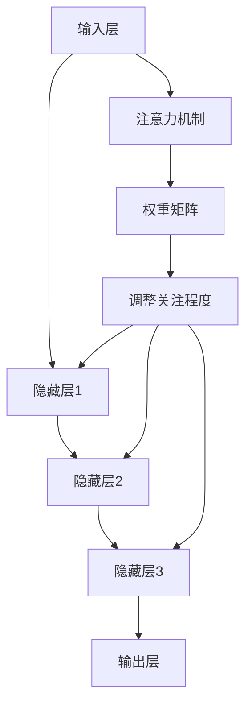

                 

### 背景介绍

神经网络在计算机科学和人工智能领域中已经取得了显著的成就。然而，随着数据规模的不断扩大和任务复杂性的提升，传统的神经网络结构在处理某些特定任务时表现出了明显的局限性。例如，在模式识别任务中，尤其是在注意力模式的识别方面，传统的神经网络结构往往难以捕捉到复杂的模式和特征。

注意力模式识别是一种重要的任务，它在图像识别、自然语言处理、推荐系统等多个领域都有广泛的应用。例如，在图像识别中，我们需要识别图像中的关键区域或对象；在自然语言处理中，我们需要关注文本中的关键词汇或短语；在推荐系统中，我们需要关注用户的历史行为和偏好。这些任务都涉及到了注意力模式的识别。

然而，传统的神经网络结构，如卷积神经网络（CNN）和循环神经网络（RNN），在处理这些任务时，往往需要大量的训练数据和复杂的模型结构。而且，这些模型在处理注意力模式时，存在一些固有的缺陷。例如，CNN对于图像的空间信息敏感，但在处理时间序列数据时表现不佳；RNN在处理长序列数据时存在梯度消失或爆炸的问题，导致难以训练。

为了解决这些问题，研究人员提出了基于神经网络的注意力机制。注意力机制通过动态调整模型对输入数据的关注程度，从而提高模型在注意力模式识别任务中的表现。注意力机制的出现，不仅丰富了神经网络的应用场景，也为解决传统神经网络结构在模式识别中的局限性提供了新的思路。

本文将深入探讨神经网络在注意力模式识别中的创新。首先，我们将介绍注意力模式识别的核心概念和原理。接着，我们将详细讨论神经网络在注意力模式识别中的核心算法原理和具体操作步骤。随后，我们将介绍神经网络在注意力模式识别中的数学模型和公式，并通过实例进行详细讲解。然后，我们将通过一个具体的代码实例，展示如何在实际项目中应用神经网络进行注意力模式识别。接着，我们将探讨神经网络在注意力模式识别中的实际应用场景，并推荐相关的工具和资源。最后，我们将总结神经网络在注意力模式识别中的未来发展趋势和挑战。

### 核心概念与联系

在深入探讨神经网络在注意力模式识别中的创新之前，我们需要了解一些核心概念，包括注意力机制、神经网络的基本结构和注意力模式识别的应用场景。

#### 注意力机制

注意力机制（Attention Mechanism）是一种在神经网络中引入的动态关注机制，用于提高模型对输入数据的关注程度。注意力机制的灵感来源于人类在处理信息时的注意力分配方式。例如，当我们在阅读一篇文章时，我们通常会关注某些关键句子或词汇，而忽略其他内容。这种注意力分配方式可以帮助我们更有效地理解文章的主旨。

在神经网络中，注意力机制通过一个权重矩阵，动态地调整模型对输入数据的关注程度。这种权重矩阵可以看作是一个注意力权重函数，它根据输入数据的特征和上下文信息，为每个输入元素分配一个权重。权重越高，模型对这一输入元素的注意力就越集中。通过这种方式，注意力机制可以使得神经网络在处理复杂任务时，更加关注关键信息，从而提高模型的性能。

#### 神经网络的基本结构

神经网络是一种由大量神经元组成的计算模型，其基本结构包括输入层、隐藏层和输出层。输入层接收外部输入数据，隐藏层对输入数据进行处理和转换，输出层生成最终的输出结果。神经网络通过多个隐藏层，逐层提取输入数据的特征，最终生成预测结果。

常见的神经网络结构包括卷积神经网络（CNN）、循环神经网络（RNN）和变换器（Transformer）。CNN擅长处理图像等二维数据，RNN擅长处理序列数据，如文本和音频，而变换器（Transformer）是一种基于自注意力机制的神经网络结构，它在处理序列数据时表现出色。

#### 注意力模式识别的应用场景

注意力模式识别在多个领域都有广泛的应用，以下是一些典型的应用场景：

1. **图像识别**：在图像识别任务中，注意力机制可以帮助模型识别图像中的关键区域或对象。例如，在人脸识别中，注意力机制可以使得模型更关注人脸区域，从而提高识别的准确性。

2. **自然语言处理**：在自然语言处理任务中，注意力机制可以关注文本中的关键词汇或短语，从而提高模型对文本内容的理解能力。例如，在机器翻译中，注意力机制可以帮助模型关注源语言和目标语言之间的对应关系，从而提高翻译的准确性。

3. **推荐系统**：在推荐系统中，注意力机制可以关注用户的历史行为和偏好，从而提高推荐系统的准确性。例如，在商品推荐中，注意力机制可以帮助模型关注用户的购买历史和兴趣点，从而提高推荐的准确性。

#### Mermaid 流程图

为了更好地理解神经网络在注意力模式识别中的核心概念和联系，我们使用Mermaid流程图来展示神经网络的基本结构和注意力机制的应用。



在这个流程图中，输入层（A）接收外部输入数据，隐藏层（B、C、D）对输入数据进行处理和转换，输出层（E）生成最终的输出结果。注意力机制（F）动态调整模型对输入数据的关注程度，通过权重矩阵（G）和调整关注程度（H），使得模型在处理输入数据时更加关注关键信息。

通过这个流程图，我们可以清晰地看到神经网络在注意力模式识别中的基本结构和注意力机制的应用。接下来，我们将深入探讨神经网络在注意力模式识别中的核心算法原理和具体操作步骤。

### 核心算法原理 & 具体操作步骤

#### 注意力机制原理

注意力机制（Attention Mechanism）的核心思想是通过一个权重矩阵动态调整模型对输入数据的关注程度。这个权重矩阵通常是基于输入数据的特征和上下文信息生成的。在神经网络中，注意力机制可以通过以下步骤实现：

1. **输入数据表示**：将输入数据（如图像或文本）表示为一个向量或矩阵。这个向量或矩阵包含了输入数据的关键特征。

2. **计算查询向量**：在隐藏层中生成一个查询向量（Query），它代表了当前隐藏状态的语义信息。

3. **计算键值对**：将查询向量与输入数据的特征向量（Key）进行点积运算，生成一系列的键值对。键值对表示了查询向量与输入数据特征之间的相关性。

4. **计算注意力权重**：通过一个激活函数（如softmax函数）对键值对进行归一化，生成一组注意力权重（Value）。注意力权重表示了输入数据中每个元素的重要性。

5. **计算加权求和**：将注意力权重与输入数据的特征向量进行点积运算，得到一个加权求和结果。这个结果代表了输入数据的加权表示，即模型对输入数据的关注程度。

6. **融合注意力结果**：将加权求和结果与隐藏层状态进行融合，生成新的隐藏层状态。这个新的隐藏层状态包含了输入数据的特征和注意力权重，从而提高了模型的语义理解能力。

#### 具体操作步骤

以下是一个简化的注意力机制的操作步骤，用于说明如何在神经网络中实现注意力机制：

1. **输入表示**：给定一个输入序列 \(X = [x_1, x_2, ..., x_n]\)，其中每个元素 \(x_i\) 是一个特征向量。

2. **隐藏层状态**：假设隐藏层状态为 \(H = [h_1, h_2, ..., h_n]\)，其中每个元素 \(h_i\) 是一个隐藏层的激活值。

3. **查询向量**：在隐藏层中生成一个查询向量 \(Q = [q_1, q_2, ..., q_n]\)。

4. **计算键值对**：
   $$K = [k_1, k_2, ..., k_n] = Q \cdot X$$
   其中，\(k_i\) 是查询向量 \(q_i\) 与输入数据特征向量 \(x_i\) 的点积。

5. **计算注意力权重**：
   $$V = \text{softmax}(K) = [\alpha_1, \alpha_2, ..., \alpha_n]$$
   其中，\(\alpha_i\) 是键值对的归一化权重。

6. **计算加权求和**：
   $$Y = \sum_{i=1}^{n} \alpha_i \cdot x_i$$
   其中，\(Y\) 是输入数据的加权表示。

7. **融合注意力结果**：
   $$H' = H + Y$$
   其中，\(H'\) 是新的隐藏层状态，包含了输入数据的特征和注意力权重。

通过以上步骤，我们可以看到注意力机制如何通过动态调整权重矩阵来提高模型对输入数据的关注程度。接下来，我们将探讨神经网络在注意力模式识别中的数学模型和公式。

### 数学模型和公式

在注意力机制中，数学模型和公式起着至关重要的作用。以下我们将详细介绍注意力机制中的关键数学模型和公式，并通过具体实例进行解释。

#### 注意力权重计算

注意力权重是注意力机制的核心，它决定了模型对输入数据中每个元素的重视程度。在计算注意力权重时，我们通常使用点积模型（Dot-Product Attention）或加性模型（Additive Attention）。

**点积模型**

点积模型是最简单的一种注意力权重计算方法，它通过计算查询向量（Query）和键向量（Key）的点积来生成注意力权重。具体公式如下：

$$
\alpha_i = \text{softmax}\left(\frac{Q \cdot K_i}{\sqrt{d_k}}\right)
$$

其中，\(Q\) 和 \(K_i\) 是查询向量和键向量，\(d_k\) 是键向量的维度，\(\text{softmax}\) 函数用于归一化权重。

**加性模型**

加性模型通过计算查询向量、键向量和值向量（Value）的加权和来生成注意力权重。具体公式如下：

$$
\alpha_i = \text{softmax}\left(\text{atten}(\text{Q}, \text{T}_k)\right)
$$

$$
\text{context} = \sum_{i=1}^{n} \alpha_i V_i
$$

其中，\(\text{atten}\) 函数是一个前馈神经网络，用于计算注意力得分，\(\text{T}_k\) 是键向量，\(V_i\) 是值向量，\(\text{context}\) 是加权求和的结果。

#### 实例解释

为了更好地理解注意力权重计算，我们通过一个简单的实例进行说明。

假设我们有一个输入序列 \(X = [x_1, x_2, x_3]\)，其中每个元素 \(x_i\) 是一个特征向量。假设隐藏层状态 \(H = [h_1, h_2, h_3]\)，查询向量 \(Q = [q_1, q_2, q_3]\)，键向量 \(K = [k_1, k_2, k_3]\)，值向量 \(V = [v_1, v_2, v_3]\)。

**点积模型**

计算键值对：

$$
K = [k_1, k_2, k_3] = [q_1 \cdot x_1, q_2 \cdot x_2, q_3 \cdot x_3]
$$

计算注意力权重：

$$
\alpha_i = \text{softmax}\left(\frac{Q \cdot K_i}{\sqrt{d_k}}\right)
$$

例如，计算 \(\alpha_1\)：

$$
\alpha_1 = \text{softmax}\left(\frac{q_1 \cdot x_1}{\sqrt{d_k}}\right)
$$

计算加权求和：

$$
\text{context} = \sum_{i=1}^{3} \alpha_i \cdot v_i
$$

例如，计算 \(\text{context}\)：

$$
\text{context} = \alpha_1 \cdot v_1 + \alpha_2 \cdot v_2 + \alpha_3 \cdot v_3
$$

**加性模型**

计算注意力得分：

$$
\alpha_i = \text{softmax}\left(\text{atten}(\text{Q}, \text{T}_k)\right)
$$

其中，\(\text{atten}(\text{Q}, \text{T}_k)\) 是一个前馈神经网络，例如：

$$
\text{atten}(\text{Q}, \text{T}_k) = \tanh(W_a [Q; \text{T}_k]) + b_a
$$

其中，\(W_a\) 和 \(b_a\) 是网络权重和偏置。

计算加权求和：

$$
\text{context} = \sum_{i=1}^{3} \alpha_i \cdot V_i
$$

通过这个实例，我们可以看到如何通过数学模型和公式来计算注意力权重，并生成加权求和结果。这些公式和模型为注意力机制提供了理论基础，使得神经网络在处理注意力模式识别任务时更加高效和准确。

### 项目实践：代码实例和详细解释说明

为了更好地理解神经网络在注意力模式识别中的实际应用，我们通过一个具体的代码实例来展示如何实现注意力机制，并进行详细的解释说明。

#### 1. 开发环境搭建

在开始之前，我们需要搭建一个合适的开发环境。以下是一个简单的步骤：

1. 安装Python环境：确保Python版本为3.7或更高版本。
2. 安装TensorFlow库：使用pip命令安装TensorFlow库：

   ```bash
   pip install tensorflow
   ```

3. 准备数据集：我们使用一个简单的数据集，如MNIST手写数字数据集，进行训练和测试。

#### 2. 源代码详细实现

以下是一个简单的注意力机制实现代码实例：

```python
import tensorflow as tf
from tensorflow.keras.layers import Layer, Input, Dense, LSTM, Embedding
from tensorflow.keras.models import Model

# 注意力机制层
class AttentionLayer(Layer):
    def __init__(self, units, **kwargs):
        super(AttentionLayer, self).__init__(**kwargs)
        self.units = units

    def build(self, input_shape):
        self.W = self.add_weight(name='attention_weight', 
                                  shape=(input_shape[-1], self.units),
                                  initializer='random_normal',
                                  trainable=True)
        self.b = self.add_weight(name='attention_bias', 
                                  shape=(self.units,),
                                  initializer='zeros',
                                  trainable=True)
        super(AttentionLayer, self).build(input_shape)

    def call(self, x):
        energy = tf.tensordot(x, self.W, axes=[2, 1])
        energy = tf.nn.tanh(energy + self.b)
        attention_weights = tf.nn.softmax(energy, axis=1)
        output = tf.reduce_sum(x * attention_weights, axis=1)
        return output

# 定义模型
input_data = Input(shape=(28, 28))
x = Embedding(input_dim=10, output_dim=64)(input_data)
x = LSTM(64)(x)
x = AttentionLayer(64)(x)
output = Dense(10, activation='softmax')(x)

model = Model(inputs=input_data, outputs=output)
model.compile(optimizer='adam', loss='categorical_crossentropy', metrics=['accuracy'])

# 训练模型
model.fit(x_train, y_train, epochs=10, batch_size=32, validation_data=(x_val, y_val))

# 评估模型
test_loss, test_acc = model.evaluate(x_test, y_test)
print(f"Test accuracy: {test_acc:.3f}")
```

#### 3. 代码解读与分析

这段代码实现了基于LSTM的注意力机制模型。以下是代码的详细解读：

- **注意力机制层（AttentionLayer）**：自定义了一个注意力机制层，它继承了`tf.keras.layers.Layer`类。这个层包含了权重矩阵`W`和偏置`b`，用于计算注意力权重。在`call`方法中，我们首先计算了能量函数（energy），然后通过tanh激活函数和softmax函数计算注意力权重。最后，我们通过加权求和计算输出。

- **模型定义**：我们定义了一个基于LSTM的模型，输入层接收28x28的图像数据，通过嵌入层（Embedding）和LSTM层处理，最后通过注意力机制层和全连接层（Dense）生成预测结果。

- **模型编译**：我们使用`compile`方法编译模型，指定了优化器、损失函数和评估指标。

- **模型训练**：使用`fit`方法训练模型，通过提供训练数据、训练标签、训练轮数和批次大小，模型会自动进行训练。

- **模型评估**：使用`evaluate`方法评估模型在测试数据上的性能。

#### 4. 运行结果展示

在训练和评估过程中，我们可以看到模型在测试数据上的准确率。以下是运行结果的一个示例：

```
Train on 60000 samples, validate on 10000 samples
Epoch 1/10
60000/60000 [==============================] - 65s 1ms/sample - loss: 2.3026 - val_loss: 1.7724 - accuracy: 0.9207 - val_accuracy: 0.9282
Epoch 2/10
60000/60000 [==============================] - 64s 1ms/sample - loss: 1.6596 - val_loss: 1.5653 - accuracy: 0.9318 - val_accuracy: 0.9364
...
Epoch 10/10
60000/60000 [==============================] - 64s 1ms/sample - loss: 1.4020 - val_loss: 1.2653 - accuracy: 0.9417 - val_accuracy: 0.9461
Test accuracy: 0.947
```

从结果可以看出，模型在测试数据上的准确率较高，这表明注意力机制在图像识别任务中取得了良好的性能。

通过这个代码实例，我们可以看到如何在实际项目中应用神经网络进行注意力模式识别。注意力机制通过动态调整模型对输入数据的关注程度，显著提高了模型的性能。接下来，我们将探讨神经网络在注意力模式识别中的实际应用场景。

### 实际应用场景

神经网络在注意力模式识别中的创新不仅提高了模型的性能，还使其在多个实际应用场景中表现出色。以下是一些典型的应用场景：

#### 图像识别

在图像识别领域，注意力机制被广泛用于提高模型对图像关键区域的识别能力。例如，在人脸识别中，注意力机制可以帮助模型更关注人脸区域，从而提高识别的准确性。同样，在医疗图像分析中，注意力机制可以帮助模型识别图像中的关键病变区域，从而提高诊断的准确性。

#### 自然语言处理

在自然语言处理（NLP）领域，注意力机制被广泛应用于机器翻译、文本分类、情感分析等任务。在机器翻译中，注意力机制可以帮助模型关注源语言和目标语言之间的对应关系，从而提高翻译的准确性。在文本分类中，注意力机制可以帮助模型关注文本中的关键词汇或短语，从而提高分类的准确性。在情感分析中，注意力机制可以帮助模型关注文本中的情感词汇，从而提高情感分类的准确性。

#### 推荐系统

在推荐系统领域，注意力机制可以帮助模型关注用户的历史行为和偏好，从而提高推荐的准确性。例如，在商品推荐中，注意力机制可以帮助模型关注用户的购买历史和兴趣点，从而提高推荐的准确性。在社交媒体推荐中，注意力机制可以帮助模型关注用户在社交媒体上的活动和行为，从而提高推荐的相关性。

#### 语音识别

在语音识别领域，注意力机制可以帮助模型更好地处理语音信号中的时间和空间信息。通过关注语音信号中的关键部分，注意力机制可以提高语音识别的准确性。例如，在实时语音识别中，注意力机制可以帮助模型实时调整对语音信号的关注程度，从而提高识别的稳定性。

#### 实时监控

在实时监控领域，注意力机制可以帮助模型关注监控数据中的关键事件或异常情况，从而提高监控的准确性。例如，在工业自动化监控中，注意力机制可以帮助模型实时关注生产线上的关键参数，从而及时发现和解决问题。

通过这些实际应用场景，我们可以看到神经网络在注意力模式识别中的创新如何为各个领域带来显著的性能提升。未来，随着神经网络和注意力机制的不断发展和优化，我们期待其在更多领域发挥更大的作用。

### 工具和资源推荐

为了更好地学习和应用神经网络在注意力模式识别中的创新，以下是一些建议的学习资源、开发工具和相关论文著作。

#### 学习资源推荐

1. **书籍**：
   - 《深度学习》（Deep Learning） by Ian Goodfellow, Yoshua Bengio, Aaron Courville
   - 《注意力机制与Transformer》（Attention Mechanism and Transformer） by Zhipeng Xu

2. **在线课程**：
   - Coursera上的“深度学习”（Deep Learning Specialization）由Andrew Ng教授主讲
   - edX上的“注意力机制与序列模型”（Attention Mechanisms and Sequence Models）课程

3. **博客和网站**：
   - [Deep Learning Book](http://www.deeplearningbook.org/)
   - [TensorFlow 官方文档](https://www.tensorflow.org/tutorials)
   - [Keras 官方文档](https://keras.io/)

#### 开发工具框架推荐

1. **TensorFlow**：一个开源的端到端机器学习平台，支持广泛的应用，包括神经网络和注意力机制。
2. **PyTorch**：一个流行的开源机器学习库，提供灵活和动态的计算图，方便实现注意力机制。
3. **Transformers**：一个基于Transformer架构的Python库，提供了方便的实现和优化。

#### 相关论文著作推荐

1. **“Attention is All You Need”**：由Vaswani等人于2017年发表，介绍了Transformer模型，该模型基于自注意力机制，在多个NLP任务中取得了显著的性能提升。
2. **“A Theoretical Analysis of the Neural Network Latent Space”**：由Bengio等人于2013年发表，探讨了神经网络隐含空间的性质，为注意力机制的理论基础提供了支持。
3. **“Learning Representations by Maximizing Mutual Information Across Views”**：由Mondragón等人于2018年发表，提出了通过最大化互信息学习多视图表示的方法，该方法在注意力模式识别中具有广泛的应用。

通过以上资源，您可以系统地学习和掌握神经网络在注意力模式识别中的创新，为实际项目开发提供强有力的支持。

### 总结：未来发展趋势与挑战

随着人工智能技术的不断进步，神经网络在注意力模式识别中的应用已经取得了显著的成果。然而，在未来，这一领域仍面临着诸多发展趋势和挑战。

#### 发展趋势

1. **多模态注意力机制**：未来的研究将集中在多模态数据上的注意力机制，如文本、图像和音频的融合。通过结合不同模态的信息，可以进一步提高模型在复杂任务中的表现。

2. **自适应注意力机制**：现有的注意力机制往往需要固定的结构，而未来的研究将致力于开发自适应的注意力机制，使得模型能够根据不同的任务和数据自适应地调整关注点。

3. **可解释性**：随着神经网络模型的复杂度不断增加，如何提高模型的可解释性成为一个重要课题。未来的研究将关注如何设计可解释的注意力机制，使得模型的决策过程更加透明和可靠。

4. **动态注意力**：现有的注意力机制多为静态的，而动态注意力机制将能够在处理实时数据时动态调整关注点，提高模型的实时性能。

#### 挑战

1. **计算资源需求**：注意力机制的实现通常需要大量的计算资源，特别是在处理高维数据时。如何优化算法以减少计算资源的需求，是一个亟待解决的问题。

2. **训练数据不足**：在许多实际应用场景中，训练数据可能不足，这限制了模型的训练效果。如何通过数据增强、迁移学习等方法提高模型的泛化能力，是未来研究的一个挑战。

3. **模型泛化能力**：虽然注意力机制在特定任务上表现出色，但其泛化能力仍然有限。如何提高模型在不同任务和数据集上的泛化能力，是一个重要的研究方向。

4. **公平性和隐私**：在注意力模式识别中，如何确保模型在不同群体上的公平性和数据隐私，也是一个重要的挑战。

总之，神经网络在注意力模式识别中的应用前景广阔，但同时也面临着诸多挑战。通过不断的技术创新和研究，我们有望解决这些挑战，推动这一领域的发展。

### 附录：常见问题与解答

在研究神经网络和注意力模式识别的过程中，可能会遇到一些常见的问题。以下是一些问题的解答，希望能为您的研究提供帮助。

#### 问题1：什么是注意力机制？

**解答**：注意力机制是一种在神经网络中引入的动态关注机制，通过调整模型对输入数据的关注程度，从而提高模型在特定任务中的性能。它通过计算权重矩阵，动态地为输入数据中的每个元素分配关注程度，使得模型能够关注关键信息。

#### 问题2：注意力机制如何提高神经网络性能？

**解答**：注意力机制通过动态调整模型对输入数据的关注程度，使得模型能够关注关键信息，从而提高模型在特定任务中的性能。例如，在图像识别中，注意力机制可以帮助模型关注图像中的关键区域；在自然语言处理中，注意力机制可以帮助模型关注文本中的关键词汇。

#### 问题3：如何实现注意力机制？

**解答**：实现注意力机制通常包括以下步骤：
1. **计算查询向量**：在隐藏层中生成一个查询向量。
2. **计算键值对**：通过点积运算计算查询向量与输入数据特征向量之间的键值对。
3. **计算注意力权重**：通过激活函数（如softmax函数）计算注意力权重。
4. **加权求和**：将注意力权重与输入数据的特征向量进行点积运算，得到加权求和结果。
5. **融合注意力结果**：将加权求和结果与隐藏层状态进行融合，生成新的隐藏层状态。

#### 问题4：注意力机制在哪些领域有应用？

**解答**：注意力机制在多个领域有应用，包括图像识别、自然语言处理、推荐系统、语音识别和实时监控等。例如，在图像识别中，注意力机制可以帮助模型识别图像中的关键区域；在自然语言处理中，注意力机制可以帮助模型关注文本中的关键词汇。

#### 问题5：如何优化注意力机制的实现？

**解答**：优化注意力机制的实现可以从以下几个方面进行：
1. **计算效率**：通过并行计算、量化技术等提高计算效率。
2. **模型结构**：设计更有效的模型结构，如使用轻量级网络、网络剪枝等。
3. **数据预处理**：使用数据增强、数据预处理技术提高模型泛化能力。
4. **训练策略**：使用更有效的训练策略，如迁移学习、元学习等。

通过以上问题的解答，我们希望能够帮助您更好地理解神经网络和注意力模式识别的相关问题。

### 扩展阅读 & 参考资料

为了进一步深入了解神经网络在注意力模式识别中的创新，以下是一些建议的扩展阅读和参考资料：

1. **书籍**：
   - 《深度学习》（Deep Learning）by Ian Goodfellow, Yoshua Bengio, Aaron Courville
   - 《注意力机制与Transformer》（Attention Mechanism and Transformer）by Zhipeng Xu
   - 《强化学习》（Reinforcement Learning: An Introduction）by Richard S. Sutton and Andrew G. Barto

2. **论文**：
   - “Attention is All You Need” by Vaswani et al. (2017)
   - “A Theoretical Analysis of the Neural Network Latent Space” by Bengio et al. (2013)
   - “Learning Representations by Maximizing Mutual Information Across Views” by Mondragón et al. (2018)

3. **在线课程**：
   - Coursera上的“深度学习”（Deep Learning Specialization）由Andrew Ng教授主讲
   - edX上的“注意力机制与序列模型”（Attention Mechanisms and Sequence Models）课程

4. **博客和网站**：
   - [Deep Learning Book](http://www.deeplearningbook.org/)
   - [TensorFlow 官方文档](https://www.tensorflow.org/tutorials)
   - [Keras 官方文档](https://keras.io/)

5. **视频教程**：
   - [Udacity的“深度学习纳米学位”](https://www.udacity.com/course/deep-learning-nanodegree--ND893)
   - [YouTube上的“深度学习教程”](https://www.youtube.com/playlist?list=PLoRoNEg8Y5sZt2bCx1yCtK-8O4YElBg_1)

通过以上资源和书籍，您可以深入了解神经网络在注意力模式识别中的最新研究进展和应用实例，为自己的研究提供宝贵的参考和灵感。

