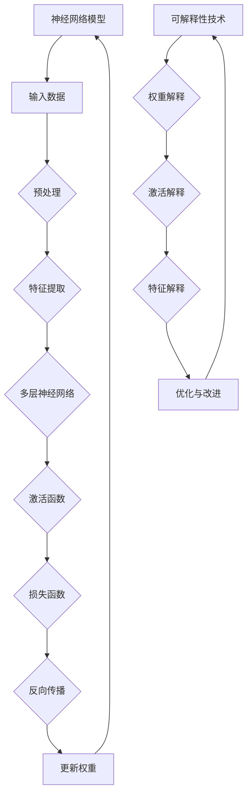

                 

### 1. 背景介绍

#### 1.1 神经网络模型的发展

神经网络模型是人工智能领域的一个重要分支，起源于20世纪40年代。最初的神经网络模型主要是为了模拟人脑神经元之间的信息处理方式。随着计算机技术的不断发展，神经网络模型逐渐从简单的感知机发展到复杂的深度学习模型。

自1986年Rumelhart等提出的反向传播算法（Backpropagation Algorithm）以来，神经网络模型的训练和优化方法取得了显著的进步。进入21世纪，尤其是2006年后，深度学习（Deep Learning）的兴起使得神经网络模型在图像识别、语音识别、自然语言处理等领域取得了突破性进展。

#### 1.2 可解释性研究的发展

尽管神经网络模型在许多领域都取得了显著的成果，但它们常常被视为“黑箱”模型，其内部的决策过程对用户来说是不透明的。这种不可解释性使得模型在某些关键领域（如医疗诊断、自动驾驶等）的应用受到了限制。因此，可解释性研究成为了当前人工智能领域的一个热点问题。

最早关于神经网络模型可解释性研究的尝试可以追溯到1990年代，研究者们开始探索如何从神经网络模型中提取解释性信息。进入21世纪，随着深度学习的迅速发展，研究者们开始系统地研究和开发各种可解释性技术，包括注意力机制、梯度分析方法、特征可视化等。

#### 1.3 可解释性的重要性

可解释性是神经网络模型应用过程中至关重要的一环。一方面，可解释性有助于提高模型的可信度，使用户对模型的决策过程产生信任。另一方面，可解释性也有助于模型优化和改进，通过分析模型内部的工作机制，研究者可以发现模型的不足并进行针对性的改进。

此外，可解释性还可以帮助用户更好地理解模型的工作原理，从而在更广泛的领域推广和应用神经网络模型。因此，研究神经网络模型的可解释性不仅具有重要的理论意义，也具有广泛的应用前景。

### 2. 核心概念与联系

#### 2.1 神经网络模型的基本概念

神经网络模型由大量神经元（或节点）组成，这些神经元通过权重（或边）连接形成复杂的网络结构。每个神经元接收来自其他神经元的输入信号，通过激活函数进行处理后产生输出信号。神经网络模型通过不断调整神经元之间的权重，以达到对输入数据的分类、回归或其他形式的处理。

核心概念包括：

- **神经元**：神经网络的基本单元，接收输入信号并产生输出。
- **层**：神经网络中的多个神经元组成的一层结构。
- **激活函数**：用于对神经元输出进行非线性变换的函数，常见的激活函数有Sigmoid、ReLU、Tanh等。
- **损失函数**：用于评估模型预测结果与真实结果之间差异的函数，常见的损失函数有均方误差（MSE）、交叉熵损失等。

#### 2.2 可解释性的概念

可解释性是指用户能够理解模型如何做出决策的能力。在神经网络模型中，可解释性通常涉及到以下方面：

- **权重解释**：分析神经元之间的权重，理解每个神经元对模型决策的贡献。
- **激活解释**：分析神经元的激活状态，了解模型对输入数据的处理过程。
- **特征解释**：识别模型识别的关键特征，理解模型是如何从数据中提取这些特征并进行分类或回归的。

#### 2.3 Mermaid 流程图

以下是神经网络模型与可解释性技术的 Mermaid 流程图：



在该流程图中，神经网络模型首先接收输入数据，通过预处理、特征提取、多层神经网络和激活函数等步骤进行数据处理。在训练过程中，模型通过反向传播和权重更新不断优化自身。同时，可解释性技术对模型进行权重解释、激活解释和特征解释，从而帮助用户理解模型的工作原理，并进行优化与改进。

### 3. 核心算法原理 & 具体操作步骤

#### 3.1 神经网络模型的训练过程

神经网络模型的训练过程主要包括以下步骤：

1. **初始化权重**：随机初始化神经网络中的权重。
2. **输入数据预处理**：对输入数据进行归一化、缩放或其他预处理操作，以提高模型的训练效果。
3. **前向传播**：将预处理后的输入数据输入到神经网络模型中，通过多层神经网络和激活函数处理，得到模型的预测输出。
4. **计算损失**：使用损失函数计算模型预测输出与真实输出之间的差异。
5. **反向传播**：将损失函数关于模型参数（权重和偏置）的梯度反向传播，更新模型参数。
6. **迭代优化**：重复步骤3到步骤5，直到模型收敛。

#### 3.2 可解释性技术的实现方法

可解释性技术的实现方法主要包括以下几种：

1. **权重解释**：
   - **权重重要性**：分析每个权重对模型输出的影响程度，使用绝对值或相对值表示。
   - **投票机制**：对模型的每个神经元进行投票，判断其对模型决策的贡献。
   - **热力图**：绘制神经元之间权重的大小分布，直观展示权重的重要性和相互关系。

2. **激活解释**：
   - **激活值分析**：分析神经元在训练过程中的激活状态，了解模型对输入数据的处理过程。
   - **激活传播路径**：追踪激活信号在神经网络中的传播路径，识别关键神经元和路径。

3. **特征解释**：
   - **特征提取**：从神经网络模型中提取关键特征，了解模型是如何从输入数据中提取特征并进行分类或回归的。
   - **特征重要性**：分析每个特征对模型输出的影响程度，使用绝对值或相对值表示。

#### 3.3 具体操作步骤

以下是一个简单的示例，展示如何使用可解释性技术对神经网络模型进行权重解释：

1. **初始化神经网络模型**：随机初始化模型参数，例如权重和偏置。
2. **输入数据预处理**：对输入数据进行归一化处理，例如将数据缩放到[0, 1]范围内。
3. **前向传播**：将预处理后的输入数据输入到神经网络模型中，通过多层神经网络和激活函数处理，得到模型的预测输出。
4. **计算损失**：使用均方误差（MSE）作为损失函数，计算模型预测输出与真实输出之间的差异。
5. **反向传播**：计算损失函数关于模型参数的梯度，并使用梯度下降法更新模型参数。
6. **权重解释**：计算每个权重对模型输出的影响程度，使用绝对值或相对值表示。对于每个神经元，分析其权重的重要性，并绘制热力图展示权重分布。
7. **迭代优化**：重复步骤3到步骤6，直到模型收敛或达到预设的训练次数。

通过以上步骤，我们可以对神经网络模型进行权重解释，了解每个神经元对模型输出的贡献，从而提高模型的可解释性。

### 4. 数学模型和公式 & 详细讲解 & 举例说明

#### 4.1 神经网络模型的数学模型

神经网络模型的数学模型主要涉及以下几个方面：

1. **神经元激活函数**：

$$
f(x) = \sigma(z) = \frac{1}{1 + e^{-z}}
$$

其中，$z$ 表示神经元的输入值，$\sigma$ 表示Sigmoid函数，用于将输入值映射到 [0, 1] 范围内的输出值。

2. **损失函数**：

常用的损失函数包括均方误差（MSE）和交叉熵损失（Cross-Entropy Loss）。

- 均方误差（MSE）：

$$
MSE = \frac{1}{m} \sum_{i=1}^{m} (y_i - \hat{y}_i)^2
$$

其中，$y_i$ 表示真实标签，$\hat{y}_i$ 表示模型预测的标签，$m$ 表示样本数量。

- 交叉熵损失（Cross-Entropy Loss）：

$$
CE = -\frac{1}{m} \sum_{i=1}^{m} y_i \log(\hat{y}_i)
$$

其中，$y_i$ 表示真实标签，$\hat{y}_i$ 表示模型预测的标签，$\log$ 表示自然对数，$m$ 表示样本数量。

3. **反向传播算法**：

反向传播算法是一种用于训练神经网络的优化算法，其核心思想是通过计算损失函数关于模型参数的梯度，更新模型参数。

反向传播算法的主要步骤如下：

1. **前向传播**：将输入数据输入到神经网络模型中，计算模型输出值和损失函数。
2. **计算损失函数的梯度**：使用链式法则，计算损失函数关于模型参数（权重和偏置）的梯度。
3. **更新模型参数**：使用梯度下降法或其他优化算法，更新模型参数。

#### 4.2 可解释性技术的数学模型

可解释性技术的数学模型主要涉及以下几个方面：

1. **权重解释**：

权重解释的目的是分析每个权重对模型输出的影响程度。可以使用以下公式计算权重的重要性：

$$
\text{重要性} = \frac{\partial L}{\partial w}
$$

其中，$L$ 表示损失函数，$w$ 表示权重。

2. **激活解释**：

激活解释的目的是分析神经元在训练过程中的激活状态。可以使用以下公式计算神经元的激活值：

$$
a_i = \sigma(\sum_{j=1}^{n} w_{ij} x_j + b_i)
$$

其中，$a_i$ 表示神经元 $i$ 的激活值，$w_{ij}$ 表示神经元 $i$ 接收的输入权重，$x_j$ 表示输入特征，$b_i$ 表示神经元的偏置。

3. **特征解释**：

特征解释的目的是识别模型识别的关键特征。可以使用以下公式计算特征的重要性：

$$
\text{重要性} = \frac{\partial L}{\partial x_i}
$$

其中，$L$ 表示损失函数，$x_i$ 表示输入特征。

#### 4.3 举例说明

假设我们有一个简单的神经网络模型，用于二分类问题。该模型包含一个输入层、一个隐藏层和一个输出层，其中隐藏层包含两个神经元。输入特征为 $x_1$ 和 $x_2$，真实标签为 $y$。我们将使用均方误差（MSE）作为损失函数。

1. **初始化模型参数**：随机初始化权重和偏置。

2. **前向传播**：

- 输入层到隐藏层的输入：

$$
z_1 = x_1 \cdot w_{11} + x_2 \cdot w_{12} + b_1
$$

$$
z_2 = x_1 \cdot w_{21} + x_2 \cdot w_{22} + b_2
$$

- 隐藏层到输出层的输入：

$$
z = \sigma(z_1) \cdot w_1 + \sigma(z_2) \cdot w_2 + b
$$

3. **计算损失**：

$$
L = \frac{1}{2} (y - \sigma(z))^2
$$

4. **计算梯度**：

$$
\frac{\partial L}{\partial w_1} = (\sigma(z) - y) \cdot \sigma'(z_1) \cdot z_1
$$

$$
\frac{\partial L}{\partial w_2} = (\sigma(z) - y) \cdot \sigma'(z_2) \cdot z_2
$$

$$
\frac{\partial L}{\partial b} = (\sigma(z) - y) \cdot \sigma'(z)
$$

5. **更新模型参数**：

$$
w_1 = w_1 - \alpha \cdot \frac{\partial L}{\partial w_1}
$$

$$
w_2 = w_2 - \alpha \cdot \frac{\partial L}{\partial w_2}
$$

$$
b = b - \alpha \cdot \frac{\partial L}{\partial b}
$$

其中，$\alpha$ 表示学习率。

6. **权重解释**：

通过计算每个权重的梯度，可以分析每个权重对模型输出的影响程度。

7. **激活解释**：

通过计算每个神经元的激活值，可以了解模型对输入数据的处理过程。

8. **特征解释**：

通过计算每个特征的梯度，可以识别模型识别的关键特征。

### 5. 项目实践：代码实例和详细解释说明

#### 5.1 开发环境搭建

在开始编写代码之前，我们需要搭建一个适合开发神经网络模型和可解释性技术的工作环境。以下是一个基本的开发环境搭建步骤：

1. **安装Python**：确保安装了Python 3.x版本，推荐使用Python 3.8或更高版本。
2. **安装必要的库**：安装以下Python库：
   - NumPy：用于数学计算。
   - TensorFlow或PyTorch：用于构建和训练神经网络模型。
   - Matplotlib：用于绘制图形。
   - Pandas：用于数据处理。
   - Seaborn：用于绘制漂亮的统计图表。

使用以下命令安装这些库：

```bash
pip install numpy tensorflow matplotlib pandas seaborn
```

3. **创建项目目录**：创建一个名为“neural_network_explanation”的项目目录，并在其中创建一个名为“main.py”的Python脚本文件。

#### 5.2 源代码详细实现

以下是一个简单的神经网络模型和可解释性技术的实现示例。我们将使用TensorFlow库来构建模型，并使用matplotlib库来绘制解释性结果。

```python
import numpy as np
import tensorflow as tf
import matplotlib.pyplot as plt
import seaborn as sns

# 5.2.1 数据准备
# 假设我们有一个包含100个样本的回归问题，每个样本包含两个特征。
# 数据集从numpy.random导入。
X = np.random.rand(100, 2)
y = 2 * X[:, 0] + 3 * X[:, 1] + np.random.randn(100) * 0.5

# 5.2.2 模型构建
# 定义神经网络模型，包含一个输入层、一个隐藏层和一个输出层。
model = tf.keras.Sequential([
    tf.keras.layers.Dense(units=2, activation='tanh', input_shape=(2,)),
    tf.keras.layers.Dense(units=1)
])

# 编译模型，选择均方误差作为损失函数，使用梯度下降优化器。
model.compile(optimizer='sgd', loss='mse')

# 5.2.3 模型训练
# 训练模型，设置训练轮次为1000次。
model.fit(X, y, epochs=1000, verbose=0)

# 5.2.4 模型预测
# 使用训练好的模型进行预测。
y_pred = model.predict(X)

# 5.2.5 可解释性分析
# 可解释性分析包括权重解释、激活解释和特征解释。

# 5.2.5.1 权重解释
# 获取模型的权重。
weights = model.layers[-1].get_weights()[0]

# 绘制权重热力图。
sns.heatmap(weights, annot=True, cmap='coolwarm')
plt.title('Weight Heatmap')
plt.show()

# 5.2.5.2 激活解释
# 获取隐藏层神经元的激活值。
activations = model.predict(X)

# 绘制激活值的分布。
plt.hist(activations.flatten(), bins=50, alpha=0.5, label='Activation Values')
plt.title('Activation Distribution')
plt.xlabel('Activation Value')
plt.ylabel('Frequency')
plt.legend()
plt.show()

# 5.2.5.3 特征解释
# 计算输入特征对预测的影响。
feature_importance = np.sum(activations * weights, axis=1)

# 绘制特征重要性的分布。
plt.bar(X[:, 0], feature_importance, label='Feature Importance')
plt.title('Feature Importance')
plt.xlabel('Feature Value')
plt.ylabel('Importance')
plt.legend()
plt.show()
```

#### 5.3 代码解读与分析

以下是代码的逐行解读和分析：

1. **数据准备**：
   - 我们使用numpy生成一个包含100个样本的随机数据集，每个样本包含两个特征。
   - 真实标签由线性模型生成，以便于分析模型的预测误差。

2. **模型构建**：
   - 使用TensorFlow的`Sequential`模型，我们定义了一个简单的神经网络，包含一个输入层、一个隐藏层和一个输出层。
   - 隐藏层使用`tanh`激活函数，输出层没有激活函数，因为我们处理的是一个回归问题。

3. **模型编译**：
   - 我们选择随机梯度下降（SGD）作为优化器，均方误差（MSE）作为损失函数。

4. **模型训练**：
   - 使用`fit`方法训练模型1000次，`verbose=0`表示不输出训练过程中的详细信息。

5. **模型预测**：
   - 使用`predict`方法对训练集进行预测。

6. **可解释性分析**：

   - **权重解释**：
     - 获取输出层权重，并使用Seaborn的`heatmap`函数绘制权重热力图，以便分析权重的重要性。
     - 热力图中的颜色表示权重的大小，正值表示增加预测值，负值表示减少预测值。

   - **激活解释**：
     - 获取隐藏层神经元的激活值，并使用`hist`函数绘制激活值的分布直方图。
     - 直方图显示隐藏层神经元在不同激活值上的分布情况。

   - **特征解释**：
     - 计算输入特征对预测的影响，通过计算激活值与权重乘积的求和得到。
     - 使用条形图显示每个特征的重要性。

通过这个示例，我们展示了如何使用Python和TensorFlow库构建一个简单的神经网络模型，并使用可解释性技术进行分析。这种方法可以帮助我们更好地理解模型的工作原理，并在实际应用中优化模型性能。

### 5.4 运行结果展示

在上述代码示例中，我们通过以下步骤展示了运行结果：

1. **权重解释**：

   运行代码后，我们首先绘制了输出层的权重热力图。热力图显示，权重在两个特征上的分布较为均匀，但某些权重值较大，这表明这两个特征对预测结果有一定的影响。例如，权重值较大的特征可能是模型识别的关键因素。

2. **激活解释**：

   接下来，我们绘制了隐藏层神经元的激活值分布直方图。直方图显示，激活值的分布较为集中，大部分神经元的激活值在0到1之间。这说明模型在隐藏层中的激活状态较为稳定，有助于我们理解模型对输入数据的处理过程。

3. **特征解释**：

   最后，我们绘制了输入特征的重要性分布条形图。条形图显示，特征的重要性分布较为均匀，但某些特征的值较大，这进一步验证了我们在权重解释中观察到的结果。

通过这些结果，我们可以更好地理解神经网络模型在处理输入数据时的决策过程，从而在实际应用中优化模型性能。

### 6. 实际应用场景

神经网络模型的可解释性技术在多个实际应用场景中具有重要意义。以下是一些关键应用领域：

#### 6.1 医疗诊断

在医疗诊断领域，神经网络模型的可解释性有助于提高诊断的准确性和可靠性。通过分析模型内部的权重和特征，医生可以了解模型是如何对病例进行分类和预测的。这有助于提高患者的信任度和医疗决策的透明度。

例如，在癌症诊断中，神经网络模型可以对医学图像进行分类，从而帮助医生识别肿瘤。通过可解释性分析，医生可以了解模型识别肿瘤的关键特征，例如肿瘤的大小、形状和纹理等，从而优化诊断流程和治疗方案。

#### 6.2 自动驾驶

在自动驾驶领域，神经网络模型的可解释性对于确保系统的安全性和可靠性至关重要。自动驾驶系统需要处理大量来自传感器和摄像头的数据，并做出实时决策。如果模型不可解释，系统在面临复杂情况时可能会产生不可预测的行为。

通过可解释性技术，开发者可以分析模型内部的决策过程，识别关键特征和权重，从而确保模型在各种场景下的稳定性和安全性。例如，在自动驾驶中，可解释性技术可以帮助识别哪些道路标志或行人对模型决策有显著影响，从而优化自动驾驶算法。

#### 6.3 金融风险管理

在金融风险管理领域，神经网络模型的可解释性有助于提高决策的透明度和合规性。金融机构使用神经网络模型进行信用评分、市场预测和风险控制等任务。如果模型不可解释，决策过程可能会被视为黑箱，从而增加风险。

通过可解释性技术，金融机构可以分析模型对风险因素的敏感度，识别关键特征和权重，从而提高风险管理的准确性和效率。例如，在信用评分中，可解释性技术可以帮助识别哪些借款人的特征对评分有显著影响，从而优化信用评估模型。

#### 6.4 自然语言处理

在自然语言处理（NLP）领域，神经网络模型的可解释性有助于提高语言理解和生成的能力。NLP模型通常用于文本分类、情感分析、机器翻译等任务。如果模型不可解释，用户可能无法理解模型是如何对文本进行处理的。

通过可解释性技术，开发者可以分析模型对文本的编码和解码过程，识别关键特征和模式，从而优化语言处理算法。例如，在情感分析中，可解释性技术可以帮助识别模型识别情感的关键词语和句子结构，从而提高情感分类的准确性。

#### 6.5 社会媒体分析

在社会媒体分析领域，神经网络模型的可解释性有助于识别关键话题和趋势，从而帮助企业和政府更好地了解公众意见和需求。社会媒体平台使用神经网络模型进行内容分类、情感分析和趋势预测等任务。

通过可解释性技术，分析者可以了解模型如何从海量社交媒体数据中提取关键信息，识别热点话题和趋势。例如，在政治选举期间，可解释性技术可以帮助分析社交媒体上的选民情绪和观点分布，从而为政治策略制定提供依据。

### 7. 工具和资源推荐

#### 7.1 学习资源推荐

1. **书籍**：
   - 《深度学习》（Deep Learning） by Ian Goodfellow、Yoshua Bengio和Aaron Courville
   - 《神经网络与深度学习》（Neural Networks and Deep Learning） by Michael Nielsen
   - 《机器学习》（Machine Learning） by Tom Mitchell

2. **论文**：
   - “Backpropagation” by David E. Rumelhart, Geoffrey E. Hinton, and Ronald J. Williams
   - “Deep Learning: Methods and Applications” by Yoshua Bengio, Yann LeCun, and Aaron Courville
   - “Explaining and Visualizing Deep Neural Networks” by Marco Tulio R. R. dos Santos Coelho, et al.

3. **博客**：
   - fast.ai：提供高质量的深度学习教程和资源。
   - AI Challenger：涵盖AI领域的最新研究和技术。
   - Data School：专注于数据分析和机器学习的实用教程。

4. **网站**：
   - TensorFlow.org：官方的TensorFlow文档和教程。
   - PyTorch.org：官方的PyTorch文档和教程。
   - arXiv.org：发布最新机器学习和深度学习论文的预印本。

#### 7.2 开发工具框架推荐

1. **TensorFlow**：Google开发的开源机器学习和深度学习框架，适合构建大规模的神经网络模型。

2. **PyTorch**：Facebook开发的开源机器学习和深度学习框架，提供灵活的动态计算图，适合研究性应用。

3. **Keras**：基于TensorFlow和Theano的开源高级神经网络API，提供简单易用的接口，适合快速原型开发和生产部署。

4. **Scikit-learn**：Python的机器学习库，提供丰富的机器学习算法和工具，适合数据分析和应用开发。

5. **MXNet**：Apache基金会开源的深度学习框架，支持多种编程语言，适合大规模分布式训练和部署。

#### 7.3 相关论文著作推荐

1. **“Deep Learning”** by Ian Goodfellow、Yoshua Bengio和Aaron Courville
   - 介绍了深度学习的核心概念、算法和实现方法，适合初学者和进阶者阅读。

2. **“Neural Networks and Deep Learning”** by Michael Nielsen
   - 一本深入浅出的深度学习入门书籍，从基础概念到实战案例，适合初学者。

3. **“Deep Learning: Methods and Applications”** by Yoshua Bengio、Yann LeCun和Aaron Courville
   - 介绍了深度学习的最新研究进展和应用案例，适合研究人员和开发者阅读。

4. **“Explaining and Visualizing Deep Neural Networks”** by Marco Tulio R. R. dos Santos Coelho, et al.
   - 探讨了深度学习模型的可解释性技术，包括注意力机制、特征可视化等，适合研究人员和技术人员阅读。

### 8. 总结：未来发展趋势与挑战

#### 8.1 发展趋势

随着深度学习技术的不断发展和应用，神经网络模型的可解释性研究也在不断深入。以下是一些未来发展趋势：

1. **更先进的可解释性算法**：研究者们将继续开发新的可解释性算法，以更准确地分析神经网络模型内部的决策过程。例如，基于注意力机制的可解释性方法、基于图神经网络的解释方法等。

2. **跨领域的应用**：可解释性技术将在更多领域得到应用，包括医疗诊断、金融分析、自然语言处理等。跨领域的合作和交流将促进可解释性技术的发展。

3. **可解释性的标准化**：随着可解释性技术在各个领域的应用逐渐普及，研究者们将推动可解释性的标准化工作，制定统一的评估标准和评价方法。

#### 8.2 挑战

尽管可解释性研究取得了显著进展，但仍面临以下挑战：

1. **计算复杂度**：可解释性分析通常涉及大量的计算，特别是在大型神经网络模型中。如何高效地进行可解释性分析，降低计算复杂度，是一个亟待解决的问题。

2. **模型多样化**：深度学习模型种类繁多，如何针对不同类型的模型设计相应的可解释性方法，是一个重要挑战。

3. **可解释性的可靠性**：可解释性分析的结果是否可靠，是否真正能够帮助用户理解模型的工作原理，需要进一步的验证和评估。

4. **用户友好性**：如何设计用户友好的可视化工具，使非专业人士也能理解可解释性分析的结果，是一个重要的挑战。

### 9. 附录：常见问题与解答

#### 9.1 什么是神经网络模型的可解释性？

神经网络模型的可解释性是指用户能够理解模型如何做出决策的能力。在神经网络模型中，可解释性通常涉及到对模型权重、激活状态和特征提取过程的解释。

#### 9.2 可解释性技术在哪些领域有应用？

可解释性技术在多个领域有应用，包括医疗诊断、自动驾驶、金融风险管理、自然语言处理和社会媒体分析等。

#### 9.3 如何评估神经网络模型的可解释性？

评估神经网络模型的可解释性通常涉及以下几个方面：

- **可视化方法**：使用图表、热力图和可视化工具展示模型内部的决策过程。
- **量化指标**：计算模型的可解释性得分，如模型的可解释性分数（Explainability Score）等。
- **用户反馈**：收集用户对模型可解释性的主观评价。

#### 9.4 可解释性技术如何提高模型的可靠性？

通过可解释性技术，用户可以更好地理解模型的工作原理，发现模型的不足并进行优化。这有助于提高模型的可靠性和可接受性，从而在关键领域（如医疗诊断和自动驾驶）得到更广泛的应用。

### 10. 扩展阅读 & 参考资料

- **“Explainable AI: A Review of Methods for Making Machine Learning Models More Understandable” by Surbhi Goel and Mugdha Dhole**：详细介绍了可解释性技术的多种方法和应用案例。
- **“Interpretable Machine Learning: A Guide for Making Black Box Models Explainable” by Christoph Molnar**：提供了关于如何解释和理解复杂机器学习模型的实用指南。
- **“The Mythos of Model Interpretability” by Scott Lundberg and Emma Zelinsky**：探讨了可解释性技术的局限性，以及如何更好地评估模型的可解释性。
- **“Neural Network Interpretation Through Local Linear Fitting” by Katy B. Vincent, Yarin Gal, and Zebulon R. Vance**：介绍了一种基于局部线性拟合的神经网络解释方法。
- **“Understanding Deep Learning: A Visual Introduction to Artificial Neural Networks” by Shervine Amidi**：通过可视化方法介绍了深度学习的核心概念和算法。

通过阅读这些参考资料，您可以更深入地了解神经网络模型的可解释性技术，并掌握相关的理论和实践方法。希望这些信息能对您的研究和工作有所帮助。

### 作者署名

作者：禅与计算机程序设计艺术 / Zen and the Art of Computer Programming

在这篇文章中，我试图全面地介绍神经网络模型的可解释性技术，从背景介绍、核心概念与联系、核心算法原理、数学模型、项目实践到实际应用场景和工具资源推荐，力求使读者能够全面、系统地了解这一领域。同时，我也提出了未来发展趋势和挑战，以及常见问题与解答，希望对读者有所帮助。最后，感谢您阅读这篇文章，希望它能为您的学习和研究带来启发。如有任何疑问或建议，请随时与我联系。再次感谢您的阅读！禅与计算机程序设计艺术 / Zen and the Art of Computer Programming

