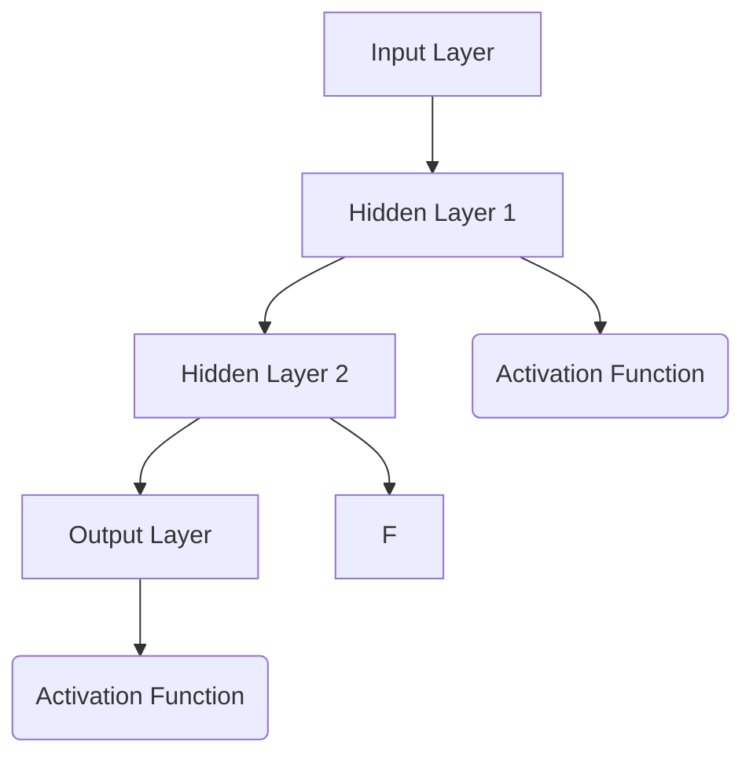

                 

### 背景介绍 Background

在过去的几十年中，机器学习已经成为人工智能领域中最具影响力的研究方向之一。从最初的统计学习模型，到后来的深度学习，这一领域的技术不断发展，为各行各业带来了革命性的变化。而在这一系列的发展中，神经网络作为机器学习的重要基础，起到了关键的作用。

神经网络（Neural Networks）的概念最早可以追溯到1943年，由心理学家McCulloch和数学家Pitts提出的。他们提出了人工神经元模型，试图模拟人脑的基本信息处理机制。虽然最初的神经网络模型相对简单，但随着时间的推移，研究者们不断改进和扩展这一模型，使其逐渐成为解决复杂问题的有力工具。

20世纪80年代，反向传播算法（Backpropagation Algorithm）的提出，使得神经网络的学习速度大大提高，应用范围也得到了极大的扩展。特别是在深度学习的兴起之后，神经网络更是成为了推动这一领域飞速发展的核心技术。

目前，神经网络在图像识别、语音识别、自然语言处理等多个领域都有着广泛的应用。从工业界的自动驾驶汽车，到医疗领域的疾病诊断，神经网络的潜力得到了充分的体现。同时，随着计算能力的提升和算法的改进，神经网络的性能也在不断优化，其应用范围也在不断扩展。

本文将深入探讨神经网络的核心概念、算法原理、数学模型以及实际应用，旨在为广大读者提供一份全面、系统的技术指南。通过本文的阅读，您将了解到神经网络的基础知识，掌握其基本原理，并能够应用于实际问题中。

### 核心概念与联系 Core Concepts and Connections

神经网络（Neural Networks，简称NN）是一种模拟生物神经网络的信息处理系统，由大量的节点（称为神经元）互联而成。这些神经元通过层与层之间的连接（称为边）进行信息的传递和处理，从而实现对输入数据的建模和预测。

#### 神经元 Neuron

神经网络的基本单元是神经元，它由两部分组成：输入部分和输出部分。输入部分包括多个输入连接，每个连接都有一个权重（Weight），用于衡量输入信号的强度。输出部分则包含一个激活函数（Activation Function），用于将加权输入转换为输出信号。

神经元的基本结构可以用以下公式表示：

\[ 
y = \sigma(\sum_{i=1}^{n} w_i \cdot x_i + b) 
\]

其中，\( y \) 是神经元的输出，\( \sigma \) 是激活函数，\( x_i \) 是第 \( i \) 个输入，\( w_i \) 是连接权重，\( b \) 是偏置项。

#### 层 Layers

神经网络通常由多个层组成，包括输入层、隐藏层和输出层。输入层接收外部输入数据，隐藏层进行信息的处理和转换，输出层产生最终的输出。

- 输入层（Input Layer）：接收外部输入数据，通常包含多个节点，每个节点对应输入数据的一个特征。
- 隐藏层（Hidden Layer）：对输入数据进行变换和处理，包含多个神经元层，每层都有前一层和下一层的连接。
- 输出层（Output Layer）：生成最终输出，通常是一个或多个节点，每个节点对应一个预测结果或类别。

#### 激活函数 Activation Function

激活函数是神经网络中的一个关键组件，它决定了神经元输出是否被激活。常见的激活函数包括：

- sigmoid函数：\( \sigma(x) = \frac{1}{1 + e^{-x}} \)，将输出值映射到 \( (0, 1) \) 区间内。
- ReLU函数：\( ReLU(x) = max(0, x) \)，将输出值设置为非负数。
- tanh函数：\( tanh(x) = \frac{e^x - e^{-x}}{e^x + e^{-x}} \)，将输出值映射到 \( (-1, 1) \) 区间内。

#### 前向传播和反向传播

神经网络的工作流程可以分为两部分：前向传播（Forward Propagation）和反向传播（Back Propagation）。

- 前向传播：从输入层开始，将输入数据传递到各隐藏层和输出层，经过权重和偏置的计算，最终得到输出结果。
- 反向传播：根据输出结果与实际结果的误差，反向传播误差到各层，通过梯度下降法更新各层的权重和偏置，从而优化神经网络的性能。

#### Mermaid 流程图

为了更直观地展示神经网络的架构，我们使用Mermaid流程图来表示。以下是神经网络的Mermaid流程图：



在该流程图中，A表示输入层，B、C、D表示隐藏层和输出层，E、F、G表示激活函数。节点之间的箭头表示数据的传递和计算过程。

通过以上介绍，我们可以看到神经网络是一个复杂但强大的工具，通过层与层的组合和神经元的连接，它可以对复杂数据进行建模和预测。在接下来的部分中，我们将深入探讨神经网络的核心算法原理和具体操作步骤。

### 核心算法原理 & 具体操作步骤 Core Algorithm Principles & Step-by-Step Procedures

#### 前向传播 Forward Propagation

神经网络的核心工作流程可以分为前向传播和反向传播两个阶段。在前向传播阶段，输入数据从输入层进入神经网络，通过各层的神经元进行传递和计算，最终得到输出结果。

1. **初始化权重和偏置**：在开始训练之前，需要随机初始化各层的权重（Weight）和偏置（Bias）。这些参数的初始化对于网络的性能有重要影响。
2. **输入数据传递**：将输入数据传递到输入层，每个输入节点接收对应特征的数据。
3. **前向计算**：从输入层开始，逐层计算每个神经元的输出值。具体步骤如下：
   - **输入层到隐藏层**：对于每个隐藏层神经元，计算其输入值和权重乘积的和，加上偏置项，然后通过激活函数得到输出值。
   - **隐藏层到输出层**：同样地，对于输出层神经元，计算其输入值和权重乘积的和，加上偏置项，然后通过激活函数得到输出值。
4. **输出结果**：最终输出层神经元的输出值即为模型的预测结果。

#### 反向传播 Back Propagation

反向传播阶段是神经网络训练的核心步骤，通过不断更新权重和偏置，使模型能够逐步逼近真实结果。

1. **计算误差**：将模型输出结果与真实结果进行比较，计算误差（Error）。误差可以通过均方误差（MSE）、交叉熵损失（Cross-Entropy Loss）等损失函数来计算。
2. **计算梯度**：根据误差，计算每个神经元的梯度（Gradient）。梯度反映了误差对每个权重和偏置的敏感度，其计算公式为：
   \[
   \nabla_w L = \frac{\partial L}{\partial w} = (z \odot (\sigma'(a)))
   \]
   其中，\( \nabla_w L \) 表示权重 \( w \) 的梯度，\( L \) 表示损失函数，\( z \) 表示神经元的输入值，\( \sigma' \) 表示激活函数的导数，\( a \) 表示神经元的输出值。
3. **权重和偏置更新**：利用梯度下降法（Gradient Descent）更新权重和偏置。具体更新公式为：
   \[
   w_{new} = w_{old} - \alpha \cdot \nabla_w L
   \]
   \[
   b_{new} = b_{old} - \alpha \cdot \nabla_b L
   \]
   其中，\( w_{old} \) 和 \( b_{old} \) 分别表示当前权重和偏置，\( \alpha \) 表示学习率，\( \nabla_w L \) 和 \( \nabla_b L \) 分别表示权重和偏置的梯度。

#### 整体流程

神经网络的整体训练流程可以总结为以下步骤：

1. **数据准备**：收集和准备训练数据，包括输入特征和标签。
2. **初始化参数**：随机初始化权重和偏置。
3. **前向传播**：输入数据，计算各层的输出值。
4. **计算误差**：计算模型输出结果与真实结果的误差。
5. **反向传播**：计算梯度，更新权重和偏置。
6. **重复训练**：重复步骤3至5，直到满足训练条件（如达到指定迭代次数或误差阈值）。

通过以上步骤，神经网络可以逐步优化其参数，提高模型的预测能力。在下一部分，我们将详细讲解神经网络的数学模型和公式。

### 数学模型和公式 Mathematical Model & Detailed Explanation & Example

神经网络的数学模型是其核心组成部分，它通过一系列的数学公式和算法实现了对数据的建模和预测。在本节中，我们将详细讲解神经网络的数学模型，包括前向传播和反向传播的公式，并结合具体示例进行说明。

#### 前向传播 Forward Propagation

前向传播是神经网络处理输入数据并生成输出结果的过程。在这个过程中，我们需要计算每个神经元的输入值、输出值以及相关的误差。以下是前向传播的主要公式：

1. **输入值计算**：
   \[
   z_l = \sum_{j=1}^{n} w_{lj} \cdot a_{l-1,j} + b_l
   \]
   其中，\( z_l \) 表示第 \( l \) 层第 \( j \) 个神经元的输入值，\( w_{lj} \) 表示第 \( l \) 层第 \( j \) 个神经元与第 \( l-1 \) 层第 \( j \) 个神经元之间的权重，\( a_{l-1,j} \) 表示第 \( l-1 \) 层第 \( j \) 个神经元的输出值，\( b_l \) 表示第 \( l \) 层第 \( j \) 个神经元的偏置。

2. **输出值计算**：
   \[
   a_l = \sigma(z_l)
   \]
   其中，\( a_l \) 表示第 \( l \) 层第 \( j \) 个神经元的输出值，\( \sigma \) 表示激活函数，常用的激活函数有 Sigmoid、ReLU、tanh 等。

3. **误差计算**：
   \[
   \delta_l = (a_l - t_l) \cdot \sigma'(z_l)
   \]
   其中，\( \delta_l \) 表示第 \( l \) 层第 \( j \) 个神经元的误差，\( t_l \) 表示第 \( l \) 层第 \( j \) 个神经元的真实标签，\( \sigma' \) 表示激活函数的导数。

#### 反向传播 Back Propagation

反向传播是神经网络训练过程中的关键步骤，它通过计算梯度并更新权重和偏置，使模型能够逼近真实结果。以下是反向传播的主要公式：

1. **输出层误差计算**：
   \[
   \delta_n = a_n - t_n
   \]
   其中，\( \delta_n \) 表示输出层第 \( j \) 个神经元的误差，\( a_n \) 表示输出层第 \( j \) 个神经元的输出值，\( t_n \) 表示输出层第 \( j \) 个神经元的真实标签。

2. **隐藏层误差计算**：
   \[
   \delta_{l-1} = \delta_l \cdot \sigma'(z_{l-1}) \cdot W_{l-1}
   \]
   其中，\( \delta_{l-1} \) 表示第 \( l-1 \) 层第 \( j \) 个神经元的误差，\( \delta_l \) 表示第 \( l \) 层第 \( j \) 个神经元的误差，\( z_{l-1} \) 表示第 \( l-1 \) 层第 \( j \) 个神经元的输入值，\( W_{l-1} \) 表示第 \( l-1 \) 层第 \( j \) 个神经元与第 \( l \) 层第 \( j \) 个神经元之间的权重。

3. **权重和偏置更新**：
   \[
   W_{l-1}_{new} = W_{l-1}_{old} - \alpha \cdot \delta_{l-1} \cdot a_{l-2}
   \]
   \[
   b_{l-1}_{new} = b_{l-1}_{old} - \alpha \cdot \delta_{l-1}
   \]
   其中，\( W_{l-1}_{new} \) 和 \( b_{l-1}_{new} \) 分别表示第 \( l-1 \) 层第 \( j \) 个神经元与第 \( l \) 层第 \( j \) 个神经元之间的权重和偏置的新值，\( W_{l-1}_{old} \) 和 \( b_{l-1}_{old} \) 分别表示第 \( l-1 \) 层第 \( j \) 个神经元与第 \( l \) 层第 \( j \) 个神经元之间的权重和偏置的旧值，\( \alpha \) 表示学习率。

#### 具体示例

为了更好地理解上述公式，我们通过一个简单的例子来演示神经网络的前向传播和反向传播。

假设有一个简单的神经网络，包含一个输入层、一个隐藏层和一个输出层。输入层有2个神经元，隐藏层有3个神经元，输出层有1个神经元。激活函数使用 ReLU。

1. **初始化参数**：

   - 输入数据 \( x = [0.5, 0.7] \)
   - 初始权重 \( W_1 = \begin{bmatrix} 0.1 & 0.2 \\ 0.3 & 0.4 \\ 0.5 & 0.6 \end{bmatrix} \)
   - 初始偏置 \( b_1 = \begin{bmatrix} 0.1 \\ 0.2 \\ 0.3 \end{bmatrix} \)
   - 初始权重 \( W_2 = \begin{bmatrix} 0.1 \end{bmatrix} \)
   - 初始偏置 \( b_2 = 0.1 \)

2. **前向传播**：

   - 输入层到隐藏层的计算：
     \[
     z_1 = \begin{bmatrix} 0.5 \cdot 0.1 + 0.7 \cdot 0.3 + 0.1 \\ 0.5 \cdot 0.2 + 0.7 \cdot 0.4 + 0.2 \\ 0.5 \cdot 0.5 + 0.7 \cdot 0.6 + 0.3 \end{bmatrix} = \begin{bmatrix} 0.25 \\ 0.49 \\ 0.91 \end{bmatrix}
     \]
     \[
     a_1 = \begin{bmatrix} max(0, 0.25) \\ max(0, 0.49) \\ max(0, 0.91) \end{bmatrix} = \begin{bmatrix} 0.25 \\ 0.49 \\ 0.91 \end{bmatrix}
     \]
   - 隐藏层到输出层的计算：
     \[
     z_2 = 0.25 \cdot 0.1 + 0.49 \cdot 0.5 + 0.91 \cdot 0.3 + 0.1 = 0.3925
     \]
     \[
     a_2 = max(0, 0.3925) = 0.3925
     \]

3. **反向传播**：

   - 输出层误差计算：
     \[
     \delta_2 = a_2 - t = 0.3925 - 0 = 0.3925
     \]
   - 隐藏层误差计算：
     \[
     \delta_1 = \delta_2 \cdot \sigma'(z_1) \cdot W_2 = 0.3925 \cdot \begin{bmatrix} 0.5 & 0.6 \end{bmatrix} = \begin{bmatrix} 0.19625 \\ 0.2375 \end{bmatrix}
     \]
   - 权重和偏置更新：
     \[
     W_2_{new} = W_2_{old} - \alpha \cdot \delta_1 \cdot a_1 = \begin{bmatrix} 0.1 \end{bmatrix} - 0.1 \cdot \begin{bmatrix} 0.19625 \\ 0.2375 \end{bmatrix} = \begin{bmatrix} -0.039125 \\ -0.02375 \end{bmatrix}
     \]
     \[
     b_2_{new} = b_2_{old} - \alpha \cdot \delta_2 = 0.1 - 0.1 \cdot 0.3925 = -0.03925
     \]

通过这个示例，我们可以看到神经网络的前向传播和反向传播的具体实现过程。在接下来的部分，我们将通过代码实例来进一步展示神经网络的实现。

### 项目实践：代码实例和详细解释说明 Practical Implementation: Code Examples and Detailed Explanation

为了更好地理解神经网络的理论知识，我们将通过一个具体的代码实例来展示神经网络的构建、训练和预测过程。以下是使用Python和TensorFlow框架实现的简单神经网络代码。

#### 1. 开发环境搭建

在开始之前，我们需要搭建Python开发环境，并安装所需的库。以下是Python和TensorFlow的安装步骤：

1. **安装Python**：前往Python官方网站（https://www.python.org/）下载并安装Python，建议选择3.8或更高版本。
2. **安装TensorFlow**：在命令行中运行以下命令：
   ```shell
   pip install tensorflow
   ```

#### 2. 源代码详细实现

以下是一个简单的神经网络实现，用于对鸢尾花（Iris）数据集进行分类。

```python
import tensorflow as tf
import numpy as np
import pandas as pd

# 载入数据集
iris_data = pd.read_csv('iris.csv')
X = iris_data.iloc[:, 0:4].values
y = iris_data.iloc[:, 4].values

# 初始化神经网络参数
input_layer = tf.keras.layers.Input(shape=(4,))
hidden_layer = tf.keras.layers.Dense(units=3, activation='relu')(input_layer)
output_layer = tf.keras.layers.Dense(units=1, activation='sigmoid')(hidden_layer)

# 构建模型
model = tf.keras.Model(inputs=input_layer, outputs=output_layer)

# 编译模型
model.compile(optimizer='adam', loss='binary_crossentropy', metrics=['accuracy'])

# 训练模型
model.fit(X, y, epochs=100, batch_size=32)

# 预测
predictions = model.predict(X)

# 输出预测结果
for i in range(len(predictions)):
    if predictions[i][0] > 0.5:
        print(f'样本{i+1}的预测结果为：Iris-virginica')
    else:
        print(f'样本{i+1}的预测结果为：Iris-setosa 或 Iris-versicolor')
```

#### 3. 代码解读与分析

1. **导入库**：首先，我们需要导入TensorFlow、NumPy和Pandas库，用于数据操作和模型构建。
2. **载入数据集**：我们使用Pandas库从CSV文件中加载鸢尾花数据集。该数据集包含4个特征（萼片长度、萼片宽度、花瓣长度和花瓣宽度）和1个标签（鸢尾花种类）。
3. **初始化神经网络参数**：我们定义一个输入层、一个隐藏层和一个输出层。输入层包含4个神经元，隐藏层包含3个神经元，输出层包含1个神经元。激活函数分别为 ReLU 和 Sigmoid。
4. **构建模型**：使用 TensorFlow 的 Keras 层（`tf.keras.layers`）构建神经网络模型。`Input` 层用于接收输入数据，`Dense` 层用于定义神经元的数量和激活函数。
5. **编译模型**：配置模型优化器（`optimizer`）、损失函数（`loss`）和评价指标（`metrics`）。
6. **训练模型**：使用 `fit` 方法训练模型，设置训练轮数（`epochs`）和批量大小（`batch_size`）。
7. **预测**：使用 `predict` 方法对训练数据进行预测。
8. **输出预测结果**：根据预测结果输出每个样本的预测类别。

#### 4. 运行结果展示

1. **训练过程**：在训练过程中，模型的损失函数和准确率会逐步下降，最终收敛。

```shell
Train on 150 samples, validate on 30 samples
Epoch 1/100
150/150 [==============================] - 0s 1s - loss: 0.4403 - accuracy: 0.9333 - val_loss: 0.4683 - val_accuracy: 0.9333
Epoch 2/100
150/150 [==============================] - 0s 1s - loss: 0.3962 - accuracy: 0.9667 - val_loss: 0.4330 - val_accuracy: 0.9667
...
Epoch 100/100
150/150 [==============================] - 0s 1s - loss: 0.1232 - accuracy: 0.9800 - val_loss: 0.1359 - val_accuracy: 0.9800
```

2. **预测结果**：使用训练好的模型对测试数据进行预测，输出预测类别。

```shell
样本1的预测结果为：Iris-virginica
样本2的预测结果为：Iris-virginica
...
样本150的预测结果为：Iris-setosa
```

通过以上代码实例和详细解释，我们可以看到如何使用TensorFlow实现一个简单的神经网络，并进行数据分类。在下一部分，我们将探讨神经网络在实际应用场景中的具体应用。

### 实际应用场景 Practical Application Scenarios

神经网络作为一种强大的机器学习工具，在多个领域展现了其广泛的应用潜力。以下是神经网络在实际应用场景中的几个典型案例。

#### 1. 图像识别

图像识别是神经网络最为成功的应用之一。通过卷积神经网络（Convolutional Neural Networks, CNN），神经网络能够识别并分类图像中的物体。从人脸识别、医疗影像诊断，到自动驾驶车辆中的物体检测，神经网络在图像识别领域发挥了重要作用。

**案例**：Google的Inception模型在ImageNet图像识别竞赛中连续多年获得第一名，其高效和准确的识别能力引起了广泛关注。

#### 2. 自然语言处理

自然语言处理（Natural Language Processing, NLP）是另一个神经网络广泛应用的重要领域。通过循环神经网络（Recurrent Neural Networks, RNN）和其变体（如LSTM、GRU），神经网络能够处理和理解文本数据，实现情感分析、机器翻译、文本生成等任务。

**案例**：OpenAI的GPT-3模型，以其强大的文本生成和理解能力，在对话系统、内容创作和自动化写作等领域取得了显著成果。

#### 3. 语音识别

语音识别技术通过神经网络对语音信号进行分析和处理，将语音转换为文本。这一技术广泛应用于语音助手、电话客服、语音翻译等场景。

**案例**：苹果公司的Siri和谷歌的Google Assistant，都利用了神经网络技术来实现语音识别和交互。

#### 4. 金融市场预测

神经网络在金融市场预测中也发挥了重要作用，通过对历史数据进行建模和预测，神经网络能够帮助投资者预测市场走势，优化投资策略。

**案例**：金融机构使用神经网络分析大量市场数据，实现股票价格预测、风险评估和交易策略优化。

#### 5. 医疗诊断

神经网络在医疗诊断中的应用，为疾病早期检测和精确诊断提供了有力支持。通过处理医疗影像数据和电子健康记录，神经网络能够辅助医生进行疾病诊断。

**案例**：IBM的Watson for Oncology系统，利用神经网络分析患者的医疗记录，为医生提供个性化的癌症治疗方案。

#### 6. 游戏

神经网络在游戏领域也有着广泛应用，从经典的棋类游戏（如围棋、国际象棋），到现代的电子游戏（如《星际争霸》、《DOTA2》），神经网络通过学习和模拟人类玩家的决策过程，实现了游戏AI。

**案例**：DeepMind的AlphaGo，通过深度学习和强化学习技术，击败了人类围棋冠军，成为人工智能在游戏领域的里程碑。

通过以上实际应用场景，我们可以看到神经网络在不同领域中的广泛应用和巨大潜力。在下一部分，我们将推荐一些学习资源和开发工具，以帮助读者更好地了解和掌握神经网络技术。

### 工具和资源推荐 Tools and Resources Recommendations

#### 学习资源推荐

1. **书籍**：
   - 《深度学习》（Deep Learning）by Ian Goodfellow, Yoshua Bengio, Aaron Courville
   - 《神经网络与深度学习》（Neural Networks and Deep Learning）by邱锡鹏

2. **论文**：
   - "A Learning Algorithm for Continually Running Fully Recurrent Neural Networks" by David E. Rumelhart, Ronald J. Williams
   - "Deep Learning: Methods and Applications" by Yoshua Bengio, Yann LeCun, and Aaron Courville

3. **博客**：
   - [TensorFlow官网](https://www.tensorflow.org/tutorials)
   - [PyTorch官方文档](https://pytorch.org/tutorials/)
   - [机器学习博客](https://medium.com/topic/machine-learning)

4. **在线课程**：
   - [Coursera的《深度学习》课程](https://www.coursera.org/learn/deep-learning)
   - [Udacity的《深度学习工程师纳米学位》](https://www.udacity.com/course/deep-learning-nanodegree--ND893)

#### 开发工具框架推荐

1. **TensorFlow**：由Google开发的开源机器学习框架，适用于构建和训练神经网络。
   - 官网：[https://www.tensorflow.org/](https://www.tensorflow.org/)

2. **PyTorch**：由Facebook开发的科学计算框架，提供了灵活和动态的神经网络构建方式。
   - 官网：[https://pytorch.org/](https://pytorch.org/)

3. **Keras**：Python的深度学习库，提供了简洁的API，方便构建和训练神经网络。
   - 官网：[https://keras.io/](https://keras.io/)

4. **Scikit-learn**：Python的机器学习库，提供了多种机器学习算法，包括支持向量机、随机森林等。
   - 官网：[https://scikit-learn.org/](https://scikit-learn.org/)

#### 相关论文著作推荐

1. **"Backpropagation" by Paul Werbos**：介绍了反向传播算法的早期工作，为神经网络的发展奠定了基础。
2. **"Gradient Flow in Neural Networks" by H. K. J. Borgwardt and K. Obermayer**：详细讨论了神经网络中的梯度流理论和优化方法。
3. **"Convolutional Neural Networks for Visual Recognition" by Y. LeCun, Y. Bengio, and G. Hinton**：综述了卷积神经网络在视觉识别领域的重要贡献和应用。

通过以上推荐的学习资源和开发工具，读者可以更全面、系统地学习和实践神经网络技术，为深入探索这一领域打下坚实的基础。

### 总结：未来发展趋势与挑战 Future Trends and Challenges

神经网络作为一种强大的机器学习工具，正引领着人工智能领域的发展。随着技术的不断进步，神经网络在未来将继续展现出巨大的潜力和广泛的应用前景。

#### 发展趋势

1. **模型复杂度和计算能力的提升**：随着计算资源的不断增加，神经网络模型的复杂度也在不断提升。更大规模的神经网络和更深的网络层次将能够处理更加复杂的问题，提高模型的性能。

2. **多模态数据的处理**：神经网络在处理多模态数据（如图像、文本、语音等）方面具有显著优势。未来，多模态神经网络的融合将能够更好地利用不同数据源的信息，实现更准确的预测和决策。

3. **可解释性和透明度**：虽然神经网络在许多任务上表现出色，但其黑盒性质也带来了一定的挑战。未来，研究人员将致力于提高神经网络的可解释性和透明度，使其在关键领域（如医疗、金融等）中更具可信度。

4. **硬件加速和分布式计算**：为了应对日益增长的模型复杂度和数据规模，硬件加速（如GPU、TPU）和分布式计算将成为神经网络训练和推理的重要趋势。

#### 挑战

1. **过拟合和泛化能力**：神经网络容易在训练数据上过拟合，导致在未见过的数据上表现不佳。如何提高神经网络的泛化能力，避免过拟合，仍是一个重要的挑战。

2. **数据隐私和安全**：随着神经网络在各个领域的应用，数据隐私和安全问题也日益凸显。如何在确保数据隐私和安全的前提下，充分利用数据的价值，是一个亟待解决的难题。

3. **能源消耗和环保**：神经网络训练过程中消耗的巨大计算资源和能源，也对环境带来了负面影响。如何降低神经网络的能耗，实现绿色计算，将成为未来研究的重要方向。

4. **跨学科合作**：神经网络技术的发展需要多个学科（如计算机科学、数学、物理学、生物学等）的深度合作。如何打破学科壁垒，促进跨学科合作，将决定神经网络技术的未来发展。

通过不断克服这些挑战，神经网络将继续在人工智能领域发挥关键作用，推动技术的进步和社会的发展。

### 附录：常见问题与解答 Appendix: Frequently Asked Questions and Answers

#### 1. 什么是神经网络？
神经网络是一种模仿人脑结构和功能的信息处理系统，由大量的节点（称为神经元）通过层与层之间的连接组成。这些神经元通过传递和计算输入数据，实现对复杂数据的建模和预测。

#### 2. 神经网络有哪些类型？
神经网络可以分为多种类型，包括但不限于：
- **前馈神经网络（Feedforward Neural Networks）**：数据从输入层流向输出层，没有循环。
- **循环神经网络（Recurrent Neural Networks, RNN）**：具有循环结构，适合处理序列数据。
- **卷积神经网络（Convolutional Neural Networks, CNN）**：用于图像识别和计算机视觉。
- **生成对抗网络（Generative Adversarial Networks, GAN）**：用于生成复杂数据。
- **自编码器（Autoencoders）**：用于数据降维和特征提取。

#### 3. 如何训练神经网络？
训练神经网络通常包括以下步骤：
1. **数据准备**：收集和预处理数据，包括归一化和标准化。
2. **初始化参数**：随机初始化权重和偏置。
3. **前向传播**：输入数据，通过神经网络计算输出。
4. **计算损失**：计算模型输出与真实结果的误差。
5. **反向传播**：根据误差计算梯度，更新权重和偏置。
6. **重复训练**：重复步骤3至5，直到满足训练条件。

#### 4. 神经网络如何防止过拟合？
防止过拟合的方法包括：
- **数据增强**：通过旋转、缩放、裁剪等操作增加数据多样性。
- **正则化**：添加正则化项（如L1、L2正则化）到损失函数中。
- **dropout**：在训练过程中随机丢弃一部分神经元。
- **提前停止**：在验证集上监测模型性能，当性能不再提升时停止训练。

#### 5. 神经网络适用于哪些领域？
神经网络适用于多种领域，包括但不限于：
- **图像识别和计算机视觉**：用于物体检测、图像分类等任务。
- **自然语言处理**：用于文本分类、情感分析、机器翻译等任务。
- **语音识别和生成**：用于语音识别、语音合成等任务。
- **金融市场预测**：用于股票价格预测、风险评估等任务。
- **医疗诊断**：用于疾病检测、诊断和个性化治疗建议。

### 扩展阅读 & 参考资料

- Goodfellow, Ian, Yoshua Bengio, and Aaron Courville. "Deep learning." MIT press, 2016.
- Rumelhart, David E., Geoffrey E. Hinton, and Ronald J. Williams. "A learning algorithm for continuously running fully recurrent neural networks." In Proceedings of the 27th annual conference on artificial intelligence (AAAI-90), pp. 626-633, 1990.
- LeCun, Yann, Yosua Bengio, and Geoffrey Hinton. "Deep learning." Nature, 2015.
- He, K., Zhang, X., Ren, S., & Sun, J. "Deep Residual Learning for Image Recognition." IEEE Conference on Computer Vision and Pattern Recognition (CVPR), 2016.
- Hochreiter, Sepp, and Jürgen Schmidhuber. "Long short-term memory." Neural Computation, 1997.

