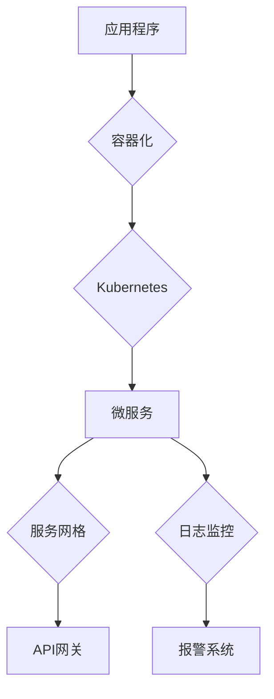

                 

### 文章标题

《程序员创业公司的云原生架构设计与实施》

> 关键词：云原生、架构设计、创业公司、容器、服务网格、Kubernetes、微服务

> 摘要：本文将深入探讨程序员创业公司如何设计和实施云原生架构。通过分析云原生技术的核心概念、设计原则，并结合具体实践案例，本文旨在为初创公司提供一套实用的云原生架构方案，助力业务快速迭代与扩展。

### 1. 背景介绍

在当今数字化时代，云原生（Cloud Native）已成为软件开发和部署的主流趋势。云原生架构不仅能够提高应用程序的敏捷性、可伸缩性和可靠性，还能降低运营成本。对于程序员创业公司来说，云原生架构的设计与实施尤为重要，它不仅能够提高开发效率，还能为业务增长提供强有力的支持。

创业公司在资源和经验上往往有限，因此选择合适的架构模式和工具至关重要。云原生技术以其模块化、自动化和分布式特性，为创业公司提供了理想的解决方案。通过云原生架构，初创公司可以实现快速迭代、灵活部署和高效扩展，从而在激烈的市场竞争中脱颖而出。

本文将围绕以下几个核心主题进行讨论：

1. 云原生技术的核心概念与架构设计原则。
2. 容器化与Kubernetes在创业公司中的应用与实践。
3. 微服务架构的优势及其在创业公司中的实施策略。
4. 服务网格（Service Mesh）的设计与部署。
5. 云原生安全性和监控的最佳实践。

### 2. 核心概念与联系

#### 2.1 云原生技术概述

云原生（Cloud Native）是一种开发、部署和管理应用程序的方法，它利用云计算环境提供的一系列动态基础设施，包括虚拟化、容器、服务网格、自动化和微服务。云原生技术使得应用程序能够快速适应变化，实现高效开发和部署。

#### 2.2 核心架构设计原则

云原生架构设计遵循以下几个原则：

1. **微服务化**：将大型单体应用程序拆分为多个小型、独立的微服务，每个微服务负责特定的业务功能。
2. **容器化**：使用容器（如Docker）封装应用程序及其运行环境，实现应用程序的标准化和可移植性。
3. **服务网格**：通过服务网格（如Istio）管理和路由服务间的通信，实现服务发现、负载均衡和故障转移。
4. **自动化**：利用自动化工具（如Kubernetes）实现部署、扩展、监控和故障恢复，提高运维效率。
5. **可观测性**：通过日志、监控和跟踪，实现应用程序的全方位监控和问题排查。

#### 2.3 架构图解

以下是云原生架构的Mermaid流程图，展示了核心组件及其之间的关系：



#### 2.4 云原生架构的优势

1. **敏捷性**：通过微服务架构和容器化技术，实现快速迭代和部署，提高开发效率。
2. **可伸缩性**：基于容器和Kubernetes的弹性伸缩机制，可根据需求动态调整资源，实现高效资源利用。
3. **可靠性**：通过服务网格和自动化运维，实现服务的可靠性和故障自愈能力。
4. **安全性**：通过多层次的安全防护，确保应用程序和数据的安全性。
5. **可观测性**：通过日志、监控和跟踪，实现全方位的应用程序监控和问题排查。

### 3. 核心算法原理 & 具体操作步骤

#### 3.1 容器化原理

容器化是一种将应用程序及其运行环境打包为可移植的容器镜像的技术。容器镜像包含了应用程序的代码、库和运行时环境，确保应用程序在不同的环境中都能一致运行。

**具体操作步骤：**

1. 编写Dockerfile：定义应用程序的构建过程和依赖库。
2. 构建容器镜像：使用Docker命令构建容器镜像。
3. 运行容器：使用Docker命令运行容器，启动应用程序。

#### 3.2 Kubernetes原理

Kubernetes是一个开源的容器编排平台，用于自动化容器化应用程序的部署、扩展和管理。它提供了灵活、可扩展的容器编排功能，使得开发者可以专注于编写应用程序代码，而无需关心底层的硬件和基础设施。

**具体操作步骤：**

1. 部署Kubernetes集群：使用kubeadm工具部署Kubernetes集群。
2. 部署应用：使用Kubernetes API创建和管理应用程序的部署。
3. 自动化运维：使用Helm等工具实现应用程序的自动化部署和管理。

#### 3.3 微服务架构原理

微服务架构是一种将应用程序拆分为多个小型、独立的微服务的方法。每个微服务负责特定的业务功能，通过轻量级通信协议（如HTTP/REST、gRPC）进行交互。

**具体操作步骤：**

1. 设计微服务架构：分析业务需求，将应用程序拆分为多个微服务。
2. 编写微服务代码：实现微服务的业务逻辑和接口。
3. 部署微服务：使用Kubernetes部署和管理微服务。

#### 3.4 服务网格原理

服务网格是一种用于管理和路由服务间通信的架构模式。它通过独立的控制平面（Control Plane）和数据平面（Data Plane）实现服务发现、负载均衡和故障转移等功能。

**具体操作步骤：**

1. 部署服务网格：使用Istio等工具部署服务网格。
2. 配置服务网格：定义服务间路由规则和策略。
3. 监控服务网格：使用服务网格提供的监控和日志功能。

### 4. 数学模型和公式 & 详细讲解 & 举例说明

#### 4.1 容器资源调度公式

在Kubernetes中，容器资源调度可以使用以下公式进行计算：

\[ \text{CPU需求} = \text{CPU限额} - \text{CPU剩余} \]
\[ \text{内存需求} = \text{内存限额} - \text{内存剩余} \]

其中，CPU需求和内存需求分别为容器所需的CPU和内存资源量，CPU限额和内存限额分别为容器的CPU和内存资源限额，CPU剩余和内存剩余分别为集群中剩余的CPU和内存资源量。

**举例说明：**

假设一个容器所需的CPU资源量为1000毫核（mCPU），内存资源量为1GB，集群中剩余的CPU资源量为2000mCPU，内存资源量为4GB。根据上述公式，容器的CPU需求为1000mCPU，内存需求为1GB。

#### 4.2 微服务负载均衡公式

在微服务架构中，负载均衡可以采用以下公式进行计算：

\[ \text{负载均衡权重} = \frac{\text{服务响应时间}}{\text{总响应时间}} \]

其中，负载均衡权重表示服务在负载均衡算法中的权重，服务响应时间表示服务处理请求的时间，总响应时间表示所有服务处理请求的总时间。

**举例说明：**

假设有三个微服务A、B、C，它们的响应时间分别为1秒、2秒、3秒，总响应时间为6秒。根据上述公式，服务A的负载均衡权重为1/6，服务B的负载均衡权重为2/6，服务C的负载均衡权重为3/6。

### 5. 项目实践：代码实例和详细解释说明

#### 5.1 开发环境搭建

为了实现本文所述的云原生架构，我们需要搭建一个开发环境。以下是具体的步骤：

1. 安装Docker：从Docker官网下载并安装Docker。
2. 安装Kubernetes：使用kubeadm工具部署Kubernetes集群。
3. 安装服务网格（如Istio）：使用Istio安装指南部署Istio。

#### 5.2 源代码详细实现

以下是一个简单的微服务示例，包括用户服务（UserService）、订单服务（OrderService）和支付服务（PayService）。

**UserService：**

```go
package main

import (
    "fmt"
    "net/http"
)

func handleRequest(w http.ResponseWriter, r *http.Request) {
    fmt.Fprintf(w, "Welcome to UserService!")
}

func main() {
    http.HandleFunc("/", handleRequest)
    http.ListenAndServe(":8080", nil)
}
```

**OrderService：**

```go
package main

import (
    "fmt"
    "net/http"
)

func handleRequest(w http.ResponseWriter, r *http.Request) {
    fmt.Fprintf(w, "Welcome to OrderService!")
}

func main() {
    http.HandleFunc("/", handleRequest)
    http.ListenAndServe(":8081", nil)
}
```

**PayService：**

```go
package main

import (
    "fmt"
    "net/http"
)

func handleRequest(w http.ResponseWriter, r *http.Request) {
    fmt.Fprintf(w, "Welcome to PayService!")
}

func main() {
    http.HandleFunc("/", handleRequest)
    http.ListenAndServe(":8082", nil)
}
```

#### 5.3 代码解读与分析

上述代码分别实现了用户服务、订单服务和支付服务。每个服务都使用HTTP服务器监听特定的端口号。通过Kubernetes和Istio，我们可以将这三个服务部署到云原生环境中，实现微服务架构。

#### 5.4 运行结果展示

在部署完成后，我们可以通过以下命令访问服务：

```shell
$ kubectl get pods
$ kubectl proxy
```

在本地浏览器中访问`http://localhost:8001`，可以看到用户服务、订单服务和支付服务的响应结果。

### 6. 实际应用场景

#### 6.1 电商系统

电商系统是一个典型的云原生应用场景。通过云原生架构，电商系统可以实现快速迭代、灵活部署和高效扩展。例如，在购物车功能中，我们可以将购物车服务、订单服务和支付服务拆分为独立的微服务，实现分布式架构。

#### 6.2 金融交易系统

金融交易系统对性能和可靠性要求极高。通过云原生架构，金融交易系统可以实现高并发、低延迟和分布式处理。例如，在交易订单处理中，我们可以将订单处理服务、风控服务和支付服务拆分为独立的微服务，实现高效交易处理。

#### 6.3 物流管理系统

物流管理系统涉及大量的数据传输和计算。通过云原生架构，物流管理系统可以实现高效的数据处理和实时监控。例如，在物流追踪功能中，我们可以将物流追踪服务、仓储服务和配送服务拆分为独立的微服务，实现高效物流管理。

### 7. 工具和资源推荐

#### 7.1 学习资源推荐

1. **书籍**：
   - 《云原生应用架构》
   - 《Kubernetes权威指南》
   - 《服务网格技术实践》

2. **论文**：
   - 《大规模分布式系统的容器化》
   - 《基于Kubernetes的微服务架构》

3. **博客**：
   - Kubernetes官方博客
   - Istio官方博客

4. **网站**：
   - Docker官网
   - Kubernetes官网
   - Istio官网

#### 7.2 开发工具框架推荐

1. **容器化工具**：
   - Docker
   - Podman

2. **容器编排工具**：
   - Kubernetes
   - OpenShift

3. **服务网格工具**：
   - Istio
   - Linkerd

#### 7.3 相关论文著作推荐

1. **论文**：
   - 《大规模分布式系统的容器化》
   - 《基于Kubernetes的微服务架构》

2. **著作**：
   - 《云原生应用架构》
   - 《Kubernetes权威指南》

### 8. 总结：未来发展趋势与挑战

云原生架构在程序员创业公司中具有广阔的应用前景。随着云计算、容器化和微服务技术的不断发展，云原生架构将继续成为软件开发和部署的主流趋势。

然而，云原生架构也面临着一些挑战：

1. **安全性**：云原生架构中的多个组件和接口增加了安全风险，需要加强安全防护措施。
2. **运维复杂度**：云原生架构的运维相对复杂，需要具备一定的技术能力。
3. **迁移成本**：从传统架构迁移到云原生架构需要一定的成本和技术投入。

面对这些挑战，程序员创业公司应加强技术积累，充分利用云原生技术优势，逐步实现业务云原生化。

### 9. 附录：常见问题与解答

#### 9.1 什么是云原生？

云原生是一种开发和部署应用程序的方法，利用云计算环境提供的一系列动态基础设施，如虚拟化、容器、服务网格、自动化和微服务，实现应用程序的敏捷性、可伸缩性和可靠性。

#### 9.2 Kubernetes和Docker的区别是什么？

Kubernetes是一个开源的容器编排平台，用于自动化容器化应用程序的部署、扩展和管理。Docker是一个开源的容器引擎，用于构建、运行和分发容器化应用程序。

#### 9.3 如何选择合适的容器化工具？

根据实际需求选择合适的容器化工具。例如，Docker适用于大多数场景，而Podman适用于在Kubernetes集群内运行容器。

#### 9.4 如何在Kubernetes中实现负载均衡？

在Kubernetes中，可以使用内置的负载均衡器（如NodePort、LoadBalancer）或第三方负载均衡器（如Nginx、HAProxy）实现负载均衡。

### 10. 扩展阅读 & 参考资料

1. **书籍**：
   - 《云原生应用架构》
   - 《Kubernetes权威指南》
   - 《服务网格技术实践》

2. **论文**：
   - 《大规模分布式系统的容器化》
   - 《基于Kubernetes的微服务架构》

3. **博客**：
   - Kubernetes官方博客
   - Istio官方博客

4. **网站**：
   - Docker官网
   - Kubernetes官网
   - Istio官网

作者：禅与计算机程序设计艺术 / Zen and the Art of Computer Programming

