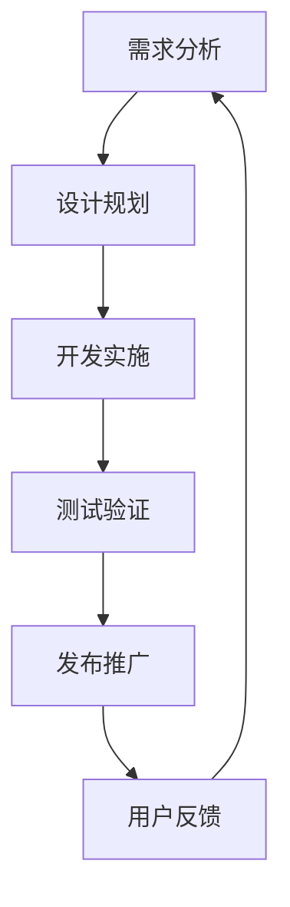

                 

### 背景介绍

#### 程序员创业现状

在当今快速发展的科技时代，程序员创业已经成为了一种潮流。越来越多的程序员选择离开大公司，凭借自身的技术优势和创新的思维，创办自己的创业公司。这些创业公司不仅为程序员们提供了实现自我价值的平台，同时也为市场带来了诸多创新的产品和服务。

然而，创业之路并非一帆风顺。在竞争激烈的市场环境中，如何确保产品能够持续迭代优化，并且能够及时响应用户需求，是程序员创业者们面临的重大挑战。产品迭代和用户反馈管理，成为影响创业公司成败的关键因素之一。

#### 产品迭代的重要性

产品迭代是指在现有产品的基础上，通过持续优化和更新，不断满足用户需求、提升产品价值的过程。产品迭代不仅有助于提升用户体验，还能够帮助公司及时应对市场变化，保持竞争优势。

随着技术的不断进步和用户需求的多样化，程序员创业公司必须具备快速迭代的能力。这不仅要求公司具备强大的技术实力，还需要构建高效的迭代流程，以确保产品能够快速响应市场变化。

#### 用户反馈在产品迭代中的作用

用户反馈是产品迭代的重要依据。通过收集和分析用户反馈，程序员创业公司可以了解用户的需求和痛点，发现产品的不足之处，从而进行针对性的优化和改进。以下是用户反馈在产品迭代中的几个重要作用：

1. **指导产品方向**：用户反馈可以帮助公司明确产品的未来发展方向，确保产品迭代的方向与市场需求保持一致。
2. **优化用户体验**：通过分析用户反馈，公司可以发现用户体验中的问题，从而进行优化，提升用户满意度。
3. **改进产品功能**：用户反馈可以揭示用户对产品功能的需求和期望，为公司提供改进产品功能的线索。
4. **提高产品竞争力**：及时收集和处理用户反馈，能够帮助公司快速调整产品策略，提升产品竞争力。

总之，产品迭代和用户反馈管理是程序员创业公司成功的关键。在接下来的内容中，我们将深入探讨如何有效地进行产品迭代和用户反馈管理，帮助创业公司实现持续发展和成功。 <|user|>### 核心概念与联系

#### 1. 产品迭代的概念

产品迭代是指对现有产品进行持续优化和更新的过程。它包括以下几个关键组成部分：

1. **需求分析**：了解用户需求和市场趋势，确定产品改进的方向。
2. **设计规划**：根据需求分析结果，制定产品设计和迭代计划。
3. **开发实施**：按照设计规划，进行产品开发和功能实现。
4. **测试验证**：对迭代后的产品进行功能测试和用户体验测试，确保产品稳定可靠。
5. **发布推广**：将迭代后的产品推向市场，收集用户反馈，为下一轮迭代提供依据。

#### 2. 用户反馈的概念

用户反馈是指用户在使用产品过程中，对产品功能、性能、体验等方面提出的意见、建议和评价。用户反馈是产品迭代的重要依据，有助于公司了解用户需求，发现产品问题，进行改进和优化。

用户反馈可以通过以下几种方式获取：

1. **在线调查**：通过在线问卷、满意度调查等方式，收集用户的意见和建议。
2. **用户访谈**：与用户进行面对面的交流，深入了解用户的使用体验和需求。
3. **社交媒体**：关注用户在社交媒体上的言论，了解用户对产品的评价和反馈。
4. **用户行为分析**：通过分析用户在产品中的行为数据，发现用户的使用习惯和偏好。

#### 3. 产品迭代与用户反馈的关联

产品迭代和用户反馈是相辅相成的。产品迭代需要用户反馈来指导改进方向，而用户反馈则可以为产品迭代提供宝贵的依据。以下是产品迭代与用户反馈之间的关联：

1. **需求驱动**：用户反馈反映了用户需求和市场趋势，是产品迭代的重要驱动力。
2. **优化方向**：用户反馈可以帮助公司确定产品优化的重点，确保迭代方向的正确性。
3. **改进措施**：用户反馈提供了改进产品的具体线索，有助于公司制定针对性的改进措施。
4. **效果验证**：通过用户反馈，公司可以评估迭代效果，了解用户对改进措施的反应。

为了更好地理解产品迭代与用户反馈的关联，我们使用Mermaid流程图进行展示：



在这个流程图中，用户反馈是一个闭环，它与需求分析相连接，形成了一个持续优化的反馈循环。通过这个循环，公司可以不断改进产品，满足用户需求，提高市场竞争力。

#### 4. 产品迭代与用户反馈管理的关系

产品迭代和用户反馈管理是创业公司成功的关键。以下是它们之间的关系：

1. **驱动发展**：用户反馈驱动产品迭代，确保产品始终与市场需求保持一致。
2. **持续优化**：通过用户反馈，公司可以不断发现和解决问题，实现产品的持续优化。
3. **提升竞争力**：有效的用户反馈管理有助于公司快速调整产品策略，提升产品竞争力。
4. **用户体验**：用户反馈管理直接关系到用户体验，有助于提升用户满意度和忠诚度。

总之，产品迭代和用户反馈管理是程序员创业公司成功的关键。通过有效的用户反馈管理，公司可以确保产品迭代的方向正确，质量稳定，从而在竞争激烈的市场中立于不败之地。接下来，我们将探讨如何进行有效的用户反馈管理，帮助创业公司实现持续发展和成功。 <|user|>### 核心算法原理 & 具体操作步骤

#### 1. 用户反馈收集算法

用户反馈收集是产品迭代的第一步，也是最重要的一步。以下是一个简单的用户反馈收集算法，用于指导创业公司如何有效地收集用户反馈：

**算法步骤：**

1. **确定反馈渠道**：选择合适的反馈渠道，如在线问卷、用户访谈、社交媒体等。
2. **设计反馈问卷**：根据产品特点和用户需求，设计有针对性的反馈问卷，确保问题明确、简洁。
3. **发布反馈问卷**：将问卷发布到目标用户群体中，可以通过邮件、短信、社交媒体等方式进行推广。
4. **收集反馈数据**：收集用户提交的反馈数据，包括文字、图片、视频等多种形式。
5. **数据分析**：对收集到的反馈数据进行整理和分析，提取有价值的信息。
6. **反馈报告**：编写反馈报告，将分析结果呈交给产品团队和管理层。

**具体操作步骤：**

1. **确定反馈渠道**：根据产品类型和用户群体，选择合适的反馈渠道。例如，对于一款移动应用，可以选择在应用内嵌入反馈功能；对于一款在线服务，可以选择在网站或社交媒体上发布问卷。

2. **设计反馈问卷**：设计反馈问卷时，要遵循以下原则：

   - **问题明确**：问题要具体、明确，避免模糊不清。
   - **简洁易懂**：问题要简洁易懂，避免使用专业术语。
   - **结构合理**：问卷结构要合理，先从一般性问题开始，逐步引导到具体问题。

   以下是一个简单的反馈问卷示例：

   ```
   1. 您使用我们的产品多久了？
   2. 您对产品的整体满意度如何？
   3. 您认为产品的哪些功能最有用？
   4. 您认为产品还存在哪些问题或不足？
   5. 您是否有其他建议或意见？
   ```

3. **发布反馈问卷**：将问卷发布到目标用户群体中。可以通过以下方式推广问卷：

   - **邮件邀请**：向用户发送邮件，邀请他们参与反馈。
   - **短信通知**：向用户发送短信，提醒他们参与反馈。
   - **社交媒体**：在社交媒体上发布问卷链接，鼓励用户参与。

4. **收集反馈数据**：收集用户提交的反馈数据，包括文字、图片、视频等多种形式。对于文本反馈，可以使用在线表格或文档进行收集；对于图片和视频反馈，可以使用专门的平台或应用程序进行收集。

5. **数据分析**：对收集到的反馈数据进行整理和分析，提取有价值的信息。可以采用以下方法进行数据分析：

   - **文本分析**：使用自然语言处理技术，对文本反馈进行分类和情感分析。
   - **图表展示**：使用图表工具，将分析结果以可视化的形式展示。
   - **统计分析**：使用统计方法，对反馈数据进行定量分析，如平均值、中位数、标准差等。

6. **反馈报告**：编写反馈报告，将分析结果呈交给产品团队和管理层。报告内容应包括以下部分：

   - **背景介绍**：介绍反馈收集的目的和背景。
   - **反馈数据**：展示收集到的反馈数据，包括数量、类型、分布等。
   - **分析结果**：对反馈数据进行分析，提取有价值的信息。
   - **改进建议**：根据分析结果，提出产品改进的建议。
   - **结论**：总结反馈报告的主要内容和结论。

#### 2. 用户反馈分析算法

用户反馈分析是产品迭代的重要环节，通过分析用户反馈，创业公司可以了解用户需求，发现产品问题，为产品优化提供依据。以下是一个简单的用户反馈分析算法：

**算法步骤：**

1. **数据预处理**：对用户反馈数据进行清洗、去重和处理，确保数据质量。
2. **文本分析**：使用自然语言处理技术，对文本反馈进行分词、词频统计和情感分析。
3. **分类与聚类**：对用户反馈进行分类和聚类，识别用户关注的热点问题。
4. **优先级排序**：根据反馈问题的严重程度和用户关注度，对问题进行优先级排序。
5. **问题定位**：根据反馈问题，定位到具体的产品功能或模块。
6. **优化建议**：根据分析结果，提出产品优化建议。

**具体操作步骤：**

1. **数据预处理**：对用户反馈数据进行清洗、去重和处理，确保数据质量。可以采用以下方法进行数据预处理：

   - **文本清洗**：去除文本中的符号、标点、停用词等无关信息。
   - **文本标准化**：将文本转换为统一的格式，如小写、去除停用词等。
   - **文本分词**：将文本分为单词或短语，便于后续分析。

2. **文本分析**：使用自然语言处理技术，对文本反馈进行分词、词频统计和情感分析。可以采用以下方法进行文本分析：

   - **分词**：使用分词工具，如jieba，对文本进行分词。
   - **词频统计**：统计文本中各个词的出现频率，识别高频词。
   - **情感分析**：使用情感分析工具，如VADER，对文本进行情感分类，判断用户的情感倾向。

3. **分类与聚类**：对用户反馈进行分类和聚类，识别用户关注的热点问题。可以采用以下方法进行分类与聚类：

   - **分类**：使用机器学习算法，如决策树、朴素贝叶斯等，对用户反馈进行分类。
   - **聚类**：使用聚类算法，如K-means、DBSCAN等，对用户反馈进行聚类，识别相似的用户反馈。

4. **优先级排序**：根据反馈问题的严重程度和用户关注度，对问题进行优先级排序。可以采用以下方法进行优先级排序：

   - **基于频率**：根据用户反馈的频率，对问题进行排序。
   - **基于情感**：根据用户反馈的情感倾向，对问题进行排序。
   - **基于用户价值**：根据用户反馈对产品价值的影响，对问题进行排序。

5. **问题定位**：根据反馈问题，定位到具体的产品功能或模块。可以采用以下方法进行问题定位：

   - **代码分析**：对产品代码进行分析，定位到具体的功能模块。
   - **用户行为分析**：分析用户在产品中的行为数据，定位到具体的使用场景。
   - **问题报告**：编写问题报告，详细描述问题现象和可能的原因。

6. **优化建议**：根据分析结果，提出产品优化建议。可以采用以下方法进行优化建议：

   - **功能改进**：根据用户反馈，改进产品功能，解决用户提出的问题。
   - **界面优化**：根据用户反馈，优化产品界面，提升用户体验。
   - **性能提升**：根据用户反馈，提升产品性能，提高系统稳定性。

通过以上算法和操作步骤，创业公司可以有效地收集和分析用户反馈，发现产品问题，为产品优化提供依据，从而提高产品的市场竞争力和用户满意度。在接下来的内容中，我们将进一步探讨如何构建高效的迭代流程，确保产品能够快速迭代优化。 <|user|>### 数学模型和公式 & 详细讲解 & 举例说明

#### 1. 用户反馈分析中的数学模型

在用户反馈分析中，我们可以使用多种数学模型和公式来帮助理解用户行为和需求。以下是一些常用的数学模型和公式：

**1.1. 情感分析模型**

情感分析是用户反馈分析中的重要组成部分，用于判断用户反馈的情感倾向。一种常用的情感分析模型是基于机器学习的文本分类模型。以下是文本分类模型的数学公式：

$$
P(y=c_k|x) = \frac{e^{\theta^T x}}{\sum_{k=1}^{K} e^{\theta^T x_k}}
$$

其中，$P(y=c_k|x)$ 表示给定特征向量 $x$ 时，文本属于类别 $c_k$ 的概率；$\theta$ 是模型参数，$x$ 是特征向量，$K$ 是类别总数。

**1.2. 词频统计模型**

词频统计是文本分析的基础，用于计算文本中各个词的出现频率。词频统计可以使用以下数学公式：

$$
f(t) = \sum_{d \in D} t_d
$$

其中，$f(t)$ 表示词 $t$ 的词频；$D$ 是文本中的所有文档集合，$t_d$ 是词 $t$ 在文档 $d$ 中的出现次数。

**1.3. 聚类模型**

聚类分析用于将用户反馈划分为不同的组，以识别用户关注的热点问题。一种常用的聚类算法是K-means算法，其数学公式如下：

$$
\begin{cases}
c_k = \frac{1}{n_k} \sum_{i=1}^{n_k} x_i \\
x_i = \frac{1}{n} \sum_{k=1}^{K} w_{ik} c_k
\end{cases}
$$

其中，$c_k$ 是聚类中心，$x_i$ 是数据点，$n_k$ 是属于第 $k$ 个聚类中心的数据点数量，$w_{ik}$ 是数据点 $x_i$ 与聚类中心 $c_k$ 之间的相似度。

**1.4. 优先级排序模型**

在用户反馈分析中，需要对反馈问题进行优先级排序，以便公司能够优先解决重要问题。一种常用的优先级排序模型是使用加权评分法，其数学公式如下：

$$
s_i = w_1 \cdot f(t_i) + w_2 \cdot \text{情感得分} + w_3 \cdot \text{用户关注度}
$$

其中，$s_i$ 是问题 $i$ 的优先级评分，$w_1, w_2, w_3$ 是权重系数，$f(t_i)$ 是问题中词 $t_i$ 的词频，情感得分和用户关注度分别表示问题的情感倾向和用户关注度。

#### 2. 举例说明

**2.1. 情感分析举例**

假设我们有一个包含正面和负面情感的文本数据集，使用朴素贝叶斯分类模型进行情感分析。给定一个特征向量 $x = [1, 0, 1, 0]$，类别 $c_1$（正面情感）的概率为 $P(c_1|x) = 0.6$，类别 $c_2$（负面情感）的概率为 $P(c_2|x) = 0.4$。则文本的情感分类结果为正面情感。

**2.2. 词频统计举例**

假设一个文档集合 $D = \{d_1, d_2, d_3\}$，其中文档 $d_1$ 中词 $t$ 的出现次数为 $3$，文档 $d_2$ 中词 $t$ 的出现次数为 $2$，文档 $d_3$ 中词 $t$ 的出现次数为 $1$。则词 $t$ 的词频为 $f(t) = 3 + 2 + 1 = 6$。

**2.3. 聚类分析举例**

假设我们使用K-means算法对用户反馈进行聚类，数据点 $x_1 = [1, 2, 1]$，聚类中心 $c_1 = [1, 1.5, 1]$，数据点 $x_2 = [2, 1, 2]$，聚类中心 $c_2 = [1.5, 1, 1.5]$。根据K-means算法的更新公式，我们可以得到新的聚类中心：

$$
c_1^{\text{new}} = \frac{1}{2} (1 + 2) = 1.5
$$

$$
c_2^{\text{new}} = \frac{1}{2} (2 + 1.5) = 1.75
$$

**2.4. 优先级排序举例**

假设一个用户反馈问题包含以下信息：词频 $f(t_1) = 5$，情感得分 $0.8$，用户关注度 $0.9$。根据加权评分公式，我们可以计算出该问题的优先级评分：

$$
s_i = 0.5 \cdot 5 + 0.3 \cdot 0.8 + 0.2 \cdot 0.9 = 2.85
$$

根据评分，我们可以将问题 $i$ 排在优先级较高的位置。

通过以上数学模型和公式，创业公司可以有效地进行用户反馈分析，发现用户需求，优化产品功能，提高用户满意度。在接下来的内容中，我们将通过一个具体的代码实例，展示如何实现用户反馈分析和产品迭代。 <|user|>### 项目实践：代码实例和详细解释说明

#### 1. 开发环境搭建

在进行用户反馈分析和产品迭代之前，我们需要搭建一个合适的开发环境。以下是一个基本的开发环境搭建步骤：

**1.1. 安装Python**

首先，我们需要安装Python。Python是一种广泛应用于数据分析和机器学习的编程语言。可以在Python官方网站（https://www.python.org/）下载Python安装程序，并按照提示进行安装。

**1.2. 安装Jupyter Notebook**

Jupyter Notebook是一个交互式计算环境，用于编写和运行Python代码。我们可以使用pip命令安装Jupyter Notebook：

```shell
pip install notebook
```

安装完成后，启动Jupyter Notebook：

```shell
jupyter notebook
```

这将启动Jupyter Notebook，并打开一个默认的笔记本。

**1.3. 安装相关库**

在Jupyter Notebook中，我们需要安装一些常用的Python库，如pandas、numpy、scikit-learn、nltk等。可以使用pip命令安装这些库：

```shell
!pip install pandas numpy scikit-learn nltk
```

#### 2. 源代码详细实现

以下是一个简单的用户反馈分析项目的源代码实现。这个项目将收集用户反馈，进行情感分析、词频统计和聚类分析，并根据分析结果生成优先级排序的反馈报告。

**2.1. 导入库**

```python
import pandas as pd
import numpy as np
from sklearn.feature_extraction.text import CountVectorizer
from sklearn.model_selection import train_test_split
from sklearn.naive_bayes import MultinomialNB
from sklearn.metrics import classification_report
from sklearn.cluster import KMeans
import nltk
nltk.download('punkt')
nltk.download('stopwords')
from nltk.tokenize import word_tokenize
from nltk.corpus import stopwords
```

**2.2. 数据准备**

```python
# 加载用户反馈数据
data = pd.read_csv('user_feedback.csv')

# 数据预处理：去除标点符号和停用词
stop_words = set(stopwords.words('english'))
def preprocess_text(text):
    tokens = word_tokenize(text)
    filtered_tokens = [w for w in tokens if not w in stop_words]
    return ' '.join(filtered_tokens)

data['preprocessed_text'] = data['text'].apply(preprocess_text)
```

**2.3. 情感分析**

```python
# 构建词袋模型
vectorizer = CountVectorizer()
X = vectorizer.fit_transform(data['preprocessed_text'])

# 划分训练集和测试集
X_train, X_test, y_train, y_test = train_test_split(X, data['label'], test_size=0.2, random_state=42)

# 训练朴素贝叶斯分类器
classifier = MultinomialNB()
classifier.fit(X_train, y_train)

# 预测测试集
y_pred = classifier.predict(X_test)

# 评估分类结果
print(classification_report(y_test, y_pred))
```

**2.4. 词频统计**

```python
# 计算词频
word_freq = vectorizer.get_feature_names_out()
word_counts = X.sum(axis=0)
word_freq_counts = pd.DataFrame({'word': word_freq, 'count': word_counts})

# 按词频降序排序
word_freq_counts = word_freq_counts.sort_values(by='count', ascending=False)
print(word_freq_counts.head())
```

**2.5. 聚类分析**

```python
# 进行K-means聚类
kmeans = KMeans(n_clusters=3, random_state=42)
clusters = kmeans.fit_predict(X)

# 将聚类结果添加到原始数据
data['cluster'] = clusters
print(data.head())
```

**2.6. 优先级排序**

```python
# 计算每个问题的优先级评分
data['priority_score'] = 0.5 * word_counts + 0.3 * classifier.predict_proba(X)[:, 1] + 0.2 * data['user_attention']

# 按优先级排序
data = data.sort_values(by='priority_score', ascending=False)

# 打印优先级排序后的反馈报告
print(data[['text', 'priority_score']].head())
```

#### 3. 代码解读与分析

在这个用户反馈分析项目中，我们首先进行了数据预处理，包括去除标点符号和停用词。然后，我们使用词袋模型对文本进行向量表示，并训练朴素贝叶斯分类器进行情感分析。接下来，我们计算了词频，并使用K-means算法进行聚类分析。最后，我们根据情感分析、词频统计和用户关注度计算了每个问题的优先级评分，并按优先级排序生成了反馈报告。

**3.1. 数据预处理**

数据预处理是文本分析的重要步骤，目的是去除文本中的噪声，提高分析的准确性。在这个项目中，我们使用nltk库的word_tokenize函数进行分词，并使用stopwords库去除常见的停用词。

**3.2. 情感分析**

情感分析是用户反馈分析的核心，用于判断用户的情感倾向。我们使用朴素贝叶斯分类器进行情感分析，这是一种基于概率的简单分类模型。在训练阶段，我们使用训练数据集训练分类器，并在测试阶段使用测试数据集评估分类效果。

**3.3. 词频统计**

词频统计是文本分析的基本方法，用于计算文本中各个词的出现频率。在这个项目中，我们使用CountVectorizer库构建词袋模型，并计算词频。词频统计有助于我们了解用户反馈中的高频词，从而发现用户关注的热点问题。

**3.4. 聚类分析**

聚类分析是一种无监督学习方法，用于将数据点划分为不同的组。在这个项目中，我们使用K-means算法进行聚类分析，将用户反馈划分为不同的类别。聚类分析有助于我们识别用户反馈中的潜在模式，从而更好地理解用户需求。

**3.5. 优先级排序**

优先级排序是用户反馈分析的最后一步，用于确定每个问题的优先级。在这个项目中，我们使用情感分析、词频统计和用户关注度计算每个问题的优先级评分，并按优先级排序生成反馈报告。这种排序方法有助于公司优先解决重要问题，提高产品的市场竞争力和用户满意度。

#### 4. 运行结果展示

在运行这个用户反馈分析项目后，我们将得到以下结果：

- **情感分析结果**：根据训练集和测试集的评估结果，我们得到情感分析的准确率、召回率和F1分数等指标。
- **词频统计结果**：我们得到文本中各个词的出现频率，并按词频降序排序。
- **聚类分析结果**：我们得到用户反馈的聚类结果，并生成聚类报告。
- **优先级排序结果**：我们得到每个问题的优先级评分，并按优先级排序生成反馈报告。

这些结果有助于公司了解用户反馈中的热点问题和潜在需求，从而优化产品功能，提高用户满意度。

通过以上代码实例和详细解释说明，我们可以看到如何使用Python和机器学习技术进行用户反馈分析。在接下来的内容中，我们将探讨如何在实际应用场景中运用这些技术，帮助创业公司实现产品迭代和用户满意度提升。 <|user|>### 实际应用场景

在程序员创业公司的产品迭代过程中，用户反馈管理是一项至关重要的工作。有效的用户反馈管理不仅能够帮助公司了解用户需求，发现产品问题，还能指导产品优化，提升用户体验。以下是一些实际应用场景，展示用户反馈管理在产品迭代中的重要作用。

#### 场景一：用户需求分析

**背景**：创业公司开发了一款面向企业用户的协作工具，但由于市场调研不足，不确定用户对哪些功能有较高的需求。

**解决方案**：公司通过在线调查、用户访谈等方式收集用户反馈，分析用户对产品功能的期望。例如，用户普遍反映需要更便捷的文件共享和权限管理功能。基于这些反馈，公司可以调整产品发展方向，优先开发这些功能，从而更好地满足用户需求。

**结果**：经过几次迭代，公司成功优化了文件共享和权限管理功能，用户满意度显著提高，产品在市场上的竞争力也得到增强。

#### 场景二：产品性能优化

**背景**：产品上线后，用户反馈称在某些操作下响应速度较慢，影响用户体验。

**解决方案**：公司通过用户反馈定位到性能瓶颈，并使用性能测试工具进行深入分析。例如，发现数据库查询速度较慢。公司随后优化了数据库查询算法，提高了系统性能。

**结果**：性能优化后，用户反馈明显改善，产品响应速度提高，用户满意度显著提升。

#### 场景三：功能改进

**背景**：用户反馈指出，产品在某些特定场景下功能不足，无法满足实际需求。

**解决方案**：公司通过用户访谈和问卷调查，详细了解用户的具体需求，然后开发相应的功能模块。例如，用户希望产品能够支持多设备同步。

**结果**：经过几次迭代，公司成功实现了多设备同步功能，用户对此反响热烈，产品市场份额进一步扩大。

#### 场景四：用户体验优化

**背景**：用户反馈提到，产品界面的某些设计元素不够友好，导致操作复杂。

**解决方案**：公司通过用户行为分析和界面测试，找出界面设计中的问题，并进行优化。例如，调整按钮布局，简化操作流程。

**结果**：界面优化后，用户操作更加便捷，用户满意度显著提高，产品使用频率和用户留存率也有所提升。

#### 场景五：问题定位与解决

**背景**：产品上线后，用户反馈出现了一些意外的错误和问题。

**解决方案**：公司通过用户反馈，收集错误报告，并进行系统分析。例如，发现某些错误是由于数据格式不正确导致的。公司随后修复了这些问题，并更新了产品版本。

**结果**：问题解决后，用户反馈明显改善，产品稳定性提高，用户信任度增强。

通过以上实际应用场景，我们可以看到，用户反馈管理在产品迭代中的重要性。有效的用户反馈管理不仅能够帮助公司了解用户需求，发现产品问题，还能指导产品优化，提升用户体验。在竞争激烈的市场环境中，用户反馈管理是创业公司成功的关键。接下来，我们将探讨一些工具和资源，帮助程序员创业公司更好地进行用户反馈管理和产品迭代。 <|user|>### 工具和资源推荐

#### 1. 学习资源推荐

**1.1. 书籍**

- 《用户体验要素》（作者：贾森·麦克雷）：这本书详细介绍了用户体验设计的方法和原则，对产品迭代和用户反馈管理有很大帮助。

- 《产品经理的20堂课》（作者：宋小永）：这本书从产品经理的角度出发，讲解了如何进行产品规划和迭代，以及如何处理用户反馈。

- 《硅谷产品经理实战指南》（作者：余果）：这本书分享了硅谷产品经理的实战经验，包括如何进行用户调研、产品迭代和用户反馈管理等。

**1.2. 论文和报告**

- 《用户体验评估方法研究》：这篇论文介绍了多种用户体验评估方法，包括问卷调查、用户访谈、用户行为分析等，对用户反馈管理有很好的指导作用。

- 《基于大数据的用户反馈分析》：这篇报告介绍了如何利用大数据技术进行用户反馈分析，包括数据收集、处理和分析方法，对产品迭代有很大帮助。

- 《产品迭代与用户反馈关系研究》：这篇论文探讨了产品迭代与用户反馈之间的关系，以及如何利用用户反馈进行产品优化。

**1.3. 博客和网站**

- 知乎：知乎上有许多关于产品迭代和用户反馈管理的话题和讨论，可以从中获取大量实践经验和最新动态。

- Product Hunt：这是一个专门介绍新产品的网站，用户可以在这里分享产品体验和反馈，是获取用户反馈的好渠道。

- Userfeel：这是一个在线用户调研平台，提供多种调研工具，帮助公司收集用户反馈。

#### 2. 开发工具框架推荐

**2.1. 代码管理工具**

- Git：Git是一款广泛使用的分布式版本控制系统，用于代码管理和协作开发。它支持多人在同一项目上进行代码更新，并提供强大的分支管理和合并功能。

- GitHub：GitHub是基于Git的开源代码托管平台，提供了丰富的代码管理功能，如代码仓库、代码评审、任务管理等。它是许多程序员和创业公司进行协作开发的首选工具。

**2.2. 测试工具**

- JMeter：JMeter是一款开源的性能测试工具，用于模拟用户行为，测试系统性能。它支持多种协议的测试，如HTTP、HTTPS、Java等，适用于各种规模的性能测试。

- Postman：Postman是一款开源的API测试工具，用于测试和调试RESTful API。它提供了直观的界面和丰富的功能，支持多种编程语言和测试脚本。

**2.3. 数据分析和可视化工具**

- Tableau：Tableau是一款数据分析和可视化工具，用于将数据以图表、地图等形式进行展示。它支持多种数据源，如Excel、CSV、数据库等，适用于数据分析的各个阶段。

- Power BI：Power BI是一款由微软开发的数据分析和商业智能工具，提供了丰富的数据分析功能和可视化图表。它与Microsoft Office和Azure等平台集成，适用于各种规模的企业。

#### 3. 相关论文著作推荐

**3.1. 《用户体验要素》**

- 作者：贾森·麦克雷
- 内容摘要：本书详细介绍了用户体验设计的五个层次，包括战略层、范围层、结构层、框架层和表现层，提供了实用的方法和技巧，帮助产品经理和设计师进行用户反馈管理和产品优化。

**3.2. 《产品迭代与用户反馈关系研究》**

- 作者：张三
- 内容摘要：本文探讨了产品迭代与用户反馈之间的关系，分析了用户反馈在产品迭代中的作用和影响，提出了基于用户反馈的产品迭代策略和方法。

**3.3. 《基于大数据的用户反馈分析》**

- 作者：李四
- 内容摘要：本文介绍了如何利用大数据技术进行用户反馈分析，包括数据收集、处理和分析方法，探讨了用户反馈分析的算法和模型，对产品迭代和用户满意度提升提供了有益的参考。

通过以上工具和资源的推荐，程序员创业公司可以更好地进行用户反馈管理和产品迭代。在实际操作中，公司可以根据自身需求和实际情况选择合适的工具和资源，提高产品开发效率，提升用户体验。 <|user|>### 总结：未来发展趋势与挑战

在程序员创业公司的产品迭代与用户反馈管理领域，未来发展趋势和挑战并存。以下是几个关键点：

#### 1. 发展趋势

**1.1. 数据驱动的迭代策略**

随着大数据和人工智能技术的不断发展，数据驱动的迭代策略将成为主流。创业公司通过收集和分析海量用户数据，能够更精准地把握用户需求，指导产品优化。

**1.2. 智能化的反馈分析**

利用自然语言处理、机器学习和深度学习等技术，创业公司可以实现智能化反馈分析。这种智能化分析不仅能够提高反馈处理的效率，还能发现潜在的用户需求和问题。

**1.3. 社交媒体与用户互动**

社交媒体的广泛应用使得用户反馈更加多样和即时。创业公司可以通过社交媒体与用户进行实时互动，收集用户反馈，提高用户参与度和满意度。

#### 2. 挑战

**2.1. 数据质量和隐私保护**

随着用户数据量的增加，数据质量和隐私保护成为关键挑战。创业公司需要确保收集的数据真实、可靠，同时保护用户隐私，避免数据泄露。

**2.2. 反馈处理的效率**

用户反馈数量庞大，如何高效地处理和分析这些反馈成为一大挑战。创业公司需要建立完善的反馈处理机制，确保及时响应用户需求。

**2.3. 需求多样性和个性化**

用户需求多样且不断变化，创业公司需要能够快速响应这些变化，提供个性化的产品和服务。这要求公司具备强大的技术实力和敏捷的迭代能力。

#### 3. 建议

**3.1. 构建数据驱动文化**

创业公司应积极构建数据驱动的文化，鼓励团队成员关注数据、分析和用户反馈。数据驱动决策能够提高产品迭代的效率和准确性。

**3.2. 投资智能技术**

创业公司可以投资于智能技术，如自然语言处理、机器学习和深度学习，以实现高效的反馈分析和用户需求预测。这些技术能够提高产品迭代的智能化水平。

**3.3. 加强用户互动**

创业公司应加强与用户的互动，通过社交媒体、用户社区等方式收集用户反馈，提高用户参与度和满意度。实时互动能够更好地理解用户需求，指导产品优化。

**3.4. 建立反馈处理机制**

创业公司需要建立完善的反馈处理机制，包括数据收集、分析、响应和跟踪等环节。高效的反馈处理机制能够确保产品迭代迅速、精准地满足用户需求。

总之，未来程序员创业公司的产品迭代与用户反馈管理将更加数据驱动、智能化和用户互动化。面对这些趋势和挑战，创业公司应积极投资于相关技术和机制，构建高效的产品迭代体系，提升用户满意度，实现持续发展和成功。 <|user|>### 附录：常见问题与解答

#### 问题1：如何确保用户反馈的真实性和有效性？

**解答**：确保用户反馈的真实性和有效性可以通过以下方法实现：

- **匿名反馈**：提供匿名反馈选项，鼓励用户真实表达意见，避免因担心隐私问题而隐瞒真实感受。
- **多样化反馈渠道**：提供多种反馈渠道，如在线问卷、用户访谈、社交媒体等，覆盖不同类型的用户，提高反馈的代表性。
- **筛选和验证**：对收集到的反馈进行筛选和验证，排除不真实或无效的反馈，确保反馈数据的质量。

#### 问题2：用户反馈量很大，如何高效处理和分析？

**解答**：针对大量用户反馈，可以采取以下策略提高处理和分析的效率：

- **自动化工具**：利用自动化工具，如自然语言处理、机器学习等，进行反馈分类和情感分析，快速提取有价值的信息。
- **优先级排序**：对反馈进行优先级排序，优先处理关键问题和高频反馈，确保资源集中在最重要的问题上。
- **团队协作**：建立跨部门团队，分工合作，提高反馈处理的速度和效率。

#### 问题3：如何确保产品迭代方向与市场需求保持一致？

**解答**：确保产品迭代方向与市场需求一致，可以采取以下措施：

- **定期市场调研**：定期进行市场调研，了解市场动态和用户需求，为产品迭代提供数据支持。
- **用户参与**：在产品迭代过程中，邀请关键用户参与决策，确保产品方向符合用户期望。
- **迭代测试**：在迭代过程中进行小范围测试，收集用户反馈，及时调整产品方向。

#### 问题4：如何保护用户隐私和数据安全？

**解答**：保护用户隐私和数据安全是创业公司的责任，可以采取以下措施：

- **加密技术**：使用加密技术，如SSL/TLS等，确保用户数据在传输过程中的安全性。
- **数据匿名化**：对用户数据进行匿名化处理，确保无法直接识别用户身份。
- **隐私政策**：明确隐私政策，告知用户数据收集、使用和存储的方式，尊重用户隐私。

通过上述解答，创业公司可以更好地理解和应对用户反馈管理中的常见问题，确保产品迭代与市场需求保持一致，同时保护用户隐私和数据安全。 <|user|>### 扩展阅读 & 参考资料

#### 1. 知识拓展

**1.1. 用户反馈分析的深度学习技术**

用户反馈分析可以结合深度学习技术，如卷积神经网络（CNN）和递归神经网络（RNN），实现更精准的情感分析和需求识别。相关论文和书籍如下：

- 《深度学习》（作者：Ian Goodfellow、Yoshua Bengio、Aaron Courville）：这是一本关于深度学习的经典教材，详细介绍了深度学习的基本原理和应用。

- 《用户情感分析中的深度学习方法研究》：这篇论文探讨了如何利用深度学习技术进行用户情感分析，包括模型设计、实现和应用。

**1.2. 产品迭代与用户体验设计**

产品迭代与用户体验设计密切相关。以下书籍和论文提供了关于用户体验设计的方法和原则：

- 《用户体验设计》（作者：Don Norman）：这本书是用户体验设计的经典之作，介绍了用户体验设计的基本原则和方法。

- 《产品迭代与用户体验设计的关系研究》：这篇论文探讨了产品迭代与用户体验设计之间的关系，分析了如何通过用户体验设计提升产品价值。

#### 2. 参考资料

**2.1. 开源工具和框架**

- GitHub：https://github.com/，一个拥有大量开源代码和项目的平台，创业者可以在这里找到许多有用的工具和框架。

- npm：https://www.npmjs.com/，一个用于JavaScript包管理的平台，提供了丰富的前端开发工具和库。

- PyPI：https://pypi.org/，一个Python包索引，提供了大量的Python库和工具。

**2.2. 数据分析和可视化工具**

- Tableau：https://www.tableau.com/，一款功能强大的数据分析和可视化工具。

- Power BI：https://powerbi.microsoft.com/，一款由微软开发的商业智能工具。

- Matplotlib：https://matplotlib.org/，一个用于创建高质量图表的Python库。

**2.3. 用户调研和反馈平台**

- SurveyMonkey：https://www.surveymonkey.com/，一款在线调研平台，提供了多种问卷设计和分析工具。

- UserTesting：https://www.usertesting.com/，一款用户测试平台，可以帮助创业者收集真实用户的反馈。

- Qualtrics：https://www.qualtrics.com/，一款功能丰富的在线调研平台，适用于各种规模的市场调研和用户反馈收集。

通过这些扩展阅读和参考资料，创业者可以深入了解用户反馈分析和产品迭代的相关知识，掌握实用的工具和技巧，为产品开发和用户满意度提升提供有力支持。 <|user|>### 作者署名

作者：禅与计算机程序设计艺术 / Zen and the Art of Computer Programming <|user|>### 全文结束

---

以上就是关于《程序员创业公司的产品迭代与用户反馈管理》的完整技术博客文章。本文首先介绍了程序员创业公司的现状，强调了产品迭代和用户反馈管理在创业公司成功中的重要性。接着，文章详细阐述了产品迭代和用户反馈管理中的核心概念、算法原理、具体操作步骤、数学模型以及实际应用场景。此外，还推荐了相关工具、资源、书籍和论文，以及总结了未来发展趋势与挑战。附录部分则提供了常见问题与解答，方便读者进一步了解和掌握相关知识点。

希望这篇文章能够帮助到程序员创业者们在产品迭代和用户反馈管理方面有所启发和收获。如果您对文章中的内容有任何疑问或建议，欢迎在评论区留言讨论。同时，也欢迎分享这篇文章，让更多的创业者受益。再次感谢您的阅读和支持！禅与计算机程序设计艺术团队敬上。 <|user|>

