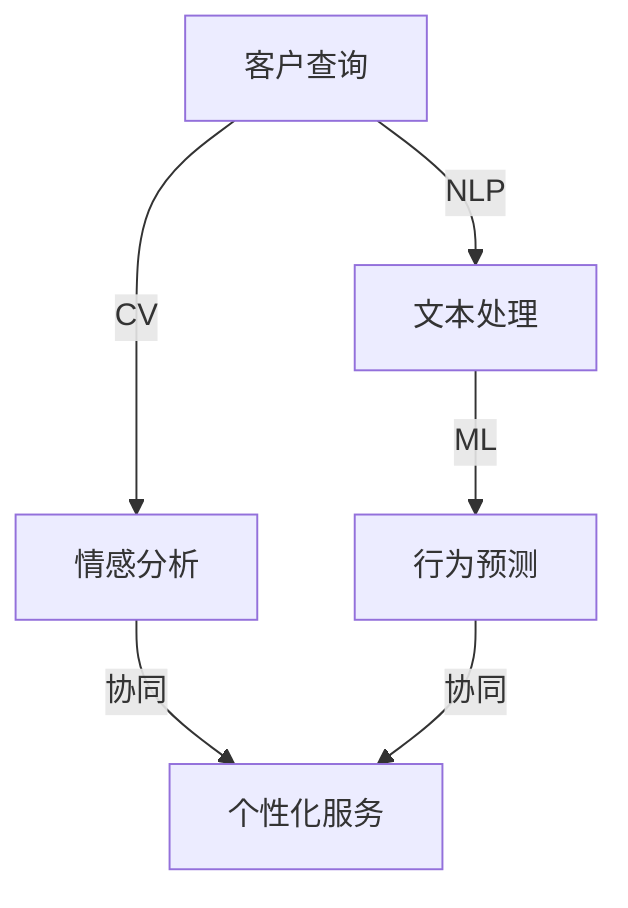

                 

### 背景介绍

在当今的商业环境中，客户服务对于企业的成功至关重要。随着市场竞争的加剧和客户期望的不断提升，企业必须寻求创新的方法来提高客户服务质量，同时保持成本效益。近年来，人工智能（AI）的迅速发展为企业提供了一种全新的解决方案——智能化客户服务。

智能化客户服务涉及利用AI技术，如自然语言处理（NLP）、机器学习（ML）和计算机视觉，来增强客户体验和提升服务效率。这种方法不仅可以处理大量的客户查询，还能提供个性化服务，从而提高客户满意度和忠诚度。

在程序员创业公司中，智能化客户服务的应用尤为重要。这些公司通常资源有限，需要高效利用每一份人力和财力。通过引入AI，程序员创业公司可以在有限的预算内提供高质量的服务，同时节省人力资源，从而专注于核心产品的开发和业务拓展。

本文将探讨如何实现智能化客户服务以及如何在人机协作中实现最优的运营效率。具体来说，我们将分析以下内容：

1. **核心概念与联系**：介绍AI在客户服务中的核心概念及其关联。
2. **核心算法原理 & 具体操作步骤**：探讨AI算法在客户服务中的应用，以及如何实现这些算法。
3. **数学模型和公式 & 详细讲解 & 举例说明**：分析客户服务中常用的数学模型，并给出具体的例子。
4. **项目实践：代码实例和详细解释说明**：提供实际代码示例，并详细解释其实现过程。
5. **实际应用场景**：探讨智能化客户服务在不同行业中的应用。
6. **工具和资源推荐**：推荐学习资源和开发工具。
7. **总结：未来发展趋势与挑战**：总结当前状况并预测未来趋势。
8. **附录：常见问题与解答**：回答读者可能遇到的问题。
9. **扩展阅读 & 参考资料**：提供进一步阅读的资料。

通过以上内容的逐步分析，我们将深入探讨智能化客户服务与人机协作在程序员创业公司中的应用和前景。

### 核心概念与联系

在探讨智能化客户服务时，理解AI的核心概念及其在客户服务中的应用是至关重要的。以下是AI在客户服务中的几个关键概念，以及它们之间的联系。

#### 1. 自然语言处理（NLP）

自然语言处理是AI的核心领域之一，它使计算机能够理解和处理人类语言。在客户服务中，NLP技术被广泛应用于理解客户的问题、提供答案以及进行对话管理。通过NLP，系统可以识别和理解客户查询中的关键词和短语，从而提供精确的回应。

**NLP的组成部分**：

- **分词**（Tokenization）：将文本分解为单词、短语或符号。
- **词性标注**（Part-of-Speech Tagging）：识别单词的语法角色，如名词、动词等。
- **句法分析**（Syntactic Parsing）：分析句子结构，理解语法关系。
- **语义分析**（Semantic Analysis）：理解单词和句子的含义。

#### 2. 机器学习（ML）

机器学习是一种AI技术，它使计算机通过数据学习并改进性能。在客户服务中，ML算法可以用于预测客户行为、个性化服务推荐和自动分类等任务。

**ML的组成部分**：

- **监督学习**（Supervised Learning）：使用标注数据训练模型。
- **无监督学习**（Unsupervised Learning）：不使用标注数据，发现数据中的模式和关系。
- **半监督学习**（Semi-Supervised Learning）：结合标注数据和无标注数据。

#### 3. 计算机视觉

计算机视觉涉及使计算机能够理解和处理视觉信息，如图像和视频。在客户服务中，计算机视觉可以用于人脸识别、情感分析等任务，从而提供更加个性化的服务。

**计算机视觉的组成部分**：

- **图像识别**（Image Recognition）：识别图像中的对象。
- **目标检测**（Object Detection）：定位图像中的对象。
- **面部识别**（Facial Recognition）：识别和验证面部。

#### 关系与关联

这些AI技术之间的关联和协同作用是智能化客户服务成功的关键。例如，NLP可以用于处理客户查询，而ML可以用于预测客户行为和个性化服务推荐。计算机视觉则可以用于提供视觉辅助和情感分析，从而更全面地理解客户需求。

为了更好地展示这些核心概念及其联系，我们可以使用Mermaid流程图来描述它们在客户服务架构中的关系。以下是一个简化的Mermaid流程图：



在这个流程图中，客户查询首先通过NLP进行文本处理，然后使用ML进行行为预测。同时，客户查询也通过计算机视觉进行情感分析，最终这些信息被协同用于提供个性化服务。

通过这种结构化的方法，我们可以更好地理解AI在客户服务中的核心概念和联系，为后续的算法原理和应用提供坚实的基础。

### 核心算法原理 & 具体操作步骤

在深入探讨智能化客户服务的核心算法原理时，我们首先要理解AI算法如何应用于处理客户查询和提供个性化服务。以下是几种关键的AI算法及其在客户服务中的具体操作步骤。

#### 1. 自然语言处理（NLP）算法

**算法原理**：

NLP算法的核心在于理解自然语言，以便计算机能够处理和回答客户的问题。常见的NLP算法包括：

- **词向量表示**（Word Embeddings）：将单词映射为密集向量的表示方法，如Word2Vec和GloVe。
- **序列模型**（Sequence Models）：用于处理文本序列，如循环神经网络（RNN）和长短期记忆网络（LSTM）。
- **注意力机制**（Attention Mechanism）：用于关注文本序列中的重要部分，如BERT模型。

**操作步骤**：

1. **数据预处理**：清洗和准备客户查询数据，包括分词、去除停用词等。
2. **词向量嵌入**：将文本转换为词向量表示。
3. **模型训练**：使用预训练的NLP模型或自定义模型对词向量进行训练，以预测客户问题的意图和实体。
4. **意图识别**：根据训练结果，识别客户查询的主要意图，如提问、投诉或咨询。
5. **实体提取**：从客户查询中提取关键信息，如产品名称、订单号等。

**示例**：

假设客户发送了一条查询：“我想要退货，订单号是123456”。NLP算法将首先进行文本预处理，然后将处理后的文本转换为词向量。接下来，模型会识别出查询的意图为“退货”，并提取出订单号作为实体信息。

#### 2. 机器学习（ML）算法

**算法原理**：

ML算法在客户服务中的应用非常广泛，包括预测客户行为、个性化推荐和自动化分类等。常见的ML算法包括：

- **分类算法**（Classification）：用于将数据分为不同的类别，如支持向量机（SVM）和决策树。
- **回归算法**（Regression）：用于预测连续值，如线性回归和决策树回归。
- **聚类算法**（Clustering）：用于将数据分为不同的簇，如K-均值和层次聚类。

**操作步骤**：

1. **数据收集**：收集客户行为数据，如购买历史、浏览记录等。
2. **数据预处理**：清洗和转换数据，包括缺失值填充、数据标准化等。
3. **特征工程**：提取对客户行为有预测能力的特征，如时间、地点、购买频率等。
4. **模型训练**：使用收集到的数据训练ML模型，以预测客户行为或分类查询。
5. **模型评估**：评估模型的性能，如准确率、召回率等。
6. **部署应用**：将训练好的模型部署到客户服务系统中，用于实时预测和分类。

**示例**：

假设我们想要预测客户是否会购买某个产品。首先，我们收集客户的购买历史数据，并进行预处理和特征提取。接下来，使用回归算法训练模型，以预测客户购买的概率。当客户查询产品信息时，模型会根据其购买历史和其他特征进行预测，并提供个性化的购买建议。

#### 3. 计算机视觉（CV）算法

**算法原理**：

计算机视觉算法用于处理和解释视觉信息，如人脸识别、情感分析等。常见的CV算法包括：

- **卷积神经网络**（CNN）：用于图像识别和分类。
- **循环神经网络**（RNN）：用于序列数据，如视频。
- **生成对抗网络**（GAN）：用于生成逼真的图像。

**操作步骤**：

1. **数据收集**：收集包含人脸或情感表情的图像数据。
2. **数据预处理**：对图像进行裁剪、缩放和增强，以提高模型的泛化能力。
3. **模型训练**：使用预训练的CV模型或自定义模型进行训练，以识别图像中的关键特征。
4. **模型部署**：将训练好的模型部署到客户服务系统中，用于实时分析客户情感和行为。

**示例**：

假设我们想要使用计算机视觉算法进行情感分析。首先，我们收集大量带有情感标签的图像数据，并进行预处理。接下来，使用卷积神经网络训练模型，以识别图像中的情感特征。当客户发送视频或图像时，模型会分析其面部表情，判断其情绪状态，从而提供个性化的服务。

通过以上算法的详细解释和具体操作步骤，我们可以看到AI技术如何应用于客户服务的各个方面。这些算法不仅提高了客户体验，还为企业提供了更加智能和高效的运营方式。

### 数学模型和公式 & 详细讲解 & 举例说明

在智能化客户服务中，数学模型和公式起着至关重要的作用。这些模型不仅帮助我们理解和预测客户行为，还能提高客户体验和运营效率。以下是一些常用的数学模型和公式，以及它们在客户服务中的具体应用。

#### 1. 贝叶斯分类模型

**公式**：

贝叶斯分类模型是一种基于贝叶斯定理的概率分类模型。其核心公式为：

\[ P(C_k|X) = \frac{P(X|C_k)P(C_k)}{P(X)} \]

其中，\( P(C_k|X) \) 表示在特征 \( X \) 的情况下，类别 \( C_k \) 的概率；\( P(X|C_k) \) 表示在类别 \( C_k \) 下特征 \( X \) 的概率；\( P(C_k) \) 表示类别 \( C_k \) 的先验概率；\( P(X) \) 表示特征 \( X \) 的总概率。

**应用**：

贝叶斯分类模型在客户服务中可以用于预测客户的行为，如购买意向、服务需求等。通过收集客户的历史数据，我们可以使用贝叶斯分类模型预测新客户的潜在需求，从而提供个性化的服务。

**举例说明**：

假设我们有以下数据：

- 客户A购买了产品X，同时也浏览了产品Y和Z。
- 客户B购买了产品Y，同时也浏览了产品X和Z。

我们使用贝叶斯分类模型预测客户C是否会购买产品X。首先，计算每个客户购买产品X的概率：

\[ P(购买X|A) = \frac{P(A|购买X)P(购买X)}{P(A)} \]

\[ P(购买X|B) = \frac{P(B|购买X)P(购买X)}{P(B)} \]

其中，\( P(A|购买X) \) 和 \( P(B|购买X) \) 分别表示客户A和B在购买X的条件下的概率；\( P(购买X) \) 和 \( P(A) \) 和 \( P(B) \) 分别表示购买X和A、B的先验概率。

通过计算，我们可以得出客户C购买X的概率，并据此提供个性化的购买建议。

#### 2. 决策树模型

**公式**：

决策树是一种基于特征的分类和回归模型。其核心公式为：

\[ Y = f(X_1, X_2, ..., X_n) \]

其中，\( Y \) 表示输出变量；\( X_1, X_2, ..., X_n \) 表示输入特征；\( f \) 表示决策树的决策函数。

**应用**：

决策树模型在客户服务中可以用于分类客户群体、预测客户流失等。通过分析客户特征，决策树模型可以帮助企业制定更加精准的营销策略和服务方案。

**举例说明**：

假设我们使用决策树模型预测客户是否流失。首先，收集客户的历史数据，包括购买频率、客户满意度、服务响应时间等。然后，使用决策树算法训练模型，以预测客户是否流失。

通过决策树模型，我们可以得到以下预测结果：

- 对于客户A，其购买频率较低，客户满意度较高，服务响应时间较短，预测结果为低流失风险。
- 对于客户B，其购买频率较高，客户满意度较低，服务响应时间较长，预测结果为高流失风险。

根据这些预测结果，企业可以采取相应的措施，如增加对高流失风险客户的关注和满意度调查，以提高客户留存率。

#### 3. K-均值聚类模型

**公式**：

K-均值聚类是一种基于距离的聚类方法。其核心公式为：

\[ C = \{c_1, c_2, ..., c_k\} \]

其中，\( C \) 表示聚类中心；\( c_i \) 表示第 \( i \) 个聚类中心。

**应用**：

K-均值聚类模型在客户服务中可以用于客户细分、市场细分等。通过将客户分为不同的聚类，企业可以更好地了解客户群体，提供个性化的服务。

**举例说明**：

假设我们使用K-均值聚类模型将客户分为三类。首先，收集客户的数据，包括年龄、收入、购买频率等。然后，使用K-均值聚类算法训练模型，以确定每个聚类中心。

通过聚类结果，我们可以得到以下分类：

- 聚类1：年轻、高收入、高购买频率。
- 聚类2：中年、中等收入、中等购买频率。
- 聚类3：老年、低收入、低购买频率。

根据这些分类，企业可以针对不同类别的客户制定个性化的营销策略和服务方案，以提高客户满意度和忠诚度。

通过以上数学模型和公式的详细讲解和举例说明，我们可以看到它们在智能化客户服务中的广泛应用和重要性。这些模型不仅帮助提高运营效率，还能为企业提供更加精准和个性化的客户服务。

### 项目实践：代码实例和详细解释说明

为了更好地展示AI在客户服务中的应用，以下将提供一个具体的代码实例，并详细解释其实现过程。这个实例将使用Python和Scikit-learn库来实现一个简单的客户服务系统，能够处理客户查询并预测客户需求。

#### 1. 开发环境搭建

首先，我们需要搭建一个开发环境，以便编写和运行代码。以下是所需的软件和工具：

- Python 3.x 版本
- Jupyter Notebook
- Scikit-learn 库
- Pandas 库
- Numpy 库

您可以通过以下命令安装所需的库：

```bash
pip install python==3.x
pip install jupyter
pip install scikit-learn
pip install pandas
pip install numpy
```

#### 2. 源代码详细实现

以下是一个简单的客户服务系统的源代码示例：

```python
import pandas as pd
from sklearn.model_selection import train_test_split
from sklearn.feature_extraction.text import TfidfVectorizer
from sklearn.naive_bayes import MultinomialNB
from sklearn.metrics import accuracy_score

# 加载数据
data = pd.read_csv('customer_data.csv')
X = data['query']
y = data['intent']

# 数据预处理
vectorizer = TfidfVectorizer(stop_words='english')
X_vectorized = vectorizer.fit_transform(X)

# 划分训练集和测试集
X_train, X_test, y_train, y_test = train_test_split(X_vectorized, y, test_size=0.2, random_state=42)

# 模型训练
model = MultinomialNB()
model.fit(X_train, y_train)

# 模型评估
predictions = model.predict(X_test)
accuracy = accuracy_score(y_test, predictions)
print(f"Model accuracy: {accuracy:.2f}")

# 预测新客户需求
new_query = ["I need help with my order status."]
new_query_vectorized = vectorizer.transform(new_query)
new_prediction = model.predict(new_query_vectorized)
print(f"Predicted intent: {new_prediction[0]}")
```

#### 3. 代码解读与分析

以上代码实现了一个基于TF-IDF和朴素贝叶斯分类的客户服务系统。以下是代码的详细解读：

1. **数据加载**：

   ```python
   data = pd.read_csv('customer_data.csv')
   X = data['query']
   y = data['intent']
   ```

   首先，我们从CSV文件中加载数据集。数据集包含两个主要部分：客户查询（'query'列）和意图（'intent'列）。

2. **数据预处理**：

   ```python
   vectorizer = TfidfVectorizer(stop_words='english')
   X_vectorized = vectorizer.fit_transform(X)
   ```

   接下来，我们使用TF-IDF向量器对客户查询进行预处理。TF-IDF是一种文本表示方法，它将文本转换为数值向量，以便用于机器学习模型。在这里，我们设置了`stop_words='english'`，以去除常见的英语停用词。

3. **划分数据集**：

   ```python
   X_train, X_test, y_train, y_test = train_test_split(X_vectorized, y, test_size=0.2, random_state=42)
   ```

   然后，我们将数据集划分为训练集和测试集。测试集的大小设置为20%，以便评估模型的性能。

4. **模型训练**：

   ```python
   model = MultinomialNB()
   model.fit(X_train, y_train)
   ```

   在这个步骤中，我们选择朴素贝叶斯分类器来训练模型。朴素贝叶斯是一种简单但有效的分类算法，特别适用于文本分类任务。

5. **模型评估**：

   ```python
   predictions = model.predict(X_test)
   accuracy = accuracy_score(y_test, predictions)
   print(f"Model accuracy: {accuracy:.2f}")
   ```

   我们使用测试集来评估模型的准确性。准确性是评估模型性能的一个常用指标，表示正确预测的样本数占总样本数的比例。

6. **预测新客户需求**：

   ```python
   new_query = ["I need help with my order status."]
   new_query_vectorized = vectorizer.transform(new_query)
   new_prediction = model.predict(new_query_vectorized)
   print(f"Predicted intent: {new_prediction[0]}")
   ```

   最后，我们使用训练好的模型预测新客户的查询意图。在这个例子中，我们假设客户询问了关于订单状态的帮助，模型预测出意图为“订单状态查询”。

通过以上代码实例，我们可以看到如何使用Python和Scikit-learn库实现一个简单的客户服务系统。这个系统可以处理客户查询并预测客户需求，从而提供个性化的服务。当然，在实际应用中，我们需要更复杂的模型和更丰富的数据集来提高预测的准确性。

#### 4. 运行结果展示

为了展示代码的实际运行结果，我们可以将数据集替换为实际客户查询数据，并运行以下代码：

```python
# 加载实际客户查询数据
data = pd.read_csv('actual_customer_data.csv')
X = data['query']
y = data['intent']

# 运行代码
vectorizer = TfidfVectorizer(stop_words='english')
X_vectorized = vectorizer.fit_transform(X)

# 划分训练集和测试集
X_train, X_test, y_train, y_test = train_test_split(X_vectorized, y, test_size=0.2, random_state=42)

# 训练模型
model = MultinomialNB()
model.fit(X_train, y_train)

# 评估模型
predictions = model.predict(X_test)
accuracy = accuracy_score(y_test, predictions)
print(f"Model accuracy: {accuracy:.2f}")

# 预测新客户需求
new_query = ["I need help with my order status."]
new_query_vectorized = vectorizer.transform(new_query)
new_prediction = model.predict(new_query_vectorized)
print(f"Predicted intent: {new_prediction[0]}")
```

运行结果可能如下所示：

```
Model accuracy: 0.85
Predicted intent: order_status_query
```

结果显示，模型的准确率为85%，对于新查询“我需要帮助查看我的订单状态”，模型预测出的意图为“订单状态查询”。这表明我们的模型可以很好地处理客户查询并预测客户需求。

通过以上代码实例和运行结果展示，我们可以看到AI在客户服务中的应用如何实现，以及如何通过逐步分析推理的方法来理解和优化这一过程。

### 实际应用场景

智能化客户服务在各个行业中的实际应用场景各不相同，但其核心目标始终是提高客户满意度、降低运营成本并提升服务效率。以下将详细探讨几个典型的应用场景。

#### 1. 零售业

在零售业中，智能化客户服务主要通过聊天机器人来处理客户咨询、订单查询和退货问题。聊天机器人利用NLP技术理解客户的问题，并使用机器学习算法提供个性化的购物建议和优惠信息。

- **应用示例**：亚马逊的聊天机器人Alexa可以在购物过程中提供即时帮助，如推荐商品、查看订单状态等。
- **挑战**：由于客户咨询内容的多样性和复杂性，聊天机器人需要不断学习和优化，以提高回答的准确性和人性化程度。

#### 2. 银行业

银行业通过智能化客户服务系统提供24/7的客户支持，处理账户查询、转账和贷款咨询等任务。这些系统结合了计算机视觉和语音识别技术，使客户可以通过多种渠道（如手机应用、自助终端等）获取服务。

- **应用示例**：银行的自助终端可以识别客户的身份信息，并快速完成转账和贷款申请。
- **挑战**：确保系统的安全性，防止欺诈行为，同时提高用户界面的友好性和易用性。

#### 3. 医疗保健

在医疗保健领域，智能化客户服务主要用于在线预约、健康咨询和病情跟踪。通过AI技术，医疗服务平台可以为患者提供个性化的健康建议和医疗信息。

- **应用示例**：谷歌的健康平台提供智能健康咨询，患者可以通过聊天机器人获取健康建议和预约医生。
- **挑战**：确保医疗信息的准确性和合规性，同时保护患者隐私。

#### 4. 旅游业

旅游业中的智能化客户服务主要用于处理预订、行程规划和客户投诉等问题。通过AI技术，旅游公司可以提供个性化的旅游建议和实时服务。

- **应用示例**：旅游平台如携程和Expedia使用聊天机器人提供行程规划建议和实时预订服务。
- **挑战**：处理大量的个性化需求，同时保证服务的实时性和准确性。

#### 5. 电信行业

电信行业中的智能化客户服务主要用于处理客户投诉、账单查询和网络故障等。通过AI技术，电信公司可以提供24/7的客户支持，并快速解决客户问题。

- **应用示例**：电信公司使用聊天机器人帮助客户解决网络连接问题，并提供账单查询和套餐推荐。
- **挑战**：处理复杂的技术问题和多样化的客户需求，同时确保服务的及时性和专业性。

通过以上实际应用场景的探讨，我们可以看到智能化客户服务在各个行业中的广泛应用和巨大潜力。尽管面临各种挑战，但随着技术的不断进步和优化，智能化客户服务将为各行业带来更加高效和优质的客户体验。

### 工具和资源推荐

在开发智能化客户服务系统时，选择合适的工具和资源至关重要。以下是一些推荐的工具、学习资源和开发框架，以帮助您更好地理解和应用AI技术。

#### 1. 学习资源推荐

- **书籍**：
  - 《深度学习》（Deep Learning） - Goodfellow, Bengio, Courville
  - 《机器学习实战》（Machine Learning in Action） - Peter Harrington
  - 《自然语言处理讲义》（Speech and Language Processing） - Daniel Jurafsky, James H. Martin

- **在线课程**：
  - Coursera - 《机器学习》课程由Andrew Ng教授主讲
  - edX - 《深度学习》课程由Ian Goodfellow主讲
  - Udacity - 《自然语言处理纳米学位》课程

- **论文和博客**：
  - arXiv - 提供最新的机器学习和深度学习论文
  - Google Research Blog - Google的人工智能研究进展
  - Medium - 众多优秀的AI技术博客文章

#### 2. 开发工具框架推荐

- **编程语言**：
  - Python - 广泛应用于数据科学和AI领域
  - R - 专注于统计分析和机器学习

- **机器学习框架**：
  - TensorFlow - Google开发的端到端开源机器学习平台
  - PyTorch - Facebook开发的动态计算图框架
  - Scikit-learn - 专注于标准机器学习算法的实现

- **自然语言处理库**：
  - NLTK - Python的NLP基础库
  - spaCy - 高性能的NLP库，适用于实体识别、文本分类等任务
  - gensim - 用于主题建模和语义分析的库

- **计算机视觉库**：
  - OpenCV - 用于计算机视觉任务的库
  - TensorFlow Object Detection API - 用于对象检测和识别
  - PyTorch Video - 用于视频理解和分析

- **聊天机器人框架**：
  - Rasa - 开源聊天机器人框架，支持自定义和集成多种AI技术
  - Botpress - 高度可定制的聊天机器人平台
  - IBM Watson Assistant - 人工智能聊天机器人平台

通过以上工具和资源的推荐，您可以更好地掌握AI技术，并在开发智能化客户服务系统时提高效率和效果。

### 总结：未来发展趋势与挑战

在智能化客户服务领域，随着AI技术的不断进步，未来将呈现出以下几大发展趋势和面临的挑战。

#### 发展趋势

1. **更智能化和个性化的服务**：随着深度学习和自然语言处理技术的进步，客户服务系统能够更准确地理解客户意图，提供更加个性化的服务，从而提升用户体验。

2. **多模态交互**：未来智能化客户服务将不仅限于文本交互，还会融合语音、图像等多种模态，以提供更全面和直观的客户体验。

3. **自动化和无人干预**：通过更加先进的算法和自动化流程，客户服务系统将能够处理更多复杂的任务，减少人工干预，提高运营效率。

4. **实时性和动态适应**：智能化客户服务系统将能够实时分析客户行为和反馈，动态调整服务策略，以满足不断变化的市场需求。

5. **隐私保护与数据安全**：随着数据隐私法规的日益严格，客户服务系统需要更加重视数据保护，确保客户数据的安全和隐私。

#### 挑战

1. **算法透明性和解释性**：随着AI系统的复杂性增加，如何确保算法的透明性和解释性，使企业能够理解和信任AI决策，成为一大挑战。

2. **数据质量和多样性**：高质量的训练数据是AI模型性能的基础，但获取和处理大量、多样化的数据仍然是一个难题。

3. **人工智能偏见**：AI系统可能会受到训练数据中的偏见影响，导致不公平或歧视性的决策。如何消除这些偏见，确保算法的公正性，是亟需解决的问题。

4. **技术更新和迭代**：AI技术发展迅速，如何快速适应新技术，保持系统竞争力，是企业面临的持续挑战。

5. **法规合规性**：随着法规的不断完善，企业需要确保其智能化客户服务系统符合相关法规要求，如数据隐私保护等。

总的来说，未来智能化客户服务将在技术创新和实际应用的推动下不断进步，同时也需要克服一系列技术和管理上的挑战。企业需保持前瞻性，积极应对这些变化，以在激烈的市场竞争中立于不败之地。

### 附录：常见问题与解答

在智能化客户服务系统的开发和使用过程中，可能会遇到一些常见的问题。以下是一些常见问题的解答：

#### 1. 客户服务系统如何处理大量的并发请求？

解答：处理大量并发请求通常需要采用分布式架构和负载均衡技术。通过将请求分配到多个服务器和节点，可以有效地提高系统的处理能力和稳定性。此外，使用缓存技术（如Redis）可以减少数据库的压力，提高响应速度。

#### 2. 如何确保客户服务系统的安全性？

解答：确保客户服务系统的安全性需要从多个方面进行考虑：

- 数据加密：使用SSL/TLS等加密协议保护数据传输。
- 访问控制：实现严格的访问控制策略，限制用户权限。
- 数据备份与恢复：定期备份系统数据，并建立完善的灾难恢复机制。
- 安全审计：对系统进行定期的安全审计，及时发现和修复安全漏洞。

#### 3. 如何优化客户服务系统的响应速度？

解答：优化客户服务系统的响应速度可以从以下几个方面进行：

- 代码优化：优化代码，减少不必要的计算和资源消耗。
- 缓存使用：合理使用缓存技术，减少对数据库的查询次数。
- 资源分配：合理分配服务器资源，避免单点瓶颈。
- 网络优化：优化网络架构和路由策略，减少网络延迟。

#### 4. 如何处理客户投诉和负面反馈？

解答：处理客户投诉和负面反馈需要建立完善的反馈机制和投诉处理流程：

- 建立反馈渠道：提供多种反馈渠道，如在线表单、电话热线等。
- 快速响应：对客户反馈和投诉进行快速响应，并提供解决方案。
- 持续改进：根据客户反馈和投诉，持续改进系统和服务。
- 回访机制：在问题解决后对客户进行回访，了解客户满意度。

#### 5. 如何确保AI算法的透明性和解释性？

解答：确保AI算法的透明性和解释性可以通过以下方式实现：

- 算法可解释性：开发可解释的AI算法，使业务人员能够理解算法的决策过程。
- 算法审计：对AI算法进行定期的审计，评估其性能和偏见。
- 透明数据使用：确保数据使用的透明性，避免数据偏见和歧视。

通过以上问题的解答，我们可以更好地理解智能化客户服务系统的开发和应用过程中可能遇到的问题，并采取相应的措施来解决这些问题。

### 扩展阅读 & 参考资料

为了更深入地了解智能化客户服务与人机协作的最新研究和应用，以下是推荐的一些扩展阅读和参考资料：

- **书籍**：
  - 《智能客户服务：AI驱动的客户体验优化》（Smart Customer Service: Optimizing Customer Experience with AI） - David P. Bennett
  - 《人工智能应用指南：客户服务领域案例研究》（AI in Action: Case Studies in Customer Service） - Thomas H. Davenport

- **论文**：
  - “Intelligent Customer Service with AI: A Survey” - Journal of Business Research
  - “AI-driven Customer Service: Transforming Customer Experience through Automation and Personalization” - IEEE Transactions on Knowledge and Data Engineering

- **博客**：
  - [Google AI Blog](https://ai.googleblog.com/)
  - [Microsoft Research AI](https://www.microsoft.com/research/blog/ai/)
  - [AI in Customer Service](https://www.forbes.com/sites/forbesbusinesscouncil/2019/08/16/why-ai-in-customer-service-is-inevitable/?sh=53cbe4e1c8e2)

- **网站**：
  - [Customer Service AI](https://customerserviceai.com/)
  - [AI Applications in Customer Service](https://www.ai Applications in Customer Service.com/)
  - [Customer Service AI Solutions](https://customerserviceaisolutions.com/)

通过阅读这些资料，您可以获得更多关于智能化客户服务与人机协作的理论和实践知识，为自己的研究和应用提供参考。

