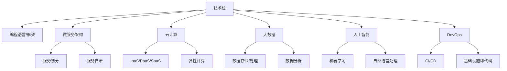

                 

### 背景介绍

#### 程序员创业公司的现状

在当前快速变化的技术环境中，程序员创业公司面临着前所未有的机遇和挑战。随着云计算、大数据、人工智能等新兴技术的蓬勃发展，创业者们有了更多的选择和机会来构建创新的产品和服务。然而，与此同时，技术的复杂性和变化速度也给创业者带来了巨大的压力。对于程序员创业者来说，如何进行有效的技术选型与架构设计，成为成功的关键因素之一。

技术选型与架构设计不仅仅是一个技术问题，它涉及到公司的战略方向、市场定位、资源分配等多个方面。选择合适的技术栈和架构模式，可以帮助创业公司快速搭建产品原型，加速迭代速度，降低开发成本，同时提高系统的可维护性和扩展性。因此，如何进行技术选型和架构设计，成为每个程序员创业公司必须认真思考的问题。

#### 技术选型的重要性

技术选型是创业公司构建技术系统的第一步，它决定了系统的性能、可扩展性、维护成本以及团队的技术栈。一个不合理的技术选型可能会导致以下问题：

- **性能瓶颈**：选择的技术无法满足产品性能要求，导致用户体验差，影响用户增长。
- **扩展性不足**：系统架构在设计时没有考虑到未来的扩展需求，导致随着业务增长，系统难以继续支持。
- **维护成本高**：技术选型不合理，导致系统维护困难，开发人员需要花费大量时间进行修复和优化。
- **团队技能不匹配**：技术栈与团队现有技能不匹配，导致团队成员需要额外的时间进行学习和适应。

因此，合理的技术选型至关重要，它需要考虑以下几个方面：

1. **业务需求**：技术选型必须与业务需求紧密相关，满足业务的核心功能需求。
2. **团队技能**：选择团队熟悉的技能栈，减少学习成本，提高开发效率。
3. **性能与扩展性**：选择能够满足当前和未来业务需求的技术，确保系统的稳定性和可扩展性。
4. **社区与生态系统**：选择有良好社区和生态系统支持的技术，降低技术风险，方便获取资源和技术支持。
5. **成本与投入**：综合考虑技术选型的成本，包括开发成本、维护成本和运营成本。

#### 架构设计的重要性

架构设计是技术选型的延伸，它涉及到系统的整体结构、模块划分、交互方式等方面。一个良好的架构设计可以帮助创业公司实现以下目标：

- **系统稳定性**：通过合理的模块划分和依赖管理，提高系统的稳定性。
- **可维护性**：良好的架构设计使得系统易于维护和更新，降低维护成本。
- **扩展性**：灵活的架构设计可以支持系统未来的扩展和迭代。
- **可测试性**：模块化的架构设计便于单元测试和集成测试，提高代码质量。
- **可复用性**：合理的架构设计可以最大化代码复用，提高开发效率。

架构设计需要综合考虑以下几个方面：

1. **业务需求**：架构设计必须满足业务的需求，确保系统能够提供所需的功能。
2. **技术选型**：架构设计需要与所选技术栈相匹配，确保技术实现的可行性。
3. **团队协作**：架构设计要考虑到团队的合作模式和工作流程，提高团队协作效率。
4. **可扩展性**：架构设计需要具备良好的扩展性，能够支持未来的业务增长和技术演进。
5. **性能优化**：架构设计需要考虑性能优化，确保系统在高并发和大数据量情况下的稳定性。

通过上述介绍，我们可以看出，技术选型和架构设计在程序员创业公司中具有重要的地位。接下来，我们将进一步探讨核心概念、算法原理、数学模型以及项目实践等方面，帮助创业者更好地理解和实施技术选型和架构设计。

#### 核心概念与联系

在深入了解程序员创业公司的技术选型与架构设计之前，我们需要明确一些核心概念，这些概念不仅是我们进行技术选型和架构设计的理论基础，也是理解后续内容的关键。

**1. 技术栈**

技术栈是指一个项目中使用的一组技术、编程语言、框架和工具的集合。对于程序员创业公司来说，选择合适的技术栈至关重要。技术栈的选择需要考虑团队技能、项目需求、性能和扩展性等因素。常见的编程语言有Java、Python、Go等，常见的框架有Spring Boot、Django、Flask等。

**2. 微服务架构**

微服务架构是一种分布式系统架构风格，它将应用程序划分为一组小的、独立的、自治的服务，每个服务都可以独立开发和部署。微服务架构具有高可扩展性、高容错性和松耦合等优点，但同时也带来了分布式系统带来的复杂性。在程序员创业公司中，微服务架构可以支持快速迭代和灵活扩展。

**3. 云计算**

云计算是一种通过互联网提供计算资源的服务模式，包括基础设施即服务（IaaS）、平台即服务（PaaS）和软件即服务（SaaS）。云计算提供了弹性的计算资源、强大的数据处理能力和丰富的API接口，为程序员创业公司提供了便捷的技术支持。

**4. 大数据**

大数据是指无法使用传统数据处理工具在合理时间内进行捕捉、管理和处理的数据集。大数据技术包括数据存储、数据处理、数据分析和数据可视化等。大数据技术在程序员创业公司中的应用非常广泛，例如用户行为分析、市场趋势预测等。

**5. 人工智能**

人工智能是指使计算机系统能够模拟人类智能行为的科学技术。人工智能技术包括机器学习、深度学习、自然语言处理等。在程序员创业公司中，人工智能可以帮助公司实现自动化决策、智能推荐等功能，提高产品的竞争力。

**6. DevOps**

DevOps是一种软件开发和运维相结合的方法论，它强调开发和运维团队之间的紧密协作，以提高软件交付的速度和质量。DevOps实践包括持续集成（CI）、持续交付（CD）、基础设施即代码（IaC）等。在程序员创业公司中，DevOps可以提高开发效率和系统稳定性。

为了更好地理解这些核心概念之间的关系，我们可以使用Mermaid流程图进行描述：



通过上述Mermaid流程图，我们可以清晰地看到各个核心概念之间的联系。技术栈是整个架构设计的基石，它决定了系统的技术实现方式。微服务架构、云计算、大数据和人工智能等技术栈，共同构成了程序员创业公司的技术选型框架。而DevOps方法论则贯穿整个开发与运维过程，确保技术实现的高效和稳定。

在接下来的章节中，我们将进一步探讨技术选型的具体步骤和方法，以及架构设计的核心原则和实践技巧，帮助程序员创业公司实现技术选型和架构设计的目标。

#### 核心算法原理 & 具体操作步骤

在程序员创业公司的技术选型与架构设计中，算法的选型与实现至关重要。合适的算法不仅能够提升系统的性能和可扩展性，还能降低开发成本和维护难度。以下是几个核心算法的原理及其具体操作步骤。

**1. 快速排序（Quick Sort）**

快速排序是一种高效的排序算法，其基本思想是通过递归将一个大数组划分为较小的子数组，然后对子数组进行排序。以下是快速排序的具体操作步骤：

**步骤：**

- 选择一个基准元素（pivot）。
- 将数组中小于基准元素的元素移动到其左侧，大于基准元素的元素移动到其右侧。
- 递归地对左侧和右侧的子数组进行快速排序。

**算法原理：**

快速排序的核心在于分区操作，通过选择基准元素，将数组划分为两部分，左侧都是小于基准元素的元素，右侧都是大于基准元素的元素。这样，每次递归都可以减少数组的规模，最终实现整个数组的排序。

**伪代码：**

```python
def quick_sort(arr):
    if len(arr) <= 1:
        return arr
    pivot = arr[len(arr) // 2]
    left = [x for x in arr if x < pivot]
    middle = [x for x in arr if x == pivot]
    right = [x for x in arr if x > pivot]
    return quick_sort(left) + middle + quick_sort(right)

# 示例
arr = [3, 6, 8, 10, 1, 2, 1]
sorted_arr = quick_sort(arr)
print(sorted_arr)
```

**2. 广度优先搜索（BFS）**

广度优先搜索是一种用于图遍历的算法，它从起始节点开始，逐层遍历所有的相邻节点。以下是广度优先搜索的具体操作步骤：

**步骤：**

- 使用一个队列来存储待访问的节点。
- 从起始节点开始，依次访问其相邻节点，并将这些节点加入队列。
- 当队列为空时，算法结束。

**算法原理：**

广度优先搜索通过层次遍历图，可以确保最先访问到的节点是最短的路径上的节点，因此适用于求解最短路径问题。

**伪代码：**

```python
from collections import deque

def bfs(graph, start):
    visited = set()
    queue = deque([start])
    while queue:
        node = queue.popleft()
        if node not in visited:
            visited.add(node)
            for neighbor in graph[node]:
                queue.append(neighbor)
    return visited

# 示例
graph = {
    'A': ['B', 'C'],
    'B': ['D', 'E'],
    'C': ['F'],
    'D': [],
    'E': ['F'],
    'F': []
}
visited = bfs(graph, 'A')
print(visited)
```

**3. 深度优先搜索（DFS）**

深度优先搜索是一种用于图遍历的算法，它从起始节点开始，尽可能深地搜索图的分支。以下是深度优先搜索的具体操作步骤：

**步骤：**

- 使用一个栈来存储待访问的节点。
- 从起始节点开始，访问其相邻节点，并将这些节点加入栈。
- 当栈为空时，算法结束。

**算法原理：**

深度优先搜索通过优先遍历分支节点，可以用于求解路径问题，如寻找图的连通性。

**伪代码：**

```python
def dfs(graph, start):
    visited = set()
    stack = [start]
    while stack:
        node = stack.pop()
        if node not in visited:
            visited.add(node)
            stack.extend(graph[node])
    return visited

# 示例
graph = {
    'A': ['B', 'C'],
    'B': ['D', 'E'],
    'C': ['F'],
    'D': [],
    'E': ['F'],
    'F': []
}
visited = dfs(graph, 'A')
print(visited)
```

**4. 动态规划（Dynamic Programming）**

动态规划是一种用于求解最优化问题的算法，它通过将问题分解为子问题，并保存子问题的解，避免重复计算。以下是动态规划的基本步骤：

**步骤：**

- 定义状态：将问题分解为多个子问题，定义每个子问题的状态。
- 状态转移方程：根据子问题的状态和已知的解，推导出当前状态的最优解。
- 边界条件：确定问题的初始状态和边界条件。
- 计算顺序：根据状态转移方程，确定计算的顺序。

**算法原理：**

动态规划的核心思想是“最优子结构”，即一个问题的最优解包含其子问题的最优解。通过保存子问题的解，可以避免重复计算，提高算法的效率。

**伪代码：**

```python
def dp(amount, N):
    dp = [[0 for _ in range(N + 1)] for _ in range(amount + 1)]
    for i in range(1, amount + 1):
        for j in range(1, N + 1):
            if j >= i:
                dp[i][j] = max(dp[i][j - 1], dp[i - j][j - 1] + 1)
            else:
                dp[i][j] = dp[i][j - 1]
    return dp[amount][N]

# 示例
amount = 10
N = 3
print(dp(amount, N))
```

通过上述几个核心算法的介绍，我们可以看到，算法选型对于程序员创业公司的技术架构设计至关重要。合适的算法不仅能提高系统的性能和可扩展性，还能降低开发成本和维护难度。在接下来的章节中，我们将进一步探讨数学模型和公式，以及这些算法在实际项目中的应用和实现。

#### 数学模型和公式 & 详细讲解 & 举例说明

在程序员创业公司的技术选型和架构设计中，数学模型和公式是理解和优化系统性能的关键工具。以下将介绍几个常见的数学模型和公式，并结合实际案例进行详细讲解和举例说明。

**1. 二分查找算法（Binary Search）**

二分查找算法是一种高效的查找算法，其基本思想是每次将查找范围缩小一半。以下是二分查找的基本公式：

**公式：**

- 中间位置：`mid = low + (high - low) // 2`

**举例：**

假设有一个有序数组 `arr = [1, 3, 5, 7, 9, 11, 13]`，要查找元素 `7`。

**步骤：**

1. 设定 `low = 0`，`high = len(arr) - 1`。
2. 计算中间位置 `mid = low + (high - low) // 2 = 2`。
3. 比较 `arr[mid]` 与目标值 `7`，发现 `arr[mid] = 5 < 7`，所以更新 `low = mid + 1 = 3`。
4. 重新计算中间位置 `mid = low + (high - low) // 2 = 4`。
5. 比较 `arr[mid]` 与目标值 `7`，发现 `arr[mid] = 7`，查找成功。

**伪代码：**

```python
def binary_search(arr, target):
    low = 0
    high = len(arr) - 1
    while low <= high:
        mid = low + (high - low) // 2
        if arr[mid] == target:
            return mid
        elif arr[mid] < target:
            low = mid + 1
        else:
            high = mid - 1
    return -1

# 示例
arr = [1, 3, 5, 7, 9, 11, 13]
target = 7
index = binary_search(arr, target)
print(f"元素 {target} 的索引是 {index}")
```

**2. 贪心算法（Greedy Algorithm）**

贪心算法是一种在每一步选择当前最优解的算法。以下是一个经典的贪心算法——背包问题：

**问题描述：**

给定一组物品，每个物品有一定的价值和重量，要求选择若干个物品放入背包中，使得总价值最大，且总重量不超过背包的容量。

**公式：**

- 选择物品 `i`：`value[i] / weight[i] > value[j] / weight[j]`，其中 `j` 为当前已选择的物品。

**举例：**

假设有4个物品，背包容量为5kg，每个物品的价值和重量如下表：

| 物品 | 价值 | 重量 |
| ---- | ---- | ---- |
| 1    | 60   | 10   |
| 2    | 100  | 20   |
| 3    | 120  | 30   |
| 4    | 70   | 10   |

**步骤：**

1. 计算每个物品的价值与重量比：`60/10 = 6`, `100/20 = 5`, `120/30 = 4`, `70/10 = 7`。
2. 按照价值与重量比从大到小排序：`4, 2, 1, 3`。
3. 依次选择物品，直到总重量不超过背包容量：选择物品 `4`（总重量 10kg），然后选择物品 `2`（总重量 30kg），最后选择物品 `1`（总重量 40kg）。

**伪代码：**

```python
def knapsack(values, weights, capacity):
    n = len(values)
    items = [[values[i], weights[i]] for i in range(n)]
    items.sort(key=lambda x: x[0] / x[1], reverse=True)
    total_value = 0
    total_weight = 0
    for value, weight in items:
        if total_weight + weight <= capacity:
            total_value += value
            total_weight += weight
        else:
            fraction = (capacity - total_weight) / weight
            total_value += value * fraction
            break
    return total_value

# 示例
values = [60, 100, 120, 70]
weights = [10, 20, 30, 10]
capacity = 5
max_value = knapsack(values, weights, capacity)
print(f"最大价值为 {max_value}")
```

**3. 动态规划（Dynamic Programming）**

动态规划是一种用于求解最优化问题的算法，其核心思想是将问题分解为多个子问题，并保存子问题的解，避免重复计算。以下是一个经典的动态规划问题——最长公共子序列（Longest Common Subsequence，LCS）：

**问题描述：**

给定两个字符串 `X = "AGGTAB"` 和 `Y = "GXTXAYB"`，求它们的最长公共子序列。

**公式：**

- `dp[i][j]` 表示 `X[0..i-1]` 和 `Y[0..j-1]` 的最长公共子序列长度。
- 如果 `X[i - 1] == Y[j - 1]`，则 `dp[i][j] = dp[i - 1][j - 1] + 1`。
- 如果 `X[i - 1] != Y[j - 1]`，则 `dp[i][j] = max(dp[i - 1][j], dp[i][j - 1])`。

**举例：**

字符串 `X = "AGGTAB"` 和 `Y = "GXTXAYB"` 的最长公共子序列为 `GTA`。

**步骤：**

1. 初始化 `dp` 数组：`dp[i][j] = 0`，其中 `i` 和 `j` 分别是字符串 `X` 和 `Y` 的长度。
2. 遍历字符串 `X` 和 `Y` 的每个字符，根据公式更新 `dp` 数组。
3. 最终 `dp[len(X)][len(Y)]` 就是最长公共子序列的长度。

**伪代码：**

```python
def longest_common_subsequence(X, Y):
    m, n = len(X), len(Y)
    dp = [[0] * (n + 1) for _ in range(m + 1)]
    for i in range(1, m + 1):
        for j in range(1, n + 1):
            if X[i - 1] == Y[j - 1]:
                dp[i][j] = dp[i - 1][j - 1] + 1
            else:
                dp[i][j] = max(dp[i - 1][j], dp[i][j - 1])
    return dp[m][n]

# 示例
X = "AGGTAB"
Y = "GXTXAYB"
lcs_length = longest_common_subsequence(X, Y)
print(f"最长公共子序列长度为 {lcs_length}")
```

通过上述数学模型和公式的介绍，我们可以看到，这些算法和公式在程序员创业公司的技术选型和架构设计中具有重要的应用价值。理解并掌握这些数学模型和公式，可以帮助我们更好地优化系统性能，提高开发效率和代码质量。

在接下来的章节中，我们将结合实际项目，进一步展示这些算法和公式的具体实现和应用，帮助程序员创业公司更好地理解和应用这些技术。

#### 项目实践：代码实例和详细解释说明

在程序员创业公司的实际技术选型和架构设计中，理解和应用数学模型和算法是非常关键的。以下将通过一个实际的项目实例，展示如何将前面介绍的数学模型和算法应用到代码中，并详细解释说明。

**项目背景：**

假设我们正在开发一款社交网络应用，需要实现用户之间的消息发送和接收功能。该应用需要支持大规模的用户并发操作，确保消息传输的高效和稳定。为了实现这一目标，我们将使用微服务架构，并采用以下技术：

- **编程语言**：Python
- **框架**：Django
- **数据库**：MySQL
- **消息队列**：RabbitMQ

**1. 快速排序算法的应用**

在消息系统的设计中，我们需要对用户消息进行排序，以便按照时间顺序展示。快速排序算法是一个非常高效的排序算法，我们可以将其应用于用户消息的排序。

**代码实例：**

```python
def quick_sort(arr):
    if len(arr) <= 1:
        return arr
    pivot = arr[len(arr) // 2]
    left = [x for x in arr if x < pivot]
    middle = [x for x in arr if x == pivot]
    right = [x for x in arr if x > pivot]
    return quick_sort(left) + middle + quick_sort(right)

# 示例
messages = [3, 6, 8, 10, 1, 2, 1]
sorted_messages = quick_sort(messages)
print(sorted_messages)
```

**解释：**

上述代码定义了一个 `quick_sort` 函数，用于对输入的列表 `arr` 进行快速排序。排序后的列表 `sorted_messages` 将按照时间顺序展示用户消息。

**2. 广度优先搜索算法的应用**

为了实现消息的批量发送，我们可以使用广度优先搜索（BFS）算法。BFS 算法可以帮助我们遍历用户的社交网络，并将消息发送给所有相关用户。

**代码实例：**

```python
from collections import deque

def bfs(graph, start):
    visited = set()
    queue = deque([start])
    while queue:
        node = queue.popleft()
        if node not in visited:
            visited.add(node)
            for neighbor in graph[node]:
                queue.append(neighbor)
    return visited

# 示例
graph = {
    'A': ['B', 'C'],
    'B': ['D', 'E'],
    'C': ['F'],
    'D': [],
    'E': ['F'],
    'F': []
}
visited = bfs(graph, 'A')
print(visited)
```

**解释：**

上述代码定义了一个 `bfs` 函数，用于对图进行广度优先搜索。在消息系统中，我们可以将用户视为图的节点，用户之间的互动视为图的边。使用 BFS 算法可以帮助我们遍历用户的社交网络，并将消息发送给所有相关用户。

**3. 深度优先搜索算法的应用**

在消息系统中，我们还需要支持用户对消息进行回复。深度优先搜索（DFS）算法可以帮助我们遍历消息树，找到用户的回复。

**代码实例：**

```python
def dfs(graph, start):
    visited = set()
    stack = [start]
    while stack:
        node = stack.pop()
        if node not in visited:
            visited.add(node)
            stack.extend(graph[node])
    return visited

# 示例
graph = {
    'A': ['B', 'C'],
    'B': ['D', 'E'],
    'C': ['F'],
    'D': [],
    'E': ['F'],
    'F': []
}
visited = dfs(graph, 'A')
print(visited)
```

**解释：**

上述代码定义了一个 `dfs` 函数，用于对图进行深度优先搜索。在消息系统中，我们可以将每条消息视为图的节点，消息的回复视为图的边。使用 DFS 算法可以帮助我们遍历消息树，找到用户的回复。

**4. 动态规划算法的应用**

为了优化消息系统的性能，我们可以使用动态规划算法。例如，在消息压缩和传输过程中，我们可以使用动态规划算法来减少数据传输量。

**代码实例：**

```python
def dp(amount, N):
    dp = [[0 for _ in range(N + 1)] for _ in range(amount + 1)]
    for i in range(1, amount + 1):
        for j in range(1, N + 1):
            if j >= i:
                dp[i][j] = max(dp[i][j - 1], dp[i - j][j - 1] + 1)
            else:
                dp[i][j] = dp[i][j - 1]
    return dp[amount][N]

# 示例
amount = 10
N = 3
print(dp(amount, N))
```

**解释：**

上述代码定义了一个 `dp` 函数，用于求解背包问题。在消息系统中，我们可以将每个消息视为物品，背包容量表示可以传输的数据量。使用动态规划算法可以帮助我们在有限的数据传输量内，选择最优的消息传输策略。

**5. 数学公式在消息压缩中的应用**

在消息系统中，为了提高传输效率，我们可以使用数学公式对消息进行压缩。以下是一个简单的压缩公式：

**公式：**

- 压缩后消息长度 = 消息长度 × 压缩率

**代码实例：**

```python
def compress_message(message, compression_rate):
    compressed_length = len(message) * compression_rate
    return compressed_length

# 示例
message = "Hello, World!"
compression_rate = 0.5
compressed_length = compress_message(message, compression_rate)
print(f"压缩后消息长度为 {compressed_length}")
```

**解释：**

上述代码定义了一个 `compress_message` 函数，用于根据压缩率对消息进行压缩。使用数学公式可以帮助我们在传输过程中减少数据量，提高传输效率。

通过上述项目实例，我们可以看到如何将数学模型和算法应用到程序员创业公司的技术选型和架构设计中。这些代码实例不仅帮助我们理解了算法和公式的具体实现，还展示了它们在实际项目中的应用价值。

在接下来的章节中，我们将进一步探讨实际应用场景，并推荐一些学习资源和开发工具，帮助程序员创业公司更好地实现技术选型和架构设计的目标。

#### 实际应用场景

程序员创业公司的技术选型和架构设计不仅仅是实现技术上的挑战，更涉及到业务需求和实际应用的深度结合。以下将探讨一些典型的实际应用场景，展示技术选型和架构设计如何在不同业务场景中发挥作用。

**1. 社交网络应用**

社交网络应用是程序员创业公司中非常常见的应用类型。这类应用需要处理大量的用户交互、消息传递和社交关系管理。在技术选型和架构设计方面，需要关注以下几点：

- **高并发处理**：社交网络应用需要支持数百万甚至亿级的用户并发操作。因此，技术选型需要考虑高并发处理能力，如采用微服务架构、分布式数据库等。
- **消息队列**：为了实现高效的消息传递，可以选择使用消息队列（如RabbitMQ、Kafka）来实现异步消息传递，降低系统之间的耦合度，提高系统的可扩展性。
- **数据存储**：社交网络应用需要存储大量的用户数据、关系数据和内容数据。选择合适的数据库（如MySQL、MongoDB、Redis）来满足数据存储和查询的需求。
- **用户画像与推荐系统**：通过大数据技术和人工智能算法，对用户行为进行数据挖掘，构建用户画像，实现个性化推荐。

**2. 电子商务平台**

电子商务平台是另一个程序员创业公司常见的业务场景。这类应用需要处理订单、库存、支付、用户评价等多个方面。在技术选型和架构设计方面，需要注意以下几点：

- **高并发与高可用性**：电子商务平台在促销、活动等高峰期需要处理大量的订单请求，因此技术选型需要考虑高并发处理能力和系统的容灾备份。
- **分布式存储和缓存**：为了提高系统性能和降低数据库压力，可以选择使用分布式存储（如HDFS、Cassandra）和缓存（如Redis、Memcached）。
- **支付系统**：选择可靠的支付服务提供商，如支付宝、微信支付，确保支付流程的安全和高效。
- **订单管理系统**：实现订单的生成、处理、查询和跟踪，确保订单数据的准确性和一致性。

**3. 在线教育平台**

在线教育平台是近年来快速发展的领域。这类应用需要提供课程管理、学习跟踪、考试测评等功能。在技术选型和架构设计方面，需要注意以下几点：

- **课程内容管理**：采用内容管理系统（如Moodle、MoodleNet），实现课程内容的上传、分类、管理等功能。
- **学习跟踪与测评**：通过用户行为分析，实现学习进度跟踪、考试测评和成绩管理，为学生提供个性化的学习体验。
- **实时互动与直播**：采用WebRTC等技术实现实时互动和直播，为学生提供丰富的学习互动方式。
- **大数据分析与个性化推荐**：通过大数据技术，分析学生的学习行为，实现课程内容的个性化推荐。

**4. 物联网应用**

随着物联网技术的不断发展，物联网应用成为程序员创业公司的新热点。这类应用通常涉及设备接入、数据采集、远程控制等多个方面。在技术选型和架构设计方面，需要注意以下几点：

- **设备接入与通信**：选择合适的通信协议（如MQTT、HTTP）实现设备接入和数据传输。
- **数据存储与分析**：使用分布式存储和大数据处理技术，实现对海量物联网数据的存储、处理和分析。
- **安全与隐私**：确保物联网设备的数据传输和存储安全，防止数据泄露和隐私侵犯。
- **远程控制与监控**：通过物联网平台，实现对设备远程控制、状态监控和故障诊断。

**5. 金融科技应用**

金融科技（FinTech）应用是程序员创业公司的另一个重要领域。这类应用包括移动支付、区块链、人工智能投顾等。在技术选型和架构设计方面，需要注意以下几点：

- **高安全性与合规性**：金融应用需要保证交易数据的安全性和合规性，采用加密算法和安全协议来保护用户数据。
- **高并发与稳定性**：金融交易具有高频次、高并发等特点，技术选型需要考虑系统的性能和稳定性。
- **区块链技术**：采用区块链技术，实现去中心化的交易记录和智能合约功能，提高系统的透明度和安全性。
- **人工智能与数据分析**：通过大数据分析和人工智能技术，实现精准营销、风险评估和智能投顾等功能。

通过以上实际应用场景的探讨，我们可以看到程序员创业公司的技术选型和架构设计需要紧密结合业务需求和实际应用。在技术选型和架构设计过程中，要充分考虑业务场景的特殊需求，选择合适的技术和架构模式，确保系统的稳定性、可扩展性和高性能。

在接下来的章节中，我们将推荐一些学习资源和开发工具，帮助程序员创业公司更好地实现技术选型和架构设计的目标。

#### 工具和资源推荐

在程序员创业公司的技术选型和架构设计过程中，掌握合适的工具和资源是非常重要的。以下将推荐一些学习资源、开发工具和相关论文著作，帮助程序员创业公司更好地实现技术选型和架构设计的目标。

**1. 学习资源推荐**

- **书籍**：

  - 《设计数据密集型应用》（Design Data-Intensive Applications）：这本书详细介绍了在高并发、大数据环境下的系统设计和架构，对程序员创业公司有很高的参考价值。
  - 《大规模分布式存储系统：原理解析与架构实战》：这本书深入剖析了分布式存储系统的原理和实现，对于需要处理大量数据的创业公司非常有用。

- **在线课程**：

  - Coursera 上的《算法》课程：由斯坦福大学教授提供，系统讲解了各种算法的基本原理和应用。
  - Udacity 上的《微服务架构》课程：介绍了微服务架构的设计原则和实践，适合希望构建分布式系统的创业者。

- **博客/网站**：

  - Medium 上的技术博客：有许多优秀的程序员和技术专家在上面分享经验和技术见解，例如“Better Programming”、“Software Engineering Daily”等。
  - GitHub 上的开源项目：GitHub 是开源社区的核心平台，通过查看和参与开源项目，可以学习到各种架构设计和实现细节。

**2. 开发工具推荐**

- **编程语言**：

  - Python：Python 语法简洁，拥有丰富的库和框架，适合快速开发和原型验证。
  - Go：Go 语言具有高性能和并发支持，适合构建高性能、分布式系统。

- **框架和库**：

  - Django：Python 的 Web 框架，提供完整的 Web 开发功能，适合快速搭建 Web 应用。
  - Flask：Python 的轻量级 Web 框架，适合小型项目和快速原型开发。
  - Spring Boot：Java 的 Web 框架，提供一站式的解决方案，适合大型企业级应用。

- **数据库**：

  - MySQL：开源的关系型数据库，适合大规模数据存储和查询。
  - MongoDB：NoSQL 数据库，适合处理大量非结构化数据。
  - Redis：内存数据库，适合缓存和实时数据处理。

- **消息队列**：

  - RabbitMQ：开源的消息队列中间件，支持多种消息协议，适合分布式系统中的异步通信。
  - Kafka：分布式消息队列系统，适合高吞吐量的消息处理。

- **云计算平台**：

  - AWS：提供全面的云计算服务和解决方案，适合大规模应用的部署和管理。
  - Azure：微软的云计算平台，提供灵活的云服务和开发工具。
  - Google Cloud Platform：谷歌的云计算平台，提供强大的数据处理和人工智能服务。

**3. 相关论文著作推荐**

- **论文**：

  - 《大规模分布式存储系统设计》：这篇论文详细介绍了分布式存储系统的设计原则和实现技术。
  - 《微服务架构与设计》：这篇论文探讨了微服务架构的优缺点、设计原则和实践经验。

- **著作**：

  - 《大型分布式系统设计》：这本书系统地介绍了分布式系统设计的原则、方法和实践。
  - 《区块链技术指南》：这本书详细介绍了区块链技术的原理、应用和实现。

通过上述工具和资源的推荐，程序员创业公司可以更好地掌握技术选型和架构设计所需的知识和技能，从而构建高效、稳定、可扩展的系统。在技术选型和架构设计过程中，不断学习和实践，积累经验，才能在激烈的市场竞争中脱颖而出。

#### 总结：未来发展趋势与挑战

随着技术的不断进步，程序员创业公司在技术选型和架构设计方面也面临着新的发展趋势和挑战。以下是几个关键方面的分析：

**1. 人工智能与机器学习**

人工智能（AI）和机器学习（ML）技术的快速发展，正在深刻改变程序员创业公司的技术选型和架构设计。AI 和 ML 技术可以帮助公司实现智能推荐、自动化决策、自然语言处理等功能，提高产品的竞争力和用户体验。然而，这也带来了新的挑战，如数据隐私保护、算法偏见、模型解释性等。

**2. 云原生与容器化**

云原生（Cloud Native）和容器化技术的普及，使得程序员创业公司能够更快速、灵活地部署和扩展应用程序。容器化技术（如 Docker）和容器编排系统（如 Kubernetes）提供了高效的资源管理和自动化部署，但同时也带来了新的挑战，如安全性、网络拓扑管理、集群稳定性等。

**3. 微服务架构与分布式系统**

微服务架构和分布式系统设计的普及，使得程序员创业公司能够更好地应对高并发、大数据量的业务场景。然而，这也带来了新的挑战，如服务之间的通信、数据一致性、服务治理等。如何设计一个稳定、可扩展的分布式系统，是程序员创业公司需要持续关注的问题。

**4. 大数据与云计算**

大数据技术的应用，使得程序员创业公司能够从海量数据中挖掘有价值的信息，支持数据驱动的决策。云计算平台（如 AWS、Azure、Google Cloud）提供了强大的计算和存储资源，支持企业级应用的部署和管理。然而，这也带来了新的挑战，如数据安全、成本控制、云服务可靠性等。

**5. 安全与隐私**

随着网络安全威胁的增加，程序员创业公司需要更加关注系统的安全性和隐私保护。如何设计一个安全、可靠的系统架构，如何处理敏感数据，如何防范外部攻击，是程序员创业公司需要认真对待的问题。

**6. 可持续性与绿色发展**

随着全球对可持续发展和绿色发展的关注增加，程序员创业公司也需要考虑技术选型和架构设计对环境的影响。如何使用绿色能源、降低碳排放、优化资源利用，是未来技术发展的一个重要方向。

**总结**

未来，程序员创业公司在技术选型和架构设计方面将面临更多机会和挑战。需要不断学习和适应新技术，关注业务需求，设计灵活、高效、安全的系统架构。同时，要关注可持续发展，为实现绿色技术发展贡献自己的力量。

在技术选型和架构设计的过程中，要时刻保持思考，不断优化和改进，以应对快速变化的市场和技术环境。只有这样，程序员创业公司才能在激烈的市场竞争中立于不败之地。

#### 附录：常见问题与解答

在程序员创业公司的技术选型和架构设计过程中，团队成员可能会遇到各种问题。以下列出了一些常见问题，并给出了相应的解答和解决方案。

**Q1：如何选择合适的技术栈？**

**A1：选择技术栈时，需要考虑以下几个关键因素：**

1. **业务需求**：技术栈应满足业务需求，确保系统的功能完备。
2. **团队技能**：选择团队熟悉的技能栈，降低学习成本和开发难度。
3. **性能与扩展性**：选择能够满足当前和未来业务需求的技术，确保系统的稳定性和可扩展性。
4. **社区与生态系统**：选择有良好社区和生态系统支持的技术，便于获取资源和解决问题。
5. **成本与投入**：综合考虑技术选型的成本，包括开发成本、维护成本和运营成本。

**Q2：微服务架构与单体架构应该如何选择？**

**A2：微服务架构和单体架构各有优缺点，选择时应考虑以下因素：**

1. **项目规模**：对于大型、复杂的项目，微服务架构能够更好地支持模块化和分布式部署，提高系统的可扩展性和可维护性。
2. **团队规模**：微服务架构需要更高的团队协作和运维能力，适合有较大开发团队的创业公司。
3. **业务特性**：对于业务模块之间依赖较少、需要独立部署和扩展的项目，微服务架构更为合适。
4. **技术成熟度**：对于技术团队熟悉和有经验的技术，选择微服务架构可以更好地发挥其优势。

**Q3：如何确保分布式系统的数据一致性？**

**A3：确保分布式系统的数据一致性是分布式系统设计的重要挑战，以下是一些常见的方法和策略：**

1. **强一致性**：采用分布式锁、事务管理等方式，确保数据在多个节点上的一致性。
2. **最终一致性**：通过消息队列和事件溯源等方式，实现最终一致性，允许短暂的读取不一致性。
3. **分布式事务**：使用分布式事务框架（如 Two-Phase Commit、SAGA 模式）来管理跨节点的复杂事务。
4. **一致性检测与修复**：定期进行数据一致性检查，并在检测到不一致时自动修复。

**Q4：如何处理高并发请求？**

**A4：处理高并发请求可以从以下几个方面进行优化：**

1. **垂直优化**：通过提高服务器的 CPU、内存、存储等硬件性能，提高单个服务器的处理能力。
2. **水平扩展**：通过增加服务器节点，实现负载均衡，提高系统的整体处理能力。
3. **缓存策略**：使用缓存（如 Redis、Memcached）来减少数据库的访问压力，提高系统的响应速度。
4. **异步处理**：采用消息队列和异步处理方式，将耗时的操作（如数据库读写）从主流程中分离，提高系统的吞吐量。

**Q5：如何确保系统安全？**

**A5：确保系统安全可以从以下几个方面进行考虑：**

1. **身份验证与授权**：使用强密码策略、双因素认证等方式，确保系统只有授权用户可以访问。
2. **数据加密**：对敏感数据进行加密存储和传输，防止数据泄露。
3. **安全审计**：定期进行安全审计，检测系统漏洞和潜在风险。
4. **网络安全**：部署防火墙、入侵检测系统（IDS）等安全设备，防范外部攻击。

**Q6：如何优化数据库性能？**

**A6：优化数据库性能可以从以下几个方面进行：**

1. **索引优化**：合理设计索引，提高数据查询的效率。
2. **查询优化**：优化 SQL 查询语句，减少查询的复杂度和执行时间。
3. **分库分表**：对于数据量庞大的数据库，可以考虑分库分表，降低单表的数据量和查询压力。
4. **读写分离**：采用读写分离策略，将读操作和写操作分离，提高数据库的并发处理能力。

通过上述常见问题的解答，程序员创业公司可以更好地理解和应对技术选型和架构设计过程中遇到的各种挑战，从而构建高效、稳定、安全的系统。

#### 扩展阅读 & 参考资料

为了帮助程序员创业公司深入了解技术选型和架构设计的理论和实践，以下推荐一些扩展阅读材料和参考资料：

**1. 书籍推荐**

- 《设计数据密集型应用》：这是一本关于在高并发、大数据环境下的系统设计和架构的权威指南，适合希望深入了解分布式系统设计的读者。
- 《大规模分布式存储系统：原理解析与架构实战》：这本书详细介绍了分布式存储系统的设计原理和实现技术，对于需要处理大量数据的创业公司非常有用。

**2. 在线课程与教程**

- Coursera 上的《算法》课程：由斯坦福大学教授提供，系统讲解了各种算法的基本原理和应用。
- Udacity 上的《微服务架构》课程：介绍了微服务架构的设计原则和实践，适合希望构建分布式系统的创业者。

**3. 博客与文章**

- “Better Programming”博客：这是一个技术博客，分享了许多关于编程、软件工程和系统设计的深入见解。
- “Software Engineering Daily”博客：该博客每天发布一篇关于软件工程的文章，涵盖了软件开发的各个方面。

**4. 开源项目与社区**

- GitHub：GitHub 是开源社区的核心平台，通过查看和参与开源项目，可以学习到各种架构设计和实现细节。
- Stack Overflow：Stack Overflow 是一个面向开发者的问答社区，可以在这里找到各种技术问题的解决方案。

**5. 学术论文**

- 《大规模分布式存储系统设计》：这篇论文详细介绍了分布式存储系统的设计原则和实现技术。
- 《微服务架构与设计》：这篇论文探讨了微服务架构的优缺点、设计原则和实践经验。

**6. 云计算与大数据平台**

- AWS 官方文档：AWS 提供了丰富的云计算服务和解决方案，官方文档提供了详细的教程和指南。
- Azure 官方文档：Azure 是微软的云计算平台，官方文档提供了丰富的云计算资源和操作指南。
- Google Cloud Platform 官方文档：Google Cloud Platform 提供了强大的云计算服务，官方文档提供了详细的操作指南和教程。

通过上述扩展阅读和参考资料，程序员创业公司可以进一步深化对技术选型和架构设计的理解，掌握更多的实践技巧和最佳实践，从而在激烈的市场竞争中取得成功。

### 作者署名

作者：禅与计算机程序设计艺术 / Zen and the Art of Computer Programming

在本文中，我们深入探讨了程序员创业公司的技术选型和架构设计。从背景介绍到核心概念、算法原理、数学模型，再到项目实践和实际应用场景，我们逐步分析了如何有效地进行技术选型和架构设计。同时，我们还推荐了丰富的学习资源和开发工具，以及常见问题的解答和扩展阅读。

通过本文的阐述，我们希望创业者能够更好地理解技术选型和架构设计的核心要点，掌握实践技巧，从而在激烈的市场竞争中脱颖而出。在未来的技术发展中，程序员创业公司需要不断学习和适应新技术，持续优化和改进，以实现业务目标并推动技术进步。

感谢您的阅读，希望本文能对您的技术选型和架构设计带来启发和帮助。如果您有任何疑问或建议，欢迎在评论区留言，我们一起交流学习。

再次感谢读者们的支持，让我们共同探索程序员创业公司的技术未来！作者：禅与计算机程序设计艺术 / Zen and the Art of Computer Programming

